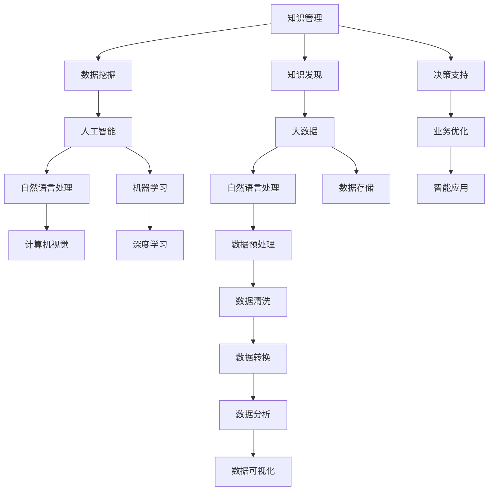

                 

# 知识管理与知识发现：企业智能化的双翼

> 关键词：知识管理, 知识发现, 企业智能化, 数据挖掘, 大数据, 人工智能

## 1. 背景介绍

### 1.1 问题由来
随着信息化、数字化时代的到来，企业积累的数据量呈爆炸性增长。这些数据中蕴含着巨大的商业价值和决策信息，然而，如何有效地管理和利用这些数据，挖掘出其中的隐含知识和智慧，是企业智能化面临的核心挑战。知识管理与知识发现技术，通过自动化、智能化的方式，帮助企业在数据海洋中提取有价值的知识和洞见，为决策提供强有力的支持。

### 1.2 问题核心关键点
1. **知识管理**：指对企业内部知识资源进行识别、捕获、组织、共享、维护、评估和应用的实践和活动。它通过人机协同的方式，将个人和团队的智慧转化为企业的竞争优势。
2. **知识发现**：指通过数据挖掘、人工智能等技术手段，从数据中发现新的模式、趋势、关系和异常的过程。知识发现是知识管理的核心环节，其目标是挖掘出隐藏在数据背后的知识和洞见，指导企业决策和战略制定。
3. **企业智能化**：指利用人工智能和机器学习技术，优化企业运营流程，提升企业竞争力，增强企业对市场的响应速度和适应能力。
4. **数据挖掘**：指从大量数据中提取有用信息和知识的过程，通常涉及统计分析、机器学习、自然语言处理等技术。
5. **大数据**：指数据量庞大、数据类型多样、数据来源广泛、数据生成速度快、数据处理复杂的数据集合。大数据技术为知识发现提供了坚实的技术基础。
6. **人工智能**：指模拟人类智能行为的技术，包括机器学习、深度学习、自然语言处理、计算机视觉等分支，是知识发现的强大工具。

这些概念之间的逻辑关系可以通过以下Mermaid流程图来展示：



这个流程图展示了几大核心概念及其之间的关系：

1. 知识管理为数据挖掘和知识发现提供源数据和组织结构。
2. 数据挖掘通过提取数据中的模式和关系，为知识发现提供支持。
3. 人工智能技术如机器学习和深度学习，是知识发现的核心工具。
4. 大数据技术提供了数据采集、存储、处理的基础设施。
5. 知识发现的结果支持企业决策和业务优化，形成智能应用。

这些概念共同构成了企业知识管理的框架，使得企业能够在数据驱动的基础上，实现智能化转型。

## 2. 核心概念与联系

### 2.1 核心概念概述

为了更好地理解知识管理与知识发现技术，本节将介绍几个密切相关的核心概念：

- **知识管理**：通过信息技术手段，将个人和团队的智慧转化为企业的知识资产。知识管理包括知识获取、知识表示、知识共享、知识应用等多个环节。
- **知识发现**：利用数据挖掘和人工智能技术，从数据中提取有价值的知识和洞见。知识发现的关键是发现数据中的模式、趋势、关联和异常，并应用于决策支持。
- **数据挖掘**：从大量数据中自动地发现有意义的信息和知识的过程，涵盖数据清洗、数据变换、模型构建、结果验证等步骤。
- **大数据**：指海量、高速、多样、复杂的数据集合。大数据技术为数据挖掘提供了技术手段和基础设施。
- **人工智能**：模拟人类智能行为的技术，包括机器学习、深度学习、自然语言处理、计算机视觉等分支。
- **自然语言处理**：指使计算机能够理解和处理人类语言的技术，涵盖文本分析、情感分析、实体识别等应用。
- **机器学习**：通过算法让计算机从数据中学习，并进行预测和决策。
- **深度学习**：一种特殊的机器学习技术，通过多层次的非线性模型，从数据中自动提取特征。
- **计算机视觉**：使计算机能够理解和处理图像、视频等视觉数据的技术。

这些概念之间的联系紧密，相互支撑，共同构成了企业知识管理和知识发现的完整体系。

### 2.2 核心概念原理和架构的 Mermaid 流程图


## 3. 核心算法原理 & 具体操作步骤

### 3.1 算法原理概述

知识管理与知识发现技术的核心原理，是通过数据挖掘和人工智能技术，从数据中提取有价值的知识和洞见，以支持企业决策和业务优化。其算法流程一般包括数据获取、数据预处理、特征工程、模型构建、模型评估和模型应用等步骤。

知识管理与知识发现技术的关键在于数据质量和特征工程。高质量的数据是进行知识发现的前提，而特征工程则决定了模型能否准确地提取数据中的有价值信息。常见的特征工程技术包括：

1. 数据清洗：去除数据中的噪声、重复、异常值等，保证数据质量。
2. 数据变换：将原始数据转化为模型可用的形式，如归一化、标准化、编码等。
3. 特征选择：选择对模型预测有用的特征，去除无关或冗余特征，减少计算复杂度。
4. 特征提取：从原始数据中提取新的特征，如文本中的TF-IDF、图像中的边缘信息等。

知识发现技术的核心是模型构建和评估。常见的模型包括：

1. 分类模型：如决策树、随机森林、支持向量机等，用于预测类别或标签。
2. 聚类模型：如K-Means、层次聚类等，用于发现数据中的自然分组。
3. 关联规则模型：如Apriori算法、FP-Growth等，用于发现数据中的关联关系。
4. 时间序列模型：如ARIMA、LSTM等，用于预测时间序列数据。

知识发现技术的评估包括模型准确性、泛化能力、可解释性等多个方面。常见的评估指标包括：

1. 准确率：模型预测的正确率。
2. 召回率：模型捕获的正样本占总正样本的比例。
3. F1分数：准确率和召回率的调和平均数。
4. AUC值：ROC曲线下的面积，用于评估二分类模型的性能。
5. R2分数：回归模型拟合数据的程度。

### 3.2 算法步骤详解

知识管理与知识发现技术的实施步骤包括：

**Step 1: 数据准备**

- 收集企业内外的数据资源，如财务报表、客户反馈、社交媒体、市场数据等。
- 清洗和整理数据，去除噪声和冗余，保证数据质量。
- 将数据按照任务需求进行预处理，如归一化、标准化、编码等。

**Step 2: 特征工程**

- 选择和提取有用的特征，构建特征集。
- 进行特征选择，去除无关或冗余特征。
- 进行特征提取，如文本中的TF-IDF、图像中的边缘信息等。

**Step 3: 模型构建**

- 选择合适的模型算法，如分类、聚类、关联规则等。
- 构建和训练模型，调整模型参数，优化模型性能。
- 进行交叉验证，防止过拟合。

**Step 4: 模型评估**

- 使用评估指标，如准确率、召回率、F1分数等，评估模型性能。
- 使用ROC曲线、AUC值等可视化模型性能。
- 进行模型优化和调参，提升模型效果。

**Step 5: 模型应用**

- 将训练好的模型应用到实际业务场景中。
- 实时监控和更新模型，保持模型性能。
- 不断反馈和迭代，改进模型效果。

### 3.3 算法优缺点

知识管理与知识发现技术的优点在于其高度的自动化和智能化，能够从海量数据中快速提取有价值的知识和洞见。此外，其可解释性和可操作性，使得企业能够直观地理解模型的预测结果，并根据需要进行调整。

然而，知识管理与知识发现技术也存在一些局限性：

1. 数据依赖性高：高质量的数据是进行知识发现的前提，但获取高质量数据往往需要大量的人力和时间成本。
2. 算法复杂度高：模型构建和评估涉及大量的计算和数据处理，对计算资源要求较高。
3. 模型可解释性不足：复杂的机器学习模型，如深度学习模型，往往难以解释其内部的决策逻辑。
4. 应用场景受限：知识管理与知识发现技术主要应用于结构化数据，对于非结构化数据（如文本、图像等）的处理能力较弱。

### 3.4 算法应用领域

知识管理与知识发现技术在多个领域得到了广泛应用，包括但不限于：

- **金融风险管理**：通过分析历史交易数据，识别潜在的风险点，预测金融市场的变化趋势。
- **市场营销分析**：从客户数据中提取有价值的信息，优化营销策略，提高客户满意度。
- **人力资源管理**：分析员工绩效数据，识别优秀员工的关键特征，提升人才管理水平。
- **供应链管理**：通过分析供应链数据，优化库存管理，提高供应链效率。
- **医疗健康管理**：从患者数据中提取疾病特征，支持疾病诊断和治疗决策。
- **智能客服系统**：通过分析客户反馈和历史对话数据，提升客户服务质量，优化客户体验。

## 4. 数学模型和公式 & 详细讲解 & 举例说明

### 4.1 数学模型构建

知识管理与知识发现技术涉及多种数学模型，包括回归模型、分类模型、聚类模型等。以分类模型为例，假设训练集为 $D=\{(x_i,y_i)\}_{i=1}^N$，其中 $x_i$ 为输入特征向量，$y_i$ 为输出标签，分类模型的目标是找到一个函数 $f(x)$，使得 $f(x_i)$ 的输出与 $y_i$ 尽量接近。常见的分类模型包括逻辑回归、决策树、随机森林等。

以逻辑回归模型为例，其数学模型构建如下：

$$
f(x_i) = \sigma(W \cdot x_i + b)
$$

其中，$W$ 和 $b$ 为模型的参数，$\sigma$ 为sigmoid函数，将模型的输出映射到[0,1]区间内，表示模型预测该样本属于正类的概率。

### 4.2 公式推导过程

逻辑回归模型的损失函数定义为交叉熵损失函数：

$$
L(y,\hat{y}) = -(y\log \hat{y} + (1-y)\log (1-\hat{y}))
$$

在训练集上，经验风险为：

$$
\mathcal{L}(W,b) = \frac{1}{N}\sum_{i=1}^N L(y_i,f(x_i))
$$

优化目标是最小化损失函数：

$$
\min_{W,b} \mathcal{L}(W,b)
$$

使用梯度下降算法更新模型参数：

$$
W \leftarrow W - \eta \nabla_{W}\mathcal{L}(W,b)
$$

$$
b \leftarrow b - \eta \nabla_{b}\mathcal{L}(W,b)
$$

其中，$\eta$ 为学习率，$\nabla_{W}\mathcal{L}(W,b)$ 和 $\nabla_{b}\mathcal{L}(W,b)$ 分别为损失函数对 $W$ 和 $b$ 的梯度。

### 4.3 案例分析与讲解

假设某金融公司需要预测客户是否会违约，从历史数据中提取了多个特征，包括信用评分、收入水平、贷款金额等。通过逻辑回归模型对这些特征进行建模，得到预测概率。

具体步骤如下：

1. 数据准备：收集历史客户数据，包括客户基本信息、贷款信息、还款记录等。
2. 特征工程：选择有用的特征，如信用评分、收入水平、贷款金额等，并进行归一化处理。
3. 模型构建：使用逻辑回归模型对数据进行建模，计算预测概率。
4. 模型评估：使用交叉验证评估模型性能，调整模型参数，提升模型效果。
5. 模型应用：将训练好的模型应用到新客户数据中，预测其违约概率。

## 5. 项目实践：代码实例和详细解释说明

### 5.1 开发环境搭建

在进行知识管理与知识发现技术项目实践前，我们需要准备好开发环境。以下是使用Python进行Scikit-learn开发的Python环境配置流程：

1. 安装Anaconda：从官网下载并安装Anaconda，用于创建独立的Python环境。

2. 创建并激活虚拟环境：
```bash
conda create -n scikit-learn-env python=3.8 
conda activate scikit-learn-env
```

3. 安装Scikit-learn：
```bash
pip install scikit-learn
```

4. 安装各类工具包：
```bash
pip install numpy pandas scikit-learn matplotlib tqdm jupyter notebook ipython
```

完成上述步骤后，即可在`scikit-learn-env`环境中开始项目实践。

### 5.2 源代码详细实现

下面我们以金融风险管理为例，给出使用Scikit-learn对逻辑回归模型进行训练和预测的Python代码实现。

首先，定义数据预处理函数：

```python
import pandas as pd
from sklearn.model_selection import train_test_split
from sklearn.preprocessing import StandardScaler

def preprocess_data(data_path, target_column):
    data = pd.read_csv(data_path)
    target = data[target_column]
    features = data.drop(target_column, axis=1)
    scaler = StandardScaler()
    scaled_features = scaler.fit_transform(features)
    train_features, test_features, train_target, test_target = train_test_split(scaled_features, target, test_size=0.2, random_state=42)
    return train_features, test_features, train_target, test_target
```

然后，定义模型训练和评估函数：

```python
from sklearn.linear_model import LogisticRegression
from sklearn.metrics import accuracy_score

def train_model(train_features, train_target):
    model = LogisticRegression()
    model.fit(train_features, train_target)
    return model

def evaluate_model(model, test_features, test_target):
    y_pred = model.predict(test_features)
    accuracy = accuracy_score(test_target, y_pred)
    return accuracy
```

接着，定义主函数：

```python
if __name__ == '__main__':
    train_features, test_features, train_target, test_target = preprocess_data('data.csv', 'default')
    model = train_model(train_features, train_target)
    accuracy = evaluate_model(model, test_features, test_target)
    print(f'Model accuracy: {accuracy:.2f}')
```

以上就是使用Scikit-learn对逻辑回归模型进行训练和预测的完整代码实现。可以看到，Scikit-learn提供了方便的API，可以轻松地进行模型训练和评估。

### 5.3 代码解读与分析

让我们再详细解读一下关键代码的实现细节：

**preprocess_data函数**：
- `train_test_split`方法：将数据集划分为训练集和测试集。
- `StandardScaler`类：对特征进行归一化处理。
- `drop`方法：删除目标列，只保留特征列。

**train_model函数**：
- `LogisticRegression`类：定义逻辑回归模型。
- `fit`方法：训练模型。

**evaluate_model函数**：
- `predict`方法：使用模型进行预测。
- `accuracy_score`函数：计算模型准确率。

**主函数**：
- `if __name__ == '__main__':`：判断是否为主函数执行。
- `preprocess_data`和`train_model`：分别进行数据预处理和模型训练。
- `evaluate_model`：评估模型性能。

## 6. 实际应用场景

### 6.1 智能客服系统

知识管理与知识发现技术可以广泛应用于智能客服系统的构建。通过分析历史客服数据，挖掘客户常见问题和解决方案，构建知识库，并应用到实时客服场景中。智能客服系统能够根据客户输入的自然语言，从知识库中查找并生成最佳答复，提高客户满意度和服务效率。

### 6.2 市场营销分析

知识管理与知识发现技术可以用于市场营销分析，通过分析客户数据，挖掘客户偏好和行为模式，指导企业制定精准的营销策略。通过分析社交媒体和市场数据，企业可以发现新的市场机会和趋势，优化广告投放和促销活动。

### 6.3 人力资源管理

知识管理与知识发现技术可以应用于人力资源管理，通过分析员工绩效数据，识别优秀员工的关键特征，优化招聘和培训流程。通过分析离职数据，企业可以识别离职风险因素，制定留才策略。

### 6.4 供应链管理

知识管理与知识发现技术可以应用于供应链管理，通过分析供应链数据，优化库存管理，提高供应链效率。通过分析物流数据，企业可以发现物流瓶颈，优化运输路线和仓储布局。

### 6.5 医疗健康管理

知识管理与知识发现技术可以应用于医疗健康管理，通过分析患者数据，支持疾病诊断和治疗决策。通过分析临床数据，企业可以发现新的疾病特征和治疗方法，提升医疗水平。

## 7. 工具和资源推荐

### 7.1 学习资源推荐

为了帮助开发者系统掌握知识管理与知识发现技术的理论基础和实践技巧，这里推荐一些优质的学习资源：

1. 《数据挖掘导论》（Jerry Kohavi、Andrew Ng等著）：系统介绍数据挖掘的基本概念、方法和技术，涵盖分类、聚类、关联规则等多个方面。

2. 《Python数据科学手册》（Jake VanderPlas著）：介绍Python在数据科学中的应用，涵盖数据清洗、数据可视化、机器学习等多个方面。

3. 《机器学习实战》（Peter Harrington著）：介绍机器学习的基本概念和常用算法，涵盖回归、分类、聚类等多个方面。

4. Coursera《机器学习》课程（Andrew Ng主讲）：斯坦福大学开设的机器学习课程，深入浅出地介绍机器学习的基本原理和常用算法。

5. Kaggle：数据科学竞赛平台，提供丰富的数据集和案例，帮助开发者实践数据挖掘和机器学习技能。

通过对这些资源的学习实践，相信你一定能够快速掌握知识管理与知识发现技术的精髓，并用于解决实际的业务问题。

### 7.2 开发工具推荐

高效的开发离不开优秀的工具支持。以下是几款用于知识管理与知识发现技术开发的常用工具：

1. Python：通用编程语言，拥有丰富的数据科学库和工具。

2. Scikit-learn：Python机器学习库，提供了多种常用的机器学习算法和工具。

3. TensorFlow：由Google主导开发的深度学习框架，生产部署方便，适合大规模工程应用。

4. PyTorch：开源深度学习框架，灵活动态的计算图，适合快速迭代研究。

5. Jupyter Notebook：交互式编程环境，支持Python、R等多种语言，方便开发者快速实验和分享代码。

6. Weights & Biases：模型训练的实验跟踪工具，可以记录和可视化模型训练过程中的各项指标，方便对比和调优。

7. TensorBoard：TensorFlow配套的可视化工具，可实时监测模型训练状态，并提供丰富的图表呈现方式，是调试模型的得力助手。

合理利用这些工具，可以显著提升知识管理与知识发现技术项目的开发效率，加快创新迭代的步伐。

### 7.3 相关论文推荐

知识管理与知识发现技术的发展源于学界的持续研究。以下是几篇奠基性的相关论文，推荐阅读：

1. “A Survey on Data Mining and Statistical Learning”（Joachims、Freise等著）：综述数据挖掘和机器学习的基本概念和常用算法，涵盖分类、聚类、关联规则等多个方面。

2. “A New Method for Designing Comparison Tests for Machine Learning”（Joachims著）：提出比较测试方法，评估不同机器学习算法的性能。

3. “Scikit-learn: Machine Learning in Python”（Bottou等著）：介绍Scikit-learn机器学习库的使用，涵盖数据预处理、特征工程、模型构建等多个方面。

4. “Adaptive Boosting”（Freund、Schapire著）：提出Adaboost算法，通过迭代调整样本权重，提升分类器的性能。

5. “Deep Learning”（Goodfellow、Bengio、Courville著）：介绍深度学习的基本概念和常用算法，涵盖神经网络、卷积神经网络、循环神经网络等多个方面。

这些论文代表了大数据和机器学习技术的发展脉络。通过学习这些前沿成果，可以帮助研究者把握学科前进方向，激发更多的创新灵感。

## 8. 总结：未来发展趋势与挑战

### 8.1 研究成果总结

知识管理与知识发现技术经过多年的发展，已经在多个领域得到了广泛应用，并取得了显著成效。其主要研究成果包括：

1. 数据挖掘和机器学习算法的研究与优化。
2. 大数据技术和分布式计算技术的应用与优化。
3. 自然语言处理技术的创新与应用。
4. 知识表示与知识工程方法的研究与探索。
5. 企业知识管理和组织知识的实践与优化。

### 8.2 未来发展趋势

展望未来，知识管理与知识发现技术将呈现以下几个发展趋势：

1. **深度学习与大数据的融合**：深度学习技术在知识发现中的应用将更加广泛，结合大数据技术，能够处理更加复杂的数据集和任务。

2. **多模态数据的融合**：知识管理与知识发现技术将逐步扩展到多模态数据的处理，如文本、图像、视频等，形成更加全面的信息融合能力。

3. **自动化与智能化**：知识管理与知识发现技术将进一步自动化和智能化，通过人工智能技术，实现知识发现的全流程自动化。

4. **跨领域知识管理**：知识管理与知识发现技术将更加注重跨领域知识的整合与共享，形成更加全面的知识体系。

5. **可解释性与透明性**：知识管理与知识发现技术将更加注重模型的可解释性和透明性，使得企业能够直观地理解模型的预测结果和决策逻辑。

6. **安全与隐私保护**：知识管理与知识发现技术将更加注重数据隐私和安全保护，防止数据泄露和滥用。

7. **边缘计算与实时分析**：知识管理与知识发现技术将更加注重边缘计算和实时分析，提高数据处理的时效性和效率。

以上趋势凸显了知识管理与知识发现技术的前沿性和发展潜力。这些方向的探索发展，将进一步提升企业决策的科学性和智能化水平，为企业的智能化转型提供更强大的支持。

### 8.3 面临的挑战

尽管知识管理与知识发现技术已经取得了显著成果，但在迈向更加智能化、普适化应用的过程中，仍面临诸多挑战：

1. **数据质量与标注成本**：高质量的数据是知识发现的前提，但标注数据的成本和获取难度较大，制约了知识发现的发展。

2. **算法复杂性与可解释性**：复杂的机器学习算法，如深度学习，难以解释其内部的决策逻辑，增加了模型的复杂性和理解难度。

3. **跨领域知识的整合**：跨领域知识的整合与共享，需要建立统一的知识表示方法，形成完整的知识体系，这将是一个长期且复杂的过程。

4. **数据隐私与安全保护**：大数据技术在知识发现中的应用，增加了数据隐私和安全的风险，需要建立严格的数据保护机制。

5. **技术融合与协同**：知识管理与知识发现技术需要与其他技术，如自然语言处理、人工智能等，进行深入融合，协同工作，形成更加全面的信息处理能力。

6. **多模态数据处理**：多模态数据的融合处理，需要建立统一的数据表示和处理方法，这将是一个复杂的任务。

### 8.4 研究展望

面对知识管理与知识发现技术所面临的诸多挑战，未来的研究需要在以下几个方面寻求新的突破：

1. **深度学习与大数据的融合**：研究深度学习技术在大数据上的应用与优化，提升数据处理能力和模型性能。

2. **多模态数据的融合**：研究多模态数据的融合处理技术，形成更加全面的信息融合能力。

3. **自动化与智能化**：研究知识发现的全流程自动化技术，提高知识发现的速度和效率。

4. **跨领域知识的整合**：研究跨领域知识的整合与共享方法，形成完整的知识体系。

5. **可解释性与透明性**：研究模型的可解释性和透明性方法，提高模型的可信度和可理解性。

6. **安全与隐私保护**：研究数据隐私和安全保护技术，防止数据泄露和滥用。

7. **边缘计算与实时分析**：研究边缘计算和实时分析技术，提高数据处理的时效性和效率。

这些研究方向的探索，将引领知识管理与知识发现技术迈向更高的台阶，为构建安全、可靠、可解释、可控的智能系统铺平道路。面向未来，知识管理与知识发现技术还需要与其他人工智能技术进行更深入的融合，如知识表示、因果推理、强化学习等，多路径协同发力，共同推动自然语言理解和智能交互系统的进步。只有勇于创新、敢于突破，才能不断拓展知识管理的边界，让智能技术更好地造福人类社会。

## 9. 附录：常见问题与解答

**Q1：知识管理与知识发现技术的主要应用场景有哪些？**

A: 知识管理与知识发现技术在多个领域得到了广泛应用，包括但不限于：

1. 金融风险管理：通过分析历史交易数据，识别潜在的风险点，预测金融市场的变化趋势。

2. 市场营销分析：从客户数据中提取有价值的信息，优化营销策略，提高客户满意度。

3. 人力资源管理：分析员工绩效数据，识别优秀员工的关键特征，提升人才管理水平。

4. 供应链管理：通过分析供应链数据，优化库存管理，提高供应链效率。

5. 医疗健康管理：从患者数据中提取疾病特征，支持疾病诊断和治疗决策。

6. 智能客服系统：通过分析历史客服数据，构建知识库，提高客户服务质量。

**Q2：如何提高知识管理与知识发现技术的效率和效果？**

A: 提高知识管理与知识发现技术的效率和效果，可以从以下几个方面入手：

1. 优化数据预处理流程，减少数据清洗和特征提取的计算量。

2. 选择合适的机器学习算法，优化模型参数，提高模型的准确性和泛化能力。

3. 使用特征选择方法，去除无关或冗余特征，减少计算复杂度。

4. 引入模型集成技术，如Bagging、Boosting等，提升模型的鲁棒性和稳定性。

5. 使用分布式计算技术，如Hadoop、Spark等，加速数据处理和模型训练。

6. 使用模型压缩技术，如剪枝、量化等，减小模型大小，提升推理速度。

**Q3：知识管理与知识发现技术的未来发展方向有哪些？**

A: 知识管理与知识发现技术的未来发展方向包括：

1. 深度学习与大数据的融合：提升数据处理能力和模型性能。

2. 多模态数据的融合：形成更加全面的信息融合能力。

3. 自动化与智能化：提高知识发现的速度和效率。

4. 跨领域知识的整合：形成完整的知识体系。

5. 可解释性与透明性：提高模型的可信度和可理解性。

6. 安全与隐私保护：防止数据泄露和滥用。

7. 边缘计算与实时分析：提高数据处理的时效性和效率。

**Q4：知识管理与知识发现技术的实现过程中，如何保证数据的质量？**

A: 保证数据的质量，可以从以下几个方面入手：

1. 数据清洗：去除数据中的噪声、重复、异常值等，保证数据质量。

2. 数据归一化：对数据进行归一化处理，保证数据一致性。

3. 数据标注：对数据进行标注，保证数据的准确性和一致性。

4. 数据采样：使用采样方法，保证样本的代表性。

5. 数据验证：对数据进行验证，保证数据的完整性和一致性。

**Q5：知识管理与知识发现技术在实际应用中，需要注意哪些问题？**

A: 知识管理与知识发现技术在实际应用中，需要注意以下几个问题：

1. 数据隐私与安全：确保数据的安全性和隐私保护，防止数据泄露和滥用。

2. 模型可解释性：保证模型的可解释性和透明性，便于理解和调整。

3. 算法复杂性：避免使用过于复杂的算法，保证模型的简洁性和可维护性。

4. 多模态数据融合：处理多模态数据时，需要建立统一的数据表示和处理方法。

5. 跨领域知识整合：跨领域知识的整合需要建立统一的知识表示方法，形成完整的知识体系。

6. 数据标注成本：标注数据需要大量的人力和时间成本，需要找到高效的数据标注方法。

7. 模型鲁棒性：保证模型的鲁棒性和泛化能力，防止模型过拟合。

8. 数据质量：保证数据的质量，防止数据噪声和偏差。

以上问题需要在实际应用中加以注意和解决，才能充分发挥知识管理与知识发现技术的优势，实现智能化转型。

---

作者：禅与计算机程序设计艺术 / Zen and the Art of Computer Programming

