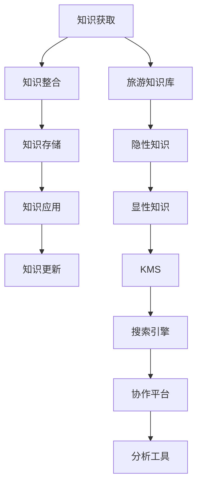

                 

## 1. 背景介绍

旅游业是一个集技术、营销、服务、管理于一体的复杂行业。随着数字技术的进步和用户需求的多样化，传统旅游业正面临着一场深刻的变革。与此同时，全球化竞争日趋激烈，旅游业的客户关系管理、市场运营、资源配置、服务体验等各个环节都要求更高效的协同管理，以提高运营效率和服务质量。知识管理在旅游业中的应用，正逐渐成为提升行业竞争力、优化运营管理的重要手段。

### 1.1 行业现状与挑战

旅游业传统的管理模式以人工为主，信息化程度低。信息孤岛现象普遍存在，导致数据碎片化、信息不对称、决策依据不足等问题。同时，随着消费者需求的日益个性化和多样化，传统旅游服务已经难以满足高品质的旅游体验。此外，随着全球新冠疫情的持续影响，旅游业受到的打击更为显著，亟需通过数字手段实现“触手可及”的服务，提升旅游产品的竞争力。

### 1.2 知识管理概述

知识管理（Knowledge Management, KM）是指将个人和组织所拥有的知识资源进行系统化、结构化、持续化的管理和利用。知识管理不仅包括对知识的收集、整理、存储、检索和共享，还包括对知识的发现、创新和应用，其目的是提高组织对外部环境的应变能力和内部效率。

知识管理技术在旅游业中的应用，主要体现在以下几个方面：

1. **客户知识管理**：通过收集和分析客户行为数据，预测客户需求，提升客户满意度。
2. **产品知识管理**：通过管理旅游产品的知识库，为个性化定制和动态定价提供支持。
3. **运营知识管理**：通过优化运营流程，提高资源利用率和服务质量。
4. **服务知识管理**：通过集成的服务网络，提供统一的、多渠道的客户服务。
5. **市场知识管理**：通过市场调研和数据分析，提升市场分析和决策能力。

### 1.3 知识管理的价值

旅游业中的知识管理能够帮助企业更有效地收集、组织和利用知识资源，从而提高运营效率，降低成本，提升服务质量，增强市场竞争力。

## 2. 核心概念与联系

### 2.1 核心概念

#### 2.1.1 知识分类

知识可分为显性知识和隐性知识。显性知识是指可以通过文字、图表、数据等形式表达出来的知识；隐性知识是指嵌在个体经验、技能和直觉中的难以传授的知识。

#### 2.1.2 知识管理流程

知识管理流程包括知识获取、知识整合、知识存储、知识应用、知识更新等环节。通过高效的流程管理，知识能够从生产者传递到使用者，实现知识的价值最大化。

#### 2.1.3 知识管理系统

知识管理系统（Knowledge Management System, KMS）是一个集成了数据仓库、搜索引擎、协作平台和分析工具的综合性知识管理平台。KMS的核心功能包括知识采集、分类、检索、共享、交流和应用等。

#### 2.1.4 旅游知识库

旅游知识库是指旅游业中用于存储、管理和检索各类知识资源的系统。旅游知识库可以涵盖旅游景点、旅行线路、酒店信息、客户评价、旅游政策等多方面的信息，是旅游业知识管理的重要基础设施。

### 2.2 核心概念联系

通过Mermaid流程图来展示知识管理流程和核心概念之间的关系：



## 3. 核心算法原理 & 具体操作步骤

### 3.1 算法原理概述

知识管理在旅游业的应用，主要涉及以下几个核心算法：

1. **自然语言处理（NLP）**：用于知识采集和分类，从海量文本中自动提取有价值的信息。
2. **推荐系统**：通过用户行为数据，推荐个性化的旅游产品和服务。
3. **预测模型**：通过机器学习算法，对客户需求、旅游趋势等进行预测和分析。
4. **时序数据库**：用于存储和管理时间序列数据，支持实时数据分析和决策。
5. **图像识别**：通过计算机视觉技术，自动识别和提取图片中的旅游信息。

### 3.2 算法步骤详解

以下详细介绍旅游业知识管理的具体操作流程：

#### 3.2.1 知识采集

旅游知识采集主要通过以下步骤：

1. **数据源整合**：整合不同来源的数据源，如客户反馈、旅游日志、社交媒体、旅游论坛等。
2. **数据清洗**：去除数据中的噪声和无用信息，提高数据质量。
3. **数据标注**：对数据进行标注，构建统一的知识分类体系。

#### 3.2.2 知识分类

旅游知识分类主要涉及以下几个维度：

1. **目的地信息**：包括地理位置、天气、气温、交通便利性等。
2. **产品信息**：包括旅游线路、住宿、餐饮、景点、活动等。
3. **客户信息**：包括客户画像、消费偏好、旅行历史等。
4. **服务信息**：包括客户服务、预订服务、投诉处理等。
5. **市场信息**：包括市场趋势、竞争情报、价格信息等。

#### 3.2.3 知识存储

旅游知识存储主要涉及以下几个方面：

1. **数据仓库**：用于存储结构化数据，支持数据查询和分析。
2. **文档管理系统**：用于存储非结构化文档和图片，支持全文检索。
3. **图形数据库**：用于存储复杂的关系型数据，支持高效的查询和分析。
4. **时序数据库**：用于存储时间序列数据，支持实时数据分析和决策。

#### 3.2.4 知识应用

旅游知识应用主要涉及以下几个方面：

1. **个性化推荐**：通过客户画像和行为数据，推荐个性化的旅游产品和服务。
2. **实时查询**：通过搜索引擎和协作平台，快速获取旅游信息和知识。
3. **客户服务**：通过智能客服机器人，提供全天候的客户服务。
4. **运营优化**：通过数据分析和预测模型，优化旅游运营流程和资源配置。
5. **市场分析**：通过市场调研和数据分析，提升市场分析和决策能力。

#### 3.2.5 知识更新

旅游知识更新主要涉及以下几个方面：

1. **数据同步**：定期同步数据源和知识库，保证数据的时效性。
2. **知识迭代**：通过用户反馈和专家评估，不断优化和更新知识库。
3. **版本控制**：对知识库进行版本控制，记录每次更新的内容和时间。

### 3.3 算法优缺点

#### 3.3.1 优点

1. **提升运营效率**：通过系统化的知识管理，可以显著提升旅游业的运营效率。
2. **降低运营成本**：通过知识共享和重复利用，可以减少重复工作，降低运营成本。
3. **提高客户满意度**：通过个性化推荐和实时查询，可以提升客户体验和满意度。
4. **增强市场竞争力**：通过市场分析和运营优化，可以提升旅游产品和服务质量，增强市场竞争力。

#### 3.3.2 缺点

1. **数据隐私问题**：旅游知识管理涉及大量的个人和组织数据，需要严格遵守数据隐私法规。
2. **技术复杂度高**：知识管理的实施需要高水平的技术支撑，对技术团队要求较高。
3. **数据质量问题**：数据采集和标注的准确性对知识管理的效果有直接影响，需要投入大量人力和时间。
4. **知识更新难度大**：旅游市场变化快，知识库的更新和迭代需要持续投入，成本较高。

### 3.4 算法应用领域

知识管理在旅游业的应用主要包括以下几个领域：

1. **客户关系管理（CRM）**：通过客户知识管理，提高客户忠诚度和满意度。
2. **产品管理**：通过产品知识管理，提升产品品质和市场竞争力。
3. **运营管理**：通过运营知识管理，优化资源配置和运营流程。
4. **服务管理**：通过服务知识管理，提供高效、一致的客户服务。
5. **市场管理**：通过市场知识管理，提升市场分析和决策能力。

## 4. 数学模型和公式 & 详细讲解 & 举例说明

### 4.1 数学模型构建

旅游业知识管理主要涉及以下数学模型：

1. **协同过滤推荐算法**：用于个性化推荐旅游产品和服务。
2. **时间序列分析模型**：用于预测旅游市场的趋势和变化。
3. **文本分类算法**：用于从旅游评论和论坛中提取和分类知识。
4. **图像识别模型**：用于自动识别和提取旅游图片中的信息。

### 4.2 公式推导过程

以协同过滤推荐算法为例，公式推导如下：

设用户 $u$ 对旅游产品 $i$ 的评分 $r_{ui}$，物品 $i$ 和物品 $j$ 的相似度为 $sim(i,j)$，则用户 $u$ 对物品 $j$ 的预测评分 $r_{uj}$ 可表示为：

$$
r_{uj} = \sum_{i \in I} r_{ui} \cdot sim(i,j)
$$

其中，$I$ 表示所有物品的集合。

### 4.3 案例分析与讲解

假设某旅游公司有1000个用户，每个用户对20个旅游产品的评分如表所示：

| 用户编号 | 产品编号 | 评分 |
|----------|----------|------|
| 1        | 产品1     | 4    |
| 1        | 产品2     | 3    |
| 1        | 产品3     | 5    |
| ...      | ...      | ...  |
| 1000      | 产品1     | 2    |
| 1000      | 产品2     | 4    |

设用户1000对产品4的预测评分为 $r_{1000,4}$，产品1和产品2的相似度为 $sim(1,2)=0.8$，产品1和产品3的相似度为 $sim(1,3)=0.6$，产品2和产品3的相似度为 $sim(2,3)=0.9$。

假设用户1和用户2对产品3的评分分别记为 $r_{12}$ 和 $r_{23}$，则 $r_{uj}$ 的计算过程如下：

$$
r_{uj} = r_{12} \cdot sim(1,2) + r_{23} \cdot sim(2,3) = 3 \times 0.8 + 5 \times 0.9 = 9.3
$$

因此，用户1000对产品4的预测评分为 $r_{1000,4}=9.3$。

## 5. 项目实践：代码实例和详细解释说明

### 5.1 开发环境搭建

旅游业知识管理的开发环境搭建主要涉及以下步骤：

1. **选择编程语言**：推荐使用Python和R，因为这两个语言在数据处理和分析方面具有强大的生态系统。
2. **安装开发环境**：使用Anaconda或Docker搭建开发环境，安装必要的库和工具包，如Pandas、NumPy、Scikit-learn、TensorFlow等。
3. **数据采集工具**：使用Scrapy、BeautifulSoup等工具，从网站、论坛、社交媒体等采集数据。
4. **数据清洗工具**：使用Pandas、OpenRefine等工具，对采集到的数据进行清洗和预处理。
5. **数据存储工具**：使用Hadoop、Spark等大数据平台，存储和管理海量数据。
6. **知识管理平台**：使用Elasticsearch、Solr等搜索引擎，构建知识管理平台，实现知识检索和共享。

### 5.2 源代码详细实现

以下是一个简单的旅游知识管理系统的源代码实现：

```python
import pandas as pd
from sklearn.feature_extraction.text import CountVectorizer
from sklearn.metrics.pairwise import cosine_similarity

# 读取旅游数据
df = pd.read_csv('tourism_data.csv')

# 数据预处理
# ...

# 构建知识库
knowledge_base = {
    '目的地信息': [],
    '产品信息': [],
    '客户信息': [],
    '服务信息': [],
    '市场信息': []
}

# 数据标注和分类
# ...

# 数据存储
# ...

# 知识检索和推荐
# ...

# 知识应用
# ...

# 知识更新
# ...
```

### 5.3 代码解读与分析

该代码实现主要包括以下几个步骤：

1. **数据读取**：使用Pandas库读取旅游数据。
2. **数据预处理**：对数据进行清洗、去重、填充等预处理操作，保证数据质量。
3. **知识分类**：将数据按类别进行分类，构建知识库。
4. **知识存储**：使用文档管理系统和图形数据库等工具，存储和管理知识库中的数据。
5. **知识检索**：使用搜索引擎实现知识库的快速检索和查询。
6. **知识推荐**：通过协同过滤推荐算法，生成个性化推荐列表。
7. **知识应用**：通过API接口和协作平台，提供实时查询和知识共享服务。
8. **知识更新**：定期同步数据源和知识库，进行知识迭代和版本控制。

## 6. 实际应用场景

### 6.1 客户关系管理（CRM）

旅游CRM系统通过知识管理技术，整合客户反馈、消费记录、旅行历史等数据，构建客户画像，实现客户需求的精准预测和个性化推荐。例如，通过客户反馈数据，旅游公司可以及时了解客户需求和满意度，调整产品和服务策略，提升客户忠诚度。

### 6.2 产品管理

旅游产品知识管理技术，通过对旅游产品的知识库进行管理，提供个性化的旅游产品推荐和服务。例如，通过旅游知识库，旅游公司可以为不同客户提供定制化的旅游线路和服务，提升客户体验和满意度。

### 6.3 运营管理

旅游运营知识管理技术，通过对旅游运营流程的数据进行管理和优化，提高资源利用率和运营效率。例如，通过分析运营数据，旅游公司可以优化酒店和交通工具的资源配置，提升旅游服务的质量。

### 6.4 服务管理

旅游服务知识管理技术，通过智能客服机器人，提供全天候的客户服务，提升客户满意度。例如，通过智能客服机器人，旅游公司可以自动解答客户的常见问题，提供实时的客户支持。

### 6.5 市场管理

旅游市场知识管理技术，通过市场调研和数据分析，提升市场分析和决策能力。例如，通过分析市场趋势和竞争情报，旅游公司可以及时调整市场营销策略，提升市场竞争力。

## 7. 工具和资源推荐

### 7.1 学习资源推荐

1. **《数据科学导论》（Introduction to Data Science）**：该书系统介绍了数据科学的基本概念和常用技术，涵盖数据清洗、数据可视化、机器学习等内容。
2. **《Python数据科学手册》（Python Data Science Handbook）**：该书详细介绍了Python在数据科学中的应用，包括Pandas、NumPy、Scikit-learn等库的使用。
3. **《旅游知识管理技术》（Tourism Knowledge Management Technology）**：该书详细介绍了旅游知识管理的理论和技术，包括知识分类、知识存储、知识检索等内容。
4. **《自然语言处理综论》（A Survey of Natural Language Processing）**：该书系统介绍了NLP技术的原理和应用，包括文本分类、情感分析、机器翻译等内容。
5. **《旅游数据分析与建模》（Tourism Data Analysis and Modeling）**：该书详细介绍了旅游数据分析的方法和技术，包括时间序列分析、预测模型、图像识别等内容。

### 7.2 开发工具推荐

1. **Pandas**：用于数据处理和分析，支持多种数据格式和操作。
2. **NumPy**：用于数值计算和科学计算，支持高性能的矩阵运算。
3. **Scikit-learn**：用于机器学习和数据挖掘，支持多种常用算法。
4. **TensorFlow**：用于深度学习和人工智能，支持大规模模型训练和部署。
5. **Elasticsearch**：用于搜索引擎和知识管理，支持大规模数据存储和查询。

### 7.3 相关论文推荐

1. **《知识管理的演进、应用与挑战》（The Evolution, Application and Challenges of Knowledge Management）**：该论文系统介绍了知识管理的理论和技术，探讨了知识管理的演进和发展趋势。
2. **《基于协同过滤的推荐系统》（Collaborative Filtering-Based Recommendation System）**：该论文详细介绍了协同过滤推荐算法的原理和实现，探讨了推荐系统在旅游业中的应用。
3. **《时间序列分析与预测模型》（Time Series Analysis and Prediction Model）**：该论文详细介绍了时间序列分析的方法和应用，探讨了时间序列分析在旅游市场中的应用。
4. **《旅游图像识别技术》（Tourism Image Recognition Technology）**：该论文详细介绍了计算机视觉技术在旅游业中的应用，包括图像识别和特征提取等内容。

## 8. 总结：未来发展趋势与挑战

### 8.1 研究成果总结

1. **知识管理的普及度提升**：随着技术的不断发展和应用的不断深入，旅游业的知识管理技术已经逐步普及，成为旅游管理的重要手段。
2. **数据质量的提升**：随着数据的不断积累和处理技术的提升，旅游数据的精度和完整性不断提高，知识管理的质量得到显著提升。
3. **知识应用的深化**：旅游知识管理技术在客户关系管理、产品管理、运营管理、服务管理、市场管理等方面的应用不断深化，效果显著。
4. **知识管理技术的创新**：随着技术的发展，知识管理技术不断创新，如智能客服、深度学习、区块链等新兴技术在知识管理中的应用，提高了知识管理的效率和效果。

### 8.2 未来发展趋势

1. **智能化**：随着人工智能技术的不断进步，旅游知识管理系统将逐渐向智能化方向发展，实现更加精准的预测和推荐。
2. **协同化**：随着知识共享和协同工作的普及，旅游知识管理系统将更加注重不同部门、不同用户之间的协同工作，提升知识管理的效率和效果。
3. **个性化**：随着数据和算法的不断进步，旅游知识管理系统将更加注重个性化服务，实现更加精准的客户管理和产品推荐。
4. **实时化**：随着大数据和云计算技术的不断发展，旅游知识管理系统将更加注重实时数据处理和分析，提升决策的时效性和准确性。

### 8.3 面临的挑战

1. **数据隐私和安全问题**：旅游知识管理系统涉及大量的个人和组织数据，数据隐私和安全问题需要严格关注。
2. **技术复杂度**：旅游知识管理系统的技术复杂度较高，需要高水平的技术团队支持。
3. **数据质量问题**：数据采集和标注的准确性对知识管理的效果有直接影响，需要投入大量人力和时间。
4. **知识更新难度大**：旅游市场变化快，知识库的更新和迭代需要持续投入，成本较高。

### 8.4 研究展望

1. **知识管理自动化**：未来，旅游知识管理系统将更加注重自动化和智能化，减少人工干预，提高管理效率。
2. **多模态知识管理**：未来，旅游知识管理系统将更加注重多模态数据的整合，实现视觉、语音、文本等多种信息的协同管理。
3. **区块链技术的应用**：未来，区块链技术将应用于旅游知识管理系统，提高数据的安全性和透明性。
4. **边缘计算的应用**：未来，边缘计算技术将应用于旅游知识管理系统，提高数据处理的实时性和效率。

## 9. 附录：常见问题与解答

**Q1：如何确保旅游知识管理系统的数据隐私和安全？**

A: 确保旅游知识管理系统的数据隐私和安全，需要采取以下措施：

1. **数据加密**：对存储和传输的数据进行加密处理，防止数据泄露。
2. **访问控制**：对系统中的数据进行严格的访问控制，限制非授权用户的访问。
3. **安全审计**：对系统的访问和使用行为进行审计，发现和修复潜在的安全漏洞。
4. **数据备份和恢复**：对系统中的数据进行定期备份，确保数据在意外情况下能够及时恢复。

**Q2：旅游知识管理系统的数据质量问题如何处理？**

A: 旅游知识管理系统的数据质量问题可以通过以下方法处理：

1. **数据清洗**：对采集到的数据进行清洗，去除噪声和无用信息。
2. **数据标注**：对数据进行标注，构建统一的知识分类体系，提高数据质量。
3. **数据验证**：对数据进行验证，确保数据的准确性和完整性。
4. **数据集成**：将不同来源的数据进行集成，提高数据的覆盖面和完整性。

**Q3：旅游知识管理系统应该如何进行知识更新？**

A: 旅游知识管理系统进行知识更新，可以采取以下方法：

1. **定期同步数据源**：定期同步数据源和知识库，保证数据的时效性。
2. **自动化知识更新**：使用自动化工具对知识库进行更新，减少人工干预。
3. **用户反馈和专家评估**：通过用户反馈和专家评估，不断优化和更新知识库。
4. **版本控制**：对知识库进行版本控制，记录每次更新的内容和时间，方便追踪和追溯。

**Q4：旅游知识管理系统应该如何进行知识共享和协作？**

A: 旅游知识管理系统进行知识共享和协作，可以采取以下方法：

1. **内部知识库**：构建内部知识库，集中存储和管理组织内的知识资源。
2. **外部知识库**：通过API接口或第三方平台，访问外部知识库，实现知识的广泛共享。
3. **协作平台**：构建协作平台，支持多用户协同工作，提高知识共享和协作的效率。
4. **知识地图**：构建知识地图，展示知识库的结构和关系，方便用户快速定位和查找知识。

**Q5：旅游知识管理系统应该如何进行实时数据处理和分析？**

A: 旅游知识管理系统进行实时数据处理和分析，可以采取以下方法：

1. **时序数据库**：使用时序数据库存储和管理时间序列数据，支持实时数据分析和决策。
2. **流式处理框架**：使用流式处理框架，如Apache Kafka、Apache Flink等，实时处理和分析数据。
3. **云计算平台**：使用云计算平台，如AWS、Google Cloud、阿里云等，实现数据的实时存储和分析。
4. **大数据分析工具**：使用大数据分析工具，如Hadoop、Spark等，对大数据进行实时分析和处理。

---

作者：禅与计算机程序设计艺术 / Zen and the Art of Computer Programming

