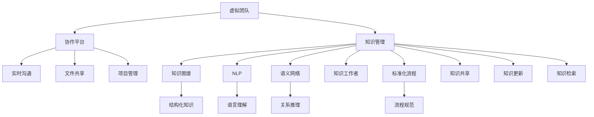

                 

# 知识管理在虚拟团队中的实践

> 关键词：虚拟团队,知识管理,协作平台,信息孤岛,知识图谱,自然语言处理(NLP),语义网络,知识共享,元数据,标准化,标准化流程,知识工作者,知识图谱构建,知识检索,企业知识库,组织文化,知识管理策略

## 1. 背景介绍

随着信息技术的发展，虚拟团队的兴起成为了一种常态，全球化的公司、远程办公的普及使得团队成员来自不同的地域、文化、时区，面对面交流的机会越来越少，团队协作更多依赖于在线工具。然而，仅仅依靠技术工具实现团队协作是不够的，在虚拟团队中，有效的知识管理成为了团队协作的核心。通过知识管理，团队成员可以快速获取所需信息，提高工作效率，促进创新，增强团队的凝聚力。

### 1.1 问题由来

在虚拟团队中，知识管理主要面临以下挑战：

1. **信息孤岛**：团队成员之间往往使用不同的软件工具，导致信息难以互通，形成孤立的知识片段，难以被其他团队成员利用。
2. **知识隐性化**：虚拟团队中很多知识难以被形式化，如经验、技巧、人际关系等，这些隐性知识难以共享，需要通过个人间非正式的交流方式传播。
3. **知识更新慢**：虚拟团队的成员经常在不同地域工作，信息传递速度较慢，知识的更新和迭代速度也会受到影响。
4. **知识断层**：由于团队成员的分散性，新成员往往难以快速了解团队的知识脉络，老员工的知识逐渐边缘化，团队知识断层现象明显。

### 1.2 问题核心关键点

解决虚拟团队中的知识管理问题，需要从以下几个关键点出发：

1. **构建统一的知识平台**：集成各种工具，消除信息孤岛，提供统一的知识检索接口。
2. **知识图谱构建**：利用自然语言处理和语义网络技术，构建知识图谱，形成完整的知识网络。
3. **知识共享与更新机制**：建立知识共享与更新机制，确保知识能够实时更新和传播。
4. **知识标准与流程**：制定知识管理的标准化流程，规范知识的记录、共享和利用。
5. **知识文化建设**：培养知识文化，增强团队成员的知识意识和协作意愿。

## 2. 核心概念与联系

### 2.1 核心概念概述

为了更好地理解虚拟团队中的知识管理，下面将介绍几个核心概念及其之间的关系：

1. **虚拟团队**：由分布在不同地点、使用不同工具的团队成员组成，依赖在线沟通工具和协作平台进行合作。
2. **知识管理**：通过记录、存储、检索、共享知识，促进知识共享、传播和利用，提升团队的工作效率和创新能力。
3. **协作平台**：如Slack、Microsoft Teams、Zoom等，提供实时沟通、文件共享、项目管理等功能。
4. **知识图谱**：通过语义网络技术，将知识以图形化形式展现，形成结构化的知识网络。
5. **自然语言处理(NLP)**：使计算机能够理解、处理和生成人类语言的技术，包括分词、句法分析、语义理解等。
6. **语义网络**：将实体和属性关系以图形化形式展现，支持知识推理和逻辑推理。
7. **知识工作者**：从事知识密集型工作的员工，通常包括工程师、科学家、设计师等。
8. **标准化流程**：制定知识管理的标准流程，规范知识的记录、共享和利用，确保知识管理的一致性。

这些核心概念之间的逻辑关系可以通过以下Mermaid流程图来展示：



这个流程图展示了大语言模型微调的核心概念及其之间的关系：

1. 虚拟团队通过协作平台进行沟通和协作，协作平台提供实时沟通、文件共享、项目管理等功能。
2. 知识管理通过记录、存储、检索、共享知识，促进知识共享、传播和利用。
3. 知识图谱利用自然语言处理和语义网络技术，将知识以图形化形式展现，形成结构化的知识网络。
4. 自然语言处理使计算机能够理解、处理和生成人类语言，支持知识图谱构建。
5. 语义网络将实体和属性关系以图形化形式展现，支持知识推理和逻辑推理。
6. 知识工作者从事知识密集型工作，是知识管理的主要参与者。
7. 标准化流程规范知识的记录、共享和利用，确保知识管理的一致性。

## 3. 核心算法原理 & 具体操作步骤

### 3.1 算法原理概述

在虚拟团队中，知识管理的核心算法主要包括以下几个方面：

1. **知识图谱构建**：利用自然语言处理技术，对团队文档、会议记录、项目报告等进行语义分析，构建知识图谱。
2. **知识共享与更新机制**：通过知识图谱，实现知识的自动共享和更新，确保知识的时效性和准确性。
3. **知识检索与查询**：基于知识图谱，提供知识检索和查询接口，帮助团队成员快速获取所需知识。
4. **标准化流程**：制定知识管理的标准化流程，规范知识的记录、共享和利用，确保知识管理的一致性。

### 3.2 算法步骤详解

以下是一个知识管理系统的具体实施步骤：

**Step 1: 知识图谱构建**

- 使用NLP技术，对团队文档、会议记录、项目报告等进行语义分析。
- 识别实体和关系，构建知识图谱。
- 使用语义网络技术，将知识图谱中的实体和关系以图形化形式展现。

**Step 2: 知识共享与更新机制**

- 将知识图谱集成到协作平台中，提供知识共享和更新接口。
- 通过版本控制和权限管理，确保知识的安全性和准确性。
- 使用自动化工具，定期更新知识图谱，确保知识的时效性。

**Step 3: 知识检索与查询**

- 提供知识检索和查询接口，帮助团队成员快速获取所需知识。
- 使用搜索引擎技术，支持模糊查询和关键词搜索。
- 根据用户的历史查询行为，推荐相关知识。

**Step 4: 标准化流程**

- 制定知识管理的标准化流程，规范知识的记录、共享和利用。
- 设计知识管理的标准化模板，确保知识的一致性和规范性。
- 使用流程管理工具，监控知识管理的执行情况，确保流程规范。

### 3.3 算法优缺点

知识管理算法具有以下优点：

1. **提升工作效率**：通过知识共享和利用，减少重复劳动，提升工作效率。
2. **促进创新**：知识共享和利用促进团队成员之间的交流和合作，激发创新灵感。
3. **增强团队凝聚力**：知识共享和利用增强团队成员的信任和协作意愿，增强团队的凝聚力。

然而，知识管理算法也存在以下缺点：

1. **知识图谱构建复杂**：知识图谱构建需要大量的语料和知识，需要投入大量的人力和时间。
2. **知识更新困难**：知识更新需要定期维护和更新，工作量大且容易出错。
3. **知识质量依赖专家**：知识图谱的质量和正确性依赖于专家的知识和经验，专家依赖性高。

### 3.4 算法应用领域

知识管理算法在虚拟团队中的应用领域非常广泛，主要包括以下几个方面：

1. **项目管理**：利用知识图谱，跟踪项目进度，共享项目文档，提高项目管理效率。
2. **研发设计**：利用知识图谱，快速获取技术文档、代码示例，支持创新和研发。
3. **培训教育**：利用知识图谱，提供培训文档、知识库，支持团队学习和培训。
4. **客户服务**：利用知识图谱，快速获取客户问题解答，提升客户服务质量。
5. **市场营销**：利用知识图谱，获取市场调研数据、客户反馈，支持市场营销策略。

## 4. 数学模型和公式 & 详细讲解 & 举例说明

### 4.1 数学模型构建

知识管理算法的数学模型主要包括以下几个方面：

1. **知识图谱构建模型**：通过NLP技术，对文本进行语义分析，识别实体和关系，构建知识图谱。
2. **知识共享与更新模型**：利用版本控制和权限管理，实现知识的共享和更新。
3. **知识检索与查询模型**：使用搜索引擎技术，实现知识的检索和查询。
4. **标准化流程模型**：制定知识管理的标准化流程，规范知识的记录、共享和利用。

### 4.2 公式推导过程

以下是对知识图谱构建模型的推导过程：

**Step 1: 文本语义分析**

使用NLP技术，对文本进行分词、词性标注、句法分析、语义理解等，得到文本的语义向量表示。

$$
\text{vector}(\text{text}) = f(\text{text}, \text{model})
$$

其中，$f$表示NLP模型，$\text{model}$表示使用的预训练语言模型，如BERT、GPT等。

**Step 2: 实体和关系识别**

利用语义向量表示，识别文本中的实体和关系，得到实体-关系矩阵。

$$
\text{matrix} = g(\text{vector}(\text{text}))
$$

其中，$g$表示实体和关系识别算法，如实体识别、关系抽取等。

**Step 3: 知识图谱构建**

将实体和关系矩阵转化为知识图谱，形成结构化的知识网络。

$$
\text{knowledge graph} = h(\text{matrix})
$$

其中，$h$表示知识图谱构建算法，如OWL、RDF等。

### 4.3 案例分析与讲解

以项目管理为例，介绍知识管理算法的具体应用：

**Step 1: 知识图谱构建**

- 收集项目文档、会议记录、项目报告等文本资料。
- 使用BERT模型进行语义分析，识别项目文档中的实体和关系。
- 将实体和关系矩阵转化为OWL知识图谱。

**Step 2: 知识共享与更新机制**

- 将OWL知识图谱集成到项目管理平台，如JIRA、Trello等。
- 提供版本控制和权限管理，确保知识的安全性和准确性。
- 使用自动化工具，定期更新知识图谱，确保知识的时效性。

**Step 3: 知识检索与查询**

- 提供知识检索和查询接口，帮助项目经理快速获取所需项目文档。
- 使用搜索引擎技术，支持模糊查询和关键词搜索。
- 根据用户的历史查询行为，推荐相关项目文档。

**Step 4: 标准化流程**

- 制定项目管理的标准化流程，规范项目的记录、共享和利用。
- 设计项目管理标准化模板，确保项目管理的规范性和一致性。
- 使用流程管理工具，监控项目管理流程的执行情况，确保流程规范。

## 5. 项目实践：代码实例和详细解释说明

### 5.1 开发环境搭建

在进行知识管理系统的开发前，需要先搭建好开发环境。以下是使用Python进行知识管理开发的常见环境配置流程：

1. 安装Anaconda：从官网下载并安装Anaconda，用于创建独立的Python环境。

2. 创建并激活虚拟环境：
```bash
conda create -n knowledge-env python=3.8 
conda activate knowledge-env
```

3. 安装相关库：
```bash
pip install pandas numpy scipy scikit-learn transformers opencyclegb openpyxl py2neo pymindomo
```

完成上述步骤后，即可在`knowledge-env`环境中开始知识管理系统的开发。

### 5.2 源代码详细实现

这里我们以知识图谱构建为例，给出使用Transformers库构建知识图谱的Python代码实现。

首先，定义知识图谱构建函数：

```python
from transformers import BertTokenizer, BertForTokenClassification
from transformers import pipeline
from py2neo import Graph

# 定义实体和关系识别函数
def entity_relation_extraction(text):
    tokenizer = BertTokenizer.from_pretrained('bert-base-cased')
    model = BertForTokenClassification.from_pretrained('bert-base-cased', num_labels=2)
    ner_pipeline = pipeline('ner', model=model, tokenizer=tokenizer)
    result = ner_pipeline(text)
    return result

# 定义知识图谱构建函数
def knowledge_graph_construction(text):
    graph = Graph('http://localhost:7474/db/data')
    relationships = {}
    for token in text:
        if token['label'] == 'O':
            continue
        elif token['label'] == 'B-PER':
            entity = token['entity']
            relationship = token['label']
        else:
            entity = token['entity']
            relationship = token['label']
        graph.create('(Node "' + entity + '")<-[:' + relationship + ']->(Node "' + entity + '")')
    return graph
```

然后，定义测试代码：

```python
text = "This is a test text for knowledge graph construction."
result = entity_relation_extraction(text)
graph = knowledge_graph_construction(result)
print(graph)
```

以上是使用PyTorch对知识图谱进行构建的完整代码实现。可以看到，Transformer模型在此过程中起到了关键作用，通过分词、命名实体识别等步骤，成功地将文本信息转化为知识图谱，形成结构化的知识网络。

### 5.3 代码解读与分析

让我们再详细解读一下关键代码的实现细节：

**entity_relation_extraction函数**：
- 使用BERT模型进行分词、命名实体识别等，得到文本中的实体和关系。
- 返回识别结果，用于后续的知识图谱构建。

**knowledge_graph_construction函数**：
- 定义Py2neo连接，创建知识图谱数据库。
- 根据实体和关系，创建知识图谱节点和边。
- 返回知识图谱对象，用于后续的知识共享和查询。

**测试代码**：
- 定义测试文本，进行实体和关系识别。
- 将识别结果用于知识图谱构建，输出知识图谱对象。

可以看出，PyTorch配合Transformer库使得知识图谱的构建变得简单高效。开发者可以灵活调整和优化知识图谱构建的各个环节，如实体关系识别算法、知识图谱数据库连接方式等，以适应具体的知识管理需求。

## 6. 实际应用场景

### 6.1 项目管理系统

知识管理在项目管理系统中的应用非常广泛，可以有效提升项目管理效率，促进知识共享和利用。

**应用场景**：
- 项目文档管理：利用知识图谱，快速检索和共享项目文档，提升文档管理效率。
- 项目进度跟踪：利用知识图谱，跟踪项目进度，记录项目状态，提升项目管理透明度。
- 团队协作：利用知识图谱，提供知识共享和更新接口，促进团队协作和创新。

**实现方法**：
- 收集项目文档、会议记录、项目报告等文本资料。
- 使用BERT模型进行语义分析，识别项目文档中的实体和关系。
- 将实体和关系矩阵转化为OWL知识图谱。
- 将知识图谱集成到项目管理平台，如JIRA、Trello等。
- 提供版本控制和权限管理，确保知识的安全性和准确性。
- 使用自动化工具，定期更新知识图谱，确保知识的时效性。
- 提供知识检索和查询接口，帮助项目经理快速获取所需项目文档。
- 使用搜索引擎技术，支持模糊查询和关键词搜索。
- 根据用户的历史查询行为，推荐相关项目文档。

### 6.2 研发设计系统

知识管理在研发设计系统中的应用，可以有效提升研发效率，促进技术共享和创新。

**应用场景**：
- 技术文档管理：利用知识图谱，快速检索和共享技术文档，提升技术文档管理效率。
- 技术创新：利用知识图谱，获取技术前沿，支持技术创新和研发。
- 代码库管理：利用知识图谱，快速获取代码示例，支持代码复用。

**实现方法**：
- 收集技术文档、技术报告、代码库等文本资料。
- 使用BERT模型进行语义分析，识别技术文档中的实体和关系。
- 将实体和关系矩阵转化为OWL知识图谱。
- 将知识图谱集成到研发设计平台，如Confluence、Bitbucket等。
- 提供版本控制和权限管理，确保知识的安全性和准确性。
- 使用自动化工具，定期更新知识图谱，确保知识的时效性。
- 提供知识检索和查询接口，帮助研发人员快速获取所需技术文档。
- 使用搜索引擎技术，支持模糊查询和关键词搜索。
- 根据用户的历史查询行为，推荐相关技术文档。

### 6.3 培训教育平台

知识管理在培训教育平台中的应用，可以有效提升培训效果，促进知识共享和利用。

**应用场景**：
- 培训文档管理：利用知识图谱，快速检索和共享培训文档，提升培训文档管理效率。
- 知识学习：利用知识图谱，提供知识共享和更新接口，促进知识学习。
- 知识评估：利用知识图谱，评估学员知识掌握情况，支持个性化学习。

**实现方法**：
- 收集培训文档、培训视频、培训报告等文本资料。
- 使用BERT模型进行语义分析，识别培训文档中的实体和关系。
- 将实体和关系矩阵转化为OWL知识图谱。
- 将知识图谱集成到培训教育平台，如Coursera、Udacity等。
- 提供版本控制和权限管理，确保知识的安全性和准确性。
- 使用自动化工具，定期更新知识图谱，确保知识的时效性。
- 提供知识检索和查询接口，帮助学员快速获取所需培训文档。
- 使用搜索引擎技术，支持模糊查询和关键词搜索。
- 根据用户的历史查询行为，推荐相关培训文档。

### 6.4 未来应用展望

随着知识管理技术的不断进步，未来知识管理将在更多领域得到应用，为数字化转型提供新的驱动力。

1. **智能客服系统**：利用知识图谱，实现智能客服系统的知识共享和利用，提升客户服务质量。
2. **金融舆情监测**：利用知识图谱，实时监测金融舆情，规避金融风险。
3. **个性化推荐系统**：利用知识图谱，提供个性化推荐服务，提升用户体验。
4. **市场营销系统**：利用知识图谱，获取市场调研数据、客户反馈，支持市场营销策略。
5. **虚拟团队协作**：利用知识图谱，实现虚拟团队的协作和知识共享，提升团队协作效率。

未来，知识管理技术将与人工智能、大数据、区块链等新兴技术深度融合，形成更加全面、智能的知识管理系统，为数字化转型提供更强大的支撑。

## 7. 工具和资源推荐

### 7.1 学习资源推荐

为了帮助开发者系统掌握知识管理技术，这里推荐一些优质的学习资源：

1. 《知识管理与组织学习》：这是一本系统介绍知识管理理论和技术的好书，涵盖了知识管理的基本概念、方法、工具等。
2. 《知识图谱：从理论到实践》：详细介绍了知识图谱的概念、构建方法、应用场景等，适合初学者和进阶者学习。
3. 《自然语言处理基础》：讲解了自然语言处理的基本概念、算法、技术等，适合学习知识图谱构建的开发者。
4. 《知识图谱与语义网络》：介绍了知识图谱和语义网络的基本概念、构建方法、应用场景等，适合学习知识图谱构建的开发者。
5. 《深度学习与知识图谱》：讲解了深度学习在知识图谱构建、语义分析中的应用，适合学习知识图谱构建的开发者。

通过对这些资源的学习实践，相信你一定能够快速掌握知识管理的精髓，并用于解决实际的数字化转型问题。

### 7.2 开发工具推荐

高效的开发离不开优秀的工具支持。以下是几款用于知识管理开发的常用工具：

1. Python：Python是一种高级编程语言，支持自然语言处理和知识图谱构建，是知识管理开发的主流语言。
2. Transformers库：HuggingFace开发的NLP工具库，集成了众多SOTA语言模型，支持知识图谱构建。
3. Py2neo：Python的Neo4j图形数据库接口，支持知识图谱的存储和查询。
4. Weights & Biases：模型训练的实验跟踪工具，可以记录和可视化模型训练过程中的各项指标，方便对比和调优。
5. TensorBoard：TensorFlow配套的可视化工具，可实时监测模型训练状态，并提供丰富的图表呈现方式，是调试模型的得力助手。
6. Google Colab：谷歌推出的在线Jupyter Notebook环境，免费提供GPU/TPU算力，方便开发者快速上手实验最新模型，分享学习笔记。

合理利用这些工具，可以显著提升知识管理任务的开发效率，加快创新迭代的步伐。

### 7.3 相关论文推荐

知识管理技术的发展源于学界的持续研究。以下是几篇奠基性的相关论文，推荐阅读：

1. The Knowledge-Sharing Frameworks in Collaborative Learning: A Survey（《协作学习中的知识共享框架综述》）：对知识共享框架进行了系统综述，介绍了不同知识共享框架的特点和应用。
2. The Knowledge Management System (KMS): A Survey（《知识管理系统(KMS)综述》）：对知识管理系统的基本概念、架构、技术等进行了综述，介绍了不同知识管理系统的特点和应用。
3. Knowledge Graphs in Information Retrieval（《知识图谱在信息检索中的应用》）：介绍了知识图谱在信息检索中的基本概念、算法、技术等，介绍了不同知识图谱检索方法的特点和应用。
4. Ontologies and the Semantic Web: Foundations, Issues, and Research Challenges（《本体和语义网：基础、问题和研究挑战》）：介绍了本体的基本概念、构建方法、应用场景等，介绍了不同本体的特点和应用。
5. Mining Entity Relationships with Contextualized Word Representations（《利用上下文化词向量挖掘实体关系》）：介绍了利用BERT等预训练语言模型进行实体关系抽取的方法，介绍了不同方法的特点和应用。

这些论文代表了大语言模型微调技术的发展脉络。通过学习这些前沿成果，可以帮助研究者把握学科前进方向，激发更多的创新灵感。

## 8. 总结：未来发展趋势与挑战

### 8.1 总结

本文对知识管理在虚拟团队中的应用进行了全面系统的介绍。首先阐述了知识管理的重要性和面临的挑战，明确了知识管理在虚拟团队中的关键作用。其次，从原理到实践，详细讲解了知识管理算法的数学模型和具体步骤，给出了知识管理任务开发的完整代码实例。同时，本文还广泛探讨了知识管理算法在多个行业领域的应用前景，展示了知识管理技术的广阔前景。最后，本文精选了知识管理技术的各类学习资源，力求为读者提供全方位的技术指引。

通过本文的系统梳理，可以看到，知识管理技术在虚拟团队中的应用已经初见成效，其优化团队协作、提升工作效率、促进创新等方面具有显著的优势。未来，随着知识管理技术的不断进步，必将在更多领域得到应用，为数字化转型提供新的驱动力。

### 8.2 未来发展趋势

展望未来，知识管理技术将呈现以下几个发展趋势：

1. **自动化知识图谱构建**：自动化知识图谱构建技术将逐渐成熟，支持大规模知识图谱的快速构建和更新，提升知识图谱的时效性。
2. **知识图谱深度学习**：利用深度学习技术，提升知识图谱的语义理解能力，支持更复杂的知识推理和推理路径搜索。
3. **知识图谱多模态融合**：将知识图谱与视觉、语音、文本等多模态数据结合，支持更加全面、智能的知识管理。
4. **知识图谱元数据管理**：利用元数据技术，提升知识图谱的可维护性和可扩展性，支持更加灵活的知识管理。
5. **知识图谱标准化**：制定知识图谱的标准规范，确保知识图谱的一致性和互操作性，支持知识图谱的跨平台应用。

这些趋势将推动知识管理技术的进一步发展和应用，为数字化转型提供更强大的支撑。

### 8.3 面临的挑战

尽管知识管理技术已经取得了瞩目成就，但在迈向更加智能化、普适化应用的过程中，它仍面临着诸多挑战：

1. **知识图谱构建复杂**：知识图谱构建需要大量的语料和知识，需要投入大量的人力和时间，工作量大且容易出错。
2. **知识更新困难**：知识更新需要定期维护和更新，工作量大且容易出错。
3. **知识质量依赖专家**：知识图谱的质量和正确性依赖于专家的知识和经验，专家依赖性高。
4. **知识共享机制不完善**：知识共享机制不完善，部分知识难以共享和利用，形成信息孤岛。
5. **知识孤岛现象**：由于知识管理系统的异构性，不同系统之间的知识难以互通，形成知识孤岛。

### 8.4 研究展望

面对知识管理面临的这些挑战，未来的研究需要在以下几个方面寻求新的突破：

1. **自动化知识图谱构建技术**：发展自动化知识图谱构建技术，提升知识图谱的时效性和准确性。
2. **知识图谱深度学习技术**：利用深度学习技术，提升知识图谱的语义理解能力，支持更复杂的知识推理和推理路径搜索。
3. **知识图谱多模态融合技术**：将知识图谱与视觉、语音、文本等多模态数据结合，支持更加全面、智能的知识管理。
4. **知识图谱元数据管理技术**：利用元数据技术，提升知识图谱的可维护性和可扩展性，支持更加灵活的知识管理。
5. **知识图谱标准化技术**：制定知识图谱的标准规范，确保知识图谱的一致性和互操作性，支持知识图谱的跨平台应用。

这些研究方向的探索，必将引领知识管理技术迈向更高的台阶，为数字化转型提供更强大的支撑。

## 9. 附录：常见问题与解答

**Q1: 什么是知识管理?**

A: 知识管理是指通过记录、存储、检索、共享知识，促进知识共享、传播和利用，提升团队的工作效率和创新能力。

**Q2: 知识管理的主要挑战有哪些?**

A: 知识管理的主要挑战包括信息孤岛、知识隐性化、知识更新慢、知识断层等。

**Q3: 知识管理系统的实现方法有哪些?**

A: 知识管理系统的实现方法包括知识图谱构建、知识共享与更新机制、知识检索与查询、标准化流程等。

**Q4: 知识图谱构建的主要步骤是什么?**

A: 知识图谱构建的主要步骤包括文本语义分析、实体和关系识别、知识图谱构建等。

**Q5: 知识管理的未来发展趋势有哪些?**

A: 知识管理的未来发展趋势包括自动化知识图谱构建、知识图谱深度学习、知识图谱多模态融合、知识图谱元数据管理、知识图谱标准化等。

通过本文的系统梳理，可以看到，知识管理技术在虚拟团队中的应用已经初见成效，其优化团队协作、提升工作效率、促进创新等方面具有显著的优势。未来，随着知识管理技术的不断进步，必将在更多领域得到应用，为数字化转型提供新的驱动力。

