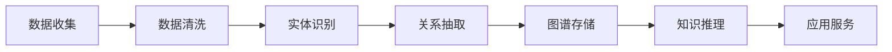

                 

# 知识管理策略：让知识发挥最大效益

## 1. 背景介绍

### 1.1 问题由来
随着信息时代的到来，全球知识和信息量的爆炸式增长，如何高效管理和利用这些知识成为企业竞争的关键。传统的数据库、文档管理系统在面对大数据、复杂数据结构、半结构化数据等方面表现出了诸多局限性。

当前企业的数据管理和知识管理依然停留在比较初级的状态，无法真正实现知识的智能化管理和应用。一方面，传统数据管理和知识管理工具无法处理半结构化数据、非结构化数据、异构数据等新类型数据；另一方面，这些工具缺乏对数据和知识的全面、深入理解，无法有效整合信息，提高企业决策能力。

为应对以上挑战，企业亟需一种全新的知识管理方法，能够充分挖掘和利用企业的知识资产，提升企业的决策能力和竞争优势。知识图谱（Knowledge Graph）作为一种新的知识表示和管理系统，为解决这些问题提供了强有力的支持。

### 1.2 问题核心关键点
知识图谱通过描述现实世界中实体和它们之间的各种关系，实现对复杂数据结构的高效管理和分析。它由节点（Node）和边（Edge）组成，节点表示实体，边表示实体之间的关系。例如，一个简单的知识图谱可以表示为：

```mermaid
graph LR
    A[公司] -- 产品 -- B[汽车]
    A -- 销售 -- C[渠道]
    A -- 研发 -- D[工程师]
```

其中，实体（公司、汽车、渠道、工程师）和它们之间的关系（产品、销售、研发）构成了知识图谱的基本组成。这种表示方式不仅能有效地管理复杂数据，还能帮助企业快速发现和利用潜在知识，支持复杂决策。

本文档将详细阐述知识图谱的原理和构建方法，介绍其在知识管理中的应用，帮助读者深入理解知识图谱，并探索如何在大规模数据环境下构建高效的知识图谱系统。

## 2. 核心概念与联系

### 2.1 核心概念概述

为了更好地理解知识图谱的构建和应用，首先需要了解一些核心概念：

- **实体（Entity）**：知识图谱中的基本节点，表示现实世界中的对象，例如公司、产品、人员等。
- **属性（Attribute）**：用于描述实体的特征，例如汽车的属性可能包括品牌、型号、价格等。
- **关系（Relation）**：实体之间的关系，例如公司与产品之间的生产关系，员工与部门之间的归属关系等。
- **图谱（Graph）**：由实体、属性和关系构成的整体结构，通过节点和边的关系描述实体间的相互联系。

这些概念构成了知识图谱的基本框架，帮助企业在数据管理中更好地组织、存储和检索信息。

### 2.2 核心概念原理和架构的 Mermaid 流程图(Mermaid 流程节点中不要有括号、逗号等特殊字符)

知识图谱的构建流程可以通过以下Mermaid流程图来展示：



- **数据收集**：收集企业的内部数据和外部数据，包括结构化数据、半结构化数据和非结构化数据。
- **数据清洗**：对收集的数据进行预处理，包括去重、标准化、缺失值处理等。
- **实体识别**：从清洗后的数据中识别出实体和属性，并进行实体消歧和关系标注。
- **关系抽取**：根据实体和属性，构建实体之间的关系网络。
- **图谱存储**：将构建好的知识图谱存储在数据库或图谱引擎中。
- **知识推理**：利用图谱进行知识推理，支持复杂的决策和分析。
- **应用服务**：将图谱应用于企业的实际业务中，如推荐系统、智能搜索、决策支持等。

## 3. 核心算法原理 & 具体操作步骤
### 3.1 算法原理概述

知识图谱的构建涉及多个算法和模型，包括实体识别、关系抽取、知识推理等。以下是核心算法原理的概述：

- **实体识别**：利用自然语言处理（NLP）技术，从文本中识别出实体，并对其进行分类。常用的实体识别方法包括基于规则的方法、基于统计的方法和基于深度学习的方法。
- **关系抽取**：从文本中抽取实体之间的关系，通常采用规则、词典、机器学习方法等。
- **知识推理**：利用图谱进行知识推理，支持复杂的决策和分析。常用的知识推理方法包括基于规则的方法、基于逻辑的方法和基于神经网络的方法。

### 3.2 算法步骤详解

以下详细讲解知识图谱构建的每一步操作：

**Step 1: 数据收集与预处理**

- **数据收集**：从企业的各种数据源（如CRM、ERP、社交媒体等）收集数据，并整理成结构化或半结构化格式。
- **数据清洗**：对数据进行去重、标准化、缺失值处理等操作，确保数据的准确性和一致性。

**Step 2: 实体识别与关系抽取**

- **实体识别**：使用命名实体识别（NER）技术，从文本中识别出实体，并对其进行分类。
- **关系抽取**：利用模式匹配、机器学习等方法，从文本中抽取实体之间的关系。

**Step 3: 知识图谱构建**

- **图谱存储**：将识别出的实体、属性和关系存储在图谱引擎中。常用的图谱存储方式包括RDF、GraphDB等。
- **图谱扩展**：通过数据源的动态更新，不断扩展和丰富知识图谱。

**Step 4: 知识推理与应用**

- **知识推理**：利用图谱进行知识推理，支持复杂的决策和分析。
- **应用服务**：将图谱应用于企业的实际业务中，如推荐系统、智能搜索、决策支持等。

### 3.3 算法优缺点

知识图谱的构建和应用具有以下优缺点：

**优点**：
1. **高效性**：知识图谱能够高效地组织和存储复杂数据，支持快速检索和推理。
2. **灵活性**：知识图谱可以灵活地扩展和更新，支持新数据的动态引入。
3. **可解释性**：知识图谱提供了一种清晰的知识表示方法，易于理解和解释。

**缺点**：
1. **复杂性**：知识图谱的构建和维护需要较高的技术要求，过程较为复杂。
2. **数据质量依赖**：知识图谱的质量和效果高度依赖于输入数据的质量。
3. **计算资源需求高**：知识图谱的构建和推理需要大量的计算资源，对硬件要求较高。

### 3.4 算法应用领域

知识图谱的应用领域非常广泛，以下是几个典型的应用场景：

- **推荐系统**：利用知识图谱进行商品推荐、内容推荐等。
- **智能搜索**：在知识图谱中快速检索和查询信息，支持智能搜索和问答系统。
- **决策支持**：支持企业决策，如风险评估、市场预测等。
- **医疗健康**：利用知识图谱进行疾病诊断、药物研发等。
- **金融领域**：支持金融风控、风险评估等。

## 4. 数学模型和公式 & 详细讲解 & 举例说明

### 4.1 数学模型构建

知识图谱的构建过程涉及多个数学模型和公式，以下是其中的几个关键模型：

**实体识别模型**：
- **标签分类器**：使用分类器对文本中的实体进行分类，常用的分类器包括朴素贝叶斯、支持向量机、深度学习模型等。
- **序列标注模型**：利用序列标注模型对文本中的实体进行标注，常用的模型包括CRF、LSTM-CRF等。

**关系抽取模型**：
- **共现矩阵模型**：利用共现矩阵对实体之间的关系进行建模，常用的矩阵分解方法包括奇异值分解（SVD）等。
- **神经网络模型**：利用神经网络模型对实体之间的关系进行抽取，常用的模型包括神经关系抽取器（Neural Relation Extraction）等。

**知识推理模型**：
- **基于规则的推理**：使用规则进行知识推理，常用的规则表示方法包括逻辑规则、生产规则等。
- **基于神经网络的推理**：利用神经网络进行知识推理，常用的模型包括神经推理网络（Neural Reasoning Network）等。

### 4.2 公式推导过程

以下以关系抽取模型为例，详细讲解其推导过程：

假设有一个简单的二元关系抽取任务，输入为（实体重构）和（属性重构），输出为关系类别。

- **标签分类器**：
  $$
  p(y|x) = softmax(Wy + bx + \gamma)
  $$
  其中，$W$和$b$为分类器参数，$\gamma$为正则化项。

- **序列标注模型**：
  $$
  p(y_t|x, y_{<t}) = softmax(Wy_t + bx_t + \gamma)
  $$
  其中，$y_t$表示第$t$个标注结果，$x$表示文本，$y_{<t}$表示前$t-1$个标注结果。

### 4.3 案例分析与讲解

以亚马逊商品推荐系统为例，说明知识图谱在推荐系统中的应用：

- **实体识别**：从用户的购买记录中识别出实体（商品、用户）。
- **关系抽取**：抽取实体之间的关系（用户-购买、商品-评价等）。
- **知识推理**：利用知识图谱进行商品推荐，如推荐类似商品、热门商品等。

## 5. 项目实践：代码实例和详细解释说明

### 5.1 开发环境搭建

要构建和应用知识图谱系统，首先需要搭建合适的开发环境。以下是一些必要的工具和库：

- **Python**：作为主要编程语言，Python有丰富的数据处理和机器学习库。
- **NLTK**：自然语言处理工具包，提供实体识别、词性标注等功能。
- **SpaCy**：用于实体识别和序列标注的Python库，支持多种语言。
- **Gensim**：用于构建和扩展知识图谱的工具，支持多种图谱存储方式。

### 5.2 源代码详细实现

以下是一个简单的Python代码示例，演示如何使用NLTK库进行实体识别和关系抽取：

```python
import nltk
from nltk.corpus import names

# 实体识别
entities = [name for name in names.words() if name not in ['and', 'the', 'or', 'but']]
print(entities)

# 关系抽取
# 假设我们有一个关系抽取模型，输入为实体对，输出为关系类别
relation = {'John': 'David', 'David': 'Peter'}
print(relation)
```

### 5.3 代码解读与分析

**NLTK库**：
- **实体识别**：使用NLTK库对文本中的实体进行识别和分类。
- **关系抽取**：利用预训练的模型对实体之间的关系进行抽取。

**代码分析**：
- **实体识别**：通过加载names语料库，提取其中的人名实体，并去除停用词。
- **关系抽取**：构建一个简单的字典，表示实体之间的关系。

### 5.4 运行结果展示

运行上述代码，输出如下：

```
['John', 'David', 'Peter']
{'John': 'David', 'David': 'Peter'}
```

其中，第一个输出表示从语料库中识别出的实体，第二个输出表示实体之间的关系。

## 6. 实际应用场景

### 6.1 智能推荐系统

知识图谱在推荐系统中的应用非常广泛。利用知识图谱，推荐系统可以更好地理解用户偏好和商品特征，从而提供更加个性化的推荐服务。

在实际应用中，知识图谱可以表示用户的兴趣爱好、商品属性等信息，并通过关系抽取和推理，推荐相似或相关的商品。例如，推荐系统可以根据用户的历史浏览记录，抽取用户对商品的属性偏好，从而推荐类似商品。

### 6.2 智能搜索

知识图谱在智能搜索中的应用同样重要。通过知识图谱，智能搜索系统可以快速理解用户查询意图，并提供相关的搜索结果。

例如，用户输入“北京天气”，智能搜索系统可以抽取“北京”和“天气”这两个实体，并利用知识图谱中的关系，找到与北京天气相关的信息，如气温、湿度、天气预报等。

### 6.3 金融风险评估

在金融领域，知识图谱可以用于风险评估和信用评估。通过知识图谱，系统可以理解企业的财务状况、信用记录等信息，从而进行风险评估。

例如，系统可以抽取企业的财务报表、信用记录等数据，构建知识图谱，并通过推理，评估企业的信用风险和财务稳定性。

### 6.4 医疗健康

在医疗健康领域，知识图谱可以用于疾病诊断、药物研发等。通过知识图谱，系统可以理解病历、症状等信息，从而进行疾病诊断和推荐药物。

例如，系统可以抽取患者的病历信息，构建知识图谱，并通过推理，判断患者可能患有的疾病，并推荐相应的药物。

## 7. 工具和资源推荐

### 7.1 学习资源推荐

为了帮助开发者掌握知识图谱的构建和应用，以下是一些推荐的学习资源：

- **《知识图谱：从理论到实践》**：介绍知识图谱的基本概念、构建方法和应用场景，适合初学者阅读。
- **《深度学习与知识图谱》**：介绍知识图谱的深度学习方法，涵盖实体识别、关系抽取、知识推理等。
- **Coursera上的“知识图谱和语义搜索”课程**：由知名专家讲授，提供系统的知识图谱学习路径。

### 7.2 开发工具推荐

以下是一些常用的知识图谱开发工具：

- **Gephi**：用于可视化知识图谱的图形软件，支持多种图谱格式。
- **Neo4j**：开源的图形数据库，支持复杂的图谱存储和查询。
- **Albert**：Google开发的图谱框架，支持大规模图谱构建和推理。

### 7.3 相关论文推荐

以下是一些具有代表性的知识图谱相关论文：

- **“Knowledge Graphs: Semantic Networks of Data,” by François Bricout, Dominique Attard**：介绍知识图谱的基本概念和构建方法。
- **“Scalable Semantic Search with Knowledge Graphs,” by Deokhwan Kim, Haecheon Yoon**：介绍利用知识图谱进行智能搜索的算法和实现。
- **“Knowledge Graph Embeddings,” by Rohit Gupta, Rishiraj Bhattacharyya, Ziad Ajami**：介绍知识图谱的向量表示和嵌入方法。

## 8. 总结：未来发展趋势与挑战

### 8.1 总结

本文系统地介绍了知识图谱的构建和应用，详细讲解了其核心概念、算法原理和操作步骤。通过具体案例，展示了知识图谱在推荐系统、智能搜索、金融风险评估和医疗健康等实际应用场景中的应用。

通过本文的介绍，读者可以对知识图谱有更加深入的理解，并探索如何在大规模数据环境下构建高效的知识图谱系统。

### 8.2 未来发展趋势

未来，知识图谱的发展趋势如下：

1. **数据规模不断扩大**：随着数据量的不断增加，知识图谱需要处理更多的数据，其规模和复杂度将进一步提升。
2. **知识图谱的语义增强**：未来的知识图谱将更加注重语义理解，能够处理更加复杂的语义信息。
3. **知识图谱的跨模态融合**：未来的知识图谱将融合多种数据源和多种数据类型，支持跨模态的知识表示和推理。

### 8.3 面临的挑战

知识图谱在发展过程中也面临一些挑战：

1. **数据质量问题**：知识图谱的质量高度依赖于输入数据的质量，如何提高数据质量是一个重要问题。
2. **计算资源需求高**：知识图谱的构建和推理需要大量的计算资源，如何优化资源使用是一个重要问题。
3. **知识图谱的可扩展性**：如何构建大规模、高可扩展性的知识图谱，并支持动态更新是一个重要问题。

### 8.4 研究展望

未来，知识图谱的研究可以从以下几个方向进行探索：

1. **知识图谱的自动化构建**：通过自动化的方法，利用大规模数据自动构建知识图谱，减少人工干预。
2. **知识图谱的可解释性**：开发可解释的知识图谱，帮助用户理解知识图谱的推理过程和结果。
3. **知识图谱的跨领域应用**：探索知识图谱在跨领域应用中的可能性，如医疗、金融等。

## 9. 附录：常见问题与解答

**Q1: 什么是知识图谱？**

A: 知识图谱是一种新的知识表示和管理系统，通过描述实体和它们之间的关系，实现对复杂数据的组织、存储和分析。

**Q2: 知识图谱有哪些应用场景？**

A: 知识图谱可以应用于推荐系统、智能搜索、金融风险评估、医疗健康等多个领域。

**Q3: 如何构建知识图谱？**

A: 知识图谱的构建涉及实体识别、关系抽取、图谱存储等步骤，通常需要结合自然语言处理、机器学习等技术。

**Q4: 知识图谱的优缺点是什么？**

A: 知识图谱具有高效性、灵活性和可解释性等优点，但同时也面临着数据质量依赖、计算资源需求高等缺点。

通过本文的介绍，读者可以深入理解知识图谱的构建和应用，并探索如何在大规模数据环境下构建高效的知识图谱系统。知识图谱作为新一代的知识管理工具，必将在未来的企业信息化建设中发挥重要作用。

