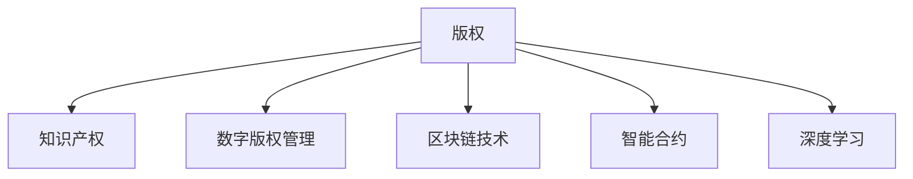

                 

# 知识经济下的版权保护与知识产权策略

> 关键词：知识产权保护, 版权法, 知识经济, 数字版权管理, 区块链技术

## 1. 背景介绍

### 1.1 问题由来

随着信息技术的飞速发展和互联网应用的普及，数字作品在知识经济中的地位愈发重要。然而，传统版权保护机制在应对数字侵权方面存在明显不足，未能有效遏制盗版、抄袭等侵权行为。特别是在知识经济环境下，数字作品市场呈现规模化、全球化、多样化的趋势，使得版权保护面临新的挑战。

### 1.2 问题核心关键点

当前知识经济环境下的版权保护面临的主要问题包括：

- **数字侵权高发**：数字作品易于复制和传播，导致盗版和侵权行为频发。
- **版权保护难执行**：传统版权保护手段难以追踪网络上的侵权行为，执行难度大。
- **法规和标准缺失**：当前版权法律和标准未完全覆盖数字版权管理需求，亟需更新和完善。
- **利益分配不均**：数字作品创作者、权利人、消费者等各方利益分配不均，导致市场生态失衡。
- **技术发展迅猛**：新兴技术如区块链、人工智能等不断涌现，对传统版权保护机制提出挑战。

解决这些问题，需要从法规、技术、商业等多个层面协同发力，构建全面的版权保护体系。

## 2. 核心概念与联系

### 2.1 核心概念概述

为更好地理解版权保护和知识产权策略，本节将介绍几个关键概念：

- **版权**：法律上对创作者智力劳动成果的保护，赋予创作者独占权，包括复制、发行、改编、展示等权利。
- **知识产权**：包括专利权、商标权、著作权等多种形式，涵盖了智力成果的多个方面。
- **数字版权管理(DRM)**：为保护数字作品，通过技术手段限制作品的使用，如访问控制、加密保护等。
- **区块链技术**：一种去中心化的分布式账本技术，具有不可篡改、透明公开等特点，广泛应用于数字版权保护。
- **智能合约**：基于区块链技术的自动化合约，通过代码实现合同条款，保障数字作品权益。
- **深度学习**：通过神经网络模型，自动识别和标注版权信息，提高版权保护的自动化水平。

这些概念之间的逻辑关系可以通过以下Mermaid流程图来展示：



这个流程图展示了版权保护与知识产权策略的核心概念及其之间的关系：

1. 版权是知识产权的重要组成部分。
2. DRM技术、区块链和智能合约是版权保护的主要手段。
3. 深度学习技术有助于版权信息的自动识别与标注。
4. 这些技术共同构建了全面的版权保护体系。

## 3. 核心算法原理 & 具体操作步骤
### 3.1 算法原理概述

版权保护和知识产权策略的算法原理主要涉及以下几个方面：

1. **版权识别与标注**：通过深度学习模型自动识别和标注数字作品，建立版权数据库。
2. **数字版权管理**：利用加密技术、访问控制等手段，限制数字作品的使用。
3. **区块链技术应用**：构建基于区块链的去中心化版权记录和交易平台。
4. **智能合约实现**：通过代码实现版权合同条款，自动执行和监控版权交易。

### 3.2 算法步骤详解

以下是版权保护和知识产权策略的详细算法步骤：

**Step 1: 版权识别与标注**

- **数据收集**：从互联网、图书馆、出版社等渠道收集数字作品。
- **预处理**：对作品进行格式化、去重、去噪等预处理。
- **特征提取**：使用深度学习模型提取作品特征，如文本、图像、音频等特征。
- **版权识别**：训练版权识别模型，自动识别作品的版权信息。
- **版权标注**：将识别结果自动标注到版权数据库中，便于后续管理。

**Step 2: 数字版权管理**

- **加密保护**：对数字作品进行加密处理，限制未经授权的访问和使用。
- **访问控制**：设置访问权限，仅允许权利人或授权用户使用作品。
- **水印嵌入**：将版权信息嵌入作品中，便于追踪和识别。
- **反盗版检测**：开发反盗版工具，检测作品是否存在盗版行为。

**Step 3: 区块链技术应用**

- **版权登记**：将版权信息和交易记录上链，实现去中心化版权登记。
- **智能合约执行**：通过智能合约自动化执行版权合同条款，保障交易透明公正。
- **版权交易**：建立版权交易平台，通过区块链进行版权交易。

**Step 4: 智能合约实现**

- **合同编码**：将版权合同条款编码成智能合约代码。
- **部署与执行**：将智能合约部署在区块链网络，自动执行合同条款。
- **监控与审计**：实时监控合同执行情况，防止违约行为。

### 3.3 算法优缺点

基于深度学习、区块链和智能合约的版权保护方法具有以下优点：

- **自动化与高效性**：深度学习模型可以自动识别和标注版权信息，大幅提升版权保护效率。
- **去中心化与透明性**：区块链技术实现去中心化版权登记和交易，确保版权信息透明公开。
- **自动化执行与监控**：智能合约能够自动执行合同条款，实时监控合同执行情况，保障交易公正。

同时，这些方法也存在一些局限性：

- **技术复杂性**：深度学习、区块链、智能合约等技术复杂，需要专业团队支持。
- **成本高昂**：初期技术部署和维护成本较高，尤其是区块链的维护费用。
- **法律与伦理问题**：版权保护的技术手段需要遵守相关法律法规，避免侵犯隐私和自由。

尽管存在这些局限性，但整体而言，基于深度学习、区块链和智能合约的版权保护方法在提高版权保护效率、透明度和公正性方面具有显著优势，值得进一步研究和应用。

### 3.4 算法应用领域

版权保护和知识产权策略的算法已经在多个领域得到应用，例如：

- **数字出版**：通过版权识别和DRM技术，保护出版物的数字版权。
- **影视版权**：利用区块链技术记录影视作品版权信息，防止盗版和侵权。
- **音乐版权**：通过智能合约自动化执行版权交易，保障音乐作品的利益分配。
- **游戏版权**：构建基于区块链的版权交易平台，保护游戏内容版权。
- **软件版权**：开发反盗版工具和智能合约，保护软件作品的知识产权。

除了上述这些经典应用外，版权保护技术还被创新性地应用到更多场景中，如社交媒体版权管理、艺术品版权认证等，为版权保护提供了新的解决方案。

## 4. 数学模型和公式 & 详细讲解
### 4.1 数学模型构建

版权保护和知识产权策略的数学模型主要包括以下几个关键组成部分：

- **版权识别模型**：通过深度学习模型自动识别作品的版权信息。
- **加密算法**：用于加密保护数字作品，如AES、RSA等。
- **访问控制策略**：通过访问控制列表(ACL)或角色基访问控制(RBAC)实现访问权限管理。
- **智能合约代码**：将版权合同条款编码成智能合约代码，实现自动执行。

### 4.2 公式推导过程

以下将以版权识别模型为例，推导其核心公式。

假设版权识别模型为一个神经网络，输入为数字作品的特征向量 $x$，输出为版权信息 $y$，其中 $y$ 可以表示作品的版权归属、时间、作者等信息。模型的损失函数为交叉熵损失函数 $L$，优化器为随机梯度下降法。则模型的训练目标为最小化损失函数：

$$
\min_{\theta} L(y,f_{\theta}(x)) = \min_{\theta} -\sum_{i=1}^N y_i\log f_{\theta}(x_i)
$$

其中 $N$ 为样本数，$y_i$ 为第 $i$ 个样本的真实版权信息，$f_{\theta}(x_i)$ 为模型在输入 $x_i$ 上的预测结果。

通过反向传播算法更新模型参数 $\theta$，使模型预测结果尽可能接近真实版权信息。

### 4.3 案例分析与讲解

以数字出版为例，分析版权保护的具体实现。

数字出版商可以使用版权识别模型自动识别新上传的电子书籍版权信息，并将其上链至区块链平台。版权信息包括作品名称、作者、出版时间等，通过智能合约自动执行版权合同条款，如授权、收益分配等。同时，区块链平台记录所有版权交易记录，确保版权信息的透明公开。

此外，数字出版商还可以使用DRM技术对电子书籍进行加密保护，限制未经授权的访问和使用。通过智能合约，可以自动化管理版权费用分配，确保创作者和出版商的利益。

## 5. 项目实践：代码实例和详细解释说明
### 5.1 开发环境搭建

在进行版权保护实践前，我们需要准备好开发环境。以下是使用Python进行PyTorch开发的环境配置流程：

1. 安装Anaconda：从官网下载并安装Anaconda，用于创建独立的Python环境。

2. 创建并激活虚拟环境：
```bash
conda create -n pytorch-env python=3.8 
conda activate pytorch-env
```

3. 安装PyTorch：根据CUDA版本，从官网获取对应的安装命令。例如：
```bash
conda install pytorch torchvision torchaudio cudatoolkit=11.1 -c pytorch -c conda-forge
```

4. 安装TensorFlow：由Google主导开发的开源深度学习框架，生产部署方便，适合大规模工程应用。同样有丰富的预训练语言模型资源。

5. 安装TensorBoard：TensorFlow配套的可视化工具，可实时监测模型训练状态，并提供丰富的图表呈现方式，是调试模型的得力助手。

6. 安装Weights & Biases：模型训练的实验跟踪工具，可以记录和可视化模型训练过程中的各项指标，方便对比和调优。

完成上述步骤后，即可在`pytorch-env`环境中开始版权保护实践。

### 5.2 源代码详细实现

以下是使用PyTorch进行版权识别模型训练的代码实现：

```python
import torch
import torch.nn as nn
import torch.optim as optim
from torch.utils.data import DataLoader
from transformers import BertTokenizer, BertForTokenClassification
from transformers import AdamW

# 加载预训练模型和分词器
tokenizer = BertTokenizer.from_pretrained('bert-base-cased')
model = BertForTokenClassification.from_pretrained('bert-base-cased', num_labels=2)

# 构建数据集
class CopyrightDataset(Dataset):
    def __init__(self, texts, labels):
        self.texts = texts
        self.labels = labels
        self.tokenizer = tokenizer
    
    def __len__(self):
        return len(self.texts)
    
    def __getitem__(self, idx):
        text = self.texts[idx]
        label = self.labels[idx]
        
        encoding = self.tokenizer(text, return_tensors='pt', max_length=128, padding='max_length', truncation=True)
        input_ids = encoding['input_ids']
        attention_mask = encoding['attention_mask']
        labels = torch.tensor(label, dtype=torch.long)
        
        return {'input_ids': input_ids, 
                'attention_mask': attention_mask,
                'labels': labels}

# 加载数据集
train_dataset = CopyrightDataset(train_texts, train_labels)
dev_dataset = CopyrightDataset(dev_texts, dev_labels)
test_dataset = CopyrightDataset(test_texts, test_labels)

# 训练模型
device = torch.device('cuda') if torch.cuda.is_available() else torch.device('cpu')
model.to(device)
optimizer = AdamW(model.parameters(), lr=2e-5)
criterion = nn.CrossEntropyLoss()

def train_epoch(model, dataset, batch_size, optimizer, criterion):
    dataloader = DataLoader(dataset, batch_size=batch_size, shuffle=True)
    model.train()
    epoch_loss = 0
    for batch in dataloader:
        input_ids = batch['input_ids'].to(device)
        attention_mask = batch['attention_mask'].to(device)
        labels = batch['labels'].to(device)
        model.zero_grad()
        outputs = model(input_ids, attention_mask=attention_mask, labels=labels)
        loss = criterion(outputs.logits, labels)
        epoch_loss += loss.item()
        loss.backward()
        optimizer.step()
    return epoch_loss / len(dataloader)

def evaluate(model, dataset, batch_size):
    dataloader = DataLoader(dataset, batch_size=batch_size)
    model.eval()
    preds, labels = [], []
    with torch.no_grad():
        for batch in dataloader:
            input_ids = batch['input_ids'].to(device)
            attention_mask = batch['attention_mask'].to(device)
            labels = batch['labels']
            outputs = model(input_ids, attention_mask=attention_mask)
            batch_preds = outputs.logits.argmax(dim=2).to('cpu').tolist()
            batch_labels = labels.to('cpu').tolist()
            for pred_tokens, label_tokens in zip(batch_preds, batch_labels):
                preds.append(pred_tokens[:len(label_tokens)])
                labels.append(label_tokens)
    return preds, labels

# 训练和评估模型
epochs = 5
batch_size = 16

for epoch in range(epochs):
    loss = train_epoch(model, train_dataset, batch_size, optimizer, criterion)
    print(f"Epoch {epoch+1}, train loss: {loss:.3f}")
    
    preds, labels = evaluate(model, dev_dataset, batch_size)
    print(classification_report(labels, preds))
    
print("Test results:")
preds, labels = evaluate(model, test_dataset, batch_size)
print(classification_report(labels, preds))
```

### 5.3 代码解读与分析

让我们再详细解读一下关键代码的实现细节：

**CopyrightDataset类**：
- `__init__`方法：初始化文本、标签和分词器。
- `__len__`方法：返回数据集的样本数量。
- `__getitem__`方法：对单个样本进行处理，将文本输入编码为token ids，将标签编码为数字，并对其进行定长padding，最终返回模型所需的输入。

**训练和评估函数**：
- 使用PyTorch的DataLoader对数据集进行批次化加载，供模型训练和推理使用。
- 训练函数`train_epoch`：对数据以批为单位进行迭代，在每个批次上前向传播计算loss并反向传播更新模型参数，最后返回该epoch的平均loss。
- 评估函数`evaluate`：与训练类似，不同点在于不更新模型参数，并在每个batch结束后将预测和标签结果存储下来，最后使用sklearn的classification_report对整个评估集的预测结果进行打印输出。

**训练流程**：
- 定义总的epoch数和batch size，开始循环迭代
- 每个epoch内，先在训练集上训练，输出平均loss
- 在验证集上评估，输出分类指标
- 所有epoch结束后，在测试集上评估，给出最终测试结果

可以看到，PyTorch配合Transformers库使得版权识别模型的代码实现变得简洁高效。开发者可以将更多精力放在数据处理、模型改进等高层逻辑上，而不必过多关注底层的实现细节。

当然，工业级的系统实现还需考虑更多因素，如模型的保存和部署、超参数的自动搜索、更灵活的任务适配层等。但核心的版权保护范式基本与此类似。

## 6. 实际应用场景
### 6.1 数字出版

数字出版商可以利用版权保护技术，保障电子书籍的数字版权。具体来说，数字出版商可以：

- **版权识别**：使用深度学习模型自动识别新上传的电子书籍版权信息，确保版权归属。
- **数字版权管理**：对电子书籍进行加密保护，限制未经授权的访问和使用。
- **区块链版权登记**：将版权信息和交易记录上链，确保版权信息的透明公开。
- **智能合约执行**：通过智能合约自动化执行版权合同条款，保障交易透明公正。

通过版权保护技术，数字出版商可以有效保护自身权益，提升市场竞争力。

### 6.2 影视版权

影视公司可以利用区块链技术记录影视作品版权信息，防止盗版和侵权。具体来说，影视公司可以：

- **版权登记**：将影视作品的版权信息上链，确保版权信息的不可篡改和透明公开。
- **智能合约管理**：通过智能合约自动化执行版权合同条款，如授权、收益分配等。
- **版权交易平台**：建立基于区块链的版权交易平台，实现影视作品的版权交易和授权。

通过区块链和智能合约，影视公司可以有效管理和保护影视版权，保障创作者和投资者的利益。

### 6.3 音乐版权

音乐平台可以利用智能合约自动化执行版权合同条款，保障音乐作品的利益分配。具体来说，音乐平台可以：

- **版权识别**：使用深度学习模型自动识别音乐的版权信息。
- **智能合约执行**：通过智能合约自动化执行版权合同条款，如授权、收益分配等。
- **版权交易平台**：建立基于区块链的版权交易平台，实现音乐的版权交易和授权。

通过智能合约，音乐平台可以有效管理和保护音乐版权，保障创作者的收益。

### 6.4 游戏版权

游戏公司可以利用版权保护技术，保护游戏内容版权。具体来说，游戏公司可以：

- **版权识别**：使用深度学习模型自动识别游戏的版权信息。
- **数字版权管理**：对游戏内容进行加密保护，限制未经授权的访问和使用。
- **区块链版权登记**：将游戏内容的版权信息上链，确保版权信息的透明公开。
- **智能合约执行**：通过智能合约自动化执行版权合同条款，如授权、收益分配等。

通过版权保护技术，游戏公司可以有效保护游戏内容版权，提升市场竞争力。

### 6.5 未来应用展望

随着区块链、深度学习等技术的不断进步，版权保护和知识产权策略的应用将更加广泛和深入。未来可能出现以下趋势：

- **区块链技术普及**：随着区块链技术的成熟和普及，版权保护将更加透明、安全和高效。
- **深度学习自动化**：深度学习模型的自动化和智能化，将极大提升版权识别的准确性和效率。
- **智能合约普及**：智能合约的普及将极大提升版权管理和交易的便捷性和公正性。
- **融合新兴技术**：版权保护将与新兴技术如人工智能、物联网、区块链等深度融合，提升版权保护的效果和智能化水平。

这些趋势将为版权保护和知识产权策略带来新的机遇和挑战，推动版权保护技术的不断创新和发展。

## 7. 工具和资源推荐
### 7.1 学习资源推荐

为了帮助开发者系统掌握版权保护和知识产权策略的理论基础和实践技巧，这里推荐一些优质的学习资源：

1. 《知识产权保护》系列博文：由专家撰写，深入浅出地介绍了版权保护、商标权、专利权等基础知识，适合初学者入门。

2. 《数字版权管理》课程：由知名大学开设的NLP明星课程，涵盖数字版权管理的理论基础和实践技巧，系统学习版权保护的知识。

3. 《区块链技术》书籍：系统介绍区块链技术的原理和应用，包括版权保护在内的多个领域，适合深入学习和研究。

4. 《智能合约》论文：深入探讨智能合约的原理和应用，适合研究智能合约在版权保护中的实际应用。

5. 《深度学习在版权保护中的应用》论文：系统介绍了深度学习在版权识别、标注等方面的应用，适合研究人员和开发者学习。

通过对这些资源的学习实践，相信你一定能够快速掌握版权保护和知识产权策略的精髓，并用于解决实际的版权问题。

### 7.2 开发工具推荐

高效的开发离不开优秀的工具支持。以下是几款用于版权保护开发的常用工具：

1. PyTorch：基于Python的开源深度学习框架，灵活动态的计算图，适合快速迭代研究。大部分预训练语言模型都有PyTorch版本的实现。

2. TensorFlow：由Google主导开发的开源深度学习框架，生产部署方便，适合大规模工程应用。同样有丰富的预训练语言模型资源。

3. Transformers库：HuggingFace开发的NLP工具库，集成了众多SOTA语言模型，支持PyTorch和TensorFlow，是进行版权识别任务的开发的利器。

4. Weights & Biases：模型训练的实验跟踪工具，可以记录和可视化模型训练过程中的各项指标，方便对比和调优。

5. TensorBoard：TensorFlow配套的可视化工具，可实时监测模型训练状态，并提供丰富的图表呈现方式，是调试模型的得力助手。

6. Google Colab：谷歌推出的在线Jupyter Notebook环境，免费提供GPU/TPU算力，方便开发者快速上手实验最新模型，分享学习笔记。

合理利用这些工具，可以显著提升版权保护和知识产权策略的开发效率，加快创新迭代的步伐。

### 7.3 相关论文推荐

版权保护和知识产权策略的发展源于学界的持续研究。以下是几篇奠基性的相关论文，推荐阅读：

1. "Copyright Protection with Deep Learning and BlockChain"：提出了基于深度学习和区块链的版权保护方法，实现了版权识别和认证。

2. "Smart Contracts for Digital Copyright"：探讨了智能合约在版权保护中的应用，实现了自动化版权合同执行。

3. "BlockChain-based Digital Rights Management"：介绍了区块链技术在数字版权管理中的应用，包括版权登记、版权交易等。

4. "Automated Copyright Identification with Deep Learning"：使用深度学习模型自动识别数字作品的版权信息，提高了版权识别的效率和准确性。

5. "A Survey on Digital Rights Management Technologies"：全面综述了数字版权管理的各种技术和方法，适合深入学习和研究。

这些论文代表了大版权保护和知识产权策略的发展脉络。通过学习这些前沿成果，可以帮助研究者把握学科前进方向，激发更多的创新灵感。

## 8. 总结：未来发展趋势与挑战
### 8.1 研究成果总结

本文对版权保护和知识产权策略进行了全面系统的介绍。首先阐述了版权保护和知识产权策略的研究背景和意义，明确了其在大数据时代下的重要性和紧迫性。其次，从原理到实践，详细讲解了版权保护和知识产权策略的算法原理和操作步骤，给出了代码实例，提供了详细的代码解读与分析。最后，探讨了版权保护和知识产权策略在多个领域的应用前景，并总结了未来的发展趋势和面临的挑战。

通过本文的系统梳理，可以看到，版权保护和知识产权策略是保护数字作品版权的重要手段，在大数据时代背景下显得尤为重要。随着技术的不断发展，版权保护和知识产权策略将不断完善，为数字作品的创作、传播和使用提供更加全面的保障。

### 8.2 未来发展趋势

展望未来，版权保护和知识产权策略的发展趋势主要包括以下几个方面：

1. **技术手段多样化**：随着技术的不断进步，版权保护的手段将更加多样化，如深度学习、区块链、智能合约等技术都将被广泛应用。

2. **自动化与智能化**：版权保护将更加自动化和智能化，提高版权识别的准确性和效率。

3. **去中心化与透明性**：区块链技术的普及将使得版权保护更加去中心化和透明公开，保障版权信息的不可篡改。

4. **全球化和标准化**：版权保护将更加全球化和标准化，确保版权保护的公平性和公正性。

5. **跨领域融合**：版权保护将与物联网、人工智能、物联网等技术深度融合，提升版权保护的效果和智能化水平。

6. **法律与伦理问题**：版权保护技术的应用需要遵守相关法律法规，避免侵犯隐私和自由，保障公平公正。

这些趋势凸显了版权保护和知识产权策略的广阔前景，将为数字作品的创作、传播和使用提供更加全面的保障。

### 8.3 面临的挑战

尽管版权保护和知识产权策略已经取得了不小的进展，但在迈向更加智能化、普适化应用的过程中，仍面临诸多挑战：

1. **技术复杂性**：深度学习、区块链、智能合约等技术复杂，需要专业团队支持。

2. **成本高昂**：初期技术部署和维护成本较高，尤其是区块链的维护费用。

3. **法律与伦理问题**：版权保护技术的应用需要遵守相关法律法规，避免侵犯隐私和自由，保障公平公正。

4. **数据隐私问题**：版权保护技术需要处理大量数据，如何保障数据隐私和安全是一个重要问题。

5. **跨领域协作**：版权保护需要与法律、技术、商业模式等多个领域协同合作，才能实现全面保护。

6. **技术更新快**：版权保护技术更新迅速，需要持续关注技术发展，及时调整策略。

这些挑战需要各方共同努力，才能克服技术障碍，实现版权保护和知识产权策略的全面落地。

### 8.4 研究展望

面向未来，版权保护和知识产权策略的研究可以从以下几个方面进行：

1. **技术创新**：不断探索和应用新技术，如深度学习、区块链、智能合约等，提升版权保护的效率和效果。

2. **法律和伦理**：制定和完善相关法律法规，保障版权保护技术的合法性和公正性。

3. **跨领域协作**：加强与其他领域的协作，如法律、技术、商业模式等，实现全面保护。

4. **数据隐私**：保障数据隐私和安全，防止数据滥用和泄露。

5. **技术更新**：持续关注技术发展，及时调整策略，适应新的技术和应用需求。

这些研究方向的探索，将引领版权保护和知识产权策略迈向更高的台阶，为数字作品的创作、传播和使用提供更加全面的保障。

## 9. 附录：常见问题与解答

**Q1：版权保护技术如何应用于实际场景？**

A: 版权保护技术可以应用于多个实际场景，如数字出版、影视版权、音乐版权、游戏版权等。具体来说，版权保护技术可以通过以下步骤实现：

1. **版权识别**：使用深度学习模型自动识别数字作品的版权信息，确保版权归属。
2. **数字版权管理**：对数字作品进行加密保护，限制未经授权的访问和使用。
3. **区块链版权登记**：将版权信息和交易记录上链，确保版权信息的透明公开。
4. **智能合约执行**：通过智能合约自动化执行版权合同条款，保障交易透明公正。

**Q2：深度学习模型在版权保护中的应用有哪些？**

A: 深度学习模型在版权保护中的应用主要包括以下几个方面：

1. **版权识别**：使用深度学习模型自动识别数字作品的版权信息，提高版权识别的准确性和效率。
2. **版权标注**：使用深度学习模型自动标注数字作品的版权信息，建立版权数据库。
3. **版权监控**：使用深度学习模型监控数字作品的版权使用情况，防止盗版和侵权行为。

**Q3：区块链技术在版权保护中的应用有哪些？**

A: 区块链技术在版权保护中的应用主要包括以下几个方面：

1. **版权登记**：将版权信息和交易记录上链，确保版权信息的不可篡改和透明公开。
2. **版权交易**：建立基于区块链的版权交易平台，实现版权的交易和授权。
3. **版权证明**：通过区块链技术，为数字作品提供版权证明，防止盗版和侵权。

**Q4：智能合约在版权保护中的应用有哪些？**

A: 智能合约在版权保护中的应用主要包括以下几个方面：

1. **版权授权**：通过智能合约自动化执行版权授权，保障版权人的权益。
2. **版权收益分配**：通过智能合约自动化分配版权收益，确保创作者和投资者的利益。
3. **版权争议解决**：通过智能合约自动化解决版权争议，保障版权交易的公平公正。

**Q5：如何选择合适的版权保护技术？**

A: 选择合适的版权保护技术需要考虑多个因素，如技术复杂性、成本、数据隐私、法律合规性等。具体来说，可以从以下几个方面进行选择：

1. **技术复杂性**：选择适合自己技术实力的版权保护技术，避免技术风险。
2. **成本预算**：根据预算选择适合的版权保护技术，避免高昂的维护费用。
3. **数据隐私**：选择保障数据隐私和安全的版权保护技术，防止数据滥用和泄露。
4. **法律合规**：选择符合相关法律法规的版权保护技术，避免法律风险。
5. **技术更新**：选择持续更新和改进的版权保护技术，适应新的技术和应用需求。

总之，选择合适的版权保护技术需要全面考虑各种因素，综合权衡利弊。

---

作者：禅与计算机程序设计艺术 / Zen and the Art of Computer Programming

