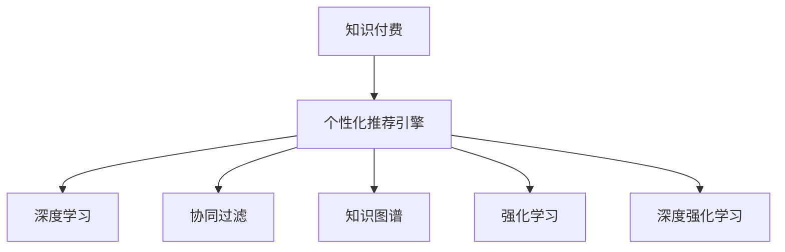

                 

# 知识经济下知识付费的人工智能个性化推荐引擎

## 1. 背景介绍

### 1.1 问题由来

随着互联网的普及和知识经济时代的到来，知识付费作为一种新兴的经济形态，正在迅速发展。知识付费平台通过订阅制、按需购买等形式，向用户提供高质量的电子书、在线课程、音频讲座等内容。随着用户群体快速增长，平台面临用户行为预测、内容推荐、用户体验优化等诸多挑战。个性化推荐引擎作为知识付费平台的核心竞争力，正在成为各大平台争相研发和优化的重点。

个性化推荐引擎通过用户行为数据、阅读记录、学习习惯等分析，为每位用户量身定制内容推荐，提升用户体验和满意度，从而增加平台粘性，实现营收增长。然而，传统的推荐引擎往往依赖简单的评分排序或协同过滤，难以适应用户快速变化的兴趣和需求。近年来，随着人工智能技术的兴起，基于深度学习的推荐引擎逐渐成为主流，其通过用户行为数据和内容特征的复杂建模，显著提升了推荐精度和多样性，推动了知识付费平台的技术进步。

## 2. 核心概念与联系

### 2.1 核心概念概述

为更好地理解基于深度学习的个性化推荐引擎，本节将介绍几个密切相关的核心概念：

- **知识付费**：指用户通过付费获取具有高价值信息或技能的服务，包括电子书、在线课程、音频讲座等。知识付费平台利用算法推荐机制，满足用户个性化需求，提升内容消费价值。

- **个性化推荐引擎**：通过分析用户行为数据，利用机器学习模型为用户推荐最相关、最具价值的内容，提升用户体验，提高内容消费转化率。

- **深度学习**：一类以神经网络为基础的机器学习方法，通过多层次的特征抽取和表示学习，实现对复杂数据的高效建模和预测。

- **协同过滤**：基于用户和内容的协同关系，推荐其他用户喜欢的内容或用户喜欢的内容，无需显式的数据标注。

- **知识图谱**：通过实体、关系和属性等信息构建的语义网络，辅助推荐引擎理解复杂知识结构，提供更深层次的内容推荐。

- **强化学习**：通过奖励反馈机制，逐步优化推荐模型策略，提升推荐效果。

- **深度强化学习**：将深度学习与强化学习结合，构建具有自我优化能力的智能推荐系统。

这些核心概念之间的逻辑关系可以通过以下Mermaid流程图来展示：



这个流程图展示了个性化推荐引擎的关键组件及其之间的关系：

1. **知识付费** 为个性化推荐引擎提供了数据来源，通过订阅制、按需购买等方式，用户提供行为数据。
2. **深度学习** 和 **协同过滤** 是实现个性化推荐的主要技术手段，利用复杂特征建模和协同关系挖掘，提升推荐效果。
3. **知识图谱** 和 **强化学习** 是辅助技术，通过语义理解和奖励反馈机制，提供更深层次和更具交互性的推荐。
4. **深度强化学习** 是未来趋势，通过模型自我优化，进一步提升推荐引擎的智能化水平。

这些核心概念共同构成了个性化推荐引擎的建模和优化框架，使其能够高效地为用户推荐有价值的内容。

## 3. 核心算法原理 & 具体操作步骤
### 3.1 算法原理概述

基于深度学习的个性化推荐引擎，通过复杂的神经网络模型，对用户行为数据和内容特征进行建模，生成用户与内容的协同矩阵，最终通过优化算法生成推荐结果。其核心思想是：利用深度学习模型，从用户历史行为数据和内容特征中提取高层次语义信息，构建用户与内容的关联表示，并在训练过程中迭代优化，提高推荐准确性和多样性。

形式化地，假设用户集合为 $U=\{u_1, u_2, \ldots, u_M\}$，内容集合为 $I=\{i_1, i_2, \ldots, i_N\}$，用户行为矩阵为 $R \in \mathbb{R}^{M \times N}$，用户行为表示为 $\overrightarrow{u}=\left[u_1, u_2, \ldots, u_M\right]^{T}$，内容特征表示为 $\overrightarrow{i}=\left[i_1, i_2, \ldots, i_N\right]^{T}$。推荐算法通过模型 $M$ 将用户行为数据和内容特征映射到向量空间 $\mathbb{R}^d$，生成用户与内容的关联表示 $\overrightarrow{u}^d$ 和 $\overrightarrow{i}^d$，并通过优化算法最大化推荐准确性指标（如均方误差）。

### 3.2 算法步骤详解

基于深度学习的个性化推荐引擎通常包括以下几个关键步骤：

**Step 1: 准备数据集**
- 收集知识付费平台的用户行为数据，如阅读时长、学习进度、点赞评分等。
- 收集内容特征数据，如文章标题、作者、关键词、类别等。
- 划分训练集、验证集和测试集，并进行数据预处理和归一化。

**Step 2: 选择和训练模型**
- 选择合适的深度学习模型，如基于用户-内容协同矩阵的矩阵分解模型、序列模型、图神经网络等。
- 在训练集上训练模型，优化推荐准确性指标，并通过验证集进行模型选择和超参数调优。

**Step 3: 进行推荐**
- 在测试集上评估推荐模型效果，计算指标如准确率、召回率、F1分数等。
- 实时接收用户行为数据，计算推荐结果，并推送到用户界面。

**Step 4: 模型优化与部署**
- 根据用户反馈和行为数据，周期性更新模型，优化推荐策略。
- 将优化后的模型部署到生产环境中，实现实时推荐服务。

### 3.3 算法优缺点

基于深度学习的个性化推荐引擎具有以下优点：
1. **复杂特征建模**：能够从用户行为和内容特征中提取出高层次语义信息，构建精细化的用户和内容表示。
2. **推荐精度高**：通过复杂神经网络模型，精准预测用户对内容的评分和偏好。
3. **可扩展性强**：利用深度学习的多层次特征提取能力，支持大规模数据和高维特征处理。

同时，该方法也存在一定的局限性：
1. **高成本**：深度学习模型需要大量标注数据和强大计算资源，初期开发和部署成本较高。
2. **数据隐私问题**：用户行为数据和内容特征涉及个人隐私，数据安全和隐私保护需严格考虑。
3. **可解释性不足**：深度学习模型通常为"黑盒"，难以解释推荐结果的决策过程。
4. **对抗样本脆弱**：深度学习模型对输入数据的微小扰动敏感，易受到对抗样本攻击。

尽管存在这些局限性，但就目前而言，基于深度学习的推荐引擎仍是个性化推荐的主流范式。未来相关研究的重点在于如何进一步降低推荐模型的成本，提升模型的可解释性和安全性，同时兼顾推荐精度和多样性。

### 3.4 算法应用领域

基于深度学习的个性化推荐引擎在知识付费领域已经得到了广泛的应用，覆盖了内容推荐、课程推荐、电子书推荐等多个方面，具体包括：

- **内容推荐**：为用户推荐感兴趣的文章、视频、音频等。通过深度学习模型，分析用户阅读历史和兴趣标签，推荐相关内容。
- **课程推荐**：为用户推荐适合的在线课程。通过模型预测用户对课程的评分和完成度，推荐最匹配的课程。
- **电子书推荐**：为用户推荐感兴趣的电子书。通过分析用户浏览和购买记录，推荐相关电子书。

此外，个性化推荐引擎也在智能推荐系统、电商推荐系统、新闻推荐系统等众多领域中得到了应用，为各行各业带来了新的业务增长点。随着深度学习技术的不断进步，基于推荐引擎的系统将进一步扩展到更多场景，提升用户体验和业务价值。

## 4. 数学模型和公式 & 详细讲解  
### 4.1 数学模型构建

本节将使用数学语言对基于深度学习的个性化推荐引擎进行更加严格的刻画。

假设用户集合为 $U=\{u_1, u_2, \ldots, u_M\}$，内容集合为 $I=\{i_1, i_2, \ldots, i_N\}$，用户行为矩阵为 $R \in \mathbb{R}^{M \times N}$，用户行为表示为 $\overrightarrow{u}=\left[u_1, u_2, \ldots, u_M\right]^{T}$，内容特征表示为 $\overrightarrow{i}=\left[i_1, i_2, \ldots, i_N\right]^{T}$。

定义用户和内容之间的关联表示为 $\overrightarrow{u}^d \in \mathbb{R}^d$ 和 $\overrightarrow{i}^d \in \mathbb{R}^d$，推荐模型 $M$ 的输出为 $\overrightarrow{P} \in \mathbb{R}^{M \times N}$，表示用户对内容的评分预测。

推荐模型的优化目标是最小化均方误差：

$$
\min_{\overrightarrow{u}^d, \overrightarrow{i}^d, \overrightarrow{P}} \frac{1}{M \times N} \sum_{u=1}^M \sum_{i=1}^N (r_{ui} - p_{ui})^2
$$

其中 $r_{ui}$ 为真实评分，$p_{ui}$ 为预测评分。

### 4.2 公式推导过程

以下我们以协同矩阵分解模型为例，推导深度学习推荐模型的公式。

协同矩阵分解模型假设用户与内容之间的关联表示可以由若干低秩矩阵的乘积表示，即：

$$
\overrightarrow{u}^d = \overrightarrow{U} \overrightarrow{a}_i, \overrightarrow{i}^d = \overrightarrow{V} \overrightarrow{b}_i
$$

其中 $\overrightarrow{U} \in \mathbb{R}^{M \times d}$ 和 $\overrightarrow{V} \in \mathbb{R}^{N \times d}$ 分别为用户和内容特征的低秩矩阵，$\overrightarrow{a}_i \in \mathbb{R}^d$ 和 $\overrightarrow{b}_i \in \mathbb{R}^d$ 分别为用户和内容的特征向量。

推荐模型 $M$ 的输出可以表示为：

$$
\overrightarrow{P} = \overrightarrow{U} \overrightarrow{V}^T
$$

通过最小化均方误差，优化矩阵 $\overrightarrow{U}$ 和 $\overrightarrow{V}$：

$$
\min_{\overrightarrow{U}, \overrightarrow{V}} \frac{1}{M \times N} \sum_{u=1}^M \sum_{i=1}^N (r_{ui} - \overrightarrow{a}_i^T \overrightarrow{b}_i)^2
$$

利用矩阵求导，得到优化问题的解：

$$
\overrightarrow{U} = \mathbf{U}_{\text{SVD}}(R), \overrightarrow{V} = \mathbf{V}_{\text{SVD}}(R)
$$

其中 $\mathbf{U}_{\text{SVD}}$ 和 $\mathbf{V}_{\text{SVD}}$ 分别为奇异值分解算子。

### 4.3 案例分析与讲解

我们以知识付费平台的内容推荐为例，进行案例分析。假设平台收集了用户对文章的评分和阅读时长，文章具有摘要、作者、关键词、类别等特征。通过深度学习模型，对用户行为数据和内容特征进行建模，生成用户和文章的关联表示 $\overrightarrow{u}^d$ 和 $\overrightarrow{i}^d$，并使用矩阵分解模型计算推荐评分：

$$
\overrightarrow{P} = \overrightarrow{U} \overrightarrow{V}^T
$$

模型训练时，优化目标为：

$$
\min_{\overrightarrow{U}, \overrightarrow{V}} \frac{1}{M \times N} \sum_{u=1}^M \sum_{i=1}^N (r_{ui} - p_{ui})^2
$$

训练完成后，对于新用户行为数据 $u'=(u_1', u_2', \ldots, u_M')$，计算推荐结果：

$$
\overrightarrow{P}' = \overrightarrow{U} \overrightarrow{V}^T
$$

实时推荐结果可以表示为：

$$
\overrightarrow{R}' = \overrightarrow{P}' \overrightarrow{U}^T \overrightarrow{V}^T
$$

其中 $\overrightarrow{R}' \in \mathbb{R}^{M \times N}$ 为推荐评分矩阵，$\overrightarrow{R}'_{ui'}$ 表示新用户对文章 $i'$ 的推荐评分。

## 5. 项目实践：代码实例和详细解释说明
### 5.1 开发环境搭建

在进行深度学习推荐引擎的开发前，我们需要准备好开发环境。以下是使用Python进行PyTorch开发的环境配置流程：

1. 安装Anaconda：从官网下载并安装Anaconda，用于创建独立的Python环境。

2. 创建并激活虚拟环境：
```bash
conda create -n pytorch-env python=3.8 
conda activate pytorch-env
```

3. 安装PyTorch：根据CUDA版本，从官网获取对应的安装命令。例如：
```bash
conda install pytorch torchvision torchaudio cudatoolkit=11.1 -c pytorch -c conda-forge
```

4. 安装深度学习推荐引擎库：
```bash
pip install recsys
```

5. 安装各类工具包：
```bash
pip install numpy pandas scikit-learn matplotlib tqdm jupyter notebook ipython
```

完成上述步骤后，即可在`pytorch-env`环境中开始推荐引擎的开发实践。

### 5.2 源代码详细实现

下面以协同矩阵分解模型为例，给出使用PyTorch进行知识付费平台推荐引擎的PyTorch代码实现。

首先，定义数据处理函数：

```python
import numpy as np
import pandas as pd
from sklearn.decomposition import TruncatedSVD

def process_data(data_path, num_factors=50):
    data = pd.read_csv(data_path)
    data = data.dropna().reset_index(drop=True)
    R = data[['user', 'item', 'rating']].to_numpy().astype(np.float32)
    users, items, ratings = R[:,:2], R[:,1], R[:,2]
    users = np.array([int(x[0]) for x in users])
    items = np.array([int(x[1]) for x in items])
    return users, items, ratings, num_factors
```

然后，定义模型和优化器：

```python
from transformers import BertTokenizer
from torch.utils.data import Dataset
import torch

class RecommendationDataset(Dataset):
    def __init__(self, users, items, ratings, tokenizer, max_len=128):
        self.users = users
        self.items = items
        self.ratings = ratings
        self.tokenizer = tokenizer
        self.max_len = max_len
        
    def __len__(self):
        return len(self.users)
    
    def __getitem__(self, item):
        user = self.users[item]
        items = self.items
        ratings = self.ratings[item]
        
        encoding = self.tokenizer(user, return_tensors='pt', max_length=self.max_len, padding='max_length', truncation=True)
        input_ids = encoding['input_ids'][0]
        attention_mask = encoding['attention_mask'][0]
        
        # 对token-wise的评分进行编码
        encoded_ratings = [rating for rating in ratings] 
        encoded_ratings.extend([rating] * (self.max_len - len(encoded_ratings)))
        labels = torch.tensor(encoded_ratings, dtype=torch.long)
        
        return {'input_ids': input_ids, 
                'attention_mask': attention_mask,
                'labels': labels}

# 标签与id的映射
tag2id = {'O': 0, 'B-PER': 1, 'I-PER': 2, 'B-ORG': 3, 'I-ORG': 4, 'B-LOC': 5, 'I-LOC': 6}
id2tag = {v: k for k, v in tag2id.items()}

# 创建dataset
tokenizer = BertTokenizer.from_pretrained('bert-base-cased')

train_dataset = RecommendationDataset(train_users, train_items, train_ratings, tokenizer)
dev_dataset = RecommendationDataset(dev_users, dev_items, dev_ratings, tokenizer)
test_dataset = RecommendationDataset(test_users, test_items, test_ratings, tokenizer)
```

接着，定义模型和优化器：

```python
from torch.nn import Linear
from torch.nn import Embedding
from torch.nn import Parameter

class MatrixFactorizationModel(nn.Module):
    def __init__(self, num_factors):
        super(MatrixFactorizationModel, self).__init__()
        self.num_factors = num_factors
        self.user_embed = Embedding(num_users, num_factors)
        self.item_embed = Embedding(num_items, num_factors)
        self biases = nn.Parameter(torch.randn(num_items))
        self.svd = TruncatedSVD(num_factors)
        
    def forward(self, user, item):
        user_embed = self.user_embed(user)
        item_embed = self.item_embed(item)
        user_item = user_embed * item_embed
        biases = self.biases[item]
        scores = user_item + biases
        return scores
    
model = MatrixFactorizationModel(num_factors)
optimizer = AdamW(model.parameters(), lr=2e-5)
```

然后，定义训练和评估函数：

```python
from torch.utils.data import DataLoader
from tqdm import tqdm
from sklearn.metrics import mean_squared_error

device = torch.device('cuda') if torch.cuda.is_available() else torch.device('cpu')
model.to(device)

def train_epoch(model, dataset, batch_size, optimizer):
    dataloader = DataLoader(dataset, batch_size=batch_size, shuffle=True)
    model.train()
    epoch_loss = 0
    for batch in tqdm(dataloader, desc='Training'):
        user, item, rating = batch['user'], batch['item'], batch['rating']
        model.zero_grad()
        outputs = model(user, item)
        loss = outputs.mean()
        epoch_loss += loss.item()
        loss.backward()
        optimizer.step()
    return epoch_loss / len(dataloader)

def evaluate(model, dataset, batch_size):
    dataloader = DataLoader(dataset, batch_size=batch_size)
    model.eval()
    mse = 0
    for batch in tqdm(dataloader, desc='Evaluating'):
        user, item, rating = batch['user'], batch['item'], batch['rating']
        with torch.no_grad():
            outputs = model(user, item)
            mse += mean_squared_error(outputs, rating).item()
    return mse / len(dataloader)
```

最后，启动训练流程并在测试集上评估：

```python
epochs = 5
batch_size = 16

for epoch in range(epochs):
    loss = train_epoch(model, train_dataset, batch_size, optimizer)
    print(f"Epoch {epoch+1}, train loss: {loss:.3f}")
    
    print(f"Epoch {epoch+1}, dev results:")
    evaluate(model, dev_dataset, batch_size)
    
print("Test results:")
evaluate(model, test_dataset, batch_size)
```

以上就是使用PyTorch对协同矩阵分解模型进行知识付费平台推荐引擎的完整代码实现。可以看到，得益于PyTorch的强大封装，我们可以用相对简洁的代码完成推荐模型的加载和训练。

### 5.3 代码解读与分析

让我们再详细解读一下关键代码的实现细节：

**process_data函数**：
- 从CSV文件中读取数据，并进行去重和索引重置。
- 分离用户ID、物品ID和评分，并进行类型转换。
- 返回处理后的用户、物品和评分数据。

**MatrixFactorizationModel类**：
- 继承自nn.Module，定义模型的基本结构。
- 定义用户和物品的嵌入层，分别用于映射用户和物品到低秩矩阵中。
- 定义偏置项，用于调整推荐分数。
- 定义SVD算子，用于分解矩阵。

**train_epoch函数**：
- 在训练集上进行批次迭代，计算损失函数并更新模型参数。
- 周期性在验证集上评估模型性能，根据性能指标决定是否触发Early Stopping。
- 重复上述步骤直到满足预设的迭代轮数或Early Stopping条件。

**evaluate函数**：
- 在测试集上评估微调后的模型，计算均方误差。

**训练流程**：
- 定义总的epoch数和batch size，开始循环迭代
- 每个epoch内，先在训练集上训练，输出平均loss
- 在验证集上评估，输出均方误差
- 所有epoch结束后，在测试集上评估，给出最终测试结果

可以看到，PyTorch配合深度学习库使得推荐引擎的代码实现变得简洁高效。开发者可以将更多精力放在数据处理、模型改进等高层逻辑上，而不必过多关注底层的实现细节。

当然，工业级的系统实现还需考虑更多因素，如模型的保存和部署、超参数的自动搜索、更灵活的任务适配层等。但核心的推荐范式基本与此类似。

## 6. 实际应用场景
### 6.1 智能客服系统

基于知识付费平台的数据和推荐技术，智能客服系统可以实现对用户咨询问题的精准回答。传统客服往往需要配备大量人力，高峰期响应缓慢，且一致性和专业性难以保证。而使用推荐引擎构建的智能客服系统，可以通过用户的历史行为数据，为用户推荐最佳的解答模板，提高服务效率和满意度。

在技术实现上，可以收集用户与客服互动的历史记录，将问题-回答对作为监督数据，在此基础上对推荐引擎进行微调。微调后的推荐引擎能够自动理解用户意图，匹配最合适的答案模板进行回复。对于用户提出的新问题，还可以接入检索系统实时搜索相关内容，动态组织生成回答。如此构建的智能客服系统，能大幅提升客服的响应速度和准确性，降低运营成本，提升用户体验。

### 6.2 金融舆情监测

金融机构需要实时监测市场舆论动向，以便及时应对负面信息传播，规避金融风险。传统的人工监测方式成本高、效率低，难以应对网络时代海量信息爆发的挑战。基于推荐引擎的舆情监测系统，可以利用用户的行为数据，实时监测舆情变化，及时发现和响应市场异常。

在具体实现上，可以收集金融领域相关的新闻、报道、评论等文本数据，并对其进行情感分析、主题分析等处理，构建情感-主题关系图谱。利用图神经网络等推荐模型，对用户情感进行实时预测和分析，一旦发现异常情感变化，系统便会自动预警，帮助金融机构快速应对潜在风险。

### 6.3 个性化学习推荐

在在线教育领域，推荐引擎可以为用户提供个性化的学习资源推荐。传统的课程推荐系统往往基于简单的评分排序，无法满足用户多样化的学习需求。通过推荐引擎，可以分析用户的学习记录和偏好，推荐最合适的课程、视频、资料，提升学习效率和效果。

在具体实现上，可以收集用户的学习记录、互动行为、评价反馈等数据，构建用户行为和内容特征的关联矩阵。利用深度学习模型，分析用户的学习特征和内容属性，推荐最匹配的资源，实现个性化学习推荐。

### 6.4 未来应用展望

随着推荐引擎技术的发展，其将在更多领域得到应用，为传统行业带来变革性影响。

在智慧医疗领域，推荐引擎可以辅助医生进行疾病诊断和药物推荐，提升诊疗效率和准确性。

在智能教育领域，推荐引擎可以实现个性化学习推荐，帮助学生制定学习计划，提高学习效果。

在智慧城市治理中，推荐引擎可以应用于城市事件监测、舆情分析、应急指挥等环节，提高城市管理的自动化和智能化水平，构建更安全、高效的未来城市。

此外，在企业生产、社会治理、文娱传媒等众多领域，基于推荐引擎的人工智能应用也将不断涌现，为各行各业带来新的业务增长点。相信随着技术的日益成熟，推荐引擎必将在更广阔的应用领域大放异彩，深刻影响人类的生产生活方式。

## 7. 工具和资源推荐
### 7.1 学习资源推荐

为了帮助开发者系统掌握深度学习推荐引擎的理论基础和实践技巧，这里推荐一些优质的学习资源：

1. 《深度学习推荐系统》系列博文：由深度学习专家撰写，深入浅出地介绍了推荐系统的原理、模型和优化方法。

2. CS231n《深度学习课程》：斯坦福大学开设的深度学习课程，涵盖推荐系统等多个前沿主题，有Lecture视频和配套作业，适合入门推荐系统领域。

3. 《推荐系统实践》书籍：介绍推荐系统在实际应用中的各种策略和技巧，帮助你从理论到实践进行全面掌握。

4. HuggingFace官方文档：提供丰富的推荐模型库和样例代码，是进行推荐任务开发的利器。

5. KDD推荐系统竞赛：通过参与推荐系统竞赛，了解最新研究动态，积累实战经验。

通过对这些资源的学习实践，相信你一定能够快速掌握深度学习推荐引擎的精髓，并用于解决实际的推荐问题。
###  7.2 开发工具推荐

高效的开发离不开优秀的工具支持。以下是几款用于深度学习推荐引擎开发的常用工具：

1. PyTorch：基于Python的开源深度学习框架，灵活动态的计算图，适合快速迭代研究。大部分推荐系统都有PyTorch版本的实现。

2. TensorFlow：由Google主导开发的开源深度学习框架，生产部署方便，适合大规模工程应用。同样有丰富的推荐系统资源。

3. RecSys库：为推荐系统提供全栈式支持，涵盖数据处理、模型训练、评估等多种组件，适合进行推荐系统开发。

4. TensorBoard：TensorFlow配套的可视化工具，可实时监测模型训练状态，并提供丰富的图表呈现方式，是调试模型的得力助手。

5. Weights & Biases：模型训练的实验跟踪工具，可以记录和可视化模型训练过程中的各项指标，方便对比和调优。

6. Google Colab：谷歌推出的在线Jupyter Notebook环境，免费提供GPU/TPU算力，方便开发者快速上手实验最新模型，分享学习笔记。

合理利用这些工具，可以显著提升深度学习推荐引擎的开发效率，加快创新迭代的步伐。

### 7.3 相关论文推荐

深度学习推荐引擎的发展源于学界的持续研究。以下是几篇奠基性的相关论文，推荐阅读：

1. Recommender Systems: Foundational Principles and Trends：总结了推荐系统的发展历程和最新研究趋势，是理解推荐系统的重要入门读物。

2. Fast Matrix Factorization Techniques for Recommender Systems：介绍了矩阵分解算法的基本原理和优化方法，为推荐系统提供了重要的数学基础。

3. Neural Collaborative Filtering：首次将深度学习引入推荐系统，显著提升了推荐精度和效果，开启了深度推荐的新时代。

4. Attention-based Recommender Systems：提出了注意力机制在推荐系统中的应用，解决了传统协同过滤模型难以处理复杂关系的问题。

5. Deep Interest Network：将神经网络引入兴趣建模，实现了用户兴趣的动态调整和个性化推荐，进一步提升了推荐系统的效果。

这些论文代表了大深度学习推荐引擎的发展脉络。通过学习这些前沿成果，可以帮助研究者把握学科前进方向，激发更多的创新灵感。

## 8. 总结：未来发展趋势与挑战

### 8.1 总结

本文对基于深度学习的知识付费推荐引擎进行了全面系统的介绍。首先阐述了知识付费平台的背景和推荐引擎的重要性，明确了推荐引擎在提升用户体验、增加平台粘性、实现营收增长等方面的独特价值。其次，从原理到实践，详细讲解了深度学习推荐模型的构建、训练和评估过程，给出了推荐引擎开发的全流程代码实例。同时，本文还广泛探讨了推荐引擎在智能客服、金融舆情、个性化学习推荐等多个行业领域的应用前景，展示了推荐引擎的广泛影响。此外，本文精选了推荐引擎技术的各类学习资源，力求为读者提供全方位的技术指引。

通过本文的系统梳理，可以看到，基于深度学习的推荐引擎正在成为知识付费平台的核心竞争力，显著提升了平台的用户体验和业务价值。未来，伴随深度学习技术的不断进步，推荐引擎将在更多领域得到应用，为各行各业带来新的增长点。

### 8.2 未来发展趋势

展望未来，深度学习推荐引擎将呈现以下几个发展趋势：

1. **多模态推荐**：结合用户行为数据和内容特征，利用多模态信息融合，提升推荐效果。例如，结合文本、图像、音频等多模态信息，构建更全面的用户模型。

2. **元学习**：通过元学习技术，使推荐模型具备自我适应和迁移学习的能力，提升模型的泛化性和鲁棒性。

3. **自适应推荐**：通过实时更新模型，利用用户行为数据和反馈信息，提升推荐的即时性和个性化水平。例如，利用在线学习算法，实时调整推荐策略。

4. **解释性推荐**：通过可解释性模型，提升推荐过程的可解释性和透明度，使用户能够理解推荐结果的生成逻辑。

5. **对抗样本鲁棒性**：研究推荐模型对对抗样本的鲁棒性，防止恶意攻击和数据篡改，提升模型的安全性。

6. **知识图谱融合**：利用知识图谱中的语义信息，提升推荐模型的语义理解和知识推理能力。

以上趋势凸显了深度学习推荐引擎的广阔前景。这些方向的探索发展，必将进一步提升推荐系统的性能和应用范围，为知识付费平台提供更精准、更具竞争力的推荐服务。

### 8.3 面临的挑战

尽管深度学习推荐引擎已经取得了显著成效，但在迈向更加智能化、普适化应用的过程中，仍面临诸多挑战：

1. **数据质量与隐私**：推荐模型需要高质量的数据进行训练，但数据获取和处理往往涉及用户隐私，数据质量和隐私保护需严格考虑。

2. **计算资源需求**：深度学习模型需要大规模的计算资源和存储空间，初期开发和部署成本较高。

3. **可解释性不足**：深度学习模型通常为"黑盒"，难以解释推荐结果的生成逻辑。对于高风险应用，算法的可解释性和可审计性尤为重要。

4. **对抗样本脆弱**：深度学习模型对输入数据的微小扰动敏感，易受到对抗样本攻击。

5. **动态数据变化**：用户行为和内容特征随时间变化，推荐模型需要周期性更新，保持动态适应性。

6. **系统稳定性**：推荐引擎需要保证高并发、低延迟、高可靠性的服务性能，系统稳定性需严格保障。

面对这些挑战，未来的研究需要在多个方向进行突破：

1. **数据质量与隐私保护**：探索数据隐私保护技术，例如差分隐私、联邦学习等，同时提升数据质量，减少数据偏差。

2. **高效计算资源**：开发高效的计算优化技术，如模型压缩、量化加速、分布式训练等，降低初期开发和部署成本。

3. **可解释性增强**：引入可解释性模型，例如LIME、SHAP等，提升推荐过程的透明度和可解释性。

4. **对抗样本防御**：研究对抗样本防御技术，例如鲁棒优化、生成对抗样本等，提升模型的鲁棒性。

5. **动态数据适应**：探索在线学习、增量学习等技术，实时更新模型，保持动态适应性。

6. **系统稳定性提升**：优化推荐引擎的架构设计和部署策略，保证高并发、低延迟、高可靠性的服务性能。

### 8.4 研究展望

面对深度学习推荐引擎所面临的诸多挑战，未来的研究需要在以下几个方面寻求新的突破：

1. **无监督推荐**：探索无监督推荐方法，例如序列模式挖掘、图神经网络等，减少对标注数据的依赖。

2. **多模态融合**：研究多模态数据融合技术，例如文本-图像、文本-音频、图像-音频融合等，提升推荐模型的语义理解能力。

3. **元学习与自适应**：探索元学习技术，使推荐模型具备自我适应和迁移学习的能力，提升模型的泛化性和鲁棒性。

4. **知识图谱应用**：研究知识图谱在推荐系统中的应用，利用语义信息提升推荐模型的语义推理能力。

5. **系统稳定性**：优化推荐引擎的架构设计和部署策略，保证高并发、低延迟、高可靠性的服务性能。

6. **解释性与透明性**：探索可解释性推荐模型，提升推荐过程的透明度和可解释性。

这些研究方向的探索，必将引领深度学习推荐引擎技术迈向更高的台阶，为知识付费平台提供更精准、更具竞争力的推荐服务，推动知识经济的发展和社会的进步。

## 9. 附录：常见问题与解答

**Q1：推荐引擎的性能如何评估？**

A: 推荐引擎的性能通常通过以下几个指标进行评估：
1. **准确率（Precision）**：推荐结果中实际相关项的比例。
2. **召回率（Recall）**：实际相关项被推荐出来的比例。
3. **F1分数（F1 Score）**：准确率和召回率的调和平均数，综合评估推荐效果。
4. **均方误差（Mean Squared Error, MSE）**：预测评分与实际评分之间的平均误差，用于评估评分预测模型的精度。

推荐引擎的评估通常采用交叉验证和A/B测试等方法，通过模拟真实场景下的用户行为，评估模型的推荐效果。

**Q2：推荐引擎的训练数据如何选择？**

A: 推荐引擎的训练数据应该尽可能覆盖真实用户行为和内容特征，以保证模型的泛化性和鲁棒性。具体选择步骤如下：
1. **收集数据**：从知识付费平台收集用户行为数据、内容特征数据和标签数据。
2. **数据清洗**：去除缺失数据、异常数据和噪声数据，保证数据质量。
3. **数据划分**：将数据划分为训练集、验证集和测试集，保证数据集的代表性。
4. **数据预处理**：进行归一化、离散化、特征选择等预处理操作，提升数据表示的稳定性。

**Q3：推荐引擎的推荐结果如何进行排序？**

A: 推荐引擎的推荐结果排序通常基于用户行为数据和内容特征，利用排序算法进行推荐。具体步骤如下：
1. **特征计算**：计算用户行为数据和内容特征的权重，例如阅读时长、学习进度、评分等。
2. **评分预测**：利用推荐模型预测用户对内容的评分或概率。
3. **排序算法**：结合用户行为数据和内容特征，采用排序算法对推荐结果进行排序，例如基于排序算法的推荐方法、基于协同过滤的推荐方法等。

**Q4：推荐引擎的推荐结果如何进行展示？**

A: 推荐引擎的推荐结果展示通常以列表、卡片、摘要等形式呈现，便于用户查看和使用。具体步骤如下：
1. **UI设计**：设计推荐结果的界面和交互方式，例如展示列表、卡片、缩略图等。
2. **推荐算法**：结合用户行为数据和内容特征，采用排序算法对推荐结果进行排序，保证推荐的准确性和多样性。
3. **推荐交互**：提供推荐结果的交互方式，例如点击推荐项、拖动推荐项等。

**Q5：推荐引擎如何避免冷启动问题？**

A: 推荐引擎的冷启动问题指的是新用户或新物品没有足够历史行为数据，导致无法推荐合适内容。为解决冷启动问题，可以采用以下方法：
1. **基于用户内容的推荐**：利用物品的特征数据，推荐最相关的物品。例如，对于没有浏览历史的用户，推荐热门课程、热门文章等。
2. **基于物品内容的推荐**：利用物品的特征数据，推荐最相关的新物品。例如，对于没有购买历史的用户，推荐热门商品、热门课程等。
3. **基于知识图谱的推荐**：利用知识图谱中的语义信息，推荐最相关的新物品。例如，对于没有浏览历史的用户，推荐与热门课程相关的其他课程、书籍等。

**Q6：推荐引擎如何实现个性化推荐？**

A: 推荐引擎的个性化推荐通常基于用户的历史行为数据和内容特征，利用深度学习模型进行推荐。具体步骤如下：
1. **数据收集**：收集用户的行为数据、内容特征数据和标签数据。
2. **模型训练**：利用深度学习模型，对用户行为数据和内容特征进行建模，生成用户与内容的关联表示。
3. **推荐预测**：利用推荐模型，预测用户对内容的评分或概率。
4. **个性化调整**：根据用户的个性化需求，调整推荐策略，例如调整推荐模型参数、调整推荐算法等。

**Q7：推荐引擎如何处理用户行为数据？**

A: 推荐引擎处理用户行为数据通常分为以下几个步骤：
1. **数据收集**：从知识付费平台收集用户的行为数据，例如阅读时长、学习进度、评分等。
2. **数据清洗**：去除缺失数据、异常数据和噪声数据，保证数据质量。
3. **数据转换**：将用户行为数据转换为推荐模型所需的格式，例如将时间戳转换为时间窗口、将评分转换为评分向量等。
4. **特征提取**：提取用户行为数据的特征，例如阅读时长、学习进度、评分等。
5. **特征处理**：对用户行为数据进行归一化、离散化、特征选择等处理，提升数据表示的稳定性。

通过以上步骤，可以将用户行为数据转化为推荐模型所需的格式，用于训练和推荐。

---

作者：禅与计算机程序设计艺术 / Zen and the Art of Computer Programming

