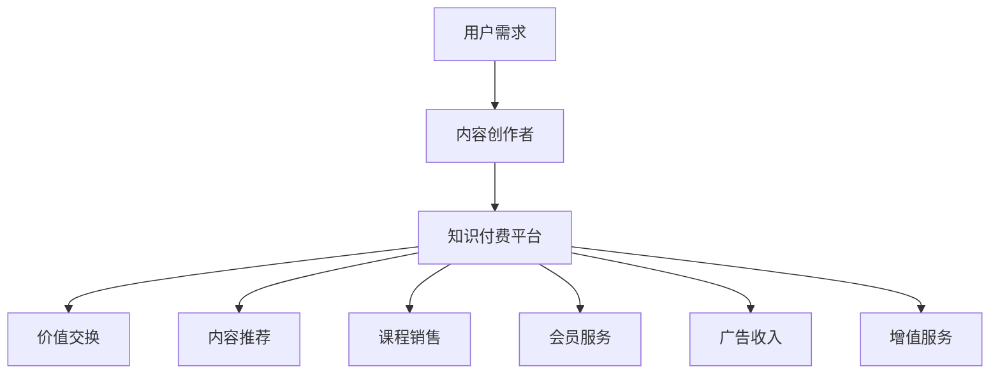

                 

# 知识经济时代下的知识付费 创新商业模式运营

> 关键词：知识付费, 内容创作者, 用户需求, 商业模型, 价值交换

## 1. 背景介绍

### 1.1 问题由来

随着互联网的迅猛发展，知识传播的门槛不断降低，信息爆炸成为新时代的基本特征。在知识经济时代，信息量虽然爆炸式增长，但真正有价值的信息却变得越来越稀缺。为了应对这一挑战，知识付费作为一种新型商业模式应运而生，通过付费获取高质量内容的模式，使知识创造者获得了应有的回报，同时满足了用户对深度、高质内容的需求。

### 1.2 问题核心关键点

知识付费商业模式的核心在于将知识与经济价值相结合，实现知识创造者与消费者之间的价值交换。其关键点包括：
- 精准定位用户需求：利用大数据、人工智能等技术手段，分析用户兴趣、行为数据，精准推送有价值的内容。
- 构建有效的知识体系：通过内容筛选、整理、分类，构建起符合用户需求的知识体系。
- 创新商业模式：设计多元化的商业模式，如按次付费、订阅模式、会员服务、课程销售等，满足不同用户需求。
- 保持内容更新：通过持续的内容产出和更新，维持用户黏性，提高平台价值。
- 优化用户体验：优化支付流程、课程内容展示、互动交流等功能，提升用户体验，增加用户粘性。

### 1.3 问题研究意义

研究知识付费商业模式，对于探索知识经济时代的价值交换新模式，推动知识传播与经济发展的深度融合具有重要意义：

1. 赋能知识创造者：知识付费能够激励内容创作者持续产出高质量内容，实现其劳动成果的商业化价值。
2. 提升用户知识获取效率：通过高效的内容推荐和精准的内容推送，节省用户寻找优质内容的时间成本。
3. 促进知识传播与变现：实现知识的商业化，推动知识付费产业的蓬勃发展。
4. 优化资源配置：通过市场机制优化资源配置，提升知识资源的利用效率。
5. 推动教育公平：通过付费模式，提升教育内容的可获取性，促进教育公平。

## 2. 核心概念与联系

### 2.1 核心概念概述

为更好地理解知识付费商业模式的运作机制，本节将介绍几个关键概念：

- **知识付费**：用户为获取具有深度价值的内容，而支付相应费用的模式。通过付费机制，保障了知识创造者的权益，同时激励其持续生产优质内容。
- **内容创作者**：包括但不限于专家学者、行业从业者、作家等，通过提供深度、专业的内容，获取收入。
- **用户需求**：包括知识、技能、信息等多方面需求，不同用户有着不同层次的知识需求。
- **商业模型**：通过分析知识付费商业模式的不同组成部分和运行机制，设计出符合市场和用户需求的多元化商业形态。
- **价值交换**：用户支付费用获得高质量内容，内容创作者通过其知识创造获得相应回报，实现双方价值的交换。

### 2.2 核心概念原理和架构的 Mermaid 流程图



这个流程图展示了知识付费商业模式的基本架构：

1. **用户需求**：用户根据自身需求，选择适合的知识内容。
2. **内容创作者**：内容创作者提供专业、深度、有价值的内容。
3. **知识付费平台**：作为连接内容创作者和用户的中介，通过内容推荐、课程销售、会员服务等方式实现价值交换。
4. **价值交换**：用户支付费用，获取高质量内容，实现知识与经济价值的交换。

### 2.3 核心概念之间的联系

以上概念之间存在紧密的联系：
- **用户需求**：决定着内容创作者创作内容的类型和方向，影响着知识付费平台的内容推荐和营销策略。
- **内容创作者**：是知识付费商业模式的根基，其内容的深度和专业性直接影响用户满意度。
- **知识付费平台**：提供技术支撑和市场环境，实现内容创作者和用户之间的价值交换。
- **价值交换**：是整个商业模式的核心，保障了知识创造者的权益，激励高质量内容的持续产出。

## 3. 核心算法原理 & 具体操作步骤
### 3.1 算法原理概述

知识付费商业模式的核心算法原理是用户需求分析、内容推荐和价值交换的循环迭代。具体流程如下：

1. **用户需求分析**：通过数据挖掘、用户行为分析等手段，获取用户对知识内容的需求信息。
2. **内容推荐算法**：根据用户需求，推荐符合其兴趣和偏好的内容，提升用户体验和满意度。
3. **价值交换模型**：通过订阅、按次付费、广告收入、增值服务等方式实现内容创作者与用户之间的价值交换。

### 3.2 算法步骤详解

知识付费商业模式的具体操作步骤包括：

1. **用户画像构建**：利用用户行为数据，构建用户画像，识别其知识需求。
2. **内容抓取与整理**：从网络、图书馆、行业报告等多渠道抓取高质量内容，并进行整理分类。
3. **内容推荐系统构建**：使用机器学习算法，如协同过滤、内容推荐、混合推荐等，构建内容推荐系统。
4. **价值交换模型设计**：根据不同内容的特点，设计适合的付费方式，如单次付费、包月订阅、广告赞助等。
5. **用户体验优化**：优化支付流程、课程展示、互动交流等功能，提升用户体验。
6. **数据反馈与模型迭代**：根据用户反馈，不断优化推荐算法和付费模型，提升内容匹配度。

### 3.3 算法优缺点

知识付费商业模式具有以下优点：
1. 精准推送：通过深度学习和用户画像构建，能够精准推送符合用户需求的内容。
2. 激励优质内容产出：通过付费机制，确保内容创作者获得相应回报，激励其持续产出高质量内容。
3. 多元化商业模式：通过多种付费方式，满足不同用户的需求，提升平台收入。
4. 提升教育公平：优质内容通过付费机制，易于获取，促进教育公平。

同时，该商业模式也存在以下缺点：
1. 用户粘性依赖：用户付费行为受限，平台难以保证长期用户粘性。
2. 平台竞争激烈：众多平台竞争加剧，单平台难以完全满足用户需求。
3. 内容质量不稳定：内容创作者水平参差不齐，难以保证所有内容的质量。
4. 成本高：平台需要投入大量资源进行内容采集、整理、推荐，成本较高。
5. 用户支付敏感：部分用户对付费行为敏感，难以刺激付费转化。

### 3.4 算法应用领域

知识付费商业模式已经在多个领域得到了广泛应用，如在线教育、行业知识库、专业咨询服务、健康管理等，具体应用场景包括：

1. **在线教育**：如Coursera、Udemy等平台，通过课程销售、包月订阅等形式，提供高质量的在线课程。
2. **行业知识库**：如MBA智库、领英LinkedIn Learning等平台，提供行业领域的深度知识内容。
3. **专业咨询服务**：如法律咨询、心理咨询、财务顾问等，通过一对一服务获取付费回报。
4. **健康管理**：如健康管理应用、心理辅导应用等，通过付费订阅获取个性化的健康管理服务。
5. **文化娱乐**：如音频书、电子书、影视内容等，通过订阅模式，提供有价值的内容服务。

## 4. 数学模型和公式 & 详细讲解  
### 4.1 数学模型构建

知识付费商业模式的数学模型主要涉及用户需求分析、内容推荐和价值交换三个方面。

1. **用户需求分析模型**：使用协同过滤算法，构建用户兴趣模型，如User-Item Collaborative Filtering（UICF）。
   $$
   P(x_i | x_j) = \frac{e^{sim(x_i, x_j) \cdot \theta_j}}{\sum_{k=1}^{K} e^{sim(x_i, x_k) \cdot \theta_k}}
   $$
   其中，$x_i$和$x_j$分别为用户和内容项，$sim$为相似度函数，$\theta_j$为内容项的权重。

2. **内容推荐模型**：使用基于内容的推荐算法，如项-项协同过滤算法。
   $$
   P(x_i | x_j) = \frac{e^{\sum_{k=1}^{K} \theta_j \cdot t_k(x_i)}}{\sum_{k=1}^{K} e^{\sum_{k=1}^{K} \theta_j \cdot t_k(x_i)}}
   $$
   其中，$t_k(x_i)$为内容项的属性，$\theta_j$为内容项的权重。

3. **价值交换模型**：设计不同付费方式，如单次付费、包月订阅、广告收入等。

### 4.2 公式推导过程

以下是几个核心算法的公式推导：

1. **协同过滤算法**：
   用户$x_i$对内容$x_j$的评分预测公式为：
   $$
   \hat{r}_{ij} = \frac{\sum_{k=1}^{K} p_{ik} \cdot q_{kj}}{\sqrt{\sum_{k=1}^{K} p_{ik}^2} \cdot \sqrt{\sum_{k=1}^{K} q_{kj}^2}}
   $$
   其中，$p_{ik}$为用户$x_i$对内容$k$的评分，$q_{kj}$为内容$k$对内容$j$的评分，$K$为用户数或内容项数。

2. **基于内容的推荐算法**：
   用户$x_i$对内容$x_j$的评分预测公式为：
   $$
   \hat{r}_{ij} = \frac{\sum_{k=1}^{K} u_i \cdot c_k \cdot v_k^T \cdot r_{kj}}{\sqrt{\sum_{k=1}^{K} u_i^2} \cdot \sqrt{\sum_{k=1}^{K} (c_k \cdot v_k)^2}}
   $$
   其中，$u_i$为用户$x_i$的特征向量，$c_k$为内容$k$的特征向量，$v_k$为内容$j$的特征向量，$r_{kj}$为内容$k$对内容$j$的评分。

### 4.3 案例分析与讲解

以在线教育平台为例，知识付费商业模式的应用如下：

1. **用户画像构建**：
   通过用户的浏览、购买、评分等行为数据，构建用户画像，识别其知识需求。
2. **内容抓取与整理**：
   从开放课程平台、出版社、行业报告等多渠道抓取高质量课程，并进行整理分类。
3. **内容推荐系统构建**：
   使用协同过滤和基于内容的推荐算法，根据用户画像推荐符合其兴趣的课程。
4. **价值交换模型设计**：
   提供单次购买、包月订阅、广告收入等多种付费方式，满足不同用户的需求。
5. **用户体验优化**：
   优化支付流程、课程展示、互动交流等功能，提升用户体验。
6. **数据反馈与模型迭代**：
   根据用户反馈，不断优化推荐算法和付费模型，提升内容匹配度。

## 5. 项目实践：代码实例和详细解释说明
### 5.1 开发环境搭建

在进行知识付费商业模式的开发前，我们需要准备好开发环境。以下是使用Python进行Flask开发的环境配置流程：

1. 安装Anaconda：从官网下载并安装Anaconda，用于创建独立的Python环境。
2. 创建并激活虚拟环境：
   ```bash
   conda create -n flask-env python=3.8 
   conda activate flask-env
   ```
3. 安装Flask：
   ```bash
   pip install Flask
   ```
4. 安装Flask-SQLAlchemy：用于数据库集成：
   ```bash
   pip install Flask-SQLAlchemy
   ```
5. 安装Flask-RESTful：用于API集成：
   ```bash
   pip install Flask-RESTful
   ```
6. 安装Flask-Session：用于用户会话管理：
   ```bash
   pip install Flask-Session
   ```

完成上述步骤后，即可在`flask-env`环境中开始知识付费平台开发的实践。

### 5.2 源代码详细实现

我们以在线教育平台为例，给出使用Flask开发知识付费平台的代码实现。

首先，定义用户模型：

```python
from flask_sqlalchemy import SQLAlchemy

db = SQLAlchemy(app)

class User(db.Model):
    id = db.Column(db.Integer, primary_key=True)
    username = db.Column(db.String(64), unique=True, nullable=False)
    password_hash = db.Column(db.String(128), nullable=False)
    email = db.Column(db.String(64), unique=True, nullable=False)
    courses = db.relationship('Course', backref='users', lazy='dynamic')
```

接着，定义课程模型：

```python
class Course(db.Model):
    id = db.Column(db.Integer, primary_key=True)
    title = db.Column(db.String(64), nullable=False)
    description = db.Column(db.Text, nullable=False)
    price = db.Column(db.Float, nullable=False)
    is_paid = db.Column(db.Boolean, default=False)
    created_at = db.Column(db.DateTime, default=datetime.utcnow)
    user_id = db.Column(db.Integer, db.ForeignKey('user.id'), nullable=False)

    def __str__(self):
        return f'{self.title} by {self.user.username}'
```

然后，定义API接口：

```python
from flask import request
from flask_restful import Resource

class UserResource(Resource):
    def get(self, user_id):
        user = User.query.get_or_404(user_id)
        courses = Course.query.filter_by(user_id=user_id).all()
        return {'courses': [course.title for course in courses]}, 200

class CourseResource(Resource):
    def get(self, course_id):
        course = Course.query.get_or_404(course_id)
        return {'name': course.title, 'price': course.price, 'is_paid': course.is_paid}, 200

    def post(self, course_id):
        course = Course.query.get_or_404(course_id)
        if request.form.get('paid', 'False') == 'True':
            course.is_paid = True
            db.session.commit()
            return {'message': 'Course paid'}, 200
        else:
            return {'message': 'Course not paid'}, 200
```

最后，运行Flask应用：

```python
if __name__ == '__main__':
    app.run(debug=True)
```

以上就是使用Flask开发知识付费平台的完整代码实现。可以看到，通过Flask，我们能够快速搭建一个简单的知识付费平台，实现用户注册、课程管理、付费等基本功能。

### 5.3 代码解读与分析

让我们再详细解读一下关键代码的实现细节：

**User模型**：
- `id`：用户ID，作为主键。
- `username`：用户名，唯一性约束。
- `password_hash`：哈希后的密码，用于用户认证。
- `email`：用户邮箱，唯一性约束。
- `courses`：一对一关联课程模型，通过`backref`实现反向查询。

**Course模型**：
- `id`：课程ID，作为主键。
- `title`：课程标题。
- `description`：课程描述。
- `price`：课程价格。
- `is_paid`：是否付费标志，默认为False。
- `created_at`：创建时间，自动生成。
- `user_id`：关联用户模型，表示课程创建者。

**UserResource类**：
- `get`方法：根据用户ID获取课程列表。
- 使用`get_or_404`方法获取用户对象，若不存在则返回404错误。
- 查询关联的课程列表，通过`backref`获取课程模型的属性。

**CourseResource类**：
- `get`方法：根据课程ID获取课程详情。
- 使用`get_or_404`方法获取课程对象，若不存在则返回404错误。
- 返回课程的标题、价格、付费状态等属性。
- `post`方法：根据课程ID处理付费逻辑。
- 根据请求参数判断是否付费，并通过`is_paid`字段更新课程状态。

在实际开发中，还需要引入Flask-SQLAlchemy进行数据库集成，Flask-Session进行用户会话管理，Flask-RESTful进行API集成，Flask-WTF进行表单处理，Flask-Login进行用户认证等功能。

## 6. 实际应用场景
### 6.1 在线教育平台

知识付费商业模式在在线教育平台中的应用非常广泛，平台通过提供高质量课程，满足用户对深度、专业内容的获取需求。具体应用场景包括：

1. **单次付费课程**：用户可根据自身需求选择购买单个课程，获得一次性学习权利。
2. **包月订阅**：用户支付固定费用，可无限次获取特定类别课程。
3. **推荐系统**：平台根据用户学习历史和行为数据，推荐符合其兴趣的课程。
4. **智能助教**：通过自然语言处理技术，实时解答用户学习问题，提升学习效果。

### 6.2 专业咨询服务平台

专业咨询服务平台通过知识付费商业模式，为用户提供有价值的咨询服务。具体应用场景包括：

1. **一对一咨询**：用户支付费用，获取专家的专业建议。
2. **专题讲座**：专家通过在线讲座形式，传授知识和经验。
3. **定期报告**：专家定期发布行业报告，提供行业洞察。
4. **社区交流**：用户可在社区中提出问题，专家进行答疑。

### 6.3 行业知识库

行业知识库通过知识付费商业模式，为用户提供特定领域的深度知识内容。具体应用场景包括：

1. **专业课程**：提供特定领域的深度课程，如MBA课程、法律课程等。
2. **专题文章**：定期发布行业专题文章，提供行业前沿知识。
3. **在线问答**：用户可在线提问，专家进行答疑。
4. **书籍推荐**：推荐与领域相关的经典书籍，供用户深入学习。

## 7. 工具和资源推荐
### 7.1 学习资源推荐

为了帮助开发者系统掌握知识付费商业模式的理论基础和实践技巧，这里推荐一些优质的学习资源：

1. **《知识付费商业模式与实践》**：深入浅出地介绍了知识付费商业模式的原理、应用和实践技巧。
2. **Coursera《商业模式创新与实践》**：斯坦福大学开设的商业模式创新课程，提供系统化的商业模式理论基础。
3. **《商业模式设计》书籍**：探讨了商业模式设计的全流程，包括市场需求分析、价值创造、收入模型等。
4. **MBA智库平台**：提供行业知识、专家文章、商业案例等，是知识付费商业模式的重要学习资源。
5. **LinkedIn Learning平台**：提供行业课程、专业讲座等，涵盖多个领域，支持多种付费模式。

通过对这些资源的学习实践，相信你一定能够快速掌握知识付费商业模式的精髓，并用于解决实际的商业问题。

### 7.2 开发工具推荐

高效的开发离不开优秀的工具支持。以下是几款用于知识付费商业模式开发的常用工具：

1. **Flask**：Python开发框架，支持轻量级Web应用开发，快速迭代原型。
2. **SQLAlchemy**：Python ORM框架，支持数据库集成，简化数据操作。
3. **Flask-RESTful**：Python RESTful API开发框架，支持API集成和数据接口设计。
4. **Flask-Session**：Python用户会话管理工具，支持用户登录、状态保存等功能。
5. **Flask-Login**：Python用户认证框架，支持用户登录、权限管理等功能。
6. **Flask-WTF**：Python表单处理框架，支持表单验证、加密等功能。

合理利用这些工具，可以显著提升知识付费平台的开发效率，加快创新迭代的步伐。

### 7.3 相关论文推荐

知识付费商业模式的研究源于学界的持续探索。以下是几篇奠基性的相关论文，推荐阅读：

1. **《知识付费的经济学分析》**：从经济学角度分析了知识付费的合理性和效率问题。
2. **《知识付费平台用户行为分析》**：通过数据分析，揭示了用户知识付费行为的驱动因素和特征。
3. **《在线教育平台的商业模式创新》**：探讨了在线教育平台的商业模式创新路径和策略。
4. **《知识付费的商业价值分析》**：分析了知识付费商业模式的价值链、盈利模式等。
5. **《知识付费平台的市场策略研究》**：探讨了知识付费平台的市场定位、定价策略等。

这些论文代表了大规模商业模式的研究方向，通过学习这些前沿成果，可以帮助研究者把握学科前进方向，激发更多的创新灵感。

## 8. 总结：未来发展趋势与挑战
### 8.1 总结

本文对知识付费商业模式进行了全面系统的介绍。首先阐述了知识付费商业模式的研究背景和意义，明确了其在知识经济时代的重要性。其次，从原理到实践，详细讲解了知识付费商业模式的数学模型和算法原理，并给出了具体的代码实现。同时，本文还广泛探讨了知识付费商业模式在多个行业领域的应用前景，展示了其广阔的市场空间。此外，本文精选了知识付费商业模式的各类学习资源，力求为读者提供全方位的技术指引。

通过本文的系统梳理，可以看到，知识付费商业模式正在成为知识经济时代的新型商业模式，极大地推动了知识传播与经济发展的深度融合。受益于大数据、人工智能等技术的进步，知识付费模式能够精准定位用户需求，提供高质量内容，实现知识与经济价值的交换。未来，伴随技术的不断创新和市场的不断成熟，知识付费商业模式必将进一步扩展，为知识经济时代的产业发展提供新的动力。

### 8.2 未来发展趋势

展望未来，知识付费商业模式将呈现以下几个发展趋势：

1. **数据驱动**：通过大数据、人工智能等技术，精准分析用户需求，优化内容推荐和付费模式。
2. **用户黏性增强**：通过个性化推荐、互动交流等手段，提升用户黏性，增加平台用户基数。
3. **多渠道运营**：结合社交媒体、视频平台等渠道，扩大知识付费内容的覆盖范围。
4. **多元化付费**：开发多元化的付费模式，如会员制、积分兑换、社交变现等，满足不同用户的需求。
5. **社区化建设**：通过社区建设，增强用户互动，提高用户参与度，增加平台粘性。
6. **教育公平促进**：通过知识付费，提高优质内容的可获取性，促进教育公平。

这些趋势预示着知识付费商业模式的未来前景广阔，有望成为知识经济时代的重要商业模式。

### 8.3 面临的挑战

尽管知识付费商业模式已经取得了一定成果，但在发展过程中仍面临诸多挑战：

1. **内容质量不稳定**：内容创作者水平参差不齐，难以保证所有内容的质量。
2. **用户黏性不足**：用户付费行为受限，难以保证长期用户黏性。
3. **市场竞争激烈**：众多平台竞争加剧，单平台难以完全满足用户需求。
4. **成本高**：平台需要投入大量资源进行内容采集、整理、推荐，成本较高。
5. **用户支付敏感**：部分用户对付费行为敏感，难以刺激付费转化。
6. **政策风险**：知识付费平台的合法合规问题需要持续关注和应对。

正视知识付费商业模式面临的这些挑战，积极应对并寻求突破，将是大规模商业模式走向成熟的必由之路。相信随着学界和产业界的共同努力，这些挑战终将一一被克服，知识付费商业模式必将在构建人机协同的智能时代中扮演越来越重要的角色。

### 8.4 研究展望

面对知识付费商业模式所面临的种种挑战，未来的研究需要在以下几个方面寻求新的突破：

1. **内容质量控制**：通过引入专家评审、用户评分、数据分析等手段，提高内容质量，确保用户获取到高价值信息。
2. **个性化推荐系统**：使用深度学习技术，提升内容推荐系统的精准度，增加用户黏性。
3. **用户互动机制**：通过社交互动、评论系统等机制，增强用户参与度，促进内容质量提升。
4. **多元化商业模式**：结合多种付费模式和激励机制，提升平台收入和用户参与度。
5. **政策合规与监管**：建立平台合规机制，确保用户数据安全和隐私保护，避免法律风险。

这些研究方向将有助于知识付费商业模式进一步优化，提升平台的竞争力和用户体验，推动知识付费产业的健康发展。总之，知识付费商业模式的发展离不开技术创新和市场实践的结合，唯有不断优化内容质量、提升用户体验、创新商业模式，才能真正实现知识传播与经济价值的有效交换。面向未来，知识付费商业模式还需要与其他技术协同发展，如自然语言处理、大数据分析等，共同推动知识经济时代的智能发展。

## 9. 附录：常见问题与解答

**Q1：知识付费模式是否适用于所有行业？**

A: 知识付费模式适用于大多数行业，尤其是在知识传播和信息获取方面有较高需求的领域，如教育、金融、医疗、科技等。但对于一些完全不需要知识的领域，如制造业、农业等，知识付费模式可能不太适用。

**Q2：知识付费模式的成本如何控制？**

A: 知识付费模式的成本控制主要从以下几个方面入手：
1. 精选内容创作者，提高内容质量，减少优质内容采集成本。
2. 优化推荐算法，提升内容匹配度，减少用户流失。
3. 优化用户界面，提升用户体验，减少用户获取成本。
4. 采用自动化工具，减少人工操作成本。
5. 进行市场调研，定位用户需求，减少无效投入。

**Q3：知识付费模式如何应对市场竞争？**

A: 知识付费模式应对市场竞争的关键在于：
1. 持续创新内容，满足用户多样化需求。
2. 提升平台技术，优化用户体验。
3. 建立社区机制，增加用户黏性。
4. 进行市场推广，提升平台知名度。
5. 采用多元化商业模式，增加收入来源。

**Q4：知识付费模式的法律合规问题如何解决？**

A: 知识付费模式的法律合规问题主要从以下几个方面入手：
1. 明确内容版权，避免侵权风险。
2. 保障用户隐私，确保数据安全。
3. 建立合规机制，定期进行合规审查。
4. 加强知识产权保护，避免盗版风险。
5. 与监管机构合作，确保平台合法合规运营。

**Q5：知识付费模式的未来发展方向是什么？**

A: 知识付费模式的未来发展方向主要包括：
1. 数据驱动的内容推荐和付费模式，提升用户体验和平台收益。
2. 社区化建设，增强用户互动，提升平台粘性。
3. 多元化商业模式，满足不同用户需求。
4. 持续创新内容，保持平台竞争力。
5. 技术创新，优化平台性能。
6. 政策合规，确保平台合法合规运营。

这些研究方向将有助于知识付费商业模式进一步优化，提升平台的竞争力和用户体验，推动知识付费产业的健康发展。总之，知识付费商业模式的发展离不开技术创新和市场实践的结合，唯有不断优化内容质量、提升用户体验、创新商业模式，才能真正实现知识传播与经济价值的有效交换。面向未来，知识付费商业模式还需要与其他技术协同发展，如自然语言处理、大数据分析等，共同推动知识经济时代的智能发展。

---

作者：禅与计算机程序设计艺术 / Zen and the Art of Computer Programming

