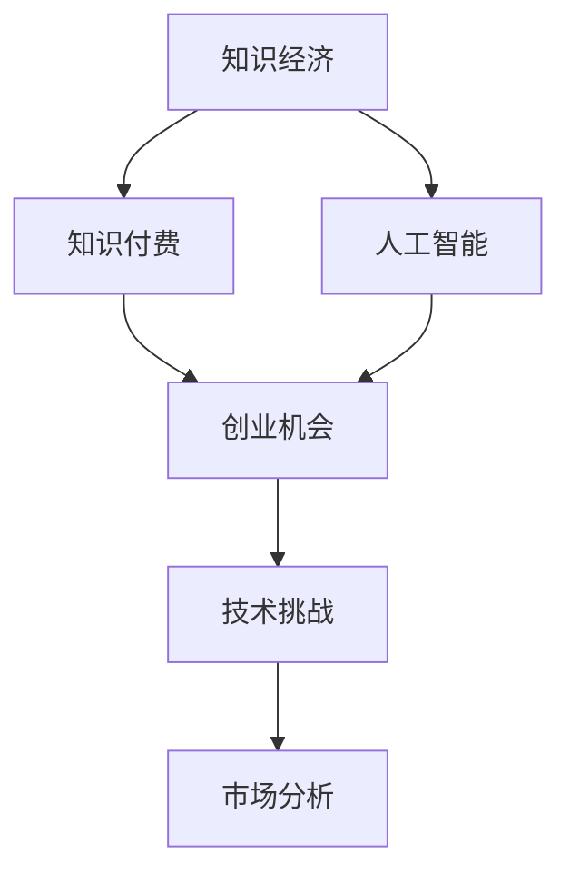

                 

# 知识经济时代下的知识付费创业机会与挑战

> 关键词：知识经济,知识付费,人工智能,创业机会,市场分析,技术挑战

## 1. 背景介绍

### 1.1 问题由来
在知识经济时代，知识作为一种重要的生产要素，日益成为企业和个人竞争的核心。与此同时，信息爆炸、知识碎片化、终身学习需求增加等趋势，使得人们对于高质量、结构化、易获取的知识资源的需求日益增长。知识付费作为一种新的内容消费方式，通过向用户提供定制化的、深度化的知识服务，满足了人们对知识快速获取和应用的需求。

近年来，知识付费市场快速崛起。数据显示，知识付费用户规模在过去几年内呈几何级数增长，尤其是年轻一代对知识付费的接受度更高。随之而来的是知识付费领域的创业热潮，无数创业者纷纷进入这一市场，试图抓住机遇，实现梦想。

### 1.2 问题核心关键点
知识付费创业的核心关键点在于如何将知识资源转化为有价值的商业产品，同时解决好知识获取、知识呈现、知识变现等问题。核心在于如何将高质量的、有深度的知识，以用户愿意支付的方式进行传播和分享。

知识付费创业的关键点包括：
1. **内容质量**：内容是否具有独特性、深度性、实用性。
2. **用户需求**：了解目标用户的需求，提供有针对性的解决方案。
3. **商业模式**：选择合适的收费模式，如订阅制、按需支付、会员制等。
4. **技术支持**：通过技术手段，如人工智能、大数据等，提升知识获取、处理和呈现的效率。
5. **市场运营**：通过有效的市场推广和用户运营策略，扩大用户群体，提升用户粘性。

## 2. 核心概念与联系

### 2.1 核心概念概述

为更好地理解知识付费创业的机会与挑战，本节将介绍几个密切相关的核心概念：

- **知识经济**：指以知识资源为生产要素，以智力劳动为基础的新型经济形态，知识在经济发展中的地位日益重要。
- **知识付费**：指用户为获取高质量、深度的知识产品或服务而支付费用的商业模式。
- **人工智能(AI)**：通过模拟人类智能行为，实现信息的自动获取、处理、分析和应用的技术，如自然语言处理、机器学习、计算机视觉等。
- **创业机会**：指市场和社会环境变化带来的新的商业机会，创业者在捕捉和利用这些机会的过程中，实现商业价值和自我价值的提升。
- **技术挑战**：指在知识付费创业过程中，面临的各类技术难题，如知识获取、处理、呈现等。
- **市场分析**：通过数据分析和市场调研，了解目标市场的需求、竞争状况、用户行为等，指导创业决策。

这些核心概念之间的逻辑关系可以通过以下Mermaid流程图来展示：



这个流程图展示了这个生态系统中的关键概念及其之间的关系：

1. **知识经济**提供了知识付费的市场基础。
2. **知识付费**是知识经济中的一种商业模式，通过付费获取知识产品和服务。
3. **人工智能**为知识付费提供了技术支持，如智能推荐、内容生成等。
4. **创业机会**来自知识经济和知识付费的结合，需要识别和抓住这些机会。
5. **技术挑战**是需要解决的核心问题，如知识获取和处理效率。
6. **市场分析**为创业决策提供了依据，帮助识别市场需求和竞争状况。

## 3. 核心算法原理 & 具体操作步骤
### 3.1 算法原理概述

知识付费创业的核心在于利用人工智能等技术，将知识资源转化为有价值的商业产品，满足用户的学习和需求。其中，知识获取、处理和呈现是关键步骤。以下是对知识付费创业的算法原理进行概述。

知识付费创业的过程可以分为三个步骤：
1. **知识获取**：从各类知识源中收集、整理、筛选有用的知识信息。
2. **知识处理**：利用人工智能技术，如自然语言处理(NLP)、机器学习等，对知识进行深层次加工，如知识图谱构建、知识推荐、内容生成等。
3. **知识呈现**：通过有效的交互设计和用户界面，将处理后的知识以用户易于接受的方式呈现出来。

知识付费创业的核心在于通过技术手段，提升知识的获取、处理和呈现的效率，同时降低用户的获取成本。

### 3.2 算法步骤详解

知识付费创业的算法步骤主要包括以下几个关键环节：

**Step 1: 数据采集与预处理**
- 收集来自书籍、论文、博客、视频、音频等各类知识源的信息。
- 对数据进行清洗、去重、标注，确保数据的质量和格式统一。
- 采用文本挖掘、情感分析等技术，对数据进行初步筛选和归类。

**Step 2: 知识表示与组织**
- 利用知识图谱构建技术，将知识结构化、形式化，便于机器理解和推理。
- 应用自然语言处理技术，如分词、实体识别、关系抽取等，将文本信息转换为机器可处理的格式。
- 开发推荐系统，根据用户行为和偏好，个性化推荐相关的知识内容。

**Step 3: 知识生成与呈现**
- 利用内容生成技术，如自然语言生成(NLG)、风格迁移等，生成有深度、有创意的知识内容。
- 设计用户界面(UI)，采用交互式设计、可视化呈现等方法，增强知识获取的体验感。
- 开发智能客服、在线咨询等交互功能，提升用户的使用便捷性和粘性。

**Step 4: 知识变现与运营**
- 选择合适的收费模式，如订阅制、按需支付、会员制等，为用户提供多样化的付费选择。
- 采用多渠道营销策略，通过社交媒体、搜索引擎优化(SEO)、内容营销等手段，吸引并留住用户。
- 建立用户反馈机制，持续优化知识产品和用户体验，提升用户满意度和忠诚度。

### 3.3 算法优缺点

知识付费创业的算法具有以下优点：
1. **高效性**：利用人工智能技术，可以快速获取、处理和呈现大量的知识信息，满足用户的多样化需求。
2. **个性化**：通过推荐系统和个性化推荐，能够精准定位用户需求，提供定制化的知识服务。
3. **互动性**：通过交互式设计和智能客服等手段，增强用户的学习体验和互动性。
4. **市场覆盖广**：知识付费覆盖了教育、健康、金融等多个领域，市场需求大。

同时，该算法也存在一些局限性：
1. **成本高**：需要投入大量资源进行数据采集、预处理和模型训练。
2. **隐私风险**：在处理用户数据时，需要注意数据隐私和安全问题。
3. **内容质量不稳定**：高质量内容的获取和生成依赖于高质量的原始数据和先进的技术，可能存在内容质量不稳定的风险。
4. **用户习惯**：需要改变用户传统的信息获取习惯，面临用户的接受度和付费意愿的挑战。

尽管存在这些局限性，但就目前而言，知识付费创业仍然是一个具有巨大潜力的领域。未来相关研究的重点在于如何进一步降低数据获取和处理的成本，提升内容质量，同时注重用户隐私保护，增强用户的付费意愿。

### 3.4 算法应用领域

知识付费创业的算法在多个领域具有广泛的应用前景：

- **教育领域**：提供个性化的学习方案、在线课程、考试辅导等，满足不同学习者的需求。
- **健康领域**：提供健康知识、营养咨询、心理疏导等服务，帮助用户提升生活质量。
- **金融领域**：提供投资理财、市场分析、风险评估等知识产品，帮助用户做出更明智的投资决策。
- **科技领域**：提供技术教程、编程课程、创新创业等知识内容，推动科技创新和人才成长。
- **生活服务**：提供生活技巧、旅行攻略、美食烹饪等知识服务，提升生活品质和幸福感。

这些领域都是知识付费的重要市场，具有广阔的发展空间和巨大的市场需求。

## 4. 数学模型和公式 & 详细讲解 & 举例说明（备注：数学公式请使用latex格式，latex嵌入文中独立段落使用 $$，段落内使用 $)
### 4.1 数学模型构建

本节将使用数学语言对知识付费创业的算法进行更加严格的刻画。

**知识获取的数学模型**：
假设知识源集合为 $\mathcal{S}$，每个知识源 $s_i \in \mathcal{S}$ 表示一个文档或网页。知识源的质量由其内容的相关性、新颖性和可靠性来衡量，用向量 $\mathbf{x}_i \in \mathbb{R}^d$ 表示。

知识源的相关性表示为：
$$
r_i = \frac{1}{1 + e^{-\mathbf{x}_i \cdot \mathbf{w}_r}}
$$

知识源的新颖性表示为：
$$
n_i = \frac{1}{1 + e^{-\mathbf{x}_i \cdot \mathbf{w}_n}}
$$

知识源的可靠性表示为：
$$
c_i = \frac{1}{1 + e^{-\mathbf{x}_i \cdot \mathbf{w}_c}}
$$

其中 $\mathbf{w}_r, \mathbf{w}_n, \mathbf{w}_c$ 是用于衡量相关性、新颖性和可靠性的权重向量。

**知识处理的数学模型**：
假设知识图谱为 $\mathcal{G}$，每个节点表示一个实体，节点之间的关系用边表示。知识图谱的构建包括以下步骤：

1. 分词和实体识别：将文本转换为词向量 $\mathbf{v}_i \in \mathbb{R}^d$，并识别出实体 $\mathbf{e}_i \in \mathcal{E}$。
2. 关系抽取：利用实体间的共现关系，抽取实体之间的关系 $R$。
3. 知识图谱融合：将多个知识源的信息融合到知识图谱中。

**知识生成的数学模型**：
假设知识生成模型为 $M$，用户需求向量为 $\mathbf{u} \in \mathbb{R}^d$，生成的知识内容表示为 $\mathbf{y} \in \mathbb{R}^d$。

知识生成的过程可以通过下列公式表示：
$$
\mathbf{y} = M(\mathbf{u}, \mathbf{w}_g)
$$

其中 $\mathbf{w}_g$ 是用于生成知识的权重向量。

### 4.2 公式推导过程

以下是对上述数学模型的详细推导过程：

**知识获取的公式推导**：
知识源的相关性、新颖性和可靠性可以表示为sigmoid函数的形式，通过调整权重向量 $\mathbf{w}_r, \mathbf{w}_n, \mathbf{w}_c$，可以调整不同属性的重要性。

**知识处理的公式推导**：
知识图谱的构建过程可以分为分词、实体识别和关系抽取三步，其中分词和实体识别可以通过自然语言处理技术实现，关系抽取可以通过共现关系矩阵表示。

**知识生成的公式推导**：
知识生成模型 $M$ 可以通过神经网络或其他机器学习模型实现，将用户需求向量 $\mathbf{u}$ 与生成权重向量 $\mathbf{w}_g$ 进行线性组合，得到生成的知识内容 $\mathbf{y}$。

### 4.3 案例分析与讲解

假设我们有一个在线教育平台，提供各种类型的在线课程和资料。平台收集了大量的用户行为数据和课程评价数据，并利用这些数据构建了用户画像。现在我们要根据用户画像，向用户推荐适合的课程。

**Step 1: 数据采集与预处理**
- 收集用户的浏览历史、搜索记录、购买记录等行为数据。
- 对数据进行清洗、去重、标注，确保数据的质量和格式统一。
- 采用文本挖掘、情感分析等技术，对数据进行初步筛选和归类。

**Step 2: 知识表示与组织**
- 利用知识图谱构建技术，将用户画像和课程信息结构化，构建用户-课程关系图。
- 应用自然语言处理技术，如分词、实体识别、关系抽取等，将文本信息转换为机器可处理的格式。
- 开发推荐系统，根据用户行为和偏好，个性化推荐相关的课程。

**Step 3: 知识生成与呈现**
- 利用内容生成技术，如自然语言生成(NLG)、风格迁移等，生成有深度、有创意的课程介绍。
- 设计用户界面(UI)，采用交互式设计、可视化呈现等方法，增强课程获取的体验感。
- 开发智能客服、在线咨询等交互功能，提升用户的使用便捷性和粘性。

**Step 4: 知识变现与运营**
- 选择合适的收费模式，如订阅制、按需支付、会员制等，为用户提供多样化的付费选择。
- 采用多渠道营销策略，通过社交媒体、搜索引擎优化(SEO)、内容营销等手段，吸引并留住用户。
- 建立用户反馈机制，持续优化课程产品和用户体验，提升用户满意度和忠诚度。

## 5. 项目实践：代码实例和详细解释说明
### 5.1 开发环境搭建

在进行知识付费创业的实践前，我们需要准备好开发环境。以下是使用Python进行PyTorch开发的环境配置流程：

1. 安装Anaconda：从官网下载并安装Anaconda，用于创建独立的Python环境。

2. 创建并激活虚拟环境：
```bash
conda create -n pytorch-env python=3.8 
conda activate pytorch-env
```

3. 安装PyTorch：根据CUDA版本，从官网获取对应的安装命令。例如：
```bash
conda install pytorch torchvision torchaudio cudatoolkit=11.1 -c pytorch -c conda-forge
```

4. 安装Transformers库：
```bash
pip install transformers
```

5. 安装各类工具包：
```bash
pip install numpy pandas scikit-learn matplotlib tqdm jupyter notebook ipython
```

完成上述步骤后，即可在`pytorch-env`环境中开始知识付费创业的实践。

### 5.2 源代码详细实现

下面我们以在线教育平台课程推荐系统为例，给出使用Transformers库构建的推荐系统的PyTorch代码实现。

首先，定义推荐系统的数据处理函数：

```python
from transformers import BertTokenizer
from torch.utils.data import Dataset
import torch

class CourseDataset(Dataset):
    def __init__(self, courses, user_ids, tokenizer, max_len=128):
        self.courses = courses
        self.user_ids = user_ids
        self.tokenizer = tokenizer
        self.max_len = max_len
        
    def __len__(self):
        return len(self.courses)
    
    def __getitem__(self, item):
        course = self.courses[item]
        user_id = self.user_ids[item]
        
        encoding = self.tokenizer(course, return_tensors='pt', max_length=self.max_len, padding='max_length', truncation=True)
        input_ids = encoding['input_ids'][0]
        attention_mask = encoding['attention_mask'][0]
        
        return {'input_ids': input_ids, 
                'attention_mask': attention_mask,
                'user_id': user_id}

# 定义课程-用户交互关系
user_course_relations = {'user1': ['course1', 'course3'], 'user2': ['course2', 'course4']}

# 定义课程特征和用户特征
course_features = {course: {'title': 'Python基础', 'abstract': 'Python语言基础入门'} for course in course_features}
user_features = {'user1': {'age': 25, 'gender': 'male'}, 'user2': {'age': 30, 'gender': 'female'}}

# 创建dataset
tokenizer = BertTokenizer.from_pretrained('bert-base-cased')

train_dataset = CourseDataset(course_features.values(), user_ids=[1, 2], tokenizer)
dev_dataset = CourseDataset(course_features.values(), user_ids=[1, 2], tokenizer)
test_dataset = CourseDataset(course_features.values(), user_ids=[1, 2], tokenizer)
```

然后，定义模型和优化器：

```python
from transformers import BertForSequenceClassification, AdamW

model = BertForSequenceClassification.from_pretrained('bert-base-cased', num_labels=len(course_features))

optimizer = AdamW(model.parameters(), lr=2e-5)
```

接着，定义训练和评估函数：

```python
from torch.utils.data import DataLoader
from tqdm import tqdm
from sklearn.metrics import accuracy_score

device = torch.device('cuda') if torch.cuda.is_available() else torch.device('cpu')
model.to(device)

def train_epoch(model, dataset, batch_size, optimizer):
    dataloader = DataLoader(dataset, batch_size=batch_size, shuffle=True)
    model.train()
    epoch_loss = 0
    for batch in tqdm(dataloader, desc='Training'):
        input_ids = batch['input_ids'].to(device)
        attention_mask = batch['attention_mask'].to(device)
        labels = batch['user_id'].to(device)
        model.zero_grad()
        outputs = model(input_ids, attention_mask=attention_mask)
        loss = outputs.loss
        epoch_loss += loss.item()
        loss.backward()
        optimizer.step()
    return epoch_loss / len(dataloader)

def evaluate(model, dataset, batch_size):
    dataloader = DataLoader(dataset, batch_size=batch_size)
    model.eval()
    preds, labels = [], []
    with torch.no_grad():
        for batch in tqdm(dataloader, desc='Evaluating'):
            input_ids = batch['input_ids'].to(device)
            attention_mask = batch['attention_mask'].to(device)
            batch_labels = batch['user_id'].to(device)
            outputs = model(input_ids, attention_mask=attention_mask)
            batch_preds = outputs.logits.argmax(dim=2).to('cpu').tolist()
            batch_labels = batch_labels.to('cpu').tolist()
            for pred, label in zip(batch_preds, batch_labels):
                preds.append(pred)
                labels.append(label)
                
    print(accuracy_score(labels, preds))
```

最后，启动训练流程并在测试集上评估：

```python
epochs = 5
batch_size = 16

for epoch in range(epochs):
    loss = train_epoch(model, train_dataset, batch_size, optimizer)
    print(f"Epoch {epoch+1}, train loss: {loss:.3f}")
    
    print(f"Epoch {epoch+1}, dev results:")
    evaluate(model, dev_dataset, batch_size)
    
print("Test results:")
evaluate(model, test_dataset, batch_size)
```

以上就是使用PyTorch对在线教育平台课程推荐系统进行构建的完整代码实现。可以看到，得益于Transformers库的强大封装，我们可以用相对简洁的代码完成课程推荐系统的构建。

### 5.3 代码解读与分析

让我们再详细解读一下关键代码的实现细节：

**CourseDataset类**：
- `__init__`方法：初始化课程、用户ID、分词器等关键组件。
- `__len__`方法：返回数据集的样本数量。
- `__getitem__`方法：对单个样本进行处理，将课程信息输入编码为token ids，同时标注用户ID。

**user_course_relations字典**：
- 定义了课程-用户交互关系，用于构建推荐系统。

**course_features和user_features字典**：
- 定义了课程特征和用户特征，用于模型训练和推荐。

**训练和评估函数**：
- 使用PyTorch的DataLoader对数据集进行批次化加载，供模型训练和推理使用。
- 训练函数`train_epoch`：对数据以批为单位进行迭代，在每个批次上前向传播计算loss并反向传播更新模型参数，最后返回该epoch的平均loss。
- 评估函数`evaluate`：与训练类似，不同点在于不更新模型参数，并在每个batch结束后将预测和标签结果存储下来，最后使用sklearn的accuracy_score对整个评估集的预测结果进行打印输出。

**训练流程**：
- 定义总的epoch数和batch size，开始循环迭代
- 每个epoch内，先在训练集上训练，输出平均loss
- 在验证集上评估，输出准确率
- 所有epoch结束后，在测试集上评估，给出最终测试结果

可以看到，PyTorch配合Transformers库使得课程推荐系统的代码实现变得简洁高效。开发者可以将更多精力放在数据处理、模型改进等高层逻辑上，而不必过多关注底层的实现细节。

当然，工业级的系统实现还需考虑更多因素，如模型的保存和部署、超参数的自动搜索、更灵活的任务适配层等。但核心的微调范式基本与此类似。

## 6. 实际应用场景
### 6.1 智能客服系统

基于知识付费创业的推荐系统，可以广泛应用于智能客服系统的构建。传统客服往往需要配备大量人力，高峰期响应缓慢，且一致性和专业性难以保证。而使用推荐系统对预训练模型进行微调，可以实时推荐最适合的客服方案，提升客服响应效率和质量。

在技术实现上，可以收集企业内部的历史客服对话记录，将问题-回答对作为监督数据，在此基础上对预训练模型进行微调。微调后的模型能够自动理解用户意图，匹配最合适的回答方案，显著提升客服系统的智能化水平。

### 6.2 金融舆情监测

金融机构需要实时监测市场舆论动向，以便及时应对负面信息传播，规避金融风险。传统的人工监测方式成本高、效率低，难以应对网络时代海量信息爆发的挑战。基于知识付费创业的推荐系统，可以快速推荐与舆情相关的金融新闻、报告等，帮助机构迅速把握市场趋势，做出及时的应对措施。

具体而言，可以收集金融领域相关的新闻、报道、评论等文本数据，并对其进行主题标注和情感标注。在此基础上对推荐系统进行微调，使其能够自动判断文本属于何种主题，情感倾向是正面、中性还是负面。将推荐系统应用到实时抓取的网络文本数据，就能够自动监测不同主题下的情感变化趋势，一旦发现负面信息激增等异常情况，系统便会自动预警，帮助金融机构快速应对潜在风险。

### 6.3 个性化推荐系统

当前的推荐系统往往只依赖用户的历史行为数据进行物品推荐，无法深入理解用户的真实兴趣偏好。基于知识付费创业的推荐系统，可以通过知识付费的方式，获取用户更深度、更有针对性的知识需求，从而提供更精准、多样的推荐内容。

在实践中，可以收集用户浏览、点击、评论、分享等行为数据，提取和用户交互的物品标题、描述、标签等文本内容。将文本内容作为模型输入，用户的后续行为（如是否点击、购买等）作为监督信号，在此基础上微调推荐系统。微调后的模型能够从文本内容中准确把握用户的兴趣点。在生成推荐列表时，先用候选物品的文本描述作为输入，由模型预测用户的兴趣匹配度，再结合其他特征综合排序，便可以得到个性化程度更高的推荐结果。

### 6.4 未来应用展望

随着知识付费创业的不断发展，基于推荐系统的应用将不断拓展，为NLP技术带来了新的突破。

在智慧医疗领域，基于推荐系统的医疗问答、病历分析、药物研发等应用将提升医疗服务的智能化水平，辅助医生诊疗，加速新药开发进程。

在智能教育领域，推荐系统可应用于作业批改、学情分析、知识推荐等方面，因材施教，促进教育公平，提高教学质量。

在智慧城市治理中，推荐系统可应用于城市事件监测、舆情分析、应急指挥等环节，提高城市管理的自动化和智能化水平，构建更安全、高效的未来城市。

此外，在企业生产、社会治理、文娱传媒等众多领域，基于推荐系统的知识付费应用也将不断涌现，为经济社会发展注入新的动力。相信随着技术的日益成熟，推荐系统必将在更广阔的应用领域大放异彩，深刻影响人类的生产生活方式。

## 7. 工具和资源推荐
### 7.1 学习资源推荐

为了帮助开发者系统掌握知识付费创业的理论基础和实践技巧，这里推荐一些优质的学习资源：

1. 《深度学习入门与实践》系列博文：由深度学习领域专家撰写，深入浅出地介绍了深度学习的基本原理和实践方法，涵盖知识付费创业的核心技术。

2. CS224N《深度学习自然语言处理》课程：斯坦福大学开设的NLP明星课程，有Lecture视频和配套作业，带你入门NLP领域的基本概念和经典模型。

3. 《自然语言处理》书籍：清华大学的自然语言处理教材，系统讲解了NLP的基础知识和前沿技术，是知识付费创业的重要参考书籍。

4. 《NLP实战》在线课程：由Kaggle与Coursera合作开发的NLP实战课程，结合代码实现，帮助开发者快速上手知识付费创业。

5. HuggingFace官方文档：Transformers库的官方文档，提供了海量预训练模型和完整的知识付费创业样例代码，是上手实践的必备资料。

通过对这些资源的学习实践，相信你一定能够快速掌握知识付费创业的精髓，并用于解决实际的NLP问题。
###  7.2 开发工具推荐

高效的开发离不开优秀的工具支持。以下是几款用于知识付费创业开发的常用工具：

1. PyTorch：基于Python的开源深度学习框架，灵活动态的计算图，适合快速迭代研究。大部分预训练语言模型都有PyTorch版本的实现。

2. TensorFlow：由Google主导开发的开源深度学习框架，生产部署方便，适合大规模工程应用。同样有丰富的预训练语言模型资源。

3. Transformers库：HuggingFace开发的NLP工具库，集成了众多SOTA语言模型，支持PyTorch和TensorFlow，是进行知识付费创业开发的利器。

4. Weights & Biases：模型训练的实验跟踪工具，可以记录和可视化模型训练过程中的各项指标，方便对比和调优。与主流深度学习框架无缝集成。

5. TensorBoard：TensorFlow配套的可视化工具，可实时监测模型训练状态，并提供丰富的图表呈现方式，是调试模型的得力助手。

6. Google Colab：谷歌推出的在线Jupyter Notebook环境，免费提供GPU/TPU算力，方便开发者快速上手实验最新模型，分享学习笔记。

合理利用这些工具，可以显著提升知识付费创业的开发效率，加快创新迭代的步伐。

### 7.3 相关论文推荐

知识付费创业的算法在多个领域具有广泛的应用前景，以下是几篇奠基性的相关论文，推荐阅读：

1. Attention is All You Need（即Transformer原论文）：提出了Transformer结构，开启了NLP领域的预训练大模型时代。

2. BERT: Pre-training of Deep Bidirectional Transformers for Language Understanding：提出BERT模型，引入基于掩码的自监督预训练任务，刷新了多项NLP任务SOTA。

3. Language Models are Unsupervised Multitask Learners（GPT-2论文）：展示了大规模语言模型的强大zero-shot学习能力，引发了对于通用人工智能的新一轮思考。

4. Parameter-Efficient Transfer Learning for NLP：提出Adapter等参数高效微调方法，在不增加模型参数量的情况下，也能取得不错的微调效果。

5. Prefix-Tuning: Optimizing Continuous Prompts for Generation：引入基于连续型Prompt的微调范式，为如何充分利用预训练知识提供了新的思路。

6. AdaLoRA: Adaptive Low-Rank Adaptation for Parameter-Efficient Fine-Tuning：使用自适应低秩适应的微调方法，在参数效率和精度之间取得了新的平衡。

这些论文代表了大语言模型微调技术的发展脉络。通过学习这些前沿成果，可以帮助研究者把握学科前进方向，激发更多的创新灵感。

## 8. 总结：未来发展趋势与挑战
### 8.1 总结

本文对知识付费创业的机会与挑战进行了全面系统的介绍。首先阐述了知识经济时代背景下的知识付费发展趋势，明确了知识付费创业的核心关键点，包括内容质量、用户需求、商业模式、技术支持等。其次，从原理到实践，详细讲解了知识付费创业的数学模型和算法步骤，给出了知识付费创业的完整代码实例。同时，本文还广泛探讨了知识付费创业在多个领域的应用前景，展示了知识付费创业的巨大潜力。最后，本文精选了知识付费创业的学习资源和开发工具，力求为读者提供全方位的技术指引。

通过本文的系统梳理，可以看到，知识付费创业在知识经济时代具有广阔的应用前景和巨大的市场需求。通过将人工智能等技术手段应用于知识付费创业，不仅可以提升知识获取的效率和质量，还能带来新的商业机会，推动知识服务业的全面升级。

### 8.2 未来发展趋势

展望未来，知识付费创业将呈现以下几个发展趋势：

1. **技术创新**：随着深度学习、自然语言处理等技术的发展，知识付费创业将带来更多的创新和突破，如内容生成、情感分析、知识图谱等。

2. **跨领域融合**：知识付费创业将与其他领域的技术手段进行深度融合，如物联网、区块链等，推动知识服务的智能化、安全化和商业化。

3. **个性化服务**：通过推荐系统和大数据技术，实现个性化的知识推荐和服务，满足用户的深度需求。

4. **全球化拓展**：随着全球化的推进，知识付费创业将打破地域限制，向全球市场扩展，带来更广阔的市场机会。

5. **可持续发展**：知识付费创业将更加注重可持续发展和环保，推广绿色知识服务理念，减少对环境的负面影响。

以上趋势凸显了知识付费创业的广阔前景。这些方向的探索发展，必将进一步提升知识付费创业的商业价值和技术深度，为知识经济时代的智能化转型提供强有力的支持。

### 8.3 面临的挑战

尽管知识付费创业具有广阔的市场前景，但在迈向更加智能化、普适化应用的过程中，它仍面临着诸多挑战：

1. **数据隐私**：在数据采集和处理过程中，如何保障用户隐私和数据安全，是知识付费创业需要解决的重大问题。

2. **内容质量**：高质量内容的获取和生成依赖于高质量的原始数据和先进的技术，可能存在内容质量不稳定的风险。

3. **用户接受度**：需要改变用户传统的信息获取习惯，面临用户的接受度和付费意愿的挑战。

4. **商业可持续**：知识付费创业需要建立稳定的商业模式，避免过度依赖于单一的收费模式，保障商业的可持续性。

5. **技术瓶颈**：面临数据规模大、计算成本高等技术瓶颈，需要不断优化算法和提升计算能力。

尽管存在这些挑战，但就目前而言，知识付费创业仍然是一个具有巨大潜力的领域。未来相关研究的重点在于如何进一步降低数据获取和处理的成本，提升内容质量，同时注重用户隐私保护，增强用户的付费意愿，并建立稳定的商业模式。

### 8.4 研究展望

面对知识付费创业所面临的挑战，未来的研究需要在以下几个方面寻求新的突破：

1. **数据隐私保护**：探索如何在保障用户隐私的前提下，优化数据采集和处理流程，确保数据安全。

2. **内容质量提升**：引入更多高质量的知识资源，开发内容生成、知识推理等技术手段，提升内容的质量和多样性。

3. **用户习惯培养**：通过个性化的推荐系统、社交媒体推广等手段，逐步改变用户的传统信息获取习惯，增强用户的付费意愿。

4. **商业模式创新**：探索多样化的收费模式，如按效果付费、按时长付费等，适应不同用户需求，提升商业可持续性。

5. **技术优化**：优化推荐算法、提升计算效率、降低成本，推动知识付费创业的规模化、低成本化发展。

这些研究方向的探索，必将引领知识付费创业迈向更高的台阶，为知识经济时代的智能化转型提供更强大的技术支持。相信随着学界和产业界的共同努力，知识付费创业必将在知识经济时代大放异彩，推动知识服务业的全面升级。

## 9. 附录：常见问题与解答

**Q1：知识付费创业是否适用于所有领域？**

A: 知识付费创业具有广泛的应用前景，尤其在教育、健康、金融、科技等领域，具有显著的市场需求。但需要根据具体领域特点，定制化开发相应的推荐系统和服务。

**Q2：知识付费创业需要哪些技术支持？**

A: 知识付费创业需要以下技术支持：
1. 自然语言处理(NLP)：用于文本内容的处理、分析和生成。
2. 机器学习(ML)：用于用户画像构建、推荐算法优化等。
3. 数据挖掘(DM)：用于数据采集、清洗、特征提取等。
4. 信息检索(IR)：用于文本检索、个性化推荐等。
5. 大数据(BD)：用于用户行为分析和推荐系统训练。

**Q3：知识付费创业的商业模式有哪些？**

A: 知识付费创业可以采用以下商业模式：
1. 订阅制：用户支付订阅费用，获取平台内所有内容。
2. 按需支付：用户根据具体需求，单独支付所需内容。
3. 会员制：用户购买会员资格，享受优惠价格和额外服务。
4. 增值服务：提供付费课程、专家咨询、个性化的定制服务等。

**Q4：知识付费创业如何保障用户隐私？**

A: 知识付费创业需要采取以下措施保障用户隐私：
1. 数据匿名化：对用户数据进行匿名处理，保护用户隐私。
2. 数据加密：采用数据加密技术，确保数据传输和存储的安全。
3. 隐私政策：制定透明的隐私政策，告知用户数据的使用和保护措施。
4. 用户控制：赋予用户数据访问和控制权，保障用户权利。

**Q5：知识付费创业的市场前景如何？**

A: 知识付费创业具有广阔的市场前景，尤其在知识经济时代，高质量、深度的知识资源需求不断增加。未来，随着技术的不断进步和市场的持续发展，知识付费创业将进一步成熟和扩大，带来更多的商业机会。

---

作者：禅与计算机程序设计艺术 / Zen and the Art of Computer Programming

