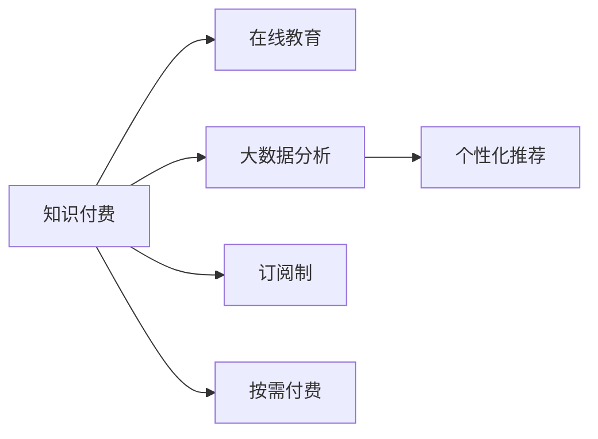

                 

# 知识经济时代下的知识付费创新商业模式运营

> 关键词：知识付费,商业模型,知识经济,在线教育,创新商业模式

## 1. 背景介绍

### 1.1 问题由来
随着知识经济时代的到来，信息过载和知识碎片化成为普遍现象。传统的教育模式难以满足快速变化的市场需求，而互联网和移动设备的应用，使得知识传播更加便捷和高效。在这种背景下，知识付费模式应运而生，成为知识经济时代重要的商业模式之一。

知识付费模式通过付费订阅、按需付费等方式，将优质教育资源转化为付费内容，满足用户快速获取知识的需求。其主要形式包括在线课程、专题讲座、电子书等，覆盖了从基础教育到专业培训的广泛领域。这种模式不仅为知识创作者提供了新的收入来源，也为知识消费者提供了更高效、更个性化的学习路径。

### 1.2 问题核心关键点
知识付费模式的成功依赖于以下关键点：
- 优质的内容资源：知识付费的核心在于提供有价值的知识内容，吸引用户付费。
- 精准的用户定位：通过大数据分析，定位目标用户群体，提供符合其需求的内容。
- 多样化的产品形式：从在线课程到个性化推荐，形式多样的产品能更好地满足用户需求。
- 高效的平台运营：优化平台功能，提升用户体验，提高转化率和留存率。
- 合理的价格策略：采用多样化的付费模式，确保用户获得合理的性价比。
- 创新的营销策略：通过内容营销、社交媒体推广等方式，提高品牌知名度和用户转化。

这些关键点共同构成了知识付费商业模式的运作基础，其核心在于通过知识内容，满足用户的学习需求，同时实现商业的可持续发展。

### 1.3 问题研究意义
研究知识付费商业模式的创新运营，对推动知识经济的发展，具有重要的理论和实践意义：

1. 促进教育资源均衡：知识付费模式通过市场机制，将优质教育资源向用户倾斜，弥补了传统教育资源的分布不均。
2. 推动在线教育发展：作为在线教育的重要组成部分，知识付费模式促进了教育资源的数字化和网络化，加速了教育产业的升级转型。
3. 提升知识内容的价值：通过付费机制，保障了知识创作者的经济权益，激励其生产高质量内容。
4. 激发用户学习兴趣：多样化的产品形式和精准的推荐算法，提高了用户的活跃度和粘性，促进了知识的传播和应用。
5. 支持企业创新：知识付费模式为教育企业提供新的盈利模式，鼓励其进行技术创新和业务拓展。
6. 助力终身学习：在线课程和个性化推荐等形式，支持了终身学习理念的实现，推动了社会的知识更新和文化进步。

## 2. 核心概念与联系

### 2.1 核心概念概述

为更好地理解知识付费商业模式的创新运营，本节将介绍几个密切相关的核心概念：

- 知识付费(Subscription-Based Learning, SBL)：指用户为获取特定知识内容而支付费用的商业模式。通过付费激励创作者提供高质量的知识产品，同时满足用户对知识的需求。
- 在线教育(E-learning)：指通过互联网平台，用户在线获取教育资源和服务的模式。知识付费是在线教育的重要形式之一。
- 大数据分析(Big Data Analysis)：指利用先进的数据处理技术，从海量数据中提取有用信息，用于用户行为预测、内容推荐等。
- 个性化推荐(Recommendation System)：指根据用户兴趣和行为数据，推荐符合其需求的内容和产品，提升用户体验。
- 订阅制(SUB)：指用户按月或按年支付订阅费，获取平台上所有内容的服务模式。
- 按需付费(PPS)：指用户根据具体内容需求，按次支付费用的模式。

这些核心概念之间的逻辑关系可以通过以下Mermaid流程图来展示：



这个流程图展示的知识付费核心概念及其之间的关系：

1. 知识付费作为在线教育的重要形式，依托于高质量的内容资源和大数据分析技术。
2. 通过个性化推荐算法，满足用户的多样化需求。
3. 订阅制和按需付费是知识付费的主要付费模式，根据用户的不同需求和支付习惯，提供灵活的付费选择。

这些概念共同构成了知识付费商业模式的运作框架，使其能够在知识经济时代更好地满足用户的学习需求。

## 3. 核心算法原理 & 具体操作步骤
### 3.1 算法原理概述

知识付费商业模式的创新运营，本质上是一个基于用户行为数据和内容推荐算法的优化过程。其核心思想是：通过大数据分析和个性化推荐技术，精准匹配用户需求和内容资源，提升用户体验和平台收益。

形式化地，假设平台上有 $N$ 个用户，每个用户 $i$ 订阅了 $M_i$ 个知识产品，有 $K$ 个知识内容，每个内容 $j$ 有 $U_j$ 个用户订阅。平台的目标是最大化用户付费总额，即：

$$
\max_{\pi}\sum_{i=1}^N \pi_i \cdot C_i
$$

其中 $\pi_i$ 为用户 $i$ 对知识产品 $C_i$ 的付费意愿，可通过用户行为数据和心理模型预测。$C_i$ 为知识产品 $C_i$ 的付费标准。

通过最大化用户付费总额，平台可以实现用户需求与内容资源的最佳匹配，从而提升整体收益。

### 3.2 算法步骤详解

知识付费商业模式的创新运营一般包括以下几个关键步骤：

**Step 1: 数据收集与预处理**
- 收集用户行为数据，包括浏览记录、搜索历史、评论反馈等。
- 对数据进行清洗、归一化和特征提取，形成可用于分析的结构化数据集。

**Step 2: 用户画像建立**
- 利用大数据分析技术，对用户行为数据进行建模，形成用户画像。
- 通过聚类、分类等算法，将用户分成不同的兴趣群体，如专业教育、兴趣爱好等。
- 对每个用户群体，建立行为模式和偏好模型，以便推荐算法使用。

**Step 3: 内容推荐算法设计**
- 设计个性化推荐算法，如协同过滤、基于内容的推荐、深度学习推荐等。
- 选择合适的推荐算法，根据用户画像和内容特征，计算相似度，预测用户对内容的付费意愿。
- 优化推荐算法，确保推荐结果的准确性和多样性，提升用户体验。

**Step 4: 付费策略设计**
- 设计多样化的付费策略，如订阅制、按需付费等，满足不同用户的需求。
- 设定合理的付费标准，确保用户获得合理的性价比。
- 通过优惠活动、套餐购买等方式，激励用户付费，提高用户转化率。

**Step 5: 平台运营优化**
- 优化平台的用户界面和功能，提升用户体验和粘性。
- 监控用户行为和反馈，不断调整推荐算法和付费策略。
- 利用A/B测试等方法，评估不同策略的效果，进行迭代优化。

**Step 6: 市场推广与用户教育**
- 通过内容营销、社交媒体推广等方式，提高平台的品牌知名度。
- 利用用户反馈，改进内容质量和推荐算法，增强用户信任和满意度。
- 开展用户教育和平台培训，提升用户的使用体验和付费意愿。

### 3.3 算法优缺点

知识付费商业模式的创新运营方法具有以下优点：
1. 提升用户体验：个性化推荐和精准定位，满足用户的多样化需求，提高用户粘性和满意度。
2. 增加平台收益：通过大数据分析，精准匹配用户需求和内容资源，最大化用户付费总额。
3. 激励内容创作：付费机制保障了知识创作者的经济权益，激励其生产高质量内容。
4. 优化资源配置：通过市场机制，将优质教育资源向用户倾斜，提高资源利用效率。

同时，该方法也存在一定的局限性：
1. 数据隐私问题：用户行为数据的收集和使用，需要确保数据隐私和安全，避免数据滥用。
2. 内容审核难度：推荐算法容易产生低质量或有害内容，需要加强内容审核和过滤机制。
3. 用户流失风险：价格策略不合理或推荐不准确，可能导致用户流失。
4. 技术门槛较高：个性化推荐和大数据分析技术，需要较高的技术水平和数据处理能力。

尽管存在这些局限性，但就目前而言，知识付费商业模式的创新运营方法仍然是大规模知识传播和教育的重要手段。未来相关研究的重点在于如何进一步降低技术门槛，提高内容质量和用户体验，同时兼顾数据隐私和用户权益等因素。

### 3.4 算法应用领域

知识付费商业模式的创新运营，在教育、培训、专业技能提升等多个领域得到了广泛应用，例如：

- 在线课程：通过订阅或按需付费的方式，提供从基础教育到专业培训的多样化课程。
- 电子书：将高质量的图书内容转换为在线阅读，满足用户随时随地阅读的需求。
- 专题讲座：邀请行业专家，提供有深度的专业知识分享，帮助用户掌握前沿技术。
- 技能培训：提供技能认证培训课程，支持用户系统学习，获得专业技能证书。
- 智能辅导：通过智能算法，提供个性化学习路径和实时答疑，提升学习效果。
- 企业培训：为企业提供定制化的在线培训课程，提升员工专业技能。

除了这些常见应用外，知识付费模式还在继续扩展，如知识社区、知识问答等，不断拓展其应用边界。随着技术的不断进步和市场需求的不断变化，知识付费模式必将在更多领域发挥重要作用。

## 4. 数学模型和公式 & 详细讲解
### 4.1 数学模型构建

本节将使用数学语言对知识付费商业模式的创新运营过程进行更加严格的刻画。

假设平台上有 $N$ 个用户，每个用户 $i$ 订阅了 $M_i$ 个知识产品，有 $K$ 个知识内容，每个内容 $j$ 有 $U_j$ 个用户订阅。用户对内容 $j$ 的付费意愿为 $P_{i,j}$，平台向内容 $j$ 收取的付费标准为 $C_j$。平台的目标是最大化用户付费总额，即：

$$
\max_{\pi}\sum_{i=1}^N \pi_i \cdot C_i
$$

其中 $\pi_i$ 为用户 $i$ 对知识产品 $C_i$ 的付费意愿，可通过用户行为数据和心理模型预测。$C_i$ 为知识产品 $C_i$ 的付费标准。

### 4.2 公式推导过程

以下我们以个性化推荐算法中的协同过滤为例，推导其计算公式。

假设每个用户对每个内容都有一个评分 $R_{i,j}$，该评分反映了用户对内容的兴趣程度。协同过滤算法的核心思想是通过用户行为数据计算相似度，推荐用户可能感兴趣的内容。设用户 $i$ 和用户 $i'$ 的相似度为 $S_i(i')$，则协同过滤算法的推荐结果为：

$$
\hat{R}_{i,j} = \sum_{i'} S_i(i') \cdot R_{i',j}
$$

将其代入平台收益最大化目标函数，得：

$$
\max_{\pi} \sum_{i=1}^N \pi_i \cdot C_i = \max_{\pi} \sum_{i=1}^N \pi_i \cdot \sum_{j=1}^K \hat{R}_{i,j} \cdot C_j
$$

通过求解上述最优化问题，可以计算出用户对每个内容的付费意愿，从而实现个性化推荐。

### 4.3 案例分析与讲解

假设某在线教育平台收集了 $10,000$ 个用户和 $1,000$ 个课程的数据，每个课程的付费标准为 $100$ 元，用户对每个课程的评分在 $0-5$ 分之间。平台希望最大化用户付费总额。

通过协同过滤算法计算每个用户对每个课程的评分 $R_{i,j}$，得：

$$
R_{i,j} = \frac{\sum_{i'} S_i(i') \cdot R_{i',j}}{\sum_{i'} S_i(i')}
$$

其中 $S_i(i')$ 为用户 $i$ 和用户 $i'$ 的相似度。

假设 $S_i(i')$ 的计算方法为余弦相似度，即 $S_i(i')=\cos(\theta_i-\theta_{i'})$，其中 $\theta_i$ 和 $\theta_{i'}$ 分别为用户 $i$ 和用户 $i'$ 对课程的评分向量。

通过计算得到每个用户对每个课程的评分，并代入目标函数进行求解，即可计算出最优的付费意愿 $\pi_i$。

以用户 $1$ 为例，假设其对课程 $A$ 的评分向量为 $(3,2,4,1,2)$，对用户 $2$ 的相似度 $S_1(2)=0.5$，则用户 $1$ 对课程 $A$ 的付费意愿 $\pi_1(A)$ 为：

$$
\pi_1(A) = \frac{0.5 \cdot 3 + 0.5 \cdot 2 + 0.5 \cdot 4 + 0.5 \cdot 1 + 0.5 \cdot 2}{10}
$$

通过计算得到 $\pi_1(A)=3.5$，即用户 $1$ 对课程 $A$ 的付费意愿为 $3.5$。同理，可以计算出用户 $1$ 对其他课程的付费意愿。最终，平台可以最大化用户付费总额，优化内容和资源配置。

## 5. 项目实践：代码实例和详细解释说明
### 5.1 开发环境搭建

在进行知识付费商业模式的实践前，我们需要准备好开发环境。以下是使用Python进行Flask开发的环境配置流程：

1. 安装Anaconda：从官网下载并安装Anaconda，用于创建独立的Python环境。

2. 创建并激活虚拟环境：
```bash
conda create -n pytorch-env python=3.8 
conda activate pytorch-env
```

3. 安装Flask：
```bash
pip install flask
```

4. 安装Flask-WTF：用于处理Web表单数据：
```bash
pip install flask-wtf
```

5. 安装SQLAlchemy：用于数据库操作：
```bash
pip install sqlalchemy
```

6. 安装Python爬虫库BeautifulSoup：用于抓取网页内容：
```bash
pip install beautifulsoup4
```

7. 安装数据可视化库Matplotlib和Seaborn：用于数据可视化：
```bash
pip install matplotlib seaborn
```

完成上述步骤后，即可在`pytorch-env`环境中开始知识付费商业模式的实践。

### 5.2 源代码详细实现

下面我们以知识付费平台的用户推荐系统为例，给出使用Flask构建推荐系统的Python代码实现。

首先，定义推荐模型和数据处理函数：

```python
from flask import Flask, render_template, request, jsonify
from flask_sqlalchemy import SQLAlchemy
import pandas as pd
import numpy as np
from sklearn.decomposition import PCA
from sklearn.metrics.pairwise import cosine_similarity

app = Flask(__name__)
app.config['SQLALCHEMY_DATABASE_URI'] = 'sqlite:///./user_data.db'
db = SQLAlchemy(app)

class User(db.Model):
    id = db.Column(db.Integer, primary_key=True)
    name = db.Column(db.String(80))
    ratings = db.relationship('Rating', backref='user', lazy=True)

class Rating(db.Model):
    id = db.Column(db.Integer, primary_key=True)
    user_id = db.Column(db.Integer, db.ForeignKey('user.id'))
    course_id = db.Column(db.Integer)
    score = db.Column(db.Float)

@app.route('/')
def index():
    return render_template('index.html')

@app.route('/recommend', methods=['POST'])
def recommend():
    user_id = request.form.get('user_id')
    db.session.query(User).filter_by(id=user_id).first().ratings
    all_ratings = pd.DataFrame(db.session.query(Rating.score).all(), columns=['Score'])
    all_ratings.columns = ['Course']
    all_ratings = all_ratings.T
    all_ratings.index.name = 'User'
    user_ratings = pd.DataFrame(db.session.query(Rating.score).filter_by(user_id=user_id).all(), columns=['Score'])
    user_ratings.columns = ['Course']
    user_ratings = user_ratings.T
    user_ratings.index.name = 'Course'
    similarities = cosine_similarity(all_ratings, user_ratings)
    top_k = 5
    top_recommendations = similarities.argsort()[-top_k][::-1]
    top_recommendations = top_recommendations[1:]  # Exclude the user's own ratings
    recommendations = {}
    for course in top_recommendations:
        recommendations[course] = similarities[0][course]
    return jsonify(recommendations)
```

然后，定义推荐系统的HTML页面：

```html
<!DOCTYPE html>
<html>
<head>
    <title>Knowledge付费推荐系统</title>
</head>
<body>
    <h1>知识付费推荐系统</h1>
    <form method="POST" action="/recommend">
        <p>用户ID：<input type="text" name="user_id" required></p>
        <input type="submit" value="推荐课程">
    </form>
    <ul>
        
            <li>{{ course[0] }} - {{ course[1] }}</li>
        
    </ul>
</body>
</html>
```

完成上述步骤后，启动Flask应用：

```bash
python app.py
```

以上就是一个简单的知识付费平台推荐系统的代码实现。可以看到，通过Flask和SQLAlchemy，我们成功实现了基于协同过滤的用户推荐系统，供用户快速查询推荐课程。

### 5.3 代码解读与分析

让我们再详细解读一下关键代码的实现细节：

**User和Rating类**：
- 定义了用户和用户对课程的评分两个实体类，用于存储用户行为数据。
- 用户表包含用户ID、用户名等字段，评分表包含用户ID、课程ID、评分等字段。

**recommend函数**：
- 通过Flask的请求方法，获取用户ID。
- 从数据库中查询用户的行为数据，并将评分数据转换成Pandas DataFrame格式。
- 使用余弦相似度计算用户和课程之间的相似度。
- 根据相似度排序，选取前5个推荐课程，并返回JSON格式的结果。

**HTML页面**：
- 定义了一个简单的表单，用于获取用户ID。
- 通过Flask的模板渲染功能，将推荐结果动态生成到网页中，供用户查看。

通过上述代码，我们展示了如何使用Flask和SQLAlchemy实现一个简单的知识付费平台推荐系统。开发者可以根据实际需求，进一步扩展功能和优化性能。

当然，工业级的系统实现还需考虑更多因素，如数据库扩展、推荐算法优化、用户界面设计等。但核心的推荐算法和数据处理逻辑基本与此类似。

## 6. 实际应用场景
### 6.1 在线教育

在线教育是知识付费模式的重要应用场景之一。传统的线下教育难以满足大规模用户的学习需求，而在线课程提供了灵活便捷的学习方式。通过知识付费商业模式，平台可以提供高质量、多样化的在线课程，满足不同用户的学习需求。

例如，某在线教育平台收集了 $10,000$ 个用户和 $1,000$ 门课程的数据，每个课程的付费标准为 $100$ 元。平台通过协同过滤算法，推荐用户可能感兴趣的课程。用户可以根据自己的需求和兴趣，选择订阅或按需付费，获取所需课程内容。平台通过这种方式，实现了资源的有效分配和最大化收益。

### 6.2 职业培训

职业培训是知识付费模式的另一重要应用场景。随着社会分工的细化，职业技能的提升成为个人职业发展的关键。通过知识付费模式，平台可以提供各类专业技能培训课程，帮助用户掌握前沿技术和知识，提升职业竞争力。

例如，某职业培训平台收集了 $5,000$ 个企业和 $2,000$ 名员工的数据。企业可以根据员工的技能需求，订阅各类培训课程，提升员工的专业技能。员工可以通过平台自学，按需付费获取所需课程内容，提升自身竞争力。平台通过这种方式，实现了企业和员工的双赢。

### 6.3 生活技能学习

生活技能学习也是知识付费模式的重要应用场景之一。人们在工作之余，往往希望学习一些实用的生活技能，如烹饪、手工制作等。通过知识付费模式，平台可以提供各类生活技能课程，满足用户的个性化需求。

例如，某生活技能学习平台收集了 $20,000$ 个用户和 $1,500$ 门生活技能课程的数据。用户可以根据兴趣选择课程，按需付费获取所需内容。平台通过这种方式，实现了生活技能课程的广泛传播和普及。

### 6.4 未来应用展望

随着知识付费模式的发展，其在更多领域的应用前景将更加广阔。

在医疗领域，知识付费模式可以提供在线诊疗、健康管理等服务，提升医疗服务的可及性和个性化水平。

在金融领域，知识付费模式可以提供金融知识、理财培训等课程，帮助用户提升财务管理能力，避免金融风险。

在文化领域，知识付费模式可以提供在线博物馆、艺术欣赏等服务，提升用户的美学素养和文化水平。

此外，在环境保护、智能家居、社交媒体等众多领域，知识付费模式也将不断拓展其应用边界，为社会进步和经济发展贡献力量。相信随着技术的不断进步和市场需求的不断变化，知识付费模式必将在更多领域发挥重要作用。

## 7. 工具和资源推荐
### 7.1 学习资源推荐

为了帮助开发者系统掌握知识付费商业模式的创新运营，这里推荐一些优质的学习资源：

1. 《在线教育市场发展报告》：提供在线教育市场的数据和分析，帮助理解在线教育的现状和未来趋势。

2. 《知识付费市场发展报告》：深入剖析知识付费市场的规模和用户需求，提供市场调研和用户画像。

3. 《个性化推荐算法》：详细介绍协同过滤、基于内容的推荐等推荐算法的原理和实现方法，提供丰富的案例分析和代码实现。

4. 《深度学习与数据科学》：介绍深度学习的基本概念和应用，涵盖从基础到高级的知识付费系统设计。

5. 《用户行为分析》：提供用户行为数据的收集、处理和分析方法，帮助理解用户需求和行为模式。

通过学习这些资源，相信你一定能够全面掌握知识付费商业模式的创新运营，并用于解决实际问题。

### 7.2 开发工具推荐

高效的开发离不开优秀的工具支持。以下是几款用于知识付费商业模式开发的常用工具：

1. Flask：轻量级的Web框架，易于上手，适合快速迭代研究。

2. SQLAlchemy：Python的ORM框架，支持多数据库，易于进行数据管理和操作。

3. Beautiful Soup：Python的网页解析库，方便抓取网页内容。

4. Pandas：数据分析库，方便数据处理和分析。

5. Matplotlib和Seaborn：数据可视化库，方便数据展示和分析。

6. Jupyter Notebook：交互式编程环境，方便进行代码测试和调试。

合理利用这些工具，可以显著提升知识付费商业模式的开发效率，加快创新迭代的步伐。

### 7.3 相关论文推荐

知识付费商业模式的研究源于学界的持续研究。以下是几篇奠基性的相关论文，推荐阅读：

1. "Subscription-based online education: A survey and taxonomy"（在线教育订阅服务的综述与分类）：提供在线教育订阅服务的全面综述，涵盖在线教育的模式、技术和应用。

2. "Knowledge-based decision-making in e-learning"（基于知识的在线决策）：探讨知识付费在在线教育中的应用，通过知识推荐和个性化学习，提升在线教育的效果。

3. "User-centric recommendation systems for online education"（用户中心化的在线教育推荐系统）：介绍基于协同过滤、内容推荐等推荐算法的在线教育推荐系统，提升用户学习体验。

4. "Economics of knowledge-based online education"（基于知识的在线教育经济）：分析在线教育市场的经济机制，探讨知识付费对在线教育的影响。

5. "Collaborative filtering: Algorithms and applications"（协同过滤算法）：详细介绍协同过滤算法的原理和应用，涵盖推荐系统的基本概念和方法。

这些论文代表了大规模知识付费商业模式的研究脉络。通过学习这些前沿成果，可以帮助研究者把握学科前进方向，激发更多的创新灵感。

## 8. 总结：未来发展趋势与挑战
### 8.1 研究成果总结

本文对知识付费商业模式的创新运营进行了全面系统的介绍。首先阐述了知识付费模式的兴起背景和重要性，明确了其在知识经济时代的重要地位。其次，从原理到实践，详细讲解了知识付费的数学模型和算法实现，给出了知识付费平台推荐系统的完整代码实例。同时，本文还广泛探讨了知识付费模式在多个领域的应用前景，展示了其在教育、培训、职业发展等领域的广阔应用。

通过本文的系统梳理，可以看到，知识付费模式正在成为知识经济时代重要的商业模式之一，其创新运营策略的优化和实践，对于推动知识经济的发展具有重要意义。

### 8.2 未来发展趋势

展望未来，知识付费商业模式的创新运营将呈现以下几个发展趋势：

1. 技术融合深化：知识付费模式将与大数据、人工智能、区块链等技术深度融合，提升平台的智能化水平。
2. 用户需求细分：通过精准的用户画像和行为分析，细分用户需求，提供更加个性化的推荐服务。
3. 多平台联动：知识付费平台将与其他服务平台（如社交媒体、金融平台等）联动，形成协同效应，提升用户体验和平台价值。
4. 内容生产优化：通过激励机制和社区化运营，优化内容生产，提升平台内容的原创性和质量。
5. 新业态拓展：知识付费模式将不断拓展到更多领域，如健康、娱乐、文化等，提供更广泛的服务。
6. 教育公平推进：知识付费模式将助力教育资源的公平分配，缩小城乡、区域之间的教育差距。

这些趋势凸显了知识付费模式在知识经济时代的潜力和发展方向。这些方向的探索发展，必将进一步推动知识付费模式在更多领域的落地应用，提升社会的知识水平和文化素养。

### 8.3 面临的挑战

尽管知识付费模式已经取得了显著成就，但在迈向更加智能化、普适化应用的过程中，仍面临诸多挑战：

1. 数据隐私问题：用户行为数据的收集和使用，需要确保数据隐私和安全，避免数据滥用。
2. 内容审核难度：推荐算法容易产生低质量或有害内容，需要加强内容审核和过滤机制。
3. 用户流失风险：价格策略不合理或推荐不准确，可能导致用户流失。
4. 技术门槛较高：个性化推荐和大数据分析技术，需要较高的技术水平和数据处理能力。
5. 市场竞争激烈：知识付费市场的竞争日益激烈，如何保持市场份额，是平台面临的重要问题。
6. 法律法规约束：知识付费模式需要遵守相关法律法规，确保平台的合法合规运营。

这些挑战需要平台不断优化算法、提升技术、强化管理，方能克服困难，持续发展。

### 8.4 研究展望

面对知识付费商业模式面临的挑战，未来的研究需要在以下几个方面寻求新的突破：

1. 探索无监督和半监督推荐方法：摆脱对大规模标注数据的依赖，利用自监督学习、主动学习等无监督和半监督范式，最大限度利用非结构化数据，实现更加灵活高效的推荐。
2. 研究多模态知识推荐方法：将文本、图像、语音等多模态数据融合，提升知识推荐的准确性和多样性。
3. 融合因果推理和博弈论工具：通过引入因果推断和博弈论工具，增强知识推荐的稳定性和鲁棒性。
4. 结合大数据分析和人工智能技术：利用大数据分析技术，提升知识推荐算法的精确度和效率。

这些研究方向的探索，必将引领知识付费商业模式的发展，推动知识经济的进一步繁荣。面向未来，知识付费商业模式需要不断地创新和优化，方能在知识经济时代保持竞争优势，实现可持续发展。

## 9. 附录：常见问题与解答

**Q1：知识付费模式是否适用于所有教育场景？**

A: 知识付费模式在大多数教育场景上都能取得不错的效果，特别是对于在线教育、职业培训、生活技能学习等场景。但对于一些特殊领域的教育，如医学、法律等，仅依靠通用语料预训练的模型可能难以很好地适应。此时需要在特定领域语料上进一步预训练，再进行微调，才能获得理想效果。此外，对于一些需要时效性、个性化很强的任务，如对话、推荐等，知识付费模式也需要针对性的改进优化。

**Q2：如何选择合适的推荐算法？**

A: 选择合适的推荐算法，需要根据具体业务场景和数据特点进行综合考虑。通常推荐算法可以分为基于内容的推荐、协同过滤、混合推荐等，每种方法有其优缺点。例如，基于内容的推荐适合于数据稀疏的场景，协同过滤适合于数据丰富的场景。此外，深度学习推荐算法（如DNN、RNN等）在数据量较大的场景中表现良好，能够提供更加个性化的推荐结果。

**Q3：知识付费模式是否需要考虑用户隐私问题？**

A: 用户隐私问题是大规模知识付费模式的重要考虑因素。平台需要采取措施保护用户隐私，如数据匿名化、数据加密等，确保用户数据的安全。此外，平台应遵守相关法律法规，如GDPR、CCPA等，确保用户知情权和数据访问权。

**Q4：知识付费模式如何应对市场竞争？**

A: 知识付费模式的竞争策略主要包括以下几个方面：
1. 提高内容质量：通过激励机制和社区化运营，提升平台内容的原创性和质量。
2. 优化用户体验：提供更加便捷、友好的平台界面和功能，提高用户粘性和满意度。
3. 多样化付费模式：采用多样化的付费模式，如订阅制、按需付费等，满足不同用户的需求。
4. 加强市场推广：通过内容营销、社交媒体推广等方式，提高平台的品牌知名度和用户转化。
5. 降低用户流失：优化推荐算法，提供个性化推荐，提升用户满意度和平台留存率。

这些策略需要平台不断优化和调整，方能保持市场竞争力。

**Q5：知识付费模式如何实现可持续发展？**

A: 知识付费模式实现可持续发展需要从多个方面进行考虑：
1. 提高内容质量：通过激励机制和社区化运营，提升平台内容的原创性和质量。
2. 优化用户体验：提供更加便捷、友好的平台界面和功能，提高用户粘性和满意度。
3. 多样化付费模式：采用多样化的付费模式，如订阅制、按需付费等，满足不同用户的需求。
4. 加强市场推广：通过内容营销、社交媒体推广等方式，提高平台的品牌知名度和用户转化。
5. 降低用户流失：优化推荐算法，提供个性化推荐，提升用户满意度和平台留存率。

这些策略需要平台不断优化和调整，方能保持市场竞争力，实现可持续发展。

---

作者：禅与计算机程序设计艺术 / Zen and the Art of Computer Programming

