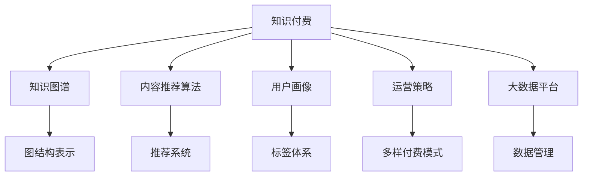

                 

# 知识经济时代下的知识付费创新商业模式运营

> 关键词：知识付费,创新商业模式,运营策略,数据驱动,人工智能,知识图谱,知识库构建,数据安全,隐私保护

## 1. 背景介绍

### 1.1 问题由来
随着互联网和移动设备普及，知识获取方式日益多样化。传统的线下教育和培训机构正受到互联网教育的强烈冲击。知识付费的兴起，则是知识获取方式转型的重要标志。

知识付费，即用户为获取深度、专业、高价值的知识内容，愿意支付一定的费用。这种模式在教育、咨询、文化等领域取得了显著效果，推动了知识经济的发展。然而，知识付费的商业模式仍面临诸多挑战：

1. 用户获取知识的需求日益多样化，传统平台难以满足个性化需求。
2. 知识付费的运营成本较高，平台盈利模式单一。
3. 内容质量参差不齐，用户辨别能力较低，付费体验不佳。
4. 知识变现模式单一，缺乏创新和灵活性。

为应对这些挑战，亟需构建创新的知识付费商业模式，以提升平台的核心竞争力。

### 1.2 问题核心关键点
知识付费的商业模式核心在于如何整合、包装和运营优质知识内容，从而提升用户黏性，实现商业变现。其主要包括以下几个方面：

- 优质内容建设：打造高质量、高价值、高专业度的知识内容。
- 用户画像分析：通过数据分析挖掘用户需求，进行个性化推荐。
- 运营策略优化：设计多样化的付费模式，提升用户参与度。
- 技术工具应用：利用大数据、人工智能、区块链等技术，优化平台运营。

本节将系统介绍知识付费商业模式的原理、步骤及面临的挑战，并提供实用的解决方案，助力平台运营商提升业务运营能力。

## 2. 核心概念与联系

### 2.1 核心概念概述

为更好地理解知识付费商业模式，本节将介绍几个关键概念及其关系：

- **知识付费**：用户为获取高质量、高价值的知识内容，愿意支付一定费用的商业模式。

- **知识图谱**：通过图结构组织知识，展示实体、关系、属性之间的内在联系，便于知识内容的快速检索和关联。

- **内容推荐算法**：利用机器学习算法对用户行为进行建模，根据用户兴趣和历史行为进行个性化内容推荐。

- **用户画像**：通过数据分析和挖掘，构建用户的基本属性、兴趣偏好、行为特征等标签，用于个性化的服务推荐。

- **运营策略**：设计多样化的付费模式、订阅机制、内容更新策略等，提升用户参与度和黏性。

- **大数据平台**：建立集中的数据管理平台，实现数据的统一存储、分析和利用。

这些概念通过下图的Mermaid流程图展示：



该流程图展示了知识付费商业模式中各核心概念的相互关系。

## 3. 核心算法原理 & 具体操作步骤
### 3.1 算法原理概述

知识付费商业模式的算法原理，主要体现在内容推荐算法和用户画像构建上。以下分别介绍这两个核心算法的基本原理。

### 3.2 算法步骤详解

#### 3.2.1 内容推荐算法
内容推荐算法的核心目标是通过分析用户行为数据，预测用户对知识内容的兴趣，从而进行个性化推荐。其基本步骤如下：

1. **数据收集与预处理**：
   - 收集用户点击、浏览、评论、购买等行为数据。
   - 对数据进行清洗、去重、归一化处理，构建特征向量。

2. **用户画像构建**：
   - 利用用户行为数据，构建用户的兴趣标签、历史行为特征等，形成用户画像。

3. **模型训练**：
   - 选择适合的推荐算法，如协同过滤、基于内容的推荐、深度学习等。
   - 利用用户画像和内容特征，训练推荐模型，得到用户对知识内容的兴趣权重。

4. **内容推荐**：
   - 根据用户画像和推荐模型，对知识内容进行排序，生成推荐列表。
   - 根据实时用户行为数据，进行动态调整和优化。

#### 3.2.2 用户画像构建
用户画像构建是知识付费平台个性化运营的重要基础。其基本步骤如下：

1. **数据采集**：
   - 收集用户基本信息、行为数据、社交网络数据等，形成多维度数据。

2. **特征提取**：
   - 从多维度数据中提取出用户的关键特征，如年龄、性别、兴趣、购买行为等。

3. **标签构建**：
   - 对用户特征进行标签化处理，形成用户画像标签体系。

4. **画像更新**：
   - 实时更新用户画像，保持画像的实时性和准确性。

### 3.3 算法优缺点
#### 3.3.1 内容推荐算法
- **优点**：
  - 提升用户满意度和黏性，增加用户转化率。
  - 优化知识内容展示，提升平台流量。

- **缺点**：
  - 推荐效果受数据质量和用户行为多样性影响较大。
  - 算法复杂度高，计算成本高。

#### 3.3.2 用户画像构建
- **优点**：
  - 提供个性化服务，提升用户满意度和黏性。
  - 降低推荐算法对用户行为数据的依赖。

- **缺点**：
  - 数据收集成本高，用户隐私保护压力大。
  - 画像标签体系设计复杂，需要持续迭代优化。

### 3.4 算法应用领域

内容推荐算法和用户画像构建广泛应用于知识付费平台的个性化推荐、广告定向投放、精准营销等领域。以下是具体应用场景：

- **内容推荐**：在知识付费平台首页、搜索结果页、个性化推荐模块等展示用户感兴趣的知识内容。
- **广告定向**：利用用户画像标签进行广告投放，提升广告转化率。
- **精准营销**：通过用户画像和行为数据，进行精准营销，提升营销效果。

## 4. 数学模型和公式 & 详细讲解

### 4.1 数学模型构建

知识付费商业模式涉及多维度数据，其数学模型构建复杂。以内容推荐算法为例，可构建以下数学模型：

$$
\begin{aligned}
\text{推荐结果} &= \text{内容评分} \times \text{用户评分} \\
\text{内容评分} &= \text{内容质量评分} + \text{内容相关性评分} \\
\text{用户评分} &= \text{用户历史评分} + \text{用户兴趣评分}
\end{aligned}
$$

其中，内容评分和用户评分是推荐算法的核心。内容评分包括内容质量评分和内容相关性评分，用户评分包括用户历史评分和用户兴趣评分。

### 4.2 公式推导过程

以协同过滤推荐算法为例，其基本思想是通过用户的历史行为数据，找到与当前用户兴趣相似的用户，从而推荐其感兴趣的内容。具体公式推导如下：

1. **用户兴趣矩阵**：
   - $U \in \mathbb{R}^{N \times M}$，$N$为用户数，$M$为知识内容数，$U_{ui} = 1$表示用户$u$对内容$i$感兴趣。

2. **用户兴趣相似度**：
   - 计算用户$i$和$j$的兴趣相似度$S_{ij}$，一般采用余弦相似度公式：
   $$
   S_{ij} = \frac{\vec{U}_i \cdot \vec{U}_j}{\|\vec{U}_i\| \cdot \|\vec{U}_j\|}
   $$

3. **用户推荐结果**：
   - 根据相似度矩阵$S$，计算用户$u$对内容的推荐评分：
   $$
   \hat{R}_{ui} = \sum_{v \in U} S_{uv} \times U_{vi}
   $$
   - 对推荐结果进行归一化处理，得到最终的推荐分数：
   $$
   R_{ui} = \frac{\hat{R}_{ui}}{\sum_{i'}\hat{R}_{ui'}}
   $$

4. **动态更新**：
   - 实时更新用户兴趣矩阵和相似度矩阵，提升推荐效果。

### 4.3 案例分析与讲解

以Coursera平台为例，其推荐系统基于协同过滤算法实现。通过分析用户的行为数据，构建用户画像和内容画像，从而进行个性化推荐。具体步骤如下：

1. **数据收集**：
   - 收集用户注册信息、课程浏览历史、课程评分、课程讨论等数据。

2. **特征提取**：
   - 对用户行为数据进行特征提取，如课程类别、用户活跃度、用户兴趣标签等。

3. **相似度计算**：
   - 利用余弦相似度公式，计算用户和课程之间的相似度。

4. **推荐生成**：
   - 根据用户画像和课程画像，生成个性化推荐列表。

5. **反馈优化**：
   - 实时监测用户点击、观看、完成率等反馈数据，调整推荐模型参数，提升推荐效果。

## 5. 项目实践：代码实例和详细解释说明
### 5.1 开发环境搭建

知识付费平台涉及多类技术栈，以下介绍常用开发环境搭建方法：

1. **Python环境配置**：
   - 安装Python 3.x版本，使用Anaconda创建虚拟环境。
   - 安装必要的Python包，如pandas、numpy、scikit-learn、tensorflow等。

2. **数据库搭建**：
   - 使用MySQL、PostgreSQL等关系型数据库，存储用户行为数据、知识内容数据等。
   - 使用Elasticsearch、Redis等NoSQL数据库，进行实时数据存储和查询。

3. **大数据平台搭建**：
   - 使用Hadoop、Spark等分布式计算框架，处理海量数据。
   - 使用Hive、Pig等数据仓库工具，进行数据建模和查询。

4. **AI模型部署**：
   - 使用TensorFlow、PyTorch等深度学习框架，构建和训练推荐模型。
   - 使用Amazon SageMaker、Google Cloud AI等云平台，进行模型部署和优化。

### 5.2 源代码详细实现

以下是Coursera平台推荐系统的代码实现，分为数据处理、模型训练、推荐生成和动态更新四个步骤：

#### 5.2.1 数据处理

```python
import pandas as pd
from sklearn.preprocessing import StandardScaler

# 读取用户行为数据
user_data = pd.read_csv('user_behavior.csv')

# 特征提取
features = ['age', 'gender', 'course_categories', 'active_days']
user_data = user_data[features]

# 数据标准化
scaler = StandardScaler()
user_data = scaler.fit_transform(user_data)

# 生成用户兴趣矩阵
user_matrix = pd.DataFrame(user_data, columns=user_data.columns)
user_matrix.index = user_matrix['user_id']
user_matrix = user_matrix.drop(['user_id'], axis=1)
```

#### 5.2.2 模型训练

```python
from sklearn.metrics.pairwise import cosine_similarity

# 计算用户相似度矩阵
user_similarity = cosine_similarity(user_matrix)

# 计算课程推荐分数
course_matrix = pd.read_csv('course_matrix.csv')
course_matrix = course_matrix.drop(['course_id'], axis=1)
course_matrix.columns = course_matrix.columns + '_rated'
course_matrix = course_matrix / course_matrix.abs().max()

# 生成推荐结果
user_course_matrix = pd.concat([user_matrix, course_matrix], axis=1)
user_course_matrix.columns = [f'{col}_user' for col in user_matrix.columns] + [f'{col}_course' for col in course_matrix.columns]

# 生成推荐分数
recommendation_scores = user_course_matrix.dot(user_course_matrix.T)
recommendation_scores = recommendation_scores / recommendation_scores.sum(axis=1)

# 动态更新
recommendation_scores = pd.DataFrame(recommendation_scores, columns=user_data.index)
recommendation_scores.index = course_matrix.index
```

#### 5.2.3 推荐生成

```python
# 生成推荐列表
recommended_courses = course_matrix.columns[recommendation_scores.sort_values().index].tolist()

# 推荐展示
for course in recommended_courses:
    print(course)
```

### 5.3 代码解读与分析

代码中使用了pandas、scikit-learn等Python库，实现数据处理、相似度计算、推荐分数生成等功能。以下是对关键代码的解读：

1. **数据处理**：
   - 使用pandas读取用户行为数据，进行特征提取和数据标准化。

2. **相似度计算**：
   - 使用sklearn的cosine_similarity函数计算用户相似度矩阵。

3. **推荐分数生成**：
   - 使用numpy的dot函数计算推荐分数矩阵。
   - 使用pandas的sort_values函数对推荐分数进行排序。

4. **动态更新**：
   - 使用pandas的drop和concat函数进行数据合并和重构。

## 6. 实际应用场景
### 6.1 在线教育平台

在线教育平台如Coursera、Udacity等，面临优质课程资源稀缺、用户需求多样化等问题。通过知识付费模式，可以缓解这些问题：

1. **优质课程内容**：
   - 平台与知名高校、专家合作，推出高质量课程。
   - 用户通过知识付费，支持优质课程的持续更新和制作。

2. **个性化推荐**：
   - 利用推荐算法，根据用户兴趣和行为，推荐最适合的课程。
   - 提高用户学习效率，提升平台黏性和满意度。

3. **多样化付费模式**：
   - 提供单次付费、月度订阅、长期订阅等多样化付费模式，满足不同用户需求。
   - 增加平台收益，降低运营成本。

### 6.2 企业培训平台

企业培训平台需要针对不同岗位需求，提供定制化的培训课程。知识付费模式可以：

1. **定制化培训**：
   - 根据企业需求，定制化设计培训课程，提升培训效果。
   - 企业通过知识付费，支持课程开发和更新。

2. **精准推荐**：
   - 利用用户画像和推荐算法，进行精准推荐，提升培训参与度。
   - 利用实时反馈数据，动态调整培训内容，提升培训效果。

3. **灵活付费模式**：
   - 提供按需付费、按效果付费等灵活付费模式，满足不同企业需求。
   - 增加平台收益，降低运营成本。

### 6.3 科技公司内部知识共享

科技公司内部知识共享平台面临员工知识碎片化、知识传承难等问题。通过知识付费模式，可以：

1. **知识传承**：
   - 激励员工分享知识，提升知识传承效果。
   - 用户通过知识付费，支持高质量知识内容的持续开发。

2. **精准匹配**：
   - 利用推荐算法，进行精准知识匹配，提升知识获取效率。
   - 利用实时反馈数据，动态调整知识推荐，提升知识匹配度。

3. **灵活付费模式**：
   - 提供按需付费、按使用时长付费等灵活付费模式，满足不同员工需求。
   - 增加平台收益，降低运营成本。

## 7. 工具和资源推荐
### 7.1 学习资源推荐

为帮助开发者系统掌握知识付费的商业运营技术，以下推荐一些优质学习资源：

1. **在线课程**：
   - Coursera、edX等平台，提供各类课程，涵盖数据科学、人工智能、商业运营等。

2. **专业书籍**：
   - 《知识付费平台运营实战》、《用户画像》等书籍，详细介绍知识付费运营策略和用户画像构建。

3. **开源项目**：
   - 开源推荐系统Spark MLlib、TensorFlow等，提供丰富的代码示例和模型实现。

4. **技术博客**：
   - 各大技术博客平台，如CSDN、博客园等，提供丰富的技术文章和实践经验分享。

### 7.2 开发工具推荐

以下是几款常用的知识付费平台开发工具，助力开发者提升开发效率：

1. **Python开发工具**：
   - PyCharm、Jupyter Notebook等IDE，提供强大的代码编辑、调试和执行功能。
   - Jupyter Notebook适合快速原型开发和代码实验。

2. **大数据工具**：
   - Hadoop、Spark等分布式计算框架，处理海量数据。
   - Hive、Pig等数据仓库工具，进行数据建模和查询。

3. **深度学习框架**：
   - TensorFlow、PyTorch等深度学习框架，构建和训练推荐模型。
   - Keras等高层次框架，提供便捷的模型构建和训练接口。

### 7.3 相关论文推荐

知识付费领域的论文涵盖多方面的技术和应用，以下推荐几篇具有代表性的论文：

1. **内容推荐算法**：
   - "Collaborative Filtering for Implicit Feedback Datasets"：Liu et al., 2016，介绍协同过滤推荐算法在隐式反馈数据集上的应用。
   - "A Matrix Factorization Approach with Explicit Feedback"：Wang et al., 2015，介绍矩阵分解方法在显式反馈数据集上的应用。

2. **用户画像构建**：
   - "Predicting User Puzzles and User Puzzles in Online Communities"：He et al., 2014，介绍利用用户行为数据构建用户画像的方法。
   - "User Profiling Based on Semantic Analysis of Social Media Text"：Sun et al., 2018，介绍利用语义分析技术构建用户画像的方法。

## 8. 总结：未来发展趋势与挑战
### 8.1 总结

本文对知识付费商业模式的原理、步骤及面临的挑战进行了全面系统的介绍。系统分析了内容推荐算法和用户画像构建的数学模型和实现步骤，并提供了实用的代码实现。同时，对知识付费平台在在线教育、企业培训、内部知识共享等场景中的应用进行了详细讨论。

通过本文的系统梳理，可以看到，知识付费商业模式在知识经济时代具有重要的应用价值和广泛的发展前景。未来，伴随技术手段的进步和数据驱动的深入应用，知识付费平台将更好地服务用户需求，创造更高的商业价值。

### 8.2 未来发展趋势

未来，知识付费商业模式将呈现以下几个发展趋势：

1. **数据驱动运营**：
   - 利用大数据和人工智能技术，进行用户画像构建、内容推荐和运营优化。
   - 提升平台运营的科学性和智能化水平。

2. **个性化服务提升**：
   - 利用个性化推荐算法，满足用户多样化的学习需求。
   - 提升用户满意度和平台黏性。

3. **多样化付费模式**：
   - 提供按需付费、按效果付费等灵活付费模式，满足不同用户需求。
   - 增加平台收益，降低运营成本。

4. **跨平台协作**：
   - 实现知识付费平台与其他学习平台、内容生产平台的协作，扩大知识资源覆盖面。
   - 提升平台的资源整合能力和服务能力。

5. **技术融合创新**：
   - 引入区块链、AI等前沿技术，提升知识付费平台的安全性、透明性和智能化水平。
   - 推动知识付费模式的创新和升级。

6. **用户隐私保护**：
   - 加强用户隐私保护，避免数据泄露和滥用。
   - 提升平台的用户信任和可靠性。

### 8.3 面临的挑战

尽管知识付费商业模式具有广阔的应用前景，但在实际运营中仍面临以下挑战：

1. **数据质量和用户隐私**：
   - 数据质量低下和隐私保护问题，影响推荐效果和用户体验。
   - 需要建立严格的数据治理和隐私保护机制。

2. **知识内容质量**：
   - 优质知识内容缺乏，内容同质化严重。
   - 需要加强知识内容的审查和质量管理。

3. **付费体验**：
   - 付费模式单一，用户满意度较低。
   - 需要设计多样化的付费模式和灵活的定价策略。

4. **技术瓶颈**：
   - 技术实现复杂，推荐算法和用户画像构建面临诸多挑战。
   - 需要持续优化推荐算法和数据处理流程。

5. **市场竞争**：
   - 知识付费平台竞争激烈，运营成本高。
   - 需要不断创新和提升服务质量，提升市场竞争力。

### 8.4 研究展望

未来，知识付费商业模式需要在以下方面进行进一步探索：

1. **数据驱动运营**：
   - 加强数据治理，提升数据质量。
   - 利用大数据和人工智能技术，进行用户画像构建和内容推荐。

2. **技术融合创新**：
   - 引入区块链、AI等前沿技术，提升平台的安全性和智能化水平。
   - 推动知识付费模式的创新和升级。

3. **多样化付费模式**：
   - 设计多样化的付费模式和灵活的定价策略，满足不同用户需求。
   - 增加平台收益，降低运营成本。

4. **用户隐私保护**：
   - 加强用户隐私保护，避免数据泄露和滥用。
   - 提升平台的用户信任和可靠性。

## 9. 附录：常见问题与解答

**Q1: 如何构建高质量的用户画像？**

A: 构建高质量的用户画像需要多维度数据支持，具体步骤如下：
1. 收集用户基本信息（如年龄、性别、教育背景等）。
2. 收集用户行为数据（如浏览记录、购买记录、评论记录等）。
3. 通过数据挖掘和机器学习算法，构建用户画像特征（如兴趣标签、行为特征等）。
4. 定期更新用户画像，保持画像的实时性和准确性。

**Q2: 如何提升推荐算法的效果？**

A: 提升推荐算法的效果可以从以下几个方面入手：
1. 数据预处理：确保数据质量，进行数据清洗、去重、归一化处理。
2. 算法优化：选择适合的推荐算法，进行模型训练和参数调优。
3. 用户反馈：实时监测用户反馈数据，动态调整推荐模型参数。
4. 跨平台协作：与其他平台进行数据共享和资源整合，提升推荐效果。

**Q3: 如何保证平台的数据安全和用户隐私？**

A: 保证平台的数据安全和用户隐私需要多方面措施：
1. 数据加密：采用数据加密技术，保护数据在传输和存储过程中的安全性。
2. 权限控制：建立严格的数据访问权限控制机制，确保数据只能被授权人员访问。
3. 匿名化处理：对敏感数据进行匿名化处理，降低数据泄露风险。
4. 隐私保护政策：制定并公开隐私保护政策，明确数据使用和保护的边界。

**Q4: 如何设计多样化的付费模式？**

A: 设计多样化的付费模式可以从以下几个方面入手：
1. 单次付费：用户根据单次需求支付费用，灵活方便。
2. 月度/年度订阅：用户按月/年支付费用，享受固定资源和服务。
3. 按效果付费：用户根据实际效果支付费用，激励优质内容生产。
4. 免费试用：提供免费试用期，吸引用户尝试和转化。

**Q5: 如何利用大数据平台提升运营效率？**

A: 利用大数据平台提升运营效率需要以下步骤：
1. 数据整合：将用户数据、内容数据、行为数据等进行整合，构建统一的数据仓库。
2. 实时分析：利用大数据分析工具，进行实时数据监控和分析。
3. 优化推荐：根据实时分析结果，优化推荐算法和策略。
4. 动态调整：根据用户反馈和行为数据，动态调整运营策略，提升用户体验。

---

作者：禅与计算机程序设计艺术 / Zen and the Art of Computer Programming

