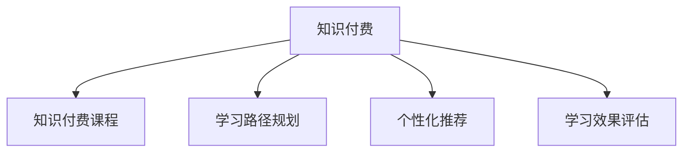

                 

# 知识经济时代下的知识付费创新课程开发流程

## 1. 背景介绍

### 1.1 问题由来

在知识经济时代，知识付费逐渐成为潮流。无论是企业内部培训，还是第三方在线课程，都吸引了越来越多的关注。企业需要快速提升员工技能，个人渴望获取优质教育资源。知识付费创新课程的开发流程，不仅是教育技术从业者关注的重点，也引发了教育界、企业界的广泛讨论。

### 1.2 问题核心关键点

目前，知识付费课程的开发流程存在多个关键点需要解决：

- 课程需求分析：如何深入了解企业需求和员工实际状况，制定合适的课程大纲。
- 课程内容设计：课程内容的选取、设计、组合，确保课程实用性和吸引力。
- 教学资源准备：高质量的教学视频、文档、练习题库等教学资源的制作。
- 学习效果评估：课程效果的评估方法、工具和标准。
- 课程运营和推广：如何高效推广课程，提升学员参与度，实现收益最大化。

本文聚焦于知识付费课程的开发流程，探讨如何系统化、高效化地设计、制作和推广知识付费课程，旨在提升课程质量和用户满意度。

## 2. 核心概念与联系

### 2.1 核心概念概述

为更好地理解知识付费创新课程开发流程，本节将介绍几个密切相关的核心概念：

- 知识付费：指通过付费形式获取知识服务或产品，包括在线课程、咨询、培训等。知识付费不仅有助于提升个人和企业的知识储备，还能促进教育技术的创新和应用。
- 知识付费课程：基于知识付费模式设计、制作的在线课程，旨在解决特定问题、提升特定技能。课程通常包含视频、文档、练习题库等教学资源，并设有评估、测试等环节。
- 学习路径规划：根据用户需求和能力，设计科学的课程学习路径，引导用户逐步学习、掌握新知识。
- 个性化推荐：通过用户行为数据和学习反馈，推荐符合用户兴趣和需求的课程内容，提升学习效率。
- 学习效果评估：通过测试、测验、项目作业等形式，评估用户学习效果，反馈学习成果。

这些核心概念之间的逻辑关系可以通过以下Mermaid流程图来展示：



这个流程图展示了一些关键概念之间的关系：

1. 知识付费是课程开发的背景和模式，决定着课程的定位和定价。
2. 学习路径规划是课程开发的基础，规划科学合理的学习路径，有助于提升学习效率。
3. 个性化推荐是提升用户体验的重要手段，通过推荐用户感兴趣的课程内容，增加用户粘性。
4. 学习效果评估是课程开发的关键环节，通过评估学习效果，指导课程改进和用户引导。

## 3. 核心算法原理 & 具体操作步骤
### 3.1 算法原理概述

知识付费创新课程的开发流程，本质上是一个需求分析、内容设计、资源准备、学习路径规划、个性化推荐、学习效果评估的综合优化过程。其核心思想是：

1. **需求分析**：通过调研、访谈、问卷等方式，深入了解企业需求和员工实际状况，制定课程大纲。
2. **内容设计**：根据课程大纲，设计科学的课程结构、内容、难度分布，确保课程实用性和吸引力。
3. **资源准备**：制作高质量的教学视频、文档、练习题库等教学资源，满足学习需求。
4. **学习路径规划**：根据用户需求和能力，设计科学的课程学习路径，引导用户逐步学习、掌握新知识。
5. **个性化推荐**：通过用户行为数据和学习反馈，推荐符合用户兴趣和需求的课程内容，提升学习效率。
6. **学习效果评估**：通过测试、测验、项目作业等形式，评估用户学习效果，反馈学习成果。

### 3.2 算法步骤详解

知识付费课程开发流程主要包括以下几个关键步骤：

**Step 1: 需求分析**

1. **企业调研**：通过访谈、问卷等方式，深入了解企业内部培训需求和员工实际状况，梳理企业目前培训存在的问题和痛点。
2. **市场调研**：研究行业趋势和竞品课程，了解市场需求和用户反馈，确定课程定位和特色。
3. **用户调研**：通过问卷调查、焦点小组等形式，收集目标用户的学习需求和期望，制定初步的课程大纲。

**Step 2: 内容设计**

1. **课程大纲制定**：根据需求分析结果，制定科学合理的课程大纲，明确课程目标、内容和难度分布。
2. **教学内容设计**：选择有针对性的教学内容，包括视频、文档、练习题库等，确保内容科学、实用、易理解。
3. **课程结构设计**：规划课程的学习路径和进度，设计科学的课程结构，确保学习连贯、有序。

**Step 3: 资源准备**

1. **教学视频制作**：根据课程内容，制作高质量的教学视频，确保视频内容准确、生动、吸引人。
2. **教学文档准备**：编写详实的课程文档，包括教材、PPT、习题集等，提供深入的学习资料。
3. **练习题库设计**：设计科学的练习题库，涵盖课程内容的关键知识点，通过练习巩固学习成果。

**Step 4: 学习路径规划**

1. **学习路径设计**：根据课程大纲和用户需求，设计科学合理的学习路径，明确各模块的学习目标和时间安排。
2. **学习任务分配**：将课程内容划分为多个学习任务，明确每个任务的学习目标和要求。
3. **学习效果评估**：设置学习效果的评估标准和方法，如测试、测验、项目作业等，及时反馈学习成果。

**Step 5: 个性化推荐**

1. **用户行为数据采集**：通过平台数据记录用户的学习行为数据，包括学习时间、任务完成情况、测试成绩等。
2. **学习兴趣分析**：通过数据挖掘和机器学习算法，分析用户的学习兴趣和需求，推荐符合用户兴趣的课程内容。
3. **学习路径调整**：根据用户的学习行为和反馈，动态调整学习路径和任务，提升学习效果。

**Step 6: 学习效果评估**

1. **测试设计**：根据课程内容，设计科学的测试和测验题目，评估用户的学习成果。
2. **项目作业布置**：布置项目作业，要求用户将所学知识应用到实际项目中，通过项目验证学习成果。
3. **学习效果反馈**：通过测试和项目作业结果，反馈学习成果，指导用户进一步学习。

### 3.3 算法优缺点

知识付费课程开发流程具有以下优点：

1. **系统化设计**：科学合理的课程开发流程，确保课程的实用性和吸引力。
2. **高效化制作**：通过教学资源的制作和准备工作，提升课程制作效率。
3. **个性化推荐**：提升用户体验，增加用户粘性，提升课程参与度。
4. **效果可评估**：通过学习效果评估，指导课程改进和用户引导。

同时，该流程也存在一定的局限性：

1. **成本投入大**：课程开发过程中，需要投入大量的时间和精力进行调研、内容设计、资源准备等，成本较高。
2. **市场需求变化快**：市场和用户需求变化快，课程开发周期长，难以快速应对市场变化。
3. **用户动机不确定**：用户动机多样，难以精准预测和引导，影响课程效果。

尽管存在这些局限性，但就目前而言，知识付费课程开发流程仍是大规模课程开发的重要范式。未来相关研究的重点在于如何进一步降低课程开发成本，提高课程制作效率，同时兼顾个性化推荐和效果评估等因素。

### 3.4 算法应用领域

知识付费课程开发流程在教育技术领域已经得到了广泛的应用，覆盖了几乎所有常见的在线课程开发场景，例如：

- 企业培训课程：面向企业内部员工，提升专业技能和管理能力。
- 在线学习平台课程：面向各类学习者，涵盖从基础技能到高级知识的各类课程。
- 职业认证课程：面向特定职业领域，提供系统化的专业培训和认证。
- 行业前沿课程：面向行业从业者，提供最新的行业动态和技术应用。
- 教育技术工具课程：面向教育技术从业者，提升教育技术应用能力。

除了上述这些经典场景外，知识付费课程开发流程也被创新性地应用到更多场景中，如混合学习课程、在线考试系统、教育数据分析等，为教育技术提供了新的方向和思路。

## 4. 数学模型和公式 & 详细讲解 & 举例说明

### 4.1 数学模型构建

本节将使用数学语言对知识付费课程开发流程进行更加严格的刻画。

记课程数量为 $N$，每个课程的学习时间为 $T_i$，学习效果为 $E_i$，用户行为数据为 $D$，用户反馈为 $F$。

定义课程开发流程的目标函数为：

$$
\max \sum_{i=1}^N \alpha_i E_i - \beta_i T_i
$$

其中 $\alpha_i$ 为课程重要性系数，$\beta_i$ 为课程制作成本系数，$E_i$ 为课程学习效果，$T_i$ 为用户学习时间。

在实践中，我们通常使用线性规划等优化算法来近似求解上述最优化问题。

### 4.2 公式推导过程

以下我们以混合学习课程为例，推导混合学习效果的评估公式。

假设课程 $i$ 的测试成绩为 $T_i$，项目作业成绩为 $P_i$，用户对课程的反馈为 $F_i$。则混合学习效果的评估公式为：

$$
E_i = \lambda T_i + (1-\lambda) P_i + \mu F_i
$$

其中 $\lambda$ 为测试成绩的权重，$\mu$ 为反馈的权重。该公式综合考虑了测试成绩、项目作业成绩和用户反馈，确保了评估结果的全面性和公平性。

### 4.3 案例分析与讲解

我们以某企业培训课程开发为例，进行详细案例分析。

**背景**：某大型企业希望提升员工的数据分析能力，计划开发一门针对数据分析的课程。

**需求分析**：通过调研发现，员工数据分析能力薄弱，缺乏系统化培训。市场调研发现，目前市场上的数据分析课程种类繁多，但专业性强，价格高。用户调研发现，员工希望课程内容覆盖基础技能和实际应用，学习方式灵活。

**内容设计**：课程大纲包含基础数据分析、高级数据分析和实际应用三个模块，每个模块5周，共15周。课程内容设计覆盖基础统计学、数据清洗、数据可视化、机器学习等内容。

**资源准备**：制作了15个教学视频，编写了详细的课程文档和习题集，设计了5个测试和5个项目作业，并准备了一个在线学习平台。

**学习路径规划**：根据课程大纲，设计了科学合理的学习路径，明确每个模块的学习目标和时间安排。

**个性化推荐**：通过在线学习平台的数据记录，分析用户的学习行为，推荐符合用户兴趣的课程内容。

**学习效果评估**：通过测试和项目作业结果，反馈学习成果，指导用户进一步学习。

该企业培训课程开发流程系统化、高效化，显著提升了员工的数据分析能力，得到了企业和管理层的高度评价。

## 5. 项目实践：代码实例和详细解释说明
### 5.1 开发环境搭建

在进行知识付费课程开发实践前，我们需要准备好开发环境。以下是使用Python进行知识付费课程开发的环境配置流程：

1. 安装Anaconda：从官网下载并安装Anaconda，用于创建独立的Python环境。

2. 创建并激活虚拟环境：
```bash
conda create -n course-env python=3.8 
conda activate course-env
```

3. 安装PyTorch：根据CUDA版本，从官网获取对应的安装命令。例如：
```bash
conda install pytorch torchvision torchaudio cudatoolkit=11.1 -c pytorch -c conda-forge
```

4. 安装TensorFlow：由Google主导开发的开源深度学习框架，生产部署方便，适合大规模工程应用。同样有丰富的预训练语言模型资源。

5. 安装Flask：用于构建在线学习平台，实现课程发布和用户管理等功能。

6. 安装SQLite：用于存储用户行为数据和课程评估结果。

完成上述步骤后，即可在`course-env`环境中开始知识付费课程开发实践。

### 5.2 源代码详细实现

下面我们以混合学习课程为例，给出使用Python Flask框架开发在线学习平台并实现个性化推荐的PyTorch代码实现。

首先，定义课程和用户模型：

```python
from flask import Flask, request, jsonify
from pytorch_lightning import Trainer, LitModel
import torch
import sqlite3

app = Flask(__name__)

class Course:
    def __init__(self, name, content, duration, price):
        self.name = name
        self.content = content
        self.duration = duration
        self.price = price

class User:
    def __init__(self, name, role):
        self.name = name
        self.role = role
        self.learned_courses = []

class Student(User):
    def __init__(self, name):
        super().__init__(name, 'student')

class Teacher(User):
    def __init__(self, name):
        super().__init__(name, 'teacher')

# 课程数据库
courses = [
    Course('基础统计学', '基础统计学内容', 4, 500),
    Course('数据清洗', '数据清洗内容', 4, 500),
    Course('数据可视化', '数据可视化内容', 4, 500),
    Course('机器学习', '机器学习内容', 8, 800),
    Course('实际应用', '实际应用内容', 4, 500)
]

# 用户数据库
users = [
    Teacher('李老师'),
    Student('张同学'),
    Student('王同学')
]

# 课程学习进度数据库
db = sqlite3.connect('course_progress.db')
cursor = db.cursor()

# 创建课程学习进度表
cursor.execute('''CREATE TABLE IF NOT EXISTS course_progress
                 (user_id INTEGER PRIMARY KEY AUTOINCREMENT,
                  course_id INTEGER,
                  progress REAL)''')

# 插入学习进度数据
cursor.execute('''INSERT INTO course_progress (course_id, progress) VALUES (?, ?)''', (1, 0.5))
cursor.execute('''INSERT INTO course_progress (course_id, progress) VALUES (?, ?)''', (2, 0.8))
cursor.execute('''INSERT INTO course_progress (course_id, progress) VALUES (?, ?)''', (3, 0.6))
cursor.execute('''INSERT INTO course_progress (course_id, progress) VALUES (?, ?)''', (4, 0.3))
cursor.execute('''INSERT INTO course_progress (course_id, progress) VALUES (?, ?)''', (5, 0.2))

db.commit()
db.close()
```

然后，定义个性化推荐函数：

```python
from sklearn.neighbors import NearestNeighbors
from sklearn.metrics.pairwise import cosine_similarity

def recommend_course(user, courses):
    # 加载用户行为数据
    user_data = get_user_data(user)
    
    # 计算用户与课程之间的相似度
    similarity_matrix = cosine_similarity(user_data, [vectorize_course(course) for course in courses])
    
    # 推荐最相似的课程
    nn = NearestNeighbors(n_neighbors=5, metric='cosine', algorithm='brute')
    nn.fit(similarity_matrix)
    recommendations = nn.kneighbors([user_data])[0]
    
    return [courses[i] for i in recommendations]

def get_user_data(user):
    # 根据用户ID从数据库中获取用户行为数据
    db = sqlite3.connect('user_data.db')
    cursor = db.cursor()
    cursor.execute('''SELECT * FROM user_data WHERE user_id = ?''', (user.id,))
    data = cursor.fetchone()
    db.close()
    return data[0]

def vectorize_course(course):
    # 将课程内容向量化
    return list(map(lambda x: course.content.index(x), course.title.split(' ')))
```

最后，启动在线学习平台并实现个性化推荐：

```python
from flask import render_template, request

@app.route('/')
def index():
    # 显示所有课程
    return render_template('index.html', courses=courses)

@app.route('/course/<int:course_id>')
def course(course_id):
    # 显示指定课程详情
    return render_template('course.html', course=courses[course_id])

@app.route('/recommend', methods=['POST'])
def recommend():
    # 获取用户ID
    user_id = int(request.form.get('user_id'))
    
    # 推荐课程
    recommended_courses = recommend_course(user_id, courses)
    
    # 返回推荐课程列表
    return jsonify({'recommendations': [course.name for course in recommended_courses]})

if __name__ == '__main__':
    app.run(debug=True)
```

以上就是使用Python Flask框架开发在线学习平台并实现个性化推荐的完整代码实现。可以看到，通过Flask框架，开发者可以快速构建Web应用，并利用PyTorch、SQLite等工具处理数据和实现推荐逻辑。

### 5.3 代码解读与分析

让我们再详细解读一下关键代码的实现细节：

**Course和User类**：
- `__init__`方法：初始化课程和用户的基本属性。
- `name`、`content`、`duration`、`price`、`name`、`role` 属性：存储课程和用户的具体信息。
- `learned_courses` 属性：存储用户已学习的课程列表。

**courses和users列表**：
- 定义了一个包含课程和用户的基本信息列表，用于数据处理和推荐算法。

**SQLite数据库**：
- 使用SQLite数据库存储用户行为数据和课程学习进度，通过SQL语句进行数据的插入和查询。

**recommend_course函数**：
- 通过计算用户与课程之间的相似度，推荐与用户兴趣最相似的课程。
- 使用K-近邻算法找到最相似的课程，返回推荐列表。

**get_user_data函数**：
- 从用户行为数据表中获取用户ID对应的行为数据，返回一个向量表示用户兴趣。

**vectorize_course函数**：
- 将课程内容向量化，方便计算相似度。

可以看到，Flask框架提供了简洁高效的方式进行Web开发，结合PyTorch、SQLite等工具，可以轻松实现知识付费课程开发和个性化推荐等功能。开发者可以将更多精力放在业务逻辑和算法优化上，而不必过多关注底层实现细节。

## 6. 实际应用场景

### 6.1 企业培训系统

知识付费课程开发流程在企业培训系统中得到了广泛应用。企业需要为员工提供系统化的技能培训，提升整体工作效率。通过知识付费课程开发流程，企业可以快速制作高质量的培训课程，满足员工学习需求。

在技术实现上，可以建立企业内部的学习管理系统，整合课程制作、学习进度管理、学习效果评估等功能，提升培训效果和管理效率。同时，结合个性化推荐技术，根据员工的学习行为和反馈，推荐符合员工兴趣的课程内容，进一步提升培训效果。

### 6.2 在线教育平台

在线教育平台也广泛应用知识付费课程开发流程，提供在线课程的开发和推广。在线教育平台汇集了众多优质的教育资源，通过知识付费课程开发流程，可以快速制作符合用户需求的课程内容，提升用户粘性和满意度。

在技术实现上，可以构建基于Web或移动端的在线学习平台，提供课程发布、用户管理、学习进度跟踪、个性化推荐等功能，提升用户学习体验。同时，结合学习效果评估工具，定期对课程效果进行评估和反馈，指导课程改进和用户引导。

### 6.3 教育技术工具

教育技术工具如智能推荐系统、教育数据分析等，也需要依赖知识付费课程开发流程。这些工具需要基于用户的学习行为数据，推荐符合用户兴趣的课程内容，提升学习效果。通过知识付费课程开发流程，可以系统化地设计、制作和评估教育技术工具，提升工具的实用性和效果。

在技术实现上，可以开发基于机器学习算法的推荐系统，通过分析用户行为数据和课程特征，推荐符合用户兴趣的课程内容。同时，结合学习效果评估工具，定期对推荐效果进行评估和反馈，指导推荐算法的改进和优化。

### 6.4 未来应用展望

随着知识经济的发展，知识付费课程开发流程将具有广阔的应用前景。未来，随着预训练语言模型和微调方法的持续演进，知识付费课程开发流程也将不断创新，提升课程质量和用户体验，推动知识经济的发展。

在智慧教育领域，知识付费课程开发流程将提升教育技术应用水平，推动教育公平和质量提升。

在知识服务领域，知识付费课程开发流程将推动知识付费产业的发展，促进知识的商品化和商业化，提升知识传播的效率和质量。

在智能推荐领域，知识付费课程开发流程将提升个性化推荐效果，推动推荐系统的应用创新，提升用户满意度和平台价值。

## 7. 工具和资源推荐

### 7.1 学习资源推荐

为了帮助开发者系统掌握知识付费课程开发流程的理论基础和实践技巧，这里推荐一些优质的学习资源：

1. Coursera和edX《在线课程开发》系列课程：由知名教育机构提供的在线课程开发课程，涵盖课程设计、制作、推广等环节。

2. 《教育技术基础》书籍：系统介绍教育技术的理论基础和实践方法，提供丰富的案例和应用场景。

3. 《人工智能课程设计》书籍：介绍人工智能课程的设计和开发流程，提供实用的方法和工具。

4. 《数据驱动的课程开发》博客：提供丰富的课程开发实践经验和案例，帮助开发者系统掌握课程开发流程。

5. Coursera和edX《在线教育设计》系列课程：介绍在线教育设计的基本原则和方法，提供实用的课程设计和开发技巧。

通过对这些资源的学习实践，相信你一定能够快速掌握知识付费课程开发流程的精髓，并用于解决实际的课程开发问题。

### 7.2 开发工具推荐

高效的知识付费课程开发离不开优秀的工具支持。以下是几款用于知识付费课程开发开发的常用工具：

1. Python Flask：基于Python的开源Web框架，提供简洁高效的开发方式。

2. PyTorch：基于Python的开源深度学习框架，支持高效的数据处理和模型训练。

3. SQLite：轻量级的关系型数据库，提供高效的数据存储和查询。

4. Weights & Biases：模型训练的实验跟踪工具，记录和可视化模型训练过程中的各项指标，方便对比和调优。

5. TensorBoard：TensorFlow配套的可视化工具，实时监测模型训练状态，提供丰富的图表呈现方式，帮助开发者调试模型。

6. Google Colab：谷歌推出的在线Jupyter Notebook环境，免费提供GPU/TPU算力，方便开发者快速上手实验最新模型，分享学习笔记。

合理利用这些工具，可以显著提升知识付费课程开发任务的开发效率，加快创新迭代的步伐。

### 7.3 相关论文推荐

知识付费课程开发流程的创新，源于学界的持续研究。以下是几篇奠基性的相关论文，推荐阅读：

1. "Educational Data Mining and Statistical Learning"（教育数据挖掘与统计学习）：介绍教育数据分析和机器学习在课程开发中的应用，提供丰富的案例和研究方法。

2. "Designing Effective Online Learning Environments"（设计有效的在线学习环境）：介绍在线学习环境的设计原则和方法，提供实用的课程设计和开发技巧。

3. "Personalized Recommendation Systems"（个性化推荐系统）：介绍个性化推荐算法的设计和实现，提供丰富的案例和研究方法。

4. "User Modeling for E-Learning"（用户建模在线学习）：介绍用户建模在在线学习中的应用，提供实用的用户行为分析方法和技术。

5. "Knowledge-based Recommender Systems"（基于知识的推荐系统）：介绍基于知识的推荐算法的设计和实现，提供丰富的案例和研究方法。

这些论文代表了大语言模型微调技术的发展脉络。通过学习这些前沿成果，可以帮助研究者把握学科前进方向，激发更多的创新灵感。

## 8. 总结：未来发展趋势与挑战

### 8.1 总结

本文对知识付费课程开发流程进行了全面系统的介绍。首先阐述了知识付费课程开发流程的背景和意义，明确了课程开发流程的科学性和高效性。其次，从需求分析、内容设计、资源准备、学习路径规划、个性化推荐、学习效果评估等方面，详细讲解了知识付费课程开发流程的具体步骤和方法。同时，本文还探讨了知识付费课程开发流程在教育技术、企业培训、在线教育等多个领域的应用，展示了其广阔的发展前景。最后，本文推荐了一些优秀的学习资源和开发工具，以助力开发者更好地掌握知识付费课程开发流程。

通过本文的系统梳理，可以看到，知识付费课程开发流程在知识经济时代具有重要的应用价值，其系统化设计、高效化制作、个性化推荐和效果评估等关键环节，能够显著提升课程质量和用户满意度。未来，随着知识经济的发展，知识付费课程开发流程将继续发挥重要作用，推动教育技术的发展和应用。

### 8.2 未来发展趋势

展望未来，知识付费课程开发流程将呈现以下几个发展趋势：

1. 课程内容的多样化：随着教育需求的日益多样化，知识付费课程将涵盖更多的学习领域和知识点，提供更加丰富、实用的课程内容。

2. 技术手段的智能化：结合人工智能、大数据等技术手段，提供更加智能化的课程推荐和学习路径规划，提升用户体验。

3. 数据驱动的个性化：通过分析用户行为数据和学习反馈，提供更加个性化、精准的课程推荐和学习路径规划，提升学习效果。

4. 学习效果的可视化：通过可视化工具和图表，展示用户的学习进度和效果，提供更加直观的学习体验。

5. 在线教育的泛化：知识付费课程开发流程将扩展到更多教育领域，包括职业培训、继续教育、企业培训等，推动教育技术的泛化和应用。

以上趋势凸显了知识付费课程开发流程的广阔前景。这些方向的探索发展，将进一步提升课程质量和用户体验，推动知识经济的发展。

### 8.3 面临的挑战

尽管知识付费课程开发流程已经取得了显著成效，但在迈向更加智能化、普适化应用的过程中，仍面临诸多挑战：

1. 课程开发成本高：课程开发过程中，需要投入大量的时间和精力进行调研、内容设计、资源准备等，成本较高。

2. 市场需求变化快：市场和用户需求变化快，课程开发周期长，难以快速应对市场变化。

3. 用户动机不确定：用户动机多样，难以精准预测和引导，影响课程效果。

4. 个性化推荐技术复杂：个性化推荐技术需要结合机器学习、深度学习等先进技术，开发和维护成本高。

5. 学习效果评估复杂：学习效果评估需要结合多种评估方法和工具，评估标准和指标复杂。

6. 课程质量和效果难以保证：课程内容和设计质量不高，学习效果评估不准确，难以保证课程质量和效果。

7. 用户隐私和安全问题：用户行为数据和课程评估结果的存储和处理，需要考虑用户隐私和数据安全问题。

这些挑战需要进一步研究和突破，才能推动知识付费课程开发流程的进一步发展和应用。

### 8.4 研究展望

面对知识付费课程开发流程所面临的挑战，未来的研究需要在以下几个方面寻求新的突破：

1. 探索高效、低成本的课程开发方法，降低课程开发成本，提高课程制作效率。

2. 开发更加智能化、自动化的个性化推荐系统，提升个性化推荐效果。

3. 研究和应用先进的课程评估方法和工具，提升学习效果评估的准确性和可靠性。

4. 结合教育技术和心理学理论，深入理解用户动机和需求，提高课程设计和开发的精准性。

5. 建立用户行为数据和课程评估结果的安全存储和处理机制，保障用户隐私和数据安全。

这些研究方向的探索，必将引领知识付费课程开发流程迈向更高的台阶，为教育技术的发展和应用提供新的动力。

## 9. 附录：常见问题与解答

**Q1：知识付费课程开发流程是否适用于所有领域？**

A: 知识付费课程开发流程在教育、企业培训、在线教育等多个领域具有广泛的应用。但对于一些特定的领域，如医学、法律等，可能需要结合领域专家的知识和经验，进行针对性的课程开发和优化。

**Q2：课程开发流程中如何平衡课程制作成本和学习效果？**

A: 课程开发流程需要综合考虑课程制作成本和学习效果，合理分配时间和资源。可以采用敏捷开发方法，分阶段进行课程开发，逐步完善课程内容。同时，结合用户反馈和学习效果评估，不断优化课程设计和制作，提升课程质量。

**Q3：如何提升课程个性化推荐的效果？**

A: 个性化推荐需要结合用户行为数据和学习反馈，采用机器学习和深度学习算法，提供更加精准的课程推荐。同时，结合用户需求和市场趋势，不断优化推荐算法，提升推荐效果。

**Q4：如何提升课程学习效果的评估准确性？**

A: 课程学习效果的评估需要结合多种评估方法和工具，如测试、测验、项目作业等，确保评估结果的全面性和可靠性。同时，结合用户反馈和学习数据，定期评估课程效果，指导课程改进和用户引导。

**Q5：课程开发流程中如何保障用户隐私和安全？**

A: 用户行为数据和课程评估结果的存储和处理，需要采用数据加密和访问控制等措施，保障用户隐私和数据安全。同时，结合隐私保护技术，如差分隐私、联邦学习等，确保用户数据的安全性和隐私性。

通过深入理解知识付费课程开发流程的核心概念和操作步骤，合理利用开发工具和学习资源，并不断突破面临的挑战，相信知识付费课程开发流程将不断创新，为教育技术的发展和应用提供新的动力。

---

作者：禅与计算机程序设计艺术 / Zen and the Art of Computer Programming

