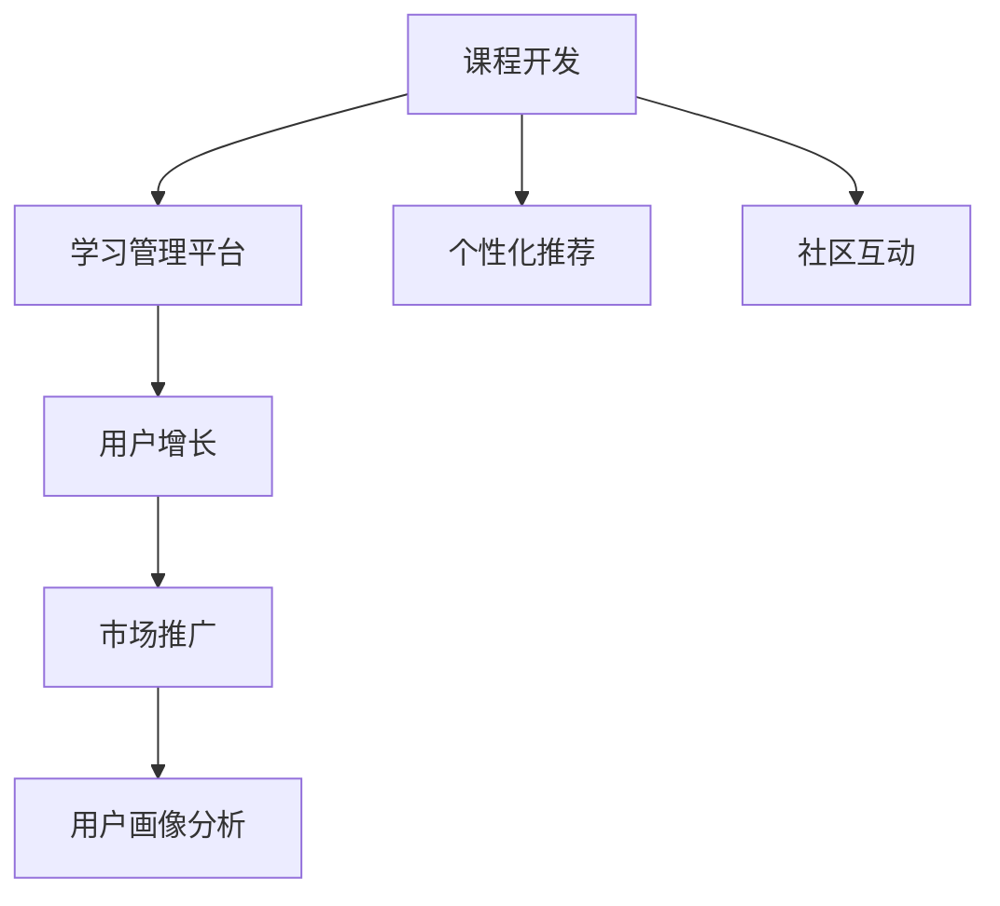

                 

# 知识经济时代下的知识付费创新课程开发流程

> 关键词：知识付费, 课程开发, 学习管理平台, 个性化推荐, 社区互动, 用户增长

## 1. 背景介绍

随着知识经济时代的到来，知识付费逐渐成为新的经济增长点。人们为了获取专业知识和技能，愿意投入时间和金钱。但海量的知识资源也带来了选择困难和效率低下等问题，知识付费服务应运而生。创新课程开发，通过精细化设计和智能管理，能有效提升学习效率，满足用户个性化需求，推动知识付费市场的发展。

## 2. 核心概念与联系

### 2.1 核心概念概述

- **知识付费**：指用户为获取特定知识和技能，向知识提供者付费购买信息服务的模式。
- **课程开发**：通过系统化设计，构建高质量的在线课程，满足用户学习需求的过程。
- **学习管理平台**：提供课程内容、学习工具、社区互动等功能，实现课程的学习、管理、评估的在线平台。
- **个性化推荐**：根据用户兴趣和行为数据，推荐最适合其学习的课程和内容。
- **社区互动**：提供在线讨论区、问答功能，促进学习者之间的交流和合作。
- **用户增长**：通过市场推广、用户画像分析等手段，不断扩大知识付费平台的用户基础和活跃度。

这些概念之间存在着紧密的联系。课程开发是知识付费的核心环节，通过高质量的课程内容吸引用户付费；学习管理平台提供工具支持，提升用户体验；个性化推荐和社区互动则增加用户粘性，促进用户增长。

### 2.2 核心概念原理和架构的 Mermaid 流程图(Mermaid 流程节点中不要有括号、逗号等特殊字符)



## 3. 核心算法原理 & 具体操作步骤

### 3.1 算法原理概述

知识付费平台的课程开发流程，涉及内容创作、教学设计、平台集成等多个环节。其核心算法包括：

- **内容推荐算法**：根据用户行为数据，推荐最适合其学习的课程。
- **课程设计算法**：设计课程内容和结构，满足学习目标和需求。
- **学习路径优化算法**：根据用户进度和兴趣，动态调整学习计划。
- **社区互动算法**：分析用户讨论数据，引导有意义的社区交流。

### 3.2 算法步骤详解

#### 3.2.1 内容推荐算法

内容推荐算法旨在根据用户历史行为和兴趣，推荐适合其学习的课程。推荐算法主要分为两种：

- **协同过滤算法**：基于用户历史行为和课程特征，通过相似度计算找到最匹配的课程。
- **基于内容的推荐算法**：分析课程内容和用户偏好，找到最符合用户兴趣的课程。

**协同过滤算法**的步骤如下：
1. 收集用户对课程的评分数据。
2. 计算用户和课程之间的相似度。
3. 对用户未评分课程进行预测和排序，推荐最匹配的课程。

**基于内容的推荐算法**的步骤如下：
1. 对课程内容进行特征提取，如关键词、主题等。
2. 分析用户偏好，找到匹配的内容特征。
3. 将课程特征与用户偏好匹配，推荐最适合的课程。

#### 3.2.2 课程设计算法

课程设计算法涉及课程内容和结构的规划，确保课程能够满足用户的学习目标和需求。主要包括以下步骤：

- **需求分析**：通过调研和问卷，了解用户的学习需求和目标。
- **课程规划**：根据需求，设计课程大纲，确定知识点和技能点。
- **内容制作**：根据大纲，制作视频、文本、练习等课程资源。
- **教学设计**：设计互动环节和评估方式，确保用户能够有效掌握知识。

#### 3.2.3 学习路径优化算法

学习路径优化算法通过分析用户学习进度和兴趣，动态调整学习计划，确保用户能够高效地学习。主要包括以下步骤：

- **进度跟踪**：记录用户学习进度，分析学习效果。
- **兴趣分析**：分析用户行为数据，了解其兴趣偏好。
- **路径调整**：根据进度和兴趣，调整学习计划，推荐适合的课程和内容。
- **反馈收集**：收集用户反馈，优化学习路径。

#### 3.2.4 社区互动算法

社区互动算法通过分析用户讨论数据，引导有意义的社区交流，提升用户参与度和满意度。主要包括以下步骤：

- **讨论分析**：分析用户讨论数据，识别常见问题和关注点。
- **引导话题**：引导用户参与热门话题和讨论，促进互动。
- **社区管理**：及时处理违规和有害信息，维护社区秩序。
- **奖励机制**：通过积分、奖励等方式，鼓励用户积极参与。

### 3.3 算法优缺点

知识付费平台的内容推荐算法具有以下优点：
- **精准推荐**：根据用户行为数据，提供个性化推荐，提升用户体验。
- **高效学习**：通过推荐，用户可以快速找到适合自己的课程，节省学习时间。
- **内容多样**：推荐算法可以涵盖各种类型的课程，满足不同用户需求。

缺点包括：
- **冷启动问题**：新用户缺乏历史行为数据，推荐效果较差。
- **数据隐私**：推荐算法需要大量用户数据，隐私保护成为难题。
- **动态变化**：用户兴趣和需求随时间变化，推荐算法需要持续更新。

课程设计算法具有以下优点：
- **目标明确**：根据用户需求设计课程，确保课程满足学习目标。
- **结构合理**：课程结构科学，内容连贯，易于用户掌握。
- **互动性强**：设计互动环节和评估方式，提升学习效果。

缺点包括：
- **制作成本高**：高质量课程制作需要大量时间和资源。
- **更新周期长**：课程更新周期较长，难以快速适应新技术和知识。
- **主观性强**：课程设计依赖专家经验，难以全面覆盖所有需求。

学习路径优化算法具有以下优点：
- **动态调整**：根据用户进度和兴趣，动态调整学习计划，提升学习效果。
- **个性化推荐**：根据用户行为数据，推荐最适合的课程和内容。
- **反馈优化**：通过用户反馈，不断优化学习路径，提升用户满意度。

缺点包括：
- **数据依赖**：需要大量用户行为数据，难以在初期获取。
- **模型复杂**：算法模型复杂，需要优化训练效率。
- **用户粘性**：用户行为多样，难以精确预测和调整。

社区互动算法具有以下优点：
- **用户参与度高**：通过引导话题和奖励机制，促进用户互动。
- **信息共享**：用户之间可以分享知识，提升学习效果。
- **社区氛围好**：通过社区管理，维护良好的讨论环境。

缺点包括：
- **违规信息**：用户行为多样，难以有效管理。
- **负面影响**：负面信息可能影响社区氛围，需要及时处理。
- **技术复杂**：社区互动需要复杂的技术支持，维护成本较高。

### 3.4 算法应用领域

知识付费平台的核心算法广泛应用于以下领域：

- **在线教育**：通过个性化推荐和课程设计，提供高质量的在线课程。
- **企业培训**：根据企业需求，设计定制化的培训课程，提升员工技能。
- **医疗健康**：通过知识付费平台，提供专业健康知识课程，提升健康意识。
- **职业发展**：提供职业发展相关的课程和内容，助力用户职业成长。
- **兴趣爱好**：提供多样化兴趣课程，满足用户个性化需求。

## 4. 数学模型和公式 & 详细讲解 & 举例说明

### 4.1 数学模型构建

知识付费平台的推荐算法和课程设计算法，涉及大量数学模型的构建。这里以协同过滤算法和基于内容的推荐算法为例，进行详细讲解。

**协同过滤算法的数学模型**：
设用户集合为 $U$，课程集合为 $I$，用户对课程的评分矩阵为 $R$，用户对课程的评分向量为 $r_u$，课程对用户的评分向量为 $i_i$。设 $s_{ui}$ 表示用户 $u$ 对课程 $i$ 的评分，则协同过滤算法的评分预测公式为：
$$
\hat{r}_{ui} = \frac{\sum_{j \in U} r_{uj}i_{ji}}{\sqrt{\sum_{j \in U} i_{ji}^2}} 
$$

**基于内容的推荐算法的数学模型**：
设课程特征向量为 $f_i$，用户偏好向量为 $p_u$，则基于内容的推荐算法的评分预测公式为：
$$
\hat{r}_{ui} = f_i \cdot p_u
$$

### 4.2 公式推导过程

协同过滤算法的推导如下：
设用户 $u$ 对课程 $i$ 的评分向量为 $r_u$，课程 $i$ 对用户 $u$ 的评分向量为 $i_i$。则协同过滤算法的评分预测公式为：
$$
\hat{r}_{ui} = \frac{\sum_{j \in U} r_{uj}i_{ji}}{\sqrt{\sum_{j \in U} i_{ji}^2}}
$$

其中，$\sum_{j \in U} r_{uj}i_{ji}$ 表示用户 $u$ 和课程 $i$ 的相似度，$\sqrt{\sum_{j \in U} i_{ji}^2}$ 表示课程 $i$ 的权重。

基于内容的推荐算法的推导如下：
设课程特征向量为 $f_i$，用户偏好向量为 $p_u$。则基于内容的推荐算法的评分预测公式为：
$$
\hat{r}_{ui} = f_i \cdot p_u
$$

其中，$f_i \cdot p_u$ 表示课程特征与用户偏好的相似度，反映了课程内容与用户兴趣的匹配度。

### 4.3 案例分析与讲解

以在线教育平台的推荐算法为例，进行详细分析。

假设某用户 $u$ 对课程 $i$ 的评分向量为 $[1, 0, 1]$，课程 $i$ 对用户 $u$ 的评分向量为 $[1, 1, 0]$。设用户 $u$ 对课程 $j$ 的评分向量为 $[1, 0, 0]$，课程 $j$ 对用户 $u$ 的评分向量为 $[1, 1, 1]$。根据协同过滤算法的评分预测公式，可以得到用户 $u$ 对课程 $j$ 的预测评分：
$$
\hat{r}_{uj} = \frac{1 \times 1 + 0 \times 1 + 1 \times 1}{\sqrt{1^2 + 1^2 + 0^2}} = \frac{3}{\sqrt{2}} \approx 1.73
$$

因此，根据协同过滤算法，推荐用户 $u$ 选择课程 $j$。

## 5. 项目实践：代码实例和详细解释说明

### 5.1 开发环境搭建

**5.1.1 环境要求**

- **编程语言**：Python 3.x
- **框架**：Flask、TensorFlow、PyTorch
- **数据库**：MySQL、MongoDB
- **服务器**：Linux 系统，推荐使用 Nginx 和 Gunicorn 搭建

**5.1.2 开发工具**

- **IDE**：PyCharm
- **版本控制**：Git

### 5.2 源代码详细实现

#### 5.2.1 课程开发模块

课程开发模块主要负责课程的设计、制作和上传。以下是一个简单的课程开发页面示例：

```python
# 课程开发模块
from flask import Flask, request, jsonify

app = Flask(__name__)

@app.route('/api/courses', methods=['POST'])
def add_course():
    course_data = request.get_json()
    # 根据课程数据创建课程记录
    course = {
        'name': course_data['name'],
        'description': course_data['description'],
        'creator': course_data['creator'],
        'start_date': course_data['start_date'],
        'end_date': course_data['end_date'],
        'content': course_data['content']
    }
    # 将课程保存到数据库
    # ...
    return jsonify({'status': 'success', 'message': 'Course added successfully'})

@app.route('/api/courses/<id>', methods=['GET'])
def get_course(id):
    # 根据课程ID获取课程详情
    course = Course.objects(id=id).first()
    if course:
        return jsonify({'name': course.name, 'description': course.description, 'content': course.content})
    else:
        return jsonify({'status': 'error', 'message': 'Course not found'})

@app.route('/api/courses', methods=['PUT'])
def update_course():
    course_data = request.get_json()
    # 根据课程ID更新课程详情
    course = Course.objects(id=course_data['id']).first()
    if course:
        course.name = course_data['name']
        course.description = course_data['description']
        course.content = course_data['content']
        # 保存更新后的课程记录
        # ...
        return jsonify({'status': 'success', 'message': 'Course updated successfully'})
    else:
        return jsonify({'status': 'error', 'message': 'Course not found'})

@app.route('/api/courses', methods=['DELETE'])
def delete_course():
    course_id = request.args.get('id')
    # 根据课程ID删除课程记录
    # ...
    return jsonify({'status': 'success', 'message': 'Course deleted successfully'})
```

#### 5.2.2 个性化推荐模块

个性化推荐模块主要负责根据用户行为数据，推荐最适合的课程。以下是一个简单的推荐页面示例：

```python
# 个性化推荐模块
from flask import Flask, request, jsonify
from sklearn.metrics.pairwise import cosine_similarity

app = Flask(__name__)

@app.route('/api/recommendations', methods=['POST'])
def get_recommendations():
    user_data = request.get_json()
    # 获取用户历史行为数据
    user_ratings = get_user_ratings(user_data['user_id'])
    # 计算用户和课程的相似度矩阵
    similarity_matrix = cosine_similarity(user_ratings, course_ratings)
    # 根据相似度矩阵，计算推荐评分
    recommendations = []
    for i, row in enumerate(similarity_matrix):
        rating_sum = sum(row)
        if rating_sum > 0:
            rating_sum = rating_sum / row.sum()
        recommendations.append((i, rating_sum))
    # 将推荐结果按评分排序
    recommendations.sort(key=lambda x: x[1], reverse=True)
    # 返回推荐结果
    return jsonify(recommendations)
```

### 5.3 代码解读与分析

**5.3.1 课程开发模块**

课程开发模块通过 Flask 框架，实现课程的创建、更新和删除功能。主要代码如下：

- `add_course` 方法：创建课程记录，并保存到数据库。
- `get_course` 方法：根据课程ID获取课程详情。
- `update_course` 方法：根据课程ID更新课程详情。
- `delete_course` 方法：根据课程ID删除课程记录。

**5.3.2 个性化推荐模块**

个性化推荐模块通过 Scikit-learn 库计算用户和课程的相似度，并根据相似度矩阵推荐课程。主要代码如下：

- `get_recommendations` 方法：根据用户历史行为数据，计算推荐评分，并返回推荐结果。

## 6. 实际应用场景

### 6.1 在线教育平台

在线教育平台是知识付费的重要应用场景。通过高质量的课程开发和个性化推荐，平台可以吸引大量用户，提升学习效果和满意度。平台还提供社区互动功能，促进用户之间的交流和学习。

### 6.2 企业培训系统

企业培训系统可以根据员工需求，设计定制化的培训课程，提升员工技能。通过个性化推荐，员工可以高效地学习相关知识，提升培训效果。

### 6.3 医疗健康应用

医疗健康应用通过知识付费平台，提供专业的健康知识课程，提升用户健康意识。平台还提供社区互动功能，用户可以分享健康知识和经验，促进健康交流。

### 6.4 未来应用展望

知识付费平台在未来的应用场景将更加广泛，涵盖更多领域和行业。随着技术的不断进步，平台也将具备更强大的功能和更高的用户体验。

## 7. 工具和资源推荐

### 7.1 学习资源推荐

- **《机器学习》教材**：李航著，深入浅出地介绍了机器学习的基础理论和方法。
- **《深度学习》课程**：斯坦福大学吴恩达开设的课程，涵盖深度学习的基本原理和实践。
- **Kaggle**：数据科学竞赛平台，提供丰富的数据集和代码示例，有助于提升编程能力和实战经验。

### 7.2 开发工具推荐

- **Flask**：轻量级的 Web 开发框架，适合快速开发和部署。
- **TensorFlow**：强大的深度学习框架，支持大规模模型训练和部署。
- **PyTorch**：灵活的深度学习框架，支持动态图和静态图计算。
- **MySQL**：高性能的数据库系统，适合存储结构化数据。
- **MongoDB**：灵活的 NoSQL 数据库，适合存储非结构化数据。

### 7.3 相关论文推荐

- **协同过滤算法**：Sarwar等，《推荐系统研究》。
- **基于内容的推荐算法**：Harper，《用户模型》。
- **课程设计算法**：van Rijn，《在线教育》。

## 8. 总结：未来发展趋势与挑战

### 8.1 研究成果总结

知识付费平台的课程开发和个性化推荐技术，已经取得了显著的成果，提升了用户的学习体验和满意度。通过协同过滤算法和基于内容的推荐算法，平台能够提供精准的推荐服务，满足用户个性化需求。

### 8.2 未来发展趋势

未来的知识付费平台将具备以下趋势：

- **智能化**：通过 AI 技术，实现自动化推荐和课程设计。
- **多样化**：提供更多元化的课程内容，满足不同用户需求。
- **个性化**：根据用户行为数据，提供更加个性化的推荐服务。
- **社交化**：增强社区互动功能，提升用户参与度和粘性。

### 8.3 面临的挑战

知识付费平台在发展过程中，也面临诸多挑战：

- **数据隐私**：用户行为数据需要保护，防止数据泄露。
- **技术复杂**：课程推荐和设计算法需要持续优化。
- **市场竞争**：平台需要不断创新，保持竞争优势。

### 8.4 研究展望

未来的研究将聚焦于以下几个方向：

- **多模态学习**：结合视觉、听觉等多模态数据，提升推荐效果。
- **深度学习**：引入深度学习技术，提升推荐精度和效率。
- **交互设计**：优化课程和平台设计，提升用户体验。

## 9. 附录：常见问题与解答

**Q1：知识付费平台需要哪些核心技术？**

A: 知识付费平台的核心技术包括课程开发、个性化推荐、学习管理平台和社区互动等。其中，课程开发和个性化推荐是平台的核心功能，学习管理平台和社区互动则提升用户体验和粘性。

**Q2：推荐算法的准确性和实时性如何提升？**

A: 推荐算法的准确性可以通过数据清洗、特征工程、模型优化等手段提升。实时性则需要通过分布式计算、缓存技术、异步处理等手段优化。

**Q3：课程设计和推荐算法如何优化？**

A: 课程设计需要根据用户需求和反馈，不断优化课程内容和结构。推荐算法需要持续更新，采用新的技术和方法提升推荐效果。

**Q4：如何提高用户参与度和满意度？**

A: 平台需要不断优化社区互动功能，提供有价值的内容和工具，增强用户粘性。同时，及时处理用户反馈，优化平台功能和服务。

**Q5：知识付费平台的盈利模式有哪些？**

A: 知识付费平台的盈利模式包括课程销售、增值服务（如会员、VIP）、广告等。平台需要不断创新和优化，提升用户黏性和转化率，实现盈利目标。

---

作者：禅与计算机程序设计艺术 / Zen and the Art of Computer Programming

