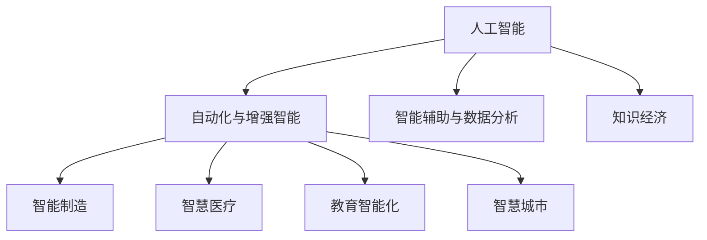

                 

# 知识经济时代：人工智能的贡献

> 关键词：人工智能,知识经济,自动化,增强智能,智能制造,智慧医疗,教育智能化,智慧城市

## 1. 背景介绍

### 1.1 问题由来
当前，世界正处于知识经济时代，知识的获取、处理和应用成为经济增长的主要驱动力。人工智能(AI)技术的崛起，为知识经济的持续发展提供了强大引擎，助推了各行各业的智能化转型升级。人工智能在知识获取的广度与深度、知识处理的效率与精度、知识应用的灵活性与可扩展性等方面，均带来了革命性的变革。

然而，人工智能的发展仍面临诸多挑战，如数据隐私、算法偏见、伦理道德、技术壁垒等，这些问题若不能得到妥善解决，将制约人工智能的进一步普及和应用。为应对这些挑战，需要从政策、技术、伦理等多个层面进行系统性推进。

### 1.2 问题核心关键点
人工智能的核心任务在于通过算法和模型，对海量数据进行高效处理与分析，提取有价值的知识，并应用于各行各业。在此过程中，AI技术在以下几个方面取得了显著进展：

- **自动化与增强智能**：通过自动化工具和增强智能，大幅度提升了生产效率和工作质量，减少了人为干预和错误。
- **智能制造与智慧医疗**：基于AI的预测性维护、智能诊断等技术，为制造和医疗行业带来了颠覆性的变革，提升用户体验和行业竞争力。
- **教育智能化与智慧城市**：通过AI技术，教育体系和城市管理得以更加智能高效地运作，优化资源配置，提升公共服务水平。
- **智能辅助与数据分析**：AI在数据挖掘、模式识别、自然语言处理等领域的应用，提升了数据的价值密度和应用范围，为各类决策提供科学依据。

## 2. 核心概念与联系

### 2.1 核心概念概述

为更好地理解人工智能在知识经济时代的贡献，本节将介绍几个关键概念：

- **人工智能(AI)**：指通过计算机程序和算法，使机器能够执行通常需要人类智能才能完成的任务。主要涉及机器学习、自然语言处理、计算机视觉、机器人学等领域。

- **知识经济**：指以知识为基础，以信息技术为支撑的经济形态。知识经济强调知识与信息的创造、传播、应用，以及知识与技术融合的重要性。

- **自动化与增强智能**：指通过AI技术实现的任务自动化和智能化，以减少人工干预，提升工作效率和准确性。增强智能则在此基础上，进一步赋予机器学习、推理、规划等高级智能能力。

- **智能制造**：指在制造业中应用AI技术，实现从设计、生产到物流的全过程智能化管理。智能制造能够提高生产效率，降低成本，提升产品质量。

- **智慧医疗**：指在医疗领域中应用AI技术，通过图像识别、语音识别、自然语言处理等技术，辅助医生进行疾病诊断、治疗方案制定等。智慧医疗有助于提升医疗服务质量和效率。

- **教育智能化**：指在教育领域中应用AI技术，通过智能推荐、智能评估、智能辅导等手段，提升教学质量和个性化学习体验。教育智能化有助于因材施教，促进教育公平。

- **智慧城市**：指在城市管理中应用AI技术，通过智能交通、智能安防、智能环境监测等手段，提升城市治理水平和生活质量。智慧城市有助于构建更加安全、高效、绿色的城市环境。

- **智能辅助与数据分析**：指在商业、金融、科研等领域中，通过AI技术进行智能决策支持、智能数据分析等，提升数据的价值密度和应用范围。智能辅助有助于企业决策、风险控制和市场预测。

这些核心概念之间的逻辑关系可以通过以下Mermaid流程图来展示：



这个流程图展示了大语言模型的核心概念及其之间的关系：

1. 人工智能通过自动化和增强智能提升工作效率和质量。
2. 智能制造、智慧医疗、教育智能化、智慧城市等应用，进一步拓展了人工智能的应用场景。
3. 智能辅助与数据分析，利用AI技术挖掘数据价值，辅助各类决策。
4. 知识经济是人工智能发展的经济基础，为AI技术的广泛应用提供了土壤。

这些概念共同构成了人工智能在知识经济时代的应用框架，使其能够在多个领域发挥重要作用。

## 3. 核心算法原理 & 具体操作步骤
### 3.1 算法原理概述

人工智能的核心算法原理包括：

- **机器学习**：通过算法和模型，从数据中学习规律和模式，实现数据驱动的决策。机器学习分为监督学习、无监督学习和强化学习等。

- **深度学习**：基于多层神经网络结构，通过反向传播算法，学习数据的层次化表示。深度学习在图像识别、语音识别、自然语言处理等领域取得显著效果。

- **自然语言处理(NLP)**：通过算法和模型，使计算机能够理解、处理和生成人类语言。NLP技术在机器翻译、情感分析、文本分类等任务上应用广泛。

- **计算机视觉(CV)**：通过算法和模型，使计算机能够识别、理解和处理图像和视频数据。CV技术在人脸识别、图像分类、目标检测等任务上表现出色。

- **机器人学(Robotics)**：通过算法和模型，使机器人能够感知环境、执行任务、规划路径等。机器人学在工业自动化、家庭服务等领域得到广泛应用。

### 3.2 算法步骤详解

人工智能的开发和应用一般包括以下几个关键步骤：

**Step 1: 数据获取与预处理**
- 收集数据，进行数据清洗、标注和格式化，确保数据质量。

**Step 2: 模型选择与设计**
- 根据任务特点，选择合适的算法和模型结构。例如，对于分类任务，可以选择SVM、决策树、随机森林等；对于回归任务，可以选择线性回归、支持向量回归等。

**Step 3: 模型训练与评估**
- 使用训练数据，对模型进行训练，并通过验证数据进行性能评估。常用的评估指标包括准确率、精确率、召回率、F1-score等。

**Step 4: 模型优化与调参**
- 根据评估结果，调整模型参数和结构，优化模型性能。常用的优化方法包括梯度下降、遗传算法、贝叶斯优化等。

**Step 5: 模型部署与应用**
- 将训练好的模型部署到生产环境中，进行实际应用。例如，在智能制造中，可以用于生产调度、设备维护等；在智慧医疗中，可以用于疾病诊断、治疗方案制定等。

**Step 6: 模型监控与更新**
- 对模型性能进行监控，根据实际应用效果进行模型更新和维护。例如，根据新数据和反馈，重新训练模型，更新参数，提升模型精度。

### 3.3 算法优缺点

人工智能的开发和应用存在以下优点：

- **效率高**：通过自动化和智能算法，大幅提升了工作效率和质量，减少了人为干预和错误。

- **精度高**：AI算法在数据处理和模型训练过程中，能够从海量数据中提取有价值的知识，实现高精度的分析和决策。

- **灵活性强**：AI技术可以灵活应用于各行各业，提升行业竞争力。

- **数据驱动**：AI技术能够高效地从数据中学习规律和模式，提升数据的价值密度和应用范围。

- **泛化能力强**：通过不断优化和更新，AI模型能够适应不同的数据分布和任务需求，提升模型的泛化能力。

同时，AI的开发和应用也存在以下缺点：

- **数据依赖**：AI技术依赖大量高质量数据，数据获取和标注成本较高，数据隐私和安全问题也较为突出。

- **模型复杂**：AI模型往往较为复杂，训练和调参过程较为繁琐，对技术门槛要求较高。

- **资源消耗**：AI模型的训练和推理过程需要大量计算资源，对硬件要求较高，成本较高。

- **伦理道德**：AI技术可能存在偏见和歧视，算法透明度和可解释性不足，带来伦理道德问题。

- **安全性**：AI技术可能被恶意利用，带来安全风险。

- **技术壁垒**：AI技术涉及多个领域，技术复杂，对跨学科团队和专业人才需求较高。

尽管存在这些局限性，但AI技术的优越性能和广泛应用前景，使其成为知识经济时代的重要引擎。未来需要不断优化和完善，才能更好地服务于各行各业。

### 3.4 算法应用领域

人工智能在各个领域的应用已经相当广泛，以下是几个典型应用：

- **自动化与增强智能**：在制造业中，智能机器人可以执行重复性高的任务，如焊接、装配等。在物流行业，智能仓储和配送系统能够提高效率，降低成本。在客服领域，智能客服机器人可以处理大量客户咨询，提升服务质量。

- **智能制造**：智能制造利用AI技术进行预测性维护、质量控制、生产调度等，提升了生产效率和产品质量。例如，使用AI技术进行设备故障预测和维修，可以避免生产中断，提高设备利用率。

- **智慧医疗**：AI技术在医学影像分析、疾病诊断、治疗方案制定等方面具有显著优势。例如，AI算法可以辅助医生进行疾病诊断，提升诊断精度；智能医疗机器人可以进行手术操作，提高手术成功率。

- **教育智能化**：AI技术在智能推荐、智能评估、智能辅导等方面具有重要应用。例如，智能推荐系统可以根据学生的学习情况，推荐合适的学习内容和资源；智能评估系统可以自动批改作业，提供个性化反馈；智能辅导系统可以实时解答学生问题，提升学习效果。

- **智慧城市**：AI技术在智慧交通、智能安防、智能环境监测等方面具有广泛应用。例如，智能交通系统可以通过数据分析，优化交通流量，缓解交通拥堵；智能安防系统可以实时监控公共场所，预防犯罪；智能环境监测系统可以实时监测环境质量，及时预警。

- **智能辅助与数据分析**：AI技术在商业、金融、科研等领域具有重要应用。例如，商业领域中，智能推荐系统可以根据用户行为，推荐个性化产品和服务；金融领域中，智能风险控制系统可以实时监控市场动态，预测风险；科研领域中，AI技术可以辅助数据分析和模型构建，提升研究效率。

## 4. 数学模型和公式 & 详细讲解
### 4.1 数学模型构建

以分类任务为例，我们假设训练数据集为 $\{(x_i, y_i)\}_{i=1}^N$，其中 $x_i$ 为输入特征，$y_i$ 为分类标签。分类任务的目标是找到一个分类器 $f(x)$，使得 $f(x_i) = y_i$ 对所有样本都成立。

常用的分类算法包括逻辑回归、决策树、支持向量机、神经网络等。以下以逻辑回归为例，介绍分类任务的数学模型构建。

逻辑回归的目标是最小化损失函数，通常采用交叉熵损失函数：

$$
\mathcal{L}(w,b) = -\frac{1}{N}\sum_{i=1}^N y_i \log f(x_i) + (1-y_i) \log (1-f(x_i))
$$

其中 $f(x_i) = \frac{1}{1+\exp(-\alpha w^T x_i - b)}$，$\alpha$ 为模型参数。$w$ 和 $b$ 分别为模型的权重和偏置项。

### 4.2 公式推导过程

逻辑回归的梯度下降更新公式为：

$$
w \leftarrow w - \eta \frac{\partial \mathcal{L}(w,b)}{\partial w}
$$

其中 $\eta$ 为学习率，通常设置为 $0.01$ 或 $0.1$。梯度更新公式可以进一步展开为：

$$
w \leftarrow w - \eta \frac{1}{N}\sum_{i=1}^N [y_i f(x_i) - (1-y_i)(1-f(x_i))] x_i
$$

对每个训练样本 $(x_i, y_i)$，更新过程为：

$$
f(x_i) \leftarrow \frac{1}{1+\exp(-\alpha w^T x_i - b)}
$$

$$
w \leftarrow w - \eta \frac{y_i - f(x_i)}{1-f(x_i)} x_i
$$

$$
b \leftarrow b - \eta \frac{y_i - f(x_i)}{1-f(x_i)}
$$

以上推导展示了逻辑回归的基本数学原理和算法步骤。其他分类算法（如决策树、支持向量机等）也遵循类似的数学框架，具体实现略有不同。

### 4.3 案例分析与讲解

以智慧医疗为例，AI技术在医学影像分析中的应用非常广泛。例如，使用深度学习模型进行肺结节检测，可以自动分析CT或MRI图像，识别出肺结节位置和大小。具体的算法流程如下：

1. 数据获取与预处理：收集大量带标签的医学影像数据，进行数据清洗和标注。

2. 模型选择与设计：选择卷积神经网络(CNN)作为模型架构，设计适当的卷积层、池化层和全连接层。

3. 模型训练与评估：使用训练数据对模型进行训练，通过验证数据进行性能评估，调整模型参数。

4. 模型优化与调参：通过交叉验证等方法，调整模型超参数，优化模型性能。

5. 模型部署与应用：将训练好的模型部署到临床环境中，进行实际应用。例如，在CT扫描中，自动分析患者影像，辅助医生进行疾病诊断。

6. 模型监控与更新：定期收集新数据，重新训练模型，提升模型精度和鲁棒性。

## 5. 项目实践：代码实例和详细解释说明
### 5.1 开发环境搭建

在进行AI项目实践前，我们需要准备好开发环境。以下是使用Python进行TensorFlow开发的典型环境配置流程：

1. 安装Anaconda：从官网下载并安装Anaconda，用于创建独立的Python环境。

2. 创建并激活虚拟环境：
```bash
conda create -n tf-env python=3.8 
conda activate tf-env
```

3. 安装TensorFlow：根据CUDA版本，从官网获取对应的安装命令。例如：
```bash
pip install tensorflow==2.4
```

4. 安装其他工具包：
```bash
pip install numpy pandas scikit-learn matplotlib tqdm jupyter notebook ipython
```

完成上述步骤后，即可在`tf-env`环境中开始AI项目开发。

### 5.2 源代码详细实现

下面我们以智慧医疗中的医学影像分类任务为例，给出使用TensorFlow对卷积神经网络模型进行训练和预测的代码实现。

首先，定义数据集和预处理函数：

```python
import numpy as np
import pandas as pd
from tensorflow.keras.preprocessing.image import ImageDataGenerator
from tensorflow.keras.models import Sequential
from tensorflow.keras.layers import Conv2D, MaxPooling2D, Flatten, Dense, Dropout

# 数据集路径
train_data_path = 'path/to/train_data'
train_labels_path = 'path/to/train_labels'
test_data_path = 'path/to/test_data'
test_labels_path = 'path/to/test_labels'

# 数据集预处理
def preprocess_data(path):
    images = []
    labels = []
    for img_path in glob.glob(os.path.join(path, '*.jpg')):
        img = cv2.imread(img_path)
        img = cv2.resize(img, (224, 224))
        img = img / 255.0
        images.append(img)
        label = pd.read_csv(os.path.join(path, 'labels.txt'), header=None)[0]
        labels.append(label)
    return np.array(images), np.array(labels)

train_images, train_labels = preprocess_data(train_data_path)
test_images, test_labels = preprocess_data(test_data_path)
```

然后，定义模型和训练函数：

```python
# 定义模型
model = Sequential([
    Conv2D(32, (3, 3), activation='relu', input_shape=(224, 224, 3)),
    MaxPooling2D((2, 2)),
    Dropout(0.25),
    Conv2D(64, (3, 3), activation='relu'),
    MaxPooling2D((2, 2)),
    Dropout(0.25),
    Flatten(),
    Dense(128, activation='relu'),
    Dropout(0.5),
    Dense(num_classes, activation='softmax')
])

# 编译模型
model.compile(optimizer='adam', loss='categorical_crossentropy', metrics=['accuracy'])

# 训练模型
model.fit(train_images, train_labels, batch_size=16, epochs=10, validation_data=(test_images, test_labels))
```

最后，评估模型并在测试集上预测：

```python
# 评估模型
loss, acc = model.evaluate(test_images, test_labels)
print(f'Test loss: {loss:.4f}')
print(f'Test accuracy: {acc:.4f}')

# 预测测试集
predictions = model.predict(test_images)
```

以上就是使用TensorFlow对卷积神经网络模型进行医学影像分类的完整代码实现。可以看到，TensorFlow提供了便捷的模型定义、编译和训练接口，使得AI项目开发变得高效便捷。

### 5.3 代码解读与分析

让我们再详细解读一下关键代码的实现细节：

**preprocess_data函数**：
- 定义数据集路径。
- 遍历数据集中的所有图像文件，加载并预处理图像，提取标签。

**模型定义**：
- 使用Sequential模型定义卷积神经网络，包含卷积层、池化层、全连接层等。
- 使用Dropout层进行正则化，避免过拟合。
- 输出层使用softmax激活函数，实现多分类输出。

**模型编译与训练**：
- 使用adam优化器，交叉熵损失函数，准确率作为评估指标。
- 使用fit方法进行模型训练，batch_size为16，epochs为10，验证集为测试集。

**模型评估与预测**：
- 使用evaluate方法在测试集上评估模型，输出损失和准确率。
- 使用predict方法在测试集上预测标签，存储在predictions变量中。

可以看到，TensorFlow提供了强大的深度学习库，可以轻松实现复杂的神经网络模型，进行高效训练和预测。结合Python的便捷性和强大的第三方库，AI项目开发变得轻而易举。

当然，实际应用中还需要考虑更多的因素，如模型优化、超参数调优、模型部署等，才能得到稳定的应用效果。

## 6. 实际应用场景
### 6.1 智能制造

在智能制造中，AI技术的应用广泛而深入。例如，使用AI技术进行预测性维护，可以提前发现设备故障，减少生产中断，提高设备利用率。具体来说，可以通过监控设备的运行状态和历史数据，训练预测模型，实现设备故障预测和预警。以下是典型的预测性维护应用：

1. 数据收集与清洗：收集设备运行数据、维护记录、故障报告等，进行数据清洗和标注。

2. 模型选择与设计：选择合适的预测模型，如时间序列模型、神经网络模型等。

3. 模型训练与评估：使用训练数据对模型进行训练，通过验证数据进行性能评估，调整模型参数。

4. 模型优化与调参：通过交叉验证等方法，调整模型超参数，优化模型性能。

5. 模型部署与应用：将训练好的模型部署到生产线，实时监控设备运行状态，预测设备故障。

6. 模型监控与更新：定期收集新数据，重新训练模型，提升模型精度和鲁棒性。

### 6.2 智慧医疗

在智慧医疗中，AI技术的应用也非常广泛。例如，使用AI技术进行医学影像分析，可以自动分析CT或MRI图像，识别出病变位置和大小。具体来说，可以通过训练卷积神经网络模型，对医学影像进行特征提取和分类。以下是典型的医学影像分析应用：

1. 数据收集与清洗：收集大量带标签的医学影像数据，进行数据清洗和标注。

2. 模型选择与设计：选择卷积神经网络(CNN)作为模型架构，设计适当的卷积层、池化层和全连接层。

3. 模型训练与评估：使用训练数据对模型进行训练，通过验证数据进行性能评估，调整模型参数。

4. 模型优化与调参：通过交叉验证等方法，调整模型超参数，优化模型性能。

5. 模型部署与应用：将训练好的模型部署到临床环境中，自动分析医学影像，辅助医生进行疾病诊断。

6. 模型监控与更新：定期收集新数据，重新训练模型，提升模型精度和鲁棒性。

### 6.3 教育智能化

在教育智能化中，AI技术的应用非常丰富。例如，使用AI技术进行智能推荐，可以根据学生的学习情况，推荐合适的学习内容和资源。具体来说，可以通过分析学生的学习行为数据和成绩数据，训练推荐模型，实现个性化推荐。以下是典型的智能推荐应用：

1. 数据收集与清洗：收集学生的学习行为数据、成绩数据等，进行数据清洗和标注。

2. 模型选择与设计：选择推荐模型，如协同过滤模型、内容推荐模型等。

3. 模型训练与评估：使用训练数据对模型进行训练，通过验证数据进行性能评估，调整模型参数。

4. 模型优化与调参：通过交叉验证等方法，调整模型超参数，优化模型性能。

5. 模型部署与应用：将训练好的模型部署到学习平台，实时推荐学习资源。

6. 模型监控与更新：定期收集新数据，重新训练模型，提升模型精度和鲁棒性。

### 6.4 未来应用展望

随着AI技术的不断进步，未来在智能制造、智慧医疗、教育智能化等领域，将有更多创新应用涌现。以下是几个未来应用展望：

- **智能制造**：通过AI技术实现自适应生产调度、智能物流、预测性维护等，提升生产效率和产品质量。

- **智慧医疗**：通过AI技术实现个性化治疗、智能诊断、精准医疗等，提升医疗服务质量和效率。

- **教育智能化**：通过AI技术实现智能评估、智能辅导、个性化学习等，提升教育公平和教学质量。

- **智慧城市**：通过AI技术实现智能交通、智能安防、智能环境监测等，提升城市治理水平和生活质量。

- **智能辅助与数据分析**：通过AI技术实现智能决策支持、智能数据分析、智能客服等，提升企业决策和市场响应能力。

未来，AI技术将在各行各业中发挥更大的作用，推动知识经济的持续发展。

## 7. 工具和资源推荐
### 7.1 学习资源推荐

为帮助开发者系统掌握AI技术，这里推荐一些优质的学习资源：

1. Coursera《Deep Learning Specialization》课程：斯坦福大学开设的深度学习系列课程，系统介绍深度学习的基础理论和应用实践。

2. edX《Artificial Intelligence with Python》课程：麻省理工学院开设的AI入门课程，涵盖AI基础、机器学习、深度学习等内容。

3. Udacity《AI Nanodegree》课程：Udacity推出的AI专业课程，包含AI项目实战和工程实践。

4. 《Python机器学习》书籍：通过Python语言介绍机器学习算法和模型，适合初学者入门。

5. 《深度学习》书籍：介绍深度学习的基本原理、模型架构和应用实例，适合深入学习。

6. 《TensorFlow官方文档》：TensorFlow官方文档，包含详细API接口和示例代码，适合开发实践。

通过对这些资源的学习实践，相信你一定能够快速掌握AI技术的精髓，并用于解决实际问题。

### 7.2 开发工具推荐

高效的开发离不开优秀的工具支持。以下是几款用于AI项目开发的常用工具：

1. Jupyter Notebook：交互式笔记本环境，支持Python、R等编程语言，便于代码编写和调试。

2. PyTorch：基于Python的开源深度学习框架，灵活动态的计算图，适合快速迭代研究。大部分深度学习模型都有PyTorch版本的实现。

3. TensorFlow：由Google主导开发的开源深度学习框架，生产部署方便，适合大规模工程应用。同样有丰富的深度学习模型资源。

4. PyCharm：Python IDE，支持多种编程语言，提供智能提示、代码补全等功能，提高开发效率。

5. Visual Studio Code：轻量级代码编辑器，支持多种编程语言，具备丰富的插件生态，适合编写和调试代码。

6. Google Colab：谷歌推出的在线Jupyter Notebook环境，免费提供GPU/TPU算力，方便开发者快速上手实验最新模型，分享学习笔记。

合理利用这些工具，可以显著提升AI项目的开发效率，加快创新迭代的步伐。

### 7.3 相关论文推荐

AI技术的发展源于学界的持续研究。以下是几篇奠基性的相关论文，推荐阅读：

1. Yann LeCun等人的《深度学习》论文：介绍深度学习的基本原理和模型架构，是深度学习的奠基之作。

2. Andrew Ng等人的《机器学习》教材：系统介绍机器学习的基本概念和算法，适合初学者入门。

3. Ian Goodfellow等人的《生成对抗网络》论文：提出生成对抗网络(GAN)，开辟了生成式深度学习的先河。

4. Geoffrey Hinton等人的《深度信念网络》论文：提出深度信念网络(DBN)，是深度学习的重要理论基础。

5. Yoshua Bengio等人的《深度学习中学习表示的挑战》论文：探讨深度学习中的学习表示问题，对深度学习的发展有重要指导意义。

这些论文代表了大语言模型微调技术的发展脉络。通过学习这些前沿成果，可以帮助研究者把握学科前进方向，激发更多的创新灵感。

## 8. 总结：未来发展趋势与挑战
### 8.1 研究成果总结

本文对AI技术在知识经济时代的应用进行了全面系统的介绍。首先阐述了AI技术在自动化与增强智能、智能制造、智慧医疗、教育智能化、智慧城市、智能辅助与数据分析等领域的重要作用，展示了AI技术的广泛应用前景。其次，从原理到实践，详细讲解了AI技术的数学模型和算法步骤，给出了AI项目开发的完整代码实例。同时，本文还探讨了AI技术在未来智能制造、智慧医疗、教育智能化等领域的应用展望，展示了AI技术的巨大潜力。

通过本文的系统梳理，可以看到，AI技术在知识经济时代将发挥越来越重要的作用，推动各行各业的智能化转型升级。

### 8.2 未来发展趋势

展望未来，AI技术的发展趋势如下：

1. **自动化与增强智能**：通过AI技术实现自动化生产和智能辅助，提升生产效率和工作质量，减少人为干预和错误。

2. **智能制造**：通过AI技术实现预测性维护、智能调度、质量控制等，提升生产效率和产品质量，减少生产成本。

3. **智慧医疗**：通过AI技术实现医学影像分析、疾病诊断、治疗方案制定等，提升医疗服务质量和效率，降低医疗成本。

4. **教育智能化**：通过AI技术实现智能推荐、智能评估、智能辅导等，提升教学质量和个性化学习体验，促进教育公平。

5. **智慧城市**：通过AI技术实现智能交通、智能安防、智能环境监测等，提升城市治理水平和生活质量，构建更安全、高效、绿色的城市环境。

6. **智能辅助与数据分析**：通过AI技术进行智能决策支持、智能数据分析、智能客服等，提升企业决策和市场响应能力，优化资源配置。

7. **多模态融合**：将AI技术与计算机视觉、语音识别、自然语言处理等技术相结合，实现多模态信息的融合，提升系统的感知能力和推理能力。

8. **跨领域应用**：将AI技术应用于更多领域，如金融、法律、农业等，推动各行各业的智能化转型升级。

9. **可解释性与透明性**：提升AI模型的可解释性和透明性，增强用户对AI系统的信任和接受度。

10. **伦理道德**：在AI系统的设计、开发和应用中，引入伦理导向的评估指标，过滤和惩罚有偏见、有害的输出倾向，确保系统的安全性、公正性和透明度。

这些趋势凸显了AI技术在知识经济时代的广阔前景。这些方向的探索发展，必将进一步推动AI技术在各个领域的广泛应用。

### 8.3 面临的挑战

尽管AI技术的发展取得了显著进展，但在迈向更加智能化、普适化应用的过程中，仍面临诸多挑战：

1. **数据获取与标注成本**：AI技术依赖大量高质量数据，数据获取和标注成本较高。如何降低数据标注成本，提高数据质量和效率，是一个重要研究方向。

2. **算法透明性与可解释性**：AI算法复杂，模型透明度和可解释性不足，用户难以理解系统的决策过程。如何提升AI模型的可解释性，增强用户信任，是当前亟需解决的问题。

3. **技术壁垒**：AI技术涉及多个领域，技术复杂，对跨学科团队和专业人才需求较高。如何降低技术门槛，提高AI技术的普及性，需要多方共同努力。

4. **伦理道德**：AI技术可能存在偏见和歧视，算法透明度和可解释性不足，带来伦理道德问题。如何确保AI系统的公正性、透明性和安全性，需要加强伦理监管和法律约束。

5. **计算资源消耗**：AI模型的训练和推理过程需要大量计算资源，对硬件要求较高，成本较高。如何优化模型结构和算法，提高资源利用效率，降低计算成本，是未来研究方向。

6. **安全性与隐私保护**：AI技术可能被恶意利用，带来安全风险。如何确保AI系统的安全性，保护用户隐私，是当前亟需解决的问题。

尽管存在这些挑战，但AI技术的优越性能和广泛应用前景，使其成为知识经济时代的重要引擎。未来需要不断优化和完善，才能更好地服务于各行各业。

### 8.4 研究展望

未来AI技术的研究展望如下：

1. **可解释性与透明性**：提升AI模型的可解释性和透明性，增强用户对AI系统的信任和接受度。

2. **跨领域应用**：将AI技术应用于更多领域，如金融、法律、农业等，推动各行各业的智能化转型升级。

3. **多模态融合**：将AI技术与计算机视觉、语音识别、自然语言处理等技术相结合，实现多模态信息的融合，提升系统的感知能力和推理能力。

4. **伦理道德**：在AI系统的设计、开发和应用中，引入伦理导向的评估指标，过滤和惩罚有偏见、有害的输出倾向，确保系统的安全性、公正性和透明度。

5. **计算资源优化**：优化模型结构和算法，提高资源利用效率，降低计算成本，实现更高效、更快速的AI应用。

6. **自动化与增强智能**：通过AI技术实现自动化生产和智能辅助，提升生产效率和工作质量，减少人为干预和错误。

7. **智能制造**：通过AI技术实现预测性维护、智能调度、质量控制等，提升生产效率和产品质量，减少生产成本。

8. **智慧医疗**：通过AI技术实现医学影像分析、疾病诊断、治疗方案制定等，提升医疗服务质量和效率，降低医疗成本。

9. **教育智能化**：通过AI技术实现智能推荐、智能评估、智能辅导等，提升教学质量和个性化学习体验，促进教育公平。

10. **智慧城市**：通过AI技术实现智能交通、智能安防、智能环境监测等，提升城市治理水平和生活质量，构建更安全、高效、绿色的城市环境。

11. **智能辅助与数据分析**：通过AI技术进行智能决策支持、智能数据分析、智能客服等，提升企业决策和市场响应能力，优化资源配置。

未来，随着AI技术的不断进步，其应用范围将更加广泛，对知识经济的发展将产生更加深远的影响。只有不断突破技术瓶颈，优化算法性能，提升系统透明度，才能更好地发挥AI技术在知识经济中的作用。

## 9. 附录：常见问题与解答

**Q1: AI技术在知识经济时代的应用场景有哪些？**

A: AI技术在知识经济时代的应用场景非常广泛，包括但不限于以下领域：

1. 自动化与增强智能：在制造业、物流、客服等领域，实现任务自动化和智能辅助。

2. 智能制造：通过AI技术实现预测性维护、质量控制、生产调度等，提升生产效率和产品质量。

3. 智慧医疗：通过AI技术实现医学影像分析、疾病诊断、治疗方案制定等，提升医疗服务质量和效率。

4. 教育智能化：通过AI技术实现智能推荐、智能评估、智能辅导等，提升教学质量和个性化学习体验。

5. 智慧城市：通过AI技术实现智能交通、智能安防、智能环境监测等，提升城市治理水平和生活质量。

6. 智能辅助与数据分析：通过AI技术进行智能决策支持、智能数据分析、智能客服等，提升企业决策和市场响应能力。

**Q2: AI技术的开发和应用有哪些关键步骤？**

A: AI技术的开发和应用一般包括以下关键步骤：

1. 数据获取与预处理：收集数据，进行数据清洗、标注和格式化，确保数据质量。

2. 模型选择与设计：根据任务特点，选择合适的算法和模型结构。

3. 模型训练与评估：使用训练数据对模型进行训练，通过验证数据进行性能评估，调整模型参数。

4. 模型优化与调参：通过交叉验证等方法，调整模型超参数，优化模型性能。

5. 模型部署与应用：将训练好的模型部署到生产环境中，进行实际应用。

6. 模型监控与更新：定期收集新数据，重新训练模型，提升模型精度和鲁棒性。

**Q3: AI技术在各个领域的应用存在哪些挑战？**

A: AI技术在各个领域的应用存在以下挑战：

1. 数据获取与标注成本：AI技术依赖大量高质量数据，数据获取和标注成本较高，数据隐私和安全问题也较为突出。

2. 算法透明性与可解释性：AI算法复杂，模型透明度和可解释性不足，用户难以理解系统的决策过程。

3. 技术壁垒：AI技术涉及多个领域，技术复杂，对跨学科团队和专业人才需求较高。

4. 伦理道德：AI技术可能存在偏见和歧视，算法透明度和可解释性不足，带来伦理道德问题。

5. 安全性与隐私保护：AI技术可能被恶意利用，带来安全风险。

6. 计算资源消耗：AI模型的训练和推理过程需要大量计算资源，对硬件要求较高，成本较高。

尽管存在这些挑战，但AI技术的优越性能和广泛应用前景，使其成为知识经济时代的重要引擎。未来需要不断优化和完善，才能更好地服务于各行各业。

**Q4: 未来AI技术的发展趋势有哪些？**

A: 未来AI技术的发展趋势如下：

1. 自动化与增强智能：通过AI技术实现自动化生产和智能辅助，提升生产效率和工作质量，减少人为干预和错误。

2. 智能制造：通过AI技术实现预测性维护、智能调度、质量控制等，提升生产效率和产品质量，减少生产成本。

3. 智慧医疗：通过AI技术实现医学影像分析、疾病诊断、治疗方案制定等，提升医疗服务质量和效率，降低医疗成本。

4. 教育智能化：通过AI技术实现智能推荐、智能评估、智能辅导等，提升教学质量和个性化学习体验，促进教育公平。

5. 智慧城市：通过AI技术实现智能交通、智能安防、智能环境监测等，提升城市治理水平和生活质量，构建更安全、高效、绿色的城市环境。

6. 智能辅助与数据分析：通过AI技术进行智能决策支持、智能数据分析、智能客服等，提升企业决策和市场响应能力，优化资源配置。

7. 多模态融合：将AI技术与计算机视觉、语音识别、自然语言处理等技术相结合，实现多模态信息的融合，提升系统的感知能力和推理能力。

8. 跨领域应用：将AI技术应用于更多领域，如金融、法律、农业等，推动各行各业的智能化转型升级。

9. 可解释性与透明性：提升AI模型的可解释性和透明性，增强用户对AI系统的信任和接受度。

10. 伦理道德：在AI系统的设计、开发和应用中，引入伦理导向的评估指标，过滤和惩罚有偏见、有害的输出倾向，确保系统的安全性、公正性和透明度。

11. 计算资源优化：优化模型结构和算法，提高资源利用效率，降低计算成本，实现更高效、更快速的AI应用。

**Q5: 如何降低AI技术的开发和应用成本？**

A: 降低AI技术的开发和应用成本可以从以下几个方面入手：

1. 数据共享与开放：通过数据共享平台，降低数据获取和标注成本，提高数据质量和效率。

2. 开源社区支持：利用开源社区的力量，共享模型和代码，降低开发成本。

3. 自动化工具与工具链：使用自动化工具和工具链，提高开发效率，减少人工干预和错误。

4. 模型压缩与优化：通过模型压缩和优化，减少计算资源消耗，降低应用成本。

5. 云计算与边缘计算：利用云计算和边缘计算，降低硬件成本，提高系统灵活性。

6. 轻量级模型与应用：开发轻量级模型和应用，降低资源消耗，提高部署效率。

这些措施可以显著降低AI技术的开发和应用成本，使其更加普惠和普及。

---

作者：禅与计算机程序设计艺术 / Zen and the Art of Computer Programming

