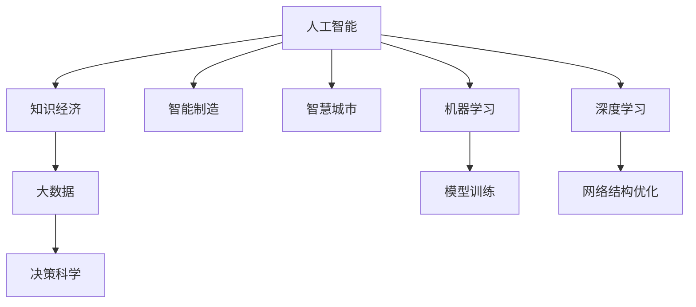

                 

# 知识经济时代：人工智能的贡献

> 关键词：人工智能,知识经济,智能制造,智慧城市,大数据,机器学习

## 1. 背景介绍

### 1.1 问题由来

在知识经济时代，人类社会的生产方式和社会形态正在发生深刻变革。经济增长逐渐从基于体力劳动的资源驱动，转向基于知识技术的智慧驱动。在这样的大背景下，人工智能(AI)作为最具代表性的知识技术之一，正全面渗透到经济社会的各个领域，成为推动经济转型的重要引擎。

人工智能的飞速发展，主要得益于计算能力的爆炸性增长、海量数据的积累和深度学习算法的突破。从最初的专家系统、符号推理，到后来的主流机器学习、深度学习，人工智能技术在模拟人类智能行为、解决复杂问题方面取得了长足进步。如今，AI技术已经应用于智能制造、智慧城市、金融科技、医疗健康等多个关键领域，为知识经济时代的到来贡献力量。

### 1.2 问题核心关键点

人工智能在知识经济时代的贡献，主要体现在以下几个关键点：

1. **提升生产效率**：通过自动化、智能化生产线，大幅提升制造业的生产效率和产品质量。
2. **优化资源配置**：利用大数据分析和智能决策算法，实现更合理的资源配置，优化社会供需关系。
3. **驱动产业升级**：AI技术赋能传统行业，推动产业从劳动密集型向技术密集型转型，实现产业升级。
4. **构建智慧生态**：智慧城市、智能交通、智能医疗等，以AI技术为支撑的智慧生态正在改变人们的生活方式。
5. **促进创新创业**：AI技术的广泛应用，激发了更多创新创业机会，推动新产业、新业态的快速发展。
6. **助力社会治理**：AI技术在公共安全、应急管理、灾害预测等领域的应用，提升了社会治理能力。

### 1.3 问题研究意义

深入研究人工智能在知识经济时代的贡献，具有重要理论和现实意义：

1. **理论探索**：揭示AI技术的演进机制和发展规律，为未来研究奠定基础。
2. **实践指导**：指导企业在实际应用中，合理配置AI资源，提升业务竞争力。
3. **政策制定**：为政府和企业制定AI发展战略提供科学依据，推动AI技术的健康发展。
4. **教育培训**：推动AI教育体系的完善，为社会培养更多AI技术人才。
5. **伦理考量**：探讨AI技术在应用过程中可能带来的伦理问题，如隐私、安全、责任等，为AI发展提供伦理规范。

## 2. 核心概念与联系

### 2.1 核心概念概述

为了更好地理解人工智能在知识经济时代的贡献，本节将介绍几个核心概念及其相互联系：

- **人工智能(Artificial Intelligence, AI)**：通过算法和计算，模拟、延伸和扩展人类智能的技术。包括机器学习、深度学习、自然语言处理、计算机视觉等子领域。
- **知识经济(Knowledge Economy)**：以知识和信息的生产、传播和利用为基础，通过技术创新驱动经济发展的经济形态。
- **智能制造(Smart Manufacturing)**：利用AI技术改造传统制造业，实现智能化、网络化、协同化生产。
- **智慧城市(Smart City)**：利用AI技术提升城市管理效率，改善居民生活质量。
- **大数据(Big Data)**：通过收集、存储和分析海量数据，支持决策科学化。
- **机器学习(Machine Learning)**：通过算法让机器自动学习数据模式，提升问题求解能力。
- **深度学习(Deep Learning)**：利用多层神经网络模拟人脑神经元结构，提升学习能力和泛化能力。

这些概念之间的关系可以通过以下Mermaid流程图来展示：



这个流程图展示了大语言模型的核心概念及其相互关系：

1. 人工智能是知识经济的核心技术。
2. 智能制造和智慧城市是人工智能的典型应用领域。
3. 大数据和机器学习是人工智能的重要基础。
4. 深度学习是机器学习的高级形式，进一步提升了AI的能力。
5. 决策科学和模型训练是大数据和机器学习的具体应用。
6. 网络结构优化是深度学习的关键技术之一。

这些概念共同构成了人工智能的基础架构，支撑其在知识经济时代的应用。

## 3. 核心算法原理 & 具体操作步骤
### 3.1 算法原理概述

人工智能在知识经济时代的贡献，主要通过算法原理来实现。以下是几个核心的算法原理：

- **机器学习算法**：通过有监督、无监督和半监督学习算法，从数据中学习模式，进行分类、回归、聚类等任务。
- **深度学习算法**：利用多层神经网络，模拟人脑神经元结构，进行图像识别、语音识别、自然语言处理等任务。
- **强化学习算法**：通过奖励机制，训练模型在特定环境中寻找最优策略。
- **知识图谱算法**：构建和查询知识图谱，支持事实检索、关系推理等任务。
- **优化算法**：通过梯度下降等优化算法，最小化模型损失函数，优化模型参数。

这些算法原理相互配合，共同构成了人工智能的强大能力。以机器学习和深度学习为例，其基本流程大致如下：

1. 数据收集和预处理。
2. 模型选择和初始化。
3. 模型训练。
4. 模型评估和优化。
5. 模型应用和部署。

### 3.2 算法步骤详解

以深度学习算法在图像识别中的应用为例，其具体步骤包括：

1. **数据收集**：收集标注好的图像数据集，如ImageNet、CIFAR-10等。
2. **模型构建**：选择适当的神经网络结构，如卷积神经网络(CNN)。
3. **参数初始化**：随机初始化模型参数。
4. **前向传播**：输入图像数据，计算模型的输出。
5. **损失计算**：根据输出结果和标注数据，计算损失函数，如交叉熵损失。
6. **反向传播**：反向计算梯度，更新模型参数。
7. **参数优化**：使用优化算法如SGD、Adam等，最小化损失函数。
8. **模型评估**：在测试集上评估模型性能，如准确率、精确率、召回率等指标。
9. **模型部署**：将训练好的模型部署到实际应用中，进行图像识别等任务。

### 3.3 算法优缺点

深度学习算法在图像识别中的应用，具有以下优点：

1. **高效性**：在大规模数据集上训练，可以自动学习到丰富的特征，快速提升模型性能。
2. **鲁棒性**：通过深度学习，模型可以很好地应对数据分布的变化。
3. **适应性**：深度学习模型具有很强的适应性，可以用于多种图像识别任务。
4. **可扩展性**：可以通过堆叠更多层神经网络，进一步提升模型能力。

同时，也存在以下缺点：

1. **数据依赖**：深度学习模型需要大量标注数据，训练过程耗时耗力。
2. **计算资源需求高**：深度学习模型需要高性能GPU等计算资源，训练成本高。
3. **过拟合风险**：深度学习模型在训练过程中容易过拟合，需要进行正则化处理。
4. **可解释性差**：深度学习模型的内部机制复杂，难以进行解释。
5. **模型复杂度高**：深度学习模型结构复杂，难以调试和维护。

### 3.4 算法应用领域

深度学习算法在图像识别中的应用，已经广泛应用于智能制造、智慧城市、医疗健康等多个领域：

- **智能制造**：通过图像识别技术，实现产品质量检测、设备故障诊断等。
- **智慧城市**：利用图像识别技术，进行交通流量监测、环境监测等。
- **医疗健康**：进行医学影像分析、病理切片诊断等。

## 4. 数学模型和公式 & 详细讲解  
### 4.1 数学模型构建

以下以卷积神经网络(CNN)为例，构建深度学习模型：

- **输入层**：输入图像数据，维度为$C\times H\times W$，其中$C$为通道数，$H$和$W$分别为图像的高和宽。
- **卷积层**：通过卷积核对输入数据进行卷积操作，提取特征。卷积核的大小为$k\times k$，步幅为$s$，填充为$p$。卷积操作可以表示为：
  $$
  f(x)=\sum_{i=0}^{k-1} \sum_{j=0}^{k-1} w_{ij} \ast x(x_{i,j}, s, p)
  $$
  其中$w_{ij}$为卷积核权重，$x_{i,j}$为输入数据的像素值，$*$为卷积操作。
- **激活层**：对卷积层的输出进行激活操作，常用的激活函数有ReLU、Sigmoid等。
- **池化层**：对激活层的输出进行池化操作，如最大池化和平均池化，以降低数据维度。
- **全连接层**：将池化层的输出进行全连接操作，得到最终的分类结果。

### 4.2 公式推导过程

以下以卷积神经网络为例，推导模型参数的更新公式：

- **前向传播**：输入图像数据$x_{ij}$，通过卷积层和激活层，得到特征图$z_{ij}$。
- **损失函数**：假设模型输出为$y_i$，真实标签为$t_i$，则损失函数可以表示为：
  $$
  \mathcal{L} = -\frac{1}{N}\sum_{i=1}^N t_i \log y_i
  $$
- **反向传播**：通过链式法则，计算损失函数对卷积核权重$w_{ij}$的梯度。假设激活函数的导数为$f'(z_{ij})$，则梯度公式为：
  $$
  \frac{\partial \mathcal{L}}{\partial w_{ij}} = -\frac{1}{N}\sum_{i=1}^N t_i f'(z_{ij}) \ast x_{i,j}
  $$
- **参数更新**：使用优化算法，如SGD、Adam等，更新卷积核权重$w_{ij}$。假设学习率为$\eta$，则更新公式为：
  $$
  w_{ij} \leftarrow w_{ij} - \eta \frac{\partial \mathcal{L}}{\partial w_{ij}}
  $$

### 4.3 案例分析与讲解

以图像识别为例，假设输入图像数据为$x_{ij}$，卷积核权重为$w_{ij}$，激活函数为ReLU，则卷积层输出为：
$$
z_{ij} = f(x_{ij}, w_{ij}) = \sum_{i=0}^{k-1} \sum_{j=0}^{k-1} w_{ij} \ast x_{i,j}
$$

假设激活函数为ReLU，则激活层输出为：
$$
y_{ij} = g(z_{ij}) = \max(0, z_{ij})
$$

假设池化层采用最大池化，步幅为2，则池化层输出为：
$$
z_{i'} = \max(z_{2i-1}, z_{2i})
$$

假设全连接层输出为$y_i$，则模型输出为：
$$
y_i = \sum_{j=1}^{n} w_j z_{j,i'}
$$

假设损失函数为交叉熵损失，则模型损失为：
$$
\mathcal{L} = -\frac{1}{N}\sum_{i=1}^N t_i \log y_i
$$

假设优化算法为Adam，则参数更新公式为：
$$
w_{ij} \leftarrow w_{ij} - \eta \frac{\partial \mathcal{L}}{\partial w_{ij}}
$$

通过上述公式推导，可以看出卷积神经网络的工作原理和参数更新机制。这一过程在实际应用中需要借助深度学习框架如TensorFlow、PyTorch等实现。

## 5. 项目实践：代码实例和详细解释说明
### 5.1 开发环境搭建

在进行深度学习项目实践前，我们需要准备好开发环境。以下是使用Python进行TensorFlow开发的环境配置流程：

1. 安装Anaconda：从官网下载并安装Anaconda，用于创建独立的Python环境。

2. 创建并激活虚拟环境：
```bash
conda create -n tf-env python=3.8 
conda activate tf-env
```

3. 安装TensorFlow：根据CUDA版本，从官网获取对应的安装命令。例如：
```bash
conda install tensorflow=2.6 -c pytorch -c conda-forge
```

4. 安装Keras：用于高层API封装，简化模型构建和训练过程。
```bash
pip install keras
```

5. 安装各类工具包：
```bash
pip install numpy pandas scikit-learn matplotlib tqdm jupyter notebook ipython
```

完成上述步骤后，即可在`tf-env`环境中开始深度学习实践。

### 5.2 源代码详细实现

下面我以图像识别任务为例，给出使用TensorFlow进行卷积神经网络训练的PyTorch代码实现。

首先，定义数据处理函数：

```python
import tensorflow as tf
import numpy as np
from keras.datasets import mnist

def data_preprocess(x):
    x = (x - 0.5) / 0.5  # 标准化
    x = x.astype(np.float32)
    return x

(x_train, y_train), (x_test, y_test) = mnist.load_data()
x_train, x_test = data_preprocess(x_train), data_preprocess(x_test)
y_train, y_test = y_train, y_test

x_train = np.expand_dims(x_train, axis=3)
x_test = np.expand_dims(x_test, axis=3)
```

然后，定义模型和优化器：

```python
from tensorflow.keras.models import Sequential
from tensorflow.keras.layers import Conv2D, MaxPooling2D, Flatten, Dense

model = Sequential()
model.add(Conv2D(32, kernel_size=(3, 3), activation='relu', input_shape=(28, 28, 1)))
model.add(MaxPooling2D(pool_size=(2, 2)))
model.add(Conv2D(64, kernel_size=(3, 3), activation='relu'))
model.add(MaxPooling2D(pool_size=(2, 2)))
model.add(Flatten())
model.add(Dense(10, activation='softmax'))

optimizer = tf.keras.optimizers.Adam(lr=0.001)
```

接着，定义训练和评估函数：

```python
from tensorflow.keras.utils import to_categorical

def train_epoch(model, dataset, batch_size, optimizer):
    dataloader = tf.data.Dataset.from_tensor_slices(dataset).shuffle(60000).batch(batch_size)
    model.train()
    epoch_loss = 0
    for batch in dataloader:
        x, y = batch
        y = to_categorical(y)
        with tf.GradientTape() as tape:
            y_pred = model(x)
            loss = tf.reduce_mean(tf.keras.losses.categorical_crossentropy(y_pred, y))
        grads = tape.gradient(loss, model.trainable_variables)
        optimizer.apply_gradients(zip(grads, model.trainable_variables))
        epoch_loss += loss
    return epoch_loss / len(dataloader)

def evaluate(model, dataset, batch_size):
    dataloader = tf.data.Dataset.from_tensor_slices(dataset).batch(batch_size)
    model.eval()
    preds, labels = [], []
    with tf.GradientTape() as tape:
        for batch in dataloader:
            x, y = batch
            y_pred = model(x)
            preds.append(np.argmax(y_pred, axis=1))
            labels.append(y)
        labels = np.concatenate(labels, axis=0)
        preds = np.concatenate(preds, axis=0)
    print('Accuracy: %.2f%%' % (np.mean(preds == labels) * 100))
```

最后，启动训练流程并在测试集上评估：

```python
epochs = 5
batch_size = 64

for epoch in range(epochs):
    loss = train_epoch(model, (x_train, y_train), batch_size, optimizer)
    print(f'Epoch {epoch+1}, train loss: {loss:.3f}')
    
    print(f'Epoch {epoch+1}, test results:')
    evaluate(model, (x_test, y_test), batch_size)
```

以上就是使用TensorFlow进行卷积神经网络训练的完整代码实现。可以看到，借助TensorFlow的高层API封装，可以大幅简化模型的构建和训练过程，开发者可以更专注于模型结构和训练策略的设计。

### 5.3 代码解读与分析

让我们再详细解读一下关键代码的实现细节：

**data_preprocess函数**：
- 对输入数据进行标准化，即中心化处理，使得均值为0，方差为1。
- 将数据类型转换为float32，方便TensorFlow处理。

**模型构建**：
- 使用Sequential模型构建卷积神经网络，包含卷积层、池化层、全连接层等。
- 在卷积层使用ReLU激活函数，在全连接层使用softmax激活函数。
- 设置Adam优化器，学习率为0.001。

**训练函数train_epoch**：
- 将数据集转换为TensorFlow的Dataset对象，并设置批次大小。
- 在每个批次上计算损失函数，使用GradientTape自动计算梯度。
- 使用Adam优化器更新模型参数，计算平均损失。

**评估函数evaluate**：
- 将数据集转换为TensorFlow的Dataset对象，并设置批次大小。
- 在每个批次上计算预测结果和真实标签，记录到列表中。
- 计算预测结果与真实标签的匹配度，并输出准确率。

**训练流程**：
- 定义总的epoch数和批次大小，开始循环迭代
- 每个epoch内，先在训练集上训练，输出平均损失
- 在验证集上评估，输出准确率
- 所有epoch结束后，在测试集上评估，给出最终测试结果

可以看到，TensorFlow提供了便捷的API封装，可以显著降低深度学习模型的开发难度。同时，TensorFlow支持高性能的GPU计算，在实际应用中可以大幅提升训练和推理速度。

当然，工业级的系统实现还需考虑更多因素，如模型的保存和部署、超参数的自动搜索、更灵活的任务适配层等。但核心的微调范式基本与此类似。

## 6. 实际应用场景
### 6.1 智能制造

人工智能在智能制造中的应用，主要体现在以下几个方面：

- **质量检测**：利用图像识别技术，对产品质量进行自动化检测。例如，通过图像分类算法，识别产品缺陷，进行自动化分拣。
- **设备监控**：通过传感器数据采集和分析，实现设备故障预测和维护。例如，利用时间序列分析，预测设备运行状态，提前进行维护，减少停机时间。
- **工艺优化**：通过数据分析和机器学习，优化生产工艺，提高生产效率。例如，利用回归分析，优化生产参数，减少能源浪费。
- **供应链管理**：通过数据分析和智能决策，优化供应链管理，提升物流效率。例如，利用预测算法，优化库存管理和物流调拨。

### 6.2 智慧城市

人工智能在智慧城市中的应用，主要体现在以下几个方面：

- **交通管理**：利用图像识别和机器学习，优化交通信号灯控制，减少交通拥堵。例如，通过视频分析，识别交通流量，调整信号灯周期。
- **环境监测**：利用传感器数据和机器学习，监测环境变化，预警环境污染。例如，利用图像识别，识别垃圾分类情况，提高垃圾回收率。
- **公共安全**：利用图像识别和机器学习，提升公共安全保障。例如，通过人脸识别，进行人员身份验证，提升安全防范。
- **能源管理**：利用数据分析和智能决策，优化能源管理，提高能源利用率。例如，利用时间序列分析，预测能源需求，优化能源调度。

### 6.3 医疗健康

人工智能在医疗健康中的应用，主要体现在以下几个方面：

- **医学影像分析**：利用图像识别技术，进行医学影像分析，辅助医生诊断。例如，通过深度学习算法，识别影像中的病灶，辅助病理诊断。
- **病历分析**：利用自然语言处理技术，分析病历数据，辅助医生决策。例如，通过文本分析，提取病历中的关键信息，生成疾病诊断报告。
- **个性化治疗**：利用机器学习算法，分析患者数据，制定个性化治疗方案。例如，通过回归分析，预测患者病程，优化治疗方案。
- **健康管理**：利用数据分析和智能决策，优化健康管理，提升患者生活质量。例如，利用时间序列分析，预测疾病风险，提前进行干预。

### 6.4 未来应用展望

随着人工智能技术的不断进步，其在知识经济时代的贡献将更加广泛和深入。未来，人工智能将在以下几个方面得到更多应用：

- **跨领域应用**：人工智能将更多地应用于跨领域场景，如金融、教育、农业等。例如，利用AI技术，优化金融风控，提升教育个性化，智能化农业生产。
- **数据驱动决策**：人工智能将更多地应用于数据驱动的决策，提升决策科学性。例如，通过大数据分析和机器学习，优化资源配置，提升社会效率。
- **自主学习系统**：人工智能将更多地应用于自主学习系统，实现自我优化和进化。例如，通过强化学习，优化机器人控制策略，提升自动化水平。
- **人机协同**：人工智能将更多地应用于人机协同，提升用户体验和系统可靠性。例如，通过人机交互，提升智能客服体验，优化智能家居系统。

## 7. 工具和资源推荐
### 7.1 学习资源推荐

为了帮助开发者系统掌握人工智能在知识经济时代的应用，这里推荐一些优质的学习资源：

1. **Coursera《深度学习专项课程》**：斯坦福大学、吴恩达教授的深度学习课程，涵盖深度学习基础、卷积神经网络、循环神经网络等内容，适合入门学习。
2. **Kaggle《机器学习竞赛平台》**：数据科学社区，提供大量数据集和竞赛任务，适合实战练习。
3. **TensorFlow官方文档**：TensorFlow官方文档，提供全面的API和教程，适合深入学习。
4. **PyTorch官方文档**：PyTorch官方文档，提供丰富的教程和样例，适合深入学习。
5. **Keras官方文档**：Keras官方文档，提供简单易用的API封装，适合快速原型开发。
6. **DeepLearning.AI《深度学习专项课程》**：吴恩达教授的深度学习课程，涵盖深度学习基础、卷积神经网络、循环神经网络等内容，适合深入学习。

通过对这些资源的学习实践，相信你一定能够快速掌握人工智能在知识经济时代的应用。

### 7.2 开发工具推荐

高效的开发离不开优秀的工具支持。以下是几款用于人工智能应用开发的常用工具：

1. **TensorFlow**：由Google主导开发的开源深度学习框架，生产部署方便，适合大规模工程应用。
2. **PyTorch**：Facebook开发的深度学习框架，灵活性高，适合科研和原型开发。
3. **Keras**：高层API封装，简单易用，适合快速原型开发。
4. **TensorBoard**：TensorFlow配套的可视化工具，可实时监测模型训练状态，并提供丰富的图表呈现方式。
5. **Weights & Biases**：模型训练的实验跟踪工具，可以记录和可视化模型训练过程中的各项指标，方便对比和调优。
6. **Jupyter Notebook**：交互式编程环境，适合进行数据分析和模型训练。

合理利用这些工具，可以显著提升人工智能应用开发的效率，加快创新迭代的步伐。

### 7.3 相关论文推荐

人工智能在知识经济时代的应用，得益于学界的持续研究。以下是几篇奠基性的相关论文，推荐阅读：

1. **《深度学习》（2015）**：Ian Goodfellow等编著，深度学习领域的经典教材，涵盖深度学习基础、卷积神经网络、循环神经网络等内容。
2. **《卷积神经网络》（2012）**：Geoffrey Hinton等撰写的论文，提出卷积神经网络架构，在图像识别任务中取得突破。
3. **《图像识别中的深度学习》（2012）**：Alex Krizhevsky等撰写的论文，提出AlexNet，在ImageNet图像识别任务中取得突破。
4. **《自然语言处理中的深度学习》（2013）**：Yoshua Bengio等撰写的论文，提出LSTM，在语言建模和机器翻译任务中取得突破。
5. **《强化学习：一种新型的机器学习范式》（2013）**：Richard S. Sutton和Andrew G. Barto撰写的经典教材，涵盖强化学习的基本原理和算法。

这些论文代表了大语言模型微调技术的发展脉络。通过学习这些前沿成果，可以帮助研究者把握学科前进方向，激发更多的创新灵感。

## 8. 总结：未来发展趋势与挑战

### 8.1 总结

本文对人工智能在知识经济时代的贡献进行了全面系统的介绍。首先阐述了人工智能技术的演进机制和发展规律，明确了其在智能制造、智慧城市、医疗健康等多个领域的应用。其次，从原理到实践，详细讲解了深度学习算法的数学模型和具体实现过程，给出了深度学习模型训练的完整代码实例。同时，本文还广泛探讨了人工智能在知识经济时代的应用前景，展示了其广阔的发展潜力。

通过本文的系统梳理，可以看到，人工智能在知识经济时代的应用已经取得了长足进展，正在深刻改变各个行业的生产方式和社会形态。未来，人工智能技术的不断创新，将进一步推动经济社会的发展，带来更多新的机会和挑战。

### 8.2 未来发展趋势

展望未来，人工智能在知识经济时代的贡献将呈现以下几个发展趋势：

1. **多模态融合**：人工智能将更多地应用于多模态数据融合，提升感知和理解能力。例如，利用图像、语音、文本等数据，进行联合建模，提升智能水平。
2. **自主学习系统**：人工智能将更多地应用于自主学习系统，实现自我优化和进化。例如，通过强化学习，优化机器人控制策略，提升自动化水平。
3. **数据驱动决策**：人工智能将更多地应用于数据驱动的决策，提升决策科学性。例如，通过大数据分析和机器学习，优化资源配置，提升社会效率。
4. **跨领域应用**：人工智能将更多地应用于跨领域场景，如金融、教育、农业等。例如，利用AI技术，优化金融风控，提升教育个性化，智能化农业生产。
5. **人机协同**：人工智能将更多地应用于人机协同，提升用户体验和系统可靠性。例如，通过人机交互，提升智能客服体验，优化智能家居系统。
6. **伦理与安全**：人工智能在应用过程中，将面临更多伦理与安全问题，如隐私保护、数据安全等。如何在技术进步的同时，兼顾伦理与安全，将是未来的重要课题。

### 8.3 面临的挑战

尽管人工智能在知识经济时代的应用取得了长足进展，但在迈向更加智能化、普适化应用的过程中，仍面临诸多挑战：

1. **数据隐私与安全**：数据隐私和安全问题将随着人工智能应用的普及而更加凸显。如何在保护隐私的同时，利用数据驱动智能，将是一大难题。
2. **计算资源限制**：深度学习等人工智能技术需要大量的计算资源，如何在有限的计算资源下，高效进行模型训练和推理，将是未来的重要方向。
3. **伦理与安全**：人工智能在应用过程中，将面临更多伦理与安全问题，如隐私保护、数据安全等。如何在技术进步的同时，兼顾伦理与安全，将是未来的重要课题。
4. **人机协同**：人工智能将更多地应用于人机协同，提升用户体验和系统可靠性。如何在人机交互过程中，实现高效、可靠、自然的交互，将是一大挑战。
5. **模型可解释性**：人工智能模型的内部机制复杂，难以进行解释。如何在保证模型性能的同时，提升模型的可解释性，将是未来的重要方向。

### 8.4 研究展望

未来，人工智能在知识经济时代的研究，需要在以下几个方面寻求新的突破：

1. **多模态数据融合**：利用图像、语音、文本等数据，进行联合建模，提升感知和理解能力。
2. **自主学习系统**：通过强化学习，优化机器人控制策略，提升自动化水平。
3. **数据驱动决策**：利用大数据分析和机器学习，优化资源配置，提升社会效率。
4. **跨领域应用**：利用AI技术，优化金融风控，提升教育个性化，智能化农业生产。
5. **人机协同**：通过人机交互，提升智能客服体验，优化智能家居系统。
6. **伦理与安全**：在技术进步的同时，兼顾伦理与安全，提升人工智能应用的可靠性。

这些研究方向的探索，必将引领人工智能技术迈向更高的台阶，为构建安全、可靠、可解释、可控的智能系统铺平道路。面向未来，人工智能技术的不断发展，必将在知识经济时代发挥更大的作用，深刻影响人类的生产生活方式。

## 9. 附录：常见问题与解答

**Q1：人工智能在知识经济时代的作用有哪些？**

A: 人工智能在知识经济时代的作用主要体现在以下几个方面：

1. **提升生产效率**：通过自动化、智能化生产线，大幅提升制造业的生产效率和产品质量。
2. **优化资源配置**：利用大数据分析和智能决策算法，实现更合理的资源配置，优化社会供需关系。
3. **驱动产业升级**：AI技术赋能传统行业，推动产业从劳动密集型向技术密集型转型，实现产业升级。
4. **构建智慧生态**：智慧城市、智能交通、智能医疗等，以AI技术为支撑的智慧生态正在改变人们的生活方式。
5. **促进创新创业**：AI技术的广泛应用，激发了更多创新创业机会，推动新产业、新业态的快速发展。
6. **助力社会治理**：AI技术在公共安全、应急管理、灾害预测等领域的应用，提升了社会治理能力。

**Q2：深度学习算法在图像识别中的应用有哪些？**

A: 深度学习算法在图像识别中的应用主要体现在以下几个方面：

1. **图像分类**：通过深度学习算法，将输入图像分类为不同类别。例如，利用卷积神经网络，将手写数字图像分类为0-9。
2. **物体检测**：通过深度学习算法，检测图像中的物体位置和类别。例如，利用YOLO算法，检测视频中的行人、车辆等。
3. **图像分割**：通过深度学习算法，将图像分割为不同区域，并标注每个区域的内容。例如，利用U-Net算法，进行医学影像分割。
4. **图像生成**：通过深度学习算法，生成新的图像。例如，利用GAN算法，生成逼真的面部图像。

**Q3：深度学习算法的训练过程中，如何进行正则化处理？**

A: 深度学习算法的训练过程中，常见的正则化处理方法包括：

1. **L2正则化**：通过在损失函数中加入正则项，限制模型参数的大小，避免过拟合。例如，在损失函数中加入$\lambda ||w||^2$项，其中$w$为模型参数，$\lambda$为正则化系数。
2. **Dropout**：在训练过程中，随机丢弃一些神经元，减少模型的复杂性，防止过拟合。例如，在卷积层和全连接层中使用Dropout。
3. **Early Stopping**：在训练过程中，监测验证集上的损失函数或精度，一旦性能不再提升，停止训练，避免过拟合。
4. **数据增强**：通过回译、旋转、裁剪等方式扩充训练集，增加样本多样性，防止过拟合。
5. **对抗训练**：引入对抗样本，提高模型鲁棒性，防止过拟合。

这些正则化处理方法可以组合使用，根据具体任务选择合适的方法，避免过拟合。

**Q4：人工智能在智能制造中的应用有哪些？**

A: 人工智能在智能制造中的应用主要体现在以下几个方面：

1. **质量检测**：利用图像识别技术，对产品质量进行自动化检测。例如，通过图像分类算法，识别产品缺陷，进行自动化分拣。
2. **设备监控**：通过传感器数据采集和分析，实现设备故障预测和维护。例如，利用时间序列分析，预测设备运行状态，提前进行维护，减少停机时间。
3. **工艺优化**：通过数据分析和机器学习，优化生产工艺，提高生产效率。例如，利用回归分析，优化生产参数，减少能源浪费。
4. **供应链管理**：通过数据分析和智能决策，优化供应链管理，提升物流效率。例如，利用预测算法，优化库存管理和物流调拨。

**Q5：人工智能在智慧城市中的应用有哪些？**

A: 人工智能在智慧城市中的应用主要体现在以下几个方面：

1. **交通管理**：利用图像识别和机器学习，优化交通信号灯控制，减少交通拥堵。例如，通过视频分析，识别交通流量，调整信号灯周期。
2. **环境监测**：利用传感器数据和机器学习，监测环境变化，预警环境污染。例如，利用图像识别，识别垃圾分类情况，提高垃圾回收率。
3. **公共安全**：利用图像识别和机器学习，提升公共安全保障。例如，通过人脸识别，进行人员身份验证，提升安全防范。
4. **能源管理**：利用数据分析和智能决策，优化能源管理，提高能源利用率。例如，利用时间序列分析，预测能源需求，优化能源调度。

**Q6：人工智能在医疗健康中的应用有哪些？**

A: 人工智能在医疗健康中的应用主要体现在以下几个方面：

1. **医学影像分析**：利用图像识别技术，进行医学影像分析，辅助医生诊断。例如，通过深度学习算法，识别影像中的病灶，辅助病理诊断。
2. **病历分析**：利用自然语言处理技术，分析病历数据，辅助医生决策。例如，通过文本分析，提取病历中的关键信息，生成疾病诊断报告。
3. **个性化治疗**：利用机器学习算法，分析患者数据，制定个性化治疗方案。例如，通过回归分析，预测患者病程，优化治疗方案。
4. **健康管理**：利用数据分析和智能决策，优化健康管理，提升患者生活质量。例如，利用时间序列分析，预测疾病风险，提前进行干预。

通过本文的系统梳理，可以看到，人工智能在知识经济时代的应用已经取得了长足进展，正在深刻改变各个行业的生产方式和社会形态。未来，人工智能技术的不断创新，将进一步推动经济社会的发展，带来更多新的机会和挑战。

**Q7：深度学习算法的训练过程中，如何进行模型评估？**

A: 深度学习算法的训练过程中，常用的模型评估方法包括：

1. **准确率**：计算模型在测试集上的正确率，即预测结果与真实标签匹配的比例。例如，在图像分类任务中，计算预测结果与真实标签的匹配度。
2. **精确率**：计算模型在正样本上的准确率，即预测结果为正样本且真实标签为正样本的比例。例如，在二分类任务中，计算模型对正样本的预测准确率。
3. **召回率**：计算模型在正样本上的召回率，即实际为正样本且被模型预测为正样本的比例。例如，在二分类任务中，计算模型对正样本的召回率。
4. **F1分数**：计算准确率和召回率的调和平均数，综合考虑模型对正负样本的预测能力。例如，在二分类任务中，计算F1分数。
5. **ROC曲线**：通过绘制不同阈值下的真阳性率与假阳性率曲线，评估模型的分类能力。例如，在二分类任务中，绘制ROC曲线。
6. **混淆矩阵**：通过混淆矩阵展示模型在不同类别上的预测结果和真实标签，评估模型的分类效果。例如，在二分类任务中，绘制混淆矩阵。

这些模型评估方法可以组合使用，根据具体任务选择合适的方法，评估模型性能。

