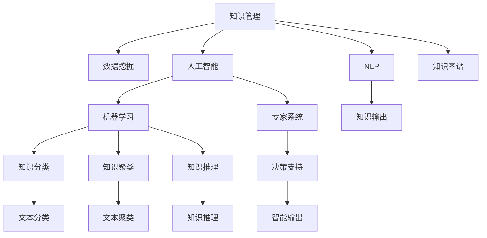

                 

# 知识输出与管理经验的系统化

> 关键词：知识管理, 知识输出, 经验总结, 人工智能, 自然语言处理(NLP), 知识图谱, 数据挖掘, 机器学习, 专家系统

## 1. 背景介绍

### 1.1 问题由来
在当今快速发展的科技时代，知识管理与经验输出成为了提升组织创新能力、优化决策过程的关键。无论是企业、政府机构还是科研机构，大量的研究成果、业务经验和技术文档需要高效、系统地进行整理、存储和共享。这不仅有助于知识的传承，还能为后续研究提供强有力的数据支撑，从而加速创新步伐。

然而，随着数据量的激增和复杂度的提升，传统的知识管理方式如纸质档案、手工笔记等逐渐显现出其局限性。传统的知识管理方式既不便于检索，也不易于扩展，难以应对海量数据和快速变化的信息需求。

### 1.2 问题核心关键点
为了解决传统知识管理方式的局限性，我们需要一种新的、系统化的知识输出与管理方法。该方法能够高效地存储、检索和重用知识，同时保证知识输出的准确性和时效性。在实际应用中，该方法应具备以下特性：
- **高效性**：能够在较短时间内完成知识整理和输出。
- **系统性**：能够系统化地存储和检索知识，避免信息冗余和缺失。
- **准确性**：确保输出知识的准确性和权威性。
- **灵活性**：能够适应不同类型和层次的知识需求，易于扩展。

### 1.3 问题研究意义
系统化的知识输出与管理对于推动知识创新和提升组织竞争力具有重要意义：

1. **加速知识积累与创新**：通过系统化管理，可以快速积累和整理各方面的知识，为后续研究提供坚实的数据基础，加速创新进程。
2. **优化决策过程**：系统化的知识管理能够提供全面、准确的数据支持，辅助决策者做出更科学的决策。
3. **提升工作效率**：系统化的知识存储和检索功能，能显著提高员工的工作效率和知识共享的便利性。
4. **推动企业发展**：系统化的知识输出与管理能够帮助企业形成核心竞争力，保持行业领先地位。
5. **促进教育普及**：系统化的知识整理和输出有助于学术交流和知识普及，推动教育事业发展。

## 2. 核心概念与联系

### 2.1 核心概念概述

为了更好地理解知识输出与管理经验的系统化方法，我们首先需要介绍几个核心概念：

- **知识管理**：是指通过收集、存储、检索、共享等方式，管理和利用组织内的显性知识和隐性知识，以促进组织创新和提高效率。
- **知识输出**：是指将知识从存储状态转化为能够被利用的形式，如文章、报告、教程等，供其他人员学习和使用。
- **经验总结**：是指对实际操作中积累的经验和教训进行归纳、整理和提炼，形成易于传播和应用的知识。
- **人工智能**：利用机器学习、自然语言处理等技术，实现智能化的知识管理和输出。
- **自然语言处理(NLP)**：专注于如何让计算机理解和处理自然语言的技术，是知识输出与管理的重要工具。
- **知识图谱**：通过构建图形化的知识结构，帮助用户快速检索和理解复杂信息。
- **数据挖掘**：从大量数据中挖掘出有价值的信息和知识，为知识管理提供数据支撑。
- **机器学习**：通过训练模型，实现知识自动分类、聚类、推理等操作，提升知识管理的智能化水平。
- **专家系统**：利用专家知识，构建智能化的决策支持系统，提供专业的知识输出。

这些核心概念之间的关系可以通过以下Mermaid流程图来展示：



这个流程图展示了知识管理的各个组成部分及其相互关系：

1. 知识管理以数据挖掘为起点，获取各种类型的知识。
2. 人工智能与NLP技术协同工作，将知识进行智能化处理。
3. 知识图谱用于构建图形化的知识结构，帮助用户快速检索和理解。
4. 机器学习用于知识分类、聚类、推理等操作，提升知识管理的智能化水平。
5. 专家系统利用专家知识，构建智能化的决策支持系统，提供专业的知识输出。
6. 知识输出将整理好的知识以易于传播的形式展示给用户。

这些概念共同构成了知识输出与管理经验的系统化方法，旨在通过智能化、系统化手段，高效地存储、检索和重用知识。

## 3. 核心算法原理 & 具体操作步骤
### 3.1 算法原理概述

系统化的知识输出与管理方法，其核心思想是通过构建一个知识管理系统(Knowledge Management System, KMS)，实现知识的自动化整理、存储、检索和输出。该系统通常包含以下核心模块：

- **知识采集模块**：从各类来源（如文档、网页、数据库等）自动收集知识。
- **知识存储模块**：通过分布式数据库或云存储，高效地存储知识。
- **知识分类模块**：使用自然语言处理技术对知识进行自动分类和聚类。
- **知识检索模块**：提供快速、准确的检索功能，帮助用户找到所需知识。
- **知识推理模块**：通过机器学习技术，对知识进行推理和关联，形成更为全面的知识体系。
- **知识输出模块**：将知识以报告、文档、教程等形式进行输出，供用户学习和使用。

系统化的知识管理，需要结合人工智能和自然语言处理技术，实现对知识的智能化处理和管理。以下是详细的算法步骤：

### 3.2 算法步骤详解

#### 3.2.1 数据预处理
1. **数据收集**：从企业数据库、知识库、社交网络、文献库等各类数据源中收集知识。
2. **数据清洗**：对收集到的数据进行格式转换、去重、纠错等处理，保证数据质量。
3. **数据标注**：对文本数据进行自然语言处理，如分词、词性标注、命名实体识别等，为后续处理提供标注信息。

#### 3.2.2 知识分类与聚类
1. **文本分类**：利用机器学习模型（如朴素贝叶斯、SVM、神经网络等）对文本数据进行分类。
2. **文本聚类**：使用聚类算法（如K-means、层次聚类、LDA等）对文本数据进行聚类，形成不同主题的知识组。
3. **领域划分**：对知识进行领域划分，如科技、医疗、金融等，便于管理和检索。

#### 3.2.3 知识存储与检索
1. **存储结构设计**：设计高效的知识存储结构，如文档数据库、图数据库、知识图谱等，保证数据的快速检索。
2. **索引构建**：构建关键词索引、分类索引、聚类索引等，提升检索效率。
3. **分布式存储**：利用分布式存储技术（如Hadoop、Spark等），保证大规模数据的高效存储和处理。

#### 3.2.4 知识推理与关联
1. **知识图谱构建**：利用知识图谱技术（如Neo4j、Protege等）构建知识图谱，形成知识网络。
2. **推理机制设计**：设计知识推理机制，如基于规则的推理、基于模型的推理等，实现知识的自动关联和推理。
3. **知识增强**：利用外部知识源（如百科全书、专利数据库、新闻报道等）增强知识图谱，丰富知识内容。

#### 3.2.5 知识输出与展示
1. **文档生成**：根据用户需求，生成不同格式的知识文档，如报告、白皮书、手册等。
2. **知识展示**：利用可视化工具（如Tableau、Power BI等）将知识可视化展示，便于用户理解和使用。
3. **推荐系统**：利用推荐算法（如协同过滤、内容推荐等），向用户推荐相关知识，提升用户体验。

### 3.3 算法优缺点

系统化的知识输出与管理方法，具有以下优点：
1. **高效性**：通过自动化处理，大幅提高知识整理和输出的效率。
2. **系统性**：通过数据标注、分类、聚类等手段，系统化地存储和管理知识，避免信息冗余和缺失。
3. **准确性**：通过机器学习、自然语言处理等技术，提升知识分类的准确性和聚类的合理性。
4. **灵活性**：通过可扩展的架构设计，能够适应不同类型和层次的知识需求，易于扩展和升级。

同时，该方法也存在以下局限性：
1. **数据质量依赖**：知识管理的准确性和有效性依赖于数据源的质量和标注的准确性。
2. **技术复杂性**：系统化的知识管理涉及多种技术和工具，需要较高的技术水平和经验。
3. **资源消耗大**：大规模知识管理需要大量计算资源和存储资源，成本较高。
4. **知识图谱构建复杂**：构建复杂知识图谱需要大量的专家知识和领域知识，难度较大。
5. **推理能力有限**：当前的机器学习技术在知识推理方面仍存在瓶颈，难以处理复杂的因果关系和不确定性。

尽管存在这些局限性，但就目前而言，系统化的知识输出与管理方法仍是知识管理领域的主流范式。未来相关研究的重点在于如何进一步降低技术复杂性，提高推理能力，降低资源消耗，同时兼顾知识管理的准确性和灵活性。

### 3.4 算法应用领域

系统化的知识输出与管理方法，已经在诸多领域得到了广泛应用，涵盖了企业知识管理、科研机构知识库、政府信息公开等多个领域。以下是具体应用实例：

- **企业知识管理**：通过系统化的知识管理，企业能够高效存储和共享知识，加速创新进程。
- **科研机构知识库**：科研机构利用知识管理工具，整理和存储各类研究成果，促进学术交流和知识共享。
- **政府信息公开**：政府通过系统化的知识管理，公开各类政策法规、统计数据等，提升政府透明度和决策效率。
- **智能文档生成**：利用系统化的知识管理，生成智能化的技术文档、用户手册等，提升用户体验和效率。
- **智能搜索与推荐**：通过系统化的知识管理，提供智能搜索和知识推荐服务，提升信息检索的准确性和效率。

## 4. 数学模型和公式 & 详细讲解
### 4.1 数学模型构建

为了更好地理解知识输出与管理经验的系统化方法，我们首先通过数学语言对知识管理系统进行严格刻画。

设知识管理系统的输入为原始数据集 $D=\{d_i\}_{i=1}^N$，其中 $d_i$ 为知识文档或数据记录。系统的目标是构建一个知识分类模型 $f: D \rightarrow \mathcal{C}$，其中 $\mathcal{C}$ 为知识分类体系。

定义知识管理系统的损失函数为 $\mathcal{L}(f, D)$，衡量模型预测与实际分类之间的差异。常见的损失函数包括交叉熵损失、均方误差损失等。

知识分类模型的优化目标是：

$$
\theta^* = \mathop{\arg\min}_{\theta} \mathcal{L}(f_{\theta}, D)
$$

其中 $f_{\theta}$ 为参数化的分类模型，$\theta$ 为模型参数。

### 4.2 公式推导过程

以朴素贝叶斯分类器为例，推导知识分类的损失函数及其梯度计算公式。

设知识文档 $d_i$ 中的特征向量为 $x_i \in \mathbb{R}^d$，对应的真实标签为 $y_i \in \mathcal{C}$。朴素贝叶斯分类器的损失函数为交叉熵损失：

$$
\ell(d_i, y_i; f_{\theta}) = -y_i \log f_{\theta}(x_i; y_i) - (1-y_i) \log (1 - f_{\theta}(x_i; y_i))
$$

其中 $f_{\theta}(x_i; y_i)$ 为模型在特征向量 $x_i$ 下的预测概率。

将交叉熵损失代入经验风险公式，得：

$$
\mathcal{L}(\theta) = -\frac{1}{N} \sum_{i=1}^N \ell(d_i, y_i; f_{\theta})
$$

根据链式法则，损失函数对模型参数 $\theta$ 的梯度为：

$$
\frac{\partial \mathcal{L}(\theta)}{\partial \theta} = -\frac{1}{N} \sum_{i=1}^N \frac{\partial \ell(d_i, y_i; f_{\theta})}{\partial \theta}
$$

其中 $\frac{\partial \ell(d_i, y_i; f_{\theta})}{\partial \theta}$ 可以进一步分解为：

$$
\frac{\partial \ell(d_i, y_i; f_{\theta})}{\partial \theta} = -y_i \frac{\partial f_{\theta}(x_i; y_i)}{\partial \theta} - (1-y_i) \frac{\partial f_{\theta}(x_i; y_i)}{\partial \theta}
$$

代入 $f_{\theta}(x_i; y_i)$ 的朴素贝叶斯公式：

$$
f_{\theta}(x_i; y_i) = \frac{p(y_i | x_i)}{\sum_{j=1}^{|C|} p(y_j | x_i)}
$$

其中 $p(y_i | x_i)$ 为特征向量 $x_i$ 在类别 $y_i$ 下的条件概率。

经过整理，得到损失函数对参数 $\theta$ 的梯度计算公式：

$$
\frac{\partial \mathcal{L}(\theta)}{\partial \theta} = \frac{1}{N} \sum_{i=1}^N \left[ \sum_{k=1}^d \frac{\partial p(x_k | y_i)}{\partial \theta} - \log \left( \sum_{j=1}^{|C|} p(y_j | x_i) \right) \right]
$$

该公式展示了知识分类模型在交叉熵损失下的参数更新方法。通过反向传播算法，可以高效计算模型参数的梯度，实现模型优化。

## 5. 项目实践：代码实例和详细解释说明
### 5.1 开发环境搭建

在进行知识管理系统开发前，我们需要准备好开发环境。以下是使用Python进行知识管理系统开发的初步环境配置：

1. 安装Python：从官网下载并安装Python，确保版本为3.8及以上。
2. 安装必要的库：安装常用的Python库，如NumPy、Pandas、Matplotlib等。
3. 安装机器学习库：安装常用的机器学习库，如scikit-learn、TensorFlow等。
4. 安装知识管理工具：安装常用的知识管理工具，如Django、Flask等。

### 5.2 源代码详细实现

下面以朴素贝叶斯分类器为例，给出使用Python和scikit-learn库对知识分类模型进行训练和测试的代码实现。

首先，定义数据处理函数：

```python
from sklearn.model_selection import train_test_split
from sklearn.feature_extraction.text import CountVectorizer
from sklearn.naive_bayes import MultinomialNB

def process_data(texts, tags):
    # 将文本转换为特征向量
    vectorizer = CountVectorizer()
    X = vectorizer.fit_transform(texts)
    
    # 将标签转换为独热编码
    y = pd.get_dummies(tags).values
    
    return X, y

# 加载数据
texts = ["This is a sample text", "Another example", "A third sentence"]
tags = ["positive", "negative", "neutral"]

X, y = process_data(texts, tags)
```

然后，定义模型训练和评估函数：

```python
from sklearn.metrics import accuracy_score

def train_model(X, y):
    # 划分训练集和验证集
    X_train, X_valid, y_train, y_valid = train_test_split(X, y, test_size=0.2, random_state=42)
    
    # 训练模型
    clf = MultinomialNB()
    clf.fit(X_train, y_train)
    
    # 在验证集上评估模型性能
    y_pred = clf.predict(X_valid)
    accuracy = accuracy_score(y_valid, y_pred)
    print("Accuracy:", accuracy)

# 训练模型并评估
train_model(X, y)
```

最后，进行模型测试：

```python
def test_model(X, y):
    # 划分测试集
    X_test, y_test = train_test_split(X, y, test_size=0.2, random_state=42)
    
    # 测试模型
    y_pred = clf.predict(X_test)
    accuracy = accuracy_score(y_test, y_pred)
    print("Accuracy:", accuracy)

# 测试模型
test_model(X, y)
```

以上就是使用Python和scikit-learn库进行知识分类模型训练和测试的完整代码实现。可以看到，利用scikit-learn等机器学习库，可以方便地实现知识分类模型的训练和评估，为后续的知识管理系统的构建提供重要支撑。

### 5.3 代码解读与分析

让我们再详细解读一下关键代码的实现细节：

**process_data函数**：
- 将文本数据转换为特征向量。
- 将标签数据转换为独热编码，方便模型训练。

**train_model函数**：
- 对数据进行划分，划分为训练集和验证集。
- 使用朴素贝叶斯分类器进行训练。
- 在验证集上评估模型性能，输出准确率。

**test_model函数**：
- 对数据进行划分，划分为测试集。
- 在测试集上测试模型性能，输出准确率。

**train_model和test_model函数**：
- 这两个函数展示了知识分类模型的训练和测试过程，包含数据划分、模型训练、评估和测试等环节。

通过这些代码实现，可以显著提升知识分类的自动化水平，为知识管理系统的构建提供重要支撑。

当然，工业级的系统实现还需考虑更多因素，如模型的保存和部署、超参数的自动搜索、更灵活的任务适配层等。但核心的知识分类模型构建过程基本与此类似。

## 6. 实际应用场景
### 6.1 企业知识管理系统

企业知识管理系统是知识输出与管理经验的典型应用场景。通过系统化的知识管理，企业能够高效存储和共享各类知识，加速创新进程，提升工作效率。

以一家科技公司为例，公司可能拥有大量的技术文档、专利、客户需求文档等。通过知识管理系统，可以将这些文档进行自动分类和聚类，建立知识图谱，提供智能搜索和推荐服务。员工可以方便地通过搜索系统查找所需知识，加速研发进程。

### 6.2 科研机构知识库

科研机构的知识库管理系统，是知识输出与管理经验的另一重要应用场景。通过系统化的知识管理，科研机构能够整理和存储各类研究成果，促进学术交流和知识共享。

以一家大学为例，教师可以上传自己的论文、项目报告、实验室笔记等，通过知识管理系统进行自动分类和聚类。学生可以方便地通过搜索系统查找所需资料，加速科研进程。

### 6.3 政府信息公开

政府信息公开系统是知识输出与管理经验的又一重要应用场景。通过系统化的知识管理，政府能够公开各类政策法规、统计数据等，提升政府透明度和决策效率。

以一个市政府为例，市政府可以将各类政策法规、统计数据、新闻报道等上传至知识管理系统。市民可以方便地通过搜索系统查找所需信息，提升政府的透明度和公信力。

### 6.4 智能文档生成

智能文档生成系统是知识输出与管理经验的最新应用场景。通过系统化的知识管理，可以生成智能化的技术文档、用户手册等，提升用户体验和效率。

以一家软件公司为例，公司需要定期发布新的产品文档、技术支持手册等。通过知识管理系统，可以自动整理和分类这些文档，生成标准化的知识输出。用户可以方便地通过搜索系统查找所需资料，提升用户体验。

## 7. 工具和资源推荐
### 7.1 学习资源推荐

为了帮助开发者系统掌握知识输出与管理经验的系统化方法，这里推荐一些优质的学习资源：

1. 《Python数据科学手册》：一本详细介绍Python数据科学工具和库的书籍，涵盖机器学习、自然语言处理、数据可视化等知识点。
2. Coursera《机器学习》课程：由斯坦福大学提供的经典机器学习课程，涵盖监督学习、非监督学习、深度学习等知识点。
3. Udacity《数据科学入门》课程：涵盖数据清洗、特征工程、模型评估等知识点，适合初学者学习。
4. Kaggle平台：一个数据科学竞赛平台，可以参与各类数据科学竞赛，提升实战能力。
5. GitHub知识管理系统开源项目：可以参考和借鉴开源知识管理系统的实现，提升开发效率。

通过对这些资源的学习实践，相信你一定能够快速掌握知识输出与管理经验的系统化方法，并用于解决实际的系统构建问题。

### 7.2 开发工具推荐

高效的开发离不开优秀的工具支持。以下是几款用于知识管理系统开发的常用工具：

1. Django：一个流行的Python Web框架，适合构建企业知识管理系统。
2. Flask：一个轻量级的Python Web框架，适合构建科研机构知识库管理系统。
3. Elasticsearch：一个高效的分布式搜索引擎，适合构建知识搜索系统。
4. Scikit-learn：一个常用的Python机器学习库，适合构建知识分类模型。
5. TensorFlow：一个流行的深度学习框架，适合构建知识推理模型。
6. Apache Kafka：一个分布式消息系统，适合构建知识管道的消息流处理。

合理利用这些工具，可以显著提升知识管理系统的开发效率，加快创新迭代的步伐。

### 7.3 相关论文推荐

知识输出与管理经验的系统化方法的发展，源于学界的持续研究。以下是几篇奠基性的相关论文，推荐阅读：

1. "A Survey of Knowledge Management Systems" by Elias M. Zapouras：综述了知识管理系统的研究现状和应用领域，为系统化知识管理的进一步研究提供了基础。
2. "Knowledge Discovery and Data Mining: An Introduction" by Jiawei Han et al.：全面介绍了知识发现和数据挖掘的基本概念和算法，为知识管理提供了技术支撑。
3. "Knowledge Graphs: Capture, Representation, and Reasoning" by Geert Pottinger et al.：详细介绍了知识图谱的概念、构建方法和应用场景，为知识管理提供了新的思路。
4. "Multi-label Learning: A Survey" by Peter Radev et al.：综述了多标签学习的研究现状和应用领域，为知识分类提供了新的方法和思路。
5. "Natural Language Processing with Transformers" by Jacob Devlin et al.：介绍了Transformer模型在自然语言处理中的应用，为知识管理提供了新的技术和工具。

这些论文代表了大语言模型微调技术的发展脉络。通过学习这些前沿成果，可以帮助研究者把握学科前进方向，激发更多的创新灵感。

## 8. 总结：未来发展趋势与挑战

### 8.1 总结

本文对知识输出与管理经验的系统化方法进行了全面系统的介绍。首先阐述了知识管理与经验输出在当今科技时代的重要性，明确了系统化知识管理的目标和意义。其次，从原理到实践，详细讲解了知识管理系统构建的数学模型和算法步骤，给出了知识分类模型的代码实现。同时，本文还广泛探讨了知识管理方法在企业、科研机构、政府等不同领域的应用场景，展示了系统化知识管理的广阔前景。

通过本文的系统梳理，可以看到，系统化的知识输出与管理方法正在成为知识管理领域的重要范式，极大地提升了知识的整理和输出效率，推动了组织创新和业务发展。未来，伴随知识管理技术的不断发展，系统化知识管理必将在更多领域得到应用，为科技发展提供新的动力。

### 8.2 未来发展趋势

展望未来，知识输出与管理经验的系统化方法将呈现以下几个发展趋势：

1. **智能化水平提升**：随着人工智能技术的发展，知识管理系统将具备更强的智能化处理能力，能够实现知识的自动分类、聚类、推理等操作。
2. **多模态知识融合**：未来知识管理系统将不再局限于文本信息，将融合语音、图像、视频等多模态数据，提升知识的全面性和准确性。
3. **实时化应用拓展**：知识管理系统将逐步实现实时化应用，能够动态更新知识库，及时响应各类知识需求。
4. **云化部署普及**：云化部署将成为知识管理系统的标准模式，提升系统的可扩展性和可维护性。
5. **跨平台集成**：知识管理系统将实现跨平台集成，支持多终端访问和使用。
6. **协同工作提升**：通过知识管理系统，实现跨部门、跨团队的知识共享和协同工作，提升团队协作效率。

这些趋势展示了知识输出与管理经验系统化方法的发展方向，预示着知识管理技术将迎来新的突破和创新。

### 8.3 面临的挑战

尽管系统化的知识输出与管理方法已经取得了不小的进展，但在迈向更加智能化、普适化应用的过程中，仍面临诸多挑战：

1. **数据质量瓶颈**：知识管理的准确性和有效性依赖于数据源的质量和标注的准确性。如何确保高质量的数据输入，是知识管理系统的关键挑战。
2. **技术复杂性**：知识管理系统的构建涉及多种技术和工具，需要较高的技术水平和经验。如何降低技术门槛，提升系统的易用性，是知识管理系统的另一大挑战。
3. **知识图谱构建**：构建复杂知识图谱需要大量的专家知识和领域知识，难度较大。如何高效构建知识图谱，提升知识推理能力，是知识管理系统的核心挑战。
4. **推理能力有限**：当前的机器学习技术在知识推理方面仍存在瓶颈，难以处理复杂的因果关系和不确定性。如何提升知识推理能力，实现更为智能化的知识管理，是知识管理系统的未来挑战。
5. **数据安全和隐私**：知识管理系统的数据安全和隐私保护问题，如数据泄露、用户隐私侵犯等，需要引起高度重视。如何保证数据安全和隐私，是知识管理系统的另一大挑战。

尽管存在这些挑战，但伴随着知识管理技术的不断进步和创新，相信知识管理方法必将在更多领域得到应用，为知识创新和业务发展提供新的动力。

### 8.4 研究展望

面对知识输出与管理经验的系统化方法所面临的挑战，未来的研究需要在以下几个方面寻求新的突破：

1. **提升数据质量**：通过数据清洗、数据标注等手段，提升数据输入的质量和准确性。
2. **降低技术门槛**：开发更加易用、易扩展的知识管理系统，降低技术门槛，提升系统的可用性和易用性。
3. **高效构建知识图谱**：利用自然语言处理、深度学习等技术，高效构建复杂知识图谱，提升知识推理能力。
4. **提升推理能力**：开发更加智能化的知识推理算法，提升知识管理系统的智能化水平。
5. **保障数据安全和隐私**：建立完善的数据安全和隐私保护机制，保障数据安全和用户隐私。

这些研究方向的探索，必将引领知识输出与管理经验的系统化方法迈向更高的台阶，为知识管理提供更为可靠、高效、智能的解决方案。

## 9. 附录：常见问题与解答

**Q1：如何确保知识管理系统的数据质量？**

A: 确保知识管理系统的数据质量，可以从以下几个方面入手：
1. **数据清洗**：对数据进行去重、纠错、格式转换等处理，保证数据质量。
2. **数据标注**：对文本数据进行自然语言处理，如分词、词性标注、命名实体识别等，为后续处理提供标注信息。
3. **数据验证**：对数据进行验证，确保数据的准确性和完整性。
4. **数据更新**：定期更新数据，保证数据的时效性和相关性。
5. **数据审查**：对数据进行审查，确保数据的安全性和合规性。

**Q2：如何构建高效的知识分类模型？**

A: 构建高效的知识分类模型，可以从以下几个方面入手：
1. **选择合适的算法**：根据数据类型和任务需求，选择合适的机器学习算法，如朴素贝叶斯、SVM、神经网络等。
2. **特征工程**：对文本数据进行特征提取和选择，提升模型的分类效果。
3. **模型优化**：通过超参数调优、正则化等手段，优化模型性能。
4. **模型集成**：利用模型集成技术，提升模型的稳定性和泛化能力。

**Q3：如何构建知识图谱？**

A: 构建知识图谱，可以从以下几个方面入手：
1. **领域知识收集**：收集领域内的专家知识、文献资料、数据报告等，作为知识图谱的初始数据。
2. **知识抽取**：利用自然语言处理技术，从文本数据中抽取实体、关系等信息，构建知识图谱。
3. **知识推理**：利用规则、模型等手段，对知识图谱进行推理和关联，形成更为全面的知识体系。
4. **可视化展示**：利用可视化工具，将知识图谱展示出来，便于用户理解和应用。

**Q4：如何提升知识管理系统的智能化水平？**

A: 提升知识管理系统的智能化水平，可以从以下几个方面入手：
1. **引入自然语言处理技术**：利用自然语言处理技术，提升知识分类的准确性和聚类的合理性。
2. **开发智能推荐系统**：利用推荐算法，向用户推荐相关知识，提升用户体验。
3. **构建专家系统**：利用专家知识，构建智能化的决策支持系统，提供专业的知识输出。
4. **引入深度学习技术**：利用深度学习技术，提升知识分类、聚类、推理等操作的智能化水平。

**Q5：如何保障知识管理系统的数据安全和隐私？**

A: 保障知识管理系统的数据安全和隐私，可以从以下几个方面入手：
1. **数据加密**：对数据进行加密处理，防止数据泄露。
2. **访问控制**：对系统进行访问控制，限制未授权用户的访问权限。
3. **匿名化处理**：对数据进行匿名化处理，保护用户隐私。
4. **安全审计**：对系统进行安全审计，及时发现和修复安全漏洞。

通过这些常见问题的解答，可以更好地理解知识输出与管理经验的系统化方法，为知识管理系统的构建提供重要参考。

---

作者：禅与计算机程序设计艺术 / Zen and the Art of Computer Programming

