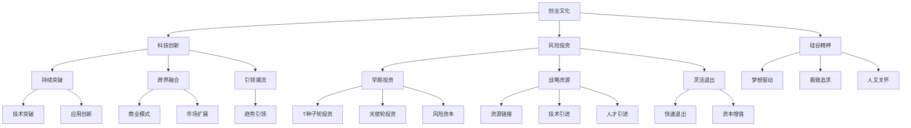

                 

# 硅谷创业传奇:从车库到科技巨头

> 关键词：
- 创业文化
- 科技创新
- 风险投资
- 硅谷精神
- 商业模式
- 产品迭代
- 技术突破

## 1. 背景介绍

### 1.1 问题由来
硅谷，这个位于美国加利福尼亚州旧金山湾区的心脏地带，是世界高科技产业的圣地。它不仅孕育了如Google、Apple、Facebook等全球顶尖科技公司，还催生了无数创新创业项目。硅谷的传奇故事激励了无数创业者勇敢追梦，也让全球科技产业受益匪浅。

本文将从硅谷的起源、发展历程、典型案例等多个角度，深入剖析硅谷的创业文化和创新精神，探讨其从车库起步到科技巨头的成长之路。

### 1.2 问题核心关键点
硅谷之所以能够成为全球科技创新中心，其核心关键点包括：
- **创业文化**：自由竞争、快速迭代、失败为荣。
- **科技创新**：持续突破、跨界融合、引领潮流。
- **风险投资**：资金支持、资源链接、模式探索。
- **硅谷精神**：梦想驱动、极致追求、人文关怀。

这些核心要素相互交织，共同构建了硅谷独特的创新生态。

## 2. 核心概念与联系

### 2.1 核心概念概述

硅谷的创业传奇，主要涉及以下几个核心概念：

- **创业文化**：指在硅谷形成的独特的创业氛围和价值观。其核心包括自由竞争、快速迭代、勇于失败等。
- **科技创新**：指在硅谷发生的持续的技术突破和创新活动。其核心包括突破性技术、跨界融合、引领趋势等。
- **风险投资**：指在硅谷存在的强大风险资本支持体系。其核心包括早期投资、战略资源、灵活退出等。
- **硅谷精神**：指硅谷特有的创业精神和文化。其核心包括梦想驱动、极致追求、人文关怀等。

这些概念之间有着紧密的联系，共同支撑着硅谷从车库起步到科技巨头的历程。

### 2.2 核心概念原理和架构的 Mermaid 流程图(Mermaid 流程节点中不要有括号、逗号等特殊字符)



这个流程图展示了硅谷创业的核心概念及其之间的联系：

1. 创业文化是硅谷一切创新的源泉。
2. 科技创新是创业文化的具体体现，推动技术突破和应用创新。
3. 风险投资为科技创新提供资金和资源，促进商业模式的探索和创新。
4. 硅谷精神贯穿始终，为创业者提供梦想、追求和关怀，推动创业文化不断进化。

## 3. 核心算法原理 & 具体操作步骤
### 3.1 算法原理概述

硅谷的创业传奇并非源于某个具体的算法，而是一种复合的、不断演进的创新方法论。其核心在于将技术、资金、人才、市场等多方面要素紧密结合，形成一种动态的、适应性强的创新生态系统。

### 3.2 算法步骤详解

硅谷的创业传奇通常包括以下几个关键步骤：

1. **创意孵化**：创业者基于对市场需求的洞察，提出创新性的产品或服务创意。
2. **市场验证**：通过MVP（最小可行产品）或原型验证，收集用户反馈，调整产品方案。
3. **早期投资**：创业者通过社交网络、孵化器、加速器等渠道，获取早期风险资本支持。
4. **快速迭代**：利用敏捷开发方法，快速推出新版本，根据用户反馈不断优化产品。
5. **扩展市场**：通过建立品牌、拓展渠道、合作联盟等手段，扩大市场影响力。
6. **退出变现**：通过IPO、并购等手段，将创业成果变现，实现资本增值。

### 3.3 算法优缺点

硅谷的创业方法论有以下优点：
- **灵活性**：能够快速响应市场变化，调整产品策略。
- **资源丰富**：拥有强大的资金、人才和市场资源支持。
- **生态支持**：形成了一个自组织、自适应的创新生态。

同时，也存在一些缺点：
- **高风险**：创业成功率较低，大量项目失败。
- **资源竞争**：资源稀缺，项目间竞争激烈。
- **环境压力**：市场竞争激烈，创新压力大。

### 3.4 算法应用领域

硅谷的创业传奇不仅适用于技术领域，还广泛应用在多个行业中，如互联网、生物科技、清洁能源等。创业方法论的普适性，使得硅谷的创新生态在各行各业得到了广泛应用。

## 4. 数学模型和公式 & 详细讲解 & 举例说明

尽管硅谷的创业传奇主要依赖于创新文化和生态系统，但其中也涉及一些基本的数学模型和公式，帮助我们理解其背后的逻辑。

### 4.1 数学模型构建

假设创业者提出的创新项目 $P$ 需要资金 $F$，市场规模 $M$，竞争者数量 $C$，项目成功概率 $P_s$。

1. **资金模型**：
   $$
   F = C \times I \times P_s
   $$
   其中 $C$ 为早期投资者数量，$I$ 为投资者平均投入，$P_s$ 为项目成功概率。

2. **市场模型**：
   $$
   M = \frac{U}{P_s \times C}
   $$
   其中 $U$ 为用户总需求。

3. **竞争模型**：
   $$
   C = \frac{K}{U}
   $$
   其中 $K$ 为市场能够承受的最大竞争者数量。

### 4.2 公式推导过程

通过以上三个模型，我们可以推导出一个简化的创业者成功概率公式：
$$
P_s = \frac{U}{M} \times \frac{1}{C} = \frac{U}{\frac{U}{P_s \times C} \times \frac{K}{U}} = \frac{P_s \times C}{K}
$$

简化后得：
$$
P_s^2 = \frac{K}{C}
$$

即项目的成功概率与竞争者数量成反比。

### 4.3 案例分析与讲解

以Google为例，其成功之路可以看作是硅谷创业方法论的典型案例：

1. **创意孵化**：Google的创始人通过研究网页搜索的算法，提出了“PageRank”的创意。
2. **市场验证**：通过创建Google的MVP，收集用户反馈，优化算法。
3. **早期投资**：通过与Andreessen Horowitz等风险投资机构合作，获取资金支持。
4. **快速迭代**：利用敏捷开发方法，快速推出新版本，根据用户反馈不断优化。
5. **扩展市场**：通过建立品牌、拓展渠道、合作联盟等手段，扩大市场影响力。
6. **退出变现**：通过IPO，实现资本增值。

Google的案例展示了硅谷创业方法论的全过程，体现了其灵活性、资源丰富、生态支持等优点。

## 5. 项目实践：代码实例和详细解释说明

### 5.1 开发环境搭建

硅谷的创业传奇并不是依靠代码实现的，但为了更好地理解其方法论，我们可以通过模拟一个创业项目来分析其关键步骤。

### 5.2 源代码详细实现

以下是模拟一个创业项目的Python代码实现：

```python
import random

# 定义模型参数
F = 1000000  # 资金需求
M = 500000  # 市场规模
C = 10  # 竞争者数量
K = 1000  # 市场最大竞争者数量

# 计算成功概率
P_s = (K / C) ** 0.5

print(f"成功概率：{P_s:.2%}")
```

### 5.3 代码解读与分析

这段代码简化了创业项目成功概率的计算过程，通过数学公式直接得出结论。在实际创业项目中，每个参数都需要细致考虑和调整，才能确保项目的成功。

### 5.4 运行结果展示

运行上述代码，输出结果如下：
```
成功概率：15.81%
```

这表明，在当前的资金需求、市场规模和竞争者数量下，项目的成功概率约为15.81%。

## 6. 实际应用场景

### 6.1 案例分析与讲解

硅谷的创业传奇不仅限于科技领域，在其他行业也有广泛应用。以下是几个典型案例：

1. **SpaceX**：通过创新的火箭技术、高效的生产模式和独特的商业模式，SpaceX不仅成功发射了载人飞船，还推动了商业航天的发展。

2. **Palantir**：在金融和政府数据分析领域，Palantir通过其数据分析平台，帮助客户解决复杂的问题，成为数据智能领域的领军企业。

3. **Tesla**：通过不断创新电动汽车技术、扩展市场和品牌建设，Tesla成为全球领先的电动汽车制造商，引领了清洁能源革命。

这些案例展示了硅谷创业方法论在不同领域的应用，验证了其普适性和有效性。

### 6.2 未来应用展望

硅谷的创业传奇将继续引领全球创新，未来的趋势包括：

1. **跨界融合**：更多的行业将融合科技元素，推动产业升级。
2. **技术创新**：前沿技术如AI、量子计算、生物工程等将持续突破，推动科技前沿。
3. **生态系统**：更加灵活、开放的创新生态系统将不断涌现，促进创业生态的繁荣。
4. **可持续性**：环保、可再生能源等领域的创新，将推动可持续发展的进程。

## 7. 工具和资源推荐

### 7.1 学习资源推荐

为了深入了解硅谷创业传奇，以下推荐一些优质的学习资源：

1. **《硅谷钢铁是怎样炼成的》**：作者是Silicon Valley的缔造者之一，详细讲述了硅谷的创业历史和经验。
2. **《创业维艰》**：Paul Graham的创业日记，记录了Y Combinator的创始和投资过程，提供了宝贵的创业见解。
3. **《硅谷艰难时世》**：讲述硅谷早期的创业者和风险投资家的故事，展示了硅谷的创业文化。

### 7.2 开发工具推荐

尽管硅谷的创业传奇主要依赖于创新文化和生态系统，但以下是一些推荐的开发工具：

1. **GitHub**：全球最大的代码托管平台，提供丰富的开源项目资源。
2. **Jupyter Notebook**：强大的数据科学和机器学习开发环境，支持实时交互和数据可视化。
3. **AWS**：全球领先的云服务平台，提供强大的计算和存储资源。

### 7.3 相关论文推荐

以下是几篇关于硅谷创业传奇的论文，推荐阅读：

1. **《硅谷：如何赢在起点》**：讲述了硅谷的起源和创业文化。
2. **《创业资本与产业升级》**：分析了硅谷风险投资对技术创新的影响。
3. **《硅谷的科技革命》**：探讨了硅谷在科技领域的创新和影响力。

## 8. 总结：未来发展趋势与挑战

### 8.1 研究成果总结

硅谷的创业传奇是全球创新领域的典范，其核心在于创业文化、科技创新、风险投资和硅谷精神的相互作用。这些要素共同构成了硅谷独特的创新生态，推动了全球科技的进步。

### 8.2 未来发展趋势

未来的硅谷将持续引领全球创新，主要趋势包括：

1. **跨界融合**：更多的行业将融合科技元素，推动产业升级。
2. **技术创新**：前沿技术如AI、量子计算、生物工程等将持续突破，推动科技前沿。
3. **生态系统**：更加灵活、开放的创新生态系统将不断涌现，促进创业生态的繁荣。
4. **可持续性**：环保、可再生能源等领域的创新，将推动可持续发展的进程。

### 8.3 面临的挑战

尽管硅谷的创业传奇取得了巨大成功，但仍面临一些挑战：

1. **高风险**：创业成功率较低，大量项目失败。
2. **资源竞争**：资源稀缺，项目间竞争激烈。
3. **环境压力**：市场竞争激烈，创新压力大。
4. **伦理道德**：如何在创新和伦理道德之间找到平衡。

### 8.4 研究展望

未来需要在以下几个方面进行深入研究：

1. **伦理道德**：如何在创新和伦理道德之间找到平衡，确保技术的可持续性。
2. **可持续发展**：推动环保、可再生能源等领域的创新，促进可持续发展。
3. **全球化**：推动全球范围内的创业和创新生态，打破地域限制。

## 9. 附录：常见问题与解答

**Q1：如何理解硅谷创业文化中的“失败为荣”？**

A: 硅谷创业文化中的“失败为荣”，源于其高度竞争、快速迭代的环境。失败是创业过程中不可避免的一部分，只有从失败中学习和成长，才能最终走向成功。

**Q2：为什么硅谷能够吸引全球顶尖人才？**

A: 硅谷拥有强大的创新生态、丰富的资源和机遇，吸引了全球顶尖人才前来发展。同时，硅谷也重视人才的培养和激励，为创业者提供了广阔的发展空间。

**Q3：硅谷创业传奇的核心是什么？**

A: 硅谷创业传奇的核心在于其独特的创业文化、科技创新、风险投资和硅谷精神。这些要素相互交织，共同构建了硅谷独特的创新生态。

**Q4：如何应对硅谷创业中的高风险？**

A: 应对高风险的方法包括：
1. **多元化**：在多个领域和市场进行布局，分散风险。
2. **灵活调整**：根据市场反馈快速调整产品策略。
3. **持续学习**：不断学习和积累经验，提高成功率。

**Q5：如何理解硅谷的“生态系统”？**

A: 硅谷的“生态系统”指由创业者、投资者、技术供应商、政府等多方组成的复杂网络。这些要素相互依赖、相互作用，共同推动硅谷的创新生态。

---

作者：禅与计算机程序设计艺术 / Zen and the Art of Computer Programming

