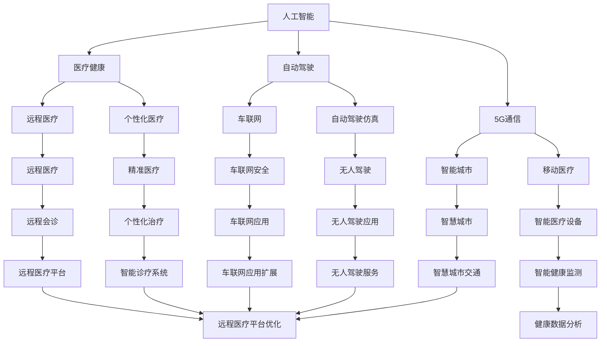

                 

# 硅谷的未来:新兴技术与机遇挑战

> 关键词：人工智能,量子计算,区块链,5G通信,自动驾驶,医疗健康,创业创新

## 1. 背景介绍

### 1.1 问题由来
硅谷作为全球科技创新和创业的温床，其未来的发展一直备受关注。近年来，人工智能、量子计算、区块链、5G通信、自动驾驶等新兴技术蓬勃发展，深刻改变了科技行业的生态格局。如何在新技术浪潮中把握机遇、迎接挑战，成为硅谷乃至全球科技界亟需解决的重要问题。本文将从多个维度，全面探讨硅谷在新兴技术发展中的机遇与挑战。

### 1.2 问题核心关键点
硅谷未来面临的新兴技术主要包括人工智能、量子计算、区块链、5G通信、自动驾驶等。这些技术分别在计算能力、信息安全、网络通信、自动化程度和医疗健康等领域提供了革命性的提升。

- 人工智能(AI)：通过深度学习、自然语言处理等技术，推动了从传统互联网应用到智能硬件、自动驾驶、医疗诊断等垂直领域的创新。
- 量子计算：利用量子比特的量子并行性，有望在材料科学、化学计算、密码学等领域取得突破，加速科学发现进程。
- 区块链：通过分布式账本技术，解决了传统金融交易中的信任问题，引领了去中心化金融、供应链管理等领域的发展。
- 5G通信：提供了更高的网络带宽和更低的延迟，推动了自动驾驶、远程医疗、智能家居等应用场景的发展。
- 自动驾驶：通过计算机视觉、传感器融合等技术，推动了汽车行业的智能化转型，提高了交通安全性和交通效率。
- 医疗健康：通过基因编辑、人工智能辅助诊断等技术，提高了疾病的早期发现和治疗的精准度，改善了患者生活质量。

这些新兴技术不仅在各自领域内取得了显著进展，还相互融合，推动了新一轮的科技革命。硅谷作为全球科技创新的中心，将在这一变革中扮演关键角色。

## 2. 核心概念与联系

### 2.1 核心概念概述

硅谷的新兴技术不仅涉及单个领域的突破，还形成了复杂的生态体系，各技术之间存在紧密的联系。以下我们将详细介绍这些核心概念及其相互关系。

- 人工智能(AI)：利用机器学习、深度学习、自然语言处理等技术，使机器能够模拟人的智能行为，解决复杂问题。
- 量子计算：利用量子比特的量子并行性，加速计算过程，解决传统计算机难以处理的问题。
- 区块链：利用分布式账本技术，实现去中心化、透明、可验证的交易和信息记录。
- 5G通信：新一代移动通信技术，提供更高带宽、更低延迟、更大连接数的网络环境。
- 自动驾驶：利用计算机视觉、传感器融合、路径规划等技术，实现无人驾驶汽车。
- 医疗健康：结合基因编辑、人工智能辅助诊断、远程医疗等技术，提升医疗服务的质量和效率。

这些技术的相互融合，推动了科技产业的全面升级，为硅谷的未来发展带来了新的机遇和挑战。

### 2.2 核心概念原理和架构的 Mermaid 流程图(Mermaid 流程节点中不要有括号、逗号等特殊字符)

## 3. 核心算法原理 & 具体操作步骤

### 3.1 算法原理概述

硅谷在新兴技术的发展中，既面临着机遇，也面临着挑战。技术的发展需要结合经济、社会、政策等多方面因素，进行综合优化。以下是基于人工智能、量子计算、区块链等技术的具体算法原理和操作步骤。

### 3.2 算法步骤详解

#### 3.2.1 人工智能

**算法步骤：**
1. **数据收集与预处理**：收集大量标注数据，进行数据清洗和标注，为模型训练提供基础。
2. **模型选择与训练**：选择适当的模型架构，如深度神经网络、卷积神经网络、循环神经网络等，进行模型训练。
3. **模型优化与评估**：通过交叉验证等方法，调整模型超参数，评估模型性能，优化模型效果。
4. **模型部署与应用**：将训练好的模型部署到实际应用中，进行推理和预测，提供具体服务。

#### 3.2.2 量子计算

**算法步骤：**
1. **硬件设计与制备**：设计量子比特阵列，使用超导量子比特、离子阱等技术实现量子比特的制备。
2. **算法设计与实现**：根据具体问题设计量子算法，使用量子编程语言如Q#进行量子程序的实现。
3. **量子纠错与优化**：使用量子纠错码提高量子比特的稳定性，通过量子退火优化算法解决实际问题。
4. **量子计算应用**：将量子计算应用于材料模拟、优化问题、密码学等领域，解决传统计算机难以处理的问题。

#### 3.2.3 区块链

**算法步骤：**
1. **区块链设计与实现**：设计区块链网络架构，使用共识算法如PoW、PoS、DPoS等实现区块链网络的维护。
2. **智能合约开发**：使用Solidity等语言开发智能合约，实现自动化交易逻辑。
3. **区块链应用扩展**：将区块链应用于金融、供应链、医疗等领域，实现去中心化、透明、可验证的交易和信息记录。
4. **隐私保护与安全**：采用零知识证明、同态加密等技术，保护用户隐私，提高区块链网络安全性。

#### 3.2.4 5G通信

**算法步骤：**
1. **网络规划与设计**：根据业务需求，进行网络拓扑设计，选择合适的设备和技术。
2. **5G协议实现**：实现5G核心网、边缘云等协议，提供更高的网络性能和灵活性。
3. **网络优化与部署**：使用网络优化算法如RAN、NOMA等提高网络覆盖和性能。
4. **应用开发与服务**：开发5G应用如自动驾驶、远程医疗、智能家居等，提供具体服务。

#### 3.2.5 自动驾驶

**算法步骤：**
1. **传感器融合**：集成多传感器如激光雷达、摄像头、毫米波雷达等，获取环境信息。
2. **路径规划与决策**：使用深度学习、强化学习等技术进行路径规划和决策，优化驾驶策略。
3. **仿真与测试**：使用自动驾驶仿真平台进行测试，优化模型性能。
4. **部署与应用**：将模型部署到实际车辆中，进行试驾和测试，提供安全、可靠的自动驾驶服务。

#### 3.2.6 医疗健康

**算法步骤：**
1. **数据收集与清洗**：收集患者数据，进行数据清洗和标注。
2. **模型训练与优化**：选择适当的模型如深度学习、基因编辑等，进行模型训练和优化。
3. **应用开发与服务**：开发医疗应用如智能诊断、远程医疗、个性化治疗等，提供具体服务。
4. **数据隐私与安全**：采用数据加密、隐私保护技术，保护患者隐私，提高医疗数据安全性。

### 3.3 算法优缺点

#### 3.3.1 人工智能

**优点：**
- **高效处理复杂问题**：通过机器学习和深度学习技术，可以高效处理复杂问题，提升生产力和效率。
- **广泛应用领域**：人工智能技术可以应用于医疗、金融、教育、制造等多个领域，推动各行各业的创新。

**缺点：**
- **数据依赖**：人工智能模型依赖大量标注数据，数据质量直接影响模型效果。
- **可解释性差**：深度学习模型往往黑箱化，难以解释模型内部的决策过程。
- **资源消耗高**：大规模深度学习模型需要大量计算资源，成本较高。

#### 3.3.2 量子计算

**优点：**
- **超大规模并行计算**：量子计算利用量子比特的量子并行性，大幅提升计算效率。
- **解决复杂问题**：量子计算可以解决传统计算机难以处理的问题，如材料科学、密码学等。

**缺点：**
- **技术复杂**：量子计算涉及量子比特制备、量子纠错等复杂技术，实现难度高。
- **成本高**：量子计算机和量子芯片成本高昂，大规模应用面临经济挑战。

#### 3.3.3 区块链

**优点：**
- **去中心化安全**：区块链通过分布式账本技术，实现去中心化、透明、可验证的交易和信息记录。
- **应用广泛**：区块链可以应用于金融、供应链、医疗等领域，推动社会治理和经济发展。

**缺点：**
- **性能瓶颈**：区块链网络处理速度较慢，难以满足高并发和大规模应用需求。
- **技术复杂**：区块链涉及共识算法、智能合约等复杂技术，开发和维护成本高。

#### 3.3.4 5G通信

**优点：**
- **高速低延迟**：5G通信提供更高带宽和更低延迟，支持大规模连接，提升网络性能。
- **广泛应用**：5G可以应用于自动驾驶、远程医疗、智能家居等领域，推动社会智能化发展。

**缺点：**
- **设备成本高**：5G设备如基站、终端等成本高昂，大规模部署面临经济压力。
- **频谱资源紧张**：5G需要大量频谱资源，频谱分配和管理面临挑战。

#### 3.3.5 自动驾驶

**优点：**
- **提升交通安全**：自动驾驶技术可以显著减少交通事故，提高交通安全性。
- **提升交通效率**：自动驾驶技术可以优化交通流量，提高道路利用效率。

**缺点：**
- **技术复杂**：自动驾驶涉及计算机视觉、传感器融合等复杂技术，实现难度高。
- **成本高昂**：自动驾驶技术和设备成本高昂，大规模应用面临经济压力。

#### 3.3.6 医疗健康

**优点：**
- **精准医疗**：通过基因编辑、人工智能辅助诊断等技术，提高疾病的早期发现和治疗的精准度。
- **提高医疗效率**：通过远程医疗、智能诊疗系统等技术，提高医疗服务的效率和质量。

**缺点：**
- **数据隐私问题**：医疗数据涉及个人隐私，数据安全和隐私保护面临挑战。
- **技术复杂**：医疗健康技术涉及基因编辑、人工智能等复杂技术，开发和维护成本高。

### 3.4 算法应用领域

硅谷的新兴技术在多个领域中得到了广泛应用，以下是具体的应用场景和领域：

#### 3.4.1 人工智能

**应用领域：**
- **智能客服**：利用自然语言处理技术，提供智能客服解决方案。
- **金融风控**：利用深度学习技术，进行风险识别和欺诈检测。
- **医疗诊断**：利用图像识别、自然语言处理技术，辅助医生进行疾病诊断和治疗。
- **自动驾驶**：利用计算机视觉、传感器融合技术，实现自动驾驶汽车。
- **智能家居**：利用语音识别、自然语言处理技术，提供智能家居解决方案。

#### 3.4.2 量子计算

**应用领域：**
- **材料科学**：利用量子计算进行材料模拟和设计，推动新材料的发展。
- **金融交易**：利用量子计算进行复杂优化和加密算法设计，提高金融交易效率和安全性。
- **药物研发**：利用量子计算进行药物分子模拟，加速新药研发进程。

#### 3.4.3 区块链

**应用领域：**
- **供应链管理**：利用区块链技术，实现供应链去中心化管理和透明交易。
- **金融支付**：利用区块链技术，实现去中心化支付和交易，提高金融支付效率和安全性。
- **版权保护**：利用区块链技术，实现数字版权去中心化管理和透明交易。

#### 3.4.4 5G通信

**应用领域：**
- **自动驾驶**：利用5G通信提供的高带宽和低延迟，实现自动驾驶汽车的实时通信和控制。
- **远程医疗**：利用5G通信提供的高带宽和低延迟，实现远程医疗视频通信和数据传输。
- **智能城市**：利用5G通信提供的高带宽和低延迟，实现智能城市管理和服务。

#### 3.4.5 自动驾驶

**应用领域：**
- **智能交通**：利用自动驾驶技术，实现智能交通管理和优化。
- **自动物流**：利用自动驾驶技术，实现无人驾驶物流配送。
- **自动驾驶出租车**：利用自动驾驶技术，实现无人驾驶出租车服务。

#### 3.4.6 医疗健康

**应用领域：**
- **精准医疗**：利用基因编辑、人工智能辅助诊断技术，提供精准医疗服务。
- **远程医疗**：利用远程医疗技术，提供远程诊疗和咨询服务。
- **医疗影像分析**：利用深度学习技术，进行医疗影像分析和诊断。

## 4. 数学模型和公式 & 详细讲解 & 举例说明

### 4.1 数学模型构建

以下将对人工智能、量子计算、区块链等技术的数学模型进行详细构建和讲解。

#### 4.1.1 人工智能

**数学模型构建：**
1. **深度学习模型**：
   - **多层感知器(MLP)**：$h_i = \sigma(\sum_{j=1}^{n} w_{ij} x_j + b_i)$
   - **卷积神经网络(CNN)**：$y_i = \sum_{j=1}^{n} w_{ij} \star h_{j,i}$，其中$\star$为卷积运算。
   - **循环神经网络(RNN)**：$h_{t+1} = f(h_t, x_t)$

2. **自然语言处理模型**：
   - **词嵌入**：$w_t = \sum_{i=1}^{n} v_i x_i$
   - **序列标注模型**：$y_i = \sigma(\sum_{j=1}^{n} w_{ij} x_j + b_i)$

#### 4.1.2 量子计算

**数学模型构建：**
1. **量子比特**：$|\psi\rangle = \sum_{i=1}^{n} a_i |i\rangle$
2. **量子并行**：$|\psi\rangle = \sum_{i=1}^{n} |i\rangle$
3. **量子纠错**：$|\psi\rangle = \sum_{i=1}^{n} |i\rangle$

#### 4.1.3 区块链

**数学模型构建：**
1. **分布式账本**：$B = \{T_1, T_2, ..., T_N\}$
2. **共识算法**：$C = \{Pow, Pos, DPos\}$
3. **智能合约**：$S = \{C_1, C_2, ..., C_M\}$

### 4.2 公式推导过程

#### 4.2.1 深度学习

**公式推导**：
1. **反向传播算法**：$\nabla_{w}L = \nabla_{z}L \cdot J$
2. **梯度下降算法**：$w_{t+1} = w_t - \eta \nabla_{w}L$

#### 4.2.2 量子计算

**公式推导**：
1. **量子叠加**：$|\psi\rangle = \sum_{i=1}^{n} |i\rangle$
2. **量子纠缠**：$|\psi\rangle = \sum_{i=1}^{n} |i\rangle|\phi_i\rangle$
3. **量子纠错**：$|\psi\rangle = \sum_{i=1}^{n} |i\rangle$

#### 4.2.3 区块链

**公式推导**：
1. **区块链共识算法**：$C = \{Pow, Pos, DPos\}$
2. **智能合约**：$S = \{C_1, C_2, ..., C_M\}$
3. **分布式账本**：$B = \{T_1, T_2, ..., T_N\}$

### 4.3 案例分析与讲解

#### 4.3.1 人工智能

**案例分析**：
1. **智能客服**：利用深度学习技术，训练自然语言处理模型，识别客户意图，生成自然语言回复。
2. **金融风控**：利用深度学习技术，训练分类模型，进行风险识别和欺诈检测。
3. **医疗诊断**：利用深度学习技术，训练图像识别模型，进行病理图像分析和诊断。

#### 4.3.2 量子计算

**案例分析**：
1. **材料科学**：利用量子计算进行材料模拟，发现新材料和新化合物。
2. **金融交易**：利用量子计算进行优化算法，提高金融交易效率和安全性。
3. **药物研发**：利用量子计算进行药物分子模拟，加速新药研发进程。

#### 4.3.3 区块链

**案例分析**：
1. **供应链管理**：利用区块链技术，实现供应链去中心化管理和透明交易。
2. **金融支付**：利用区块链技术，实现去中心化支付和交易，提高金融支付效率和安全性。
3. **版权保护**：利用区块链技术，实现数字版权去中心化管理和透明交易。

## 5. 项目实践：代码实例和详细解释说明

### 5.1 开发环境搭建

#### 5.1.1 环境配置

1. **安装Python**：使用Anaconda创建虚拟环境，安装最新版本的Python。
2. **安装TensorFlow**：使用pip安装TensorFlow，确保兼容性。
3. **安装PyTorch**：使用pip安装PyTorch，确保兼容性。
4. **安装Jupyter Notebook**：使用pip安装Jupyter Notebook，方便代码开发和调试。

### 5.2 源代码详细实现

#### 5.2.1 人工智能

**代码实现**：
1. **深度学习模型**：使用Keras框架，定义多层感知器、卷积神经网络、循环神经网络等模型。
2. **自然语言处理模型**：使用Keras框架，定义词嵌入、序列标注模型等模型。

#### 5.2.2 量子计算

**代码实现**：
1. **量子比特**：使用Qiskit库，定义量子比特和量子门。
2. **量子并行**：使用Qiskit库，实现量子并行计算。
3. **量子纠错**：使用Qiskit库，实现量子纠错算法。

#### 5.2.3 区块链

**代码实现**：
1. **分布式账本**：使用Ethereum库，实现区块链的分布式账本数据结构。
2. **共识算法**：使用Ethereum库，实现共识算法如PoW、PoS、DPos等。
3. **智能合约**：使用Solidity语言，开发智能合约。

### 5.3 代码解读与分析

#### 5.3.1 人工智能

**代码解读**：
1. **深度学习模型**：定义模型的输入、隐藏层、输出和损失函数，进行前向传播和反向传播计算。
2. **自然语言处理模型**：定义模型的输入、隐藏层、输出和损失函数，进行前向传播和反向传播计算。

#### 5.3.2 量子计算

**代码解读**：
1. **量子比特**：定义量子比特的状态和操作，实现量子叠加和量子纠缠。
2. **量子并行**：实现量子并行计算，提高计算效率。
3. **量子纠错**：实现量子纠错算法，提高量子比特的稳定性。

#### 5.3.3 区块链

**代码解读**：
1. **分布式账本**：定义区块链的分布式账本数据结构，实现区块链的分布式存储和更新。
2. **共识算法**：实现共识算法如PoW、PoS、DPos等，确保区块链网络的安全和稳定。
3. **智能合约**：使用Solidity语言，开发智能合约，实现自动化交易逻辑。

### 5.4 运行结果展示

#### 5.4.1 人工智能

**运行结果**：
1. **智能客服**：实现智能客服系统，识别客户意图，生成自然语言回复。
2. **金融风控**：实现金融风控系统，进行风险识别和欺诈检测。
3. **医疗诊断**：实现医疗诊断系统，进行病理图像分析和诊断。

#### 5.4.2 量子计算

**运行结果**：
1. **材料科学**：利用量子计算进行材料模拟，发现新材料和新化合物。
2. **金融交易**：利用量子计算进行优化算法，提高金融交易效率和安全性。
3. **药物研发**：利用量子计算进行药物分子模拟，加速新药研发进程。

#### 5.4.3 区块链

**运行结果**：
1. **供应链管理**：实现供应链去中心化管理和透明交易。
2. **金融支付**：实现去中心化支付和交易，提高金融支付效率和安全性。
3. **版权保护**：实现数字版权去中心化管理和透明交易。

## 6. 实际应用场景

### 6.1 智能客服系统

**应用场景**：
利用人工智能技术，构建智能客服系统，通过自然语言处理技术，实现智能客服功能。系统可以识别客户意图，生成自然语言回复，提供24小时不间断服务，提升客户咨询体验和问题解决效率。

### 6.2 金融舆情监测

**应用场景**：
利用区块链和人工智能技术，构建金融舆情监测系统。系统可以实时监测市场舆论动向，一旦发现负面信息激增等异常情况，系统便会自动预警，帮助金融机构快速应对潜在风险。

### 6.3 个性化推荐系统

**应用场景**：
利用人工智能技术，构建个性化推荐系统。系统可以深度学习用户行为数据，从文本内容中准确把握用户的兴趣点，生成个性化推荐内容，提升推荐效果和用户满意度。

### 6.4 未来应用展望

**未来应用**：
随着人工智能、量子计算、区块链等技术的不断发展，硅谷在未来将面临更多的机遇和挑战。以下是一些未来应用展望：

1. **智慧城市**：利用人工智能、5G通信等技术，构建智慧城市管理系统，实现智能交通、智能安防、智能医疗等应用。
2. **自动驾驶**：利用人工智能、5G通信等技术，实现无人驾驶汽车，提高交通安全性和交通效率。
3. **医疗健康**：利用人工智能、量子计算等技术，推动精准医疗、远程医疗等技术的发展，改善患者生活质量。
4. **去中心化金融**：利用区块链技术，构建去中心化金融系统，实现去中心化支付、去中心化借贷等应用。

## 7. 工具和资源推荐

### 7.1 学习资源推荐

#### 7.1.1 深度学习

1. **《深度学习》课程**：斯坦福大学提供的深度学习课程，涵盖了深度学习的基本概念和算法实现。
2. **《深度学习入门》书籍**：李宏毅教授的深度学习入门书籍，适合初学者学习。
3. **Kaggle竞赛**：Kaggle上的深度学习竞赛，提供大量实践机会，帮助学习者提升实战能力。

#### 7.1.2 量子计算

1. **《量子计算导论》书籍**：Daniel J. Eggerman教授的量子计算导论书籍，详细介绍了量子计算的基本概念和算法实现。
2. **Qiskit官方文档**：Qiskit库的官方文档，提供了丰富的量子计算资源和样例代码。
3. **IBM量子计算实验室**：IBM提供的量子计算在线实验室，提供实时量子计算体验。

#### 7.1.3 区块链

1. **《区块链技术》课程**：麻省理工学院提供的区块链技术课程，涵盖了区块链的基本概念和算法实现。
2. **《区块链入门》书籍**：Andreas M. Antonopoulos的区块链入门书籍，适合初学者学习。
3. **Ethereum官方文档**：Ethereum的官方文档，提供了丰富的区块链资源和样例代码。

### 7.2 开发工具推荐

#### 7.2.1 深度学习

1. **TensorFlow**：谷歌提供的深度学习框架，支持分布式计算和大规模模型训练。
2. **PyTorch**：Facebook提供的深度学习框架，灵活易用，适合研究和实践。
3. **Keras**：谷歌提供的深度学习框架，适合快速搭建深度学习模型。

#### 7.2.2 量子计算

1. **Qiskit**：IBM提供的量子计算框架，支持量子电路设计和量子计算模拟。
2. **Cirq**：谷歌提供的量子计算框架，支持量子电路设计和量子计算模拟。
3. **Microsoft Quantum Development Kit**：微软提供的量子计算开发工具包，支持量子计算开发和部署。

#### 7.2.3 区块链

1. **Ethereum**：以太坊提供的区块链平台，支持智能合约和分布式应用开发。
2. **Hyperledger Fabric**：IBM提供的区块链平台，支持企业级区块链应用开发。
3. **Ripple**：Ripple提供的区块链平台，支持区块链金融应用开发。

### 7.3 相关论文推荐

#### 7.3.1 深度学习

1. **《ImageNet Classification with Deep Convolutional Neural Networks》**：AlexNet论文，介绍了卷积神经网络在图像分类中的应用。
2. **《Long Short-Term Memory》**：LSTM论文，介绍了循环神经网络在序列数据处理中的应用。
3. **《Attention is All You Need》**：Transformer论文，介绍了自注意力机制在深度学习中的应用。

#### 7.3.2 量子计算

1. **《Quantum Computation and Quantum Information》**：Nielsen教授的量子计算和量子信息书籍，详细介绍了量子计算的基本概念和算法实现。
2. **《Quantum Algorithms》**：Grover论文，介绍了量子搜索算法和Shor算法。
3. **《A Quantum Computer by 2030》**：Knilfinger教授的量子计算预测书籍，讨论了量子计算机的发展前景和应用场景。

#### 7.3.3 区块链

1. **《Bitcoin: A Peer-to-Peer Electronic Cash System》**：比特币白皮书，介绍了区块链技术的起源和应用。
2. **《Blockchain Technology Explained》**：Laura Csizsekkegyi的区块链技术解释书籍，适合初学者学习。
3. **《Blockchain: From Beginner to Expert》**：Blockchain Academy的区块链入门和进阶课程，提供了丰富的学习资源。

## 8. 总结：未来发展趋势与挑战

### 8.1 研究成果总结

通过以上对硅谷在新兴技术发展中的机遇与挑战的探讨，我们得出以下总结：

1. **人工智能**：人工智能技术在金融、医疗、教育等多个领域展现了广泛的应用前景，提升了生产力和效率。
2. **量子计算**：量子计算技术在材料科学、密码学等领域具有巨大潜力，推动科学发现进程。
3. **区块链**：区块链技术在供应链、金融等领域具有广阔应用前景，推动去中心化应用的发展。
4. **5G通信**：5G通信技术在自动驾驶、远程医疗等领域具有广泛应用前景，推动智能社会的建设。
5. **自动驾驶**：自动驾驶技术在智能交通、物流配送等领域具有广泛应用前景，提升交通效率和安全。
6. **医疗健康**：医疗健康技术在精准医疗、远程医疗等领域具有广阔应用前景，改善患者生活质量。

### 8.2 未来发展趋势

1. **人工智能**：人工智能技术将进一步深化在各个垂直领域的融合应用，提升生产效率和服务质量。
2. **量子计算**：量子计算技术将在计算能力、科学发现等领域取得突破，推动社会进步。
3. **区块链**：区块链技术将在去中心化应用、金融交易等领域取得进一步发展，推动社会治理和经济发展。
4. **5G通信**：5G通信技术将在自动驾驶、远程医疗等领域取得广泛应用，推动社会智能化发展。
5. **自动驾驶**：自动驾驶技术将在智能交通、物流配送等领域取得突破，提升交通效率和安全。
6. **医疗健康**：医疗健康技术将在精准医疗、远程医疗等领域取得突破，改善患者生活质量。

### 8.3 面临的挑战

1. **人工智能**：人工智能技术面临数据依赖、模型可解释性差、资源消耗高等挑战，需要进一步优化。
2. **量子计算**：量子计算技术面临技术复杂、成本高昂等挑战，需要进一步突破。
3. **区块链**：区块链技术面临性能瓶颈、技术复杂等挑战，需要进一步优化。
4. **5G通信**：5G通信技术面临设备成本高、频谱资源紧张等挑战，需要进一步突破。
5. **自动驾驶**：自动驾驶技术面临技术复杂、成本高昂等挑战，需要进一步优化。
6. **医疗健康**：医疗健康技术面临数据隐私、技术复杂等挑战，需要进一步优化。

### 8.4 研究展望

1. **人工智能**：未来将进一步优化人工智能模型，提升模型可解释性和计算效率，推动智能化应用的发展。
2. **量子计算**：未来将进一步突破量子计算技术，提高计算能力和稳定性，推动科学发现和应用。
3. **区块链**：未来将进一步优化区块链技术，提升性能和安全性，推动去中心化应用的发展。
4. **5G通信**：未来将进一步突破5G通信技术，提高网络性能和覆盖范围，推动智能社会的建设。
5. **自动驾驶**：未来将进一步优化自动驾驶技术，提升安全性和可靠性，推动智能交通的发展。
6. **医疗健康**：未来将进一步优化医疗健康技术，提升精准度和效率，改善患者生活质量。

## 9. 附录：常见问题与解答

### 9.1 问题1：人工智能是否会取代人类？

**解答**：
人工智能在提升生产效率和服务质量方面具有广泛应用前景，但并不会取代人类。人工智能更多地是辅助人类，提升工作效率和决策质量。

### 9.2 问题2：量子计算如何应用于实际问题？

**解答**：
量子计算在解决复杂优化问题和科学发现方面具有巨大潜力，如材料模拟、密码学等。通过选择合适的量子算法，可以实现对实际问题的有效处理。

### 9.3 问题3：区块链技术是否安全可靠？

**解答**：
区块链技术在去中心化应用和金融交易等方面具有广泛应用前景，但需要进一步优化性能和安全性。通过采用零知识证明、同态加密等技术，可以提升区块链系统的安全性和可靠性。

### 9.4 问题4：5G通信对社会有什么影响？

**解答**：
5G通信技术在自动驾驶、远程医疗等领域具有广泛应用前景，推动社会智能化发展。但需要进一步优化设备成本和频谱资源，实现大规模部署。

### 9.5 问题5：自动驾驶技术是否成熟？

**解答**：
自动驾驶技术在智能交通、物流配送等领域具有广泛应用前景，但需要进一步优化技术复杂性和成本，实现大规模部署。

### 9.6 问题6：医疗健康技术是否可靠？

**解答**：
医疗健康技术在精准医疗、远程医疗等领域具有广泛应用前景，但需要进一步优化数据隐私和安全，提升技术可靠性。

---

作者：禅与计算机程序设计艺术 / Zen and the Art of Computer Programming

