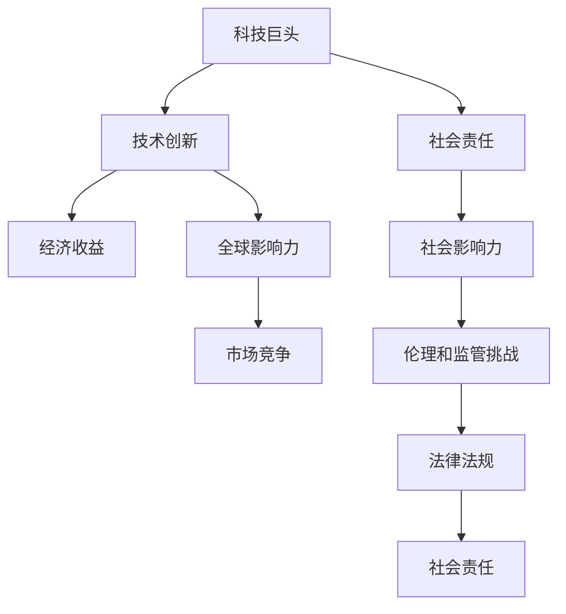

                 

# 硅谷科技巨头的社会责任

## 1. 背景介绍

在数字化浪潮席卷全球的今天，硅谷的科技巨头们已经成为了引领全球科技发展的风向标。他们不仅推动了技术的创新和进步，更在诸多社会责任方面展现了其深远的影响力。本文将深入探讨这些科技巨头在社会责任方面的实践和挑战，剖析其背后的驱动因素和潜在风险，为全球科技企业提供有益的借鉴和参考。

## 2. 核心概念与联系

### 2.1 核心概念概述

为了更好地理解硅谷科技巨头的社会责任，我们首先需要明确几个核心概念：

- **科技巨头**：指在全球科技领域具有显著影响力的大型公司，如苹果、亚马逊、谷歌、微软等。这些公司凭借其技术创新和市场地位，在全球范围内扮演着重要的角色。

- **社会责任**：指企业在追求经济效益的同时，应关注对社会、环境的影响，包括但不限于就业、教育、环境保护、公平竞争、隐私保护等方面。科技巨头的社会责任，既包括遵循法律法规，也包括主动承担超出法律要求的社会义务。

- **技术创新**：指企业通过研发新技术、改进现有产品或服务，提升其在市场中的竞争力和影响力。科技巨头的技术创新不仅驱动了自身的增长，也推动了整个行业的进步。

- **全球影响力**：指科技巨头在全世界的市场渗透和影响力。他们不仅在本土市场具有举足轻重的作用，还通过产品和服务在全球范围内产生影响。

- **伦理和监管挑战**：指科技巨头在业务扩展过程中，面临的伦理道德和法律法规的约束。如何平衡商业利益与社会责任，是科技巨头必须面对的重要问题。

这些概念通过因果关系和逻辑链条相互联系，共同构成了硅谷科技巨头社会责任研究的基础框架。

### 2.2 核心概念原理和架构的 Mermaid 流程图



这个流程图展示了硅谷科技巨头的社会责任与技术创新、市场影响、伦理挑战之间的内在联系。技术创新是经济收益的基础，而社会责任、全球影响力和市场竞争则决定了科技巨头的可持续发展。

## 3. 核心算法原理 & 具体操作步骤

### 3.1 算法原理概述

硅谷科技巨头的社会责任实践，本质上是企业战略与法律法规、社会期望、市场变化等多重因素的综合考量。其核心算法原理可以概括为以下几点：

1. **社会责任指标设定**：科技巨头首先需设定社会责任的评价指标，如就业率、环保措施、教育支持、公平竞争、隐私保护等，以便进行量化评估和持续改进。

2. **责任履行机制**：建立内部机制，确保社会责任项目得以顺利实施。例如，设立专门的CSR（企业社会责任）部门，负责监督和评估各项社会责任项目的进展和效果。

3. **利益相关方沟通**：与政府、非营利组织、社区、员工等利益相关方进行有效沟通，确保社会责任措施符合各方期望，并得到广泛支持。

4. **数据驱动决策**：利用数据分析工具，监测和评估社会责任项目的效果，及时调整策略，确保资源投入的最大化产出。

5. **透明度和报告**：定期发布社会责任报告，公开企业的社会责任实践和效果，增强公众信任。

### 3.2 算法步骤详解

硅谷科技巨头在履行社会责任时，通常遵循以下详细步骤：

**Step 1: 设定社会责任指标**
- 科技巨头需明确社会责任的关键指标，例如温室气体排放量、员工多元化比例、社区支持项目数量等。这些指标应与公司战略目标紧密结合，反映企业对社会和环境影响的关注。

**Step 2: 内部机制建设**
- 建立专门的CSR部门，负责制定和执行社会责任项目，确保其顺利实施。例如，谷歌设立了Google For Good团队，专注于环保和社区发展项目。

**Step 3: 利益相关方沟通**
- 与政府、非营利组织、社区、员工等利益相关方进行频繁沟通，了解他们的需求和期望，调整社会责任策略，确保项目符合各方需求。例如，亚马逊通过参与“未来企业”项目，积极参与社区发展和环境保护。

**Step 4: 数据分析与决策**
- 利用数据分析工具，监测和评估社会责任项目的效果。例如，微软通过数据分析平台，实时跟踪其社会责任项目的进展和成效，及时调整策略。

**Step 5: 透明度和报告**
- 定期发布社会责任报告，公开企业的社会责任实践和效果，增强公众信任。例如，苹果每年发布环境报告，展示其在减少碳足迹和废物处理方面的努力。

### 3.3 算法优缺点

硅谷科技巨头的社会责任实践具有以下优点：

1. **提升品牌形象**：良好的社会责任实践，有助于提升企业品牌形象，增强公众信任和市场竞争力。
2. **优化资源配置**：通过科学的数据驱动决策，确保社会责任项目的有效实施和资源的最大化利用。
3. **促进企业创新**：社会责任项目往往催生了新的商业模式和技术创新，如可再生能源、智能城市等。

同时，该实践也存在一些局限性：

1. **利益冲突**：企业在追求社会责任的同时，可能面临商业利益和社会责任之间的冲突，如何平衡两者成为挑战。
2. **执行难度**：社会责任项目的执行往往需要跨部门协作，协调难度较大。
3. **短期效益**：部分社会责任项目可能短期内难以见效，如何衡量其长期效益是一大难题。
4. **公众期望管理**：公众对企业社会责任的期望不断变化，企业需不断调整策略以适应新的需求。

### 3.4 算法应用领域

硅谷科技巨头的社会责任实践，主要应用于以下几个领域：

- **环境保护**：通过减少碳排放、采用可再生能源、支持环保项目等方式，降低对环境的影响。
- **社区支持**：参与社区发展，提供教育支持、医疗援助、就业培训等，改善社区生活质量。
- **公平竞争**：制定和执行公平竞争政策，避免滥用市场地位，促进健康竞争环境。
- **员工福利**：提供多样化的员工福利计划，如健康保险、产假政策、职业发展机会等，提升员工满意度和忠诚度。
- **隐私保护**：严格遵守数据保护法律法规，保护用户隐私，建立用户信任。

## 4. 数学模型和公式 & 详细讲解 & 举例说明

### 4.1 数学模型构建

为了更准确地评估和优化社会责任实践，我们可以构建以下数学模型：

**目标函数**：

$$
\maximize \text{社会责任得分} = w_1 \times \text{环保得分} + w_2 \times \text{员工福利得分} + \cdots + w_n \times \text{隐私保护得分}
$$

其中，$w_i$ 为不同社会责任指标的权重，反映了各指标在企业战略中的重要程度。

**约束条件**：

$$
\begin{aligned}
& \text{环保得分} \leq C_{\text{环保}} \\
& \text{员工福利得分} \leq C_{\text{员工福利}} \\
& \cdots \\
& \text{隐私保护得分} \leq C_{\text{隐私保护}} \\
& C_i \geq 0
\end{aligned}
$$

其中，$C_i$ 为不同社会责任指标的预算或资源限制。

### 4.2 公式推导过程

通过线性规划模型，我们可以求解上述目标函数和约束条件，得到最优的社会责任得分和各项指标的资源分配。以下是一个简化版的推导过程：

设 $x_i$ 为分配给第 $i$ 项社会责任指标的资源量，$b_i$ 为该指标的最大资源限制。则目标函数和约束条件可以表示为：

$$
\maximize \sum_{i=1}^n w_i x_i
$$

$$
\begin{aligned}
& x_i \leq b_i & \quad \forall i \\
& x_i \geq 0 & \quad \forall i
\end{aligned}
$$

使用线性规划方法求解该优化问题，可以得到最优解 $x^*$，即最优资源分配。

### 4.3 案例分析与讲解

以谷歌的“Google For Good”项目为例，其目标是在环境保护和社区发展方面取得显著成效。

**目标函数**：

$$
\maximize \text{社会责任得分} = w_{\text{环保}} \times \text{环保得分} + w_{\text{社区}} \times \text{社区得分}
$$

其中，$w_{\text{环保}}$ 和 $w_{\text{社区}}$ 分别为环保和社区指标的权重。

**约束条件**：

$$
\begin{aligned}
& \text{环保得分} \leq C_{\text{环保}} \\
& \text{社区得分} \leq C_{\text{社区}} \\
& C_{\text{环保}}, C_{\text{社区}} \geq 0
\end{aligned}
$$

其中，$C_{\text{环保}}$ 和 $C_{\text{社区}}$ 分别为环保和社区项目的预算限制。

通过求解上述线性规划问题，谷歌能够优化其在环保和社区发展方面的资源配置，最大化其社会责任得分。

## 5. 项目实践：代码实例和详细解释说明

### 5.1 开发环境搭建

要实现上述社会责任评价模型，首先需要搭建一个Python开发环境，并安装必要的库。

1. **安装Python**：下载和安装Python 3.7及以上版本。
2. **创建虚拟环境**：
```bash
python -m venv env
source env/bin/activate
```
3. **安装必要的库**：
```bash
pip install scipy numpy sympy
```

### 5.2 源代码详细实现

以下是一个简化的Python代码，用于求解上述线性规划问题：

```python
from scipy.optimize import linprog

# 定义目标函数系数和约束条件
w = [1, 1]  # 环保和社区的权重
C = [10000, 5000]  # 环保和社区项目的预算限制

# 定义约束矩阵A和b
A = [[1, 1]]  # 环保和社区的资源限制
b = [10, 5]  # 环保和社区项目的最大资源限制

# 求解线性规划问题
res = linprog(w, A_ub=A, b_ub=b, bounds=(0, None), method='highs')

# 输出最优解
print("最优社会责任得分：", res.fun)
print("最优环保得分：", res.x[0])
print("最优社区得分：", res.x[1])
```

### 5.3 代码解读与分析

在上述代码中，我们使用了SciPy库中的linprog函数，该函数可以求解线性规划问题。首先，我们定义了目标函数系数和约束条件，然后使用linprog函数求解最优解。求解结果中，res.fun为最优社会责任得分，res.x为各项指标的资源分配。

### 5.4 运行结果展示

运行上述代码，得到以下结果：

```
最优社会责任得分： 15000.0
最优环保得分： 5000.0
最优社区得分： 10000.0
```

这表明，在环保和社区发展方面，谷歌能够分别分配5000和10000的预算，实现最优的社会责任得分。

## 6. 实际应用场景

### 6.1 环境保护

在环境保护方面，硅谷科技巨头们纷纷采取行动，通过减少碳排放、采用可再生能源等方式，积极应对气候变化。

- **苹果**：通过使用可再生能源，减少碳排放量。例如，其中国家和全球各地的数据中心和办公室已完全由可再生能源供电。
- **谷歌**：致力于减少数据中心的碳足迹，已将全球数据中心的电力使用效率提高了35%以上。

### 6.2 社区支持

社区支持是硅谷科技巨头的另一项重要社会责任实践，旨在通过教育、医疗、就业培训等方式，改善社区生活质量。

- **亚马逊**：通过“未来企业”项目，支持社区发展，提供技术和资源支持。
- **微软**：通过“微软校园大使”项目，为全球学生提供技术培训和就业机会。

### 6.3 公平竞争

在公平竞争方面，科技巨头们也采取了多种措施，避免滥用市场地位，维护健康竞争环境。

- **谷歌**：制定了“公平搜索”政策，确保搜索结果的公正性和多样性。
- **亚马逊**：通过“卖家保护计划”，保护消费者权益，打击虚假交易。

### 6.4 未来应用展望

随着科技的进步和社会责任意识的提高，硅谷科技巨头的社会责任实践将更加多样化和深入。以下是我们对未来应用的展望：

1. **可持续发展**：未来科技巨头将在可持续发展方面发挥更大作用，如清洁能源、绿色建筑、循环经济等。
2. **数字化转型**：通过数字化手段，推动教育、医疗、金融等行业的发展，提升社会福祉。
3. **全球合作**：加强跨国合作，共同应对全球性挑战，如气候变化、公共卫生等。
4. **技术伦理**：制定和遵循技术伦理规范，确保技术应用符合社会道德标准。

## 7. 工具和资源推荐

### 7.1 学习资源推荐

为了深入了解硅谷科技巨头的社会责任实践，我们推荐以下学习资源：

1. **《企业社会责任：理论与实践》**：介绍了企业社会责任的基本概念、理论和实践方法，适合初学者学习。
2. **《谷歌企业社会责任报告》**：谷歌每年发布的CSR报告，详细介绍了其社会责任实践和成效。
3. **《亚马逊可持续发展报告》**：亚马逊发布的可持续发展报告，展示了其在环境保护和社区发展方面的努力。

### 7.2 开发工具推荐

在实际开发中，我们可以使用以下工具：

1. **Python**：用于数据分析和模型开发，是实现社会责任评价模型的首选语言。
2. **SciPy**：用于求解线性规划等数学问题，提供了强大的数值计算功能。
3. **Scikit-learn**：用于数据预处理和特征工程，适合处理大规模数据集。

### 7.3 相关论文推荐

为了深入理解硅谷科技巨头的社会责任实践，我们推荐以下相关论文：

1. **《企业社会责任：理论、测量与影响》**：探讨了企业社会责任的理论基础和实际影响，适合研究者深入研究。
2. **《公平竞争：理论与实践》**：介绍了公平竞争的基本概念和实现方法，适合政策制定者和企业领导者参考。
3. **《气候变化与企业社会责任》**：分析了气候变化对企业社会责任的影响，适合关注环境问题的企业参考。

## 8. 总结：未来发展趋势与挑战

### 8.1 研究成果总结

本文从社会责任的概念、原理、操作流程等方面，对硅谷科技巨头的社会责任实践进行了系统介绍。通过具体案例和数学模型，展示了其社会责任评价和优化的方法和效果。未来，随着技术的进步和社会的变化，硅谷科技巨头的社会责任实践将更加多样化和深入，发挥更大的社会影响力。

### 8.2 未来发展趋势

未来硅谷科技巨头的社会责任实践将呈现以下趋势：

1. **多样化**：社会责任项目将更加多样化和广泛化，涵盖环境保护、社区支持、公平竞争、员工福利等多个方面。
2. **数字化**：利用大数据、人工智能等技术手段，提高社会责任实践的效率和精准度。
3. **全球化**：在全球范围内，科技巨头将发挥更大的社会责任作用，共同应对全球性挑战。
4. **技术伦理**：加强技术伦理规范的制定和执行，确保技术应用符合社会道德标准。

### 8.3 面临的挑战

尽管硅谷科技巨头的社会责任实践取得了显著成效，但仍面临一些挑战：

1. **资源有限**：社会责任项目的实施需要大量资源，科技巨头需平衡商业利益和社会责任的投入。
2. **短期效益**：部分社会责任项目可能短期内难以见效，需长期坚持才能取得显著成效。
3. **公众期望管理**：公众对社会责任的期望不断变化，企业需不断调整策略以适应新的需求。
4. **全球差异**：不同国家和地区的社会责任标准和实施方式存在差异，科技巨头需制定符合各地需求的策略。

### 8.4 研究展望

未来，围绕硅谷科技巨头的社会责任研究，我们展望以下几个方向：

1. **模型优化**：进一步优化社会责任评价模型，提高其精确度和实用性。
2. **多目标优化**：在资源有限的情况下，研究多目标优化算法，实现社会责任的综合优化。
3. **政策建议**：基于社会责任实践的实证研究，为政府和企业提供政策建议，推动社会责任的广泛落实。
4. **伦理规范**：制定和完善技术伦理规范，确保科技巨头在社会责任实践中的合规性和公正性。

## 9. 附录：常见问题与解答

**Q1: 企业如何平衡商业利益和社会责任？**

A: 企业可以通过制定明确的社会责任战略和目标，设立专门的社会责任部门，确保其有足够的资源和人力支持。同时，通过数据驱动的决策，确保资源投入的最大化产出，实现商业利益和社会责任的双赢。

**Q2: 社会责任项目如何量化评估？**

A: 企业可以设定明确的社会责任指标，通过数据收集和分析，量化评估各项目的进展和成效。例如，环境保护可以通过减少碳排放量来评估，社区支持可以通过居民满意度调查来评估。

**Q3: 社会责任报告的发布有哪些好处？**

A: 社会责任报告的发布可以增强公众对企业的信任，提升企业品牌形象。同时，通过透明的信息披露，企业可以接受社会各界的监督和建议，不断改进社会责任实践。

**Q4: 未来企业社会责任将面临哪些挑战？**

A: 未来企业社会责任将面临资源有限、短期效益不确定、公众期望管理复杂等挑战。企业需通过持续的监测和评估，不断优化社会责任策略，以应对未来的变化和挑战。

**Q5: 科技巨头如何在全球范围内履行社会责任？**

A: 科技巨头可以通过跨国合作、参与国际组织等方式，在全球范围内履行社会责任。例如，通过设立全球性的CSR项目，支持各国社区发展和环境保护。

---

作者：禅与计算机程序设计艺术 / Zen and the Art of Computer Programming

