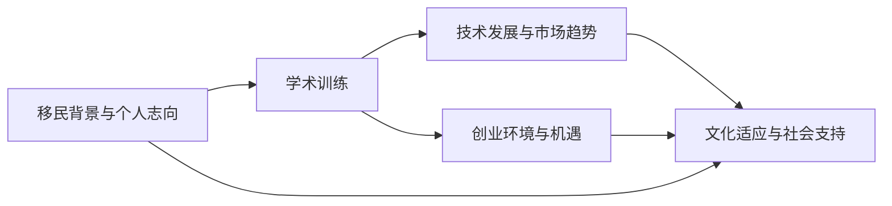

                 

## 1. 背景介绍

硅谷，全球科技创新和创业的圣地，吸引着全球各地的科技人才。来自中国的张伟（化名），正是怀揣着对技术的无限热情和创新梦想，踏上这片充满机遇的土地。

张伟毕业于国内顶尖大学计算机专业，本科阶段对数据结构和算法有着浓厚的兴趣，并曾参与多个开源项目，积累了丰富的实战经验。然而，对于人工智能(AI)领域的无限好奇，驱使他决定出国深造。

在经历了紧张激烈的申请过程后，张伟获得了美国知名大学的计算机科学硕士学位。初到美国，他面临语言、文化、社会环境的巨大挑战，但他决心克服这些困难，致力于探索AI前沿技术的广阔天地。

## 2. 核心概念与联系

### 2.1 核心概念概述

硅谷移民故事，不仅是一个个个体拼搏奋斗的历程，更是科技创新与创业精神的生动体现。在这一过程中，涉及到的核心概念和联系主要包括：

- **移民背景与个人志向**：张伟的留学背景、学术训练和创新热情，构成了他追梦的基础。
- **创业环境与机遇**：硅谷的创新生态系统、风险投资环境、初创公司文化和人才集聚，为张伟提供了展示才华的舞台。
- **技术发展与市场趋势**：AI技术的发展、市场需求的变化，推动了张伟从学术研究到创业实践的转变。
- **文化适应与社会支持**：张伟在异国他乡的适应过程，以及在面对社会挑战时的坚韧与乐观，是创业故事中的重要环节。

这些概念之间相互联系，共同构成了硅谷移民创业者面临的挑战与机遇。通过理解这些核心概念，可以更好地把握硅谷移民故事的内在逻辑和启示。

### 2.2 核心概念原理和架构的 Mermaid 流程图



## 3. 核心算法原理 & 具体操作步骤

### 3.1 算法原理概述

张伟在硅谷的创业之路，可以类比为一个动态优化的过程，涉及多个算法和策略的结合。核心算法原理主要包括以下几个方面：

- **数据驱动决策**：通过收集市场数据、用户反馈和技术趋势，制定有效的创业策略。
- **算法模型优化**：利用机器学习算法优化产品和服务，提升用户体验和商业价值。
- **持续创新**：不断引入新技术，改进现有算法，保持产品和服务的竞争优势。

### 3.2 算法步骤详解

**步骤1：市场分析与策略制定**

张伟到硅谷后，首先通过市场调研了解当前AI技术的发展趋势和市场需求。他利用各种数据分析工具和算法模型，对数据进行清洗、分析和可视化，制定了详细的创业策略。

**步骤2：技术选型与产品设计**

根据策略，张伟确定了技术选型，选择了适当的编程语言和开发框架，并设计了产品的初步原型。他使用了多种开源工具和库，如TensorFlow、PyTorch、Flask等，快速构建了AI应用的基础架构。

**步骤3：算法模型训练与优化**

在产品设计阶段，张伟集中精力开发和优化算法模型。他利用大规模数据集训练深度学习模型，并通过交叉验证和超参数调优，不断提高模型的准确率和泛化能力。

**步骤4：原型测试与迭代改进**

张伟将初步的产品原型提交给早期用户测试，收集用户反馈，对产品进行迭代改进。通过多次迭代，不断优化用户体验，提升产品的实用性和市场竞争力。

**步骤5：市场推广与用户获取**

在产品迭代完善后，张伟开始进行市场推广和用户获取。他利用SEO、社交媒体、邮件营销等手段，提高产品知名度，吸引首批用户。

**步骤6：商业化运作与持续发展**

随着产品逐渐被市场认可，张伟开始思考如何商业化运作。他制定了合理的定价策略，建立了用户反馈和数据收集系统，持续优化产品，并探索新的收入来源，如广告、订阅等。

### 3.3 算法优缺点

**优点：**

- **数据驱动**：通过市场数据分析，制定科学的创业策略，降低失败风险。
- **算法优化**：利用先进算法模型，提升产品性能和用户体验。
- **持续创新**：通过不断引入新技术，保持产品和服务的领先地位。

**缺点：**

- **数据依赖**：过于依赖市场数据，可能忽略用户需求的深层次变化。
- **模型复杂度**：算法模型过于复杂，可能影响开发效率和产品迭代速度。
- **市场变化**：市场和技术环境变化迅速，需要快速适应和调整策略。

### 3.4 算法应用领域

硅谷移民创业者在各个领域都有所涉猎，主要集中在以下几个方向：

- **人工智能**：利用AI技术开发智能推荐系统、图像识别、自然语言处理等应用。
- **区块链**：利用区块链技术构建去中心化应用、智能合约等。
- **金融科技**：开发支付系统、风险管理、金融分析等金融科技产品。
- **健康科技**：开发健康监测、远程医疗、电子病历等健康科技应用。
- **可持续发展**：利用AI和区块链技术，解决环境保护、能源管理等可持续发展问题。

## 4. 数学模型和公式 & 详细讲解 & 举例说明

### 4.1 数学模型构建

在创业过程中，张伟使用了多种数学模型和算法来支持决策。例如，在市场分析阶段，他使用了回归分析模型来预测市场需求和用户增长趋势。在产品优化阶段，他使用了梯度下降算法优化深度学习模型。

### 4.2 公式推导过程

以回归分析模型为例，其基本公式为：

$$y = \theta_0 + \theta_1 x_1 + \theta_2 x_2 + \ldots + \theta_n x_n$$

其中 $y$ 为目标变量，$x_i$ 为自变量，$\theta_i$ 为回归系数。

在模型训练阶段，通过最小化均方误差损失函数，进行梯度下降更新，得到最优回归系数：

$$\theta = (X^T X)^{-1} X^T y$$

其中 $X$ 为自变量矩阵，$y$ 为因变量向量。

### 4.3 案例分析与讲解

张伟曾利用回归分析模型预测某AI应用的市场需求。他收集了过去一年的用户增长数据，以及相关市场调研数据，构建了自变量向量 $X$ 和因变量向量 $y$。通过训练回归模型，得出了用户增长与市场趋势的相关关系，并据此制定了市场推广策略。

## 5. 项目实践：代码实例和详细解释说明

### 5.1 开发环境搭建

为支持张伟的创业项目，硅谷提供了丰富的技术资源和工具。以下是常用的开发环境搭建步骤：

1. **安装编程工具**：如Python、R、MATLAB等，方便使用各种编程语言。
2. **安装开发库**：如TensorFlow、PyTorch、NumPy、SciPy等，提供强大的计算和分析功能。
3. **配置开发环境**：如设置虚拟环境、编译器、库路径等，确保开发环境的稳定性。
4. **版本控制**：使用Git进行版本控制，方便协同开发和代码管理。

### 5.2 源代码详细实现

以下是张伟用于市场分析的Python代码示例：

```python
import pandas as pd
from sklearn.linear_model import LinearRegression
from sklearn.metrics import mean_squared_error

# 加载数据
data = pd.read_csv('market_data.csv')

# 定义自变量和因变量
X = data[['user_growth_rate', 'market_size', 'competition_level']]
y = data['expected_revenue']

# 创建线性回归模型
model = LinearRegression()

# 训练模型
model.fit(X, y)

# 预测新数据
new_data = pd.DataFrame({
    'user_growth_rate': [10],
    'market_size': [1000],
    'competition_level': [5]
})
predicted_revenue = model.predict(new_data)

# 输出预测结果
print('Predicted revenue:', predicted_revenue)
```

### 5.3 代码解读与分析

在上述代码中，首先使用Pandas库加载市场数据，提取自变量和因变量。然后创建线性回归模型，并使用sklearn库进行训练。最后使用模型对新数据进行预测，并输出预测结果。

代码中关键部分包括：

- **数据加载**：使用Pandas的read_csv函数加载市场数据，并提取相关特征。
- **模型训练**：创建线性回归模型，并使用fit函数进行训练。
- **数据预测**：使用predict函数对新数据进行预测，并输出结果。

## 6. 实际应用场景

### 6.1 智能推荐系统

张伟的初创公司开发了一个智能推荐系统，帮助用户发现和购买最相关的产品。系统通过分析用户的历史行为数据和产品属性，利用机器学习算法推荐商品，提升用户体验和销售额。

### 6.2 健康监测应用

另一个重要应用场景是健康监测应用。张伟团队开发了一款智能手表应用，通过分析用户的心率、步数、睡眠等生理数据，预测健康风险，并提出相应的健康建议。

### 6.3 金融风险管理

在金融领域，张伟的团队开发了一套基于AI的风险管理系统，通过分析用户信用记录和交易行为，预测贷款违约风险，并给出相应的风险预警和建议。

### 6.4 未来应用展望

未来，张伟希望进一步拓展AI技术的应用领域，如智能合约、去中心化应用、区块链等。他计划通过跨学科研究，整合多种技术，开发更智能、更高效的产品和服务。

## 7. 工具和资源推荐

### 7.1 学习资源推荐

- **在线课程**：Coursera、edX、Udacity等平台提供众多AI和计算机科学课程，涵盖从入门到高级的内容。
- **技术博客**：Medium、Towards Data Science等平台有大量的技术文章和实践案例，适合学习前沿技术。
- **书籍**：《深度学习》、《机器学习实战》等经典书籍，是系统学习AI技术的重要参考。

### 7.2 开发工具推荐

- **编程语言**：Python、R、MATLAB等常用编程语言，适合不同的应用场景。
- **开发框架**：TensorFlow、PyTorch、Flask等框架，提供强大的计算和开发能力。
- **数据分析工具**：Pandas、NumPy、SciPy等工具，用于数据处理和分析。
- **版本控制**：Git和GitHub，提供版本管理和协作开发支持。

### 7.3 相关论文推荐

- **回归分析**："Linear Regression: A Simple Yet Powerful Machine Learning Algorithm"。
- **深度学习**："Deep Learning" by Ian Goodfellow、Yoshua Bengio 和 Aaron Courville。
- **区块链**："Blockchain Revolution: How the Technology Behind Bitcoin Is Changing Money, Business, and the World"。

## 8. 总结：未来发展趋势与挑战

### 8.1 研究成果总结

通过张伟的硅谷创业故事，我们可以看到AI技术在各个领域的应用潜力和创新空间。数据分析、算法优化、持续创新等关键环节，共同构成了成功创业的基础。

### 8.2 未来发展趋势

未来，AI技术将更加普及和深入，推动各行业数字化转型。以下趋势值得关注：

- **AI与物联网**：AI技术与物联网的结合，将带来智能家居、智慧城市等新型应用。
- **AI与医疗**：AI在医学影像分析、个性化医疗等领域的应用，将提升医疗服务的质量和效率。
- **AI与教育**：AI在在线教育、智能辅导、个性化学习等方面的应用，将改变传统教育模式。
- **AI与金融**：AI在金融风险管理、智能投顾、量化交易等方面的应用，将提升金融服务的智能化水平。

### 8.3 面临的挑战

尽管AI技术的发展带来了巨大机遇，但也面临诸多挑战：

- **数据隐私和安全**：如何在保护用户隐私的同时，充分利用数据进行AI训练和应用。
- **伦理和社会影响**：AI技术的广泛应用，需要考虑伦理和社会影响，避免误用和滥用。
- **技术门槛**：AI技术的复杂性和高门槛，限制了其普及和应用。
- **算力与成本**：大规模AI训练和应用需要大量算力和资源，增加了成本负担。

### 8.4 研究展望

未来，AI技术的研究和应用将更加注重以下几个方面：

- **跨学科研究**：AI与医疗、金融、教育等多个领域的交叉融合，将催生更多创新应用。
- **可解释性和透明性**：提高AI系统的可解释性和透明性，增强用户信任和接受度。
- **公平性和偏见消除**：消除算法偏见，确保AI系统公平对待所有用户。
- **可持续发展**：利用AI技术，解决环境保护、资源管理等可持续发展问题。

## 9. 附录：常见问题与解答

**Q1：硅谷的创业环境有哪些特点？**

A: 硅谷的创业环境具有以下几个特点：

- **技术集聚**：硅谷汇聚了全球顶尖的技术人才，创新氛围浓厚。
- **风险投资**：丰富的风险投资资源，为初创公司提供资金支持。
- **创业文化**：鼓励创新、容忍失败的文化，为创业者提供广阔的发展空间。
- **创业生态**：完整的创业生态系统，包括孵化器、加速器、创新实验室等，提供全方位的支持。

**Q2：如何评估AI创业项目的潜在价值？**

A: 评估AI创业项目的潜在价值，主要考虑以下几个方面：

- **技术成熟度**：评估技术的先进性和可行性。
- **市场需求**：分析目标市场的需求和潜在用户群体。
- **竞争态势**：评估竞争对手的市场份额和技术优势。
- **商业模型**：评估商业模式和收入来源的可行性。
- **团队能力**：评估团队的技术和市场能力。

**Q3：AI创业项目在融资过程中需要注意哪些问题？**

A: AI创业项目在融资过程中需要注意以下几个问题：

- **商业计划书**：制定详细的商业计划书，清晰描述项目的市场机会、技术优势和商业模型。
- **团队背景**：展示团队成员的技术能力和市场经验，增强投资者的信心。
- **数据验证**：提供实际数据和实验结果，证明项目的可行性和潜力。
- **风险管理**：明确风险评估和管理策略，提高投资者的安全感。
- **财务模型**：制定合理的财务模型，展示项目的收入预期和成本控制。

**Q4：如何提升AI系统的可解释性和透明性？**

A: 提升AI系统的可解释性和透明性，主要通过以下几个方法：

- **可视化**：使用可视化工具展示AI系统的内部逻辑和决策过程。
- **模型解释**：利用解释模型(如LIME、SHAP等)，解释AI系统的预测结果。
- **知识图谱**：构建知识图谱，帮助理解AI系统的知识结构和推理过程。
- **用户反馈**：收集用户反馈，不断优化和改进AI系统。

**Q5：如何应对AI技术的伦理和社会影响？**

A: 应对AI技术的伦理和社会影响，主要通过以下几个方法：

- **伦理审查**：在开发过程中，进行伦理审查和评估，确保技术符合伦理标准。
- **透明度**：提高AI系统的透明度，增强用户信任。
- **用户保护**：保护用户隐私和数据安全，避免滥用和误用。
- **责任机制**：建立责任机制，明确AI系统的责任归属和风险承担。

---

作者：禅与计算机程序设计艺术 / Zen and the Art of Computer Programming

