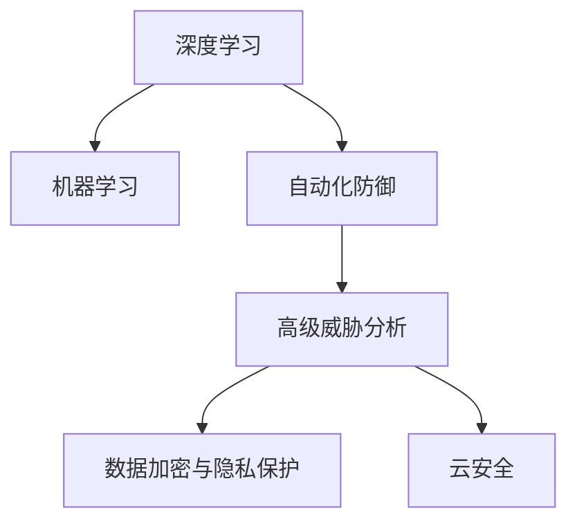

                 

# 硅谷网络安全新技术的发展方向

> 关键词：网络安全、AI技术、机器学习、深度学习、数据加密、隐私保护、自动化防御、高级威胁分析

## 1. 背景介绍

### 1.1 问题由来
随着互联网和数字化技术的迅猛发展，网络安全问题也愈发复杂和多样化。各类网络攻击手段层出不穷，传统的网络防御系统已经无法有效应对日益增长的安全威胁。硅谷作为全球高科技创新的中心，对于网络安全新技术的探索和应用始终走在前沿。本文将重点探讨硅谷网络安全领域的新技术发展方向，旨在为读者提供有价值的参考和指导。

### 1.2 问题核心关键点
网络安全技术的发展，一直伴随着网络攻击手段的升级和演化。以下是当前网络安全领域的关键技术点：

- **深度学习与机器学习**：通过训练深度学习模型，提升威胁检测、入侵防御和异常行为检测的能力。
- **自动化防御系统**：利用AI技术实现自动化的威胁检测和响应，减少人力成本。
- **高级威胁分析**：运用数据分析和行为分析技术，识别复杂的高级持续性威胁(APT)和零日攻击。
- **数据加密与隐私保护**：利用先进的加密技术和隐私保护算法，确保数据传输和存储的安全。
- **云安全**：结合云计算和分布式计算，构建更加高效、灵活的安全防护体系。

### 1.3 问题研究意义
随着网络攻击技术的不断进步，传统的网络安全防御手段显得越来越落后。如何利用前沿的AI技术和自动化方法，构建更加智能、高效、动态的安全防护体系，成为了硅谷乃至全球网络安全领域的研究热点。

本文聚焦于网络安全新技术的发展方向，期望通过深入分析当前网络安全领域的关键技术趋势，为读者提供技术参考和实践指导。

## 2. 核心概念与联系

### 2.1 核心概念概述

为更好地理解硅谷网络安全新技术，本节将介绍几个密切相关的核心概念：

- **深度学习**：一种基于神经网络的机器学习技术，能够处理复杂的非线性关系，广泛应用于图像、语音、自然语言处理等领域。
- **机器学习**：通过训练模型，让计算机从数据中学习规律，自动完成某些任务。
- **自动化防御系统**：使用AI技术自动监控、分析和响应网络威胁，提升防御效率。
- **高级威胁分析**：利用行为分析和数据挖掘技术，识别和分析高级持续性威胁(APT)等复杂攻击。
- **数据加密与隐私保护**：通过加密技术和隐私保护算法，确保数据的安全性和隐私性。
- **云安全**：利用云计算平台提供的安全服务，构建分布式、弹性的安全防护体系。

这些概念之间的逻辑关系可以通过以下Mermaid流程图来展示：



这个流程图展示了大规模网络安全技术的核心概念及其之间的关系：

1. 深度学习和机器学习为安全防御提供算法支持。
2. 自动化防御系统将AI技术应用于实际安全运营中，提升防御效果。
3. 高级威胁分析帮助识别复杂的攻击模式，进行精准防御。
4. 数据加密和隐私保护是数据安全的基础，确保数据在传输和存储过程中的安全。
5. 云安全结合分布式计算，提供更高效、灵活的安全防护体系。

## 3. 核心算法原理 & 具体操作步骤

### 3.1 算法原理概述

硅谷网络安全新技术的核心算法原理主要集中在以下几个方面：

- **深度学习与机器学习**：利用深度神经网络模型，训练出能够识别网络威胁和异常行为的模型，用于威胁检测和防御。
- **自动化防御系统**：通过构建智能算法模型，实现自动化的威胁监控和响应，提升防御效率。
- **高级威胁分析**：运用数据分析和行为分析技术，深入挖掘攻击特征和攻击模式，识别和应对复杂攻击。
- **数据加密与隐私保护**：采用先进的加密技术和隐私保护算法，确保数据传输和存储的安全。
- **云安全**：结合云平台的安全服务，构建分布式、弹性的安全防护体系。

### 3.2 算法步骤详解

以下是基于深度学习和机器学习的硅谷网络安全新技术的具体操作步骤：

1. **数据准备**：收集历史网络流量数据、日志数据和威胁情报数据，作为训练深度学习模型的数据源。
2. **模型训练**：使用训练数据集训练深度神经网络模型，生成威胁检测和异常行为检测模型。
3. **模型部署**：将训练好的模型部署到网络中，实时监控和分析网络流量和日志数据。
4. **威胁响应**：根据模型分析结果，自动触发威胁响应机制，如隔离、封禁、告警等。
5. **持续优化**：利用新收集的数据不断优化模型参数，提高模型的准确率和鲁棒性。

### 3.3 算法优缺点

硅谷网络安全新技术在提升网络防御能力的同时，也存在一些局限性：

**优点**：
- **高效率**：通过自动化和智能化手段，显著提高了威胁检测和响应的速度和准确性。
- **自适应**：模型能够不断学习和优化，适应不断变化的网络威胁环境。
- **灵活性**：结合云安全技术，构建弹性的安全防护体系，适应大规模、分布式的应用场景。

**缺点**：
- **复杂性**：深度学习和机器学习模型的训练和调优过程复杂，需要专业知识。
- **成本高**：高质量的训练数据和高性能计算资源对大模型的训练至关重要，成本较高。
- **可解释性不足**：模型决策过程的透明度不足，难以解释模型的推理逻辑。
- **数据依赖**：模型的效果很大程度上依赖于训练数据的数量和质量，数据获取难度大。

### 3.4 算法应用领域

硅谷网络安全新技术在多个领域都有广泛的应用，包括：

- **企业网络安全**：利用深度学习模型进行威胁检测和行为分析，提升企业内网安全防护能力。
- **政府网络安全**：通过高级威胁分析技术，识别和防范针对政府网络的高级攻击。
- **金融机构网络安全**：结合数据加密和隐私保护技术，保障金融数据的安全性和隐私性。
- **互联网应用安全**：通过自动化防御系统，提高互联网应用的稳定性和安全性。
- **物联网设备安全**：利用云安全技术，构建物联网设备的分布式安全防护体系。

## 4. 数学模型和公式 & 详细讲解 & 举例说明

### 4.1 数学模型构建

为了更深入地理解硅谷网络安全新技术的原理，下面将介绍几个关键数学模型：

1. **深度神经网络模型**：
   $$
   y = \sigma(\mathbf{W} \cdot \mathbf{x} + b)
   $$
   其中，$y$ 为输出，$\sigma$ 为激活函数，$\mathbf{W}$ 为权重矩阵，$\mathbf{x}$ 为输入，$b$ 为偏置项。

2. **卷积神经网络模型**：
   $$
   y = \sigma(\sum_{i=1}^{k} \mathbf{W}_i \cdot \mathbf{F}_i + b)
   $$
   其中，$\mathbf{F}_i$ 为特征图，$\mathbf{W}_i$ 为卷积核。

3. **支持向量机模型**：
   $$
   \min_{\mathbf{w}, \rho} \frac{1}{2}\|\mathbf{w}\|^2 + \rho
   $$
   其中，$\mathbf{w}$ 为权重向量，$\rho$ 为松弛变量。

### 4.2 公式推导过程

- **深度神经网络模型的训练过程**：
  1. 输入样本 $\mathbf{x}$。
  2. 前向传播计算输出 $\hat{y}$。
  3. 计算损失函数 $L(\hat{y},y)$。
  4. 反向传播更新权重 $\mathbf{W}$ 和偏置 $b$。
  
- **卷积神经网络模型的训练过程**：
  1. 输入样本 $\mathbf{x}$。
  2. 卷积层提取特征 $\mathbf{F}$。
  3. 池化层降维 $\mathbf{F'}$。
  4. 全连接层输出 $\hat{y}$。
  5. 计算损失函数 $L(\hat{y},y)$。
  6. 反向传播更新权重 $\mathbf{W}$ 和卷积核 $\mathbf{F}$。

- **支持向量机模型的训练过程**：
  1. 收集训练样本 $\mathbf{(x_i,y_i)}$。
  2. 构建拉格朗日乘子 $\alpha$。
  3. 求解最优解 $\mathbf{w}$ 和 $\rho$。
  4. 预测新样本 $\mathbf{x'}$ 的分类结果 $y'$。

### 4.3 案例分析与讲解

**案例一：深度神经网络模型进行威胁检测**
假设有一组网络流量数据 $\mathbf{x}$，目标是对其进行威胁检测，模型结构如下：
$$
y = \sigma(\mathbf{W} \cdot \mathbf{x} + b)
$$
其中 $\mathbf{W}$ 和 $b$ 为模型参数，$\sigma$ 为激活函数（如Sigmoid、ReLU等）。通过训练模型，使其输出 $y$ 表示该网络流量是否为恶意流量。

**案例二：卷积神经网络模型进行行为分析**
假设有一组网络日志数据 $\mathbf{x}$，目标是对其进行行为分析，模型结构如下：
$$
y = \sigma(\sum_{i=1}^{k} \mathbf{W}_i \cdot \mathbf{F}_i + b)
$$
其中 $\mathbf{F}_i$ 为特征图，$\mathbf{W}_i$ 为卷积核。通过训练模型，使其输出 $y$ 表示该行为是否为异常行为。

## 5. 项目实践：代码实例和详细解释说明

### 5.1 开发环境搭建

在进行硅谷网络安全新技术的实践时，需要搭建相应的开发环境：

1. **安装Python环境**：
   ```bash
   conda create --name security-env python=3.8
   conda activate security-env
   ```

2. **安装相关库**：
   ```bash
   pip install numpy pandas scikit-learn tensorflow keras
   ```

3. **设置实验目录**：
   ```bash
   mkdir experiment
   cd experiment
   ```

### 5.2 源代码详细实现

下面给出一个基于深度学习模型的网络威胁检测代码示例：

```python
import tensorflow as tf
from tensorflow.keras import layers

# 定义模型
model = tf.keras.Sequential([
    layers.Dense(256, activation='relu', input_shape=(100,)),
    layers.Dropout(0.5),
    layers.Dense(1, activation='sigmoid')
])

# 编译模型
model.compile(optimizer='adam', loss='binary_crossentropy', metrics=['accuracy'])

# 训练模型
model.fit(X_train, y_train, epochs=10, validation_data=(X_test, y_test))

# 预测新样本
y_pred = model.predict(X_new)
```

### 5.3 代码解读与分析

以上代码实现了一个简单的深度神经网络模型，用于网络威胁检测。

- **模型结构**：包含一个全连接层和一个输出层，中间加入了ReLU激活函数和Dropout层。
- **编译模型**：使用了Adam优化器，二元交叉熵损失函数和准确率作为评价指标。
- **训练模型**：使用训练数据集进行训练，验证集用于评估模型性能。
- **预测新样本**：对新的网络流量数据进行预测，输出其是否为恶意流量。

## 6. 实际应用场景

### 6.1 企业网络安全

**场景描述**：一家大型企业希望通过深度学习模型提升其网络安全防护能力，构建一个自动化威胁检测系统。

**解决方案**：
1. **数据收集**：从企业网络设备、应用服务器和数据库中收集历史流量数据和日志数据。
2. **模型训练**：使用收集到的数据训练深度神经网络模型，构建威胁检测系统。
3. **模型部署**：将训练好的模型部署到网络设备中，实时监控和分析网络流量。
4. **威胁响应**：根据模型分析结果，自动触发隔离、封禁等安全措施。
5. **持续优化**：定期收集新数据，更新模型参数，提升模型准确率。

### 6.2 政府网络安全

**场景描述**：一个国家希望提升其政府网络的安全防护水平，防止高级持续性威胁(APT)等复杂攻击。

**解决方案**：
1. **数据收集**：收集政府网络的历史日志数据和威胁情报数据。
2. **模型训练**：使用收集到的数据训练深度学习模型，进行高级威胁分析。
3. **模型部署**：将训练好的模型部署到政府网络中，实时监控和分析网络流量。
4. **威胁响应**：根据模型分析结果，自动触发封禁、告警等安全措施。
5. **持续优化**：定期收集新数据，更新模型参数，提升模型准确率。

### 6.3 金融机构网络安全

**场景描述**：一家金融机构希望保障其在线交易平台的安全，防止数据泄露和欺诈行为。

**解决方案**：
1. **数据收集**：从在线交易平台收集历史交易日志数据和异常行为数据。
2. **模型训练**：使用收集到的数据训练深度学习模型，进行行为分析和异常检测。
3. **模型部署**：将训练好的模型部署到交易平台中，实时监控和分析交易行为。
4. **威胁响应**：根据模型分析结果，自动触发交易冻结、告警等安全措施。
5. **持续优化**：定期收集新数据，更新模型参数，提升模型准确率。

### 6.4 未来应用展望

**未来趋势**：
1. **自动化和智能化**：未来网络安全技术将更加自动化和智能化，利用AI技术实现自动化的威胁检测和响应。
2. **跨领域融合**：网络安全技术与物联网、区块链等新兴领域将深度融合，提供更加全面的安全防护能力。
3. **隐私保护**：隐私保护技术将不断进步，确保数据在传输和存储过程中的安全性。
4. **分布式计算**：结合云安全技术，构建分布式、弹性的安全防护体系，适应大规模、分布式的应用场景。

## 7. 工具和资源推荐

### 7.1 学习资源推荐

为了帮助开发者系统掌握硅谷网络安全新技术，这里推荐一些优质的学习资源：

1. **《深度学习与神经网络》（Deep Learning）**：Ian Goodfellow等人著，深入讲解了深度学习的基本概念和原理，是深度学习领域的经典教材。
2. **《机器学习实战》（Hands-On Machine Learning with Scikit-Learn, Keras, and TensorFlow）**：Aurélien Géron著，结合Scikit-Learn、Keras和TensorFlow库，实战讲解了机器学习的应用。
3. **Kaggle**：数据科学和机器学习的竞赛平台，提供大量高质量的训练数据和竞赛，可以练习和应用所学的技术。
4. **Hacker News**：IT界的新闻网站，涵盖前沿科技和应用，提供了丰富的学习资源和行业动态。

通过对这些资源的学习实践，相信你一定能够快速掌握硅谷网络安全新技术的精髓，并用于解决实际的安全问题。

### 7.2 开发工具推荐

高效的开发离不开优秀的工具支持。以下是几款用于硅谷网络安全技术开发的常用工具：

1. **TensorFlow**：由Google主导开发的深度学习框架，功能强大，支持多种模型训练和优化。
2. **Keras**：高层次的神经网络API，易于上手，支持多种后端框架。
3. **TensorBoard**：TensorFlow配套的可视化工具，可以实时监测模型训练状态，并提供丰富的图表呈现方式。
4. **Jupyter Notebook**：交互式编程环境，方便开发者进行实验和调试。
5. **AWS SageMaker**：亚马逊的云服务平台，提供完整的机器学习工具链，支持模型训练、部署和管理。

合理利用这些工具，可以显著提升硅谷网络安全技术的开发效率，加快创新迭代的步伐。

### 7.3 相关论文推荐

硅谷网络安全技术的发展得益于学界的持续研究。以下是几篇奠基性的相关论文，推荐阅读：

1. **《深度学习在网络安全中的应用》（Deep Learning for Cybersecurity）**：IEEE发表的综述论文，全面介绍了深度学习在网络安全领域的应用。
2. **《基于卷积神经网络的网络入侵检测系统》（Convolutional Neural Network-Based Intrusion Detection System）**：展示了卷积神经网络在网络入侵检测中的高效性能。
3. **《基于支持向量机的网络威胁检测》（Support Vector Machine-Based Threat Detection）**：提出了基于支持向量机模型的威胁检测方法，取得了不错的效果。
4. **《人工智能在网络安全中的角色》（The Role of Artificial Intelligence in Cybersecurity）**：探讨了人工智能在网络安全中的重要地位和应用前景。

这些论文代表了大规模网络安全技术的最新进展，通过学习这些前沿成果，可以帮助研究者把握学科前进方向，激发更多的创新灵感。

## 8. 总结：未来发展趋势与挑战

### 8.1 研究成果总结

硅谷网络安全新技术在提升网络防御能力的同时，也面临着诸多挑战和问题，需要不断探索和改进。

- **高效防御**：利用深度学习和机器学习技术，构建高效、智能的威胁检测和防御系统。
- **自动化和智能化**：通过自动化防御系统和行为分析技术，提升安全防护的效率和准确性。
- **分布式计算**：结合云安全技术，构建分布式、弹性的安全防护体系，适应大规模、分布式的应用场景。

### 8.2 未来发展趋势

展望未来，硅谷网络安全技术将呈现以下几个发展趋势：

1. **深度学习与自动化结合**：通过深度学习模型的训练和优化，实现自动化威胁检测和响应。
2. **跨领域融合**：网络安全技术与物联网、区块链等新兴领域将深度融合，提供更加全面的安全防护能力。
3. **隐私保护与数据加密**：隐私保护技术和数据加密算法将不断进步，确保数据在传输和存储过程中的安全性。
4. **分布式计算与云计算**：结合云安全技术，构建分布式、弹性的安全防护体系，适应大规模、分布式的应用场景。

### 8.3 面临的挑战

尽管硅谷网络安全技术已经取得了显著进展，但在迈向更加智能化、普适化应用的过程中，它仍面临以下挑战：

1. **数据质量与数量**：高质量的数据对深度学习和机器学习模型的训练至关重要，但数据获取和标注成本高，难以满足需求。
2. **模型复杂性**：深度学习模型的训练和优化过程复杂，需要大量计算资源和时间。
3. **可解释性不足**：深度学习模型的决策过程缺乏可解释性，难以理解模型的推理逻辑。
4. **跨领域适应性**：不同行业和领域的网络安全需求不同，需要针对性地开发和优化安全技术。
5. **隐私保护与合规性**：数据隐私保护和合规性问题日益突出，需要制定更加严格的法规和标准。

### 8.4 研究展望

面向未来，硅谷网络安全技术需要在以下几个方面寻求新的突破：

1. **数据增强与数据合成**：通过数据增强和合成技术，扩大训练数据集的规模，提升模型的泛化能力。
2. **模型压缩与优化**：通过模型压缩和优化技术，减少模型的参数量和计算资源消耗，提升模型的推理效率。
3. **跨领域适应性**：结合领域知识和专家经验，构建跨领域适应的安全模型，提升模型的适用性和灵活性。
4. **可解释性与透明性**：开发可解释性高的安全模型，提高模型的透明度和可信度。
5. **隐私保护与合规性**：制定隐私保护和合规性标准，确保数据在传输和存储过程中的安全性和合规性。

这些研究方向的探索，将推动硅谷网络安全技术迈向更高的台阶，为构建安全、可靠、可控的智能系统铺平道路。面向未来，网络安全技术还需要与其他人工智能技术进行更深入的融合，如知识表示、因果推理、强化学习等，多路径协同发力，共同推动网络安全领域的进步。

## 9. 附录：常见问题与解答

**Q1：深度学习模型如何提升网络防御能力？**

A: 深度学习模型通过学习大量历史数据中的威胁特征，能够识别和预测新的威胁行为。通过训练深度神经网络模型，可以构建高效的威胁检测和行为分析系统，提升网络防御能力。

**Q2：自动化防御系统的优点和缺点是什么？**

A: **优点**：
- 高效性：自动化防御系统能够实时监控和分析网络流量，快速响应威胁。
- 低成本：减少了人工监控和响应的人力成本。
- 可扩展性：支持大规模分布式部署，适应不同规模的网络环境。

**缺点**：
- 复杂性：系统的设计和实现复杂，需要专业知识和经验。
- 可解释性不足：自动化系统的决策过程缺乏可解释性，难以理解其推理逻辑。
- 数据依赖：系统的性能很大程度上依赖于训练数据的数量和质量。

**Q3：如何构建分布式安全防护体系？**

A: 结合云安全技术，利用云计算平台提供的海量计算资源和分布式计算能力，构建分布式安全防护体系。将安全模型和防御策略部署在云平台中，实现弹性伸缩和自动扩展，适应大规模、分布式的应用场景。

**Q4：网络安全技术与区块链技术如何结合？**

A: 网络安全技术与区块链技术结合，可以实现更加安全、透明的数据传输和存储。通过区块链的分布式账本和加密技术，保护数据的完整性和隐私性，防止数据篡改和泄露。

通过深入分析硅谷网络安全新技术的发展方向，我们能够更好地理解这些前沿技术的工作原理和应用场景。未来的网络安全技术将不断融合AI、机器学习和分布式计算等前沿技术，构建更加智能、高效、弹性的安全防护体系，为数字化时代的安全护航。

