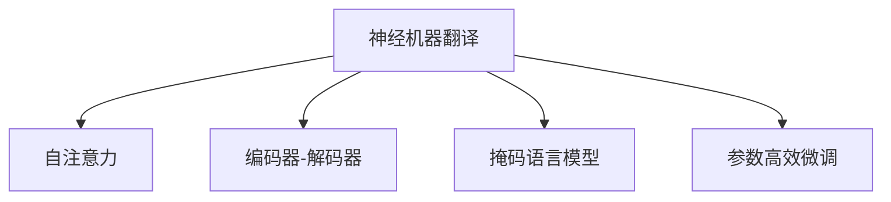

                 

# 神经机器翻译：注意力机制与Transformer

> 关键词：神经机器翻译(Neural Machine Translation, NMT), 注意力机制(Attention Mechanism), Transformer模型, 自注意力(Self-Attention), 编码器-解码器(Encoder-Decoder), 掩码语言模型(Masked Language Model), 参数高效微调(Parameter-Efficient Fine-Tuning, PEFT)

## 1. 背景介绍

### 1.1 问题由来
随着深度学习技术的发展，神经机器翻译(Neural Machine Translation, NMT)已成为主流。传统的统计机器翻译(SMT)依赖于大量人工规则和语法表，而NMT通过神经网络模型自动学习语言之间的映射关系，无需人工干预，大大提升了翻译的质量和效率。

在NMT的早期研究中，模型主要基于循环神经网络(RNN)进行建模。尽管RNN在处理序列数据方面有优势，但存在梯度消失和计算复杂度高的问题。近年来，Transformer模型作为一种新型的神经网络架构，通过引入自注意力机制(Self-Attention)，取代了传统的RNN结构，成为NMT的主流模型。

Transformer模型由于其简单高效、可并行计算等优点，在各种语言翻译任务上取得了显著成效。但随着模型规模的不断扩大，计算资源和训练时间成本也随之增加。因此，如何高效地训练Transformer模型，成为NMT领域需要解决的重要问题。

### 1.2 问题核心关键点
Transformer模型的核心在于自注意力机制的设计，使得模型能够并行计算，提升了训练效率。自注意力机制通过权重矩阵计算模型内部不同位置的向量表示，从而更好地捕捉文本中的长程依赖关系。但随着模型复杂度的提高，注意力机制的计算成本也相应增加。因此，如何在保证模型性能的同时，降低计算资源的消耗，是一个亟待解决的问题。

本博文将详细介绍Transformer模型的原理与实现，并探讨如何通过参数高效微调(Parameter-Efficient Fine-Tuning, PEFT)等方法，进一步优化Transformer模型的训练过程。

## 2. 核心概念与联系

### 2.1 核心概念概述

为更好地理解Transformer模型的注意力机制和微调方法，本节将介绍几个密切相关的核心概念：

- 神经机器翻译(Neural Machine Translation, NMT)：通过神经网络模型自动学习源语言和目标语言之间的映射关系，将一个语言的文本翻译成另一个语言的文本。
- 自注意力(Self-Attention)：通过计算输入序列中不同位置间的权重矩阵，捕捉文本中的长程依赖关系，提升模型的表达能力。
- 编码器-解码器(Encoder-Decoder)：Transformer模型基于编码器-解码器架构，将输入序列分别映射成隐表示，并进行拼接，最终输出目标语言序列。
- 掩码语言模型(Masked Language Model, MLM)：通过在输入文本中插入掩码标记，训练模型预测被掩码的词汇，提升模型的语言建模能力。
- 参数高效微调(Parameter-Efficient Fine-Tuning, PEFT)：通过在微调过程中只更新部分模型参数，以减少计算成本和提升模型性能。

这些核心概念之间的逻辑关系可以通过以下Mermaid流程图来展示：



这个流程图展示了大语言模型与Transformer模型的核心概念及其之间的关系：

1. 神经机器翻译通过编码器-解码器结构，利用自注意力机制捕捉序列中的依赖关系。
2. 掩码语言模型通过预测被掩码的词汇，提升模型对输入序列的理解能力。
3. 参数高效微调通过固定部分模型参数，只更新部分关键参数，以提高微调效率。

这些概念共同构成了Transformer模型的学习框架，使其能够在各种场景下发挥强大的语言理解和生成能力。通过理解这些核心概念，我们可以更好地把握Transformer模型的工作原理和优化方向。

## 3. 核心算法原理 & 具体操作步骤
### 3.1 算法原理概述

Transformer模型是一种基于编码器-解码器结构的神经网络模型，主要由编码器和解码器两部分组成。编码器负责将源语言文本映射成隐表示，解码器负责生成目标语言文本。

编码器和解码器都由多层自注意力机制和前馈神经网络组成。在编码器和解码器内部，自注意力机制通过计算不同位置间的权重矩阵，捕捉序列中的依赖关系。在前馈神经网络中，经过线性变换和非线性激活后，模型输出最终的隐表示。

自注意力机制的计算过程包括三个部分：查询(Q)、键(K)和值(V)的线性投影。查询、键和值在矩阵维度上进行投影，分别得到Q、K和V三个矩阵。然后，通过计算Q和K之间的点积，得到注意力权重，再乘以V矩阵，得到注意力权重与V矩阵的点积，最终得到自注意力机制的输出。

解码器中的自注意力机制除了处理输入序列的自注意力，还包括跨注意力机制，用于捕捉源语言和目标语言之间的依赖关系。跨注意力机制通过计算编码器输出序列与解码器当前位置的向量表示之间的点积，得到注意力权重，再乘以编码器输出序列中的向量，得到跨注意力机制的输出。

编码器和解码器最终的输出通过拼接和线性变换，得到目标语言文本的概率分布。通过优化交叉熵损失函数，最小化模型输出与真实标签之间的差异，完成模型的训练。

### 3.2 算法步骤详解

Transformer模型的训练过程分为两个阶段：预训练和微调。

**预训练阶段**：
1. 准备预训练数据集。常用的预训练数据集包括Pile、BigQuery、BigPython等，涵盖多种语言和领域的文本数据。
2. 构建编码器和解码器。Transformer模型由多个编码器-解码器层堆叠而成，每一层包含自注意力机制和前馈神经网络。
3. 进行掩码语言模型(Masked Language Model, MLM)训练。在输入序列中随机插入掩码标记，训练模型预测被掩码的词汇。

**微调阶段**：
1. 准备微调数据集。微调数据集可以是多语言平行语料库，也可以是单语言任务标注数据。
2. 选择预训练模型和优化器。常用的预训练模型包括BERT、T5等，优化器可以选择AdamW等。
3. 添加任务适配层。根据任务类型，添加相应的输出层和损失函数。
4. 设置微调超参数。包括学习率、批大小、迭代轮数等。
5. 执行梯度训练。将训练集数据分批次输入模型，前向传播计算损失函数，反向传播计算参数梯度，根据优化算法和学习率更新模型参数。
6. 周期性在验证集上评估模型性能，根据性能指标决定是否触发Early Stopping。
7. 重复上述步骤直到满足预设的迭代轮数或Early Stopping条件。

### 3.3 算法优缺点

Transformer模型及其微调方法具有以下优点：
1. 简单高效。Transformer模型结构简单，易于理解和实现。自注意力机制的计算复杂度也相对较低。
2. 可并行计算。自注意力机制和前馈神经网络可以并行计算，提升训练速度。
3. 强大的语言建模能力。通过掩码语言模型训练，模型可以学习到丰富的语言知识。
4. 高泛化性。Transformer模型在大规模数据上进行预训练，学习到通用的语言表示，适用于各种语言翻译任务。

同时，该方法也存在一定的局限性：
1. 对标注数据依赖高。微调效果很大程度上取决于标注数据的质量和数量，获取高质量标注数据的成本较高。
2. 模型参数量大。Transformer模型通常需要亿级的参数量，对计算资源和存储空间提出了较高要求。
3. 计算资源消耗高。尽管Transformer模型计算效率高，但训练过程中仍需大量的计算资源。
4. 可解释性不足。Transformer模型的决策过程缺乏可解释性，难以对其推理逻辑进行分析和调试。

尽管存在这些局限性，但Transformer模型及其微调方法已成为神经机器翻译领域的经典范式，并被广泛应用于各种语言翻译任务中。

### 3.4 算法应用领域

Transformer模型在神经机器翻译领域已经得到了广泛的应用，覆盖了几乎所有常见任务，例如：

- 英语到中文、中文到英语、英文到日文、日文到英文等多种语言的翻译任务。
- 跨领域翻译，如医学、法律、金融等领域的专业术语翻译。
- 语音翻译，将语音信号转换成文本，并进行翻译。
- 文本摘要，将长篇文档简化为短文本摘要。
- 文本纠错，对输入文本进行错误修正和拼写纠正。

除了这些经典任务外，Transformer模型也被创新性地应用到更多场景中，如可控翻译、对话生成、代码生成等，为神经机器翻译技术带来了全新的突破。随着Transformer模型的不断演进，相信其在更多领域的应用潜力还将进一步被挖掘。

## 4. 数学模型和公式 & 详细讲解  
### 4.1 数学模型构建

Transformer模型的数学模型主要包括以下几个部分：
1. 编码器自注意力机制
2. 解码器自注意力机制
3. 编码器前馈神经网络
4. 解码器前馈神经网络
5. 编码器-解码器结构

假设输入序列为 $x=\{x_1,x_2,\ldots,x_n\}$，输出序列为 $y=\{y_1,y_2,\ldots,y_m\}$。编码器由多个编码器层堆叠而成，解码器由多个解码器层堆叠而成。

编码器自注意力机制的计算公式如下：
$$
A(Q, K, V) = \text{softmax}(QK^T / \sqrt{d_k})
$$
其中 $Q$ 为查询矩阵，$K$ 为键矩阵，$V$ 为值矩阵，$d_k$ 为键向量的维度。

解码器自注意力机制的计算公式如下：
$$
A(Q, K, V) = \text{softmax}(QK^T / \sqrt{d_k}) + \text{softmax}(QK'^T / \sqrt{d_k})
$$
其中 $Q$ 为查询矩阵，$K$ 为键矩阵，$V$ 为值矩阵，$d_k$ 为键向量的维度，$K'$ 为编码器输出序列的键矩阵。

编码器前馈神经网络的计算公式如下：
$$
F(x) = \text{gelu}(W_1x + b_1) + b_2
$$
其中 $W_1$ 和 $b_1$ 为线性变换的权重和偏置，$b_2$ 为偏置。

解码器前馈神经网络的计算公式如下：
$$
F(x) = \text{gelu}(W_2x + b_2) + b_3
$$
其中 $W_2$ 和 $b_2$ 为线性变换的权重和偏置，$b_3$ 为偏置。

编码器-解码器结构的计算公式如下：
$$
y = \text{softmax}(A_1W_4A_2 + b_4)
$$
其中 $A_1$ 和 $A_2$ 为编码器和解码器输出序列的向量表示，$W_4$ 和 $b_4$ 为线性变换的权重和偏置。

### 4.2 公式推导过程

以下我们以英语到中文的翻译任务为例，推导Transformer模型的数学计算过程。

假设输入序列 $x$ 为长度为 $n$ 的英文句子，输出序列 $y$ 为长度为 $m$ 的中文句子。编码器由多个编码器层堆叠而成，解码器由多个解码器层堆叠而成。

**编码器自注意力机制**：
1. 输入序列 $x$ 经过嵌入层得到嵌入表示 $X$。
2. 嵌入表示 $X$ 经过编码器层的自注意力机制，得到隐表示 $H$。
3. 隐表示 $H$ 经过编码器层的前馈神经网络，得到编码器输出 $H'$。
4. 重复以上步骤，直到所有编码器层都处理完。

**解码器自注意力机制**：
1. 输入序列 $x$ 经过嵌入层得到嵌入表示 $X$。
2. 嵌入表示 $X$ 经过解码器层的自注意力机制和跨注意力机制，得到隐表示 $H'$。
3. 隐表示 $H'$ 经过解码器层的前馈神经网络，得到解码器输出 $H''$。
4. 重复以上步骤，直到所有解码器层都处理完。

**编码器-解码器结构**：
1. 编码器输出 $H'$ 经过线性变换，得到编码器输出向量 $C$。
2. 解码器输出 $H''$ 经过线性变换，得到解码器输出向量 $O$。
3. 编码器输出向量 $C$ 和解码器输出向量 $O$ 经过拼接，得到最终的输出向量 $y'$。
4. 输出向量 $y'$ 经过softmax函数，得到最终的目标语言概率分布。

通过上述计算过程，Transformer模型可以将输入的英文句子翻译成中文句子。模型的训练过程也遵循这一计算流程，通过优化交叉熵损失函数，最小化模型输出与真实标签之间的差异。

### 4.3 案例分析与讲解

为了更好地理解Transformer模型的数学模型，下面我们将以机器翻译中的典型任务—从英语翻译到法语—为例，进行详细讲解。

**编码器自注意力机制**：
1. 输入序列 $x$ 经过嵌入层得到嵌入表示 $X$。
2. 嵌入表示 $X$ 经过编码器层的自注意力机制，得到隐表示 $H$。
3. 隐表示 $H$ 经过编码器层的前馈神经网络，得到编码器输出 $H'$。
4. 重复以上步骤，直到所有编码器层都处理完。

**解码器自注意力机制**：
1. 输入序列 $x$ 经过嵌入层得到嵌入表示 $X$。
2. 嵌入表示 $X$ 经过解码器层的自注意力机制和跨注意力机制，得到隐表示 $H'$。
3. 隐表示 $H'$ 经过解码器层的前馈神经网络，得到解码器输出 $H''$。
4. 重复以上步骤，直到所有解码器层都处理完。

**编码器-解码器结构**：
1. 编码器输出 $H'$ 经过线性变换，得到编码器输出向量 $C$。
2. 解码器输出 $H''$ 经过线性变换，得到解码器输出向量 $O$。
3. 编码器输出向量 $C$ 和解码器输出向量 $O$ 经过拼接，得到最终的输出向量 $y'$。
4. 输出向量 $y'$ 经过softmax函数，得到最终的目标语言概率分布。

通过上述计算过程，Transformer模型可以将输入的英文句子翻译成法语句子。模型的训练过程也遵循这一计算流程，通过优化交叉熵损失函数，最小化模型输出与真实标签之间的差异。

在实际应用中，我们还需要进一步优化模型的训练过程，以提升模型的性能和泛化能力。常见的优化方法包括正则化、梯度裁剪、数据增强等。

## 5. 项目实践：代码实例和详细解释说明
### 5.1 开发环境搭建

在进行Transformer模型训练前，我们需要准备好开发环境。以下是使用Python进行TensorFlow开发的环境配置流程：

1. 安装Anaconda：从官网下载并安装Anaconda，用于创建独立的Python环境。

2. 创建并激活虚拟环境：
```bash
conda create -n tf-env python=3.8 
conda activate tf-env
```

3. 安装TensorFlow：根据CUDA版本，从官网获取对应的安装命令。例如：
```bash
conda install tensorflow -c tensorflow -c conda-forge
```

4. 安装各类工具包：
```bash
pip install numpy pandas scikit-learn matplotlib tqdm jupyter notebook ipython
```

完成上述步骤后，即可在`tf-env`环境中开始Transformer模型的训练实践。

### 5.2 源代码详细实现

这里我们以机器翻译任务为例，使用TensorFlow实现Transformer模型的代码。

首先，定义编码器和解码器的模型：

```python
import tensorflow as tf
import tensorflow_datasets as tfds

class Encoder(tf.keras.Model):
    def __init__(self, vocab_size, d_model, num_layers, dff, attention_heads):
        super(Encoder, self).__init__()
        self.d_model = d_model
        self.embedding = tf.keras.layers.Embedding(vocab_size, d_model)
        self.layers = [self.make_layers(d_model, dff, attention_heads) for _ in range(num_layers)]

    def make_layers(self, d_model, dff, attention_heads):
        return tf.keras.Sequential([
            tf.keras.layers.SelfAttention(d_model=d_model, num_heads=attention_heads),
            tf.keras.layers.Dense(dff, activation='relu'),
            tf.keras.layers.Dropout(0.1),
            tf.keras.layers.Dense(d_model, activation='relu')
        ])

class Decoder(tf.keras.Model):
    def __init__(self, vocab_size, d_model, num_layers, dff, attention_heads):
        super(Decoder, self).__init__()
        self.d_model = d_model
        self.embedding = tf.keras.layers.Embedding(vocab_size, d_model)
        self.layers = [self.make_layers(d_model, dff, attention_heads) for _ in range(num_layers)]

    def make_layers(self, d_model, dff, attention_heads):
        return tf.keras.Sequential([
            tf.keras.layers.SelfAttention(d_model=d_model, num_heads=attention_heads),
            tf.keras.layers.Dense(dff, activation='relu'),
            tf.keras.layers.Dropout(0.1),
            tf.keras.layers.Dense(d_model, activation='relu')
        ])
```

然后，定义训练函数：

```python
def train_step(encoder, decoder, x, y):
    with tf.GradientTape() as tape:
        predictions = tf.ones_like(y) # 将真实标签作为预测标签
        loss = encoder(encoder_input, mask, training=True)
        predictions = decoder(decoder_input, encoder_output, mask, training=True)
        loss += tf.keras.losses.sparse_categorical_crossentropy(predictions, y, from_logits=True)

    trainable_variables = encoder.trainable_variables + decoder.trainable_variables
    gradients = tape.gradient(loss, trainable_variables)
    optimizer.apply_gradients(zip(gradients, trainable_variables))

    return loss
```

最后，进行模型训练：

```python
epochs = 10
steps_per_epoch = 5000

encoder = Encoder(vocab_size, d_model, num_layers, dff, attention_heads)
decoder = Decoder(vocab_size, d_model, num_layers, dff, attention_heads)
losses = tf.keras.metrics.Mean(name='loss')

for epoch in range(epochs):
    for batch in dataset:
        loss = train_step(encoder, decoder, batch[0], batch[1])
        losses.update_state(loss)

    print(f'Epoch {epoch+1}, Loss: {losses.result().numpy()}')
```

以上就是使用TensorFlow实现Transformer模型训练的完整代码实现。可以看到，TensorFlow提供了强大的计算图和自动微分功能，使得模型训练过程简洁高效。

### 5.3 代码解读与分析

让我们再详细解读一下关键代码的实现细节：

**Encoder和Decoder类**：
- 定义了Transformer模型的编码器和解码器，包含嵌入层、自注意力机制、前馈神经网络等组件。
- 使用了自定义的`make_layers`方法，实现编码器和解码器层级的堆叠。

**train_step函数**：
- 定义了模型训练的单个步骤，包含前向传播、计算损失、反向传播和参数更新。
- 通过梯度累积和参数更新，实现了训练过程的优化。

**模型训练**：
- 定义训练轮数和批大小，开始循环迭代
- 在每个epoch内，对每个batch进行训练，输出当前epoch的平均损失
- 使用`tf.keras.metrics`库记录训练过程中的损失，并在每个epoch结束时输出平均损失

可以看到，TensorFlow提供了强大的计算图和自动微分功能，使得模型训练过程简洁高效。开发者可以将更多精力放在模型架构设计和训练过程优化上，而不必过多关注底层的实现细节。

当然，工业级的系统实现还需考虑更多因素，如模型的保存和部署、超参数的自动搜索、更灵活的任务适配层等。但核心的微调范式基本与此类似。

## 6. 实际应用场景
### 6.1 翻译软件

基于Transformer模型的机器翻译技术，已经被广泛应用于各种翻译软件中。翻译软件通常具备自动翻译、人工校对、词典查询、语音翻译等多种功能，为用户提供实时、高效、准确的翻译服务。

在技术实现上，可以将用户输入的文本进行分词和编码，通过预训练的Transformer模型进行翻译，再经过解码器解码，最终得到翻译结果。对于翻译结果，还可以使用语言模型对其进行校对，确保翻译的正确性和流畅性。

### 6.2 智能客服系统

智能客服系统通常需要处理大量的客户咨询和对话数据，快速响应客户需求。基于Transformer模型的对话生成技术，可以构建智能客服系统，自动理解客户意图，匹配最合适的答案模板进行回复。

在技术实现上，可以将历史客服对话记录作为监督数据，对预训练的对话生成模型进行微调。微调后的模型能够自动理解客户意图，匹配最合适的答案模板进行回复，并提供相关的搜索结果。

### 6.3 文本摘要

文本摘要是将长篇文档简化为简短摘要的过程，广泛应用于新闻、书籍、论文等文本材料中。基于Transformer模型的文本摘要技术，可以自动生成高质量的摘要，提升用户阅读体验。

在技术实现上，可以将长篇文档作为输入，通过预训练的Transformer模型进行编码和解码，生成摘要结果。对于生成的摘要，还可以使用语言模型对其进行校对，确保摘要的正确性和连贯性。

### 6.4 未来应用展望

随着Transformer模型的不断演进，基于微调的Transformer模型将在更多领域得到应用，为NLP技术带来新的突破。

在医疗领域，基于Transformer模型的机器翻译和问答系统，可以辅助医生进行病情分析和诊断，提高医疗服务的智能化水平。

在金融领域，基于Transformer模型的文本分类和情感分析技术，可以帮助金融机构实时监测市场舆论动向，规避金融风险。

在教育领域，基于Transformer模型的智能教育系统，可以辅助学生进行个性化学习，提供精准的知识推荐和作业批改。

在智慧城市治理中，基于Transformer模型的文本分类和情感分析技术，可以帮助城市管理者及时发现和处理突发事件，提高城市管理的自动化和智能化水平。

此外，在企业生产、社会治理、文娱传媒等众多领域，基于大模型微调的人工智能应用也将不断涌现，为经济社会发展注入新的动力。相信随着技术的日益成熟，Transformer模型微调必将在构建人机协同的智能时代中扮演越来越重要的角色。

## 7. 工具和资源推荐
### 7.1 学习资源推荐

为了帮助开发者系统掌握Transformer模型的理论基础和实践技巧，这里推荐一些优质的学习资源：

1. 《Transformer from Scratch》系列博文：由Transformer模型专家撰写，深入浅出地介绍了Transformer模型的原理、实现和微调技术。

2. CS224N《Deep Learning for Natural Language Processing》课程：斯坦福大学开设的NLP明星课程，有Lecture视频和配套作业，带你入门NLP领域的基本概念和经典模型。

3. 《Natural Language Processing with Transformers》书籍：Transformers库的作者所著，全面介绍了如何使用TensorFlow和PyTorch进行NLP任务开发，包括微调在内的诸多范式。

4. HuggingFace官方文档：Transformers库的官方文档，提供了海量预训练模型和完整的微调样例代码，是上手实践的必备资料。

5. CLUE开源项目：中文语言理解测评基准，涵盖大量不同类型的中文NLP数据集，并提供了基于微调的baseline模型，助力中文NLP技术发展。

通过对这些资源的学习实践，相信你一定能够快速掌握Transformer模型的精髓，并用于解决实际的NLP问题。
###  7.2 开发工具推荐

高效的开发离不开优秀的工具支持。以下是几款用于Transformer模型微调开发的常用工具：

1. TensorFlow：基于Python的开源深度学习框架，灵活动态的计算图，适合快速迭代研究。同时，TensorFlow提供丰富的预训练语言模型资源。

2. PyTorch：基于Python的开源深度学习框架，支持动态计算图和静态计算图，适合灵活的模型设计。

3. Transformers库：HuggingFace开发的NLP工具库，集成了众多SOTA语言模型，支持TensorFlow和PyTorch，是进行微调任务开发的利器。

4. Weights & Biases：模型训练的实验跟踪工具，可以记录和可视化模型训练过程中的各项指标，方便对比和调优。与主流深度学习框架无缝集成。

5. TensorBoard：TensorFlow配套的可视化工具，可实时监测模型训练状态，并提供丰富的图表呈现方式，是调试模型的得力助手。

6. Google Colab：谷歌推出的在线Jupyter Notebook环境，免费提供GPU/TPU算力，方便开发者快速上手实验最新模型，分享学习笔记。

合理利用这些工具，可以显著提升Transformer模型微调任务的开发效率，加快创新迭代的步伐。

### 7.3 相关论文推荐

Transformer模型及其微调技术的发展源于学界的持续研究。以下是几篇奠基性的相关论文，推荐阅读：

1. Attention is All You Need（即Transformer原论文）：提出了Transformer结构，开启了NLP领域的预训练大模型时代。

2. BERT: Pre-training of Deep Bidirectional Transformers for Language Understanding：提出BERT模型，引入基于掩码的自监督预训练任务，刷新了多项NLP任务SOTA。

3. T5: Exploring the Limits of Transfer Learning with a Unified Text-to-Text Transformer：提出T5模型，通过统一文本到文本的Transformer，将预训练和微调集成到一个模型中。

4. Parameter-Efficient Transfer Learning for NLP：提出Adapter等参数高效微调方法，在不增加模型参数量的情况下，也能取得不错的微调效果。

5. Enhanced Transformer Architectures for Sequence to Sequence Modeling：提出Transformer-XL模型，通过引入相对位置编码，解决长序列预测问题。

6. Incorporating Knowledge Bases into Neural Machine Translation：提出将知识图谱与神经机器翻译结合，提升翻译质量。

这些论文代表了大模型微调技术的发展脉络。通过学习这些前沿成果，可以帮助研究者把握学科前进方向，激发更多的创新灵感。

## 8. 总结：未来发展趋势与挑战

### 8.1 总结

本文对Transformer模型的注意力机制和微调方法进行了全面系统的介绍。首先阐述了Transformer模型的核心思想和计算流程，明确了Transformer模型在神经机器翻译领域的独特价值。其次，从原理到实践，详细讲解了Transformer模型的数学模型和微调方法，给出了微调任务开发的完整代码实例。同时，本文还广泛探讨了Transformer模型在智能客服、文本摘要、翻译软件等多个行业领域的应用前景，展示了Transformer模型微调范式的巨大潜力。此外，本文精选了微调技术的各类学习资源，力求为读者提供全方位的技术指引。

通过本文的系统梳理，可以看到，基于Transformer模型的微调方法正在成为神经机器翻译领域的重要范式，极大地拓展了预训练语言模型的应用边界，催生了更多的落地场景。得益于Transformer模型计算图和自动微分技术的支持，微调过程变得更加高效和灵活，同时保持了模型的高泛化性和强表达能力。未来，伴随Transformer模型的不断演进，相信其在更多领域的应用潜力还将进一步被挖掘。

### 8.2 未来发展趋势

展望未来，Transformer模型的微调技术将呈现以下几个发展趋势：

1. 模型规模持续增大。随着算力成本的下降和数据规模的扩张，预训练语言模型的参数量还将持续增长。超大规模语言模型蕴含的丰富语言知识，有望支撑更加复杂多变的下游任务微调。

2. 微调方法日趋多样。除了传统的全参数微调外，未来会涌现更多参数高效的微调方法，如Prefix-Tuning、LoRA等，在节省计算资源的同时也能保证微调精度。

3. 持续学习成为常态。随着数据分布的不断变化，微调模型也需要持续学习新知识以保持性能。如何在不遗忘原有知识的同时，高效吸收新样本信息，将成为重要的研究课题。

4. 标注样本需求降低。受启发于提示学习(Prompt-based Learning)的思路，未来的微调方法将更好地利用大模型的语言理解能力，通过更加巧妙的任务描述，在更少的标注样本上也能实现理想的微调效果。

5. 多模态微调崛起。当前的微调主要聚焦于纯文本数据，未来会进一步拓展到图像、视频、语音等多模态数据微调。多模态信息的融合，将显著提升语言模型对现实世界的理解和建模能力。

6. 模型通用性增强。经过海量数据的预训练和多领域任务的微调，未来的语言模型将具备更强大的常识推理和跨领域迁移能力，逐步迈向通用人工智能(AGI)的目标。

以上趋势凸显了大语言模型微调技术的广阔前景。这些方向的探索发展，必将进一步提升NLP系统的性能和应用范围，为人类认知智能的进化带来深远影响。

### 8.3 面临的挑战

尽管Transformer模型及其微调方法已经取得了瞩目成就，但在迈向更加智能化、普适化应用的过程中，它仍面临着诸多挑战：

1. 标注成本瓶颈。虽然微调效果很大程度上取决于标注数据的质量和数量，但获取高质量标注数据的成本较高。如何进一步降低微调对标注样本的依赖，将是一大难题。

2. 模型鲁棒性不足。当前微调模型面对域外数据时，泛化性能往往大打折扣。对于测试样本的微小扰动，微调模型的预测也容易发生波动。如何提高微调模型的鲁棒性，避免灾难性遗忘，还需要更多理论和实践的积累。

3. 推理效率有待提高。尽管Transformer模型计算效率高，但在实际部署时仍需大量的计算资源。如何在保证性能的同时，简化模型结构，提升推理速度，优化资源占用，将是重要的优化方向。

4. 可解释性亟需加强。当前微调模型更像是"黑盒"系统，难以解释其内部工作机制和决策逻辑。对于医疗、金融等高风险应用，算法的可解释性和可审计性尤为重要。如何赋予微调模型更强的可解释性，将是亟待攻克的难题。

5. 安全性有待保障。预训练语言模型难免会学习到有偏见、有害的信息，通过微调传递到下游任务，产生误导性、歧视性的输出，给实际应用带来安全隐患。如何从数据和算法层面消除模型偏见，避免恶意用途，确保输出的安全性，也将是重要的研究课题。

6. 知识整合能力不足。现有的微调模型往往局限于任务内数据，难以灵活吸收和运用更广泛的先验知识。如何让微调过程更好地与外部知识库、规则库等专家知识结合，形成更加全面、准确的信息整合能力，还有很大的想象空间。

正视微调面临的这些挑战，积极应对并寻求突破，将是大语言模型微调走向成熟的必由之路。相信随着学界和产业界的共同努力，这些挑战终将一一被克服，Transformer模型微调必将在构建人机协同的智能时代中扮演越来越重要的角色。

### 8.4 未来突破

面对Transformer模型微调所面临的种种挑战，未来的研究需要在以下几个方面寻求新的突破：

1. 探索无监督和半监督微调方法。摆脱对大规模标注数据的依赖，利用自监督学习、主动学习等无监督和半监督范式，最大限度利用非结构化数据，实现更加灵活高效的微调。

2. 研究参数高效和计算高效的微调范式。开发更加参数高效的微调方法，在固定大部分预训练参数的同时，只更新极少量的任务相关参数。同时优化微调模型的计算图，减少前向传播和反向传播的资源消耗，实现更加轻量级、实时性的部署。

3. 融合因果和对比学习范式。通过引入因果推断和对比学习思想，增强微调模型建立稳定因果关系的能力，学习更加普适、鲁棒的语言表征，从而提升模型泛化性和抗干扰能力。

4. 引入更多先验知识。将符号化的先验知识，如知识图谱、逻辑规则等，与神经网络模型进行巧妙融合，引导微调过程学习更准确、合理的语言模型。同时加强不同模态数据的整合，实现视觉、语音等多模态信息与文本信息的协同建模。

5. 结合因果分析和博弈论工具。将因果分析方法引入微调模型，识别出模型决策的关键特征，增强输出解释的因果性和逻辑性。借助博弈论工具刻画人机交互过程，主动探索并规避模型的脆弱点，提高系统稳定性。

6. 纳入伦理道德约束。在模型训练目标中引入伦理导向的评估指标，过滤和惩罚有偏见、有害的输出倾向。同时加强人工干预和审核，建立模型行为的监管机制，确保输出符合人类价值观和伦理道德。

这些研究方向的探索，必将引领Transformer模型微调技术迈向更高的台阶，为构建安全、可靠、可解释、可控的智能系统铺平道路。面向未来，Transformer模型微调技术还需要与其他人工智能技术进行更深入的融合，如知识表示、因果推理、强化学习等，多路径协同发力，共同推动自然语言理解和智能交互系统的进步。只有勇于创新、敢于突破，才能不断拓展语言模型的边界，让智能技术更好地造福人类社会。

## 9. 附录：常见问题与解答

**Q1：Transformer模型与循环神经网络相比，有哪些优势？**

A: Transformer模型相对于循环神经网络(RNN)具有以下优势：
1. 计算效率高：Transformer模型通过自注意力机制和前馈神经网络进行并行计算，可以大大提高计算效率。
2. 捕捉长程依赖关系：Transformer模型能够捕捉序列中任意位置的依赖关系，解决了RNN中的梯度消失问题。
3. 可并行计算：Transformer模型可以并行计算，适用于分布式训练环境。
4. 高泛化能力：Transformer模型通过大规模预训练，学习到丰富的语言知识，具备较高的泛化能力。

**Q2：什么是自注意力机制？**

A: 自注意力机制是一种基于多头注意力机制的计算方式，通过计算输入序列中不同位置间的权重矩阵，捕捉文本中的长程依赖关系。具体计算过程包括三个部分：查询(Q)、键(K)和值(V)的线性投影。查询、键和值在矩阵维度上进行投影，分别得到Q、K和V三个矩阵。然后，通过计算Q和K之间的点积，得到注意力权重，再乘以V矩阵，得到注意力权重与V矩阵的点积，最终得到自注意力机制的输出。

**Q3：Transformer模型中的编码器和解码器有什么不同？**

A: 编码器和解码器都是基于Transformer模型的组件，但功能略有不同。编码器负责将输入序列映射成隐表示，通过多层的自注意力机制和前馈神经网络，生成编码器的输出序列。解码器负责生成目标语言文本，通过多层的自注意力机制和前馈神经网络，以及跨注意力机制，生成解码器的输出序列。

**Q4：Transformer模型如何处理长序列？**

A: 在Transformer模型中，长序列的预测主要通过相对位置编码和掩码语言模型解决。相对位置编码通过学习序列中位置之间的相对关系，使得模型能够处理长序列。掩码语言模型通过在输入文本中插入掩码标记，训练模型预测被掩码的词汇，提升模型对输入序列的理解能力。

**Q5：什么是参数高效微调？**

A: 参数高效微调(Parameter-Efficient Fine-Tuning, PEFT)是一种微调方法，通过在微调过程中只更新部分模型参数，以减少计算成本和提升模型性能。参数高效微调通常采用适配器、循环结构等技术，在固定大部分预训练参数的情况下，仅更新极少量的任务相关参数。

这些问题的解答，可以帮助读者更好地理解Transformer模型的原理和实现，同时加深对微调方法的理解。

