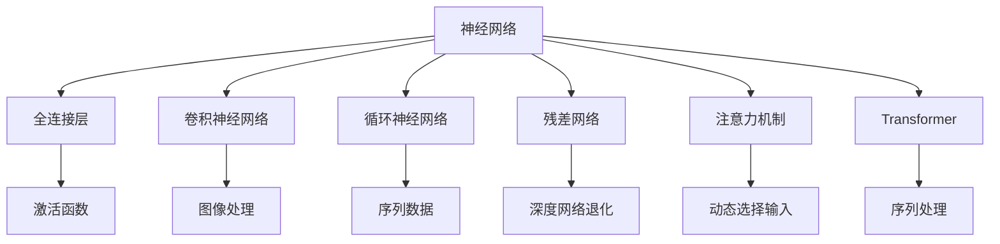

                 

# 神经网络架构设计：从简单到复杂

> 关键词：神经网络，深度学习，架构设计，从简单到复杂，全连接层，卷积神经网络，循环神经网络，残差网络，注意力机制，Transformer，计算图

## 1. 背景介绍

### 1.1 问题由来
深度学习自20世纪80年代诞生以来，以其强大的建模能力在图像识别、语音识别、自然语言处理等领域取得了突破性进展。神经网络作为深度学习的核心模型，其架构设计成为模型性能提升的关键。然而，复杂的神经网络往往容易过拟合、计算开销大，导致性能不理想。

神经网络架构设计的核心在于如何平衡网络的复杂性与性能。早期的神经网络结构相对简单，且只能处理一维的数据，例如多层感知机(Multilayer Perceptron, MLP)。随着深度学习的发展，神经网络架构逐渐变得复杂，开始采用卷积神经网络(Convolutional Neural Network, CNN)、循环神经网络(Recurrent Neural Network, RNN)、残差网络(ResNet)、注意力机制、Transformer等技术，显著提升了模型的表现。

### 1.2 问题核心关键点
神经网络架构设计的目的在于构建既能高效捕捉数据特征，又能在保证模型性能的前提下，尽可能减少计算资源消耗的模型。

## 2. 核心概念与联系

### 2.1 核心概念概述

为了更好地理解神经网络架构设计，本节将介绍几个核心概念：

- 神经网络：由输入层、隐藏层和输出层组成的计算模型，每个节点代表一个计算单元，接收多个输入并产生一个输出。
- 深度学习：利用多层神经网络进行学习，尤其是处理复杂非线性关系，例如图像识别、自然语言处理等任务。
- 架构设计：选择网络结构、设计激活函数、正则化技术、优化器等，以提高模型效果。
- 全连接层(FC)：网络层之间通过全连接的方式进行信息传递。
- 卷积神经网络(CNN)：在图像处理等领域表现出卓越的性能。
- 循环神经网络(RNN)：主要用于序列数据处理。
- 残差网络(ResNet)：通过跨层连接，解决了深度网络退化问题。
- 注意力机制：通过注意力权重来动态地选取输入特征。
- Transformer：通过自注意力机制实现高效的序列处理。

这些概念之间逻辑关系可以通过以下Mermaid流程图来展示：



这个流程图展示了大模型与各个核心概念之间的逻辑关系：

1. 神经网络通过全连接层、卷积层、循环层、残差连接、注意力机制、Transformer等构建复杂网络。
2. 全连接层负责网络层之间的信息传递。
3. 卷积神经网络用于图像等二维数据处理。
4. 循环神经网络用于时间序列数据处理。
5. 残差网络通过跨层连接解决深度网络退化问题。
6. 注意力机制动态地选取输入特征，提升模型性能。
7. Transformer通过自注意力机制实现高效的序列处理。

## 3. 核心算法原理 & 具体操作步骤
### 3.1 算法原理概述

神经网络架构设计的核心在于选择和优化网络的结构和参数。常见的网络架构设计方法包括：

- 前馈网络：网络各层之间只有前向传播，没有反馈连接。
- 反馈网络：通过引入循环或反馈连接，使得网络具有记忆能力。
- 卷积神经网络：利用卷积操作提取图像等数据的局部特征。
- 循环神经网络：通过循环连接处理序列数据。
- 残差网络：通过跨层连接来解决深度网络的退化问题。
- 注意力机制：通过注意力权重动态地选择输入特征。

### 3.2 算法步骤详解

神经网络架构设计通常包括以下几个关键步骤：

**Step 1: 选择合适的模型架构**
- 根据任务类型，选择合适的网络结构。
- 对于图像任务，通常选择卷积神经网络。
- 对于序列任务，通常选择循环神经网络或Transformer。

**Step 2: 设计网络层**
- 确定网络层数和每层节点数。
- 设计激活函数、正则化技术、优化器等。

**Step 3: 训练和调参**
- 选择合适的优化算法及其参数。
- 设置学习率、批大小、迭代轮数等。
- 训练过程中进行参数调优，防止过拟合。

**Step 4: 模型评估和优化**
- 在验证集上评估模型性能。
- 根据评估结果调整网络结构或参数。

**Step 5: 应用与部署**
- 将模型应用到实际任务中。
- 优化模型推理速度，压缩模型规模，便于部署。

### 3.3 算法优缺点

神经网络架构设计有以下优点：

1. 增强模型性能：复杂网络能够更好地捕捉数据特征，提升模型效果。
2. 提高泛化能力：通过合适的正则化和优化器设计，可以防止模型过拟合，提高泛化能力。
3. 丰富任务覆盖：神经网络适用于图像识别、自然语言处理、语音识别等多种任务。

同时，神经网络架构设计也存在一些缺点：

1. 计算复杂度高：复杂网络通常需要更大的计算资源。
2. 容易过拟合：网络复杂度高，容易发生过拟合。
3. 参数调节难度大：网络结构复杂，调节参数难度大。
4. 黑盒性质：模型训练过程复杂，难以解释模型行为。

## 4. 数学模型和公式 & 详细讲解

### 4.1 数学模型构建

神经网络架构设计通常在数学模型上表达。常见的网络架构设计模型如下：

- 前馈网络：$y=f(Wx+b)$
- 卷积神经网络：$y=f(W*conv(x)+b)$
- 循环神经网络：$h_{t}=f(h_{t-1},x_t,W_b)$
- 残差网络：$h_{t}=f(h_{t-1},x_t,W_r)$
- 注意力机制：$y=\sum_{i=1}^n \alpha_i f(w_i)$

其中 $x$ 为输入，$W$ 为网络参数，$b$ 为偏置，$f$ 为激活函数，$h$ 为隐藏状态，$n$ 为输入序列长度，$\alpha$ 为注意力权重。

### 4.2 公式推导过程

以卷积神经网络为例，推导其卷积操作的公式：

假设输入图像为 $x_{i,j}$，卷积核为 $w_{k,l}$，卷积操作为 $y_{i,j}$。则有：

$$
y_{i,j} = \sum_{k=0}^{h-1} \sum_{l=0}^{w-1} x_{i+k,j+l} \cdot w_{k,l}
$$

其中 $h$ 和 $w$ 分别为卷积核的高度和宽度。

对于多通道图像，卷积操作可表示为：

$$
y_{i,j,c} = \sum_{k=0}^{h-1} \sum_{l=0}^{w-1} \sum_{c'=0}^{c-1} x_{i+k,j+l,c'} \cdot w_{k,l,c'}
$$

其中 $c$ 为输入图像的通道数。

### 4.3 案例分析与讲解

以AlexNet为例，分析其网络架构设计。

AlexNet是2012年ImageNet图像识别大赛的冠军，其网络架构设计如下：

- 输入层：输入图像大小为227x227x3。
- 卷积层：采用3x3卷积核，步长为1，padding为0。
- 激活函数：使用ReLU。
- 池化层：采用2x2的最大池化，步长为2。
- 全连接层：最后一层使用1000维的softmax输出层。

AlexNet的成功在于其多个卷积和池化层的堆叠，以及合理设置学习率、批大小等超参数。

## 5. 项目实践：代码实例和详细解释说明
### 5.1 开发环境搭建

进行神经网络架构设计时，通常需要安装TensorFlow、PyTorch等深度学习框架。以下是Python环境下安装TensorFlow的示例代码：

```bash
pip install tensorflow
```

### 5.2 源代码详细实现

以下是使用PyTorch实现卷积神经网络的示例代码：

```python
import torch.nn as nn
import torch.optim as optim

class ConvNet(nn.Module):
    def __init__(self):
        super(ConvNet, self).__init__()
        self.conv1 = nn.Conv2d(3, 32, 3, 1, 1)
        self.conv2 = nn.Conv2d(32, 64, 3, 1, 1)
        self.pool = nn.MaxPool2d(2, 2)
        self.fc1 = nn.Linear(9216, 512)
        self.fc2 = nn.Linear(512, 10)
    
    def forward(self, x):
        x = self.pool(F.relu(self.conv1(x)))
        x = self.pool(F.relu(self.conv2(x)))
        x = x.view(-1, 9216)
        x = F.relu(self.fc1(x))
        x = self.fc2(x)
        return x
```

### 5.3 代码解读与分析

**ConvNet类**：
- `__init__`方法：初始化网络层，包括卷积层、池化层、全连接层。
- `forward`方法：定义前向传播的计算流程。

**卷积层**：
- `nn.Conv2d`：定义二维卷积层。
- `in_channels`：输入通道数。
- `out_channels`：输出通道数。
- `kernel_size`：卷积核大小。
- `stride`：卷积核的步长。
- `padding`：填充方式。

**激活函数**：
- `F.relu`：使用ReLU激活函数。

**全连接层**：
- `nn.Linear`：定义全连接层。
- `in_features`：输入特征数。
- `out_features`：输出特征数。

### 5.4 运行结果展示

在上述代码的基础上，可以在PyTorch上搭建卷积神经网络，并使用CIFAR-10数据集进行训练和验证：

```python
import torch
from torchvision import datasets, transforms

# 定义数据预处理
transform = transforms.Compose([
    transforms.ToTensor(),
    transforms.Normalize((0.5, 0.5, 0.5), (0.5, 0.5, 0.5))
])

# 加载CIFAR-10数据集
trainset = datasets.CIFAR10(root='./data', train=True, download=True, transform=transform)
trainloader = torch.utils.data.DataLoader(trainset, batch_size=4, shuffle=True, num_workers=2)

testset = datasets.CIFAR10(root='./data', train=False, download=True, transform=transform)
testloader = torch.utils.data.DataLoader(testset, batch_size=4, shuffle=False, num_workers=2)

# 定义模型
model = ConvNet()
device = torch.device("cuda:0" if torch.cuda.is_available() else "cpu")
model.to(device)

# 定义损失函数和优化器
criterion = nn.CrossEntropyLoss()
optimizer = optim.SGD(model.parameters(), lr=0.001, momentum=0.9)

# 训练模型
for epoch in range(10):
    running_loss = 0.0
    for i, data in enumerate(trainloader, 0):
        inputs, labels = data[0].to(device), data[1].to(device)
        optimizer.zero_grad()
        outputs = model(inputs)
        loss = criterion(outputs, labels)
        loss.backward()
        optimizer.step()
        running_loss += loss.item()
    print('Epoch {}/{} Loss: {:.4f}'.format(epoch+1, 10, running_loss/len(trainloader)))

# 评估模型
correct = 0
total = 0
with torch.no_grad():
    for data in testloader:
        images, labels = data[0].to(device), data[1].to(device)
        outputs = model(images)
        _, predicted = torch.max(outputs.data, 1)
        total += labels.size(0)
        correct += (predicted == labels).sum().item()

print('Accuracy: {:.2f}%'.format(100 * correct / total))
```

## 6. 实际应用场景
### 6.1 智能推荐系统

智能推荐系统广泛应用于电商、新闻、视频等平台，帮助用户发现感兴趣的内容。

神经网络架构设计可以在推荐系统中应用广泛，例如通过卷积神经网络(CNN)对用户行为数据进行特征提取，使用循环神经网络(RNN)对历史数据进行建模。

以Amazon推荐系统为例，使用多层神经网络对用户行为数据进行处理，同时使用LSTM对用户历史行为进行建模，最终输出用户对商品的评分。

### 6.2 自动驾驶

自动驾驶是未来的重要技术，需要从大量传感器数据中提取信息，进行实时决策。

卷积神经网络在图像识别、视频处理中表现优异，可以用于自动驾驶中的目标检测、场景理解等任务。同时，使用循环神经网络对车辆状态进行建模，可以预测未来的驾驶行为。

以Tesla的自动驾驶系统为例，使用卷积神经网络对摄像头和雷达数据进行融合，提取环境信息，使用循环神经网络对车辆状态进行建模，实现实时决策。

### 6.3 语音识别

语音识别技术可以将语音转换成文字，广泛应用于智能助手、语音搜索等场景。

卷积神经网络在语音信号处理中表现优异，可以用于提取语音特征。同时，使用循环神经网络对语音进行建模，可以预测语音的下一帧。

以谷歌的语音识别系统为例，使用卷积神经网络对语音信号进行特征提取，使用循环神经网络对语音进行建模，实现高效的语音识别。

## 7. 工具和资源推荐
### 7.1 学习资源推荐

为了帮助开发者系统掌握神经网络架构设计，这里推荐一些优质的学习资源：

1. 《深度学习》课程：斯坦福大学开设的深度学习课程，涵盖神经网络、卷积神经网络、循环神经网络、残差网络等核心内容。

2. 《计算机视觉：算法与应用》书籍：涵盖了卷积神经网络、循环神经网络、注意力机制、Transformer等深度学习技术。

3. 《Neural Network Architectures》博客：深度学习专家Andrej Karpathy撰写的博客，深入浅出地介绍了神经网络架构设计的原理和实现。

4. PyTorch官方文档：PyTorch官方文档，详细介绍了神经网络架构设计的实现和优化。

5. TensorFlow官方文档：TensorFlow官方文档，详细介绍了神经网络架构设计的实现和优化。

通过对这些资源的学习实践，相信你一定能够快速掌握神经网络架构设计的精髓，并用于解决实际的深度学习问题。

### 7.2 开发工具推荐

高效的开发离不开优秀的工具支持。以下是几款用于神经网络架构设计的常用工具：

1. PyTorch：基于Python的开源深度学习框架，灵活动态的计算图，适合快速迭代研究。

2. TensorFlow：由Google主导开发的开源深度学习框架，生产部署方便，适合大规模工程应用。

3. Keras：基于TensorFlow、Theano等后端的高级神经网络API，适合快速原型设计和模型构建。

4. Jupyter Notebook：交互式编程环境，方便开发者进行模型构建和调试。

5. Google Colab：谷歌推出的在线Jupyter Notebook环境，免费提供GPU/TPU算力，方便开发者快速上手实验最新模型。

合理利用这些工具，可以显著提升神经网络架构设计的开发效率，加快创新迭代的步伐。

### 7.3 相关论文推荐

神经网络架构设计领域的研究源远流长，以下是几篇奠基性的相关论文，推荐阅读：

1. AlexNet：ImageNet图像识别大赛的冠军，其网络架构设计引领了深度学习的发展方向。

2. ResNet：提出残差连接，解决了深度网络退化问题，大大提升了深度网络的性能。

3. InceptionNet：提出多分支卷积操作，提高了网络效率和准确率。

4. LeNet：提出多层卷积神经网络，在手写数字识别中取得优异效果。

5. LSTM：提出长短时记忆网络，解决了循环神经网络中的梯度消失和梯度爆炸问题。

6. Transformer：提出自注意力机制，实现了高效的序列处理，取得了SOTA性能。

这些论文代表了大模型架构设计的演进脉络。通过学习这些前沿成果，可以帮助研究者把握学科前进方向，激发更多的创新灵感。

## 8. 总结：未来发展趋势与挑战

### 8.1 总结

本文对神经网络架构设计进行了全面系统的介绍。首先阐述了神经网络架构设计的背景和重要性，明确了架构设计在提升模型性能、减少计算资源消耗方面的关键作用。其次，从原理到实践，详细讲解了神经网络架构设计的数学模型和操作步骤，给出了神经网络架构设计的完整代码实例。同时，本文还广泛探讨了神经网络架构设计在智能推荐、自动驾驶、语音识别等实际应用中的重要性和方法，展示了架构设计的强大潜力。

通过本文的系统梳理，可以看到，神经网络架构设计在深度学习中起到了至关重要的作用，是大模型设计的重要组成部分。未来，伴随神经网络架构设计技术的不断演进，深度学习技术必将在更广阔的应用领域大放异彩，深刻影响人类的生产生活方式。

### 8.2 未来发展趋势

展望未来，神经网络架构设计将呈现以下几个发展趋势：

1. 参数高效的架构设计：未来会涌现更多参数高效的架构设计方法，如NAS(Neural Architecture Search)、Layer-wise Adaptive Dropout等，在保证模型性能的前提下，尽可能减少计算资源消耗。

2. 多样化的架构设计方法：除了传统的卷积神经网络、循环神经网络、残差网络等，未来会引入更多创新架构设计方法，如自注意力机制、Transformer等，以应对更加复杂和多样化的数据和任务。

3. 实时化的架构设计：未来会引入实时化的架构设计方法，如动态计算图、模型剪枝等，提升深度学习模型的实时性和效率。

4. 多模态架构设计：未来会引入多模态的架构设计方法，如视觉、语音、文本等多模态数据的融合，实现更加全面、准确的信息整合能力。

5. 可解释性的架构设计：未来会引入可解释性的架构设计方法，如因果分析、博弈论等，增强深度学习模型的可解释性和可解释性。

6. 伦理导向的架构设计：未来会引入伦理导向的架构设计方法，如公平性约束、安全性保证等，确保深度学习模型符合人类的价值观和伦理道德。

这些趋势凸显了神经网络架构设计的广阔前景。这些方向的探索发展，必将进一步提升深度学习模型的性能和应用范围，为人类认知智能的进化带来深远影响。

### 8.3 面临的挑战

尽管神经网络架构设计已经取得了瞩目成就，但在迈向更加智能化、普适化应用的过程中，它仍面临着诸多挑战：

1. 计算复杂度高：复杂的神经网络通常需要更大的计算资源。

2. 容易过拟合：网络复杂度高，容易发生过拟合。

3. 参数调节难度大：网络结构复杂，调节参数难度大。

4. 黑盒性质：模型训练过程复杂，难以解释模型行为。

5. 伦理和公平性问题：深度学习模型可能会学习到有偏见、有害的信息，输出误导性、歧视性的结果。

6. 数据依赖性强：深度学习模型通常需要大量的标注数据进行训练，获取高质量标注数据的成本高。

7. 模型可解释性不足：深度学习模型通常被认为是黑盒模型，难以解释其内部工作机制和决策逻辑。

8. 鲁棒性不足：深度学习模型对输入数据的微小扰动非常敏感，容易受到对抗样本攻击。

正视这些挑战，积极应对并寻求突破，将使神经网络架构设计迈向更高的台阶，为构建人机协同的智能系统铺平道路。

### 8.4 研究展望

面对神经网络架构设计所面临的种种挑战，未来的研究需要在以下几个方面寻求新的突破：

1. 探索参数高效的架构设计方法。开发更加参数高效的架构设计方法，在保证模型性能的前提下，尽可能减少计算资源消耗。

2. 研究多模态的架构设计方法。引入多模态的架构设计方法，实现视觉、语音、文本等多模态数据的融合，提升深度学习模型的全面性和准确性。

3. 引入可解释性的架构设计方法。通过因果分析、博弈论等方法，增强深度学习模型的可解释性和可解释性。

4. 引入伦理导向的架构设计方法。通过公平性约束、安全性保证等方法，确保深度学习模型符合人类的价值观和伦理道德。

这些研究方向的探索，必将引领神经网络架构设计技术迈向更高的台阶，为构建安全、可靠、可解释、可控的智能系统铺平道路。面向未来，神经网络架构设计需要与其他人工智能技术进行更深入的融合，如知识表示、因果推理、强化学习等，多路径协同发力，共同推动自然语言理解和智能交互系统的进步。只有勇于创新、敢于突破，才能不断拓展深度学习模型的边界，让智能技术更好地造福人类社会。

## 9. 附录：常见问题与解答

**Q1: 神经网络架构设计的目标是什么？**

A: 神经网络架构设计的目标在于构建既能高效捕捉数据特征，又能在保证模型性能的前提下，尽可能减少计算资源消耗的模型。

**Q2: 神经网络架构设计的步骤有哪些？**

A: 神经网络架构设计的步骤包括选择合适的模型架构、设计网络层、训练和调参、模型评估和优化、应用与部署。

**Q3: 如何防止神经网络过拟合？**

A: 防止神经网络过拟合的常用方法包括数据增强、正则化技术、dropout、early stopping等。

**Q4: 神经网络架构设计的数学模型是什么？**

A: 神经网络架构设计的数学模型包括前馈网络、卷积神经网络、循环神经网络、残差网络、注意力机制、Transformer等。

**Q5: 如何提高神经网络的实时性？**

A: 提高神经网络的实时性的常用方法包括动态计算图、模型剪枝、量化加速等。

---

作者：禅与计算机程序设计艺术 / Zen and the Art of Computer Programming

