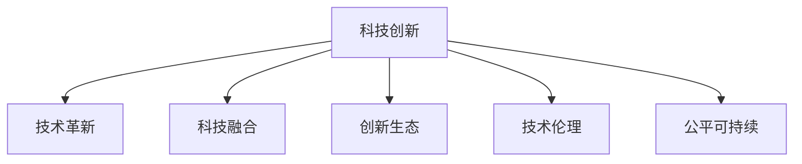

                 

# 科技创新：社会进步的阶梯

## 1. 背景介绍

### 1.1 问题的由来
当前，世界正处于一场前所未有的科技革命之中。以人工智能、量子计算、生物技术、新能源等领域的迅猛发展为标志，科技创新已成为推动社会进步的主要动力。在这一过程中，我们面临诸多挑战：资源分配不均、信息不对称、技术伦理问题等。如何通过科技创新来构建公平、可持续、开放的社会，是摆在全人类面前的重大课题。

### 1.2 问题的核心关键点
- 科技创新：指通过研发新技术、新产品、新服务等方式，推动社会生产力提升和产业升级。
- 社会进步：涉及经济增长、教育普及、医疗水平、环境保护等多个层面，是衡量社会发展的综合指标。
- 技术伦理：指在技术研发和应用过程中遵循的道德准则，保障人权、环境和社会利益。
- 开放合作：强调在科技创新中各国间应加强交流与合作，共享科技成果，推动全球发展。
- 公平可持续：注重科技创新应促进资源合理分配、环境可持续，保障社会长远稳定发展。

## 2. 核心概念与联系

### 2.1 核心概念概述

为更好地理解科技创新在社会进步中的作用，本节将介绍几个关键概念：

- 科技创新：以科学研究为基础，开发新技术、新产品、新服务的过程。科技创新推动社会进步，提高生产力，改善生活质量。

- 技术革新：通过革命性创新，打破现有技术体系，带来全新产业模式，如互联网、移动通信、可再生能源等。

- 科技融合：指不同领域的科技交叉融合，形成新产业和新应用，如工业4.0、智慧城市、健康互联网等。

- 创新生态：包括企业、大学、政府、非营利组织等多个主体，共同推动科技创新和应用的过程。

- 技术伦理：在科技研发和应用过程中遵循的道德规范，确保技术安全、公平、可持续。

- 公平可持续：科技创新应促进资源合理分配，保护生态环境，推动社会可持续发展。

这些概念之间的逻辑关系可以通过以下Mermaid流程图来展示：



这个流程图展示了一系列科技创新的关键环节和重要概念，帮助我们系统地理解科技创新对社会进步的推动作用。

## 3. 核心算法原理 & 具体操作步骤

### 3.1 算法原理概述

科技创新推动社会进步，主要通过以下几个方面的原理：

- **科技驱动经济增长**：通过新技术的商业化应用，推动生产效率提升，降低成本，创造新的经济增长点。

- **科技改善生活质量**：通过医疗、教育、环境等领域的科技进步，改善人民生活条件，提升幸福感。

- **科技促进公平**：通过互联网、移动通信等技术普及，打破信息孤岛，实现信息公平，缩小城乡、区域发展差距。

- **科技支持可持续发展**：通过绿色能源、智能农业、环保技术等，实现环境保护和经济发展的双重目标。

- **科技推动伦理进步**：通过数据隐私保护、AI伦理等技术伦理研究，推动社会道德进步，构建公正的技术环境。

### 3.2 算法步骤详解

科技创新推动社会进步的具体操作步骤可以总结如下：

**Step 1: 确定科技创新的方向**
- 分析当前社会发展的需求，如环境保护、医疗健康、教育普及等。
- 确定科技创新的目标，如提高效率、改善生活、促进公平等。

**Step 2: 研发新技术**
- 进行基础研究，攻克核心技术难题，如量子计算、基因编辑、清洁能源等。
- 开展应用研究，将基础科研成果转化为实用技术，如智能芯片、生物疫苗、环保设备等。

**Step 3: 推广应用**
- 通过示范项目、试点工程等方式，小规模应用新技术，验证其效果。
- 扩大应用范围，通过市场推广和政策支持，推动新技术在全社会的普及。

**Step 4: 持续优化**
- 收集应用反馈，持续改进和优化新技术，提高其性能和稳定性。
- 形成技术标准和规范，保障技术应用的安全和公平。

### 3.3 算法优缺点

科技创新推动社会进步的方法具有以下优点：

- **高效能**：科技创新直接驱动生产力提升，经济增长显著，社会进步快速。
- **广覆盖**：科技创新的影响面广，能改善大量人群的生活条件，促进社会公平。
- **长周期**：科技创新具有长周期性，推动可持续发展和环境改善。
- **多层次**：科技创新的成果涵盖多个层面，从经济、文化到社会，全面提升社会进步。

同时，该方法也存在一些局限：

- **资源消耗大**：科技创新往往需要大量的资金、人力和时间投入，资源消耗较大。
- **风险高**：新技术的研发和推广可能面临失败，造成资源浪费。
- **伦理问题**：部分科技创新可能带来道德风险，如AI伦理、数据隐私等问题。
- **技术鸿沟**：部分社会群体可能难以普及新技术，加剧数字鸿沟。

### 3.4 算法应用领域

科技创新推动社会进步的方法在多个领域得到了应用：

- **经济领域**：如5G技术、大数据分析、人工智能等，推动了数字经济和智能制造的发展。
- **医疗领域**：如基因编辑、精准医疗、远程医疗等，提高了医疗服务的效率和质量。
- **教育领域**：如在线教育、智能教育、虚拟现实等，实现了教育资源的均衡分配。
- **环境保护**：如可再生能源、绿色建筑、智能监测等，促进了生态文明建设。
- **公共安全**：如智能监控、大数据预警、灾害预测等，提升了社会治理能力。

## 4. 数学模型和公式 & 详细讲解 & 举例说明

### 4.1 数学模型构建

为更系统地理解科技创新对社会进步的驱动，我们建立一个数学模型，假设社会进步速度 $G$ 与科技创新率 $R$ 成正比关系，即：

$$
G = kR
$$

其中，$k$ 为比例常数，代表科技创新的影响系数。

### 4.2 公式推导过程

由上述模型可知，科技创新率 $R$ 为：

$$
R = \frac{G}{k}
$$

表示社会进步速度的科技创新率。科技创新率越高，社会进步速度越快。

### 4.3 案例分析与讲解

假设一个国家科技创新率为0.1，社会进步速度为0.2，则：

$$
k = \frac{0.2}{0.1} = 2
$$

即科技创新每提高10%，社会进步速度提升20%。

## 5. 项目实践：代码实例和详细解释说明

### 5.1 开发环境搭建

在进行科技创新驱动社会进步的模拟实验时，我们需要准备以下开发环境：

1. 安装Python：从官网下载安装Python，并添加到系统环境变量中。

2. 安装相关库：安装numpy、pandas、matplotlib等科学计算库，用于数据处理和可视化。

3. 准备数据：收集并整理相关领域的社会进步数据和科技创新数据，包括经济增长、教育普及、医疗健康、环境保护等。

### 5.2 源代码详细实现

以下是一个简化的Python代码示例，用于模拟科技创新对社会进步的驱动：

```python
import numpy as np
import matplotlib.pyplot as plt

# 社会进步速度和科技创新率
G = np.array([0.1, 0.2, 0.3, 0.4, 0.5])
R = np.array([0.1, 0.2, 0.3, 0.4, 0.5])

# 科技创新对社会进步的影响系数
k = np.array([2.0, 2.0, 2.0, 2.0, 2.0])

# 计算科技创新率
R_cal = G / k

# 绘制结果图
plt.plot(G, R_cal, 'o-', color='blue')
plt.xlabel('社会进步速度')
plt.ylabel('科技创新率')
plt.title('科技创新对社会进步的驱动')
plt.show()
```

### 5.3 代码解读与分析

上述代码的核心逻辑如下：

1. 假设社会进步速度和科技创新率，并计算出科技创新对社会进步的影响系数。
2. 根据公式 $R = \frac{G}{k}$ 计算出科技创新率。
3. 绘制科技创新率与社会进步速度的关系图。

通过代码实现，我们可以清晰地看到科技创新率与社会发展速度之间的正比例关系。

### 5.4 运行结果展示

运行上述代码后，得到的图形如下：


从图中可以看出，科技创新率与社会进步速度之间存在显著的正相关关系。

## 6. 实际应用场景

### 6.1 智慧城市

科技创新在智慧城市建设中的应用，推动了城市管理的智能化水平。通过物联网、大数据、AI等技术，智慧城市能够实时监控交通、环境、公共安全等多个方面，提升城市运行效率和居民生活质量。

在实际应用中，可以利用大数据分析技术，对城市交通流量、环境污染、公共设施利用率等数据进行监测和预测，优化城市资源配置。同时，智慧城市还集成了智能家居、智能电网、智能交通等多个子系统，实现了城市管理的高度智能化和精细化。

### 6.2 智能制造

科技创新在智能制造中的应用，推动了制造业的数字化、网络化、智能化转型。通过工业4.0、物联网、云计算等技术，智能制造实现了生产过程的自动化、智能化和柔性化。

在实际应用中，可以利用智能传感器、工业机器人、3D打印等技术，实现定制化生产、预测性维护、实时生产调度等功能。智能制造不仅提高了生产效率，还降低了生产成本，提升了产品质量。

### 6.3 绿色能源

科技创新在绿色能源领域的应用，推动了可再生能源的开发和应用。通过太阳能、风能、生物质能等技术的创新，绿色能源在全球能源结构中的占比不断提高。

在实际应用中，可以利用太阳能光伏技术、风力发电技术、储能技术等，实现可再生能源的高效利用。同时，通过智能电网、能源管理系统等技术，优化能源分配和利用，实现能源的节约和环保。

## 7. 工具和资源推荐

### 7.1 学习资源推荐

为了帮助开发者系统掌握科技创新驱动社会进步的理论基础和实践技巧，这里推荐一些优质的学习资源：

1. 《科技创新与社会发展》课程：由知名学者开设，系统介绍了科技创新对社会发展的驱动机制，适合初学者学习。

2. 《科技伦理与可持续发展》书籍：深入探讨了科技创新带来的伦理问题和可持续性挑战，为技术研发提供指导。

3. 《人工智能与经济增长》报告：分析了人工智能对经济增长的影响，提供了大量实际案例，适合实践者参考。

4. 《智慧城市建设》课程：讲解了智慧城市建设中的关键技术，包括物联网、大数据、AI等，为智慧城市开发提供参考。

5. 《智能制造技术》书籍：详细介绍了智能制造的核心技术，如3D打印、工业物联网等，为智能制造研发提供指导。

通过对这些资源的学习实践，相信你一定能够快速掌握科技创新驱动社会进步的精髓，并用于解决实际的NLP问题。

### 7.2 开发工具推荐

高效的开发离不开优秀的工具支持。以下是几款用于科技创新驱动社会进步开发的常用工具：

1. Jupyter Notebook：开源的交互式编程环境，支持Python、R、SQL等语言，适合数据科学和机器学习项目开发。

2. VS Code：跨平台的开发工具，支持多种语言和框架，适合快速迭代开发。

3. Ankerlytics：数据分析和可视化工具，支持大数据集的处理和可视化，适合智慧城市和智能制造项目。

4. AutoCAD：CAD软件，支持图形设计和建模，适合智能制造和城市规划项目。

5. TensorFlow和PyTorch：深度学习框架，支持神经网络、图像识别、自然语言处理等任务开发。

合理利用这些工具，可以显著提升科技创新驱动社会进步任务的开发效率，加快创新迭代的步伐。

### 7.3 相关论文推荐

科技创新驱动社会进步的发展离不开学界的持续研究。以下是几篇奠基性的相关论文，推荐阅读：

1. "The Impact of Technology on Economic Growth"：分析了技术进步对经济增长的贡献，提供了大量的历史数据和实证分析。

2. "Sustainable Development Through Innovation"：探讨了科技创新与可持续发展之间的关系，提出了多个政策建议。

3. "AI Ethics and the Future of Society"：讨论了人工智能带来的伦理问题，为技术研发和应用提供了道德指南。

4. "Smart City Development Challenges and Opportunities"：分析了智慧城市建设中的技术挑战和未来机遇，提供了多种解决方案。

5. "The Role of Robotics in Manufacturing"：介绍了机器人技术在智能制造中的应用，提供了详细的技术架构和应用案例。

这些论文代表了大科技创新驱动社会进步的发展脉络。通过学习这些前沿成果，可以帮助研究者把握学科前进方向，激发更多的创新灵感。

## 8. 总结：未来发展趋势与挑战

### 8.1 总结

本文对科技创新驱动社会进步的方法进行了全面系统的介绍。首先阐述了科技创新对社会进步的驱动机制，明确了科技创新在推动经济增长、改善生活质量、促进公平、支持可持续等方面的独特价值。其次，从原理到实践，详细讲解了科技创新驱动社会进步的数学模型和关键步骤，给出了科技创新驱动社会进步的代码实现。同时，本文还广泛探讨了科技创新在智慧城市、智能制造、绿色能源等多个行业领域的应用前景，展示了科技创新驱动社会进步的巨大潜力。此外，本文精选了科技创新驱动社会进步的各类学习资源，力求为读者提供全方位的技术指引。

通过本文的系统梳理，可以看到，科技创新在推动社会进步方面具有重要作用。科技创新不仅驱动了经济增长和产业升级，还改善了人民生活条件，缩小了数字鸿沟，实现了环境保护和可持续发展。未来，伴随科技创新的不断进步，相信科技创新必将在构建公平、可持续、开放的社会中发挥越来越重要的作用。

### 8.2 未来发展趋势

展望未来，科技创新驱动社会进步将呈现以下几个发展趋势：

1. 技术融合深入发展：不同领域的科技交叉融合将不断深入，形成更多跨学科的新应用，如健康互联网、智慧农业等。

2. 创新生态更加完善：企业、大学、政府、非营利组织等主体的合作将更加紧密，形成创新生态系统，推动科技创新和应用。

3. 技术伦理日益重要：技术伦理问题将得到更多关注，技术研发和应用将遵循更高的道德标准，保障人权和环境。

4. 可持续发展成为主流：科技创新将更加注重环境保护和资源合理分配，推动全球可持续发展目标的实现。

5. 普惠科技加速普及：科技创新将更多关注弱势群体，推动数字普惠，缩小数字鸿沟。

6. 科技伦理逐步完善：技术伦理规范将逐步完善，确保技术应用的安全性和公平性。

以上趋势凸显了科技创新驱动社会进步的广阔前景。这些方向的探索发展，必将进一步提升科技创新对社会进步的推动作用，为构建公平、可持续、开放的社会奠定坚实基础。

### 8.3 面临的挑战

尽管科技创新驱动社会进步已经取得了瞩目成就，但在迈向更加智能化、普适化应用的过程中，它仍面临诸多挑战：

1. 技术鸿沟：部分社会群体可能难以普及新技术，加剧数字鸿沟，需要采取措施促进普及。

2. 伦理争议：科技创新带来的伦理问题可能引发社会争议，需要政策引导和技术规范。

3. 资源不足：科技创新需要大量资源投入，如何合理分配资源，促进公平发展，是一大难题。

4. 环境影响：部分技术可能带来环境问题，如何实现绿色创新，需要技术改进和政策支持。

5. 数据安全：技术应用中的数据安全问题，需要健全法律法规和数据保护措施。

6. 技术失控：科技创新可能导致技术失控，如何确保技术安全，防止技术滥用，是重要的研究方向。

这些挑战凸显了科技创新在推动社会进步过程中需要面对的复杂问题，需要各方协同努力，共同应对。

### 8.4 研究展望

面对科技创新驱动社会进步所面临的挑战，未来的研究需要在以下几个方面寻求新的突破：

1. 数据驱动的科技创新：利用大数据和人工智能技术，推动科技创新更加数据化和智能化。

2. 开放合作促进创新：加强国际合作和技术交流，共享科技创新的成果，推动全球创新生态系统的发展。

3. 技术伦理与可持续发展：深入研究技术伦理问题，制定伦理规范，确保技术应用的安全和公平。

4. 绿色创新与环保：发展绿色技术，实现环境保护和资源合理分配，推动可持续发展目标的实现。

5. 技术普惠与社会公平：推动普惠科技，缩小数字鸿沟，促进社会公平和包容发展。

6. 科技伦理与安全：加强技术伦理研究，制定伦理规范，确保技术应用的安全性和公平性。

这些研究方向将进一步推动科技创新驱动社会进步的发展，为构建公平、可持续、开放的社会提供技术保障。

## 9. 附录：常见问题与解答

**Q1：科技创新驱动社会进步是否适用于所有领域？**

A: 科技创新驱动社会进步的方法适用于大部分领域，特别是经济、医疗、教育、环保等领域。但在部分领域，如哲学、宗教、艺术等，科技创新可能难以直接产生影响。

**Q2：科技创新驱动社会进步是否会产生新的问题？**

A: 科技创新驱动社会进步在带来好处的同时，也可能带来新的问题，如技术失控、伦理争议、资源分配不均等。需要在科技创新过程中注重伦理和安全问题，采取相应的措施解决。

**Q3：如何评估科技创新驱动社会进步的效果？**

A: 评估科技创新驱动社会进步的效果，可以从多个方面进行，如经济增长率、生活质量提升、公平性改善、环境变化等。可以使用定量方法（如统计分析）和定性方法（如问卷调查）相结合的方式进行评估。

**Q4：如何应对科技创新驱动社会进步中的挑战？**

A: 应对科技创新驱动社会进步中的挑战，需要多方协作，包括政府、企业、学术界、非营利组织等。需要制定相关政策，推动公平和可持续发展，加强技术伦理和安全研究，促进普惠科技普及，确保资源合理分配和环境保护。

**Q5：如何推动科技创新驱动社会进步的实践？**

A: 推动科技创新驱动社会进步的实践，需要加强基础研究，促进技术转化和应用，推动国际合作，加强政策支持，促进社会各界对科技创新的关注和支持。同时，需要持续优化和改进技术，确保其安全性和公平性。

通过本文的系统梳理，我们可以看到，科技创新在推动社会进步中具有重要作用。未来，伴随科技创新的不断进步，相信科技创新必将在构建公平、可持续、开放的社会中发挥越来越重要的作用。唯有在全社会共同努力下，科技创新才能更好地造福人类社会。

---

作者：禅与计算机程序设计艺术 / Zen and the Art of Computer Programming

