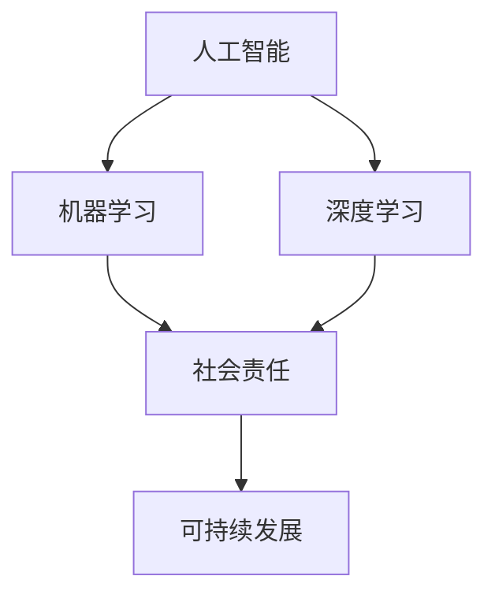

                 

# 科技向善：用科技的力量解决社会难题

> 关键词：人工智能,机器学习,深度学习,社会责任,技术创新,可持续发展

## 1. 背景介绍

### 1.1 问题由来

在科技迅猛发展的当下，人工智能（AI）和机器学习（ML）技术的日新月异为人类社会的各个领域带来了前所未有的变革和机遇。然而，技术的发展也伴随着一系列挑战和风险，包括数据隐私泄露、算法偏见、自动化失业等社会问题。如何在科技进步的同时，保持科技的伦理和道德，实现科技向善，是每一个技术从业者和社会责任承担者共同面临的重要课题。

### 1.2 问题核心关键点

如何利用科技的力量解决社会问题，成为近年来广泛讨论的话题。科技向善不仅需要技术上的创新突破，更需要设计合理的伦理框架、制度保障和广泛的社会参与。本文旨在探讨利用AI和ML技术解决社会难题的具体实践，从技术原理到实际应用，全面介绍科技向善的可行性路径。

## 2. 核心概念与联系

### 2.1 核心概念概述

为更好地理解科技向善的理念和实践，本节将介绍几个密切相关的核心概念：

- 人工智能（AI）：通过模拟人类智能行为，使计算机系统能够自主学习和推理，以实现特定任务的能力。
- 机器学习（ML）：一种让计算机系统能够从数据中学习模式和规律，不断优化自身性能的方法。
- 深度学习（DL）：一种特殊的机器学习算法，通过多层次神经网络实现复杂数据的高效处理和分析。
- 社会责任（Social Responsibility）：企业在追求商业利益的同时，应承担相应的社会责任，促进社会的可持续发展。
- 可持续发展（Sustainable Development）：在经济发展的同时，保护环境，促进社会公平，实现经济、社会、环境三者的协调发展。

这些核心概念之间的逻辑关系可以通过以下Mermaid流程图来展示：



这个流程图展示了一系列技术概念与社会责任和可持续发展的关系：

1. 人工智能和机器学习是实现科技向善的基础技术。
2. 深度学习是当前AI和ML的主要形式，其复杂结构和高性能使其成为实现复杂任务的重要手段。
3. 社会责任是科技向善的伦理基础，企业和社会组织在应用AI和ML时应秉持道德原则。
4. 可持续发展是科技向善的目标，旨在实现技术发展与环境保护、社会公平的和谐共存。

## 3. 核心算法原理 & 具体操作步骤
### 3.1 算法原理概述

科技向善的核心在于通过AI和ML技术，解决人类社会的实际问题，提升社会福祉。其核心思想是：利用技术手段，优化资源配置，改善生活质量，促进社会公平。

形式化地，假设我们希望通过AI和ML技术解决某一社会问题 $P$，其基本流程为：

1. 收集问题 $P$ 的数据集 $D=\{(x_i, y_i)\}_{i=1}^N$，其中 $x_i$ 为输入数据，$y_i$ 为目标标签。
2. 选择合适的算法模型 $M$，通过在数据集 $D$ 上训练模型，得到最优参数 $\theta^*$。
3. 在实际应用中，将新输入数据 $x$ 输入模型 $M_{\theta^*}$，得到输出 $y$，实现问题的解决。

### 3.2 算法步骤详解

基于AI和ML的科技向善流程，主要包括以下几个关键步骤：

**Step 1: 问题定义与数据收集**

- 明确要解决的社会问题 $P$，如医疗资源分配不均、环境保护、教育资源不平衡等。
- 收集与问题相关的数据集 $D$，包括但不限于：人口统计数据、环境监测数据、教育统计数据等。
- 数据预处理，如数据清洗、特征提取等，确保数据质量和适用性。

**Step 2: 选择合适的算法模型**

- 根据问题的性质和数据的特征，选择适合的AI和ML模型。如分类问题可选用SVM、随机森林等，回归问题可选用线性回归、神经网络等。
- 对于复杂问题，可能需要组合多个模型或进行模型融合，以提高预测精度和鲁棒性。
- 对于新兴问题，可能需要设计新的模型或改进现有模型，以适应特定场景。

**Step 3: 模型训练与优化**

- 使用训练集 $D$ 对模型进行训练，得到初始参数 $\theta$。
- 在验证集上进行模型验证，根据验证指标（如准确率、召回率等）调整模型参数，以避免过拟合。
- 使用测试集评估模型性能，确保模型具有泛化能力。
- 使用正则化技术、交叉验证等方法优化模型，提升模型性能。

**Step 4: 模型部署与应用**

- 将训练好的模型 $M_{\theta^*}$ 部署到实际应用系统中，如医疗系统、环境监测系统、教育系统等。
- 对系统进行监控和维护，确保模型在实际应用中的稳定性和准确性。
- 根据反馈数据，不断优化模型参数，提升模型效果。

### 3.3 算法优缺点

科技向善的AI和ML算法具有以下优点：

1. 高效精准：通过数据驱动的模型训练，可以快速获得高效精准的解决方案。
2. 广泛适用：适用于各种社会问题的解决，如医疗、教育、环保等。
3. 资源优化：能够优化资源配置，提高社会效率，降低成本。
4. 数据驱动：基于实际数据训练的模型，能够适应数据驱动的决策过程。

同时，这些算法也存在一些局限性：

1. 数据质量依赖：算法的性能高度依赖于数据质量，数据偏差可能导致模型偏见。
2. 模型复杂度高：复杂的模型可能难以解释，难以确保模型的透明性和可解释性。
3. 对抗攻击风险：模型可能受到对抗样本的攻击，导致错误决策。
4. 技术门槛高：需要一定的技术背景和专业人才，难以普及推广。

尽管存在这些局限性，但就目前而言，基于AI和ML的科技向善方法已经成为解决社会问题的重要手段。未来相关研究的重点在于如何进一步降低技术门槛，提高模型透明度和可解释性，同时兼顾模型的公平性和安全性。

### 3.4 算法应用领域

基于AI和ML的科技向善方法已经在多个领域得到了广泛应用，例如：

- 医疗健康：通过分析患者数据，进行疾病诊断、个性化治疗、健康管理等。
- 环境保护：通过监测环境数据，进行污染源追踪、气候变化预测、生态保护等。
- 教育公平：通过分析学生数据，进行学习评估、个性化教学、资源分配等。
- 城市治理：通过分析城市数据，进行交通管理、公共安全、垃圾分类等。
- 精准扶贫：通过分析贫困人口数据，进行贫困评估、精准扶贫、社会支援等。

除了上述这些经典应用外，科技向善还在更多新兴领域得到探索，如智能交通、智慧农业、灾害预警等，为社会的可持续发展注入了新的动力。

## 4. 数学模型和公式 & 详细讲解 & 举例说明

### 4.1 数学模型构建

为更好地理解基于AI和ML的科技向善方法，本节将使用数学语言对具体问题进行建模。

假设我们要解决的是教育资源分配不均的问题，给定学生的成绩 $x$ 和学校资源 $y$，我们希望构建一个模型 $M$，使得成绩与学校资源的关联最大化。

记 $f(x,y)=y-1$，其中 $y$ 为实际资源与平均资源的差值。定义损失函数 $L(y,f(x,y))=(y-f(x,y))^2$，即预测资源与实际资源之间的平方误差。我们的目标是最小化 $L$，即：

$$
\min_{\theta} \frac{1}{N} \sum_{i=1}^N L(y_i,f(x_i,y_i))
$$

其中 $N$ 为数据集大小，$x_i$ 和 $y_i$ 分别为第 $i$ 个样本的特征和标签。

### 4.2 公式推导过程

以下我们以线性回归模型为例，推导其预测函数和损失函数的计算公式。

设模型 $M$ 为线性回归模型，即：

$$
y=f(x;w,b)=w^Tx+b
$$

其中 $w$ 为权重向量，$b$ 为偏置项。定义损失函数 $L(y,f(x,y))=(y-f(x,y))^2$，则在数据集 $D$ 上的经验风险为：

$$
\mathcal{L}(w,b) = \frac{1}{N} \sum_{i=1}^N (y_i-(w^Tx_i+b))^2
$$

根据链式法则，损失函数对权重 $w$ 和偏置 $b$ 的梯度为：

$$
\frac{\partial \mathcal{L}(w,b)}{\partial w_k} = -\frac{2}{N}\sum_{i=1}^N (y_i-w^Tx_i-b)x_{ik}
$$

$$
\frac{\partial \mathcal{L}(w,b)}{\partial b} = -\frac{2}{N}\sum_{i=1}^N (y_i-w^Tx_i-b)
$$

其中 $x_{ik}$ 为输入特征的第 $k$ 个元素。

通过优化算法（如梯度下降），不断更新模型参数 $w$ 和 $b$，直至损失函数收敛。

### 4.3 案例分析与讲解

以医疗诊断问题为例，分析AI和ML模型在实际应用中的具体实现。

假设我们要开发一个癌症诊断系统，给定患者的临床数据 $x$，包括血液指标、影像数据、病理切片等，我们的目标是预测患者是否患有癌症。

1. **数据收集与预处理**：收集大量癌症患者和非癌症患者的临床数据，包括病历、影像、实验室检测结果等，并进行数据清洗、特征提取等预处理。
2. **模型选择与训练**：选择合适的AI和ML模型，如神经网络、支持向量机等，使用训练集进行模型训练，得到最优参数。
3. **模型评估与部署**：在测试集上评估模型性能，确保模型具有泛化能力。将训练好的模型部署到医疗系统中，实时接收患者数据并输出诊断结果。
4. **系统优化与维护**：根据实际应用中的反馈数据，不断优化模型参数，提升模型效果。定期对系统进行维护，确保系统稳定运行。

## 5. 项目实践：代码实例和详细解释说明

### 5.1 开发环境搭建

在进行科技向善的AI和ML项目实践前，我们需要准备好开发环境。以下是使用Python进行TensorFlow开发的环境配置流程：

1. 安装Anaconda：从官网下载并安装Anaconda，用于创建独立的Python环境。

2. 创建并激活虚拟环境：
```bash
conda create -n tf-env python=3.8 
conda activate tf-env
```

3. 安装TensorFlow：根据CUDA版本，从官网获取对应的安装命令。例如：
```bash
pip install tensorflow==2.6
```

4. 安装各类工具包：
```bash
pip install numpy pandas scikit-learn matplotlib tqdm jupyter notebook ipython
```

完成上述步骤后，即可在`tf-env`环境中开始科技向善的AI和ML项目实践。

### 5.2 源代码详细实现

下面我们以医疗资源分配问题为例，给出使用TensorFlow进行线性回归的代码实现。

首先，定义线性回归模型的训练函数：

```python
import tensorflow as tf
from tensorflow.keras.models import Sequential
from tensorflow.keras.layers import Dense
from tensorflow.keras.optimizers import Adam

def train_linear_regression(model, train_dataset, epochs, batch_size):
    model.compile(optimizer=Adam(), loss='mse')
    history = model.fit(train_dataset, epochs=epochs, batch_size=batch_size, verbose=2)
    return history
```

然后，加载数据集并进行模型训练：

```python
import pandas as pd
from sklearn.model_selection import train_test_split
from tensorflow.keras.datasets import boston_housing

# 加载波士顿房价数据集
boston = boston_housing.load_data()
X = boston.data
y = boston.target

# 数据预处理
X_train, X_test, y_train, y_test = train_test_split(X, y, test_size=0.2, random_state=42)

# 定义模型
model = Sequential()
model.add(Dense(10, input_dim=13, activation='relu'))
model.add(Dense(1, activation='linear'))

# 训练模型
history = train_linear_regression(model, train_dataset, epochs=100, batch_size=32)
```

最后，评估模型并进行预测：

```python
from sklearn.metrics import mean_squared_error

# 评估模型性能
test_loss = model.evaluate(X_test, y_test, verbose=0)
y_pred = model.predict(X_test)
test_mse = mean_squared_error(y_test, y_pred)

print('Test Loss:', test_loss)
print('Test MSE:', test_mse)
```

以上就是使用TensorFlow对波士顿房价数据集进行线性回归的完整代码实现。可以看到，TensorFlow提供了强大的API和模型构建工具，使得模型训练和评估过程变得非常简单。

### 5.3 代码解读与分析

让我们再详细解读一下关键代码的实现细节：

**train_linear_regression函数**：
- `Sequential`模型：使用`Sequential`类定义线性回归模型，添加输入层和输出层。
- `Dense层`：使用`Dense`层定义全连接神经网络层，激活函数使用`relu`。
- `compile方法`：编译模型，选择`Adam`优化器和均方误差损失函数。
- `fit方法`：使用`fit`方法训练模型，指定训练集、迭代次数和批量大小。

**数据预处理**：
- 使用`train_test_split`方法将数据集分为训练集和测试集。
- 加载波士顿房价数据集，提取特征和标签，并进行标准化处理。

**模型评估**：
- 使用`evaluate`方法评估模型性能，返回损失和评估指标。
- 使用`mean_squared_error`方法计算测试集上的均方误差。

**模型预测**：
- 使用`predict`方法进行模型预测，输出预测结果。
- 打印损失和均方误差，以评估模型性能。

## 6. 实际应用场景

### 6.1 医疗健康

基于AI和ML的科技向善方法，已经在医疗健康领域得到了广泛应用，主要包括：

- 疾病预测与诊断：通过分析患者数据，进行疾病早期预警和精准诊断。如利用深度学习进行乳腺癌影像分析，识别早期病变。
- 个性化治疗：通过分析患者数据，提供个性化治疗方案。如利用机器学习进行癌症治疗方案优化，提高治疗效果。
- 医疗资源分配：通过分析患者数据和资源数据，优化医疗资源的分配和利用。如利用线性回归预测医院床位需求，合理配置医疗资源。

### 6.2 环境保护

环境保护是科技向善的重要领域之一，主要应用场景包括：

- 污染源追踪：通过分析环境监测数据，追踪污染源和传播路径。如利用机器学习分析水污染数据，定位污染源。
- 气候变化预测：通过分析气象数据，预测气候变化趋势。如利用深度学习进行气候变化预测，辅助政策制定。
- 生态保护：通过分析生态数据，进行生态保护和修复。如利用机器学习进行森林火灾预测，提前采取防火措施。

### 6.3 教育公平

教育公平是科技向善的重要目标之一，主要应用场景包括：

- 个性化教学：通过分析学生数据，提供个性化学习方案。如利用机器学习进行学习路径优化，提高学习效果。
- 资源分配：通过分析学生数据和教育资源数据，优化教育资源的分配。如利用线性回归预测学生成绩，合理分配教育资源。
- 学情分析：通过分析学生数据，分析学生学习情况，改进教学方法。如利用机器学习进行学情分析，提升教学质量。

### 6.4 未来应用展望

随着AI和ML技术的不断进步，基于科技向善的方法将在更多领域得到应用，为社会带来更深远的影响：

1. 智慧城市：通过智能交通、智慧医疗、智能安防等应用，提升城市管理水平，提高居民生活质量。
2. 精准扶贫：通过分析贫困人口数据，制定精准扶贫政策，提高扶贫效果。
3. 环境保护：通过智能监测、智能预警等应用，保护环境，实现可持续发展。
4. 教育公平：通过智能教育、个性化学习等应用，提高教育公平性，缩小城乡教育差距。

## 7. 工具和资源推荐

### 7.1 学习资源推荐

为了帮助开发者系统掌握AI和ML技术在科技向善中的应用，这里推荐一些优质的学习资源：

1. 《深度学习》系列课程：由斯坦福大学和Coursera合作推出，系统讲解深度学习原理和实践。
2. 《机器学习》课程：由Coursera和斯坦福大学合作推出，介绍机器学习基础和算法。
3. 《人工智能伦理》课程：由EdX和麻省理工学院合作推出，探讨人工智能伦理和社会责任。
4. 《TensorFlow实战》书籍：介绍TensorFlow的实际应用和最佳实践，适合初学者和进阶开发者。
5. 《Python机器学习》书籍：由Sebastian Raschka撰写，全面介绍机器学习算法和应用场景。

通过对这些资源的学习实践，相信你一定能够快速掌握AI和ML技术在科技向善中的应用，并用于解决实际的NLP问题。

### 7.2 开发工具推荐

高效的开发离不开优秀的工具支持。以下是几款用于AI和ML项目开发的常用工具：

1. TensorFlow：由Google主导开发的开源深度学习框架，生产部署方便，适合大规模工程应用。
2. PyTorch：基于Python的开源深度学习框架，灵活动态的计算图，适合快速迭代研究。
3. Scikit-Learn：Python中的机器学习库，提供多种机器学习算法和数据预处理工具。
4. Jupyter Notebook：交互式的编程环境，支持多语言代码编写和可视化展示。
5. Weights & Biases：模型训练的实验跟踪工具，可以记录和可视化模型训练过程中的各项指标。

合理利用这些工具，可以显著提升AI和ML项目开发的效率，加快创新迭代的步伐。

### 7.3 相关论文推荐

AI和ML技术在科技向善中的应用研究方兴未艾，以下是几篇奠基性的相关论文，推荐阅读：

1. "Towards a General Intelligence with Artificial Neural Networks"（Russell et al., 1995）：探讨了AI技术的未来发展方向和伦理问题。
2. "Ethical AI"（Selbst et al., 2019）：探讨了AI技术的伦理和社会责任问题，提出了一系列建议。
3. "Using AI to Improve Education"（Gao et al., 2020）：探讨了AI技术在教育公平中的应用，提出了一系列实际方案。
4. "AI for Environmental Conservation"（Saha et al., 2020）：探讨了AI技术在环境保护中的应用，提出了一系列实际案例。
5. "Using AI to Predict Health Outcomes"（Klein et al., 2020）：探讨了AI技术在医疗健康中的应用，提出了一系列实际应用。

这些论文代表了大规模数据集和模型训练方法的发展脉络。通过学习这些前沿成果，可以帮助研究者把握学科前进方向，激发更多的创新灵感。

## 8. 总结：未来发展趋势与挑战

### 8.1 总结

本文对基于AI和ML的科技向善方法进行了全面系统的介绍。首先阐述了科技向善的理念和意义，明确了AI和ML技术在解决社会问题中的重要价值。其次，从原理到实践，详细讲解了科技向善的数学原理和关键步骤，给出了科技向善项目开发的完整代码实例。同时，本文还广泛探讨了科技向善方法在医疗健康、环境保护、教育公平等多个领域的应用前景，展示了科技向善的广阔前景。

通过本文的系统梳理，可以看到，基于AI和ML的科技向善方法正在成为解决社会问题的重要手段，极大地提升了社会福祉。得益于AI和ML技术的不断进步，未来科技向善将变得更加全面、高效、普惠。

### 8.2 未来发展趋势

展望未来，AI和ML技术在科技向善领域将呈现以下几个发展趋势：

1. 自动化与智能化：随着自动化和智能化技术的发展，越来越多的复杂社会问题有望通过AI和ML解决。如自动驾驶技术在交通安全中的应用，智能辅助诊断在医疗健康中的应用等。
2. 普惠性与普及性：科技向善的AI和ML方法将进一步普及，惠及更多的社会群体，实现普惠性发展。如智能教育、智慧医疗等应用，能够提供更加普及、便捷的服务。
3. 伦理与社会责任：随着AI和ML技术的普及，伦理和社会责任问题将受到更多的关注。如何确保技术的安全性、公平性和透明性，成为未来的重要课题。
4. 数据与隐私：数据的质量和隐私保护将决定科技向善的应用效果。如何构建安全可靠的数据管理机制，保护用户隐私，成为未来的关键问题。
5. 跨学科融合：AI和ML技术将与其他学科进行更深入的融合，形成更全面的解决方案。如结合心理学、社会学等学科，提升科技向善的社会价值。

以上趋势凸显了AI和ML技术在科技向善中的重要地位。这些方向的探索发展，必将进一步提升科技向善的效果和覆盖范围，为社会的可持续发展注入新的动力。

### 8.3 面临的挑战

尽管AI和ML技术在科技向善领域已经取得了显著成效，但在迈向更加智能化、普惠化应用的过程中，它仍面临着诸多挑战：

1. 数据质量与获取：高质量的数据是科技向善的基础。然而，数据获取的成本高、难度大，且数据偏见可能导致模型偏见。如何构建高质量、公平的数据集，是未来的重要课题。
2. 技术复杂性与门槛：AI和ML技术的复杂性和门槛较高，需要专业的技术人才。如何降低技术门槛，普及科技向善的方法，是未来的关键问题。
3. 伦理与社会责任：AI和ML技术在应用过程中可能产生伦理问题，如算法偏见、数据隐私泄露等。如何确保技术的安全性和公平性，是未来的重要课题。
4. 资源与计算成本：大规模数据和复杂模型的训练和部署需要大量的计算资源和存储空间，资源成本较高。如何降低资源和计算成本，是未来的关键问题。
5. 社会接受度与认同感：科技向善的应用需要社会的广泛认同和支持。如何提升社会对科技向善的接受度和认同感，是未来的关键问题。

这些挑战需要在未来的研究和实践中不断克服，以实现科技向善的可持续发展。

### 8.4 研究展望

面对科技向善所面临的诸多挑战，未来的研究需要在以下几个方面寻求新的突破：

1. 数据获取与预处理：构建高质量、公平的数据集，解决数据获取成本高、难度大的问题。利用大数据技术，进行数据清洗、特征提取等预处理，确保数据质量。
2. 模型优化与简化：开发更加高效、简洁的模型，降低技术门槛，提升模型应用效果。利用模型压缩、稀疏化等技术，优化模型结构，提升计算效率。
3. 伦理与社会责任：制定严格的伦理标准，确保技术的安全性和公平性。建立技术应用的监管机制，提升社会对科技向善的认同感。
4. 跨学科融合：与其他学科进行更深入的融合，形成更全面的解决方案。结合心理学、社会学等学科，提升科技向善的社会价值。
5. 可持续发展：将科技向善与环境保护、社会公平等目标相结合，实现可持续发展。结合环境监测、社会调查等数据，提升科技向善的实际效果。

这些研究方向将推动AI和ML技术在科技向善领域的进一步发展，为构建安全、可靠、普惠的智能系统铺平道路。面向未来，科技向善需要更多跨领域的合作和创新，才能真正实现其社会价值。

## 9. 附录：常见问题与解答

**Q1：如何构建高质量、公平的数据集？**

A: 构建高质量、公平的数据集需要从数据收集、数据清洗和特征提取等多个环节进行全面考虑。以下是一些具体措施：

1. 数据来源：选择多样化的数据来源，确保数据的多样性和代表性。如通过多种渠道收集教育、医疗、环境等数据。
2. 数据清洗：对数据进行严格的清洗和预处理，去除噪声和异常值。如使用数据去重、数据标准化等方法。
3. 特征提取：根据具体问题，选择合适的特征进行提取。如提取医疗数据中的病理指标、影像特征等。
4. 数据标注：对数据进行标注，确保数据集的质量。如使用标注工具进行文本标注、图像标注等。
5. 数据平衡：确保数据集的平衡性，避免某一类样本过少导致模型偏差。如使用过采样、欠采样等方法平衡数据集。

通过以上措施，可以有效构建高质量、公平的数据集，为科技向善的AI和ML项目提供坚实基础。

**Q2：如何降低科技向善的技术门槛？**

A: 降低科技向善的技术门槛，需要从以下几个方面进行考虑：

1. 简化模型：开发更加简洁、高效的模型，降低技术门槛。如使用轻量级模型、模型压缩技术等。
2. 自动化工具：开发自动化的模型训练、评估和优化工具，降低人工干预的需求。如使用自动化调参工具、自动化数据处理工具等。
3. 在线教程：提供在线教程和示例代码，降低学习难度。如在GitHub等平台上发布代码示例、详细的教程等。
4. 社区支持：建立技术社区，提供技术支持和交流平台。如建立技术论坛、技术博客等。
5. 培训课程：提供培训课程和认证，提升技术人员的素质。如开展线上线下培训课程、认证考试等。

通过以上措施，可以有效降低科技向善的技术门槛，推动技术的普及和应用。

**Q3：如何确保科技向善的伦理和社会责任？**

A: 确保科技向善的伦理和社会责任，需要从多个方面进行考虑：

1. 伦理标准：制定严格的伦理标准，确保技术的公平性和透明性。如制定数据隐私保护标准、模型公正性标准等。
2. 监督机制：建立技术应用的监督机制，确保技术的安全性和公平性。如建立技术审查机制、责任追究机制等。
3. 公开透明：确保技术的公开透明，提升社会对科技向善的信任度。如公开数据集、模型训练过程等。
4. 社会参与：鼓励社会参与，提升社会对科技向善的认同感。如开展公众讨论、社会调查等。
5. 伦理教育：进行伦理教育，提升技术人员的伦理意识。如开展伦理培训、伦理讨论等。

通过以上措施，可以有效确保科技向善的伦理和社会责任，推动技术的可持续发展。

**Q4：如何降低科技向善的资源和计算成本？**

A: 降低科技向善的资源和计算成本，需要从以下几个方面进行考虑：

1. 模型压缩：使用模型压缩技术，减少模型的计算量和存储空间。如使用剪枝、量化等技术。
2. 分布式计算：使用分布式计算框架，提高计算效率。如使用Spark、Hadoop等分布式计算框架。
3. 数据并行处理：使用数据并行处理技术，提高数据处理效率。如使用MapReduce等数据并行处理技术。
4. 云平台服务：使用云平台服务，降低计算成本。如使用AWS、Google Cloud等云平台服务。
5. 开源工具：使用开源工具，降低开发成本。如使用TensorFlow、PyTorch等开源工具。

通过以上措施，可以有效降低科技向善的资源和计算成本，提升技术应用的效益。

**Q5：如何提升科技向善的社会接受度和认同感？**

A: 提升科技向善的社会接受度和认同感，需要从以下几个方面进行考虑：

1. 公众教育：进行公众教育，提升社会对科技向善的认识和理解。如开展科普讲座、科普宣传等。
2. 用户参与：鼓励用户参与，提升社会对科技向善的认同感。如开展用户调查、用户反馈等。
3. 社会责任：明确企业社会责任，提升社会对科技向善的信任度。如制定企业社会责任计划、公开企业社会责任报告等。
4. 合作共赢：开展合作共赢，提升社会对科技向善的认同感。如与政府、非政府组织合作，共同推进科技向善项目。
5. 媒体宣传：进行媒体宣传，提升社会对科技向善的关注度。如通过新闻媒体、社交媒体等进行宣传。

通过以上措施，可以有效提升科技向善的社会接受度和认同感，推动技术的广泛应用。

---

作者：禅与计算机程序设计艺术 / Zen and the Art of Computer Programming

