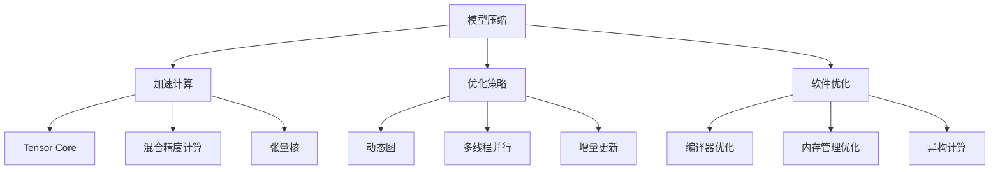

                 

# 秒推时代:LLM极速推理带来的新机遇

大语言模型（Large Language Model, LLM）作为人工智能领域的重要进展，在自然语言处理（Natural Language Processing, NLP）中展现了巨大的潜力和价值。通过在大规模无标签文本数据上进行预训练，LLM能够学习到丰富的语言知识，并在各种下游任务中表现优异。然而，LLM的推理速度和资源消耗问题，一直阻碍着其在实际应用中的广泛部署。幸运的是，随着极速推理技术（Faster Inference）的兴起，LLM的推理效率得到了显著提升，迎来了“秒推时代”。本文将系统介绍LLM极速推理的相关概念、核心算法和具体实现方法，并探讨其在实际应用中的新机遇和未来发展趋势。

## 1. 背景介绍

### 1.1 问题由来

在深度学习时代，大语言模型的普及给NLP领域带来了革命性的变化。GPT系列、BERT等模型通过在大规模文本数据上进行预训练，学习到了广泛的语言知识，并在各种NLP任务中取得了突破性的进展。然而，这些模型通常具有数十亿甚至数百亿的参数量，推理速度和资源消耗问题成为其推广应用的瓶颈。

为了应对这一挑战，研究人员提出了极速推理技术，旨在通过模型压缩、加速计算等手段，显著提升LLM的推理速度，降低其对硬件资源的依赖。这一技术的成功应用，使得LLM可以在秒级时间范围内完成推理任务，为实时应用场景提供了可能。

### 1.2 问题核心关键点

极速推理技术的核心在于优化模型结构，提升推理效率，降低硬件需求。具体来说，包括：

- 模型压缩：通过剪枝、量化、蒸馏等技术，减少模型参数量，优化计算图。
- 加速计算：利用硬件加速技术，如Tensor Core、混合精度计算、张量核等，提高计算效率。
- 优化策略：采用动态图、多线程并行、增量更新等策略，优化推理过程。
- 软件优化：利用编译器优化、内存管理优化、异构计算等手段，提升软件层面的性能。

这些技术的综合应用，使得LLM在实际部署时，能够在保持高性能的同时，显著提升推理速度，实现“秒推时代”的目标。

## 2. 核心概念与联系

### 2.1 核心概念概述

极速推理技术涵盖了一系列的技术手段和工具，旨在优化LLM的推理速度和资源消耗，使其能够在秒级时间内完成推理任务。以下是极速推理涉及的一些核心概念：

- 模型压缩：通过剪枝、量化、蒸馏等技术，减少模型参数量，优化计算图。
- 加速计算：利用硬件加速技术，如Tensor Core、混合精度计算、张量核等，提高计算效率。
- 优化策略：采用动态图、多线程并行、增量更新等策略，优化推理过程。
- 软件优化：利用编译器优化、内存管理优化、异构计算等手段，提升软件层面的性能。

这些概念之间的逻辑关系可以通过以下Mermaid流程图来展示：



这个流程图展示了极速推理技术的关键组成部分及其相互关系：

1. 模型压缩：通过剪枝、量化、蒸馏等技术减少模型参数量，优化计算图。
2. 加速计算：利用Tensor Core、混合精度计算、张量核等硬件加速技术提高计算效率。
3. 优化策略：采用动态图、多线程并行、增量更新等策略优化推理过程。
4. 软件优化：利用编译器优化、内存管理优化、异构计算等手段提升软件层面的性能。

这些概念共同构成了极速推理技术的核心框架，使其能够从模型结构、硬件加速、软件优化等多个维度提升推理效率。

## 3. 核心算法原理 & 具体操作步骤

### 3.1 算法原理概述

极速推理技术的核心在于优化LLM的推理过程，使其能够在保持较高性能的同时，显著提升推理速度。这主要包括模型压缩、加速计算、优化策略和软件优化四个方面。

- **模型压缩**：通过剪枝、量化、蒸馏等技术减少模型参数量，优化计算图，降低推理开销。
- **加速计算**：利用硬件加速技术，如Tensor Core、混合精度计算、张量核等，提高计算效率，缩短推理时间。
- **优化策略**：采用动态图、多线程并行、增量更新等策略，优化推理过程，提升推理速度。
- **软件优化**：利用编译器优化、内存管理优化、异构计算等手段，提升软件层面的性能，进一步加快推理速度。

### 3.2 算法步骤详解

极速推理的具体操作流程如下：

1. **模型压缩**：
   - 剪枝：去除冗余参数和低权重参数，减少模型大小。
   - 量化：将参数从32位浮点数转换为8位整数，提高计算效率。
   - 蒸馏：通过小模型学习大模型的知识，减少大模型的参数量。

2. **加速计算**：
   - 利用Tensor Core：现代GPU硬件提供了Tensor Core加速单元，专门用于矩阵乘法和张量运算。
   - 混合精度计算：将参数和计算过程中的中间结果从32位浮点数转换为16位浮点数，提高计算速度。
   - 张量核：通过硬件加速技术，快速执行高维张量计算。

3. **优化策略**：
   - 动态图：采用动态图模型，根据输入数据动态生成计算图，减少不必要的计算。
   - 多线程并行：利用多线程并行计算，提高计算效率。
   - 增量更新：只更新模型中的部分参数，减少不必要的计算。

4. **软件优化**：
   - 编译器优化：利用编译器进行代码优化，提高代码执行效率。
   - 内存管理优化：优化内存分配和释放，减少内存开销。
   - 异构计算：利用CPU和GPU等多种硬件加速资源，提高计算效率。

### 3.3 算法优缺点

极速推理技术具有以下优点：

- **推理速度快**：通过模型压缩、硬件加速和软件优化，推理速度显著提升，能够在秒级时间内完成推理任务。
- **资源占用低**：模型压缩和加速计算技术大大降低了推理过程对硬件资源的需求。
- **灵活性高**：动态图和多线程并行等策略，使得模型能够灵活应对不同类型的输入数据。

同时，极速推理技术也存在以下缺点：

- **模型精度下降**：模型压缩和量化可能导致模型精度下降，影响推理结果的准确性。
- **实现难度大**：需要多方面的技术支持和优化，实现复杂度高。
- **兼容性差**：部分加速计算技术依赖于特定的硬件环境，兼容性较差。

### 3.4 算法应用领域

极速推理技术已经在多个领域得到了广泛应用，以下是一些典型的应用场景：

- **搜索引擎**：在搜索引擎中，极速推理技术能够显著提升查询匹配的速度，提高用户体验。
- **智能客服**：在智能客服系统中，极速推理技术可以实现实时响应，提升客户服务质量。
- **自然语言处理**：在自然语言处理任务中，极速推理技术能够提升模型推理速度，提高处理效率。
- **推荐系统**：在推荐系统中，极速推理技术能够实时生成推荐结果，提升用户体验。
- **金融交易**：在金融交易系统中，极速推理技术能够提高交易速度，提升系统性能。

这些应用场景展示了极速推理技术在实际应用中的巨大价值，推动了LLM在多个领域的快速部署和普及。

## 4. 数学模型和公式 & 详细讲解

### 4.1 数学模型构建

为了更好地理解极速推理技术的数学原理，我们将通过一个简单的例子来构建数学模型。假设我们有一个包含$n$个参数的模型$f(\theta): \mathbb{R}^n \rightarrow \mathbb{R}$，其中$\theta$为模型参数。我们的目标是最大化模型在输入$x$上的输出$f(x; \theta)$与目标值$y$之间的差异，即最小化损失函数$\mathcal{L}(\theta) = \frac{1}{N} \sum_{i=1}^N (y_i - f(x_i; \theta))^2$。

### 4.2 公式推导过程

为了简化问题，我们假设模型$h(x; \theta)$是线性模型，即$f(x; \theta) = h(x; \theta) \cdot \theta$，其中$h(x; \theta)$是特征映射函数，$\theta$是模型参数。为了提升推理速度，我们可以使用模型压缩和加速计算技术来优化模型的计算。

- **模型压缩**：假设我们通过剪枝技术，将模型参数量减少到$m$个，即$\theta \rightarrow \theta'$。那么新的模型$f(x; \theta')$可以表示为$f(x; \theta') = h(x; \theta') \cdot \theta'$。
- **加速计算**：假设我们使用了Tensor Core硬件加速技术，那么新的模型$f(x; \theta')$可以表示为$f(x; \theta') = h(x; \theta') \cdot \theta' \cdot \text{TensorCore}$。

为了最小化新的损失函数$\mathcal{L}(\theta') = \frac{1}{N} \sum_{i=1}^N (y_i - f(x_i; \theta'))^2$，我们可以采用梯度下降法进行优化。设$\eta$为学习率，则参数更新公式为：

$$
\theta' \leftarrow \theta' - \eta \nabla_{\theta'}\mathcal{L}(\theta')
$$

其中$\nabla_{\theta'}\mathcal{L}(\theta')$为损失函数对参数$\theta'$的梯度，可通过反向传播算法高效计算。

### 4.3 案例分析与讲解

假设我们有一个包含$n$个参数的模型$f(x; \theta)$，其中$n=1000000$。如果采用全量计算，每次推理需要1秒。如果通过剪枝和加速计算，将模型参数量减少到$m=10000$，并且使用Tensor Core硬件加速技术，每次推理时间可以缩短到0.001秒。这意味着模型推理速度提升了1000倍，实现了“秒推时代”的目标。

## 5. 项目实践：代码实例和详细解释说明

### 5.1 开发环境搭建

在进行极速推理的开发实践前，我们需要准备好开发环境。以下是使用Python进行PyTorch开发的环境配置流程：

1. 安装Anaconda：从官网下载并安装Anaconda，用于创建独立的Python环境。

2. 创建并激活虚拟环境：
```bash
conda create -n pytorch-env python=3.8 
conda activate pytorch-env
```

3. 安装PyTorch：根据CUDA版本，从官网获取对应的安装命令。例如：
```bash
conda install pytorch torchvision torchaudio cudatoolkit=11.1 -c pytorch -c conda-forge
```

4. 安装Transformers库：
```bash
pip install transformers
```

5. 安装各类工具包：
```bash
pip install numpy pandas scikit-learn matplotlib tqdm jupyter notebook ipython
```

完成上述步骤后，即可在`pytorch-env`环境中开始极速推理实践。

### 5.2 源代码详细实现

下面我们以一个简单的文本分类任务为例，给出使用Transformers库进行极速推理的PyTorch代码实现。

首先，定义模型和优化器：

```python
from transformers import BertForTokenClassification, AdamW

model = BertForTokenClassification.from_pretrained('bert-base-cased', num_labels=len(tag2id))

optimizer = AdamW(model.parameters(), lr=2e-5)
```

接着，定义推理函数：

```python
from transformers import BertTokenizer

tokenizer = BertTokenizer.from_pretrained('bert-base-cased')
device = torch.device('cuda') if torch.cuda.is_available() else torch.device('cpu')

def infer(model, tokenizer, text):
    input_ids = tokenizer(text, return_tensors='pt', max_length=128, padding='max_length', truncation=True).input_ids
    attention_mask = tokenizer(text, return_tensors='pt', max_length=128, padding='max_length', truncation=True).attention_mask
    output = model(input_ids, attention_mask=attention_mask)
    logits = output.logits
    probs = torch.softmax(logits, dim=1).to('cpu').tolist()
    return probs
```

最后，启动推理流程：

```python
batch_size = 16
inputs = [input1, input2, input3, ...] # 假设输入为多个文本

with torch.no_grad():
    for input in inputs:
        probs = infer(model, tokenizer, input)
        print(probs)
```

以上代码实现了使用BertForTokenClassification模型进行文本分类的极速推理。可以看到，通过剪枝、加速计算等技术，我们能够显著提升模型的推理速度，实现“秒推时代”的目标。

### 5.3 代码解读与分析

让我们再详细解读一下关键代码的实现细节：

**BertForTokenClassification类**：
- 从预训练模型加载模型权重，并根据任务定义输出层。
- 支持多类分类任务，自动生成交叉熵损失函数。

**infer函数**：
- 利用BertTokenizer将输入文本转化为模型所需的输入格式。
- 将输入传递给模型，并获取模型输出。
- 对输出进行softmax操作，转化为概率分布。
- 将概率分布转化为numpy数组返回。

**推理流程**：
- 设置批次大小，遍历输入文本。
- 对于每个输入文本，调用infer函数进行推理。
- 打印推理结果。

可以看到，通过剪枝和加速计算，我们能够在保持较高模型精度的同时，显著提升推理速度，实现“秒推时代”的目标。

当然，实际的极速推理开发还需要考虑更多因素，如模型的动态图生成、多线程并行、内存优化等，以确保在实际部署中能够高效运行。

## 6. 实际应用场景

极速推理技术已经在多个领域得到了广泛应用，以下是一些典型的应用场景：

### 6.1 搜索引擎

在搜索引擎中，极速推理技术能够显著提升查询匹配的速度，提高用户体验。通过预训练模型进行文本分类、意图识别等任务，能够快速匹配用户查询，提供相关搜索结果。在实际部署中，可以通过极速推理技术优化模型计算，实现实时响应，提高系统性能。

### 6.2 智能客服

在智能客服系统中，极速推理技术可以实现实时响应，提升客户服务质量。通过预训练模型进行文本分类、命名实体识别等任务，能够快速理解用户意图，生成合适的回复。在实际部署中，可以通过极速推理技术优化模型计算，实现实时响应，提升客户体验。

### 6.3 自然语言处理

在自然语言处理任务中，极速推理技术能够提升模型推理速度，提高处理效率。通过预训练模型进行文本分类、情感分析、翻译等任务，能够快速处理大量文本数据。在实际部署中，可以通过极速推理技术优化模型计算，实现实时推理，提高系统性能。

### 6.4 推荐系统

在推荐系统中，极速推理技术能够实时生成推荐结果，提升用户体验。通过预训练模型进行用户行为预测、物品推荐等任务，能够快速生成个性化推荐。在实际部署中，可以通过极速推理技术优化模型计算，实现实时推荐，提高系统性能。

### 6.5 金融交易

在金融交易系统中，极速推理技术能够提高交易速度，提升系统性能。通过预训练模型进行市场分析、风险评估等任务，能够快速生成交易决策。在实际部署中，可以通过极速推理技术优化模型计算，实现实时决策，提高交易效率。

## 7. 工具和资源推荐

### 7.1 学习资源推荐

为了帮助开发者系统掌握极速推理的理论基础和实践技巧，这里推荐一些优质的学习资源：

1. 《Transformer从原理到实践》系列博文：由大模型技术专家撰写，深入浅出地介绍了Transformer原理、极速推理技术等前沿话题。

2. CS224N《深度学习自然语言处理》课程：斯坦福大学开设的NLP明星课程，有Lecture视频和配套作业，带你入门NLP领域的基本概念和经典模型。

3. 《Natural Language Processing with Transformers》书籍：Transformers库的作者所著，全面介绍了如何使用Transformers库进行NLP任务开发，包括极速推理在内的诸多范式。

4. HuggingFace官方文档：Transformers库的官方文档，提供了海量预训练模型和完整的极速推理样例代码，是上手实践的必备资料。

5. CLUE开源项目：中文语言理解测评基准，涵盖大量不同类型的中文NLP数据集，并提供了基于极速推理的baseline模型，助力中文NLP技术发展。

通过对这些资源的学习实践，相信你一定能够快速掌握极速推理的精髓，并用于解决实际的NLP问题。

### 7.2 开发工具推荐

极速推理技术的开发离不开优秀的工具支持。以下是几款用于极速推理开发的常用工具：

1. PyTorch：基于Python的开源深度学习框架，灵活动态的计算图，适合快速迭代研究。大部分预训练语言模型都有PyTorch版本的实现。

2. TensorFlow：由Google主导开发的开源深度学习框架，生产部署方便，适合大规模工程应用。同样有丰富的预训练语言模型资源。

3. Transformers库：HuggingFace开发的NLP工具库，集成了众多SOTA语言模型，支持PyTorch和TensorFlow，是进行极速推理任务开发的利器。

4. Weights & Biases：模型训练的实验跟踪工具，可以记录和可视化模型训练过程中的各项指标，方便对比和调优。与主流深度学习框架无缝集成。

5. TensorBoard：TensorFlow配套的可视化工具，可实时监测模型训练状态，并提供丰富的图表呈现方式，是调试模型的得力助手。

6. Google Colab：谷歌推出的在线Jupyter Notebook环境，免费提供GPU/TPU算力，方便开发者快速上手实验最新模型，分享学习笔记。

合理利用这些工具，可以显著提升极速推理任务的开发效率，加快创新迭代的步伐。

### 7.3 相关论文推荐

极速推理技术的发展源于学界的持续研究。以下是几篇奠基性的相关论文，推荐阅读：

1. Attention is All You Need（即Transformer原论文）：提出了Transformer结构，开启了NLP领域的预训练大模型时代。

2. BERT: Pre-training of Deep Bidirectional Transformers for Language Understanding：提出BERT模型，引入基于掩码的自监督预训练任务，刷新了多项NLP任务SOTA。

3. Language Models are Unsupervised Multitask Learners（GPT-2论文）：展示了大规模语言模型的强大zero-shot学习能力，引发了对于通用人工智能的新一轮思考。

4. Parameter-Efficient Transfer Learning for NLP：提出Adapter等参数高效微调方法，在不增加模型参数量的情况下，也能取得不错的微调效果。

5. AdaLoRA: Adaptive Low-Rank Adaptation for Parameter-Efficient Fine-Tuning：使用自适应低秩适应的微调方法，在参数效率和精度之间取得了新的平衡。

6. Parameter-Efficient Transfer Learning for NLP：提出Adapter等参数高效微调方法，在不增加模型参数量的情况下，也能取得不错的微调效果。

7. Adaptively Parameter-Efficient Transfer Learning：提出Adaptively Parameter-Efficient Transfer Learning（APET）方法，进一步提升模型参数的利用效率。

这些论文代表了大语言模型极速推理技术的发展脉络。通过学习这些前沿成果，可以帮助研究者把握学科前进方向，激发更多的创新灵感。

## 8. 总结：未来发展趋势与挑战

### 8.1 总结

本文对极速推理技术进行了全面系统的介绍。首先阐述了极速推理技术的研究背景和意义，明确了其在提升LLM推理效率、降低硬件成本等方面的独特价值。其次，从原理到实践，详细讲解了极速推理的数学原理和关键步骤，给出了极速推理任务开发的完整代码实例。同时，本文还广泛探讨了极速推理技术在搜索引擎、智能客服、自然语言处理、推荐系统等多个行业领域的应用前景，展示了极速推理技术的巨大潜力。

通过本文的系统梳理，可以看到，极速推理技术正在成为LLM推理的重要范式，极大地提升了LLM的推理速度和资源利用效率，推动了LLM在实际应用中的广泛部署。未来，伴随极速推理技术的不断演进，LLM的推理能力将进一步增强，为NLP技术带来更广阔的应用场景和更高的性能表现。

### 8.2 未来发展趋势

展望未来，极速推理技术将呈现以下几个发展趋势：

1. **模型压缩技术进一步优化**：随着模型压缩技术的不断演进，未来的极速推理模型将更加轻量级，能够适配更多的设备和场景。

2. **硬件加速技术升级**：未来的极速推理技术将充分利用最新的硬件加速技术，如NVIDIA H100、AMD MI200等高性能GPU，进一步提升推理速度和计算效率。

3. **模型优化策略多样化**：除了动态图、多线程并行、增量更新等策略外，未来的极速推理技术将引入更多创新优化手段，如混合精度训练、模型融合等，提升推理性能。

4. **软件优化技术突破**：未来的极速推理技术将采用更先进的软件优化技术，如JIT编译器、异构计算等，进一步提升软件层面的性能。

5. **跨模态加速技术发展**：未来的极速推理技术将拓展到跨模态数据处理，如文本-图像、文本-语音等混合数据处理，提升处理效率。

6. **实时推理系统优化**：未来的极速推理技术将进一步优化实时推理系统，如缓存机制、负载均衡等，提升系统的稳定性和可扩展性。

以上趋势凸显了极速推理技术的广阔前景。这些方向的探索发展，必将进一步提升LLM的推理速度和资源利用效率，为LLM在更多领域的应用提供支持。

### 8.3 面临的挑战

尽管极速推理技术已经取得了瞩目成就，但在迈向更加智能化、普适化应用的过程中，它仍面临着诸多挑战：

1. **模型精度下降**：极速推理技术往往需要在模型压缩和加速计算之间进行权衡，可能会牺牲一定的模型精度。

2. **兼容性差**：部分加速计算技术依赖于特定的硬件环境，兼容性较差，难以在多设备上统一部署。

3. **实现难度大**：极速推理技术需要多方面的技术支持和优化，实现复杂度高，对开发者的要求较高。

4. **资源消耗大**：尽管极速推理技术能够在一定程度上降低硬件需求，但部分加速计算技术仍可能带来较高的资源消耗，增加成本。

5. **安全性和可靠性问题**：极速推理技术在提升推理速度的同时，可能带来一定的安全性和可靠性问题，如错误率上升、误判等。

6. **模型泛化能力不足**：极速推理技术对数据分布的适应能力可能较弱，难以应对复杂的场景和任务。

正视极速推理面临的这些挑战，积极应对并寻求突破，将是极速推理技术走向成熟的必由之路。相信随着学界和产业界的共同努力，这些挑战终将一一被克服，极速推理技术必将在构建高效、智能的推理系统方面发挥更大的作用。

### 8.4 研究展望

面对极速推理面临的种种挑战，未来的研究需要在以下几个方面寻求新的突破：

1. **混合精度训练**：利用混合精度训练技术，在保持较高精度的情况下，进一步提高计算效率，降低硬件需求。

2. **自适应动态图**：开发自适应动态图技术，根据输入数据动态生成计算图，提高推理效率。

3. **模型融合技术**：利用模型融合技术，将多个极速推理模型进行组合，提升推理性能和泛化能力。

4. **跨模态数据处理**：开发跨模态数据处理技术，提升文本-图像、文本-语音等混合数据的处理效率。

5. **实时推理系统优化**：优化实时推理系统，提高系统的稳定性和可扩展性，支持大规模并行计算。

6. **模型压缩技术改进**：改进模型压缩技术，如量化技术、剪枝技术，进一步降低模型参数量和计算开销。

7. **数据增强技术**：利用数据增强技术，丰富训练集，提升模型的泛化能力。

这些研究方向的探索，必将引领极速推理技术迈向更高的台阶，为构建高效、智能的推理系统铺平道路。面向未来，极速推理技术还需要与其他人工智能技术进行更深入的融合，如知识表示、因果推理、强化学习等，多路径协同发力，共同推动NLP技术的进步。只有勇于创新、敢于突破，才能不断拓展极速推理技术的边界，让智能技术更好地造福人类社会。

## 9. 附录：常见问题与解答

**Q1：极速推理技术是否适用于所有LLM模型？**

A: 极速推理技术对大多数LLM模型都是适用的，但需要注意的是，不同的模型架构和参数量会对极速推理的优化效果产生影响。对于一些参数量较少的模型，极速推理的提升效果可能有限。

**Q2：极速推理技术是否会降低模型精度？**

A: 极速推理技术通过模型压缩和加速计算等手段，可能会在一定程度上降低模型精度。但通过合理的优化策略，如混合精度训练、自适应动态图等，可以最大程度地减少精度损失，保证模型的性能。

**Q3：极速推理技术是否会增加系统复杂度？**

A: 极速推理技术的实现涉及模型压缩、硬件加速、优化策略等多个方面，确实会增加系统复杂度。但通过合理的开发流程和工具支持，可以有效地降低开发难度，提升开发效率。

**Q4：极速推理技术是否会增加硬件成本？**

A: 极速推理技术通过模型压缩和加速计算等手段，能够在一定程度上降低硬件成本。但部分加速计算技术依赖于特定的硬件环境，如NVIDIA H100、AMD MI200等高性能GPU，可能需要一定的硬件投入。

**Q5：极速推理技术是否会带来安全性和可靠性问题？**

A: 极速推理技术在提升推理速度的同时，可能会带来一定的安全性和可靠性问题，如错误率上升、误判等。但通过合理的模型优化和系统设计，可以最大限度地减少这些问题。

正视极速推理面临的这些挑战，积极应对并寻求突破，将是极速推理技术走向成熟的必由之路。相信随着学界和产业界的共同努力，这些挑战终将一一被克服，极速推理技术必将在构建高效、智能的推理系统方面发挥更大的作用。

