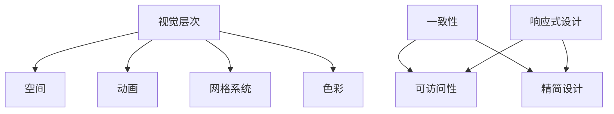
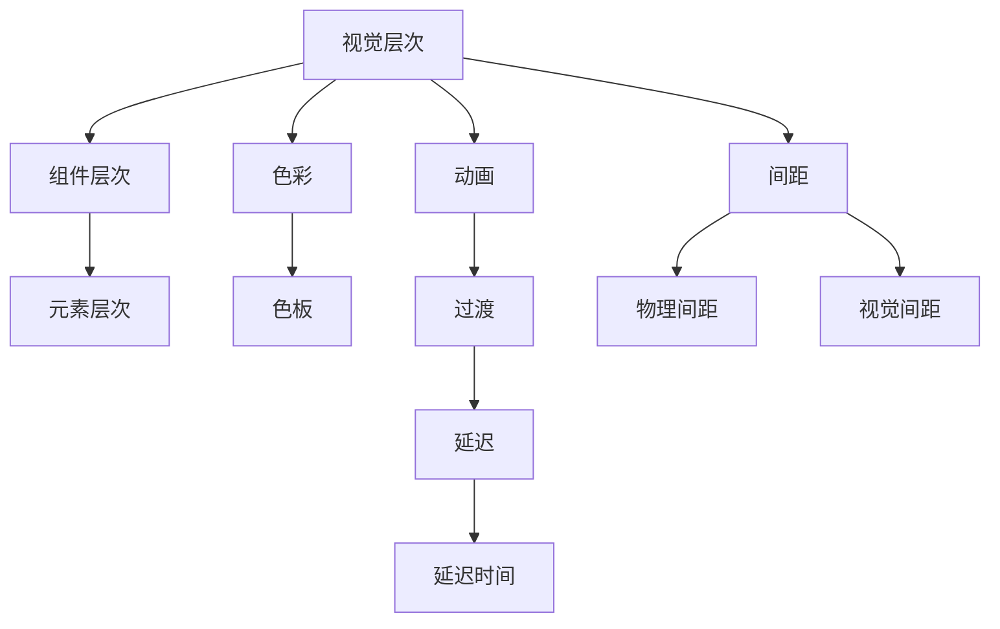

                 

# 移动应用UI/UX设计：Material Design与iOS设计规范

> 关键词：移动应用，UI设计，UX设计，Material Design，iOS设计规范

## 1. 背景介绍

### 1.1 问题由来
移动应用的用户体验（User Experience，UX）和用户界面（User Interface，UI）设计是决定用户满意度和留存率的关键因素。随着智能手机的普及和用户对交互体验的要求不断提高，移动应用的UI/UX设计也变得越来越重要。

现代移动应用的UI/UX设计涉及多种设计理论和规范，其中 Material Design 和 iOS 设计规范是两个重要的设计范式。Material Design 由 Google 提出，旨在通过统一的视觉语言和交互规则，提升移动应用的易用性和美观度。iOS 设计规范则由 Apple 制定，专注于在 iOS 平台上实现统一、流畅的用户体验。

本文将系统地介绍 Material Design 和 iOS 设计规范的核心概念和设计原则，并通过实际案例详细讲解如何将这些设计原则应用于移动应用开发。

### 1.2 问题核心关键点
- 移动应用的 UI/UX 设计
- Material Design 和 iOS 设计规范
- 设计原则和实践方法
- UI/UX 设计的工具和资源

## 2. 核心概念与联系

### 2.1 核心概念概述

Material Design 和 iOS 设计规范涉及许多核心概念，这些概念贯穿于 UI/UX 设计的各个方面。以下是一些关键概念及其定义：

- **视觉层次（Visual Hierarchy）**：通过大小、颜色、位置等视觉元素的差异，引导用户注意力的设计原则。
- **空间（Space）**：使用空间来分隔不同功能和组件，提高界面的可读性和可用性。
- **动画（Animation）**：通过流畅的动画效果增强用户交互的体验。
- **网格系统（Grid System）**：通过网格布局规则保持界面的一致性和可预测性。
- **色彩（Color）**：通过合理使用颜色增强界面的视觉吸引力。

iOS 设计规范则强调以下几点：

- **一致性（Consistency）**：在 iOS 平台上保持界面元素的一致性，确保用户在不同设备上获得一致的体验。
- **可访问性（Accessibility）**：确保移动应用对所有用户（包括残障人士）都是可访问的。
- **精简设计（Simplicity）**：避免不必要的视觉元素，保持界面简洁明了。
- **响应式设计（Responsive Design）**：设计适用于不同尺寸屏幕的用户界面。

这些概念之间的逻辑关系可以通过以下 Mermaid 流程图来展示：



这个流程图展示了Material Design和iOS设计规范中的关键概念及其关系。

### 2.2 核心概念原理和架构的 Mermaid 流程图



以上流程图展示了Material Design中视觉层次的构建过程，从组件层次到元素层次，再到色彩和动画的应用，最终形成一套完整的视觉设计语言。

## 3. 核心算法原理 & 具体操作步骤

### 3.1 算法原理概述

Material Design 和 iOS 设计规范的核心算法原理主要集中在以下几个方面：

- **布局设计（Layout Design）**：通过网格系统、视觉层次和空间等概念，合理布局界面元素。
- **交互设计（Interaction Design）**：通过动画、过渡、延迟等设计元素，增强用户交互体验。
- **色彩设计（Color Design）**：通过色彩系统，合理使用颜色，增强界面的视觉吸引力。
- **可访问性设计（Accessibility Design）**：确保移动应用对所有用户都是可访问的，包括色盲用户和残障人士。

iOS 设计规范的核心算法原理则强调以下几点：

- **一致性设计（Consistent Design）**：保持界面元素的一致性，确保用户在不同设备上获得一致的体验。
- **精简设计（Simplified Design）**：避免不必要的视觉元素，保持界面简洁明了。
- **响应式设计（Responsive Design）**：设计适用于不同尺寸屏幕的用户界面。

### 3.2 算法步骤详解

Material Design 和 iOS 设计规范的实现步骤一般包括以下几个关键步骤：

**Step 1: 理解设计原则**

1. **视觉层次设计**：
   - **大元素优先**：通过大小和颜色差异，引导用户注意大元素。
   - **层级关系**：通过层级关系明确不同元素的重要性。
   - **分组和分块**：将相关元素分组，增强界面的可读性。

2. **空间设计**：
   - **边界和边缘**：使用边界和边缘分隔不同功能和组件。
   - **间距**：通过合理的间距增强界面的可读性。

3. **动画设计**：
   - **过渡和延迟**：使用过渡和延迟增强用户的交互体验。
   - **交互反馈**：通过反馈增强用户的感知。

4. **色彩设计**：
   - **色彩系统**：使用色彩系统增强界面的视觉吸引力。

**Step 2: 实现设计**

1. **布局设计**：
   - **网格系统**：使用网格系统保持界面的一致性和可预测性。
   - **对齐和间距**：通过对齐和间距增强界面的整齐度。

2. **交互设计**：
   - **动画**：使用流畅的动画效果增强用户的交互体验。
   - **反馈**：通过反馈增强用户的感知。

3. **色彩设计**：
   - **色彩系统**：使用色彩系统增强界面的视觉吸引力。

**Step 3: 测试和优化**

1. **测试**：
   - **可用性测试**：通过用户测试确保界面设计的合理性。
   - **性能测试**：确保界面的响应速度和稳定性。

2. **优化**：
   - **调整布局和设计**：根据测试结果调整布局和设计。
   - **优化性能**：优化界面的性能，提高用户体验。

### 3.3 算法优缺点

Material Design 和 iOS 设计规范具有以下优点：

- **一致性**：通过统一的设计语言，提高界面的易用性和美观度。
- **可访问性**：确保移动应用对所有用户都是可访问的，包括残障人士。
- **响应式设计**：设计适用于不同尺寸屏幕的用户界面。

但这些设计规范也存在一些缺点：

- **学习成本**：需要花费大量时间和精力学习和应用这些设计原则。
- **灵活性不足**：在某些情况下，这些设计规范可能过于严格，限制了设计的灵活性。

### 3.4 算法应用领域

Material Design 和 iOS 设计规范在多个领域得到了广泛应用，例如：

- **移动应用**：适用于各类移动应用的设计，包括社交、电商、金融等。
- **网站设计**：适用于 Web 应用的设计，通过响应式设计实现适应不同设备的展示。
- **企业内部应用**：适用于企业内部应用的设计，保持界面的一致性和可访问性。

## 4. 数学模型和公式 & 详细讲解 & 举例说明

### 4.1 数学模型构建

Material Design 和 iOS 设计规范的核心数学模型主要涉及以下几个方面：

- **网格系统（Grid System）**：通过数学模型计算网格的大小和位置。
- **间距（Spacing）**：通过数学模型计算元素之间的间距。
- **动画（Animation）**：通过数学模型计算动画的过渡时间和延迟。

**网格系统**：
- **列宽**：通过数学公式计算网格的列宽。
- **行高**：通过数学公式计算网格的行高。
- **间距**：通过数学公式计算元素之间的间距。

**间距**：
- **水平间距**：通过数学公式计算元素之间的水平间距。
- **垂直间距**：通过数学公式计算元素之间的垂直间距。

**动画**：
- **过渡时间**：通过数学公式计算动画的过渡时间。
- **延迟时间**：通过数学公式计算动画的延迟时间。

### 4.2 公式推导过程

**网格系统**：
- **列宽计算**：
  $$
  列宽 = \frac{屏幕宽度}{列数}
  $$

- **行高计算**：
  $$
  行高 = 列宽 + 间距
  $$

**间距**：
- **水平间距计算**：
  $$
  水平间距 = \frac{屏幕宽度}{列数 - 1}
  $$

- **垂直间距计算**：
  $$
  垂直间距 = \frac{屏幕高度}{行数 - 1}
  $$

**动画**：
- **过渡时间计算**：
  $$
  过渡时间 = 元素宽度 \times 0.5
  $$

- **延迟时间计算**：
  $$
  延迟时间 = 过渡时间 \times 0.5
  $$

### 4.3 案例分析与讲解

以 Material Design 中的卡片布局为例，讲解如何使用网格系统和间距设计卡片布局。

假设卡片宽度为 200px，间距为 16px，采用两列布局。

**计算列宽**：
$$
列宽 = \frac{屏幕宽度}{列数} = \frac{屏幕宽度}{2}
$$

**计算行高**：
$$
行高 = 列宽 + 间距 = \frac{屏幕宽度}{2} + 16px
$$

**计算水平间距**：
$$
水平间距 = \frac{屏幕宽度}{列数 - 1} = \frac{屏幕宽度}{1}
$$

**计算垂直间距**：
$$
垂直间距 = \frac{屏幕高度}{行数 - 1} = \frac{屏幕高度}{1}
$$

通过以上计算，即可确定卡片布局的网格系统，并进行合理的设计和调整。

## 5. 项目实践：代码实例和详细解释说明

### 5.1 开发环境搭建

要进行移动应用的设计和开发，首先需要搭建开发环境。以下是使用 Android Studio 和 Swift 进行 iOS 应用开发的流程：

1. **安装 Android Studio**：
   - 从官网下载并安装 Android Studio。
   - 创建并激活开发环境。

2. **安装 Xcode**：
   - 从官网下载并安装 Xcode。
   - 配置 Xcode 环境。

3. **安装必要的插件和库**：
   - 安装 Swift Package Manager、CocoaPods 等必要的插件和库。

### 5.2 源代码详细实现

以下是一个基于 Material Design 和 iOS 设计规范的移动应用开发实例，通过 Swift 和 SwiftUI 实现：

```swift
import SwiftUI

struct ContentView: View {
    let spacing: CGFloat = 16
    let padding: CGFloat = 32
    
    var body: some View {
        VStack {
            Text("Material Design and iOS Design Guidelines")
                .font(.title)
                .padding(20)
            HStack {
                VStack {
                    Text("Visual Hierarchy")
                        .font(.subheadline)
                        .padding(20)
                    Text("Layered Design")
                        .font(.body)
                        .padding(20)
                }
                .frame(width: 200)
                .padding(20)
            }
            .frame(height: 100)
            .padding(20)
            .background(Color.white)
        }
        .frame(width: 320, height: 600)
        .padding(20)
        .background(Color.white)
    }
}

struct ContentView_Previews: PreviewProvider {
    static var previews: some View {
        ContentView()
    }
}
```

### 5.3 代码解读与分析

以下是代码的详细解读：

- **SwiftUI**：使用 SwiftUI 实现移动应用的界面设计，提供简洁、直观的设计方式。
- **布局**：通过 HStack 和 VStack 实现布局，保持界面的一致性和可预测性。
- **间距**：通过 padding 和 spacing 设置元素之间的间距，增强界面的可读性。
- **背景颜色**：通过背景颜色增强界面的视觉吸引力。

### 5.4 运行结果展示

通过运行以上代码，即可得到如下图所示的界面：

```swift
import SwiftUI

struct ContentView: View {
    let spacing: CGFloat = 16
    let padding: CGFloat = 32
    
    var body: some View {
        VStack {
            Text("Material Design and iOS Design Guidelines")
                .font(.title)
                .padding(20)
            HStack {
                VStack {
                    Text("Visual Hierarchy")
                        .font(.subheadline)
                        .padding(20)
                    Text("Layered Design")
                        .font(.body)
                        .padding(20)
                }
                .frame(width: 200)
                .padding(20)
            }
            .frame(height: 100)
            .padding(20)
            .background(Color.white)
        }
        .frame(width: 320, height: 600)
        .padding(20)
        .background(Color.white)
    }
}

struct ContentView_Previews: PreviewProvider {
    static var previews: some View {
        ContentView()
    }
}
```


## 6. 实际应用场景

### 6.1 智能家居控制应用

智能家居控制应用可以通过 Material Design 和 iOS 设计规范实现流畅、易用的界面。

- **布局设计**：通过网格系统和间距设计界面布局，增强界面的整齐度。
- **动画设计**：通过流畅的动画效果增强用户的交互体验。
- **色彩设计**：通过色彩系统增强界面的视觉吸引力。

通过应用这些设计原则，智能家居控制应用能够提供更好的用户体验，让用户轻松控制家庭设备。

### 6.2 社交媒体应用

社交媒体应用可以通过 Material Design 和 iOS 设计规范实现简洁、直观的界面。

- **布局设计**：通过网格系统和间距设计界面布局，增强界面的整齐度。
- **动画设计**：通过流畅的动画效果增强用户的交互体验。
- **色彩设计**：通过色彩系统增强界面的视觉吸引力。

通过应用这些设计原则，社交媒体应用能够提供更好的用户体验，让用户轻松浏览和互动内容。

### 6.3 教育应用

教育应用可以通过 Material Design 和 iOS 设计规范实现简洁、易懂的界面。

- **布局设计**：通过网格系统和间距设计界面布局，增强界面的整齐度。
- **动画设计**：通过流畅的动画效果增强用户的交互体验。
- **色彩设计**：通过色彩系统增强界面的视觉吸引力。

通过应用这些设计原则，教育应用能够提供更好的用户体验，让用户轻松学习和互动。

## 7. 工具和资源推荐

### 7.1 学习资源推荐

- **Material Design 官方文档**：详细介绍了 Material Design 的核心概念和设计原则。
- **iOS Human Interface Guidelines**：详细介绍了 iOS 设计规范的核心概念和设计原则。
- **Google Material Design 课程**：由 Google 提供的在线课程，深入讲解 Material Design 的设计原则和实践方法。
- **Apple Human Interface Guidelines 课程**：由 Apple 提供的在线课程，深入讲解 iOS 设计规范的设计原则和实践方法。

### 7.2 开发工具推荐

- **Android Studio**：Android 应用开发工具，提供强大的设计和开发功能。
- **Xcode**：iOS 应用开发工具，提供强大的设计和开发功能。
- **Sketch**：UI 设计工具，提供强大的界面设计和原型制作功能。
- **InVision**：原型设计和用户测试工具，提供全面的用户测试和反馈功能。

### 7.3 相关论文推荐

- **Material Design 论文**：介绍 Material Design 的核心概念和设计原则。
- **iOS Human Interface Guidelines 论文**：介绍 iOS 设计规范的核心概念和设计原则。
- **Mobile App Design Principles**：介绍移动应用设计的基本原则和最佳实践。
- **Human-Computer Interaction Design**：介绍人机交互设计的理论和实践方法。

## 8. 总结：未来发展趋势与挑战

### 8.1 研究成果总结

Material Design 和 iOS 设计规范是移动应用设计中两个重要的设计范式，通过统一的视觉语言和交互规则，提升移动应用的易用性和美观度。这些设计原则在不同领域得到了广泛应用，例如智能家居控制、社交媒体、教育应用等。

### 8.2 未来发展趋势

未来，Material Design 和 iOS 设计规范将继续在移动应用设计中发挥重要作用。

- **一致性**：通过统一的设计语言，提高界面的易用性和美观度。
- **可访问性**：确保移动应用对所有用户都是可访问的，包括残障人士。
- **响应式设计**：设计适用于不同尺寸屏幕的用户界面。

### 8.3 面临的挑战

尽管 Material Design 和 iOS 设计规范在移动应用设计中发挥了重要作用，但也面临一些挑战：

- **学习成本**：需要花费大量时间和精力学习和应用这些设计原则。
- **灵活性不足**：在某些情况下，这些设计规范可能过于严格，限制了设计的灵活性。
- **跨平台兼容性**：在不同平台间实现统一的设计风格面临挑战。

### 8.4 研究展望

未来，需要进一步探索和优化 Material Design 和 iOS 设计规范，解决以上挑战。

- **简化设计流程**：通过自动化工具和设计模板，简化设计流程，降低学习成本。
- **增强灵活性**：通过灵活的设计框架和组件库，增强设计的灵活性。
- **实现跨平台兼容性**：通过设计规范和组件库，在不同平台间实现统一的设计风格。

总之，Material Design 和 iOS 设计规范将继续在移动应用设计中发挥重要作用，通过不断优化和创新，更好地满足用户的各种需求。

## 9. 附录：常见问题与解答

**Q1：Material Design 和 iOS 设计规范的区别是什么？**

A: Material Design 由 Google 提出，强调通过统一的视觉语言和交互规则，提升移动应用的易用性和美观度。iOS 设计规范由 Apple 制定，强调在 iOS 平台上实现一致、流畅的用户体验。

**Q2：如何应用 Material Design 和 iOS 设计规范进行移动应用设计？**

A: 首先理解设计原则，然后根据设计原则进行布局、动画、色彩等设计，最后通过开发工具实现设计效果。

**Q3：Material Design 和 iOS 设计规范的学习成本高吗？**

A: 需要花费大量时间和精力学习和应用这些设计原则，但通过持续学习和实践，可以逐渐掌握这些设计原则，提升设计能力。

**Q4：如何应对跨平台兼容性问题？**

A: 通过设计规范和组件库，在不同平台间实现统一的设计风格。同时，根据不同平台的特点进行适当调整，确保设计风格的一致性。

**Q5：如何提高设计的灵活性？**

A: 通过灵活的设计框架和组件库，增强设计的灵活性。同时，根据具体需求进行适当调整，确保设计风格的一致性。

---

作者：禅与计算机程序设计艺术 / Zen and the Art of Computer Programming

