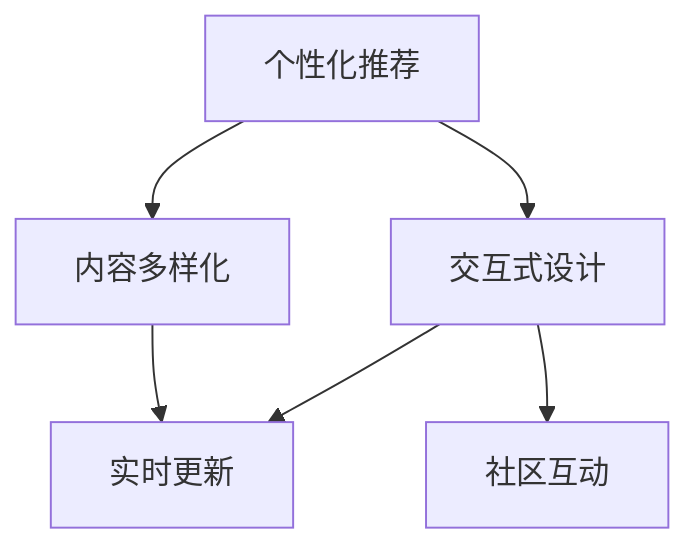

                 

# 移动新闻客户端的注意力争夺技巧

在现代信息爆炸的时代，移动新闻客户端正成为我们获取信息的主要渠道之一。如何在众多竞争者中脱颖而出，吸引用户注意力，是每个新闻客户端开发者需要解决的核心问题。本文将系统地介绍几种注意力争夺技巧，包括个性化推荐、内容多样化、交互式设计等，并提供相应的代码实例和技术分析。

## 1. 背景介绍

### 1.1 问题由来
随着移动互联网的普及，信息获取方式已从传统的网页阅读转变为便捷的移动应用。新闻客户端作为信息获取的重要平台，面临着激烈的竞争。如何在海量信息中抓取用户的眼球，提升用户的忠诚度和留存率，是新闻客户端运营的核心任务。

### 1.2 问题核心关键点
注意力争夺的关键在于：
- **个性化推荐**：通过算法推荐用户感兴趣的新闻内容，提升用户粘性。
- **内容多样化**：采用多样化的内容形式，如视频、音频、图文等，满足用户不同需求。
- **交互式设计**：通过交互式设计，增强用户沉浸感，提升用户体验。
- **实时更新**：通过持续推送新闻，吸引用户重复访问。
- **社区互动**：构建社区，增强用户参与感。

## 2. 核心概念与联系

### 2.1 核心概念概述

为更好地理解注意力争夺技巧，本节将介绍几个密切相关的核心概念：

- **个性化推荐**：通过算法推荐个性化内容，提升用户满意度。
- **内容多样化**：提供视频、音频、图文等多种形式的内容，满足用户不同需求。
- **交互式设计**：通过交互式设计，增强用户沉浸感，提升用户体验。
- **实时更新**：通过推送新闻，吸引用户重复访问。
- **社区互动**：构建用户社区，增强用户参与感和粘性。

这些概念之间的逻辑关系可以通过以下Mermaid流程图来展示：



这个流程图展示了个性化推荐与内容多样化、交互式设计、实时更新和社区互动之间的关系：

1. 个性化推荐是基础，通过算法推荐用户感兴趣的内容，提升用户体验。
2. 内容多样化丰富用户选择，满足不同用户需求。
3. 交互式设计增强用户沉浸感，提升用户粘性。
4. 实时更新吸引用户持续访问，保持用户活跃度。
5. 社区互动增强用户参与感，提升用户留存率。

这些概念共同构成了新闻客户端的运营框架，使其能够更好地吸引和留住用户。

## 3. 核心算法原理 & 具体操作步骤

### 3.1 算法原理概述

注意力争夺的核心在于通过算法推荐个性化内容，提升用户满意度。其核心思想是：将用户的兴趣偏好与内容进行匹配，推荐最符合用户需求的新闻。

形式化地，假设用户对新闻的兴趣偏好为 $P$，新闻内容为 $C$，则推荐系统需要最小化用户和内容之间的匹配误差 $E$，即：

$$
\min_{P,C} E(P,C)
$$

常用的推荐算法包括协同过滤、基于内容的推荐、深度学习等。其中，基于深度学习的推荐系统能够捕捉用户和内容的非线性关系，取得更优的推荐效果。

### 3.2 算法步骤详解

基于深度学习的推荐系统一般包括以下几个关键步骤：

**Step 1: 数据准备**
- 收集用户行为数据，如点击、浏览、收藏等。
- 收集新闻内容数据，如标题、摘要、标签等。

**Step 2: 特征工程**
- 对用户和内容进行特征提取，包括用户特征和内容特征。
- 采用embedding技术将离散特征转化为高维向量表示。
- 对特征进行归一化、降维等预处理操作。

**Step 3: 模型训练**
- 选择合适的深度学习模型，如神经网络、深度神经网络、注意力机制等。
- 在标注数据集上进行监督学习训练模型。
- 使用交叉验证等技术进行模型调参。

**Step 4: 模型评估**
- 在测试集上评估推荐模型的准确率和召回率。
- 使用AUC、MSE等指标评估模型的性能。
- 使用在线A/B测试，评估模型的实际效果。

**Step 5: 部署与监控**
- 将训练好的模型部署到生产环境。
- 实时采集用户行为数据，计算推荐结果。
- 使用监控工具，如Prometheus、Grafana等，实时监测系统指标。

以上是基于深度学习的推荐系统的一般流程。在实际应用中，还需要针对具体任务进行优化设计，如改进特征选择方法、优化模型结构、搜索最优超参数等，以进一步提升推荐效果。

### 3.3 算法优缺点

基于深度学习的推荐系统具有以下优点：
1. 可解释性较强：模型学习过程可解释，便于进行优化和调试。
2. 精度较高：深度学习模型能捕捉高维非线性关系，推荐结果更准确。
3. 可扩展性强：随着数据量的增加，模型性能提升显著。
4. 实时性好：可以通过在线学习不断优化推荐结果。

同时，该方法也存在一定的局限性：
1. 数据依赖性强：推荐系统的效果依赖于高质量的标注数据。
2. 计算复杂度高：深度学习模型计算量大，对硬件资源要求高。
3. 过拟合风险高：模型容易过拟合训练集，泛化性能较差。
4. 可解释性不足：深度学习模型通常是一个"黑盒"，难以解释内部决策逻辑。

尽管存在这些局限性，但就目前而言，基于深度学习的推荐系统仍是目前最主流的方法。未来相关研究的重点在于如何进一步降低推荐系统对数据和计算资源的依赖，提高模型的泛化能力和可解释性。

### 3.4 算法应用领域

基于深度学习的推荐系统已经在新闻客户端、电商、视频等多个领域得到广泛应用。具体而言：

- **新闻客户端**：通过个性化推荐新闻内容，提升用户留存率和活跃度。
- **电商**：推荐用户感兴趣的商品，提升用户购买转化率。
- **视频**：推荐用户喜欢的视频内容，提升用户观看时长和粘性。
- **社交网络**：推荐用户感兴趣的内容和用户，提升用户互动率和参与感。

此外，推荐系统还被创新性地应用到更多场景中，如广告推荐、在线教育、智能家居等，为各行各业带来新的增长点。随着推荐算法的不断演进，相信推荐系统将会在更多领域得到应用，为数字化转型提供新的动力。

## 4. 数学模型和公式 & 详细讲解 & 举例说明

### 4.1 数学模型构建

本节将使用数学语言对深度学习推荐系统的核心原理进行更加严格的刻画。

记用户对新闻的兴趣偏好为 $P$，新闻内容为 $C$，推荐系统为目标函数 $F$。假设推荐系统输出的新闻内容为 $x$，用户兴趣偏好为 $y$，则推荐系统的目标为：

$$
\min_{x,y} F(x,y)
$$

常用的目标函数包括均方误差、交叉熵、余弦相似度等。形式化地，推荐系统的一般框架可以表示为：

$$
\min_{x,y} F(x,y) = \min_{x,y} \frac{1}{n} \sum_{i=1}^n \ell(F(x,y_i), y_i)
$$

其中 $\ell$ 为损失函数，$n$ 为用户数量。

### 4.2 公式推导过程

以下我们以基于协同过滤的推荐系统为例，推导损失函数的计算公式。

假设推荐系统已知 $n$ 个用户的 $m$ 篇新闻的评分数据 $R$，用户的兴趣偏好表示为 $U$，新闻内容表示为 $I$，则协同过滤推荐系统通过最大化用户和新闻的相似度来推荐新闻。具体来说，设用户 $u$ 对新闻 $i$ 的兴趣为 $p(u,i)$，则协同过滤推荐系统可以表示为：

$$
p(u,i) = \frac{1}{\sigma} \sum_{j=1}^n w_j \exp(\alpha u_j^T \cdot \beta i_j)
$$

其中 $\sigma$ 为归一化因子，$w_j$ 为权重，$u_j$ 为用户 $j$ 的特征向量，$i_j$ 为新闻 $j$ 的特征向量。损失函数 $\ell$ 可以表示为：

$$
\ell = \sum_{i=1}^m \sum_{u=1}^n (r_{ui} - p(u,i))^2
$$

其中 $r_{ui}$ 为用户 $u$ 对新闻 $i$ 的实际评分，$p(u,i)$ 为用户 $u$ 对新闻 $i$ 的预测评分。通过最小化损失函数，可以不断优化推荐模型，提升推荐精度。

### 4.3 案例分析与讲解

假设有一个新闻客户端，已知用户 $u$ 对新闻 $i$ 的实际评分 $r_{ui}=4$，推荐系统通过协同过滤方法预测用户 $u$ 对新闻 $i$ 的评分 $p(u,i)=3.8$，则推荐系统的损失为：

$$
\ell = (4-3.8)^2 = 0.04
$$

这个损失表示推荐系统与用户实际评分之间的误差。通过不断的训练和优化，推荐系统的预测评分将越来越接近真实评分，推荐效果也将不断提高。

## 5. 项目实践：代码实例和详细解释说明

### 5.1 开发环境搭建

在进行推荐系统开发前，我们需要准备好开发环境。以下是使用Python进行PyTorch开发的环境配置流程：

1. 安装Anaconda：从官网下载并安装Anaconda，用于创建独立的Python环境。

2. 创建并激活虚拟环境：
```bash
conda create -n recsys-env python=3.8 
conda activate recsys-env
```

3. 安装PyTorch：根据CUDA版本，从官网获取对应的安装命令。例如：
```bash
conda install pytorch torchvision torchaudio cudatoolkit=11.1 -c pytorch -c conda-forge
```

4. 安装TensorBoard：用于可视化模型训练过程。

5. 安装Flask：用于部署推荐系统。

6. 安装Gunicorn：用于部署Flask应用。

完成上述步骤后，即可在`recsys-env`环境中开始推荐系统的开发。

### 5.2 源代码详细实现

下面我们以基于协同过滤的推荐系统为例，给出使用PyTorch进行推荐系统开发的PyTorch代码实现。

首先，定义协同过滤推荐模型的类：

```python
import torch
import torch.nn as nn
import torch.nn.functional as F

class CollaborativeFiltering(nn.Module):
    def __init__(self, n_users, n_news, d):
        super(CollaborativeFiltering, self).__init__()
        self.user_embed = nn.Embedding(n_users, d)
        self.news_embed = nn.Embedding(n_news, d)
        self.W = nn.Parameter(torch.randn(n_news, n_news))
        self.U = nn.Parameter(torch.randn(n_users, n_news))
        self.b = nn.Parameter(torch.randn(n_news))
        
    def forward(self, user_id, news_id):
        user_embedding = self.user_embed(user_id)
        news_embedding = self.news_embed(news_id)
        U = torch.matmul(user_embedding, self.W) + self.U[user_id]
        scores = torch.matmul(news_embedding, U) + self.b
        scores = F.softmax(scores, dim=1)
        return scores
```

然后，定义训练和评估函数：

```python
from torch.utils.data import DataLoader
from sklearn.metrics import mean_squared_error

class RecSysDataset(torch.utils.data.Dataset):
    def __init__(self, user_news, ratings):
        self.user_news = user_news
        self.ratings = ratings
        
    def __len__(self):
        return len(self.user_news)
    
    def __getitem__(self, index):
        user_id, news_id = self.user_news[index]
        rating = self.ratings[index]
        return user_id, news_id, rating
        
def train_epoch(model, dataloader, optimizer, loss_fn):
    model.train()
    epoch_loss = 0
    for user_id, news_id, rating in dataloader:
        user_id = torch.tensor(user_id)
        news_id = torch.tensor(news_id)
        rating = torch.tensor(rating)
        output = model(user_id, news_id)
        loss = loss_fn(output, rating)
        epoch_loss += loss.item()
        optimizer.zero_grad()
        loss.backward()
        optimizer.step()
    return epoch_loss / len(dataloader)

def evaluate(model, dataloader):
    model.eval()
    epoch_loss = 0
    rmse = 0
    for user_id, news_id, rating in dataloader:
        user_id = torch.tensor(user_id)
        news_id = torch.tensor(news_id)
        rating = torch.tensor(rating)
        output = model(user_id, news_id)
        loss = loss_fn(output, rating)
        epoch_loss += loss.item()
        rmse += torch.sqrt(mean_squared_error(output, rating))
    rmse /= len(dataloader)
    return epoch_loss / len(dataloader), rmse
```

最后，启动训练流程并在测试集上评估：

```python
from sklearn.model_selection import train_test_split

# 划分训练集和测试集
user_news, test_user_news, ratings, test_ratings = train_test_split(user_news, ratings, test_size=0.2)

# 创建数据集
train_dataset = RecSysDataset(user_news, ratings)
test_dataset = RecSysDataset(test_user_news, test_ratings)

# 定义模型、优化器、损失函数
model = CollaborativeFiltering(n_users=len(user_news), n_news=len(news_id), d=32)
optimizer = torch.optim.Adam(model.parameters(), lr=0.001)
loss_fn = nn.BCELoss()

# 定义训练和评估函数
train_dataloader = DataLoader(train_dataset, batch_size=32, shuffle=True)
test_dataloader = DataLoader(test_dataset, batch_size=32, shuffle=False)

# 训练模型
epochs = 10
for epoch in range(epochs):
    loss = train_epoch(model, train_dataloader, optimizer, loss_fn)
    print(f"Epoch {epoch+1}, train loss: {loss:.3f}")
    
    test_loss, test_rmse = evaluate(model, test_dataloader)
    print(f"Epoch {epoch+1}, test rmse: {test_rmse:.3f}")
```

以上就是使用PyTorch对协同过滤推荐系统进行开发的完整代码实现。可以看到，通过简短的代码，我们便可以实现一个基础的协同过滤推荐模型。

### 5.3 代码解读与分析

让我们再详细解读一下关键代码的实现细节：

**CollaborativeFiltering类**：
- `__init__`方法：初始化用户和新闻的embedding，以及模型参数。
- `forward`方法：对用户和新闻的embedding进行矩阵乘法，计算预测评分。
- `W`、`U`、`b`：模型参数，表示用户-新闻和新闻-新闻的相似度矩阵和偏置项。

**train_epoch和evaluate函数**：
- `train_epoch`方法：在训练集上迭代，计算损失函数并更新模型参数。
- `evaluate`方法：在测试集上迭代，计算损失函数和RMSE指标。
- `rmse`：均方根误差，用于评估推荐系统的推荐精度。

**训练流程**：
- 划分训练集和测试集。
- 创建数据集，定义模型、优化器和损失函数。
- 定义训练和评估函数。
- 在训练集上训练模型，在测试集上评估模型。
- 在每个epoch结束时，输出训练和测试损失及精度。

可以看到，PyTorch和TensorBoard使得推荐系统的开发变得简洁高效。开发者可以将更多精力放在模型改进和数据处理上，而不必过多关注底层的实现细节。

当然，工业级的系统实现还需考虑更多因素，如模型的保存和部署、超参数的自动搜索、更灵活的任务适配层等。但核心的推荐范式基本与此类似。

## 6. 实际应用场景
### 6.1 智能广告投放

智能广告投放是新闻客户端中常见的一个应用场景。通过推荐系统推荐用户感兴趣的内容，可以在广告位上投放用户更可能点击的广告，提升广告的点击率和转化率。

在技术实现上，可以收集用户对新闻内容的点击数据，以及广告与新闻内容的关联数据，训练推荐模型。将用户对新闻的兴趣偏好和广告的相关特征输入模型，输出用户对广告的兴趣评分。将评分较高的广告推荐给用户，能够提高广告的点击率和转化率。

### 6.2 个性化推荐

个性化推荐是新闻客户端的核心功能之一。通过推荐系统推荐用户感兴趣的新闻，能够提升用户的留存率和粘性。

在技术实现上，可以收集用户对新闻的浏览、点击、收藏等行为数据，训练推荐模型。将用户的行为数据和新闻的特征输入模型，输出用户对新闻的兴趣评分。将评分较高的新闻推荐给用户，能够提高用户的阅读量和活跃度。

### 6.3 内容搜索

内容搜索是新闻客户端中另一个重要功能。通过推荐系统推荐用户感兴趣的内容，能够提升用户的搜索体验。

在技术实现上，可以将用户对新闻的搜索记录和行为数据输入模型，输出用户对新闻的兴趣评分。将评分较高的新闻推荐给用户，能够提高用户搜索的精准度和满意度。

### 6.4 未来应用展望

随着推荐算法的不断演进，基于推荐系统的注意力争夺技术将进一步拓展，为新闻客户端带来更多应用场景：

1. 实时新闻推荐：通过实时推送新闻，保持用户对新闻客户端的访问，提升用户活跃度。
2. 个性化定制：根据用户兴趣和行为，个性化推荐内容，提升用户体验。
3. 社区互动：构建社区，增强用户参与感和粘性，提升用户留存率。
4. 多媒体内容推荐：推荐视频、音频、图文等多种形式的内容，满足用户不同需求。
5. 智能问答：通过推荐系统推荐相关的问答内容，提升用户问题解答的准确性和效率。

这些应用场景的拓展，将进一步提升新闻客户端的用户体验和留存率，推动新闻客户端的智能化和数字化转型。

## 7. 工具和资源推荐
### 7.1 学习资源推荐

为了帮助开发者系统掌握推荐系统的理论基础和实践技巧，这里推荐一些优质的学习资源：

1. 《推荐系统实战》：系统地介绍了推荐系统的原理、算法和实践，适合初学者和进阶开发者。
2. Coursera《Recommender Systems》课程：由斯坦福大学开设的推荐系统课程，系统地介绍了推荐系统的基本概念和算法。
3. Kaggle推荐系统竞赛：通过参加Kaggle推荐系统竞赛，锻炼推荐系统的开发和优化能力。
4. RecSys大会论文：读取推荐系统领域的经典论文，了解最新的研究成果和应用实践。
5. 《Python推荐系统》：介绍如何使用Python进行推荐系统开发的书籍，包含大量实战案例。

通过对这些资源的学习实践，相信你一定能够快速掌握推荐系统的精髓，并用于解决实际的推荐问题。
###  7.2 开发工具推荐

高效的开发离不开优秀的工具支持。以下是几款用于推荐系统开发的常用工具：

1. PyTorch：基于Python的开源深度学习框架，灵活动态的计算图，适合快速迭代研究。大部分推荐系统都有PyTorch版本的实现。
2. TensorFlow：由Google主导开发的开源深度学习框架，生产部署方便，适合大规模工程应用。同样有丰富的推荐系统资源。
3. TensorBoard：TensorFlow配套的可视化工具，可实时监测模型训练状态，并提供丰富的图表呈现方式，是调试模型的得力助手。
4. Weights & Biases：模型训练的实验跟踪工具，可以记录和可视化模型训练过程中的各项指标，方便对比和调优。
5. FastAPI：轻量级的Web框架，适合快速搭建推荐系统的Web接口。

合理利用这些工具，可以显著提升推荐系统的开发效率，加快创新迭代的步伐。

### 7.3 相关论文推荐

推荐系统的发展源于学界的持续研究。以下是几篇奠基性的相关论文，推荐阅读：

1. Matrix Factorization Techniques for Recommender Systems：介绍矩阵分解等传统推荐算法，具有较好的可解释性和可扩展性。
2. Trustworthy Recommendation Algorithms for Online Platforms：介绍推荐系统中的公平性、透明性和可解释性等问题。
3. Deep Learning Recommendation Systems: A Systematic Survey and Taxonomy：系统综述了深度学习在推荐系统中的应用，介绍了各类模型和算法。
4. Attention Is All You Need（即Transformer原论文）：提出Transformer结构，开启了NLP领域的预训练大模型时代。
5. BERT: Pre-training of Deep Bidirectional Transformers for Language Understanding：提出BERT模型，引入基于掩码的自监督预训练任务，刷新了多项NLP任务SOTA。

这些论文代表了大语言模型微调技术的发展脉络。通过学习这些前沿成果，可以帮助研究者把握学科前进方向，激发更多的创新灵感。

## 8. 总结：未来发展趋势与挑战

### 8.1 总结

本文对基于深度学习的推荐系统进行了全面系统的介绍。首先阐述了推荐系统的研究背景和意义，明确了推荐系统在提升用户留存率和粘性方面的独特价值。其次，从原理到实践，详细讲解了推荐算法的数学模型和实现细节，给出了推荐系统开发的完整代码实例。同时，本文还广泛探讨了推荐系统在智能广告投放、个性化推荐、内容搜索等实际应用场景中的潜力，展示了推荐系统技术的广阔前景。最后，本文精选了推荐系统的各类学习资源，力求为读者提供全方位的技术指引。

通过本文的系统梳理，可以看到，基于深度学习的推荐系统已经广泛应用于新闻客户端、电商、视频等多个领域，成为数字经济的支撑技术之一。未来，伴随推荐算法的不断演进，推荐系统必将在更多领域得到应用，为数字化转型提供新的动力。

### 8.2 未来发展趋势

展望未来，基于深度学习的推荐系统将呈现以下几个发展趋势：

1. 深度学习模型的精度和效率将持续提升。随着深度学习框架和硬件设备的不断进步，推荐系统的性能将得到进一步提升。
2. 推荐系统的个性化能力将进一步增强。通过多维度数据融合和深度学习技术，推荐系统能够更好地捕捉用户兴趣和行为，提供更加个性化和精准的推荐。
3. 推荐系统的实时性和动态性将进一步提升。通过在线学习和增量更新，推荐系统能够实时调整推荐策略，提升用户体验和系统效率。
4. 推荐系统的多模态融合能力将进一步增强。通过引入视频、音频等多模态数据，推荐系统能够提供更加全面和丰富的推荐内容。
5. 推荐系统的可解释性和透明性将进一步提升。通过可解释性算法和可视化工具，推荐系统将变得更加透明，提升用户信任度。
6. 推荐系统的公平性和安全性将进一步提升。通过引入公平性算法和安全性约束，推荐系统将更加公平和安全，避免算法偏见和数据滥用。

这些趋势凸显了推荐系统的广阔前景，相信推荐系统必将在更多领域得到应用，为数字化转型提供新的动力。

### 8.3 面临的挑战

尽管基于深度学习的推荐系统已经取得了瞩目成就，但在迈向更加智能化、普适化应用的过程中，它仍面临着诸多挑战：

1. 数据依赖性强。推荐系统的效果依赖于高质量的标注数据，而数据获取和标注成本较高。如何进一步降低推荐系统对标注数据的依赖，将是一大难题。
2. 计算资源需求高。深度学习模型计算量大，对硬件资源要求高。如何降低计算资源需求，提高推荐系统的实时性和可扩展性，还需要更多技术突破。
3. 模型泛化能力差。深度学习模型容易过拟合训练集，泛化性能较差。如何提高模型的泛化能力和鲁棒性，还需要更多理论和技术改进。
4. 模型可解释性差。深度学习模型通常是一个"黑盒"，难以解释内部决策逻辑。如何赋予推荐系统更强的可解释性，将是亟待攻克的难题。
5. 算法偏见和数据滥用。推荐系统容易学习到用户和内容的固有偏见，造成算法偏见和数据滥用。如何消除推荐系统中的算法偏见，确保数据使用安全，还需要更多伦理和技术约束。

这些挑战将伴随着推荐系统的进一步发展和应用，亟需学界和产业界的共同努力，寻求新的突破和解决之道。

### 8.4 研究展望

面对推荐系统面临的挑战，未来的研究需要在以下几个方面寻求新的突破：

1. 探索无监督和半监督推荐方法。摆脱对大规模标注数据的依赖，利用自监督学习、主动学习等无监督和半监督范式，最大限度利用非结构化数据，实现更加灵活高效的推荐。
2. 研究参数高效和计算高效的推荐范式。开发更加参数高效的推荐方法，在固定大部分预训练参数的情况下，只更新极少量的任务相关参数。同时优化推荐系统的计算图，减少前向传播和反向传播的资源消耗，实现更加轻量级、实时性的部署。
3. 引入更多先验知识。将符号化的先验知识，如知识图谱、逻辑规则等，与神经网络模型进行巧妙融合，引导推荐系统学习更准确、合理的推荐内容。同时加强不同模态数据的整合，实现视觉、语音等多模态信息与文本信息的协同建模。
4. 引入因果分析和博弈论工具。将因果分析方法引入推荐系统，识别出推荐系统的关键特征，增强推荐系统建立稳定因果关系的能力，学习更加普适、鲁棒的内容推荐。借助博弈论工具刻画用户和推荐系统之间的交互行为，主动探索并规避推荐系统中的脆弱点，提高系统稳定性。
5. 纳入伦理道德约束。在推荐系统的训练目标中引入伦理导向的评估指标，过滤和惩罚有偏见、有害的输出倾向。同时加强人工干预和审核，建立推荐系统的监管机制，确保推荐内容符合人类价值观和伦理道德。

这些研究方向的探索，必将引领推荐系统技术迈向更高的台阶，为构建安全、可靠、可解释、可控的智能推荐系统铺平道路。面向未来，推荐系统需要与其他人工智能技术进行更深入的融合，如知识表示、因果推理、强化学习等，多路径协同发力，共同推动智能推荐系统的进步。只有勇于创新、敢于突破，才能不断拓展推荐系统的边界，让智能推荐技术更好地造福人类社会。

## 9. 附录：常见问题与解答

**Q1：推荐系统的精度如何保证？**

A: 推荐系统的精度依赖于高质量的数据和高效的算法。首先，需要收集用户行为数据，如点击、浏览、收藏等，作为训练集。其次，选择合适的推荐算法，如协同过滤、深度学习等，并进行模型训练和调参。最后，在测试集上评估模型性能，不断优化模型参数和算法，提高推荐精度。

**Q2：推荐系统如何处理冷启动问题？**

A: 冷启动问题指的是新用户或新物品加入推荐系统，没有历史行为数据，无法进行推荐。常用的方法包括基于内容的推荐、基于协同过滤的推荐、基于深度学习的推荐等。可以通过先验知识、热门推荐、特征工程等方法，解决冷启动问题。

**Q3：推荐系统如何防止过拟合？**

A: 推荐系统容易过拟合训练集，泛化性能较差。常用的防止过拟合的方法包括数据增强、正则化、交叉验证等。可以通过引入对抗样本、调整模型结构、优化超参数等方法，提高模型的泛化能力和鲁棒性。

**Q4：推荐系统的实时性和动态性如何提升？**

A: 推荐系统的实时性和动态性可以通过在线学习、增量更新、模型压缩等方法提升。通过实时接收用户行为数据，动态调整推荐策略，提升用户体验和系统效率。

**Q5：推荐系统的可解释性和透明性如何提升？**

A: 推荐系统的可解释性和透明性可以通过可视化工具、可解释性算法等提升。通过可视化推荐系统的决策过程，解释模型的内部逻辑，增强用户信任度。

这些问题的解答，帮助读者更好地理解推荐系统的工作原理和优化策略。通过不断优化模型和算法，相信推荐系统必将在更多领域得到应用，为数字化转型提供新的动力。

---

作者：禅与计算机程序设计艺术 / Zen and the Art of Computer Programming

