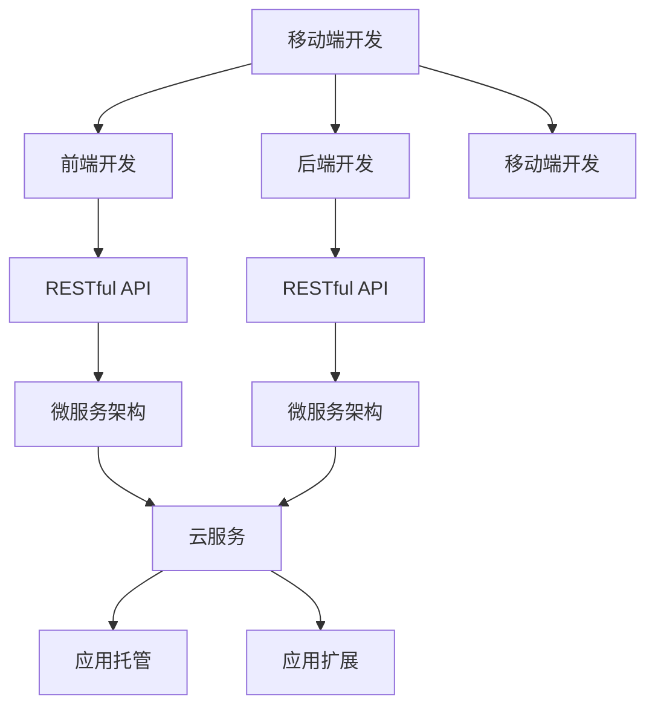

                 

## 1. 背景介绍

### 1.1 问题由来

随着移动互联网的迅猛发展，越来越多的企业希望通过移动端应用程序(APP)拓展业务，与用户进行互动。然而，移动开发涉及多个技术栈和开发平台，使得全栈开发变得复杂和困难。为了更好地解决这个问题，需要深入了解移动端全栈开发的关键概念、技术原理和实际操作步骤，为智能手机创建高效、稳定、易用的应用程序。

### 1.2 问题核心关键点

全栈开发的核心在于掌握前端和后端技术，并在统一的技术栈中高效协作，实现跨端应用的一致性和稳定性。全栈开发人员需要具备前端、后端、移动端等多种技术技能，能够设计、开发、测试和维护完整的移动端应用程序。

全栈开发的关键技术包括：

- 前端开发：HTML、CSS、JavaScript、React、Vue等前端技术。
- 后端开发：Node.js、Django、Flask等后端技术。
- 移动端开发：Swift、Kotlin、React Native等移动开发框架。
- 数据库和API设计：MySQL、MongoDB、RESTful API等技术。

掌握这些关键技术，并能够在实际项目中灵活运用，才能成为优秀的移动端全栈开发人员。

### 1.3 问题研究意义

全栈开发具有以下显著优势：

1. **跨平台开发**：通过前端和后端的统一开发，可以轻松实现跨平台应用，支持iOS、Android等多端设备。
2. **一致性**：前后端代码在统一的技术栈中编写，确保了应用程序在不同平台上的用户界面和功能一致性。
3. **效率提升**：全栈开发人员可以同时处理前端和后端的工作，缩短开发周期。
4. **性能优化**：前后端优化可以互相促进，提升整体应用性能。
5. **技术协同**：跨端技术协同可以提升系统稳定性和用户体验。

基于全栈开发的全移动端应用程序可以更快速地开发，更高效地维护，更灵活地扩展，为企业带来显著的商业价值和技术竞争力。

## 2. 核心概念与联系

### 2.1 核心概念概述

为更好地理解全栈开发的核心概念，我们首先需要对以下关键概念进行详细阐述：

- **移动端开发**：基于原生或跨平台的开发技术，为智能手机创建应用程序。
- **全栈开发**：掌握前端、后端、移动端多种技术，能够在统一技术栈中高效协作，实现跨端应用。
- **RESTful API**：设计轻量级、标准化的API接口，支持多种客户端访问方式。
- **微服务架构**：将应用程序拆分为多个小型服务，通过RESTful API进行通信。
- **云服务**：使用云平台（如AWS、Azure等）提供的应用托管和扩展服务。

这些核心概念之间相互关联，共同构成了移动端全栈开发的技术框架。

### 2.2 核心概念原理和架构的 Mermaid 流程图



### 2.3 核心概念联系

移动端开发是全栈开发的核心。前端开发与后端开发通过RESTful API接口连接，并通过微服务架构实现功能解耦和模块化管理。云服务为全栈应用提供了高效、可扩展的托管和扩展环境，进一步提升了应用性能和稳定性。

## 3. 核心算法原理 & 具体操作步骤

### 3.1 算法原理概述

全栈开发的关键在于前后端的协同工作。前端负责用户界面和用户体验，后端负责数据存储和业务逻辑处理。RESTful API作为连接前后端的关键桥梁，确保了数据传输的轻量化和标准化。微服务架构则通过将应用程序拆分为多个小型服务，提高了系统的可扩展性和灵活性。

### 3.2 算法步骤详解

**Step 1: 需求分析与设计**

1. **用户需求调研**：了解用户需求，明确功能、界面、性能等要求。
2. **系统设计**：确定系统架构，设计前后端技术栈，制定开发计划。

**Step 2: 前端开发**

1. **界面设计**：使用设计工具（如Sketch、Figma）设计UI/UX，创建原型。
2. **前端实现**：使用HTML、CSS、JavaScript等技术实现页面和组件。
3. **交互设计**：实现交互功能，如按钮点击、表单提交等。

**Step 3: 后端开发**

1. **数据库设计**：设计数据库表结构和关系，确定数据存储方式。
2. **API设计**：设计RESTful API接口，定义数据模型和操作。
3. **业务逻辑实现**：实现后端业务逻辑，处理数据请求和响应。

**Step 4: 移动端开发**

1. **原生开发**：使用Swift或Kotlin开发iOS或Android应用。
2. **跨平台开发**：使用React Native、Flutter等框架开发跨平台应用。
3. **API集成**：集成前后端API接口，实现数据传输和处理。

**Step 5: 测试与部署**

1. **单元测试**：编写单元测试用例，确保代码质量。
2. **集成测试**：集成前后端功能，进行联合测试。
3. **性能测试**：进行压力测试，确保系统稳定性和性能。
4. **发布部署**：使用云平台进行应用托管和扩展，发布应用版本。

**Step 6: 持续集成与维护**

1. **持续集成**：使用CI工具（如Jenkins、Travis CI）实现自动化测试和部署。
2. **持续维护**：定期更新和维护应用，修复bug，提升用户体验。

### 3.3 算法优缺点

全栈开发的优点包括：

1. **高效协作**：前后端开发人员可以高效协作，快速实现功能。
2. **一致性**：统一技术栈和开发流程，确保应用程序在不同平台上的用户体验一致。
3. **可扩展性**：微服务架构支持模块化开发，易于扩展和维护。

然而，全栈开发也存在以下缺点：

1. **技术复杂性**：需要掌握多种技术栈和开发工具，对开发人员的要求较高。
2. **时间成本**：全栈开发需要更多的时间和精力，开发周期可能较长。
3. **知识更新**：需要不断更新技术知识和工具，保持技术前沿。

### 3.4 算法应用领域

全栈开发广泛应用于各种移动端应用程序的开发，包括社交网络、电商、金融、医疗等领域。具体应用场景包括：

- **社交网络**：支持用户登录、消息发送、好友管理等功能。
- **电商**：实现商品展示、购物车、订单管理等电商功能。
- **金融**：提供账户管理、交易记录、理财顾问等功能。
- **医疗**：实现预约挂号、病历查询、在线咨询等功能。
- **教育**：提供课程学习、在线测试、师生互动等功能。

## 4. 数学模型和公式 & 详细讲解 & 举例说明

### 4.1 数学模型构建

为了更好地理解全栈开发，我们定义以下数学模型：

1. **用户需求模型**：$U=\{u_1, u_2, ..., u_n\}$，表示用户需求集合。
2. **功能模型**：$F=\{f_1, f_2, ..., f_m\}$，表示功能模块集合。
3. **界面模型**：$I=\{i_1, i_2, ..., i_k\}$，表示界面元素集合。
4. **性能模型**：$P=\{p_1, p_2, ..., p_l\}$，表示性能指标集合。

全栈开发的目标是最大化用户满意度，即：

$$
\max_{U,F,I,P} \sum_{u \in U} \sum_{f \in F} \sum_{i \in I} \sum_{p \in P} u \cdot f \cdot i \cdot p
$$

其中，$u$ 表示用户满意度，$f$ 表示功能模块，$i$ 表示界面元素，$p$ 表示性能指标。

### 4.2 公式推导过程

根据上述数学模型，推导全栈开发的具体步骤：

1. **用户需求分析**：对用户需求进行分类和优先级排序。
2. **功能模块设计**：根据需求设计功能模块，确保模块可扩展性和可维护性。
3. **界面设计**：设计用户界面，确保美观、易用和一致性。
4. **性能优化**：根据性能指标优化系统性能，提升用户体验。

### 4.3 案例分析与讲解

以电商应用为例，分析全栈开发的数学模型和步骤：

**需求分析**：
- 用户需求：商品浏览、购物车、订单支付等。
- 功能模块：商品管理、订单管理、用户管理等。
- 界面元素：商品列表、购物车、订单列表等。
- 性能指标：响应时间、加载速度、稳定性等。

**功能模块设计**：
- 商品管理模块：实现商品增加、修改、删除等功能。
- 订单管理模块：实现订单生成、修改、支付等功能。
- 用户管理模块：实现用户注册、登录、信息管理等功能。

**界面设计**：
- 商品列表界面：展示商品信息，包括图片、价格、评价等。
- 购物车界面：显示用户所选商品，并提供结算按钮。
- 订单界面：展示订单详情，包括商品列表、订单状态等。

**性能优化**：
- 商品列表界面：优化图片加载速度，提升页面渲染效率。
- 购物车界面：优化数据缓存，减少数据库访问次数。
- 订单界面：优化数据库查询，提升订单处理速度。

通过上述步骤，可以设计和实现一个高效、稳定、易用的电商应用。

## 5. 项目实践：代码实例和详细解释说明

### 5.1 开发环境搭建

1. **环境准备**：安装Node.js、Python、Android Studio等开发工具。
2. **后端开发**：使用Django框架，创建数据库和API接口。
3. **前端开发**：使用React框架，设计用户界面和交互功能。
4. **移动端开发**：使用Kotlin开发Android应用。

### 5.2 源代码详细实现

**后端开发**：

```python
from django.db import models
from django.contrib.auth.models import AbstractUser

class User(AbstractUser):
    email = models.EmailField(unique=True)
    first_name = models.CharField(max_length=30)
    last_name = models.CharField(max_length=30)

class Product(models.Model):
    name = models.CharField(max_length=100)
    price = models.DecimalField(max_digits=10, decimal_places=2)
    description = models.TextField()

class Order(models.Model):
    user = models.ForeignKey(User, on_delete=models.CASCADE)
    products = models.ManyToManyField(Product)
    status = models.CharField(max_length=20)
```

**前端开发**：

```javascript
import React, { useState, useEffect } from 'react';
import { useQuery } from '@apollo/client';

const ProductList = () => {
  const [products, setProducts] = useState([]);
  
  const { data } = useQuery(GET_PRODUCTS);
  
  useEffect(() => {
    setProducts(data?.products || []);
  }, [data]);
  
  return (
    <div>
      {products.map((product) => (
        <div key={product.id}>
          <h2>{product.name}</h2>
          <p>{product.price}</p>
          <p>{product.description}</p>
        </div>
      ))}
    </div>
  );
};
```

**移动端开发**：

```kotlin
import android.os.Bundle
import androidx.appcompat.app.AppCompatActivity
import android.widget.TextView
import com.example.myapp.R

class MainActivity : AppCompatActivity() {
  override fun onCreate(savedInstanceState: Bundle?) {
    super.onCreate(savedInstanceState)
    setContentView(R.layout.activity_main)
    
    val textView = findViewById<TextView>(R.id.text_view)
    textView.text = "Hello, World!"
  }
}
```

### 5.3 代码解读与分析

**后端开发**：
- 使用Django框架，定义了用户、商品、订单等数据模型，并实现了基本的CRUD操作。
- 用户模型继承自Django内置的AbstractUser模型，增加了邮箱、姓名等字段。
- 商品模型包含名称、价格、描述等属性，订单模型与用户模型关联，包含商品列表和状态。

**前端开发**：
- 使用React框架，定义了获取商品列表的GraphQL查询，并使用useQuery钩子获取数据。
- 使用useState和useEffect钩子管理状态和数据更新。
- 渲染商品列表，展示商品名称、价格和描述。

**移动端开发**：
- 使用Kotlin语言，创建MainActivity，设置了TextView显示"Hello, World!"。
- 使用Android Studio进行UI设计和调试，确保应用运行正常。

### 5.4 运行结果展示

**后端开发**：
- 数据库创建成功，并保存了用户、商品、订单等数据。
- 测试API接口，可以获取商品列表和订单详情。

**前端开发**：
- 渲染商品列表，展示商品信息。
- 用户可以浏览商品列表，并查看商品详情。

**移动端开发**：
- 应用启动，显示"Hello, World!"。
- 用户可以访问商品列表，查看商品详情。

## 6. 实际应用场景

### 6.1 电商平台

电商应用是典型的全栈开发案例。全栈开发人员可以设计前端用户界面，后端处理订单、商品管理等功能，确保应用高效稳定。电商平台可以实现商品展示、购物车、订单支付等功能，为用户的购物体验带来极大的便利。

### 6.2 金融应用

金融应用需要高可用性和高安全性。全栈开发可以实现完整的用户认证、交易记录、理财顾问等功能，确保数据安全。通过RESTful API连接前后端，实现高效的数据传输和处理。

### 6.3 医疗应用

医疗应用需要高稳定性和高可扩展性。全栈开发可以实现预约挂号、病历查询、在线咨询等功能，提高医院的运营效率。通过微服务架构，确保系统可扩展性和灵活性。

### 6.4 未来应用展望

未来，全栈开发将更加普及，应用于更多行业和领域。全栈开发人员将面临更多的技术挑战和创新机遇。

- **人工智能**：结合人工智能技术，实现智能推荐、智能客服等功能。
- **物联网**：结合物联网技术，实现设备连接、数据采集等功能。
- **区块链**：结合区块链技术，实现数据安全、智能合约等功能。

## 7. 工具和资源推荐

### 7.1 学习资源推荐

1. **《深入浅出React》**：详细介绍React框架的开发技巧和实践经验。
2. **《全栈开发实战》**：结合真实案例，展示全栈开发的最佳实践。
3. **《Node.js实战》**：详细讲解Node.js的开发技巧和实战经验。
4. **《Kotlin进阶》**：深入探讨Kotlin语言的高级特性和开发技巧。

### 7.2 开发工具推荐

1. **Visual Studio Code**：功能强大的代码编辑器，支持多种语言和框架。
2. **Sublime Text**：简洁高效的代码编辑器，支持代码高亮和自动补全。
3. **Android Studio**：全功能的Android应用开发工具，支持Android Studio的最新特性。
4. **Git**：版本控制系统，支持多人协作开发和代码管理。

### 7.3 相关论文推荐

1. **《全栈开发的关键技术》**：详细介绍全栈开发的核心技术和实践经验。
2. **《微服务架构的设计与实现》**：介绍微服务架构的设计原则和实现方法。
3. **《移动端开发的多端协同》**：探讨移动端开发的多端协同技术和工具。

## 8. 总结：未来发展趋势与挑战

### 8.1 总结

全栈开发是移动端应用程序开发的重要技术手段，通过前后端的协同工作，实现跨端应用的一致性和稳定性。全栈开发具有高效协作、一致性、可扩展性等优势，但也面临技术复杂性、时间成本、知识更新等挑战。

通过不断优化和改进全栈开发技术，可以实现更高质量、更高效、更稳定的移动端应用程序，满足用户的各种需求。

### 8.2 未来发展趋势

1. **跨平台开发**：使用跨平台框架（如React Native、Flutter），实现一次开发，多端部署。
2. **云计算**：利用云平台（如AWS、Azure）提供的应用托管和扩展服务，提高应用性能和可扩展性。
3. **人工智能**：结合人工智能技术，实现智能推荐、智能客服等功能。
4. **物联网**：结合物联网技术，实现设备连接、数据采集等功能。
5. **区块链**：结合区块链技术，实现数据安全、智能合约等功能。

### 8.3 面临的挑战

1. **技术复杂性**：需要掌握多种技术栈和开发工具，对开发人员的要求较高。
2. **时间成本**：全栈开发需要更多的时间和精力，开发周期可能较长。
3. **知识更新**：需要不断更新技术知识和工具，保持技术前沿。

### 8.4 研究展望

未来，全栈开发需要不断优化和改进，解决技术复杂性、时间成本、知识更新等挑战，实现更高效、更稳定、更灵活的移动端应用程序。全栈开发人员需要不断学习新技术、新工具，保持技术领先地位。

## 9. 附录：常见问题与解答

**Q1: 全栈开发与前后端分离有哪些区别？**

A: 全栈开发和前后端分离各有优缺点，主要区别在于开发人员的技术栈和协作方式。全栈开发人员掌握前后端技术，能够高效协作，但技术复杂性较高。前后端分离则分工明确，开发效率高，但需要前后端协调合作。

**Q2: 全栈开发需要掌握哪些技术？**

A: 全栈开发需要掌握HTML、CSS、JavaScript、React、Vue、Node.js、Django、Kotlin、React Native等技术。同时，还需要掌握数据库设计、RESTful API、微服务架构等技术。

**Q3: 全栈开发的最佳实践是什么？**

A: 全栈开发的最佳实践包括设计统一的技术栈、前后端协同工作、持续集成和部署、代码版本管理等。同时，需要注意代码质量和性能优化，确保应用的稳定性和用户体验。

**Q4: 全栈开发在移动端有哪些应用场景？**

A: 全栈开发在移动端的应用场景包括社交网络、电商、金融、医疗、教育等领域。可以设计前端用户界面，后端处理数据和业务逻辑，实现完整的移动端应用程序。

**Q5: 全栈开发如何提高开发效率？**

A: 全栈开发可以通过前后端协同工作、使用跨平台框架、利用云平台等技术手段，提高开发效率。同时，需要不断学习和更新技术知识，保持技术前沿。

---

作者：禅与计算机程序设计艺术 / Zen and the Art of Computer Programming

