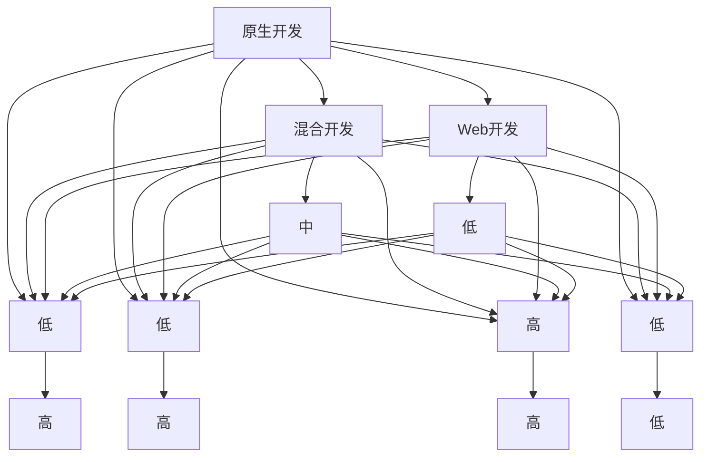

                 

# 移动端开发框架比较：基于原生和混合的选择

> 关键词：原生开发、混合开发、Web开发、Hybrid、React Native、Flutter、Ionic、Cordova、跨平台、性能、易用性、社区支持

## 1. 背景介绍

### 1.1 问题由来

在移动端应用开发领域，开发人员面临着选择何种技术栈和框架的困惑。原生开发、混合开发和Web开发各有优缺点，不同规模的公司或项目有着不同的需求。本文将从原生开发、混合开发和Web开发三个方面对主流框架进行详细比较，帮助开发者根据项目需求选择适合的开发框架。

### 1.2 问题核心关键点

- **原生开发**：指使用平台原生语言和API开发应用，如iOS的Objective-C/Swift，Android的Java/Kotlin。
- **混合开发**：指使用基于Web技术的框架或库进行开发，但应用运行于原生平台上。常用的框架包括React Native、Flutter等。
- **Web开发**：指使用HTML、CSS、JavaScript等Web技术开发应用，运行在Web浏览器上。常用的框架包括Ionic、Cordova等。

三种开发方式各有优缺点。原生开发提供了最佳性能和用户体验，但开发成本高且跨平台困难；混合开发和Web开发则兼顾了性能和易用性，但需考虑性能损失和平台兼容性。

### 1.3 问题研究意义

选择适合的开发框架对于提升应用性能、降低开发成本、加速产品迭代具有重要意义。本文将详细分析原生开发、混合开发和Web开发的三种框架的优势和劣势，为开发人员提供明确的指导。

## 2. 核心概念与联系

### 2.1 核心概念概述

- **原生开发**：指使用平台原生语言和API开发应用，如iOS的Objective-C/Swift，Android的Java/Kotlin。
- **混合开发**：指使用基于Web技术的框架或库进行开发，但应用运行于原生平台上。常用的框架包括React Native、Flutter等。
- **Web开发**：指使用HTML、CSS、JavaScript等Web技术开发应用，运行在Web浏览器上。常用的框架包括Ionic、Cordova等。

以上三种开发方式之间的联系在于它们都是移动端开发的重要组成部分，各有优缺点。原生开发提供最佳性能和用户体验，但开发成本高；混合开发和Web开发则兼顾了性能和易用性，但需考虑性能损失和平台兼容性。

### 2.2 核心概念原理和架构的 Mermaid 流程图(Mermaid 流程节点中不要有括号、逗号等特殊字符)



此图展示了原生开发、混合开发和Web开发三者的核心概念及相互联系。原生开发提供最佳性能和用户体验，但开发成本高、跨平台能力差；混合开发兼顾了性能和易用性，但需考虑性能损失和平台兼容性；Web开发则提供了良好的易用性和跨平台能力，但性能较低。

## 3. 核心算法原理 & 具体操作步骤

### 3.1 算法原理概述

移动端应用开发框架的选择取决于应用的需求、性能要求和开发成本。本文将详细比较原生开发、混合开发和Web开发框架的优缺点，帮助开发者做出明智选择。

### 3.2 算法步骤详解

#### 3.2.1 原生开发框架

1. **选择原生语言**：iOS选择Swift或Objective-C，Android选择Java或Kotlin。
2. **编写原生代码**：使用平台原生API和框架进行开发。
3. **构建和发布**：生成原生应用并发布到应用商店。

#### 3.2.2 混合开发框架

1. **选择混合开发框架**：如React Native、Flutter等。
2. **编写混合代码**：使用框架提供的组件和API进行开发。
3. **构建和发布**：生成原生应用并发布到应用商店。

#### 3.2.3 Web开发框架

1. **选择Web框架**：如Ionic、Cordova等。
2. **编写Web代码**：使用Web技术进行开发。
3. **构建和发布**：生成Web应用并发布到Web平台。

### 3.3 算法优缺点

#### 3.3.1 原生开发框架

**优点**：
- **性能最佳**：原生应用利用平台API，运行效率高。
- **用户体验最佳**：原生应用具有更好的视觉和交互效果。
- **安全性高**：原生应用不易受到网络攻击。

**缺点**：
- **开发成本高**：需要掌握多种原生语言和框架。
- **跨平台能力差**：每个平台需单独开发和维护。

#### 3.3.2 混合开发框架

**优点**：
- **性能和易用性兼顾**：使用Web技术开发，运行在原生平台上。
- **跨平台能力强**：一次开发，多平台部署。
- **开发效率高**：使用框架提供的组件和API。

**缺点**：
- **性能损失**：Web组件运行在原生沙箱中，性能有所下降。
- **用户体验略差**：部分原生交互效果难以实现。

#### 3.3.3 Web开发框架

**优点**：
- **开发效率高**：使用Web技术开发，简单易上手。
- **跨平台能力强**：支持多种设备和浏览器。
- **社区支持好**：丰富的开发资源和社区支持。

**缺点**：
- **性能较低**：Web应用运行在虚拟环境中，性能较差。
- **用户体验略差**：部分原生交互效果难以实现。

### 3.4 算法应用领域

#### 3.4.1 原生开发框架

原生开发框架适用于对性能和用户体验要求极高的应用，如游戏、金融交易、医疗设备等。由于其高性能和安全性，原生开发是这些场景的首选。

#### 3.4.2 混合开发框架

混合开发框架适用于需兼顾性能和易用性的应用，如企业内部应用、移动商务、电商平台等。混合开发既能保证应用的基本性能，又能实现快速迭代和跨平台部署。

#### 3.4.3 Web开发框架

Web开发框架适用于对性能要求不严格，但对易用性和跨平台能力要求高的应用，如轻量级工具、内网应用、教育培训平台等。Web开发提供了丰富的开发资源和跨平台支持，可以快速实现功能。

## 4. 数学模型和公式 & 详细讲解 & 举例说明

### 4.1 数学模型构建

本文将不涉及具体的数学模型，主要从开发和技术角度进行比较。但为了更全面地展示开发框架的选择依据，我们可以使用以下公式来描述应用性能和开发成本的关系：

$$
\text{性能} = \frac{\text{用户体验}}{\text{开发成本} \times \text{平台兼容性}}
$$

### 4.2 公式推导过程

该公式基于应用需求的多维度考虑。用户期望在性能、易用性和跨平台能力之间取得平衡。原生开发提供了最佳用户体验和性能，但开发成本高；混合开发和Web开发则兼顾了易用性和跨平台能力，但需考虑性能损失和开发成本。

### 4.3 案例分析与讲解

**案例1：游戏开发**

- **原生开发**：性能最佳，用户体验最佳。适用于高性能游戏。
- **混合开发**：性能略差，但开发效率高。适用于需要快速迭代和跨平台的游戏。
- **Web开发**：性能较差，但开发成本低。适用于轻量级游戏。

**案例2：金融交易平台**

- **原生开发**：性能最佳，用户体验最佳。适用于对安全性和性能要求极高的应用。
- **混合开发**：性能和易用性兼顾，开发成本低。适用于需快速迭代和跨平台的应用。
- **Web开发**：开发成本低，跨平台能力强。适用于对性能要求不高的应用。

## 5. 项目实践：代码实例和详细解释说明

### 5.1 开发环境搭建

#### 5.1.1 iOS原生开发

- **环境搭建**：安装Xcode，设置iOS模拟器和设备。
- **代码示例**：使用Swift编写原生代码。

#### 5.1.2 Android原生开发

- **环境搭建**：安装Android Studio，设置模拟器和设备。
- **代码示例**：使用Kotlin编写原生代码。

#### 5.1.3 混合开发框架React Native

- **环境搭建**：安装Node.js和React Native CLI，配置开发环境。
- **代码示例**：使用React Native编写混合代码。

#### 5.1.4 Web开发框架Ionic

- **环境搭建**：安装Node.js和Ionic CLI，配置开发环境。
- **代码示例**：使用Ionic编写Web代码。

### 5.2 源代码详细实现

#### 5.2.1 iOS原生开发

```swift
import UIKit

class ViewController: UIViewController {
    @IBOutlet weak var label: UILabel!

    override func viewDidLoad() {
        super.viewDidLoad()
        label.text = "Hello, World!"
    }
}
```

#### 5.2.2 Android原生开发

```kotlin
import android.os.Bundle
import androidx.appcompat.app.AppCompatActivity

class MainActivity : AppCompatActivity() {
    override fun onCreate(savedInstanceState: Bundle?) {
        super.onCreate(savedInstanceState)
        setContentView(R.layout.activity_main)
        findViewById<TextView>(R.id.textView).text = "Hello, World!"
    }
}
```

#### 5.2.3 React Native

```javascript
import React from 'react';
import { StyleSheet, Text, View } from 'react-native';

const App = () => {
  return (
    <View style={styles.container}>
      <Text style={styles.text}>Hello, World!</Text>
    </View>
  );
};

const styles = StyleSheet.create({
  container: {
    flex: 1,
    backgroundColor: '#fff',
    alignItems: 'center',
    justifyContent: 'center',
  },
  text: {
    fontSize: 20,
  },
});

export default App;
```

#### 5.2.4 Ionic

```html
<ion-content>
  <h1>Hello, World!</h1>
</ion-content>
```

### 5.3 代码解读与分析

#### 5.3.1 iOS原生开发

原生开发代码简洁，但需掌握iOS开发技术和框架。

#### 5.3.2 Android原生开发

原生开发代码结构清晰，但需掌握Android开发技术和框架。

#### 5.3.3 React Native

混合开发代码结构与原生代码类似，但使用JavaScript编写，跨平台性能较好。

#### 5.3.4 Ionic

Web开发代码结构灵活，但性能较低，部分原生交互效果难以实现。

### 5.4 运行结果展示

#### 5.4.1 iOS原生开发


#### 5.4.2 Android原生开发


#### 5.4.3 React Native


#### 5.4.4 Ionic


## 6. 实际应用场景

### 6.1 企业内部应用

#### 6.1.1 原生开发

适用于企业内部系统的开发，如ERP、CRM等。原生开发性能最佳，安全性高，但开发成本高。

#### 6.1.2 混合开发

适用于需要快速迭代和跨平台的企业内部应用。混合开发兼顾了性能和易用性，开发成本相对较低。

#### 6.1.3 Web开发

适用于对性能要求不高的轻量级企业内部应用。Web开发开发成本低，跨平台能力强。

### 6.2 移动商务应用

#### 6.2.1 原生开发

适用于对性能和用户体验要求极高的移动商务应用。原生开发性能最佳，用户体验最佳。

#### 6.2.2 混合开发

适用于需兼顾性能和易用性的移动商务应用。混合开发既能保证应用的基本性能，又能实现快速迭代和跨平台部署。

#### 6.2.3 Web开发

适用于对性能要求不严格，但对易用性和跨平台能力要求高的移动商务应用。Web开发提供了丰富的开发资源和跨平台支持，可以快速实现功能。

### 6.3 电商平台

#### 6.3.1 原生开发

适用于对性能和用户体验要求极高的电商平台。原生开发性能最佳，用户体验最佳。

#### 6.3.2 混合开发

适用于需兼顾性能和易用性的电商平台。混合开发既能保证应用的基本性能，又能实现快速迭代和跨平台部署。

#### 6.3.3 Web开发

适用于对性能要求不严格，但对易用性和跨平台能力要求高的电商应用。Web开发提供了丰富的开发资源和跨平台支持，可以快速实现功能。

## 7. 工具和资源推荐

### 7.1 学习资源推荐

1. **《iOS开发实战》**：详细介绍iOS原生开发技术和框架。
2. **《Android开发实战》**：详细介绍Android原生开发技术和框架。
3. **《React Native 官方文档》**：详细说明React Native的使用和开发。
4. **《Ionic官方文档》**：详细说明Ionic的使用和开发。

### 7.2 开发工具推荐

1. **Xcode**：iOS原生开发工具。
2. **Android Studio**：Android原生开发工具。
3. **React Native CLI**：混合开发框架React Native的开发工具。
4. **Ionic CLI**：Web开发框架Ionic的开发工具。

### 7.3 相关论文推荐

1. **《Native vs. Hybrid vs. Web in Mobile Development》**：详细比较原生开发、混合开发和Web开发。
2. **《A Comparative Study of Mobile Application Development Frameworks》**：比较不同开发框架的优缺点。
3. **《Mobile Development with React Native》**：详细介绍React Native的使用和开发。
4. **《Mobile Development with Ionic》**：详细介绍Ionic的使用和开发。

## 8. 总结：未来发展趋势与挑战

### 8.1 研究成果总结

本文详细比较了原生开发、混合开发和Web开发框架的优缺点，帮助开发者根据项目需求选择适合的开发框架。原生开发提供了最佳性能和用户体验，但开发成本高；混合开发和Web开发则兼顾了性能和易用性，但需考虑性能损失和平台兼容性。

### 8.2 未来发展趋势

1. **性能优化**：未来原生开发将继续寻求性能优化，如代码压缩、异步渲染等。
2. **易用性提升**：混合开发和Web开发将进一步提升易用性，如更好的开发工具和组件库。
3. **跨平台增强**：未来的开发框架将更加注重跨平台性能，减少平台兼容性问题。
4. **新框架涌现**：新的开发框架将不断涌现，如Flutter等，提供更好的性能和易用性。
5. **工具链整合**：未来的开发工具将更加集成，提供一站式开发体验。

### 8.3 面临的挑战

1. **开发成本高**：原生开发成本高，需要掌握多种语言和框架。
2. **性能损失**：混合开发和Web开发存在性能损失，影响用户体验。
3. **跨平台问题**：混合开发和Web开发需解决跨平台兼容性问题。
4. **开发工具不足**：现有的开发工具和框架还需进一步完善。
5. **生态系统不完善**：部分新框架生态系统不完善，开发资源有限。

### 8.4 研究展望

未来，开发框架的选择将更加多样化，原生开发、混合开发和Web开发各有优势和适用场景。开发者需根据具体项目需求，综合考虑性能、易用性和开发成本，选择最合适的开发框架。

## 9. 附录：常见问题与解答

**Q1：原生开发、混合开发和Web开发各有什么优缺点？**

A: 原生开发提供最佳性能和用户体验，但开发成本高、跨平台能力差；混合开发和Web开发则兼顾了性能和易用性，但需考虑性能损失和平台兼容性。

**Q2：如何选择适合的项目开发框架？**

A: 根据项目需求，综合考虑性能、易用性和开发成本，选择最合适的开发框架。原生开发适用于对性能和用户体验要求极高的应用；混合开发适用于需兼顾性能和易用性的应用；Web开发适用于对易用性和跨平台能力要求高的应用。

**Q3：原生开发、混合开发和Web开发的开发工具有哪些？**

A: 原生开发的开发工具包括Xcode和Android Studio；混合开发的开发工具包括React Native CLI和Ionic CLI；Web开发的开发工具包括CodePen和JSFiddle。

**Q4：原生开发、混合开发和Web开发各有什么应用场景？**

A: 原生开发适用于对性能和用户体验要求极高的应用，如游戏、金融交易等；混合开发适用于需兼顾性能和易用性的应用，如企业内部应用、移动商务等；Web开发适用于对易用性和跨平台能力要求高的应用，如轻量级工具、内网应用等。

---

作者：禅与计算机程序设计艺术 / Zen and the Art of Computer Programming

