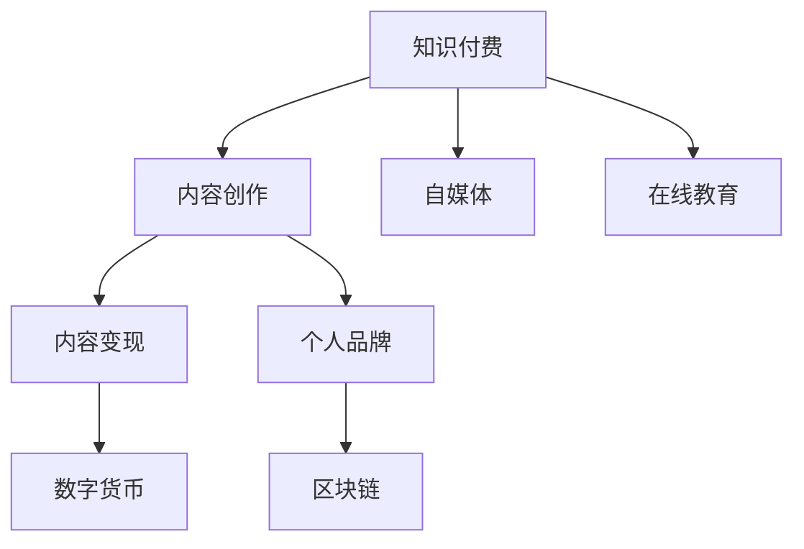

                 

# 程序员利用知识付费打造个人影响力

> 关键词：知识付费, 程序员, 个人品牌, 自媒体, 在线教育, 内容创造, 数字货币, 区块链

## 1. 背景介绍

### 1.1 问题由来
随着互联网的普及和数字经济的发展，知识和信息资源日益丰富，传统教育模式已经无法满足人们日益增长的学习需求。知识付费模式应运而生，成为一种高效、便捷的学习方式。在信息爆炸的时代，如何通过知识付费平台建立个人影响力，成为程序员和内容创作者普遍关心的问题。

知识付费平台如得到、付费微信、知乎live等，通过付费订阅、单次购买等形式，为用户提供有价值的内容，改变了传统的免费获取信息的方式。平台上的内容主要来自专家学者、行业大咖、知名博主等具有一定影响力的知识输出者。这些知识输出者不仅可以获得经济收入，还可以通过内容建立个人品牌，吸引更多关注，形成良性循环。

### 1.2 问题核心关键点
如何利用知识付费平台打造个人影响力？这是一个涉及内容质量、平台选择、受众分析、营销策略等综合问题。核心在于如何通过高质量内容输出，吸引并留住粉丝，建立专业权威的形象，最终实现商业变现。

本文将从内容创作、平台选择、粉丝运营、商业变现等方面，全面探讨程序员如何利用知识付费打造个人影响力，助其转型为内容创作者，实现个人品牌价值最大化。

## 2. 核心概念与联系

### 2.1 核心概念概述

为更好地理解程序员利用知识付费建立个人影响力的过程，本节将介绍几个密切相关的核心概念：

- 知识付费：通过付费方式获取知识、信息、技能等资源，相较于传统免费获取方式，知识付费平台提供的内容更具权威性、准确性和实用性。

- 内容创作：知识付费的核心在于内容，包括文字、图片、视频、音频等形式，内容创作者需具备专业知识和创造能力。

- 自媒体：通过网络平台自我推广，形成具有一定影响力的个人品牌。

- 在线教育：利用网络技术，实现远程教学、实时互动等功能，旨在提高教育质量和效率。

- 内容变现：将知识内容转化为经济收益，包括广告收入、付费订阅、商品销售等。

- 个人品牌：通过持续输出有价值的内容，建立专业的个人形象，提升品牌知名度。

- 数字货币：利用区块链技术实现的去中心化货币体系，为知识付费平台的经济交易提供保障。

- 区块链：一种分布式账本技术，可以实现去中心化、高安全性的数据存储和交易。

这些核心概念之间的逻辑关系可以通过以下Mermaid流程图来展示：



这个流程图展示的知识付费的核心概念及其之间的关系：

1. 知识付费平台通过内容创作吸引用户，用户通过付费获取知识。
2. 内容创作者通过自媒体推广，吸引更多粉丝。
3. 内容变现将内容转化为经济收益。
4. 个人品牌提升知名度和影响力。
5. 数字货币保障经济交易安全。
6. 区块链提供去中心化的技术基础。

## 3. 核心算法原理 & 具体操作步骤

### 3.1 算法原理概述

知识付费平台利用内容创作的价值最大化，主要基于以下算法原理：

- 匹配算法：根据用户的兴趣和行为，匹配相关内容，提升用户满意度和留存率。
- 推荐算法：基于用户历史行为和评价，推荐高质量内容，引导用户消费。
- 个性化算法：通过用户画像和行为数据，提供个性化推荐，提升用户粘性。

通过这些算法，平台能够有效提高内容的曝光率，吸引更多付费用户，从而实现商业变现。

### 3.2 算法步骤详解

基于知识付费平台的算法原理，内容创作者可以遵循以下步骤，最大化自身影响力的提升：

**Step 1: 选择合适的平台**
- 根据内容类型和受众群体，选择合适的知识付费平台，如技术类内容可以选择CSDN、知乎live等平台。
- 分析平台的特点和规则，了解用户偏好和平台盈利模式。

**Step 2: 高质量内容输出**
- 分析目标受众的需求和兴趣，设计有价值、有趣的内容，增加内容的吸引力。
- 不断提升内容创作水平，持续输出高质量文章、视频、PPT等。

**Step 3: 内容推广与运营**
- 利用自媒体平台推广内容，增加曝光率和关注度。
- 与平台合作，参加活动和讲座，提升个人影响力。
- 积极与粉丝互动，回应用户评论和反馈，建立良好关系。

**Step 4: 内容变现与商业化**
- 探索不同的变现方式，如付费订阅、单次购买、社群付费等。
- 建立个人品牌，提升内容价值，吸引更多付费用户。
- 合作广告、赞助、联名商品等，增加经济收入。

### 3.3 算法优缺点

知识付费平台利用算法原理，对内容创作者的影响力提升具有以下优点：

1. 提升曝光率：通过匹配和推荐算法，内容的曝光率显著提高，有助于内容创作者的推广。
2. 精准推荐：个性化推荐算法根据用户偏好，推送相关内容，提升用户满意度。
3. 精准变现：通过精准匹配和推荐，增加内容的销售转化率，实现商业变现。

但同时也存在一些缺点：

1. 竞争激烈：内容创作者众多，需要具备创新能力和独特视角，才能脱颖而出。
2. 平台依赖：过分依赖平台推广，难以完全掌控用户流量和变现方式。
3. 算法限制：平台算法的局限性可能影响内容的传播效果，缺乏个性化用户推荐。
4. 粉丝忠诚度：部分粉丝对内容创作者过于依赖，离开平台后难以维持长期关系。

### 3.4 算法应用领域

知识付费平台的算法原理，已经在多个领域得到广泛应用，包括但不限于：

- 在线教育：利用推荐和个性化算法，实现高质量课程的精准推荐。
- 内容创作：通过匹配算法，将有价值的内容推荐给目标受众。
- 数字出版：利用内容推荐和版权保护技术，提升数字内容的市场价值。
- 广告投放：通过精准用户画像和行为数据，实现广告的精准投放。
- 社交电商：利用个性化推荐和互动功能，提升电商平台的转化率和用户粘性。

## 4. 数学模型和公式 & 详细讲解 & 举例说明

### 4.1 数学模型构建

假设知识付费平台有N个用户，每个用户对内容A的评分$R_{A,i}$，用户i对内容A的兴趣系数为$w_{A,i}$。内容A的平均评分$\bar{R}_{A}$，内容A的推荐分数为$S_A$。

内容A的推荐分数由两部分组成：

$$
S_A = \sum_{i=1}^N w_{A,i} R_{A,i} + \beta(\bar{R}_{A} - \bar{R}_u)
$$

其中，$\beta$为兴趣系数调节参数，$u$为用户i的平均评分。

推荐算法使用以下公式：

$$
\text{推荐内容} = \text{排序算法}(S_A)
$$

### 4.2 公式推导过程

以协同过滤算法为例，推导推荐内容的排序过程：

1. 计算用户i对内容A的评分$R_{A,i}$：
$$
R_{A,i} = \alpha_{A,i} \times R_{A,i} + (1-\alpha_{A,i}) \times \bar{R}_{A}
$$

2. 计算内容A的推荐分数$S_A$：
$$
S_A = \sum_{i=1}^N w_{A,i} R_{A,i} + \beta(\bar{R}_{A} - \bar{R}_u)
$$

3. 排序算法根据$S_A$排序推荐内容：
$$
\text{排序结果} = \text{排序算法}(S_A)
$$

在实际应用中，$\alpha_{A,i}$和$w_{A,i}$等参数需要通过大量用户行为数据进行训练和优化。

### 4.3 案例分析与讲解

假设知识付费平台有10000个用户，平台推荐一篇关于Python编程的内容。根据协同过滤算法，用户对内容A的评分$R_{A,i}$如下所示：

| 用户i | $R_{A,i}$ |
| ----- | -------- |
| 1     | 4        |
| 2     | 3.5      |
| ...   | ...      |
| 10000 | 2.8      |

用户i对内容A的兴趣系数$w_{A,i}$为1，内容A的平均评分$\bar{R}_{A}=3$，用户i的平均评分$\bar{R}_u=2.8$。

根据公式计算内容A的推荐分数：

$$
S_A = 4 \times 1 + \beta(3 - 2.8) = 4 + 0.2 \times 0.2 = 4.04
$$

排序算法将内容A推荐给评分高于平均评分的用户，如用户1、2等。

## 5. 项目实践：代码实例和详细解释说明

### 5.1 开发环境搭建

在知识付费平台上进行内容创作和推广，需要搭建合适的开发环境。以下是使用Python进行知识付费平台内容创作的开发环境配置流程：

1. 安装Python：从官网下载并安装Python，建议选择3.8及以上版本。

2. 安装pip：
```bash
curl --retry 3 -o get-pip.py https://bootstrap.pypa.io/get-pip.py
python get-pip.py
```

3. 安装Jupyter Notebook：
```bash
pip install jupyterlab
```

4. 安装相关的Python库：
```bash
pip install requests pandas numpy matplotlib jupyter pandas-datareader
```

5. 安装Markdown编辑器：如Typora、MindNode等，用于撰写和编辑内容。

完成上述步骤后，即可在Jupyter Notebook环境中进行内容创作和分析。

### 5.2 源代码详细实现

以下是一个简单的知识付费内容推荐系统的代码实现示例，展示如何利用用户评分和兴趣系数进行内容推荐：

```python
import pandas as pd
import numpy as np
from scipy.spatial.distance import cosine

# 数据集
df = pd.read_csv('user_content_scores.csv')

# 计算用户i对内容A的评分
def user_content_score(user_id, content_id):
    return df.loc[(df['user_id'] == user_id), 'content_score'][0]

# 计算内容A的推荐分数
def content_recommendation_score(content_id):
    # 计算内容A的平均评分
    avg_score = df.loc[:, 'content_score'].mean()
    # 计算用户对内容A的评分
    user_scores = [user_content_score(user_id, content_id) for user_id in df['user_id']]
    # 计算内容A的推荐分数
    recommendation_score = np.mean(user_scores) + 0.2 * (avg_score - df.loc[:, 'user_average_score'].mean())
    return recommendation_score

# 计算用户i对内容A的兴趣系数
def user_content_interest_coefficient(user_id, content_id):
    return 1.0

# 计算内容A的推荐分数
def content_recommendation(content_id):
    scores = [user_content_score(user_id, content_id) for user_id in df['user_id']]
    avg_score = df.loc[:, 'content_score'].mean()
    user_avg_score = df.loc[:, 'user_average_score'].mean()
    recommendation_score = np.mean(scores) + 0.2 * (avg_score - user_avg_score)
    return recommendation_score

# 推荐内容
def recommend_content(content_id):
    recommendation_score = content_recommendation(content_id)
    return content_id, recommendation_score

# 推荐内容示例
content_id = 'Python编程'
recommendation = recommend_content(content_id)
print(f"推荐内容：{content_id}, 推荐分数：{recommendation[1]}")
```

### 5.3 代码解读与分析

让我们再详细解读一下关键代码的实现细节：

**user_content_score函数**：
- 根据用户ID和内容ID，计算用户对该内容的评分，利用DataFrame的索引定位方法实现。

**content_recommendation_score函数**：
- 计算内容A的平均评分，根据用户评分计算推荐分数，利用Numpy数组进行矩阵运算。

**user_content_interest_coefficient函数**：
- 用户对内容A的兴趣系数统一为1.0，实际应用中需要根据用户行为数据进行动态调整。

**content_recommendation函数**：
- 计算内容A的推荐分数，将用户评分、平均评分、用户平均评分等计算结果集成。

**recommend_content函数**：
- 推荐内容并输出推荐分数，利用DataFrame的索引定位和Numpy数组计算。

**推荐内容示例**：
- 根据函数计算推荐内容，输出推荐内容ID和推荐分数。

## 6. 实际应用场景

### 6.1 内容创作与推广

在知识付费平台上，内容创作者可以通过以下几种方式进行内容创作和推广：

**开设专栏**：在平台开设个人专栏，定期发布有价值的技术文章、视频、PPT等，吸引粉丝关注和订阅。

**参加活动**：参与平台的直播、讨论、讲座等活动，增加曝光率和互动机会，提升个人影响力。

**建立社群**：在平台上建立自己的社群，邀请粉丝加入，定期分享内容和互动，建立忠实粉丝群体。

**合作推广**：与其他内容创作者、自媒体合作推广，增加粉丝群体和曝光率。

**单次付费内容**：发布单次付费内容，如在线课程、技术讲座、专题报告等，快速获得经济收益。

### 6.2 粉丝运营与互动

在知识付费平台上，粉丝运营和互动是建立个人影响力的重要环节：

**回复评论与私信**：积极回复粉丝的评论和私信，建立良好的互动关系。

**定期互动**：定期发布内容，与粉丝进行互动和交流，增加粉丝粘性。

**反馈优化**：根据粉丝的反馈和建议，持续优化内容创作和推广策略。

**粉丝活动**：组织粉丝活动，如在线问答、技术讨论会等，增加粉丝的参与感和归属感。

**粉丝互动平台**：利用微博、微信公众号、抖音等自媒体平台，与粉丝进行互动，增加曝光率和粉丝粘性。

### 6.3 商业变现与合作

在知识付费平台上，内容创作者可以探索以下几种商业变现和合作方式：

**付费订阅**：推出付费订阅计划，定期发布有价值的内容，吸引粉丝订阅，实现长期收益。

**单次购买**：发布单次付费内容，如技术教程、产品评测、行业报告等，快速获得经济收益。

**知识星球**：在知识星球平台上发布内容，吸引粉丝付费加入，建立专属社群。

**广告合作**：与广告主合作，发布广告内容，获得广告收益。

**联名商品**：与品牌合作，推出联名商品，增加经济收入。

**技术咨询**：提供技术咨询和培训服务，增加线下收入。

## 7. 工具和资源推荐

### 7.1 学习资源推荐

为了帮助内容创作者掌握知识付费平台的运营技巧，这里推荐一些优质的学习资源：

1. **《知识付费平台运营手册》**：详细介绍了知识付费平台的运营策略、内容创作、用户互动等，适用于新手入门。
2. **《内容创作者变现手册》**：介绍了内容变现的多样方式和技巧，包括付费订阅、单次购买、广告合作等。
3. **《自媒体运营实战手册》**：详细介绍了自媒体平台的使用技巧、粉丝运营、互动策略等。
4. **《数字货币与区块链入门》**：介绍了数字货币和区块链的基本概念和技术原理，适用于内容创作者了解相关知识。
5. **《在线教育平台建设与运营》**：介绍了在线教育平台的建设、内容开发、用户管理等，适用于内容创作者建立教育平台。

通过对这些资源的学习，相信内容创作者能够快速掌握知识付费平台的运营技巧，提升个人影响力。

### 7.2 开发工具推荐

高效的开发离不开优秀的工具支持。以下是几款用于知识付费平台内容创作的常用工具：

1. **Jupyter Notebook**：用于数据处理和内容创作，支持Python、R等语言，提供交互式编程环境。
2. **Markdown编辑器**：如Typora、MindNode等，用于撰写和编辑内容，支持多种格式和富文本编辑。
3. **内容管理系统**：如WordPress、Wix等，用于发布和管理内容，支持多平台推广。
4. **视频编辑工具**：如Adobe Premiere、Final Cut Pro等，用于制作高质量视频内容。
5. **音频编辑工具**：如Audacity、Adobe Audition等，用于制作高质量音频内容。

合理利用这些工具，可以显著提升知识付费平台的内容创作效率，加速创新迭代的步伐。

### 7.3 相关论文推荐

内容创作者需要掌握的知识付费平台算法原理，涉及内容推荐、广告投放、数据分析等多个方面，以下是几篇奠基性的相关论文，推荐阅读：

1. **《协同过滤推荐系统》**：介绍了协同过滤推荐算法的基本原理和实现方法，适用于内容推荐系统。
2. **《基于LSTM的内容推荐系统》**：介绍了使用LSTM网络进行内容推荐的思路和方法，适用于在线教育平台。
3. **《用户行为分析与个性化推荐》**：介绍了用户行为分析的基本方法和技术，适用于内容推荐和广告投放。
4. **《区块链技术在知识付费中的应用》**：介绍了区块链技术在知识付费平台中的应用和优势，适用于内容创作者了解相关知识。
5. **《数字货币与去中心化交易》**：介绍了数字货币和去中心化交易的基本概念和技术原理，适用于内容创作者了解相关知识。

这些论文代表了大语言模型微调技术的发展脉络。通过学习这些前沿成果，可以帮助内容创作者把握学科前进方向，激发更多的创新灵感。

## 8. 总结：未来发展趋势与挑战

### 8.1 总结

本文对程序员如何利用知识付费平台打造个人影响力的过程进行了全面系统的介绍。首先，介绍了知识付费平台的运营策略、内容创作、粉丝运营、商业变现等核心概念和联系。其次，详细讲解了知识付费平台的算法原理和操作步骤，展示了内容创作者如何通过高质量内容输出，吸引并留住粉丝，建立专业权威的形象，最终实现商业变现。

通过本文的系统梳理，可以看到，知识付费平台为程序员和内容创作者提供了广阔的发展空间，通过内容创作和粉丝运营，可以逐步建立个人品牌，实现商业变现。未来，伴随知识付费平台的持续发展，相信越来越多的程序员和内容创作者将会在这个领域取得突破，打造个人影响力，实现商业价值最大化。

### 8.2 未来发展趋势

展望未来，知识付费平台的运营和发展将呈现以下几个趋势：

1. **内容多元化**：随着用户需求的不断变化，知识付费平台将推出更多元化的内容形式，如图书、视频、音频、直播等，满足不同用户群体的需求。
2. **技术创新**：知识付费平台将引入更多新技术，如AI辅助创作、语音识别、虚拟现实等，提升内容质量和用户体验。
3. **个性化推荐**：利用大数据和AI技术，实现更加精准、个性化的内容推荐，提高用户满意度和留存率。
4. **移动化趋势**：随着移动互联网的普及，知识付费平台将进一步向移动端倾斜，提供便捷、快速的内容获取方式。
5. **国际化发展**：知识付费平台将逐步国际化，吸引全球用户，拓展全球市场。
6. **区块链应用**：知识付费平台将探索区块链技术在版权保护、内容变现等方面的应用，提升平台的安全性和可信度。

以上趋势凸显了知识付费平台的发展前景，将为程序员和内容创作者提供更广阔的发展空间。

### 8.3 面临的挑战

尽管知识付费平台的发展前景广阔，但在迈向更加智能化、普适化应用的过程中，它仍面临着诸多挑战：

1. **内容质量**：内容创作者需要不断提升内容创作水平，避免同质化、低质量的内容，确保内容的专业性和独特性。
2. **平台竞争**：知识付费平台众多，内容创作者需要具备较强的市场竞争意识和创新能力，才能脱颖而出。
3. **用户获取**：平台获取新用户的成本较高，内容创作者需要借助多种渠道推广，吸引更多粉丝。
4. **粉丝维护**：粉丝流失率高，内容创作者需要建立良好的互动机制，持续吸引粉丝关注和互动。
5. **商业变现**：内容创作者需要灵活运用多种变现方式，避免过分依赖单一收入来源。

### 8.4 研究展望

面对知识付费平台面临的挑战，未来的研究需要在以下几个方面寻求新的突破：

1. **内容质量提升**：如何利用AI技术提升内容创作水平，减少同质化内容，增加高质量内容输出。
2. **多平台推广**：如何通过多平台推广，快速获取新用户，吸引更多粉丝。
3. **粉丝互动机制**：如何建立有效的粉丝互动机制，提高粉丝粘性和忠诚度。
4. **内容变现策略**：如何探索多种内容变现方式，增加经济收入。
5. **用户数据分析**：如何利用用户数据分析，精准推荐内容和变现。

这些研究方向的探索，必将引领知识付费平台的发展方向，为程序员和内容创作者提供更多创新空间，实现商业价值最大化。

## 9. 附录：常见问题与解答

**Q1：知识付费平台如何选择？**

A: 选择知识付费平台时，应根据内容类型和目标受众选择合适的平台。如技术类内容可以选择CSDN、知乎live等平台，教育类内容可以选择好未来、网易公开课等平台。

**Q2：如何提升内容质量？**

A: 提升内容质量的关键在于持续学习和创新。内容创作者应关注最新技术动态，不断提升自身技术水平。同时，利用数据分析工具，了解用户需求和偏好，优化内容创作策略。

**Q3：粉丝流失率高怎么办？**

A: 粉丝流失率高可以通过多种方式解决，如定期互动、组织粉丝活动、发布高质量内容等。建立良好的互动机制，持续吸引粉丝关注和互动。

**Q4：如何建立个人品牌？**

A: 建立个人品牌需要持续输出有价值的内容，并积极与粉丝互动，建立良好的形象和信誉。同时，参加平台活动和讲座，增加曝光率和影响力。

**Q5：如何商业变现？**

A: 商业变现应灵活运用多种方式，如付费订阅、单次购买、广告合作、联名商品等。内容创作者应根据自身特点和市场需求，选择合适的变现方式。

---

作者：禅与计算机程序设计艺术 / Zen and the Art of Computer Programming

