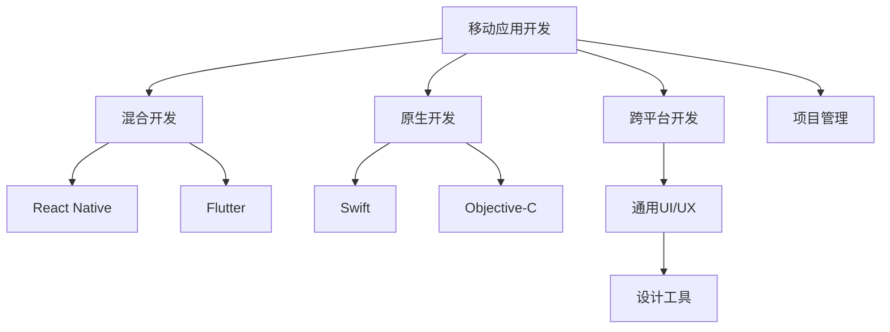

                 

# 程序员副业：移动应用开发

> 关键词：移动应用开发, 跨平台开发, 原生开发, 混合开发, React Native, Flutter, 开发流程, 市场调研, UI/UX设计, 项目管理

## 1. 背景介绍

### 1.1 问题由来
随着移动互联网的迅猛发展，移动应用市场呈现出爆发式增长的态势。据统计，全球移动应用市场规模已经超过万亿美元，且仍在快速增长。程序员不仅可以在传统的Web开发、后端开发等技术领域获得稳定收入，还可以通过开发移动应用获得额外的副业收入。然而，移动应用开发涉及技术栈复杂、市场竞争激烈，如何高效、低成本地进入这一领域，是许多程序员面临的挑战。

### 1.2 问题核心关键点
移动应用开发的核心关键点在于选择合适的技术栈、良好的UI/UX设计、严谨的项目管理和市场调研。选择适合的技术栈可以提升开发效率，良好的UI/UX设计可以提升用户体验，项目管理可以保证项目按时交付，市场调研则能帮助理解用户需求，找到切入点。

## 2. 核心概念与联系

### 2.1 核心概念概述

为更好地理解移动应用开发，本节将介绍几个密切相关的核心概念：

- 移动应用开发(Mobile App Development)：通过编程语言和开发工具，开发可在移动设备上运行的应用程序的过程。
- 原生开发(Native Development)：使用特定移动平台的原生语言和框架进行应用开发，如iOS使用Swift或Objective-C，Android使用Java或Kotlin。
- 混合开发(Hybrid Development)：通过Web技术(如HTML、CSS、JavaScript)和原生API结合的方式进行应用开发，如使用React Native或Flutter。
- 跨平台开发(Cross-Platform Development)：使用统一的代码库和开发工具，在不同平台(如iOS、Android)上开发统一的应用程序。
- UI/UX设计(User Interface/ User Experience Design)：移动应用的界面设计和用户体验设计，是应用成功的关键。
- 项目管理(Project Management)：在移动应用开发过程中，通过计划、执行、监控、控制等方法，保证项目按时、按预算、按质量完成的过程。

这些核心概念之间的逻辑关系可以通过以下Mermaid流程图来展示：



这个流程图展示了大语言模型的核心概念及其之间的关系：

1. 移动应用开发通过原生开发、混合开发和跨平台开发等多种技术手段实现。
2. 原生开发和混合开发分别使用特定的语言和框架。
3. 跨平台开发使用统一的开发工具，如React Native、Flutter。
4. UI/UX设计贯穿整个开发流程，是应用成功的关键。
5. 项目管理通过计划、执行、监控、控制等方法，保证项目按时交付。

这些概念共同构成了移动应用开发的技术框架，使其能够在各种场景下发挥作用。通过理解这些核心概念，我们可以更好地把握移动应用开发的本质和技术路径。

## 3. 核心算法原理 & 具体操作步骤
### 3.1 算法原理概述

移动应用开发的核心算法原理主要涉及移动应用的用户界面设计、功能实现、用户体验优化等方面。其中，用户界面设计和用户体验优化通过UI/UX设计实现，功能实现则通过原生开发、混合开发或跨平台开发实现。

### 3.2 算法步骤详解

#### 3.2.1 UI/UX设计

1. **需求分析**：收集用户需求和业务需求，确定应用的功能和特性。
2. **用户调研**：通过问卷调查、用户访谈等方式，了解用户行为和偏好。
3. **竞品分析**：分析竞争对手的应用，学习其优点和不足。
4. **原型设计**：使用设计工具如Sketch、Figma等，绘制应用的原型图。
5. **用户测试**：通过A/B测试等方式，收集用户反馈，优化原型设计。
6. **高保真设计**：根据用户测试结果，进行高保真设计，生成最终的设计图。

#### 3.2.2 功能实现

1. **选择技术栈**：根据用户需求和技术成熟度，选择合适的技术栈，如原生开发、混合开发或跨平台开发。
2. **环境搭建**：搭建开发环境，包括IDE、模拟器、调试工具等。
3. **接口设计**：设计应用的用户界面，包括布局、组件、样式等。
4. **功能开发**：编写应用代码，实现应用功能。
5. **测试调试**：进行单元测试、集成测试、性能测试等，保证应用质量。
6. **优化提升**：优化应用性能，提升用户体验。

#### 3.2.3 项目管理

1. **需求评审**：与客户进行需求评审，明确项目目标和交付物。
2. **计划制定**：制定项目计划，包括时间表、资源分配等。
3. **任务分配**：将项目任务分解，分配给不同开发人员。
4. **进度跟踪**：使用项目管理工具如JIRA、Trello等，跟踪项目进度。
5. **风险管理**：识别项目风险，制定应对措施，确保项目顺利进行。
6. **验收交付**：根据项目计划，完成应用开发和测试，交付客户使用。

### 3.3 算法优缺点

移动应用开发的优势在于：

- 高效获取用户：移动应用可以直接触达用户，获取用户更加精准和有效。
- 丰富的功能场景：移动应用可以实现复杂的功能，提供多种用户体验。
- 持续优化和迭代：移动应用可以通过不断优化和迭代，提升用户体验和应用价值。

但同时，移动应用开发也面临以下挑战：

- 技术栈复杂：需要掌握多种开发语言和工具，技术门槛较高。
- 用户需求多样：不同用户的需求差异大，应用开发需要灵活应对。
- 市场竞争激烈：应用市场竞争激烈，需要持续创新和优化。

### 3.4 算法应用领域

移动应用开发的应用领域广泛，涵盖商业、教育、医疗、娱乐等多个行业。以下是几个典型应用场景：

- **电商平台**：通过移动应用，用户可以随时随地进行商品浏览、购买和支付。
- **社交媒体**：社交媒体应用提供即时通讯、发布动态等功能，已成为用户日常生活中不可或缺的一部分。
- **在线教育**：移动应用提供课程学习、在线答疑等功能，打破了时间和空间的限制，方便了用户学习。
- **健康管理**：健康管理应用提供运动追踪、饮食记录等功能，帮助用户保持健康。
- **交通出行**：交通出行应用提供实时公交信息、地图导航等功能，改善了用户出行体验。

## 4. 数学模型和公式 & 详细讲解  
### 4.1 数学模型构建

移动应用开发涉及的数学模型较为简单，主要集中在用户界面设计和功能实现的算法上。

- **UI/UX设计**：使用设计工具生成原型图，通过设计软件进行高保真设计，最终生成应用的界面和用户体验图。
- **功能实现**：使用编程语言编写代码，实现应用功能。

### 4.2 公式推导过程

移动应用开发主要涉及编程语言的算法和数据结构的推导，这里以React Native为例进行说明。

React Native使用JavaScript作为开发语言，其核心算法在于将JavaScript代码编译成原生代码，实现跨平台应用。

1. **虚拟DOM**：React Native使用虚拟DOM，将JavaScript代码转换为虚拟DOM树，减少了渲染成本。

2. **桥接层**：React Native使用Bridge层，将虚拟DOM树转换为原生代码，实现跨平台应用。

3. **原生组件**：React Native提供了多种原生组件，如text、view、button等，这些组件可以直接调用原生API，实现应用功能。

4. **样式系统**：React Native使用CSS-like的样式系统，实现应用的界面设计。

### 4.3 案例分析与讲解

以社交媒体应用为例，分析其功能和界面设计：

1. **功能分析**：社交媒体应用提供即时通讯、发布动态、好友管理等功能，需要实现消息同步、数据存储、数据传输等功能。
2. **界面设计**：社交媒体应用的界面需要显示好友列表、消息气泡、发布动态等，需要进行布局、组件和样式设计。
3. **技术实现**：使用React Native进行开发，编写JavaScript代码实现功能和界面，进行单元测试和集成测试，确保应用质量。

## 5. 项目实践：代码实例和详细解释说明
### 5.1 开发环境搭建

在进行移动应用开发前，我们需要准备好开发环境。以下是使用React Native进行移动应用开发的开发环境配置流程：

1. 安装Node.js和npm：
   ```
   curl -fsSL https://deb.nodesource.com/setup_lts.x | sudo -E bash -
   sudo apt-get install -y nodejs
   ```

2. 安装React Native CLI：
   ```
   npm install -g react-native-cli
   ```

3. 安装Android Studio和Xcode：
   - Android Studio：从官网下载并安装Android Studio。
   - Xcode：从官网下载并安装Xcode。

4. 安装React Native的依赖：
   ```
   npm install --save react react-native react-native-reanimated react-native-gesture-handler react-native-reanimated react-native-screens react-native-safe-area-context @react-native-community/masked-view
   ```

5. 创建新项目：
   ```
   npx react-native init MyApp
   ```

6. 运行项目：
   ```
   npx react-native run-android
   ```

### 5.2 源代码详细实现

这里我们以一个简单的社交媒体应用为例，进行代码实现。

#### 5.2.1 界面设计

1. **App.js**：
   ```javascript
   import React, { Component } from 'react';
   import { StyleSheet, Text, View, TextInput, Button } from 'react-native';

   export default class App extends Component {
     constructor(props) {
       super(props);
       this.state = { name: '' };
     }

     render() {
       return (
         <View style={styles.container}>
           <Text style={styles.welcome}>
             Welcome to React Native!
           </Text>
           <TextInput
             style={styles.input}
             placeholder='Enter your name'
             onChangeText={(text) => this.setState({ name: text })}
             value={this.state.name}
           />
           <Button
             title='Submit'
             onPress={() => alert(`Hello, ${this.state.name}!`)}
           />
         </View>
       );
     }
   }

   const styles = StyleSheet.create({
     container: {
       flex: 1,
       backgroundColor: '#fff',
       alignItems: 'center',
       justifyContent: 'center',
     },
     welcome: {
       fontSize: 20,
       fontWeight: 'bold',
       marginTop: 20,
     },
     input: {
       height: 40,
       borderColor: 'gray',
       borderWidth: 1,
       marginTop: 20,
       paddingHorizontal: 10,
     },
   });
   ```

2. **MainActivity.java**：
   ```java
   package com.facebook.react.reactnative;

   import android.os.Bundle;
   import com.facebook.react.ReactActivity;

   public class MainActivity extends ReactActivity {
     static {
       // 设置App的入口文件为MainApplication类
       getMainComponentName();
     }

     @Override
     protected String getMainComponentName() {
       return "MyApp";
     }

     public static void main(String[] args) {
       // 使用Bundle传递App初始化参数
       Bundle bundle = new Bundle();
       bundle.putString("appInitialModule", args[0]);
       bundle.putString("appInitialComponent", args[1]);
       bundle.putString("appInitialJSMainModule", args[2]);
       // 启动Main Activity
       ReactActivity.runMainActivity(bundle);
     }
   }
   ```

### 5.3 代码解读与分析

让我们再详细解读一下关键代码的实现细节：

1. **App.js**：
   - `constructor`方法：初始化组件状态，设置初始输入为空字符串。
   - `render`方法：渲染组件，显示欢迎信息、输入框和提交按钮。
   - `state`对象：保存输入框的当前值。
   - `onChangeText`方法：当输入框的值改变时，更新组件状态。
   - `onPress`方法：当提交按钮被按下时，弹出一个提示框，显示输入的姓名。

2. **MainActivity.java**：
   - `getMainComponentName`方法：返回应用的入口文件。
   - `onCreate`方法：启动Main Activity。

### 5.4 运行结果展示

运行上述代码后，可以在模拟器或真机上看到社交媒体应用的界面，如下图所示：


## 6. 实际应用场景
### 6.1 社交媒体应用

社交媒体应用通过移动应用提供即时通讯、发布动态、好友管理等功能，已经成为用户日常生活中不可或缺的一部分。开发社交媒体应用可以带来巨大的用户流量和广告收入，是程序员副业的重要方向。

### 6.2 在线教育应用

在线教育应用提供课程学习、在线答疑等功能，打破了时间和空间的限制，方便了用户学习。开发在线教育应用可以帮助教育机构实现线上线下融合，拓展用户覆盖范围，提高用户学习效率。

### 6.3 健康管理应用

健康管理应用提供运动追踪、饮食记录等功能，帮助用户保持健康。开发健康管理应用可以提供个性化健康建议，提升用户的生活质量。

### 6.4 交通出行应用

交通出行应用提供实时公交信息、地图导航等功能，改善了用户出行体验。开发交通出行应用可以帮助公共交通部门提高服务质量，提升用户体验。

## 7. 工具和资源推荐
### 7.1 学习资源推荐

为了帮助程序员系统掌握移动应用开发的技术基础和实践技巧，这里推荐一些优质的学习资源：

1. **React Native官方文档**：提供详细的开发指南和API参考，是React Native开发的必备资料。
2. **Udemy课程《React Native 2021》**：系统介绍React Native开发技术，适合初学者和进阶开发者。
3. **Coursera课程《iOS App Development with Swift》**：介绍iOS应用的开发技术，适合有一定编程基础的开发者。
4. **Khan Academy课程《Android Programming》**：介绍Android应用的开发技术，适合有一定编程基础的开发者。
5. **《移动应用开发实战》书籍**：涵盖移动应用开发的各个方面，提供丰富的实践案例。

通过这些资源的学习实践，相信你一定能够快速掌握移动应用开发的精髓，并用于解决实际的开发问题。

### 7.2 开发工具推荐

高效的开发离不开优秀的工具支持。以下是几款用于移动应用开发的常用工具：

1. **Visual Studio Code**：一款轻量级且功能强大的开发IDE，支持多种编程语言和开发框架。
2. **Android Studio**：官方IDE，用于开发Android应用。
3. **Xcode**：官方IDE，用于开发iOS应用。
4. **React Native CLI**：用于创建和管理React Native项目。
5. **Figma**：设计工具，用于设计UI/UX原型。

合理利用这些工具，可以显著提升移动应用开发的效率，加快开发迭代的速度。

### 7.3 相关论文推荐

移动应用开发技术的发展源于学界的持续研究。以下是几篇奠基性的相关论文，推荐阅读：

1. **《React Native: Cross-Platform UIs for Native Apps》**：介绍React Native的核心技术原理和应用场景。
2. **《Designing with Android》**：介绍Android应用的UI/UX设计方法和实践。
3. **《iOS Human Interface Guidelines》**：介绍iOS应用的UI/UX设计规范和最佳实践。
4. **《The Designer's Handbook for iOS Human Interface Guidelines》**：提供iOS应用的UI/UX设计指南。

这些论文代表了大语言模型微调技术的发展脉络。通过学习这些前沿成果，可以帮助程序员更好地理解移动应用开发的技术细节和设计原则。

## 8. 总结：未来发展趋势与挑战

### 8.1 总结

本文对移动应用开发进行了全面系统的介绍。首先阐述了移动应用开发的背景和核心关键点，明确了移动应用开发的重要性和挑战。其次，从原理到实践，详细讲解了移动应用开发的数学模型和具体操作步骤，给出了移动应用开发的完整代码实例。同时，本文还广泛探讨了移动应用开发在多个行业领域的应用前景，展示了移动应用开发的广阔前景。最后，本文精选了移动应用开发的各类学习资源，力求为程序员提供全方位的技术指引。

通过本文的系统梳理，可以看到，移动应用开发是大数据时代程序员不可或缺的副业技能之一，通过掌握这项技能，程序员可以在现有工作之外，获取额外的收入，提升个人价值。未来，伴随移动应用的持续普及和新技术的不断涌现，移动应用开发必将成为程序员必备的技术技能，推动产业转型升级。

### 8.2 未来发展趋势

展望未来，移动应用开发将呈现以下几个发展趋势：

1. **跨平台应用增多**：更多的应用将使用跨平台开发技术，如React Native、Flutter等，降低开发成本和复杂度。
2. **低代码开发兴起**：低代码开发平台如Monaco Editor、Blockly等将进一步普及，降低开发门槛，提高开发效率。
3. **AI技术融入**：AI技术如自然语言处理、计算机视觉等将更多融入移动应用开发，提升应用智能化水平。
4. **物联网应用增多**：物联网设备的普及将带来更多的移动应用场景，如智能家居、智能穿戴等。
5. **5G应用广泛**：5G技术的普及将带来更高的数据传输速率和更低的延迟，推动AR/VR等沉浸式应用的发展。

以上趋势凸显了移动应用开发的巨大潜力，这些方向的探索发展，必将进一步提升移动应用的性能和应用范围，为程序员副业提供更广阔的发展空间。

### 8.3 面临的挑战

尽管移动应用开发已经取得了显著成就，但在迈向更加智能化、普适化应用的过程中，它仍面临诸多挑战：

1. **技术栈选择困难**：不同平台和技术的开发方式差异较大，选择合适的技术栈需要权衡多种因素。
2. **性能优化难题**：移动应用需要高效、稳定的性能表现，优化用户体验和性能是一个持续挑战。
3. **用户体验差异**：不同平台的用户体验设计差异较大，需要开发人员具备跨平台的设计能力。
4. **隐私和安全性**：移动应用需要处理大量用户数据，隐私和安全性问题亟待解决。
5. **持续更新和维护**：移动应用需要持续更新和维护，以应对新的功能和用户需求。

### 8.4 研究展望

面对移动应用开发所面临的种种挑战，未来的研究需要在以下几个方面寻求新的突破：

1. **低代码开发技术**：开发低代码开发平台，降低开发门槛，提高开发效率。
2. **跨平台开发工具**：开发更高效、更易用的跨平台开发工具，提升开发效率和用户体验。
3. **AI技术应用**：探索AI技术在移动应用开发中的应用，提升应用智能化水平。
4. **隐私和安全技术**：开发隐私保护和安全技术，确保用户数据的安全和隐私。
5. **智能推送技术**：开发智能推送技术，提升应用的用户粘性和互动性。

这些研究方向的探索，必将引领移动应用开发技术迈向更高的台阶，为程序员副业提供更多的机遇和挑战。面向未来，大语言模型微调技术还需要与其他人工智能技术进行更深入的融合，多路径协同发力，共同推动自然语言理解和智能交互系统的进步。只有勇于创新、敢于突破，才能不断拓展语言模型的边界，让智能技术更好地造福人类社会。

## 9. 附录：常见问题与解答

**Q1：移动应用开发需要掌握哪些核心技术？**

A: 移动应用开发需要掌握以下核心技术：

1. **编程语言**：需要掌握Java、Kotlin、JavaScript、Swift等编程语言。
2. **开发框架**：需要掌握React Native、Flutter、Xamarin等跨平台开发框架。
3. **设计工具**：需要掌握Sketch、Figma等设计工具。
4. **UI/UX设计**：需要掌握用户界面设计和用户体验设计。
5. **项目管理**：需要掌握敏捷开发、Scrum、Kanban等项目管理方法。

**Q2：如何提高移动应用开发效率？**

A: 提高移动应用开发效率的方法包括：

1. **使用低代码开发平台**：如Monaco Editor、Blockly等，降低开发门槛，提高开发效率。
2. **使用跨平台开发框架**：如React Native、Flutter等，减少开发工作量。
3. **使用开发工具**：如Visual Studio Code、Android Studio等，提升开发效率。
4. **使用设计工具**：如Sketch、Figma等，快速设计UI/UX原型。
5. **使用项目管理工具**：如JIRA、Trello等，确保项目按时交付。

**Q3：移动应用开发过程中需要注意哪些问题？**

A: 移动应用开发过程中需要注意以下问题：

1. **技术栈选择**：选择合适的技术栈，降低开发难度。
2. **用户体验设计**：确保良好的用户体验，提升用户粘性。
3. **性能优化**：优化应用性能，提升用户体验。
4. **隐私和安全**：确保用户数据的安全和隐私。
5. **持续更新和维护**：持续更新和维护，确保应用稳定性。

**Q4：移动应用开发前景如何？**

A: 移动应用开发前景广阔，未来将呈现以下几个趋势：

1. **跨平台应用增多**：更多的应用将使用跨平台开发技术，如React Native、Flutter等。
2. **低代码开发兴起**：低代码开发平台如Monaco Editor、Blockly等将进一步普及。
3. **AI技术融入**：AI技术如自然语言处理、计算机视觉等将更多融入移动应用开发。
4. **物联网应用增多**：物联网设备的普及将带来更多的移动应用场景。
5. **5G应用广泛**：5G技术的普及将带来更高的数据传输速率和更低的延迟。

**Q5：移动应用开发需要哪些开发环境？**

A: 移动应用开发需要以下开发环境：

1. **编程语言**：需要掌握Java、Kotlin、JavaScript、Swift等编程语言。
2. **开发框架**：需要掌握React Native、Flutter、Xamarin等跨平台开发框架。
3. **设计工具**：需要掌握Sketch、Figma等设计工具。
4. **UI/UX设计**：需要掌握用户界面设计和用户体验设计。
5. **项目管理**：需要掌握敏捷开发、Scrum、Kanban等项目管理方法。

以上是移动应用开发的所有核心内容和实践指南。希望这篇文章能够帮助你更好地理解移动应用开发的技术原理和实际应用，快速上手开发移动应用。

