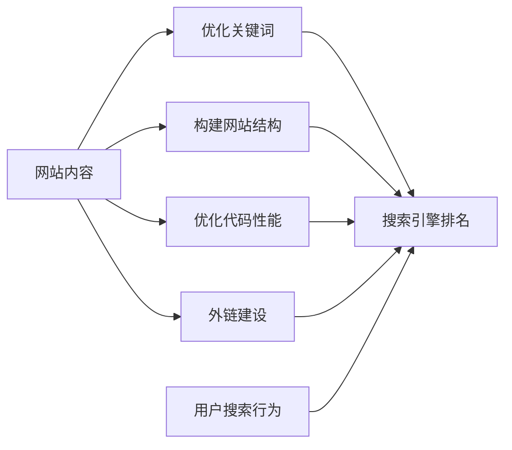

                 

# 程序员如何利用SEO技术提升知识付费曝光

> 关键词：SEO, 知识付费, 曝光, 流量, 技术博客, 搜索引擎优化, 网站优化

## 1. 背景介绍

### 1.1 问题由来
在数字化时代，知识付费成为一种趋势，越来越多的企业和个人开始利用付费形式分享自己的专业知识。但是，如何吸引用户关注并提升其曝光度，一直是知识付费领域的一大难题。在技术层面，SEO（Search Engine Optimization）技术被广泛认为是一种有效的手段，它通过优化网站的搜索引擎排名，从而提升网站的自然搜索流量。本文将深入探讨SEO技术在知识付费领域的潜在应用和具体方法，以帮助程序员和相关从业者通过SEO技术提升其网站的曝光度和流量。

## 2. 核心概念与联系

### 2.1 核心概念概述
SEO，即搜索引擎优化，是一种提高网站在搜索引擎中自然排名的方法。其核心在于优化网站的结构、内容、代码等元素，使其在用户搜索相关关键词时，能够在搜索结果中获得更高的排名。SEO技术广泛应用于各种类型的网站，包括技术博客、在线课程、电子书销售平台等。在知识付费领域，SEO技术可以帮助网站吸引更多潜在用户，提升内容的曝光度，从而增加付费流量。

### 2.2 核心概念原理和架构的 Mermaid 流程图



这个流程图示意了SEO技术的基本流程：首先，对网站内容进行优化，选择和优化关键词；其次，构建网站结构，优化代码性能；再次，通过外链建设提高网站的权威性；最后，考虑用户搜索行为，提高网站在搜索引擎中的排名。

## 3. 核心算法原理 & 具体操作步骤

### 3.1 算法原理概述
SEO技术的核心算法原理包括搜索引擎的工作机制、排名算法、关键词分析等方面。搜索引擎通过算法评估网页的相关性、权威性、用户意图等因素，来确定网页在搜索结果中的排名。SEO技术的目标就是通过优化这些因素，使网站在搜索结果中获得更高的排名。

### 3.2 算法步骤详解

1. **关键词研究**：确定目标关键词，研究其搜索量和竞争度。选择合适的长尾关键词，以获得更高的转化率。

2. **内容优化**：创建高质量、有价值的内容，包括博客文章、视频教程、电子书等。使用关键词优化标题、描述和正文，确保内容的相关性和可读性。

3. **网站结构优化**：确保网站的URL结构清晰、层次分明，便于搜索引擎抓取。使用网站地图（sitemap）帮助搜索引擎更好地索引网站内容。

4. **代码性能优化**：优化网站代码，提高加载速度。使用压缩技术、CDN、浏览器缓存等方法，提升用户体验和搜索引擎排名。

5. **外链建设**：通过高质量的外链，提高网站的权威性和可信度。与相关行业的网站进行合作，交换链接，或通过内容营销获取自然外链。

6. **用户体验优化**：提升网站的用户体验，包括页面加载速度、移动端适配、响应式设计等。用户体验是搜索引擎排名的重要因素之一。

7. **数据分析与调整**：使用工具（如Google Analytics）监测网站流量、用户行为等数据，分析效果，进行持续优化。

### 3.3 算法优缺点
- **优点**：
  - 成本低：SEO技术的实施主要在网站内容和代码优化方面，无需大量广告预算。
  - 长期稳定：SEO排名提升并非一蹴而就，但一旦提升，长期稳定，效果可持续。
  - 自然流量：SEO优化带来的是自然流量，用户更有可能转化成付费客户。

- **缺点**：
  - 见效慢：SEO排名提升需要时间，短期内可能效果不明显。
  - 竞争激烈：尤其是热门关键词，竞争度大，优化难度高。
  - 技术复杂：SEO技术涉及的内容较多，需要系统学习和实践。

### 3.4 算法应用领域
SEO技术不仅适用于技术博客和在线课程销售平台，还广泛应用在电商平台、企业网站、社交媒体等多个领域。在知识付费领域，SEO技术尤其适用于内容驱动型的平台，通过提升内容的曝光度，吸引用户注册和付费。

## 4. 数学模型和公式 & 详细讲解 & 举例说明

### 4.1 数学模型构建
SEO排名的核心在于搜索引擎的算法模型。以Google为例，其排名算法主要由PageRank算法、网页内容相关性、权威性、用户体验等因素决定。以PageRank算法为例，其基本数学模型为：

$$ PageRank(P) = \sum_{i=1}^{N} \frac{1}{C_i} \times L_i(P) $$

其中，$P$为待排名的网页，$N$为网页总数，$C_i$为网页$i$的出度（指向其他网页的链接数），$L_i(P)$为网页$i$到网页$P$的权重。

### 4.2 公式推导过程
PageRank算法的基本思想是通过计算网页的反向链接数和反向链接的质量来确定网页的重要性。公式中，$C_i$表示网页$i$的出度，$L_i(P)$表示网页$i$到网页$P$的权重。权重计算基于多个因素，如反向链接的质量、主题相关性等。

### 4.3 案例分析与讲解
以某技术博客为例，假设该博客包含多个页面，每个页面都有一定数量的反向链接。通过计算每个页面的PageRank值，可以确定其在搜索引擎中的排名。例如，页面A有5个反向链接，其中有两个来自权威网站，页面B有3个反向链接，但只有一个来自权威网站。则：

$$ PageRank(A) = \frac{1}{10} \times \frac{1}{2} + \frac{1}{10} \times \frac{1}{3} + \frac{1}{10} \times 0 + \frac{1}{10} \times 0 + \frac{1}{10} \times 0 + \frac{1}{10} \times 0 + \frac{1}{10} \times 0 + \frac{1}{10} \times 0 + \frac{1}{10} \times 0 + \frac{1}{10} \times 0 = 0.075 $$
$$ PageRank(B) = \frac{1}{10} \times \frac{1}{1} + \frac{1}{10} \times 0 + \frac{1}{10} \times 0 + \frac{1}{10} \times 0 + \frac{1}{10} \times 0 + \frac{1}{10} \times 0 + \frac{1}{10} \times 0 + \frac{1}{10} \times 0 + \frac{1}{10} \times 0 + \frac{1}{10} \times 0 = 0.1 $$

从上述计算结果可以看出，尽管页面A的反向链接数更多，但由于反向链接质量不高，其PageRank值低于页面B。

## 5. 项目实践：代码实例和详细解释说明

### 5.1 开发环境搭建
首先，需要安装Python、Google Analytics等工具，并搭建开发环境。具体步骤如下：

1. 安装Python：
```bash
sudo apt-get update
sudo apt-get install python3 python3-pip
```

2. 安装Google Analytics：
```bash
pip install google-analytics-python
```

3. 搭建开发环境：
```bash
mkdir project
cd project
python3 -m venv venv
source venv/bin/activate
```

### 5.2 源代码详细实现
以下是一个简单的Python脚本，用于监控和优化SEO效果：

```python
import google_analytics
from google_analytics import GoogleAnalytics

# 初始化Google Analytics
ga = GoogleAnalytics('YOUR_API_KEY')

# 获取网站流量数据
traffic_data = ga.get_traffic_data('DATE_RANGE')

# 分析流量数据
# TODO: 分析用户行为，优化SEO策略

# 更新网站内容
# TODO: 优化关键词，创建高质量内容
```

### 5.3 代码解读与分析
上述代码主要使用了Google Analytics API，用于获取和分析网站的流量数据。通过分析流量数据，可以了解用户的访问行为、页面停留时间、跳出率等指标，进而优化SEO策略，如调整关键词、优化内容结构等。

### 5.4 运行结果展示
通过Google Analytics和其他SEO工具，可以实时监控网站的SEO效果，并进行数据分析和调整。例如，如果发现某个关键词的流量持续上升，但转化率较低，可能需要进行关键词优化或内容调整。

## 6. 实际应用场景

### 6.1 智能客服系统

在智能客服系统中，SEO技术可以帮助提升客服页面的搜索引擎排名，从而吸引更多用户访问，提高客户满意度。具体方法包括优化页面关键词、提升用户体验等。

### 6.2 金融舆情监测

在金融舆情监测系统中，SEO技术可以帮助监控热门金融词汇和话题，及时捕捉和分析金融舆情，为投资者提供有价值的信息。

### 6.3 个性化推荐系统

在个性化推荐系统中，SEO技术可以提升推荐页面在搜索引擎中的排名，增加用户的曝光度，提高点击率和转化率。

### 6.4 未来应用展望

未来的SEO技术将进一步结合人工智能、大数据分析等技术，提升搜索引擎的智能化水平，提供更精准的搜索结果。例如，通过自然语言处理技术，优化搜索结果的呈现方式，使用户更方便地找到所需内容。

## 7. 工具和资源推荐

### 7.1 学习资源推荐

1. **《SEO基础教程》**：该书详细介绍了SEO的基本概念和实践技巧，适合初学者入门。
2. **《高级SEO优化技术》**：该书深入探讨了SEO的高级技巧，如反向链接建设、关键词优化等。
3. **Google Analytics官方文档**：Google Analytics的官方文档提供了丰富的教程和示例，帮助用户快速上手。
4. **Moz SEO博客**：Moz是一家知名的SEO工具公司，其博客提供了大量实用的SEO案例和技巧。
5. **SEMrush学院**：SEMrush是一家SEO工具提供商，其学院提供了大量SEO课程和实战教程。

### 7.2 开发工具推荐

1. **Google Analytics**：Google Analytics是最受欢迎的网站流量分析工具，提供了丰富的流量数据和分析功能。
2. **SEMrush**：SEMrush是一款功能强大的SEO工具，支持关键词研究、反向链接分析、竞争对手分析等多种功能。
3. **Ahrefs**：Ahrefs是另一款流行的SEO工具，提供了反向链接分析、关键词研究、内容优化等功能。
4. **Screaming Frog SEO Spider**：Screaming Frog是一款网站抓取和分析工具，支持SEO优化和用户体验优化。
5. **Yoast SEO**：Yoast SEO是一款WordPress插件，支持关键词优化、内容评分等功能。

### 7.3 相关论文推荐

1. **《搜索引擎的PageRank算法》**：该论文详细介绍了PageRank算法的原理和实现方法。
2. **《搜索引擎的排序算法》**：该论文介绍了不同类型的搜索引擎排序算法，如BM25算法、TF-IDF算法等。
3. **《SEO优化策略》**：该论文探讨了各种SEO优化策略，如关键词优化、内容优化、网站结构优化等。

## 8. 总结：未来发展趋势与挑战

### 8.1 研究成果总结
本文系统介绍了SEO技术在知识付费领域的应用和实践方法，帮助程序员和相关从业者通过SEO技术提升网站的曝光度和流量。通过优化网站结构和内容、使用关键词优化、提升用户体验等手段，SEO技术可以有效提升网站的搜索引擎排名，从而吸引更多用户访问，提高转化率。

### 8.2 未来发展趋势
未来的SEO技术将进一步结合人工智能、大数据分析等技术，提升搜索引擎的智能化水平，提供更精准的搜索结果。例如，通过自然语言处理技术，优化搜索结果的呈现方式，使用户更方便地找到所需内容。

### 8.3 面临的挑战
尽管SEO技术具有显著优势，但其实施和优化仍面临诸多挑战。例如，关键词优化需要持续迭代，确保与搜索引擎算法的更新保持一致；用户体验优化需要全面考虑，确保网站加载速度快、响应式设计等。

### 8.4 研究展望
未来的SEO研究将关注以下几个方向：
1. **自然语言处理与SEO结合**：通过自然语言处理技术，优化搜索结果的呈现方式，提升用户体验。
2. **数据驱动的SEO优化**：通过大数据分析，发现用户搜索行为的规律，优化SEO策略。
3. **移动端SEO优化**：移动端用户越来越多，如何优化移动端用户体验和SEO效果，是未来的重要研究方向。

## 9. 附录：常见问题与解答

**Q1：SEO优化是否真的有效？**

A: 是的，SEO优化可以显著提升网站的搜索引擎排名，增加自然流量。研究表明，优化后的网站，其搜索引擎排名一般会显著提升，流量也会有所增加。

**Q2：SEO优化是否需要花费大量时间和精力？**

A: 是的，SEO优化需要持续迭代和优化。虽然短期内效果可能不明显，但长期来看，SEO优化带来的效果是可持续的。因此，需要投入一定的时间和精力，进行持续优化。

**Q3：如何选择合适的关键词？**

A: 关键词的选择是SEO优化的核心之一。通常，选择长尾关键词可以提高转化率，降低竞争度。可以使用工具如Google Keyword Planner、SEMrush等进行关键词研究。

**Q4：SEO优化是否需要专业技能？**

A: 是的，SEO优化需要一定的专业技能。了解搜索引擎算法、关键词优化、网站结构优化等基本概念，是进行SEO优化的前提。可以通过学习和实践，逐步掌握SEO技巧。

**Q5：SEO优化是否适用于所有网站？**

A: 是的，SEO优化适用于各类网站，包括技术博客、在线课程、电商平台等。不同类型网站的SEO优化策略可能会有所不同，但基本的优化原则是一致的。

---

作者：禅与计算机程序设计艺术 / Zen and the Art of Computer Programming

