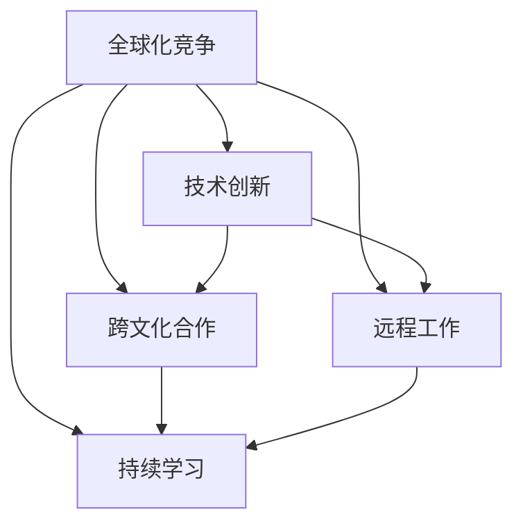

                 

# 程序员如何应对全球化竞争

> 关键词：全球化竞争, 技术创新, 跨文化合作, 远程工作, 持续学习

## 1. 背景介绍

### 1.1 问题由来

全球化竞争正在以前所未有的速度改变着整个IT行业的面貌。随着全球市场的拓展和科技的发展，传统的人力资源和地域优势正逐渐消失，程序员们必须适应更加复杂和多变的竞争环境。尤其在新冠疫情之后，远程工作模式被广泛采用，程序员面临的挑战进一步加剧。因此，探讨如何在全球化竞争中取得优势，成为每一位程序员必须面对的问题。

### 1.2 问题核心关键点

本文聚焦于程序员如何在全球化竞争中提升自身竞争力，将围绕以下几个核心关键点展开：

1. 理解全球化竞争的背景和趋势。
2. 掌握技术创新的核心方法。
3. 跨文化合作的重要性和实现路径。
4. 远程工作的最佳实践和挑战应对。
5. 持续学习和自我提升的策略。

这些关键点将帮助我们全面了解程序员在全球化竞争中面临的挑战和机遇，提供具体的应对策略和实践指南。

## 2. 核心概念与联系

### 2.1 核心概念概述

为更好地理解如何在全球化竞争中保持竞争优势，本节将介绍几个密切相关的核心概念：

- **全球化竞争**：指企业在跨国市场中的竞争。程序员在全球化竞争中需要应对不同国家和地区的市场需求、文化差异、法规政策等挑战。
- **技术创新**：通过新技术、新方法和新工具的引入，解决旧问题或创造新价值的过程。技术创新是程序员在全球化竞争中的核心竞争力之一。
- **跨文化合作**：不同文化背景的团队成员共同协作，完成复杂项目的过程。跨文化合作在远程工作环境中尤为重要。
- **远程工作**：不局限于特定物理位置，通过互联网和其他通信技术完成工作的模式。远程工作对程序员的生产力和协作方式提出了新要求。
- **持续学习**：通过不断学习和更新知识，保持技术领先和竞争力。持续学习是程序员在全球化竞争中持续进步的关键。

这些核心概念之间的逻辑关系可以通过以下Mermaid流程图来展示：



这个流程图展示了大语言模型微调的核心概念及其之间的关系：

1. 全球化竞争要求程序员在技术创新、跨文化合作、远程工作和持续学习方面都具备较强的能力。
2. 技术创新和跨文化合作是全球化竞争的驱动因素。
3. 远程工作和持续学习是全球化竞争的重要支撑。
4. 四者共同作用，推动程序员在全球化竞争中获得成功。

## 3. 核心算法原理 & 具体操作步骤
### 3.1 算法原理概述

在全球化竞争中，程序员需要不断适应技术变化和市场需求，掌握跨文化沟通和远程工作的新技能，持续学习新知识。基于这些核心需求，本文将从技术创新、跨文化合作、远程工作和持续学习四个方面，详细介绍如何在全球化竞争中保持竞争力。

### 3.2 算法步骤详解

#### 3.2.1 技术创新

**步骤1：识别技术趋势**
- 关注行业内的技术论坛、博客、会议等，了解最新技术动态。
- 使用RSS订阅、邮件列表等方式，获取专业资讯。
- 加入技术社区，如GitHub、Stack Overflow等，参与讨论和项目。

**步骤2：评估技术适用性**
- 评估新技术对现有项目的影响，包括性能、成本和可维护性。
- 通过原型设计和A/B测试，验证新技术的实际效果。
- 使用风险评估工具，分析新技术引入的潜在风险。

**步骤3：实施技术更新**
- 编写技术文档，记录新技术的部署流程和注意事项。
- 通过代码审查和单元测试，确保新技术的稳定性和可靠性。
- 在生产环境中逐步引入新技术，监控其表现和效果。

#### 3.2.2 跨文化合作

**步骤1：建立跨文化沟通渠道**
- 使用即时通讯工具（如Slack、Microsoft Teams等），保持团队成员的日常沟通。
- 定期举行虚拟会议，确保信息同步和透明。
- 使用共享文档和项目管理工具（如Google Docs、Jira等），促进团队协作。

**步骤2：了解文化差异**
- 研究团队成员的国家和文化背景，理解其工作习惯和沟通方式。
- 学习和掌握一些基本的语言短语和礼节，展示对团队成员的尊重。
- 提供文化培训和跨文化沟通指导，帮助团队成员适应多元文化环境。

**步骤3：协同解决问题**
- 使用远程协作工具（如Zoom、Miro等），进行高效的视频会议和远程白板协作。
- 采用异步沟通方式，避免时区差异带来的沟通障碍。
- 鼓励团队成员分享经验和最佳实践，促进知识共享和创新。

#### 3.2.3 远程工作

**步骤1：优化工作环境**
- 使用高带宽网络连接，确保远程工作的流畅性和稳定性。
- 配备必要的硬件设备，如高性能笔记本电脑、高质量耳机等。
- 创建舒适的工作空间，减少噪音和干扰，提升工作效率。

**步骤2：管理时间和任务**
- 使用时间管理工具（如Todoist、Trello等），合理安排工作和休息时间。
- 设定明确的目标和里程碑，进行任务分解和优先级排序。
- 进行定期的工作复盘和调整，不断优化工作流程。

**步骤3：保持团队协作**
- 使用协作平台（如Jira、Confluence等），记录和跟踪项目进展。
- 定期举行虚拟团队会议，保持团队成员的凝聚力和沟通效率。
- 通过定期的代码审查和同步，确保团队代码的一致性和可维护性。

#### 3.2.4 持续学习

**步骤1：制定学习计划**
- 根据技术趋势和个人兴趣，制定系统的学习计划，包括书籍、课程、技术博客等。
- 设置学习目标和时间表，确保持续学习和积累。
- 使用学习管理工具（如Anki、Notion等），记录学习进度和心得。

**步骤2：掌握新技能**
- 参加在线课程和培训（如Coursera、edX等），系统学习新技术和新工具。
- 参加技术研讨会和技术会议，拓宽视野和交流。
- 通过项目实践和开源贡献，将新技能应用到实际工作中。

**步骤3：评估学习效果**
- 定期进行技术知识测试，评估自身技术水平和进步。
- 通过技术分享和讨论，展示和验证自己的学习成果。
- 在项目中引入新技术和新方法，验证学习效果和改进空间。

### 3.3 算法优缺点

全球化竞争中的技术创新、跨文化合作、远程工作和持续学习各有其优势和劣势：

#### 技术创新
**优点**
- 推动企业保持技术领先，满足市场需求。
- 提高团队成员的技能水平和工作效率。
- 创造新的商业机会和增长点。

**缺点**
- 需要持续投入时间和资源，可能面临技术和商业风险。
- 技术更新迭代快，学习曲线陡峭。

#### 跨文化合作
**优点**
- 促进知识共享和团队协作。
- 提高团队的创新能力和灵活性。
- 扩大企业在全球市场的影响力。

**缺点**
- 文化差异可能导致沟通误解和效率降低。
- 需要管理多个时区的团队，协调难度大。

#### 远程工作
**优点**
- 减少通勤时间，提高生活和工作平衡。
- 提供更多的灵活性和自由度。
- 促进技术交流和人才全球招聘。

**缺点**
- 需要高度的自我管理和自我激励。
- 可能面临孤独感和社交障碍。

#### 持续学习
**优点**
- 保持技术和知识的先进性和前沿性。
- 提升个人和团队的竞争力。
- 增强团队对新市场和新机遇的适应能力。

**缺点**
- 需要持续投入时间和精力，可能影响日常工作。
- 学习内容多，难以全面掌握。

### 3.4 算法应用领域

全球化竞争中的技术创新、跨文化合作、远程工作和持续学习，在不同领域的应用领域如下：

- **技术创新**：适用于各行各业，特别是在科技、互联网、金融等行业。
- **跨文化合作**：适用于全球化企业，如跨国公司、国际组织等。
- **远程工作**：适用于需要灵活工作模式的企业，如创业公司、远程办公企业等。
- **持续学习**：适用于所有企业，特别是在快速变化和竞争激烈的领域。

## 4. 数学模型和公式 & 详细讲解 & 举例说明

### 4.1 数学模型构建

在技术创新、跨文化合作、远程工作和持续学习过程中，涉及的数学模型包括：

- **技术创新**：使用期望最大化算法（EM）评估新技术的效果。
- **跨文化合作**：使用聚类分析评估团队成员的跨文化适应度。
- **远程工作**：使用时间序列分析评估远程工作的效率。
- **持续学习**：使用指数平滑法评估学习效果和知识积累。

### 4.2 公式推导过程

以技术创新为例，使用期望最大化算法（EM）进行评估的公式推导如下：

设 $p(x|\theta)$ 为观察数据 $x$ 的概率分布，$p(z|\theta)$ 为潜在变量 $z$ 的概率分布，$\theta$ 为模型参数。则期望最大化算法（EM）的目标是最大化以下条件概率：

$$
\max_{\theta} \prod_{i=1}^N p(z_i|x_i,\theta) p(x_i|\theta)
$$

其中 $z_i$ 为潜在变量，$x_i$ 为观察数据。通过EM算法，可以逐步迭代估计模型参数 $\theta$，从而评估新技术的效果。

### 4.3 案例分析与讲解

以下以Google的机器翻译系统为例，进行详细讲解：

**案例背景**
Google的机器翻译系统（如Google Translate）是一个典型的跨文化合作和远程工作项目。其开发过程中，团队成员分布在全球各地，面临语言和文化差异的挑战。同时，为了保持技术领先，团队需要持续引入新的翻译技术和算法。

**技术创新**
Google的机器翻译系统引入了神经机器翻译（NMT）技术，利用深度神经网络进行自然语言处理，显著提升了翻译质量和效率。具体实现包括：

- **神经网络结构**：使用Transformer模型，设计了多层的自注意力机制，提升了翻译的上下文理解和语义匹配能力。
- **数据增强**：通过回译、文本清洗等方式，扩充训练数据，提高模型泛化能力。
- **模型优化**：采用分布式训练和模型压缩技术，提高模型训练和推理效率。

**跨文化合作**
在机器翻译项目中，Google团队成员来自不同国家和地区，具备不同的文化背景和语言能力。为了促进跨文化合作，团队采取了以下措施：

- **文化培训**：定期组织文化培训，帮助团队成员了解其他国家和地区的文化习惯和工作方式。
- **语言支持**：提供多语言支持，支持团队成员使用自己母语进行交流和沟通。
- **协作平台**：使用Google Docs、Jira等协作工具，促进团队成员的信息共享和任务协调。

**远程工作**
Google的机器翻译系统采用了完全远程的工作模式，团队成员可以在全球任何地方工作。为了确保远程工作的效率和效果，团队采取了以下措施：

- **工具支持**：使用Google Meet、Slack等工具，进行高效的虚拟会议和即时通讯。
- **时间管理**：使用Google Calendar、Todoist等工具，帮助团队成员管理时间和任务。
- **任务同步**：使用Confluence、Jira等工具，记录和跟踪项目进展，确保信息透明和一致。

**持续学习**
为了保持技术领先，Google团队需要不断学习和引入新技术。为此，团队采取了以下措施：

- **培训和学习计划**：定期举办技术培训和研讨会，提升团队成员的技术水平。
- **项目实践**：鼓励团队成员在项目中应用新技术，积累实际经验。
- **知识共享**：通过技术博客、论文发表等方式，分享学习成果和最佳实践。

## 5. 项目实践：代码实例和详细解释说明

### 5.1 开发环境搭建

在进行全球化竞争的技术创新、跨文化合作、远程工作和持续学习时，需要搭建合适的开发环境。以下是使用Python进行PyTorch开发的环境配置流程：

1. 安装Anaconda：从官网下载并安装Anaconda，用于创建独立的Python环境。

2. 创建并激活虚拟环境：
```bash
conda create -n pytorch-env python=3.8 
conda activate pytorch-env
```

3. 安装PyTorch：根据CUDA版本，从官网获取对应的安装命令。例如：
```bash
conda install pytorch torchvision torchaudio cudatoolkit=11.1 -c pytorch -c conda-forge
```

4. 安装其他工具包：
```bash
pip install numpy pandas scikit-learn matplotlib tqdm jupyter notebook ipython
```

完成上述步骤后，即可在`pytorch-env`环境中开始项目实践。

### 5.2 源代码详细实现

这里我们以Google的机器翻译系统为例，给出使用PyTorch进行神经机器翻译的PyTorch代码实现。

首先，定义神经网络模型：

```python
import torch.nn as nn
import torch.nn.functional as F

class TransformerModel(nn.Module):
    def __init__(self, input_dim, output_dim, emb_dim, n_heads, num_layers, dropout):
        super(TransformerModel, self).__init__()
        self.emb = nn.Embedding(input_dim, emb_dim)
        self.pos_enc = PositionalEncoding(emb_dim)
        self.encoder = nn.Transformer(emb_dim, n_heads, num_layers, dropout)
        self.fc = nn.Linear(emb_dim, output_dim)
        
    def forward(self, src, tgt):
        enc_output = self.encoder(src, tgt)
        dec_output = self.fc(enc_output)
        return dec_output
```

然后，定义训练函数：

```python
import torch.optim as optim

def train(model, train_loader, optimizer, device, criterion, num_epochs):
    model.train()
    for epoch in range(num_epochs):
        total_loss = 0
        for batch in train_loader:
            src, tgt = batch
            src, tgt = src.to(device), tgt.to(device)
            optimizer.zero_grad()
            output = model(src, tgt)
            loss = criterion(output, tgt)
            loss.backward()
            optimizer.step()
            total_loss += loss.item()
        print(f"Epoch {epoch+1}, loss: {total_loss/len(train_loader):.3f}")
```

最后，启动训练流程：

```python
model = TransformerModel(input_dim=10000, output_dim=10000, emb_dim=512, n_heads=8, num_layers=6, dropout=0.1)
optimizer = optim.Adam(model.parameters(), lr=0.001)

train_loader = ...
criterion = nn.CrossEntropyLoss()

device = torch.device('cuda') if torch.cuda.is_available() else torch.device('cpu')
train(model, train_loader, optimizer, device, criterion, num_epochs=10)
```

以上就是使用PyTorch进行神经机器翻译的完整代码实现。可以看到，PyTorch提供了丰富的深度学习框架和工具，使得神经网络模型的构建和训练变得简洁高效。

### 5.3 代码解读与分析

让我们再详细解读一下关键代码的实现细节：

**TransformerModel类**：
- `__init__`方法：初始化模型参数，包括词嵌入层、位置编码器、编码器和全连接层。
- `forward`方法：定义模型的前向传播过程，包括词嵌入、位置编码、自注意力机制、全连接层和输出层。

**训练函数**：
- 使用PyTorch的DataLoader对训练集进行批次化加载，供模型训练和推理使用。
- 在每个epoch中，遍历训练集，前向传播计算输出，计算损失函数并反向传播更新模型参数，最后输出该epoch的平均loss。

**训练流程**：
- 定义总的epoch数和batch size，开始循环迭代
- 每个epoch内，先进行前向传播和损失计算，然后反向传播更新模型参数
- 输出每个epoch的平均loss

可以看到，PyTorch提供了丰富的深度学习框架和工具，使得神经网络模型的构建和训练变得简洁高效。开发者可以将更多精力放在数据处理、模型改进等高层逻辑上，而不必过多关注底层的实现细节。

## 6. 实际应用场景

### 6.1 智能客服系统

在全球化竞争中，智能客服系统可以为不同国家和地区的客户提供24/7的服务。通过微调和优化大语言模型，智能客服系统可以更好地适应不同国家和地区的语言和文化，提升客户满意度。

**技术创新**
- 引入多语言支持，训练多语言的智能客服模型。
- 引入语音识别和自然语言理解技术，提升语音服务的准确性。
- 引入情感分析技术，提升情感识别的准确性。

**跨文化合作**
- 引入跨文化培训，帮助客服团队了解不同国家和地区的文化习惯和工作方式。
- 提供多语言支持，支持客服团队使用自己母语进行交流和沟通。
- 使用协作工具，促进客服团队的信息共享和任务协调。

**远程工作**
- 提供全球招聘机会，吸引全球优秀的客服人才。
- 提供灵活的工作时间，适应不同国家和地区的时差。
- 提供远程培训和支持，帮助客服团队适应远程工作模式。

**持续学习**
- 定期举办技术培训和研讨会，提升客服团队的技术水平。
- 引入新技术和新算法，提升客服系统的性能和效率。
- 通过技术博客和论文发表等方式，分享学习成果和最佳实践。

### 6.2 金融舆情监测

在全球化竞争中，金融舆情监测对于企业风险控制和战略决策至关重要。通过微调和优化大语言模型，金融舆情监测系统可以更好地识别和分析全球范围内的舆情动向。

**技术创新**
- 引入多语言支持，训练多语言的金融舆情监测模型。
- 引入情感分析和文本分类技术，提升舆情分类的准确性。
- 引入因果推理和强化学习技术，提升舆情预测的准确性。

**跨文化合作**
- 引入跨文化培训，帮助金融团队了解不同国家和地区的金融环境和政策。
- 提供多语言支持，支持金融团队使用自己母语进行交流和沟通。
- 使用协作工具，促进金融团队的信息共享和任务协调。

**远程工作**
- 提供全球招聘机会，吸引全球优秀的金融分析师。
- 提供灵活的工作时间，适应不同国家和地区的时差。
- 提供远程培训和支持，帮助金融团队适应远程工作模式。

**持续学习**
- 定期举办技术培训和研讨会，提升金融团队的技术水平。
- 引入新技术和新算法，提升金融舆情监测系统的性能和效率。
- 通过技术博客和论文发表等方式，分享学习成果和最佳实践。

### 6.3 个性化推荐系统

在全球化竞争中，个性化推荐系统可以帮助不同国家和地区的用户发现更多感兴趣的内容。通过微调和优化大语言模型，个性化推荐系统可以更好地理解用户的多样化需求，提升推荐效果。

**技术创新**
- 引入多语言支持，训练多语言的个性化推荐模型。
- 引入情感分析和用户行为分析技术，提升推荐内容的个性化程度。
- 引入因果推理和推荐算法，提升推荐系统的鲁棒性。

**跨文化合作**
- 引入跨文化培训，帮助推荐团队了解不同国家和地区的用户需求和偏好。
- 提供多语言支持，支持推荐团队使用自己母语进行交流和沟通。
- 使用协作工具，促进推荐团队的信息共享和任务协调。

**远程工作**
- 提供全球招聘机会，吸引全球优秀的推荐工程师。
- 提供灵活的工作时间，适应不同国家和地区的时差。
- 提供远程培训和支持，帮助推荐团队适应远程工作模式。

**持续学习**
- 定期举办技术培训和研讨会，提升推荐团队的技术水平。
- 引入新技术和新算法，提升个性化推荐系统的性能和效率。
- 通过技术博客和论文发表等方式，分享学习成果和最佳实践。

## 7. 工具和资源推荐

### 7.1 学习资源推荐

为了帮助开发者系统掌握全球化竞争的技术创新、跨文化合作、远程工作和持续学习的方法，这里推荐一些优质的学习资源：

1. **《Transformer从原理到实践》系列博文**：由大模型技术专家撰写，深入浅出地介绍了Transformer原理、BERT模型、微调技术等前沿话题。

2. **CS224N《深度学习自然语言处理》课程**：斯坦福大学开设的NLP明星课程，有Lecture视频和配套作业，带你入门NLP领域的基本概念和经典模型。

3. **《Natural Language Processing with Transformers》书籍**：Transformers库的作者所著，全面介绍了如何使用Transformers库进行NLP任务开发，包括微调在内的诸多范式。

4. **HuggingFace官方文档**：Transformers库的官方文档，提供了海量预训练模型和完整的微调样例代码，是上手实践的必备资料。

5. **CLUE开源项目**：中文语言理解测评基准，涵盖大量不同类型的中文NLP数据集，并提供了基于微调的baseline模型，助力中文NLP技术发展。

通过对这些资源的学习实践，相信你一定能够快速掌握全球化竞争的技术方法和实践技巧，并用于解决实际的NLP问题。

### 7.2 开发工具推荐

高效的开发离不开优秀的工具支持。以下是几款用于全球化竞争技术创新的开发工具：

1. **PyTorch**：基于Python的开源深度学习框架，灵活动态的计算图，适合快速迭代研究。大部分预训练语言模型都有PyTorch版本的实现。

2. **TensorFlow**：由Google主导开发的开源深度学习框架，生产部署方便，适合大规模工程应用。同样有丰富的预训练语言模型资源。

3. **Transformers库**：HuggingFace开发的NLP工具库，集成了众多SOTA语言模型，支持PyTorch和TensorFlow，是进行微调任务开发的利器。

4. **Weights & Biases**：模型训练的实验跟踪工具，可以记录和可视化模型训练过程中的各项指标，方便对比和调优。与主流深度学习框架无缝集成。

5. **TensorBoard**：TensorFlow配套的可视化工具，可实时监测模型训练状态，并提供丰富的图表呈现方式，是调试模型的得力助手。

6. **Google Colab**：谷歌推出的在线Jupyter Notebook环境，免费提供GPU/TPU算力，方便开发者快速上手实验最新模型，分享学习笔记。

合理利用这些工具，可以显著提升全球化竞争技术创新的开发效率，加快创新迭代的步伐。

### 7.3 相关论文推荐

全球化竞争中的技术创新、跨文化合作、远程工作和持续学习的研究源于学界的持续研究。以下是几篇奠基性的相关论文，推荐阅读：

1. **Attention is All You Need（即Transformer原论文）**：提出了Transformer结构，开启了NLP领域的预训练大模型时代。

2. **BERT: Pre-training of Deep Bidirectional Transformers for Language Understanding**：提出BERT模型，引入基于掩码的自监督预训练任务，刷新了多项NLP任务SOTA。

3. **Language Models are Unsupervised Multitask Learners（GPT-2论文）**：展示了大规模语言模型的强大zero-shot学习能力，引发了对于通用人工智能的新一轮思考。

4. **Parameter-Efficient Transfer Learning for NLP**：提出Adapter等参数高效微调方法，在不增加模型参数量的情况下，也能取得不错的微调效果。

5. **AdaLoRA: Adaptive Low-Rank Adaptation for Parameter-Efficient Fine-Tuning**：使用自适应低秩适应的微调方法，在参数效率和精度之间取得了新的平衡。

这些论文代表了大语言模型微调技术的发展脉络。通过学习这些前沿成果，可以帮助研究者把握学科前进方向，激发更多的创新灵感。

## 8. 总结：未来发展趋势与挑战

### 8.1 研究成果总结

本文对全球化竞争中技术创新、跨文化合作、远程工作和持续学习的方法进行了全面系统的介绍。首先阐述了全球化竞争的背景和趋势，明确了程序员在全球化竞争中面临的挑战和机遇。其次，从技术创新、跨文化合作、远程工作和持续学习四个方面，详细讲解了如何在全球化竞争中保持竞争力。

通过本文的系统梳理，可以看到，全球化竞争对程序员的技术能力、沟通能力和协作能力提出了新的要求。掌握全球化竞争的核心方法，对于程序员在全球市场中获得成功至关重要。

### 8.2 未来发展趋势

展望未来，全球化竞争中的技术创新、跨文化合作、远程工作和持续学习将呈现以下几个发展趋势：

1. **技术创新加速**：全球化竞争对技术创新的需求日益增长，各大企业纷纷加大研发投入，推动技术进步。未来，AI和大数据技术将更加深入地应用于各行各业，提升生产效率和用户体验。

2. **跨文化合作深化**：不同国家和地区的文化背景和商业环境差异巨大，跨文化合作将变得更加重要。未来，跨文化培训和团队建设将成为企业成功的关键。

3. **远程工作常态化**：新冠疫情加速了远程工作的普及，未来这一趋势将持续发展。企业需要不断优化远程工作模式，提高团队协作效率。

4. **持续学习持续化**：全球化竞争中，知识和技能更新的速度加快，持续学习将成为程序员保持竞争力的重要手段。未来，终身学习将成为常态，通过在线课程、技术博客等多种方式获取新知识。

5. **协作工具多样化**：全球化竞争中，协作工具的重要性日益突出。未来，协作工具将更加智能和便捷，提供更多支持团队沟通和协作的功能。

以上趋势凸显了全球化竞争对程序员技能和能力的挑战和机遇。只有不断学习、创新和优化，才能在全球化竞争中获得成功。

### 8.3 面临的挑战

尽管全球化竞争提供了广阔的市场和机遇，但在迈向更加智能化、普适化应用的过程中，程序员仍面临诸多挑战：

1. **跨文化沟通障碍**：不同国家和地区的语言和文化差异可能导致沟通障碍，影响团队协作效率。如何有效地跨文化沟通和合作，是一个重要的挑战。

2. **技术更新的快速变化**：全球化竞争要求程序员不断学习和掌握新技术，但技术更新速度快，学习曲线陡峭，如何高效地学习和应用新技术，是一个重要的挑战。

3. **远程工作的管理难题**：远程工作模式下，团队成员缺乏面对面交流，可能出现沟通不畅和协作困难。如何有效管理远程团队，提高团队凝聚力，是一个重要的挑战。

4. **持续学习的高投入**：持续学习需要大量时间和精力投入，可能影响日常工作。如何平衡学习和工作，提高学习效率，是一个重要的挑战。

5. **工具和平台的兼容性**：全球化竞争中，不同国家和地区的技术栈和工具可能存在差异，如何实现跨平台兼容和协同，是一个重要的挑战。

正视全球化竞争面临的这些挑战，积极应对并寻求突破，将使程序员在全球市场中获得更大的成功。相信随着学界和产业界的共同努力，这些挑战终将一一被克服，全球化竞争将为程序员带来更多的机会和挑战。

### 8.4 研究展望

面对全球化竞争所面临的种种挑战，未来的研究需要在以下几个方面寻求新的突破：

1. **跨文化沟通的优化**：引入更多跨文化沟通的策略和方法，提升团队协作效率。

2. **技术更新机制的优化**：建立更加灵活和高效的技术更新机制，确保技术创新的持续性和有效性。

3. **远程工作管理的优化**：引入更多远程工作管理的工具和方法，提高团队协作效率和凝聚力。

4. **持续学习的优化**：优化学习机制，提高学习效率和效果，平衡学习和工作。

5. **工具和平台的兼容性优化**：开发跨平台的协作工具，实现不同国家和地区的技术栈和工具的兼容性。

这些研究方向将推动全球化竞争中的技术创新、跨文化合作、远程工作和持续学习不断向前发展，为程序员在全球市场中获得成功提供坚实的基础。

## 9. 附录：常见问题与解答

**Q1：全球化竞争对程序员的技术能力有哪些具体要求？**

A: 全球化竞争对程序员的技术能力有以下具体要求：

1. **技术创新能力**：能够不断学习新技术和新工具，掌握最新的技术动态和趋势。
2. **跨文化沟通能力**：具备跨文化沟通的意识和方法，能够理解和尊重不同国家和地区的文化习惯。
3. **远程工作能力**：能够适应远程工作模式，高效管理和协作，保持团队协作效率和凝聚力。
4. **持续学习能力**：具备持续学习的意识和方法，通过在线课程、技术博客等多种方式获取新知识，提升自身技能水平。

**Q2：如何选择合适的技术创新方向？**

A: 选择合适的技术创新方向需要考虑以下几个因素：

1. **市场需求**：关注行业内的市场需求和技术趋势，选择具有市场潜力的技术方向。
2. **技术可行性**：评估新技术的技术可行性和成本，确保技术引入的可行性和有效性。
3. **团队资源**：考虑团队的资源和技术水平，选择适合团队能力和发展方向的技术方向。
4. **风险评估**：进行技术风险评估，识别和规避技术引入可能带来的潜在风险。

**Q3：如何进行有效的跨文化沟通？**

A: 进行有效的跨文化沟通需要考虑以下几个步骤：

1. **了解文化差异**：研究团队成员的国家和文化背景，理解其工作习惯和沟通方式。
2. **使用多语言支持**：提供多语言支持，支持团队成员使用自己母语进行交流和沟通。
3. **跨文化培训**：定期组织跨文化培训，帮助团队成员了解不同国家和地区的文化习惯和工作方式。
4. **使用协作工具**：使用协作工具，促进团队成员的信息共享和任务协调。
5. **建立信任和尊重**：建立团队成员之间的信任和尊重，避免文化冲突和误解。

**Q4：远程工作的最佳实践有哪些？**

A: 远程工作的最佳实践包括：

1. **使用高效工具**：使用Google Meet、Slack等高效的工具进行虚拟会议和即时通讯。
2. **设定明确目标**：设定明确的工作目标和里程碑，进行任务分解和优先级排序。
3. **灵活工作时间**：提供灵活的工作时间，适应不同国家和地区的时差。
4. **定期沟通**：定期举行虚拟团队会议，保持团队成员的凝聚力和沟通效率。
5. **任务同步**：使用Confluence、Jira等工具，记录和跟踪项目进展，确保信息透明和一致。

**Q5：持续学习的最佳方法有哪些？**

A: 持续学习的最佳方法包括：

1. **制定学习计划**：根据技术趋势和个人兴趣，制定系统的学习计划，包括书籍、课程、技术博客等。
2. **参与培训和研讨会**：参加在线课程和培训（如Coursera、edX等），系统学习新技术和新工具。
3. **实践和应用**：通过项目实践和开源贡献，将新技能应用到实际工作中，不断积累经验。
4. **知识共享**：通过技术博客、论文发表等方式，分享学习成果和最佳实践。
5. **学习管理工具**：使用Anki、Notion等学习管理工具，记录学习进度和心得。

以上是本文对全球化竞争中技术创新、跨文化合作、远程工作和持续学习的系统介绍和实践指南。通过本文的系统梳理，相信程序员能够更好地应对全球化竞争的挑战，提升自身竞争力，在全球市场中取得成功。

