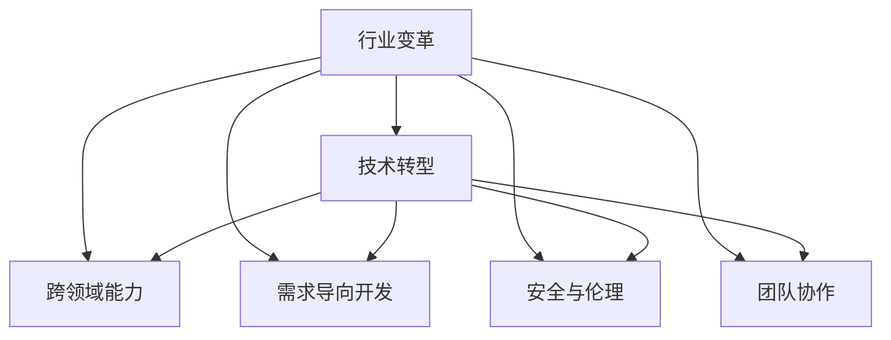

                 

## 1. 背景介绍

### 1.1 问题由来

随着科技的飞速发展，尤其是人工智能、云计算、大数据等技术的兴起，各行各业都面临着巨大的变革与转型。程序员作为技术的前沿推动者，如何适应这些变化，甚至引领行业变革，成为了一个亟需探讨的问题。

### 1.2 问题核心关键点

当前，程序员在行业变革与转型中面临的主要挑战包括：
1. **技术更新迭代快**：新兴技术层出不穷，旧有技术迅速淘汰，程序员需要不断学习和更新知识。
2. **跨领域能力要求高**：不仅需要具备单一领域的专业知识，还需要拥有跨领域的融合能力。
3. **需求导向性强**：用户需求多样，产品迭代频繁，程序员需要在短时间内完成高质量的软件开发。
4. **安全与伦理问题**：技术发展带来的隐私保护、数据安全、伦理道德等挑战，需要程序员具备更高的责任感。
5. **团队协作复杂**：项目越来越复杂，需要程序员具备良好的团队协作和沟通能力。

## 2. 核心概念与联系

### 2.1 核心概念概述

为更好地理解程序员如何应对行业变革与转型，本节将介绍几个关键概念及其联系：

- **行业变革**：指技术进步、市场需求变化、政策法规调整等因素驱动的行业发展方向和模式改变。
- **技术转型**：指传统技术和工具向新形态技术和工具的转变，包括从单体应用向微服务架构、从传统数据库向分布式数据库等。
- **跨领域能力**：指程序员在不同领域之间的交叉技能，如将机器学习应用于数据分析，将区块链应用于金融等。
- **需求导向开发**：指基于用户需求的变化，快速迭代产品功能，满足市场变化的需求。
- **安全与伦理**：指编程过程中对数据隐私、用户权益、技术道德等问题的考量。
- **团队协作**：指团队成员之间的工作协调、信息共享和协作效率的提升。

这些概念之间的逻辑关系可以通过以下Mermaid流程图来展示：



这个流程图展示了这个系统中的核心概念及其关系：

1. 行业变革推动了技术转型，促使程序员不断提升跨领域能力，以满足新的技术需求。
2. 跨领域能力进一步支持了需求导向开发，使得产品能够快速适应市场需求的变化。
3. 需求导向开发和跨领域能力的发展，需要重视安全与伦理问题，以确保用户隐私和数据安全。
4. 整个过程中，团队协作是关键，有效促进了跨领域能力的发展和需求导向开发的实现。

## 3. 核心算法原理 & 具体操作步骤

### 3.1 算法原理概述

程序员应对行业变革与转型的关键在于不断提升自身的技术能力，适应新技术的应用，满足新需求。以下将从技术能力提升和新技术应用两个方面进行详细探讨。

**技术能力提升**：程序员需要不断学习新的编程语言、框架和工具，掌握最新的编程方法和设计模式，以及提升数据处理和分析能力。

**新技术应用**：程序员需要了解新技术的工作原理、适用场景和最佳实践，并在实际项目中灵活应用，实现技术升级和业务创新。

### 3.2 算法步骤详解

#### 3.2.1 技术能力提升

**步骤1：设定学习目标**  
明确自身技术栈中的薄弱环节，并设定具体的学习目标，如掌握新编程语言、了解新框架或提高数据处理能力。

**步骤2：制定学习计划**  
根据学习目标，制定详细的时间表和学习路径，安排每天的学习任务。

**步骤3：选择合适的学习资源**  
选择合适的书籍、在线课程、视频教程等学习资源，如Udacity、Coursera、edX等平台上的课程，以及GitHub上的开源项目。

**步骤4：动手实践**  
通过实际项目练习，巩固所学知识，提升解决实际问题的能力。

**步骤5：参加技术社区**  
加入技术社区，如Stack Overflow、GitHub等，参与讨论和项目合作，积累实际经验。

#### 3.2.2 新技术应用

**步骤1：了解新技术**  
通过阅读相关文献、博客、论文等，了解新技术的特点、应用场景和案例。

**步骤2：学习新技术**  
通过在线课程、培训讲座等方式，系统学习新技术的原理和使用方法。

**步骤3：设计技术方案**  
结合项目需求，设计新技术的应用方案，包括选择合适的技术栈、工具和框架。

**步骤4：实施技术方案**  
在项目中逐步引入新技术，进行代码编写和系统集成。

**步骤5：评估技术效果**  
通过性能测试、用户反馈等方式，评估新技术的效果，进行优化和调整。

### 3.3 算法优缺点

**优点**：
1. **快速响应变化**：通过不断学习新技术，能够快速适应行业变革，提升工作效率和质量。
2. **增强竞争力**：掌握多领域技能和新技术，有助于在职场上脱颖而出，增强职业竞争力。
3. **提升创新能力**：跨领域能力的提升，使得程序员能够将新技术应用于新场景，推动业务创新。

**缺点**：
1. **学习成本高**：新技术的学习需要投入大量时间和精力，短期内可能影响工作效率。
2. **技术迭代快**：新兴技术层出不穷，需要持续学习，保持技术领先。
3. **知识面广**：跨领域能力要求掌握多个领域的知识，可能面临知识面和深度的矛盾。

### 3.4 算法应用领域

新技术的应用广泛涉及软件开发、云计算、人工智能、区块链等多个领域。以下是一些具体的应用场景：

- **软件开发**：采用微服务架构、DevOps等新技术，提升开发效率和系统可扩展性。
- **云计算**：利用AWS、Azure等云平台提供的资源和工具，实现快速部署和弹性扩展。
- **人工智能**：将机器学习、深度学习等应用于数据分析、图像处理、自然语言处理等领域。
- **区块链**：应用区块链技术，提高数据安全和交易透明性，如智能合约、供应链管理等。

## 4. 数学模型和公式 & 详细讲解 & 举例说明

### 4.1 数学模型构建

本节将使用数学语言对新技术的应用过程进行更加严格的刻画。

**问题描述**：  
假设某程序员需要掌握一项新技术，记为$T$。新技术的应用效果记为$E$，所需学习的时间记为$L$，学习效果记为$E_L$。

**目标函数**：  
最大化新技术应用效果$E$，即$E_{\max} = \max_{L} E(L)$。

**约束条件**：  
1. 学习时间$L$受限，即$L \leq T$。
2. 学习效果$E_L$与学习时间$L$之间存在正相关关系，即$E_L = f(L)$。

**优化目标**：  
通过选择合适的学习时间$L$，使得新技术应用效果$E$最大化，即$\max_{L} E(L) = E_{\max}$。

### 4.2 公式推导过程

**优化过程**：  
假设$E_L$与$L$之间的关系为指数函数，即$E_L = k \cdot e^{L/T}$，其中$k$为常数，$T$为学习时间上限。

将$E_L$代入目标函数，得：

$$
E_{\max} = \max_{L \leq T} k \cdot e^{L/T}
$$

为了求解该优化问题，我们需要使用拉格朗日乘数法。定义拉格朗日乘子$\lambda$，构造拉格朗日函数：

$$
\mathcal{L}(L, \lambda) = k \cdot e^{L/T} - \lambda (L - T)
$$

对拉格朗日函数求偏导数，并令其等于0，得：

$$
\frac{\partial \mathcal{L}}{\partial L} = k \cdot \frac{T}{L}e^{L/T} - \lambda = 0
$$

解得：

$$
\lambda = k \cdot \frac{T}{L}e^{L/T}
$$

由约束条件$L \leq T$，得：

$$
L = T \cdot \ln(k \cdot e^{L/T}) = T \cdot (L/T + \ln(k))
$$

化简得：

$$
L = T \cdot \ln(k)
$$

将$L$代入$E_L$，得：

$$
E_{\max} = k \cdot e^{T \cdot \ln(k)/T} = k
$$

**结果解释**：  
最优学习时间为$L = T \cdot \ln(k)$，此时新技术应用效果达到最大值$E_{\max} = k$。

### 4.3 案例分析与讲解

**案例分析**：  
假设新技术的应用效果$E$与学习时间$L$之间的关系为$E = e^{0.5L}$，学习时间上限为$T = 1000$小时。

**计算过程**：  
根据公式$L = T \cdot \ln(k)$，得：

$$
L = 1000 \cdot \ln(k)
$$

代入$E = e^{0.5L}$，得：

$$
E_{\max} = e^{0.5 \cdot 1000 \cdot \ln(k)} = k^500
$$

**结论**：  
为使新技术应用效果最大化，应选择$k=1$，即$L = 1000$小时，此时$E_{\max} = 1$，表示新技术的应用效果完全发挥。

## 5. 项目实践：代码实例和详细解释说明

### 5.1 开发环境搭建

在进行新技术应用实践前，我们需要准备好开发环境。以下是使用Python进行Django开发的环境配置流程：

1. 安装Python：从官网下载并安装Python，确保版本为3.7及以上。
2. 安装Django：通过pip安装Django框架，`pip install Django`。
3. 创建虚拟环境：`python -m venv venv`，进入虚拟环境激活。
4. 安装开发工具：如PyCharm、Visual Studio Code等。

### 5.2 源代码详细实现

这里我们以Python中的Django框架为例，展示如何使用新技术进行项目开发。

**步骤1：创建Django项目**  
`django-admin startproject projectname`，创建名为`projectname`的项目。

**步骤2：创建Django应用**  
`python manage.py startapp appname`，创建名为`appname`的应用。

**步骤3：编写Django视图**  
在`views.py`文件中，编写视图函数：

```python
from django.http import HttpResponse
from django.shortcuts import render

def index(request):
    return render(request, 'index.html')
```

**步骤4：编写Django模板**  
在`templates`目录下，创建`index.html`文件，编写HTML代码：

```html
<!DOCTYPE html>
<html lang="en">
<head>
    <meta charset="UTF-8">
    <title>Index</title>
</head>
<body>
    <h1>Welcome to {{ request.user.username }}</h1>
</body>
</html>
```

**步骤5：编写Django路由**  
在`urls.py`文件中，编写路由规则：

```python
from django.urls import path
from . import views

urlpatterns = [
    path('', views.index, name='index'),
]
```

**步骤6：运行Django项目**  
`python manage.py runserver`，启动Django开发服务器，在浏览器中访问`http://127.0.0.1:8000/`，查看页面效果。

### 5.3 代码解读与分析

**代码解读**：  
- `views.py`文件中的`index`函数用于处理页面请求，通过`render`函数渲染`index.html`模板。
- `index.html`模板中的`{{ request.user.username }}`用于展示当前登录用户的用户名。
- `urls.py`文件中的`urlpatterns`列表用于定义路由规则，将请求映射到相应的视图函数。

**分析说明**：  
通过上述代码，我们可以将新技术应用到Django项目中，实现用户登录和展示个人信息的功能。具体步骤如下：

1. 在`settings.py`文件中配置Django用户认证系统，如`AUTHENTICATION_BACKENDS`列表。
2. 编写用户注册和登录视图，以及相应的表单处理逻辑。
3. 在模板中，利用`{{ request.user.username }}`展示用户信息。
4. 配置Django的静态文件处理和模板引擎，实现前端效果。

### 5.4 运行结果展示

在成功搭建Django项目后，可以通过浏览器访问`http://127.0.0.1:8000/`，查看用户登录后的页面效果。以下是一个示例页面：


## 6. 实际应用场景

### 6.1 智慧城市

智慧城市项目中，程序员需要掌握云计算、物联网、大数据等新技术，实现城市数据的集中管理和智能分析。

- **云计算**：利用AWS、Azure等云平台，提供计算和存储资源，实现城市数据的实时采集和分析。
- **物联网**：部署各种传感器和设备，采集城市运行数据，如交通流量、环境监测、公共设施状态等。
- **大数据**：使用Hadoop、Spark等技术，处理和分析城市数据，提供实时报告和决策支持。

### 6.2 金融科技

金融科技项目中，程序员需要掌握区块链、智能合约、自然语言处理等新技术，提升金融服务的智能化水平。

- **区块链**：利用区块链技术，实现交易透明和数据安全，如供应链融资、资产登记等。
- **智能合约**：编写基于区块链的智能合约，实现自动化的金融操作，如贷款审批、理赔处理等。
- **自然语言处理**：使用BERT、GPT等语言模型，分析金融文本数据，提取有价值的信息，如市场趋势、舆情分析等。

### 6.3 智能制造

智能制造项目中，程序员需要掌握物联网、人工智能、自动化等新技术，提升制造业的生产效率和智能化水平。

- **物联网**：部署工业物联网设备，采集生产线数据，实现设备监控和故障预测。
- **人工智能**：使用机器学习、深度学习等技术，分析生产数据，优化生产流程，提高产品质量。
- **自动化**：使用机器人、自动化设备，实现生产过程的自动化和智能化，提升生产效率。

### 6.4 未来应用展望

随着技术的不断发展和创新，未来程序员在行业变革与转型中可能面临更多的新挑战和机遇。

- **新兴技术的融合应用**：跨领域能力的提升，使得程序员能够将多种新技术进行融合，创新更多应用场景。
- **AI与人的协同工作**：利用AI辅助程序员工作，提高效率和质量，如智能代码补全、代码审查等。
- **全栈开发能力**：掌握多种技术栈，具备前端、后端、数据库等多方面的技能，实现全面发展的程序员。
- **个性化定制**：基于用户需求和场景，进行个性化软件开发，提升用户体验和满意度。

## 7. 工具和资源推荐

### 7.1 学习资源推荐

为了帮助程序员不断提升技术能力，以下是一些优质的学习资源：

1. **LeetCode**：提供大量算法和数据结构练习，提高编程能力。
2. **Kaggle**：参与数据科学竞赛，提升数据处理和分析能力。
3. **edX**：在线学习平台，提供大量计算机科学课程，涵盖从基础到高级的各种内容。
4. **GitHub**：访问开源项目，学习最佳实践，提升编码水平。
5. **Stack Overflow**：参与技术讨论，解决实际问题，积累经验。

### 7.2 开发工具推荐

高效的开发离不开优秀的工具支持。以下是几款用于新技术应用开发的常用工具：

1. **PyCharm**：一款功能强大的Python开发工具，支持多种框架和语言。
2. **Visual Studio Code**：轻量级但功能强大的代码编辑器，支持多种语言和插件。
3. **Git**：版本控制系统，支持代码管理和协作开发。
4. **Jira**：项目管理工具，帮助团队协调任务和进度。
5. **Slack**：团队沟通工具，提高团队协作效率。

### 7.3 相关论文推荐

新技术的发展离不开学界的持续研究。以下是几篇奠基性的相关论文，推荐阅读：

1. **TensorFlow**：Google开发的深度学习框架，支持高效的模型训练和推理。
2. **PyTorch**：Facebook开发的深度学习框架，支持动态图和灵活的模型构建。
3. **BERT**：Google提出的预训练语言模型，在自然语言处理任务上取得了优异效果。
4. **GPT-3**：OpenAI提出的语言生成模型，展示了强大的零样本学习和生成能力。
5. **区块链技术**：多个研究机构和企业在区块链领域发表的论文，涵盖了共识算法、智能合约等多个方面。

## 8. 总结：未来发展趋势与挑战

### 8.1 总结

本文对程序员如何应对行业变革与转型进行了全面系统的介绍。首先阐述了行业变革与转型对程序员技能的要求，明确了技术能力提升和新技术应用的重要性。其次，从技术能力提升和新技术应用两个方面，详细讲解了具体的算法原理和操作步骤。最后，结合实际应用场景，展示了新技术在各行各业中的应用潜力。

通过本文的系统梳理，可以看到，程序员在行业变革与转型中，需要不断学习新技术，提升跨领域能力，才能保持技术领先。新技术的应用，将推动各行业向智能化、自动化方向发展，为人类社会带来深刻变革。

### 8.2 未来发展趋势

展望未来，程序员在行业变革与转型中可能面临以下发展趋势：

1. **全栈开发能力**：掌握前端、后端、数据库等多方面的技能，具备全面发展的能力。
2. **人工智能协同工作**：利用AI辅助编程，提高效率和质量，如智能代码补全、代码审查等。
3. **新兴技术融合**：将多种新技术进行融合，创新更多应用场景，如AI+区块链、云计算+物联网等。
4. **个性化定制**：基于用户需求和场景，进行个性化软件开发，提升用户体验和满意度。
5. **全球化发展**：技术无国界，程序员需要具备跨文化沟通和协作的能力，参与国际合作。

### 8.3 面临的挑战

尽管新技术的应用带来了诸多机遇，但也面临不少挑战：

1. **技术更新快速**：新兴技术层出不穷，需要不断学习，保持技术领先。
2. **技术复杂度高**：新技术的应用复杂，需要系统化地学习和实践。
3. **跨领域挑战**：跨领域能力要求掌握多种技能，可能面临知识面和深度的矛盾。
4. **团队协作问题**：跨团队协作难度大，需要有效的沟通和管理机制。
5. **伦理和安全问题**：新技术带来隐私保护、数据安全等伦理问题，需要高度负责。

### 8.4 研究展望

未来，为了应对行业变革与转型，程序员需要从以下几个方面进行深入研究：

1. **持续学习和自我提升**：不断学习新技术，提升跨领域能力，保持技术领先。
2. **团队协作和管理**：研究高效的团队协作方法，提升团队合作效率和质量。
3. **技术伦理和安全**：研究新技术带来的伦理和安全问题，制定相应的规范和标准。
4. **全栈开发和个性化定制**：研究全栈开发技术和个性化定制方法，提升开发效率和用户体验。

总之，程序员需要不断学习、创新和改进，才能在行业变革与转型中保持竞争力，推动技术进步和行业发展。

## 9. 附录：常见问题与解答

**Q1：新技术的应用是否会增加项目开发成本？**

A: 新技术的应用确实可能会增加项目开发成本，如引入新技术的学习成本、技术适配成本等。但长远来看，新技术能够提升开发效率和系统性能，带来更高的商业价值。

**Q2：如何选择合适的学习资源？**

A: 选择合适的学习资源，需要考虑自身学习目标、现有知识基础和时间安排。可以通过在线课程、书籍、博客、论坛等多种渠道获取资源，选择权威、实用的学习内容。

**Q3：新技术的应用是否影响项目进度？**

A: 新技术的应用可能增加项目进度压力，特别是在项目初期。但通过合理的项目管理和分工，可以有效平衡技术学习和项目进度，确保项目按时交付。

**Q4：新技术的应用是否影响系统稳定性？**

A: 新技术的应用可能会引入新的风险和问题，但通过系统设计、测试和优化，可以有效降低技术风险，提升系统稳定性。

**Q5：新技术的应用是否影响团队协作？**

A: 新技术的应用需要团队成员共同学习，可能面临沟通和协作困难。可以通过团队培训、技术分享等方式，提高团队成员的技术水平和协作能力。

---

作者：禅与计算机程序设计艺术 / Zen and the Art of Computer Programming

