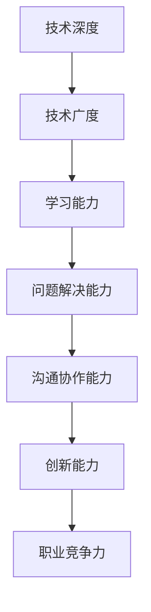
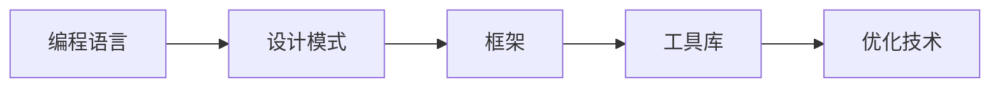
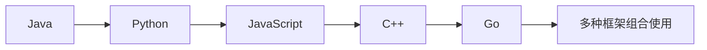
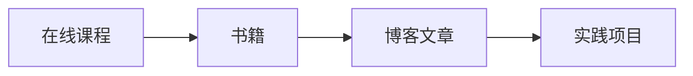
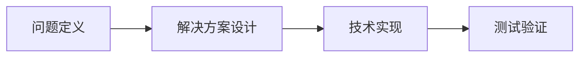
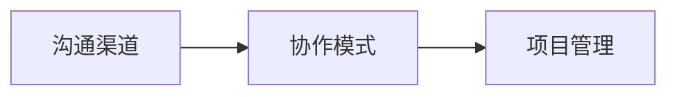
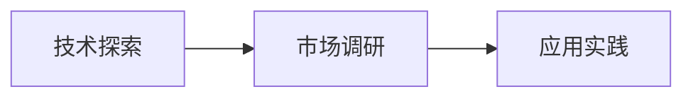

                 

# 程序员如何建立长期的职业竞争力

在快速变化的IT行业中，构建长期的职业竞争力对于每位程序员来说都至关重要。如何在激烈的技术竞争和快速变化的市场中保持不败之地，是每个程序员需要深思的问题。本文将从背景介绍、核心概念与联系、核心算法原理与操作步骤、数学模型和公式、项目实践、实际应用场景、工具和资源推荐、总结与展望等方面，系统性地阐述程序员建立长期职业竞争力的策略和技巧。

## 1. 背景介绍

### 1.1 问题由来

在信息技术迅猛发展的今天，IT行业正经历着前所未有的变革。云计算、大数据、人工智能、物联网等新技术层出不穷，推动着行业不断向更高层次发展。程序员作为IT行业的主力军，面临着前所未有的机遇与挑战。新技术的涌现、新需求的产生、新工具的出现，都要求程序员不断学习、不断进步，以保持其竞争力。然而，技术变化之快、知识更新之迅速，也使得许多程序员在追求短期利益的过程中，忽视了长期职业发展的规划和能力提升。因此，构建长期职业竞争力，成为每位程序员必须面对的课题。

### 1.2 问题核心关键点

建立长期职业竞争力的核心在于掌握核心技术、培养综合能力、持续学习与创新、积累行业经验、建立个人品牌等方面。具体来说，主要包括：

- 技术深度：掌握一种或多种编程语言及其核心库的使用，理解其设计原理和实现机制。
- 技术广度：了解多种技术栈和开发工具，具备跨领域技术整合能力。
- 学习能力：具备快速学习新技术和工具的能力，适应技术变化。
- 问题解决：具备系统思维和问题解决能力，能够高效处理复杂问题。
- 沟通协作：具备良好的沟通能力和团队协作精神，能够跨团队、跨部门合作。
- 创新能力：具备创新意识和创新能力，推动技术和业务的发展。

这些关键点共同构成了程序员长期职业竞争力的核心内容。

## 2. 核心概念与联系

### 2.1 核心概念概述

构建长期职业竞争力，涉及到多个核心概念，包括但不限于：

- **技术深度**：指对一种或多种编程语言和框架的深入理解，能够自如地进行技术实现和优化。
- **技术广度**：指掌握多种技术栈和开发工具的能力，能够根据项目需求选择合适技术。
- **学习能力**：指快速学习和掌握新知识的能力，适应技术快速变化的市场需求。
- **问题解决能力**：指系统思维和问题解决能力，能够在复杂环境中高效完成任务。
- **沟通协作能力**：指跨团队、跨部门的沟通能力和团队协作精神。
- **创新能力**：指创新意识和创新能力，推动技术和业务的发展。

这些概念通过以下Mermaid流程图展示其相互联系：



### 2.2 核心概念原理和架构

1. **技术深度**：
   技术深度是程序员职业竞争力的基础。通过对特定技术的深入学习和实践，形成自己的技术体系和专业领域，从而在特定场景下能够游刃有余，甚至成为专家。
   - 原理：技术深度通过深入学习语言的特性、设计模式、框架原理、优化方法等，构建起对技术的深刻理解和应用能力。
   - 架构：技术深度涉及到编程语言、框架、工具等各个层面的知识，如图像展示了技术深度架构的关键部分：



2. **技术广度**：
   技术广度指程序员掌握多种技术栈和开发工具的能力，能够根据项目需求选择最合适的技术。
   - 原理：技术广度通过在不同领域和场景下的技术应用，形成对多技术栈的灵活应用能力。
   - 架构：技术广度涉及到多种语言和框架的结合使用，如图像展示了技术广度的关键部分：



3. **学习能力**：
   学习能力是指程序员快速学习和掌握新知识的能力，适应技术快速变化的市场需求。
   - 原理：学习能力通过持续学习和实践，形成对新知识的快速吸收和应用能力。
   - 架构：学习能力涉及到学习环境、学习路径、学习方法和知识应用等关键要素：



4. **问题解决能力**：
   问题解决能力指程序员具备系统思维和问题解决能力，能够在复杂环境中高效完成任务。
   - 原理：问题解决能力通过系统设计、算法优化、异常处理等技巧，形成高效解决问题的能力。
   - 架构：问题解决能力涉及到问题定义、解决方案设计、技术实现、测试验证等环节：



5. **沟通协作能力**：
   沟通协作能力指程序员具备良好的沟通能力和团队协作精神，能够跨团队、跨部门合作。
   - 原理：沟通协作能力通过有效沟通、团队协作、项目管理等技巧，形成高效协同的能力。
   - 架构：沟通协作能力涉及到沟通渠道、协作模式、项目管理等关键要素：



6. **创新能力**：
   创新能力指程序员具备创新意识和创新能力，推动技术和业务的发展。
   - 原理：创新能力通过探索新技术、新方法、新应用场景等，形成技术创新和业务突破的能力。
   - 架构：创新能力涉及到技术探索、市场调研、应用实践等关键环节：



## 3. 核心算法原理 & 具体操作步骤

### 3.1 算法原理概述

构建长期职业竞争力，涉及到多个核心算法和操作步骤，包括但不限于：

- **技术学习算法**：包括在线学习、书籍学习、实践学习、跨领域学习等，提升技术深度和广度。
- **问题解决算法**：包括系统设计、算法优化、异常处理等，提升问题解决能力。
- **沟通协作算法**：包括有效沟通、团队协作、项目管理等，提升沟通协作能力。
- **创新算法**：包括技术探索、市场调研、应用实践等，提升创新能力。

### 3.2 算法步骤详解

#### 3.2.1 技术学习算法

**Step 1: 选择合适的学习资源**
- 确定学习目标和方向，如提升技术深度、拓展技术广度等。
- 选择合适的学习资源，如图书、在线课程、博客、开源项目等。

**Step 2: 制定学习计划**
- 制定详细的学习计划，包括每天/每周的学习任务、学习时间、学习方法等。
- 确保学习计划科学合理，能够覆盖所有学习目标。

**Step 3: 执行学习任务**
- 按照学习计划，持续进行技术学习。
- 注重理论与实践相结合，通过项目实践巩固学习成果。

**Step 4: 评估学习效果**
- 定期评估学习效果，检测知识掌握情况。
- 及时调整学习计划，优化学习方法和资源。

#### 3.2.2 问题解决算法

**Step 1: 问题定义**
- 明确问题的背景和目标，形成问题定义。
- 分解问题，找出核心问题点和影响因素。

**Step 2: 解决方案设计**
- 根据问题定义，设计多种解决方案。
- 评估解决方案的优缺点，选择最优方案。

**Step 3: 技术实现**
- 根据解决方案，选择合适的技术实现方案。
- 编写代码、测试验证，确保解决方案的正确性和高效性。

**Step 4: 问题验证**
- 将解决方案应用到实际问题中，进行测试验证。
- 收集反馈，优化解决方案。

#### 3.2.3 沟通协作算法

**Step 1: 沟通渠道选择**
- 根据团队和项目需求，选择合适的沟通渠道，如邮件、即时通讯工具、会议等。
- 建立良好的沟通机制，确保信息传递的及时性和准确性。

**Step 2: 团队协作管理**
- 明确团队成员的职责和任务，制定协作计划。
- 使用协作工具（如Jira、Trello等）进行任务管理和进度跟踪。

**Step 3: 项目管理**
- 制定项目计划，包括时间、资源、预算等。
- 定期进行项目评估，及时调整计划，确保项目顺利进行。

#### 3.2.4 创新算法

**Step 1: 技术探索**
- 关注技术发展动态，了解最新技术趋势。
- 参加技术会议、阅读技术论文、参与开源项目等，拓宽技术视野。

**Step 2: 市场调研**
- 分析市场需求，了解用户需求和痛点。
- 收集竞争对手信息，了解市场趋势和竞争情况。

**Step 3: 应用实践**
- 将探索到的技术和市场需求结合起来，进行应用实践。
- 验证技术应用效果，形成新的技术和产品。

### 3.3 算法优缺点

#### 3.3.1 技术学习算法的优缺点

- **优点**：
  - 通过持续学习，能够不断提升技术深度和广度，保持竞争力。
  - 学习资源丰富，覆盖面广，能够快速掌握多种技术和工具。

- **缺点**：
  - 需要耗费大量时间和精力，容易产生倦怠感。
  - 学习方法单一，可能无法全面提升多方面能力。

#### 3.3.2 问题解决算法的优缺点

- **优点**：
  - 通过系统思维和问题解决能力，能够高效应对复杂问题。
  - 实践经验丰富，有助于形成技术积累和应用能力。

- **缺点**：
  - 问题定义和解决方案设计需要较高的专业水平。
  - 复杂问题解决需要跨领域知识，可能存在知识盲点。

#### 3.3.3 沟通协作算法的优缺点

- **优点**：
  - 提升团队协作效率，确保项目顺利进行。
  - 增强问题解决能力和创新能力，形成更全面的人才能力。

- **缺点**：
  - 沟通和协作需要较高的协调能力和管理技巧。
  - 团队成员背景不同，可能导致沟通困难和协作问题。

#### 3.3.4 创新算法的优缺点

- **优点**：
  - 推动技术和业务的发展，形成创新能力。
  - 拓宽技术视野和市场空间，提升竞争力。

- **缺点**：
  - 技术探索和市场调研需要大量资源和时间投入。
  - 创新过程充满不确定性，可能面临失败风险。

## 4. 数学模型和公式 & 详细讲解 & 举例说明

### 4.1 数学模型构建

构建长期职业竞争力，涉及到多个数学模型和公式，包括但不限于：

- **学习模型**：包括在线学习率、梯度下降等，用于优化学习效果。
- **问题解决模型**：包括系统设计评估、算法优化等，用于优化解决方案。
- **沟通协作模型**：包括团队协作度量、项目进度管理等，用于优化协作效率。
- **创新模型**：包括市场调研模型、技术应用效果评估等，用于优化创新过程。

### 4.2 公式推导过程

#### 4.2.1 学习模型

设学习任务为$f(x)$，其中$x$为学习变量，$a$为学习率，$n$为迭代次数。在线学习模型的公式为：

$$
x_{n+1} = x_n - \frac{a f(x_n)}{\partial f(x_n)}
$$

其中$\partial f(x_n)$表示$f(x)$在$x_n$处的梯度，即$f(x)$的变化率。通过迭代更新$x$的值，逐步逼近最优解。

#### 4.2.2 问题解决模型

设问题解决目标为$g(x)$，其中$x$为解决方案变量。问题解决模型的公式为：

$$
x_{n+1} = \arg\min_x g(x)
$$

通过求解$g(x)$的最小值，得到最优的解决方案$x$。常见的优化算法包括梯度下降、牛顿法、遗传算法等。

#### 4.2.3 沟通协作模型

设团队协作效率为$e$，其中$x$为沟通协作变量。沟通协作模型的公式为：

$$
e = \frac{1}{n}\sum_{i=1}^n r_i
$$

其中$r_i$表示第$i$次沟通协作的效率，$n$表示总次数。通过统计和评估沟通协作的效率，形成协作度量模型。

#### 4.2.4 创新模型

设创新效果为$i$，其中$x$为创新变量。创新模型的公式为：

$$
i = f(x) + g(x)
$$

其中$f(x)$表示技术探索带来的效果，$g(x)$表示市场调研带来的效果。通过评估创新效果的综合价值，形成创新效果评估模型。

### 4.3 案例分析与讲解

#### 4.3.1 技术学习案例

某程序员小王希望提升技术深度，选择了Python语言作为学习目标。小王制定了详细的学习计划，包括每天阅读Python官方文档、完成在线课程、编写Python小项目等。在半年内，小王掌握了Python的核心库和框架，并成功完成了几个小项目。

#### 4.3.2 问题解决案例

某团队需要开发一个复杂的后台系统，但项目经理发现团队成员难以协同工作。项目经理引入了Jira工具，制定了详细的项目管理计划，通过每周会议和每日任务跟踪，确保项目顺利进行。同时，团队成员在解决问题时，采用了系统思维和算法优化技巧，提高了项目质量和效率。

#### 4.3.3 沟通协作案例

某IT公司需要引入一个新的技术栈，公司组建了一个多学科团队进行开发。团队成员来自不同部门，背景各异。项目经理引入了沟通协作工具（如Slack），建立了跨部门的沟通机制，确保信息传递的及时性和准确性。同时，团队成员通过定期技术分享和协作实践，增强了跨部门协作能力。

#### 4.3.4 创新案例

某公司希望拓展新的市场领域，市场调研部门通过分析市场需求和竞争对手，发现了一个新的应用场景。技术部门结合调研结果，进行了技术探索和创新实践，最终成功开发了一个新应用，为用户提供了更好的服务体验。

## 5. 项目实践：代码实例和详细解释说明

### 5.1 开发环境搭建

在进行项目实践前，我们需要准备好开发环境。以下是使用Python进行PyTorch开发的环境配置流程：

1. 安装Anaconda：从官网下载并安装Anaconda，用于创建独立的Python环境。

2. 创建并激活虚拟环境：
```bash
conda create -n pytorch-env python=3.8 
conda activate pytorch-env
```

3. 安装PyTorch：根据CUDA版本，从官网获取对应的安装命令。例如：
```bash
conda install pytorch torchvision torchaudio cudatoolkit=11.1 -c pytorch -c conda-forge
```

4. 安装各类工具包：
```bash
pip install numpy pandas scikit-learn matplotlib tqdm jupyter notebook ipython
```

完成上述步骤后，即可在`pytorch-env`环境中开始项目实践。

### 5.2 源代码详细实现

下面我们以构建一个简单的Web应用为例，给出使用Flask框架进行Web开发的PyTorch代码实现。

首先，安装Flask和PyTorch：

```bash
pip install flask torch
```

然后，定义Flask应用：

```python
from flask import Flask, request, jsonify
import torch
import torch.nn as nn
import torch.optim as optim

app = Flask(__name__)

# 定义模型
class Model(nn.Module):
    def __init__(self):
        super(Model, self).__init__()
        self.fc1 = nn.Linear(100, 50)
        self.fc2 = nn.Linear(50, 10)

    def forward(self, x):
        x = torch.relu(self.fc1(x))
        x = self.fc2(x)
        return x

# 加载模型
model = Model()
model.load_state_dict(torch.load('model.pth'))
model.eval()

# 定义预测函数
@app.route('/predict', methods=['POST'])
def predict():
    data = request.get_json()
    inputs = torch.tensor(data['inputs']).float()
    outputs = model(inputs)
    prediction = outputs.argmax(dim=1)
    return jsonify(prediction.tolist())

if __name__ == '__main__':
    app.run()
```

然后，训练模型并保存：

```python
import torch
import torch.nn as nn
import torch.optim as optim
from torch.utils.data import DataLoader
from torchvision.datasets import CIFAR10
from torchvision.transforms import ToTensor

# 定义模型
class Model(nn.Module):
    def __init__(self):
        super(Model, self).__init__()
        self.fc1 = nn.Linear(100, 50)
        self.fc2 = nn.Linear(50, 10)

    def forward(self, x):
        x = torch.relu(self.fc1(x))
        x = self.fc2(x)
        return x

# 加载数据
train_dataset = CIFAR10(root='data', train=True, download=True, transform=ToTensor())
test_dataset = CIFAR10(root='data', train=False, download=True, transform=ToTensor())
train_loader = DataLoader(train_dataset, batch_size=64, shuffle=True)
test_loader = DataLoader(test_dataset, batch_size=64, shuffle=False)

# 定义模型和优化器
model = Model()
optimizer = optim.SGD(model.parameters(), lr=0.01)
criterion = nn.CrossEntropyLoss()

# 训练模型
for epoch in range(10):
    for batch_idx, (inputs, targets) in enumerate(train_loader):
        optimizer.zero_grad()
        outputs = model(inputs)
        loss = criterion(outputs, targets)
        loss.backward()
        optimizer.step()

    test_loss = 0
    correct = 0
    with torch.no_grad():
        for inputs, targets in test_loader:
            outputs = model(inputs)
            test_loss += criterion(outputs, targets).item()
            correct += (outputs.argmax(dim=1) == targets).sum().item()

    test_loss /= len(test_loader)
    print(f'Epoch {epoch+1}, Loss: {test_loss:.3f}, Accuracy: {correct/len(test_loader)*100:.3f}%')

# 保存模型
torch.save(model.state_dict(), 'model.pth')
```

### 5.3 代码解读与分析

让我们再详细解读一下关键代码的实现细节：

**Flask应用**：
- `from flask import Flask, request, jsonify`：导入Flask框架及相关模块。
- `app = Flask(__name__)`：创建Flask应用实例。
- `@app.route('/predict', methods=['POST'])`：定义预测路由，接收POST请求。
- `def predict()`: 处理请求，使用模型进行预测。

**模型定义**：
- `class Model(nn.Module)`: 定义模型类，继承自`nn.Module`。
- `self.fc1 = nn.Linear(100, 50)`和`self.fc2 = nn.Linear(50, 10)`: 定义全连接层。
- `def forward(x)`: 定义前向传播过程。

**训练模型**：
- `train_loader = DataLoader(train_dataset, batch_size=64, shuffle=True)`: 定义训练数据加载器。
- `for epoch in range(10)`: 定义训练循环，共10个epoch。
- `optimizer.zero_grad()`: 清零优化器梯度。
- `loss = criterion(outputs, targets)`: 计算损失函数。
- `loss.backward()`: 反向传播计算梯度。
- `optimizer.step()`: 更新模型参数。

通过这个简单的代码示例，可以看到使用Flask框架进行Web开发和训练模型的方法，掌握了Flask框架和PyTorch的基本用法，从而为后续复杂项目开发打下坚实基础。

## 6. 实际应用场景

### 6.1 智能客服系统

基于大语言模型微调的对话技术，可以广泛应用于智能客服系统的构建。传统客服往往需要配备大量人力，高峰期响应缓慢，且一致性和专业性难以保证。使用微调后的对话模型，可以7x24小时不间断服务，快速响应客户咨询，用自然流畅的语言解答各类常见问题。

在技术实现上，可以收集企业内部的历史客服对话记录，将问题和最佳答复构建成监督数据，在此基础上对预训练对话模型进行微调。微调后的对话模型能够自动理解用户意图，匹配最合适的答案模板进行回复。对于客户提出的新问题，还可以接入检索系统实时搜索相关内容，动态组织生成回答。如此构建的智能客服系统，能大幅提升客户咨询体验和问题解决效率。

### 6.2 金融舆情监测

金融机构需要实时监测市场舆论动向，以便及时应对负面信息传播，规避金融风险。传统的人工监测方式成本高、效率低，难以应对网络时代海量信息爆发的挑战。基于大语言模型微调的文本分类和情感分析技术，为金融舆情监测提供了新的解决方案。

具体而言，可以收集金融领域相关的新闻、报道、评论等文本数据，并对其进行主题标注和情感标注。在此基础上对预训练语言模型进行微调，使其能够自动判断文本属于何种主题，情感倾向是正面、中性还是负面。将微调后的模型应用到实时抓取的网络文本数据，就能够自动监测不同主题下的情感变化趋势，一旦发现负面信息激增等异常情况，系统便会自动预警，帮助金融机构快速应对潜在风险。

### 6.3 个性化推荐系统

当前的推荐系统往往只依赖用户的历史行为数据进行物品推荐，无法深入理解用户的真实兴趣偏好。基于大语言模型微调技术，个性化推荐系统可以更好地挖掘用户行为背后的语义信息，从而提供更精准、多样的推荐内容。

在实践中，可以收集用户浏览、点击、评论、分享等行为数据，提取和用户交互的物品标题、描述、标签等文本内容。将文本内容作为模型输入，用户的后续行为（如是否点击、购买等）作为监督信号，在此基础上微调预训练语言模型。微调后的模型能够从文本内容中准确把握用户的兴趣点。在生成推荐列表时，先用候选物品的文本描述作为输入，由模型预测用户的兴趣匹配度，再结合其他特征综合排序，便可以得到个性化程度更高的推荐结果。

### 6.4 未来应用展望

随着大语言模型微调技术的发展，未来将在更多领域得到应用，为传统行业带来变革性影响。

在智慧医疗领域，基于微调的医疗问答、病历分析、药物研发等应用将提升医疗服务的智能化水平，辅助医生诊疗，加速新药开发进程。

在智能教育领域，微调技术可应用于作业批改、学情分析、知识推荐等方面，因材施教，促进教育公平，提高教学质量。

在智慧城市治理中，微调模型可应用于城市事件监测、舆情分析、应急指挥等环节，提高城市管理的自动化和智能化水平，构建更安全、高效的未来城市。

此外，在企业生产、社会治理、文娱传媒等众多领域，基于大模型微调的人工智能应用也将不断涌现，为经济社会发展注入新的动力。相信随着技术的日益成熟，微调方法将成为人工智能落地应用的重要范式，推动人工智能技术在垂直行业的规模化落地。

## 7. 工具和资源推荐

### 7.1 学习资源推荐

为了帮助开发者系统掌握大语言模型微调的理论基础和实践技巧，这里推荐一些优质的学习资源：

1. 《Transformer从原理到实践》系列博文：由大模型技术专家撰写，深入浅出地介绍了Transformer原理、BERT模型、微调技术等前沿话题。

2. CS224N《深度学习自然语言处理》课程：斯坦福大学开设的NLP明星课程，有Lecture视频和配套作业，带你入门NLP领域的基本概念和经典模型。

3. 《Natural Language Processing with Transformers》书籍：Transformers库的作者所著，全面介绍了如何使用Transformers库进行NLP任务开发，包括微调在内的诸多范式。

4. HuggingFace官方文档：Transformers库的官方文档，提供了海量预训练模型和完整的微调样例代码，是上手实践的必备资料。

5. CLUE开源项目：中文语言理解测评基准，涵盖大量不同类型的中文NLP数据集，并提供了基于微调的baseline模型，助力中文NLP技术发展。

通过对这些资源的学习实践，相信你一定能够快速掌握大语言模型微调的精髓，并用于解决实际的NLP问题。

### 7.2 开发工具推荐

高效的开发离不开优秀的工具支持。以下是几款用于大语言模型微调开发的常用工具：

1. PyTorch：基于Python的开源深度学习框架，灵活动态的计算图，适合快速迭代研究。大部分预训练语言模型都有PyTorch版本的实现。

2. TensorFlow：由Google主导开发的开源深度学习框架，生产部署方便，适合大规模工程应用。同样有丰富的预训练语言模型资源。

3. Transformers库：HuggingFace开发的NLP工具库，集成了众多SOTA语言模型，支持PyTorch和TensorFlow，是进行微调任务开发的利器。

4. Weights & Biases：模型训练的实验跟踪工具，可以记录和可视化模型训练过程中的各项指标，方便对比和调优。与主流深度学习框架无缝集成。

5. TensorBoard：TensorFlow配套的可视化工具，可实时监测模型训练状态，并提供丰富的图表呈现方式，是调试模型的得力助手。

6. Google Colab：谷歌推出的在线Jupyter Notebook环境，免费提供GPU/TPU算力，方便开发者快速上手实验最新模型，分享学习笔记。

合理利用这些工具，可以显著提升大语言模型微调任务的开发效率，加快创新迭代的步伐。

### 7.3 相关论文推荐

大语言模型和微调技术的发展源于学界的持续研究。以下是几篇奠基性的相关论文，推荐阅读：

1. Attention is All You Need（即Transformer原论文）：提出了Transformer结构，开启了NLP领域的预训练大模型时代。

2. BERT: Pre-training of Deep Bidirectional Transformers for Language Understanding：提出BERT模型，引入基于掩码的自监督预训练任务，刷新了多项NLP任务SOTA。

3. Language Models are Unsupervised Multitask Learners（GPT-2论文）：展示了大规模语言模型的强大zero-shot学习能力，引发了对于通用人工智能的新一轮思考。

4. Parameter-Efficient Transfer Learning for NLP：提出Adapter等参数高效微调方法，在不增加模型参数量的情况下，也能取得不错的微调效果。

5. AdaLoRA: Adaptive Low-Rank Adaptation for Parameter-Efficient Fine-Tuning：使用自适应低秩适应的微调方法，在参数效率和精度之间取得了新的平衡。

这些论文代表了大语言模型微调技术的发展脉络。通过学习这些前沿成果，可以帮助研究者把握学科前进方向，激发更多的创新灵感。

## 8. 总结：未来发展趋势与挑战

### 8.1 总结

本文对构建长期职业竞争力的技术策略和方法进行了系统阐述。通过深入探讨技术深度、技术广度、学习能力、问题解决能力、沟通协作能力、创新能力等核心概念，以及具体的学习模型、问题解决模型、沟通协作模型和创新模型，揭示了构建长期职业竞争力的关键所在。通过实例分析和代码实践，进一步验证了这些策略和方法的可行性和有效性。

通过本文的系统梳理，可以看到，构建长期职业竞争力需要全面提升多方面能力，并在实践中不断迭代优化。唯有掌握核心技术、培养综合能力、持续学习与创新、积累行业经验、建立个人品牌，才能在激烈的技术竞争和快速变化的市场中保持不败之地。

### 8.2 未来发展趋势

展望未来，大语言模型微调技术将呈现以下几个发展趋势：

1. 技术深度不断提升：随着深度学习模型的不断发展，未来的大模型将具备更强大的理解和生成能力，提升技术深度和应用效果。

2. 技术广度不断拓展：未来的大语言模型将融合更多技术栈和开发工具，形成更全面的技术能力，支持更多应用场景。

3. 学习能力持续增强：未来的大模型将具备更强的快速学习和适应能力，能够更快地掌握新技术和工具。

4. 问题解决能力不断优化：未来的大模型将具备更系统化的设计思维和更高效的解决方案，提升问题解决能力。

5. 沟通协作能力不断提升：未来的大模型将具备更高效、更灵活的沟通协作能力，支持更复杂、更高效的团队合作。

6. 创新能力不断突破：未来的大模型将具备更强的技术探索和市场调研能力，推动更多创新应用的发展。

以上趋势凸显了大语言模型微调技术的广阔前景。这些方向的探索发展，必将进一步提升NLP系统的性能和应用范围，为人类认知智能的进化带来深远影响。

### 8.3 面临的挑战

尽管大语言模型微调技术已经取得了瞩目成就，但在迈向更加智能化、普适化应用的过程中，它仍面临着诸多挑战：

1. 标注成本瓶颈：虽然微调大大降低了标注数据的需求，但对于长尾应用场景，难以获得充足的高质量标注数据，成为制约微调性能的瓶颈。

2. 模型鲁棒性不足：当前微调模型面对域外数据时，泛化性能往往大打折扣。对于测试样本的微小扰动，微调模型的预测也容易发生波动。

3. 推理效率有待提高：大规模语言模型虽然精度高，但在实际部署时往往面临推理速度慢、内存占用大等效率问题。

4. 可解释性亟需加强：当前微调模型更像是"黑盒"系统，难以解释其内部工作机制和决策逻辑。

5. 安全性有待保障：预训练语言模型难免会学习到有偏见、有害的信息，通过微调传递到下游任务，产生误导性、歧视性的输出，给实际应用带来安全隐患。

6. 知识整合能力不足：现有的微调模型往往局限于任务内数据，难以灵活吸收和运用更广泛的先验知识。

正视微调面临的这些挑战，积极应对并寻求突破，将是大语言模型微调走向成熟的必由之路。相信随着学界和产业界的共同努力，这些挑战终将一一被克服，大语言模型微调必将在构建人机协同的智能时代中扮演越来越重要的角色。

### 8.4 研究展望

面向未来，大语言模型微调技术需要在以下几个方面寻求新的突破：

1. 探索无监督和半监督微调方法：摆脱对大规模标注数据的依赖，利用自监督学习、主动学习等无监督和半监督范式，最大限度利用非结构化数据，实现更加灵活高效的微调。

2. 研究参数高效和计算高效的微调范式：开发更加参数高效的微调方法，在固定大部分预训练参数的同时，只更新极少量的任务相关参数。同时优化微调模型的计算图，减少前向传播和反向传播的资源消耗，实现更加轻量级、实时性的部署。

3. 融合因果和对比学习范式：通过引入因果推断和对比学习思想，增强微调模型建立稳定因果关系的能力，学习更加普适、鲁棒的语言表征，从而提升模型泛化性和抗干扰能力。

4. 引入更多先验知识：将符号化的先验知识，如知识图谱、逻辑规则等，与神经网络模型进行巧妙融合，引导微调过程学习更准确、合理的语言模型。同时加强不同模态数据的整合，实现视觉、语音等多模态信息与文本信息的协同建模。

5. 结合因果分析和博弈论工具：将因果分析方法引入微调模型，识别出模型决策的关键特征，增强输出解释的因果性和逻辑性。借助博弈论工具刻画人机交互过程，主动探索并规避模型的脆弱点，提高系统稳定性。

6. 纳入伦理道德约束：在模型训练目标中引入伦理导向的评估指标，过滤和惩罚有偏见、有害的输出倾向。同时加强人工干预和审核，建立模型行为的监管机制，确保输出符合人类价值观和伦理道德。

这些研究方向的探索，必将引领大语言模型微调技术迈向更高的台阶，为构建安全、可靠、可解释、可控的智能系统铺平道路。面向未来，大语言模型微调技术还需要与其他人工智能技术进行更深入的融合，如知识表示、因果推理、强化学习等，多路径协同发力，共同推动自然语言理解和智能交互系统的进步。只有勇于创新、敢于突破，才能不断拓展语言模型的边界，让智能技术更好地造福人类社会。

## 9. 附录：常见问题与解答

**Q1：如何有效提升技术深度？**

A: 有效提升技术深度，需要掌握一种或多种编程语言及其核心库的使用，理解其设计原理和实现机制。具体方法包括：
- 深入学习语言的特性，如语言设计哲学、标准库、第三方库等。
- 掌握语言的高级特性，如函数式编程、并发编程、异常处理等。
- 进行实际项目实践，应用所学知识解决实际问题。

**Q2：如何提升技术广度？**

A: 提升技术广度，需要掌握多种技术栈和开发工具，能够根据项目需求选择合适技术。具体方法包括：
- 学习多种编程语言及其特性，如Python、Java、JavaScript等。
- 学习多种框架和工具，如Web框架（如Django、Flask）、数据库（如MySQL、PostgreSQL）、前端框架（如React、Vue）等。
- 进行跨领域项目实践，熟悉不同技术栈的整合使用。

**Q3：如何快速学习新技术？**

A: 如何快速学习新技术，需要掌握有效的学习方法。具体方法包括：
- 制定详细的学习计划，包括每天/每周的学习任务、学习时间、学习方法等。
- 选择合适的学习资源，如图书、在线课程、博客文章、开源项目等。
- 利用学习工具，如笔记软件、代码编辑器、项目管理工具等，提高学习效率。

**Q4：如何提高问题解决能力？**

A: 提高问题解决能力，需要掌握系统设计、算法优化、异常处理等技巧。具体方法包括：
- 学习经典算法和数据结构，如排序算法、图算法、数据结构等。
- 进行实际项目实践，应用所学知识解决实际问题。
- 利用问题解决工具，如调试工具、测试工具、文档工具等，提高问题解决效率。

**Q5：如何提高沟通协作能力？**

A: 提高沟通协作能力，需要掌握有效沟通、团队协作、项目管理等技巧。具体方法包括：
- 学习沟通技巧，如表达清晰、倾听理解、反馈及时等。
- 参与团队合作项目，积累团队协作经验。
- 使用协作工具，如即时通讯工具、项目管理工具、版本控制工具等，提高协作效率。

**Q6：如何提高创新能力？**

A: 提高创新能力，需要掌握技术探索、市场调研、应用实践等方法。具体方法包括：
- 关注技术发展动态，了解最新技术趋势。
- 进行技术调研和市场分析，了解用户需求和痛点。
- 进行技术探索和创新实践，形成新的技术和产品。

通过本文的系统梳理，可以看到，构建长期职业竞争力需要全面提升多方面能力，并在实践中不断迭代优化。唯有掌握核心技术、培养综合能力、持续学习与创新、积累行业经验、建立个人品牌，才能在激烈的技术竞争和快速变化的市场中保持不败之地。

