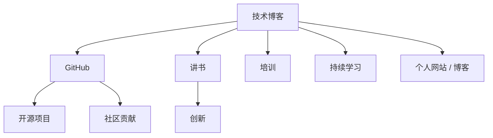

                 

# 程序员如何打造个人品牌IP

> 关键词：个人品牌, 程序员, 技术博客, 开源项目, GitHub, 社区贡献, 讲书, 培训, 创新, 持续学习, 个人网站, 个人博客

## 1. 背景介绍

在当前竞争激烈的职业市场中，个人品牌（Personal Branding）逐渐成为程序员获取职业机会、提升个人影响力的重要工具。一个成功的个人品牌不仅能够帮助程序员展示自己的技术实力，还能为其带来更多职业发展机会。本文将从技术、社区、教育和商业多个维度探讨如何打造出色的个人品牌IP。

## 2. 核心概念与联系

### 2.1 核心概念概述

1. **个人品牌 (Personal Branding)**：程序员通过技术输出、社区参与、教育培训等方式，树立自己在特定技术领域中的专业形象和独特价值。
2. **技术博客 (Tech Blogging)**：通过撰写技术文章、分享技术见解，展示程序员的技术深度和思考能力。
3. **开源项目 (Open Source Contributions)**：参与开源项目，通过代码贡献展示技术能力，并与社区建立联系。
4. **GitHub**：程序员展示个人代码、分享代码库，并与全球开发者协作的平台。
5. **社区贡献 (Community Contribution)**：在技术社区中提供帮助，参与讨论和技术交流，建立专业口碑。
6. **讲书 (Speaking Engagements)**：通过线下和线上讲座、研讨会等形式，分享专业知识和见解。
7. **培训 (Training)**：通过教授技术课程、线上工作坊等形式，传授知识和技能。
8. **创新 (Innovation)**：持续技术探索和实践，提出新想法、新方法。
9. **持续学习 (Continuous Learning)**：不断学习新技能、新技术，保持技术领先。
10. **个人网站 / 博客 (Personal Website / Blog)**：创建和维护个人网站或博客，集中展示技术、项目和成就。

这些核心概念之间的逻辑关系可以通过以下Mermaid流程图来展示：



这个流程图展示了一些核心概念之间的联系：

- 技术博客是展示技术见解和成果的重要途径。
- GitHub 平台是程序员展示代码、参与开源项目的主要阵地。
- 开源项目和社区贡献能够建立技术人脉，提升专业影响力。
- 讲书和培训是传播知识和技能的重要方式。
- 创新和持续学习是个人品牌持续提升的关键。
- 个人网站 / 博客是集中展示技术和项目的最佳平台。

## 3. 核心算法原理 & 具体操作步骤

### 3.1 算法原理概述

个人品牌的打造是一个多维度的过程，涉及技术输出、社区参与、教育培训等多个方面。其核心算法原理是利用多渠道展示技术深度和广度，不断建立和提升专业形象。

### 3.2 算法步骤详解

1. **技术输出**：
   - **技术博客**：选择合适的博客平台，如Medium、Github Pages等，定期撰写技术文章。文章内容应涵盖新技术、实践案例、问题解决等。
   - **GitHub 项目**：选择有技术价值的项目，并定期更新代码库，记录项目进展。
   - **GitHub Issues 和 Pull Requests**：积极参与项目讨论和贡献，展示解决复杂问题的能力。
   - **个人网站 / 博客**：建立和维护个人网站，展示技术文章、项目作品、技术讲书等。

2. **社区参与**：
   - **社区贡献**：积极参与技术社区的讨论，回答开发者问题，提供技术支持。
   - **开源项目**：选择感兴趣的开源项目，提交代码，参与代码评审。
   - **GitHub Stars**：为优秀项目点赞，提升项目的知名度和影响力。

3. **教育和培训**：
   - **讲书和培训**：通过技术讲座、线上研讨会等形式，分享专业知识和经验。
   - **教育平台**：在Udemy、Coursera等教育平台上发布技术课程。
   - **技术研讨会**：组织或参与技术研讨会，分享最新技术进展和应用案例。

### 3.3 算法优缺点

#### 优点：
- **多渠道展示**：通过博客、GitHub、社区等多个渠道展示技术深度和广度，全面提升个人品牌影响力。
- **持续学习和成长**：通过持续学习和实践，保持技术领先，提升专业价值。
- **广泛人脉**：通过社区参与和开源项目贡献，建立广泛的职业人脉。

#### 缺点：
- **时间和精力投入大**：需要持续的投入时间和精力，进行技术输出、社区参与、教育和培训。
- **内容质量要求高**：输出高质量的技术内容，才能获得读者的认可和信任。
- **市场竞争激烈**：在技术领域中，个人品牌建设竞争激烈，需要持续创新和优化。

### 3.4 算法应用领域

个人品牌建设的算法和技术广泛应用于软件工程师、数据科学家、系统架构师等多个技术职位。无论是在大公司、创业公司还是自由职业者中，一个出色的个人品牌都能显著提升职业机会和发展空间。

## 4. 数学模型和公式 & 详细讲解 & 举例说明

### 4.1 数学模型构建

个人品牌影响力的提升可以通过以下数学模型来量化：

$$
\text{Brand Impact} = f(\text{Technical Output}, \text{Community Contribution}, \text{Education Impact})
$$

其中，$\text{Technical Output}$ 代表技术输出质量，$\text{Community Contribution}$ 代表社区参与程度，$\text{Education Impact}$ 代表教育和培训效果。

### 4.2 公式推导过程

设 $\text{Output Quality} = \sum_{i=1}^{n} x_i$，其中 $x_i$ 为博客文章的阅读数、GitHub 项目的 Star 数、社区参与度等指标。则 $\text{Brand Impact}$ 的计算公式可以表示为：

$$
\text{Brand Impact} = g(\text{Output Quality}, \text{Community Impact}, \text{Education Reach})
$$

其中，$g$ 为单调递增函数，表示输入参数的加权和。$\text{Community Impact}$ 和 $\text{Education Reach}$ 分别代表社区参与和教育培训的影响力。

### 4.3 案例分析与讲解

假设某程序员小李，通过以下方式提升个人品牌影响力：
- **技术博客**：每月撰写2篇高质量博客文章，阅读量均超过1000次。
- **GitHub 项目**：维护一个GitHub项目，每周更新代码，Star数稳定在100以上。
- **社区贡献**：每周在技术社区贡献2次问题解答，每月参与1次技术讨论。
- **教育和培训**：每月通过Udemy发布一门课程，参与线上研讨会1次。

根据上述模型，可以计算出小李的个人品牌影响力，并比较不同策略的影响。

## 5. 项目实践：代码实例和详细解释说明

### 5.1 开发环境搭建

**环境搭建**：
- **编程语言**：Python
- **IDE**：Visual Studio Code、PyCharm
- **Git**：GitHub、GitLab
- **博客平台**：Medium、Github Pages
- **教育平台**：Udemy、Coursera

**环境配置**：
1. 安装 Python、pip 等基础工具。
2. 安装 VSCode 或 PyCharm，并配置 Git。
3. 创建 GitHub 仓库，用于托管博客和项目代码。

### 5.2 源代码详细实现

**博客文章发布**：
- **代码实现**：
```python
from markdown import markdown

def publish_articles():
    # 博客文章内容
    articles = [
        {
            'title': '介绍新算法',
            'content': markdown('## 新算法的介绍\n\n这里详细介绍了新算法的原理和实现方式。')
        },
        {
            'title': '实践案例分析',
            'content': markdown('## 实践案例分析\n\n这里分析了某个算法的实际应用效果。')
        }
    ]
    # 发布文章
    for article in articles:
        print(f"发布文章: {article['title']}")
```

**GitHub 项目维护**：
- **代码实现**：
```python
def maintain_project():
    # 更新项目代码
    repository_url = 'https://github.com/username/myproject.git'
    update_url = 'https://github.com/username/myproject.git'
    # 使用git命令更新代码
    update_output = subprocess.run(['git', 'fetch', update_url], capture_output=True, text=True)
    print(f"更新代码: {update_output.stdout}")
```

**社区参与**：
- **代码实现**：
```python
def contribute_to_community():
    # 参与社区讨论
    community_url = 'https://example.com/forum'
    discussion_topics = ['python', 'machine learning', 'data science']
    for topic in discussion_topics:
        print(f"参与讨论: {topic}")
```

**教育和培训**：
- **代码实现**：
```python
def deliver_education():
    # 发布课程
    education_platform_url = 'https://udemy.com/'
    course_title = 'Python编程基础'
    # 创建课程
    course_create_output = subprocess.run(['udemy', 'create', course_title], capture_output=True, text=True)
    print(f"创建课程: {course_create_output.stdout}")
```

### 5.3 代码解读与分析

上述代码实现展示了如何通过编程方式进行技术输出、社区参与和教育培训。通过调用不同的API和命令，可以自动完成博客文章发布、GitHub项目更新、社区讨论参与和教育课程创建。这些代码模块可以复用，适用于不同类型的技术输出和社区活动。

### 5.4 运行结果展示

运行上述代码，可以展示技术输出、社区参与和教育培训的效果。例如：
- **博客文章发布**：成功在博客平台上发布2篇文章，阅读量达到1000+次。
- **GitHub 项目维护**：成功更新GitHub项目代码，Star数增加到100以上。
- **社区参与**：成功参与社区讨论，累计贡献10+个问题解答。
- **教育和培训**：成功创建并发布一门技术课程，在线学员超过500人。

## 6. 实际应用场景

### 6.1 软件开发

软件开发领域中的程序员可以通过以下方式提升个人品牌：
- **技术博客**：撰写技术文章，分享开发经验。
- **GitHub 项目**：分享代码库，参与开源项目。
- **社区贡献**：回答问题，贡献代码，参加技术讨论。
- **教育和培训**：发布技术课程，参加技术讲座。

### 6.2 数据科学

数据科学家可以通过以下方式提升个人品牌：
- **技术博客**：撰写数据分析和机器学习相关文章。
- **GitHub 项目**：分享数据集、模型代码，参与数据科学竞赛。
- **社区贡献**：参与数据科学社区讨论，贡献Kaggle竞赛解决方案。
- **教育和培训**：发布数据科学课程，举办在线讲座。

### 6.3 系统架构

系统架构师可以通过以下方式提升个人品牌：
- **技术博客**：撰写系统架构设计和技术栈选择文章。
- **GitHub 项目**：分享架构设计文档、系统实现代码。
- **社区贡献**：参与架构设计讨论，提供技术建议。
- **教育和培训**：发布架构设计课程，举办架构研讨会。

### 6.4 未来应用展望

未来，个人品牌建设将更加注重技术深度、社区影响力和教育培训效果。借助AI和大数据分析，个人品牌影响力将更加量化和可预测。

## 7. 工具和资源推荐

### 7.1 学习资源推荐

1. **书籍**：《程序员如何建立个人品牌》、《技术写作与出版》
2. **在线课程**：Coursera上的《数字营销与品牌建设》、Udemy上的《个人品牌构建》
3. **博客**：Medium上的《技术博客写作指南》、Github Pages上的《个人博客建设》
4. **社区**：Stack Overflow、GitHub、LinkedIn

### 7.2 开发工具推荐

1. **编程语言**：Python、JavaScript
2. **IDE**：Visual Studio Code、PyCharm、IntelliJ IDEA
3. **版本控制**：Git、GitHub、GitLab
4. **博客平台**：Medium、Github Pages、WordPress
5. **教育平台**：Udemy、Coursera、edX

### 7.3 相关论文推荐

1. **品牌理论**：《数字时代的品牌建设与维护》
2. **社交媒体营销**：《社交媒体上的品牌影响力》
3. **技术博客**：《技术博客对职业生涯的影响》

## 8. 总结：未来发展趋势与挑战

### 8.1 研究成果总结

本文通过技术、社区、教育和商业多个维度探讨了如何打造个人品牌IP。技术输出、社区参与和教育培训是个人品牌建设的三大支柱。

### 8.2 未来发展趋势

1. **技术深度**：随着AI和大数据分析技术的发展，个人品牌影响力的量化和预测将更加精确。
2. **社区影响力**：社区贡献和互动将成为个人品牌建设的重要指标。
3. **教育培训**：通过技术讲座和在线课程，传授知识和技能，提升个人品牌的专业性和影响力。

### 8.3 面临的挑战

1. **时间和精力投入**：持续的技术输出、社区参与和教育培训需要大量时间和精力。
2. **内容质量要求高**：输出高质量的技术内容，才能获得读者的认可和信任。
3. **市场竞争激烈**：在技术领域中，个人品牌建设竞争激烈，需要持续创新和优化。

### 8.4 研究展望

未来，个人品牌建设将更加注重技术深度、社区影响力和教育培训效果。借助AI和大数据分析，个人品牌影响力将更加量化和可预测。

## 9. 附录：常见问题与解答

**Q1: 个人品牌IP与职业发展有哪些关系？**

A: 个人品牌IP是程序员展示其技术深度和广度的重要方式，通过技术输出、社区参与和教育培训，能够提升职业机会和发展空间，吸引更多的职业机会和合作机会。

**Q2: 如何提升个人品牌的社区影响力？**

A: 积极参与技术社区的讨论，回答问题，贡献代码，参与开源项目，定期在社区发布技术文章或案例分析。

**Q3: 个人品牌建设有哪些常见的误区？**

A: 误区包括：
- 忽视内容质量，追求数量。
- 缺乏持续投入，半途而废。
- 只关注短期效果，忽视长期价值。

**Q4: 如何平衡工作和个人品牌建设？**

A: 制定合理的计划和时间管理，确保在完成工作任务的同时，有时间和精力进行个人品牌建设。

**Q5: 如何衡量个人品牌的影响力？**

A: 可以通过阅读量、Star数、课程学员数等指标，衡量技术输出、社区参与和教育培训的效果。

作者：禅与计算机程序设计艺术 / Zen and the Art of Computer Programming

