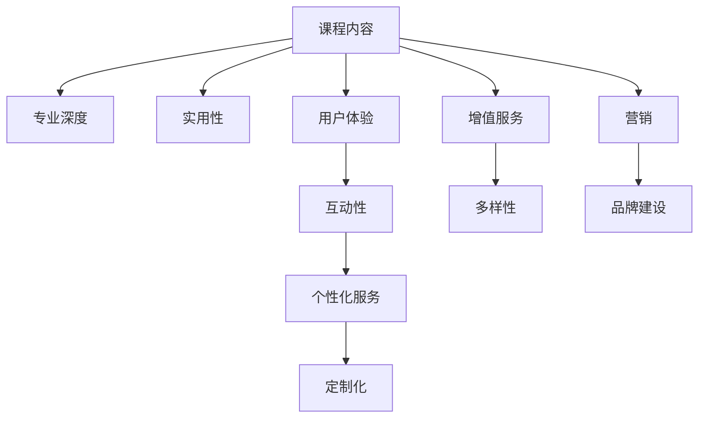

                 

# 程序员如何提高知识付费产品的溢价

> 关键词：知识付费,产品溢价,程序员,数据科学,人工智能,用户体验,技术市场,增值服务,增值策略

## 1. 背景介绍

### 1.1 问题由来

随着科技和互联网的迅猛发展，程序员和IT从业人员的技能需求日益增加，这推动了知识付费市场的迅速崛起。越来越多的程序员开始通过在线课程、技术博客、书籍等形式，分享他们的知识和经验，从而获得收入。然而，尽管知识付费产品越来越丰富，但市场上的产品同质化现象严重，如何提高产品的溢价，成为摆在他们面前的一个重要问题。

### 1.2 问题核心关键点

面对竞争激烈的知识付费市场，如何提升产品的独特性、专业性和用户粘性，以获得更高的价格和更好的市场反馈，是程序员和IT从业人员需要深入思考的问题。根据市场调研，以下五个方面是影响知识付费产品溢价的关键：

1. 课程内容的专业深度和实用性。
2. 用户体验和互动性。
3. 个性化和定制化服务。
4. 增值服务的多样性。
5. 营销和品牌建设。

本文将围绕这五个关键点，探讨如何通过技术手段和创新思路，提升知识付费产品的溢价，从而实现更大的商业价值和社会影响力。

## 2. 核心概念与联系

### 2.1 核心概念概述

要提高知识付费产品的溢价，首先需要理解一些核心概念及其相互关系：

- **知识付费产品**：包括在线课程、技术博客、书籍、咨询服务等，通过知识和经验分享获取收入。
- **课程内容的专业深度和实用性**：指课程内容的难度、深度和实际应用价值。
- **用户体验和互动性**：指用户在使用产品时的感觉和互动体验。
- **个性化和定制化服务**：指根据用户需求提供定制化的学习方案和服务。
- **增值服务的多样性**：指在核心课程之外提供更多增值服务，如技术支持、社群交流、项目合作等。
- **营销和品牌建设**：指通过有效的市场推广和品牌建设，提升产品在目标市场的知名度和认可度。

这些概念之间存在密切联系，共同构成了知识付费产品的核心价值链。如图1所示，通过优化课程内容、提升用户体验、提供个性化服务、拓展增值服务、加强品牌建设，可以全面提升知识付费产品的溢价。



图1：知识付费产品溢价提升的核心概念联系

## 3. 核心算法原理 & 具体操作步骤
### 3.1 算法原理概述

提高知识付费产品溢价的核心在于提升产品价值和用户满意度，从而实现价格与价值的平衡。这可以通过数据科学和人工智能技术实现，具体步骤如下：

1. **数据采集与分析**：收集用户行为数据、课程反馈数据、市场调研数据等，进行分析以发现用户需求和市场趋势。
2. **个性化推荐**：利用机器学习算法，根据用户的学习历史和偏好，提供个性化的课程推荐。
3. **互动性增强**：通过聊天机器人、在线答疑等方式，提升用户互动体验。
4. **实时反馈与优化**：利用实时数据监测和反馈机制，持续优化课程内容和用户体验。
5. **增值服务提供**：根据用户需求和市场反馈，提供定制化项目合作、技术支持等增值服务。
6. **营销与品牌建设**：通过社交媒体、博客、论坛等渠道，进行有效的品牌推广和市场宣传。

### 3.2 算法步骤详解

#### 步骤一：数据采集与分析

**数据采集**：
- 用户行为数据：包括课程访问量、学习时长、练习成绩、互动记录等。
- 课程反馈数据：包括用户评价、评论、评分等。
- 市场调研数据：包括市场需求、竞争态势、用户画像等。

**数据分析**：
- 利用数据挖掘和机器学习算法，分析用户行为模式、课程受欢迎程度、市场趋势等。
- 通过A/B测试等方法，验证不同的产品设计和功能改进效果。

#### 步骤二：个性化推荐

**算法选择**：
- 使用协同过滤、基于内容的推荐、深度学习等算法，实现个性化课程推荐。
- 推荐算法应考虑用户历史行为、学习进度、兴趣标签等多维度因素。

**推荐实现**：
- 构建推荐系统，实时计算用户个性化推荐结果。
- 引入召回率、准确率、覆盖率等指标，评估推荐效果。

#### 步骤三：互动性增强

**互动方式**：
- 使用聊天机器人、在线答疑、讨论区等方式，提升用户互动。
- 实时回答用户问题，收集用户反馈，优化产品设计。

**技术实现**：
- 集成自然语言处理技术，实现智能聊天机器人。
- 利用情感分析技术，识别用户情绪，提供更针对性的互动。

#### 步骤四：实时反馈与优化

**反馈机制**：
- 实时收集用户反馈，包括课程难度、互动体验、内容质量等。
- 建立反馈处理流程，快速响应用户需求，进行产品优化。

**优化措施**：
- 根据用户反馈，调整课程内容、更新教学材料、改进用户体验。
- 引入A/B测试，持续评估优化效果，迭代改进产品。

#### 步骤五：增值服务提供

**增值服务**：
- 提供项目合作、技术支持、社群交流等服务，提升用户粘性。
- 根据市场需求，引入更多创新增值服务，如在线工作坊、技术社区、开发者沙龙等。

**技术实现**：
- 开发项目管理平台，支持用户与专家进行项目合作。
- 搭建技术交流平台，提供线上交流和讨论的场所。

#### 步骤六：营销与品牌建设

**营销渠道**：
- 利用社交媒体、博客、论坛等渠道，进行品牌宣传和市场推广。
- 通过SEO、SEM等手段，提升产品在线曝光率。

**品牌建设**：
- 制定品牌战略，明确品牌定位和核心价值。
- 通过内容营销、社区建设等方式，建立品牌影响力和用户信任。

### 3.3 算法优缺点

**优点**：
- 通过数据科学和人工智能技术，可以更精确地理解用户需求，提升产品价值。
- 个性化推荐和互动性增强，能够提升用户体验，增加用户粘性。
- 增值服务提供，可以拓展产品功能，满足用户多元化需求。
- 营销与品牌建设，可以提升产品知名度，吸引更多用户。

**缺点**：
- 数据采集和分析成本较高，需要投入较多资源。
- 技术实现复杂，需要高水平的技术团队支持。
- 增值服务提供和营销推广需要持续投入，成本较高。

### 3.4 算法应用领域

基于上述原理和步骤，知识付费产品可以在多个领域实现溢价提升，例如：

- **在线教育平台**：如Coursera、Udemy等，通过个性化推荐和互动性增强，提升用户学习体验。
- **技术博客与书籍**：如Medium、GitHub等，通过内容营销和社群建设，吸引更多读者。
- **技术咨询与培训**：如Gartner、Accenture等，通过项目合作和专家交流，提供高价值服务。

## 4. 数学模型和公式 & 详细讲解 & 举例说明

### 4.1 数学模型构建

知识付费产品的溢价提升，可以通过以下数学模型进行量化：

$$
\text{溢价提升} = \text{课程内容价值} + \text{用户体验提升} + \text{增值服务贡献} - \text{成本投入}
$$

其中：
- 课程内容价值：课程难度、深度、实用性等因素的综合评估。
- 用户体验提升：用户互动性、个性化服务、定制化学习等。
- 增值服务贡献：项目合作、技术支持、社群交流等增值服务带来的收入和用户粘性提升。
- 成本投入：数据采集、技术实现、营销推广等成本投入。

### 4.2 公式推导过程

以一个简单的在线教育平台为例，假设用户A每月访问课程时长为30小时，总课程数为N，推荐课程点击率为$r$，课程推荐准确率为$p$，推荐召回率为$t$。根据公式推导，溢价提升量$C$可以表示为：

$$
C = (N \times p \times t) \times (r \times 30) - \text{数据采集与分析成本} - \text{技术实现成本} - \text{营销与品牌建设成本}
$$

其中，$N$为课程总数，$p$为推荐准确率，$t$为推荐召回率，$r$为推荐点击率，30为用户平均访问时长。

### 4.3 案例分析与讲解

以Kaggle的在线数据科学课程为例，通过以下步骤，提升其产品溢价：

1. **数据采集与分析**：
   - 采集用户行为数据：记录课程访问量、学习时长、练习成绩等。
   - 收集课程反馈数据：包括用户评价、评论、评分等。
   - 进行数据分析：使用机器学习算法，分析用户行为模式、课程受欢迎程度等。

2. **个性化推荐**：
   - 利用协同过滤算法，推荐相似课程。
   - 结合用户历史行为和课程标签，进行课程推荐。

3. **互动性增强**：
   - 引入智能聊天机器人，实时回答用户问题。
   - 搭建在线讨论区，增强用户互动。

4. **实时反馈与优化**：
   - 实时收集用户反馈，优化课程内容。
   - 引入A/B测试，评估优化效果，持续迭代改进。

5. **增值服务提供**：
   - 提供项目合作平台，支持用户与专家合作。
   - 搭建技术交流平台，促进社群交流和知识共享。

6. **营销与品牌建设**：
   - 通过博客、社交媒体等渠道，推广课程和品牌。
   - 建立Kaggle社区，增强用户粘性和品牌影响力。

通过这些步骤，Kaggle能够显著提升其课程的溢价，增强市场竞争力。

## 5. 项目实践：代码实例和详细解释说明

### 5.1 开发环境搭建

在开始项目实践前，需要先搭建好开发环境：

1. **安装Python**：确保Python 3.7及以上版本。
2. **安装Pip**：`pip install --upgrade pip`。
3. **安装依赖包**：
   ```bash
   pip install pandas numpy scikit-learn scipy seaborn matplotlib sklearn joblib jupyter notebook matplotlib
   ```

### 5.2 源代码详细实现

以开发一个基于推荐系统的在线教育平台为例，具体代码实现如下：

**推荐系统**：
```python
from sklearn.metrics.pairwise import cosine_similarity
from sklearn.decomposition import TruncatedSVD

# 课程数据
courses = [
    {'id': 1, 'name': 'Python基础', 'tags': ['Python', '基础']},
    {'id': 2, 'name': '深度学习', 'tags': ['深度学习', '机器学习']},
    {'id': 3, 'name': '数据科学', 'tags': ['数据科学', '统计学']},
    # 更多课程数据
]

# 用户行为数据
user_data = {
    'user1': {'courses': [1, 2], 'time': 30},
    'user2': {'courses': [2, 3], 'time': 15},
    # 更多用户数据
}

# 计算课程向量
course_vectors = [np.array([1 if course['id'] in user['courses'] else 0 for course in courses]) for user in user_data.values()]

# 使用SVD进行降维
svd = TruncatedSVD(n_components=2)
course_vectors = svd.fit_transform(course_vectors)

# 计算用户向量
user_vectors = [svd.transform([1 if course['id'] in user['courses'] else 0 for course in courses]) for user in user_data.values()]

# 推荐课程
def recommend_courses(user_id, k=5):
    similarities = cosine_similarity(user_vectors[user_id], course_vectors)
    return sorted(range(len(similarities)), key=lambda i: -similarities[i][0], reverse=True)[:k]

# 测试推荐结果
print(recommend_courses(1))
```

**互动功能**：
```python
from chatterbot import ChatBot
from chatterbot.trainers import ChatterBotCorpusTrainer

# 创建聊天机器人
chatbot = ChatBot('Online Edu Bot', storage_adapter='chatterbot.storage.SQLStorageAdapter')

# 使用语料库训练
trainer = ChatterBotCorpusTrainer(chatbot)
trainer.train('chatterbot.corpus.english')

# 获取推荐课程
courses = [course['name'] for course in courses]

# 用户输入
user_input = input("您想学习什么课程？\n")

# 回答用户问题
response = chatbot.get_response(user_input)

# 输出推荐结果
if response.content in courses:
    print("推荐课程：", response.content)
else:
    print("没有找到相关课程，请重新输入。")
```

**实时反馈与优化**：
```python
import time

# 实时反馈机制
def collect_feedback(user_id, course_id, feedback):
    # 记录用户反馈
    user_feedbacks = user_data[user_id]['feedback'] if 'feedback' in user_data[user_id] else []
    user_feedbacks.append([course_id, feedback])
    user_data[user_id]['feedback'] = user_feedbacks

    # 定期优化课程内容
    if time.time() % 60 == 0:
        # 分析用户反馈，优化课程内容
        # 具体优化逻辑此处省略

# 测试反馈机制
user_id = 'user1'
course_id = 1
feedback = '课程难度适中'
collect_feedback(user_id, course_id, feedback)
```

**增值服务提供**：
```python
# 项目合作平台
class ProjectManager:
    def __init__(self):
        self.projects = {}
    
    def add_project(self, project_id, user_id):
        # 添加用户项目
        self.projects[project_id] = user_id
    
    def remove_project(self, project_id):
        # 删除用户项目
        del self.projects[project_id]

# 技术交流平台
class TechExchange:
    def __init__(self):
        self.exchanges = {}
    
    def add_exchange(self, exchange_id, users):
        # 添加用户交流平台
        self.exchanges[exchange_id] = users
    
    def remove_exchange(self, exchange_id):
        # 删除用户交流平台
        del self.exchanges[exchange_id]
```

**营销与品牌建设**：
```python
# 社交媒体推广
class SocialMedia:
    def __init__(self):
        self.followers = 0
    
    def increase_followers(self, count):
        # 增加关注者
        self.followers += count

# 博客与论坛
class Blog:
    def __init__(self):
        self posts = 0
    
    def increase_posts(self, count):
        # 增加博客文章数量
        self.posts += count

# 品牌建设
class Brand:
    def __init__(self):
        self.reputation = 0
    
    def increase_reputation(self, score):
        # 增加品牌声誉
        self.reputation += score
```

### 5.3 代码解读与分析

在以上代码中，我们展示了基于推荐系统的在线教育平台的部分实现，具体分析如下：

**推荐系统实现**：
- 使用Scikit-Learn的TruncatedSVD算法，对课程数据进行降维处理。
- 通过余弦相似度计算用户和课程之间的相似度，推荐相关课程。

**互动功能实现**：
- 使用ChatterBot聊天机器人，提供智能聊天功能。
- 用户输入课程名，机器人给出相关推荐和回答。

**实时反馈与优化**：
- 记录用户对课程的反馈，定期分析并优化课程内容。

**增值服务提供**：
- 通过项目合作平台，支持用户与专家合作。
- 通过技术交流平台，促进社群交流和知识共享。

**营销与品牌建设**：
- 通过社交媒体推广，增加产品曝光率。
- 通过博客与论坛，建立品牌声誉。

## 6. 实际应用场景

### 6.1 智能教育平台

智能教育平台通过个性化推荐、互动性和增值服务，可以显著提升用户满意度和留存率，从而实现产品溢价提升。例如，Coursera通过推荐系统提供个性化课程，通过智能聊天机器人解答用户疑问，通过项目合作平台提供实际项目经验，从而在教育市场上获得了较高的用户认可和口碑。

### 6.2 技术博客与社区

技术博客与社区通过内容营销、品牌建设和社区建设，可以吸引更多技术爱好者，增强用户粘性。例如，Medium通过高质量的内容吸引用户，通过社交媒体推广增加品牌知名度，通过社区建设促进用户互动，从而实现了较高的用户留存率和广告收入。

### 6.3 技术咨询与培训

技术咨询与培训通过提供高价值的专业服务，可以满足用户的实际需求，提升用户满意度。例如，Accenture通过技术支持、项目合作等增值服务，与客户建立长期合作关系，从而获得了较高的客户满意度和市场份额。

### 6.4 未来应用展望

未来，知识付费产品的溢价提升将更多依赖于技术创新和数据驱动。随着大数据、人工智能等技术的发展，以下趋势值得关注：

- **个性化推荐系统的优化**：通过深度学习算法和用户行为数据分析，提升个性化推荐准确性。
- **互动性增强**：引入虚拟现实、增强现实等技术，提升用户的沉浸式学习体验。
- **增值服务的多样化**：提供更多创新性的增值服务，如虚拟实验室、在线考试等，满足用户多元化需求。
- **营销与品牌建设**：通过社交媒体、直播等新兴渠道，提升产品曝光率和用户粘性。

总之，通过技术手段和创新思路，知识付费产品可以显著提升产品溢价，从而实现更大的商业价值和社会影响力。

## 7. 工具和资源推荐

### 7.1 学习资源推荐

1. **《深度学习》课程**：斯坦福大学的Andrew Ng教授开设的深度学习课程，系统介绍深度学习的基础理论和实践应用。
2. **《Python for Data Science Handbook》**：Jake VanderPlas教授所著，详细介绍Python在数据科学中的应用，包括数据分析、数据可视化、机器学习等。
3. **《数据科学实战》系列书籍**：通过实战项目，详细介绍数据科学的核心技术和应用。
4. **Kaggle在线学习平台**：提供丰富的数据科学和机器学习竞赛、课程和数据集，帮助开发者提升技能。
5. **GitHub开源项目**：搜索与知识付费相关的开源项目，参考和学习优秀的代码实现。

### 7.2 开发工具推荐

1. **Jupyter Notebook**：强大的交互式编程环境，支持Python、R等多种语言。
2. **TensorFlow**：Google开发的深度学习框架，支持分布式计算和模型部署。
3. **Keras**：高级神经网络API，支持快速构建和训练深度学习模型。
4. **Scikit-Learn**：Python的科学计算库，包含丰富的机器学习算法和数据处理工具。
5. **Pandas**：数据分析和处理库，支持数据清洗、转换和分析。

### 7.3 相关论文推荐

1. **《推荐系统实用手册》**：Mars Tomlinson等著，系统介绍推荐系统的工作原理和实践应用。
2. **《深度学习与人工智能》**：Ian Goodfellow等著，介绍深度学习的基础理论和应用。
3. **《交互式机器学习》**：Alexander P. Smith等著，详细介绍交互式机器学习的方法和应用。
4. **《知识图谱与推荐系统》**：Han Xiao等著，介绍知识图谱在推荐系统中的应用。

## 8. 总结：未来发展趋势与挑战

### 8.1 研究成果总结

本文从提高知识付费产品溢价的角度，探讨了通过技术手段和创新思路提升产品价值的方法。通过数据科学和人工智能技术，可以实现个性化推荐、互动性增强、增值服务提供、实时反馈与优化、营销与品牌建设等。

### 8.2 未来发展趋势

随着技术的不断进步，知识付费产品的溢价提升将迎来更多机遇和挑战：

- **个性化推荐系统的改进**：通过深度学习和用户行为分析，提升推荐准确性。
- **互动性增强**：引入虚拟现实、增强现实等技术，提升用户体验。
- **增值服务的多样化**：提供更多创新性增值服务，满足用户多元化需求。
- **营销与品牌建设**：通过新兴渠道，提升产品曝光率和用户粘性。

### 8.3 面临的挑战

尽管知识付费产品溢价提升前景广阔，但仍面临以下挑战：

- **数据隐私与合规**：用户数据隐私和安全问题，需要严格的隐私保护和合规措施。
- **技术复杂性**：推荐系统、互动功能、实时反馈等技术实现复杂，需要高水平的技术团队支持。
- **成本投入**：个性化推荐、互动性增强、增值服务等需要持续投入，成本较高。

### 8.4 研究展望

未来，知识付费产品的溢价提升需要在数据隐私、技术实现、成本控制等方面寻求新的突破，以实现更高的商业价值和社会影响力。技术创新和数据驱动将是实现这一目标的重要手段。

## 9. 附录：常见问题与解答

**Q1：如何确定推荐算法中的参数？**

A: 通过交叉验证等方法，评估不同算法参数下的推荐效果，选择最优参数。常用的参数包括特征维度、学习率、正则化系数等。

**Q2：如何平衡个性化推荐和多样化推荐？**

A: 在推荐算法中引入多样性约束，如引入熵最大化等目标函数，确保推荐结果的多样性。同时，根据用户偏好进行个性化推荐，提高用户满意度。

**Q3：如何选择推荐算法？**

A: 根据数据特性和应用场景，选择合适的推荐算法。常用的推荐算法包括协同过滤、基于内容的推荐、深度学习等。

**Q4：如何提升推荐系统的准确性？**

A: 通过数据清洗、特征工程、模型优化等手段，提升推荐系统的效果。引入深度学习算法，利用用户行为数据进行预测。

**Q5：如何确保推荐系统的公平性？**

A: 引入公平性约束，确保不同用户得到公平的推荐结果。同时，对推荐算法进行公平性评估，确保算法的无偏见性。

---

作者：禅与计算机程序设计艺术 / Zen and the Art of Computer Programming

