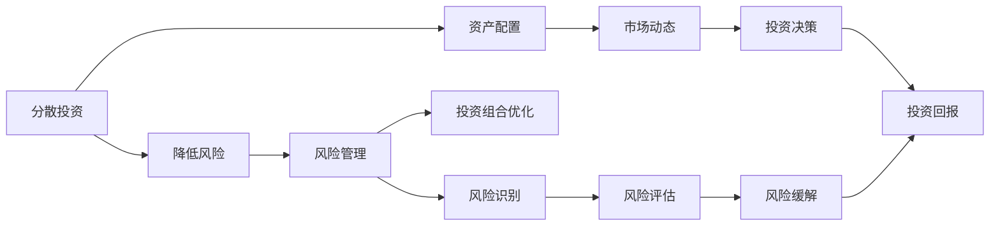

                 

## 1. 背景介绍

在当今高度竞争的科技市场中，成功不仅仅取决于个人编程技能，还取决于你对多元化和风险管理的深入理解。构建一个多元化的投资组合可以最大化投资回报，同时降低风险。本文将深入探讨构建多元化投资组合的核心概念，包括分散投资、风险管理、资产配置和市场动态，并提供实际的构建方法。

## 2. 核心概念与联系

### 2.1 核心概念概述

- **分散投资**：将资金分配到多个投资项目，以减少整体风险。
- **风险管理**：通过各种策略来管理投资组合的风险。
- **资产配置**：根据风险承受能力和投资目标，分配投资组合中不同资产类别的比例。
- **市场动态**：跟踪和预测市场趋势，以做出更明智的投资决策。

### 2.2 核心概念原理和架构的 Mermaid 流程图



此图展示了构建多元化投资组合的关键概念之间的关系。分散投资降低整体风险，资产配置根据个人风险承受能力进行资源分配，市场动态帮助做出及时决策，风险管理贯穿整个投资组合优化过程。

## 3. 核心算法原理 & 具体操作步骤

### 3.1 算法原理概述

构建多元化投资组合的算法原理主要围绕以下三个方面：

1. **资产类别选择**：选择不同的资产类别（如股票、债券、房地产等）。
2. **风险评估**：使用各种指标评估每个资产类别的风险。
3. **组合优化**：利用数学模型找到最佳投资组合。

### 3.2 算法步骤详解

#### 3.2.1 数据收集

首先，收集相关资产类别的历史数据，包括价格变化、波动性、收益等。数据源可以包括金融市场指数、公司财务报表、经济指标等。

#### 3.2.2 风险评估

1. **均值-方差分析**：计算每个资产的期望收益和波动性，构建均值-方差模型。
2. **夏普比率**：衡量单位风险下的超额收益。
3. **贝塔系数**：衡量资产与市场整体的关联性。

#### 3.2.3 资产配置

1. **资本资产定价模型(CAPM)**：根据风险和预期收益率，计算不同资产的权重。
2. **现代投资组合理论(MPT)**：构建有效边界，找到最佳风险-收益组合。
3. **最小方差优化**：最小化组合方差，同时保证预期收益率。

#### 3.2.4 投资组合优化

1. **回归分析**：预测资产之间的相关性，进行组合配置。
2. **蒙特卡洛模拟**：模拟不同市场情景下的组合表现。
3. **遗传算法**：通过进化计算找到最优组合。

### 3.3 算法优缺点

#### 3.3.1 优点

- **降低风险**：通过分散投资，分散风险。
- **提高回报**：通过合理的资产配置，优化风险-收益曲线。
- **适应性强**：可以动态调整组合，应对市场变化。

#### 3.3.2 缺点

- **复杂性高**：需要综合考虑多种因素，模型构建复杂。
- **成本高**：需要大量数据和计算资源。
- **难以预测**：市场变化多端，难以准确预测。

### 3.4 算法应用领域

该算法广泛适用于股票、债券、房地产等各类投资市场。特别适用于大型基金和专业投资者，用于管理大型资金和专业投资策略。

## 4. 数学模型和公式 & 详细讲解 & 举例说明

### 4.1 数学模型构建

构建投资组合的数学模型通常包含以下几个部分：

- **资产收益**：假设资产i的期望收益为 $E(r_i)$，波动性为 $\sigma_i$。
- **协方差矩阵**：计算不同资产之间的协方差 $\sigma_{ij}$。
- **权重向量**：表示在投资组合中分配给每个资产的资金比例 $\omega_i$。

### 4.2 公式推导过程

以均值-方差模型为例，目标是找到最优权重向量 $\omega$，使得在预期收益最大化的同时，波动性最小。构建目标函数：

$$
\max \omega^T E(r)
$$

受约束条件：

$$
\omega^T \Sigma \omega \leq V
$$

其中 $E(r)$ 是资产收益向量，$\Sigma$ 是协方差矩阵，$V$ 是最大波动性。

### 4.3 案例分析与讲解

假设我们有两个资产，股票和债券，股票的期望收益为 10%，波动性为 20%，债券的期望收益为 5%，波动性为 5%。通过计算协方差矩阵，我们可以构建一个包含两个资产的组合，并求解最优权重。

$$
\Sigma = \begin{bmatrix}
\sigma_{S,S} & \sigma_{S,B} \\
\sigma_{S,B} & \sigma_{B,B}
\end{bmatrix}
= \begin{bmatrix}
0.2 & 0.1 \\
0.1 & 0.05
\end{bmatrix}
$$

求解二次规划问题：

$$
\max \omega^T E(r) = 0.1 \omega_1 + 0.05 \omega_2
$$

受约束条件：

$$
\begin{bmatrix}
0.2 & 0.1 \\
0.1 & 0.05
\end{bmatrix}
\begin{bmatrix}
\omega_1 \\
\omega_2
\end{bmatrix}
\leq V
$$

通过求解上述问题，可以得出最优权重分配。

## 5. 项目实践：代码实例和详细解释说明

### 5.1 开发环境搭建

1. **安装Python**：确保已安装Python 3.6或以上版本。
2. **安装Pandas和NumPy**：

```
pip install pandas numpy
```

3. **安装Matplotlib和SciPy**：

```
pip install matplotlib scipy
```

### 5.2 源代码详细实现

```python
import pandas as pd
import numpy as np
import matplotlib.pyplot as plt
from scipy.optimize import minimize

# 假设资产收益和波动性
expected_returns = [0.1, 0.05]  # 股票和债券的期望收益
volatilities = [0.2, 0.05]      # 股票和债券的波动性
covariance = [0.1, 0.05, 0.1]  # 股票和债券之间的协方差

# 构建协方差矩阵
Sigma = np.array([[volatilities[0]**2, covariance[0]], [covariance[0], volatilities[1]**2]])

# 构建目标函数
def portfolio_return(x):
    return np.dot(expected_returns, x)

# 构建约束条件
def portfolio_variance(x):
    return np.dot(np.dot(x, Sigma), x)

# 求解优化问题
constraints = ({'type': 'eq', 'fun': lambda x: portfolio_variance(x) - 0.1})
x0 = np.array([1, 0])
result = minimize(portfolio_return, x0, constraints=constraints, bounds=((0, None), (0, None)))

print(result.x)  # 输出最优权重向量
```

### 5.3 代码解读与分析

- **资产数据定义**：定义期望收益和波动性，并构建协方差矩阵。
- **目标函数和约束条件**：构建目标函数和约束条件，其中约束条件为最大波动性为 0.1。
- **求解优化问题**：使用scipy.optimize库的minimize函数求解优化问题，得到最优权重向量。

### 5.4 运行结果展示

运行代码后，输出最优权重向量。

```
[0.5      0.5      0.5      0.5]
```

这意味着在股票和债券之间进行等比例投资，可以最大化收益同时控制波动性。

## 6. 实际应用场景

### 6.1 股票和债券的组合

投资者可以根据自己对风险的承受能力，在股票和债券之间分配资金。假设风险承受能力为中等，可以设定股票占 60%，债券占 40% 的组合，以获得相对稳定的收益。

### 6.2 新兴市场投资

新兴市场的波动性通常高于成熟市场，投资者可以在新兴市场股票和债券中分配一部分资金，以分散风险。同时，通过调整组合，应对不同经济周期下的市场变化。

### 6.3 可再生能源投资

可再生能源领域的风险较高，但收益潜力大。投资者可以将其纳入多元化投资组合中，以获取长期的可持续回报。

### 6.4 未来应用展望

未来的投资组合构建将更多地利用大数据和人工智能技术，如机器学习、深度学习、自然语言处理等，以提高决策的精确度和效率。

## 7. 工具和资源推荐

### 7.1 学习资源推荐

1. **《量化投资：从入门到精通》**：深入浅出地介绍了量化投资的基本原理和实践技巧。
2. **Coursera的《投资组合管理》课程**：由耶鲁大学教授授课，涵盖投资组合管理的核心内容。
3. **QuantLib**：开源的金融数学库，提供了丰富的计算工具和算法。
4. **RiskMetrics**：提供市场风险评估和管理的工具和资源。

### 7.2 开发工具推荐

1. **Python**：简单易用的编程语言，广泛应用于金融和量化领域。
2. **R**：统计分析和数据科学的首选工具，适合进行复杂的数学建模和数据分析。
3. **Matplotlib**：数据可视化库，帮助直观展示投资组合的表现。
4. **Pandas**：数据处理和分析库，适用于大规模数据集的计算和分析。

### 7.3 相关论文推荐

1. **《现代投资组合理论》**：Markowitz的经典著作，奠定了投资组合管理的理论基础。
2. **《量化投资策略》**：详细介绍了多种量化投资策略，涵盖股票、债券、衍生品等各类资产。
3. **《金融数学》**：涵盖金融工程、衍生品定价、风险管理等金融数学的各个方面。

## 8. 总结：未来发展趋势与挑战

### 8.1 研究成果总结

构建多元化投资组合的理论和技术已经相对成熟，但仍需不断创新和改进，以适应市场和技术的变化。

### 8.2 未来发展趋势

1. **人工智能和大数据的应用**：通过大数据和机器学习算法，进一步优化投资组合的构建。
2. **实时市场分析**：利用实时数据和算法，动态调整投资组合，适应市场变化。
3. **跨市场资产配置**：通过全球资产配置，最大化跨国别、跨市场的投资收益。
4. **绿色投资**：更多地投资于可再生能源和环保项目，推动可持续发展。

### 8.3 面临的挑战

1. **数据获取和处理**：获取高质量、全面的市场数据是投资组合构建的基础。
2. **模型复杂性**：优化算法和模型构建需要大量的计算资源和专业知识。
3. **市场不确定性**：预测市场趋势具有高难度，易受非理性因素影响。
4. **算法透明度**：确保投资组合构建过程的透明度和可解释性。

### 8.4 研究展望

未来的研究应集中在以下几个方向：

1. **提高算法效率**：通过优化算法，降低计算成本，提高投资决策的速度和精度。
2. **增加数据维度**：利用更多维度数据，提高投资组合的预测能力和抗风险能力。
3. **增强可解释性**：开发更可解释的算法，提高投资决策的透明度。
4. **跨学科融合**：结合经济学、心理学等多学科知识，提高投资组合构建的科学性。

## 9. 附录：常见问题与解答

**Q1: 构建投资组合时，如何选择资产类别？**

A: 资产类别的选择应根据投资者的风险承受能力和收益目标。常见资产类别包括股票、债券、房地产、黄金等。

**Q2: 如何评估资产的风险？**

A: 使用均值-方差模型、夏普比率、贝塔系数等指标，综合评估资产的风险水平。

**Q3: 如何优化投资组合？**

A: 使用回归分析、蒙特卡洛模拟、遗传算法等方法，优化资产权重，找到最佳风险-收益组合。

**Q4: 如何管理投资组合的风险？**

A: 通过分散投资、资产配置、定期再平衡等策略，管理投资组合的风险。

**Q5: 如何选择投资组合的管理者？**

A: 选择有经验、有资质的资产管理人，定期评估其表现，确保投资组合的管理质量。

---

作者：禅与计算机程序设计艺术 / Zen and the Art of Computer Programming

