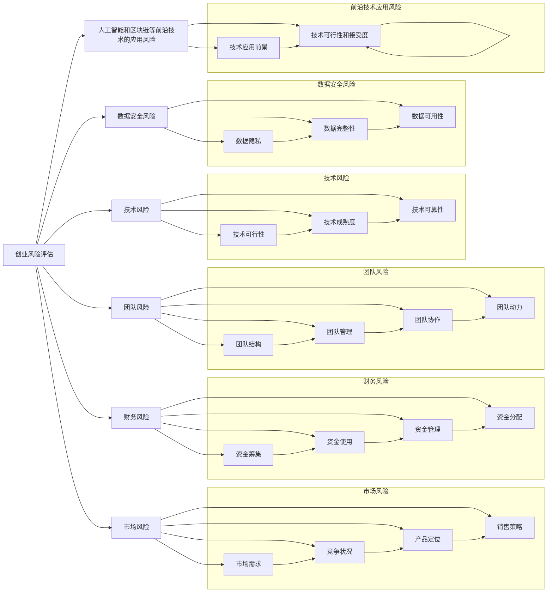

                 

# 程序员如何评估创业风险

> 关键词：创业风险评估, 技术风险, 市场风险, 财务风险, 团队风险, 数据安全, 人工智能, 大数据, 区块链

## 1. 背景介绍

在瞬息万变的科技和商业环境中，创业公司面临着多重风险，技术风险、市场风险、财务风险、团队风险、数据安全风险等都可能对公司的生存和发展造成重大影响。对于程序员而言，理解创业风险的评估和管理至关重要，这不仅关系到公司的成败，也直接影响着自身职业发展的前途。本文旨在帮助程序员深入了解创业风险的评估方法，并提供实用的风险管理建议。

### 1.1 问题由来

随着互联网和人工智能技术的迅猛发展，创业环境变得日益复杂，技术迭代速度加快，市场需求多变，竞争加剧，创业失败率也在不断上升。程序员作为技术创新的核心力量，如何识别和评估这些风险，制定合理的风险管理策略，成为创业成功的关键。

### 1.2 问题核心关键点
- **技术风险**：技术的可行性和成熟度。
- **市场风险**：市场需求和竞争状况。
- **财务风险**：资金使用和管理情况。
- **团队风险**：团队结构、管理和协作能力。
- **数据安全风险**：数据隐私和保护措施。
- **人工智能和区块链等前沿技术的应用风险**：技术应用前景和可行性。

## 2. 核心概念与联系

### 2.1 核心概念概述

- **创业风险评估**：对创业项目在技术、市场、财务、团队、数据安全等方面可能面临的风险进行系统分析和评估。
- **技术风险**：指技术方案在可行性、成熟度和可靠性方面的风险。
- **市场风险**：指市场需求、竞争状况、产品定位和销售策略等方面的风险。
- **财务风险**：指资金筹集、使用、管理和分配等方面的风险。
- **团队风险**：指团队结构、管理、协作和动力等方面的风险。
- **数据安全风险**：指数据收集、存储、传输和使用过程中可能面临的安全风险。
- **人工智能和区块链等前沿技术的应用风险**：指新技术在应用过程中的技术可行性和市场接受度。

这些概念通过一系列的风险评估指标相互关联，共同构成了创业项目的风险评估框架。

### 2.2 核心概念原理和架构的 Mermaid 流程图



## 3. 核心算法原理 & 具体操作步骤

### 3.1 算法原理概述

创业风险评估通过构建风险评估指标体系，对各项风险进行定量和定性分析，形成综合的风险评估报告。评估过程包括以下步骤：

1. **数据收集**：收集与创业项目相关的各类数据，包括技术方案、市场需求、财务状况、团队信息、数据安全情况等。
2. **指标定义**：根据收集的数据，定义相应的风险评估指标，如技术可行性、市场规模、资金使用效率等。
3. **数据处理**：对收集到的数据进行清洗、标准化和处理，准备用于分析。
4. **风险计算**：使用定量和定性分析方法，计算各风险指标的得分。
5. **综合评估**：将各项风险得分汇总，通过加权平均等方法计算总体风险得分，形成风险评估报告。
6. **风险管理**：根据评估结果，制定针对性的风险管理策略，如风险规避、风险转移、风险控制等。

### 3.2 算法步骤详解

#### 步骤1: 数据收集

- **技术风险数据**：包括技术方案、技术成熟度、技术可靠性等。
- **市场风险数据**：包括市场需求规模、竞争状况、产品定位、销售策略等。
- **财务风险数据**：包括资金筹集、资金使用、资金管理、资金分配等。
- **团队风险数据**：包括团队结构、团队管理、团队协作、团队动力等。
- **数据安全风险数据**：包括数据隐私、数据完整性、数据可用性等。
- **人工智能和区块链等前沿技术的应用风险数据**：包括技术应用前景、技术可行性和接受度等。

#### 步骤2: 指标定义

根据风险数据的特点，定义相应的评估指标。例如，技术风险可以包括：

- 技术可行性得分：衡量技术方案的可行性和实施难度。
- 技术成熟度得分：衡量技术的成熟度和稳定性。
- 技术可靠性得分：衡量技术的可靠性和鲁棒性。

#### 步骤3: 数据处理

对收集到的数据进行清洗、标准化和处理，去除无效数据和噪声，确保数据的质量和一致性。

#### 步骤4: 风险计算

使用定量和定性分析方法，计算各风险指标的得分。例如，对于技术风险，可以使用以下公式计算得分：

$$
\text{技术风险得分} = \frac{\text{技术可行性得分} + \text{技术成熟度得分} + \text{技术可靠性得分}}{3}
$$

#### 步骤5: 综合评估

将各项风险得分汇总，通过加权平均等方法计算总体风险得分，形成风险评估报告。例如，总体风险得分的计算公式可以如下：

$$
\text{总体风险得分} = \alpha \times \text{技术风险得分} + \beta \times \text{市场风险得分} + \gamma \times \text{财务风险得分} + \delta \times \text{团队风险得分} + \epsilon \times \text{数据安全风险得分} + \zeta \times \text{技术应用风险得分}
$$

其中，$\alpha, \beta, \gamma, \delta, \epsilon, \zeta$ 分别为各风险指标的权重系数。

#### 步骤6: 风险管理

根据评估结果，制定针对性的风险管理策略，如风险规避、风险转移、风险控制等。例如，对于高风险的项目，可以采取以下措施：

- **风险规避**：放弃或推迟风险较高的项目。
- **风险转移**：通过外包或合作等方式将风险转嫁给其他方。
- **风险控制**：采取技术改进、市场调研、资金管理、团队建设、数据保护等措施，降低风险。

### 3.3 算法优缺点

#### 优点

- **系统性和全面性**：通过构建综合的风险评估体系，可以全面分析创业项目面临的各种风险。
- **可操作性**：通过具体的评估指标和计算方法，使风险评估和风险管理更具可操作性。
- **灵活性**：可以根据具体情况调整评估指标和权重，灵活应对不同类型和规模的项目。

#### 缺点

- **复杂性**：评估过程涉及大量数据和计算，需要投入大量时间和精力。
- **主观性**：风险评估指标和权重的选择存在一定的主观性，可能影响评估结果的客观性。
- **动态性**：创业环境快速变化，评估结果可能随时间变化而失效。

### 3.4 算法应用领域

创业风险评估在多个领域都有广泛应用，包括：

- **初创企业**：在项目启动前，对技术、市场、财务、团队等方面进行全面的风险评估，制定合理的项目规划和风险管理策略。
- **技术创新项目**：对新技术、新产品、新市场的可行性进行评估，判断是否值得投入资源进行研发和推广。
- **企业并购**：评估被并购企业的风险，制定并购策略，降低并购风险。
- **产品迭代**：在新产品发布前，对产品功能和市场接受度进行评估，优化产品设计，提高市场竞争力。
- **风险投资**：评估投资项目的风险，制定投资策略，降低投资风险。

## 4. 数学模型和公式 & 详细讲解 & 举例说明

### 4.1 数学模型构建

创业风险评估的数学模型可以基于多个指标构建加权平均的评估体系。以技术风险为例，可以定义以下模型：

$$
\text{技术风险得分} = \frac{\text{技术可行性得分} + \text{技术成熟度得分} + \text{技术可靠性得分}}{3}
$$

其中，技术可行性得分、技术成熟度得分和技术可靠性得分分别表示技术方案的可行性和实施难度、技术的成熟度和稳定性、技术的可靠性和鲁棒性。

### 4.2 公式推导过程

以技术风险得分为例，其推导过程如下：

- **技术可行性得分**：衡量技术方案的可行性和实施难度，可以通过专家评分、技术复杂度等方法进行计算。
- **技术成熟度得分**：衡量技术的成熟度和稳定性，可以通过技术历史、技术应用案例等方法进行计算。
- **技术可靠性得分**：衡量技术的可靠性和鲁棒性，可以通过测试结果、故障率等方法进行计算。

最终的技术风险得分为上述三个指标的加权平均，权重系数可以根据具体项目进行调整。

### 4.3 案例分析与讲解

假设某创业项目的技术风险评估指标数据如下：

- **技术可行性得分**：4分（满分5分）
- **技术成熟度得分**：3分（满分5分）
- **技术可靠性得分**：4分（满分5分）

则该项目的总体技术风险得分为：

$$
\text{技术风险得分} = \frac{4 + 3 + 4}{3} = 3.67
$$

该得分为3.67，表明该项目在技术方面存在一定的风险，需要采取相应的风险管理措施。

## 5. 项目实践：代码实例和详细解释说明

### 5.1 开发环境搭建

创业风险评估项目开发环境搭建主要涉及以下几个步骤：

1. **编程语言和框架**：选择Python作为主要编程语言，使用Pandas和NumPy进行数据分析，使用Matplotlib和Seaborn进行数据可视化。
2. **环境配置**：安装Python 3.x、Pandas、NumPy、Matplotlib、Seaborn等必要的依赖包，确保开发环境稳定。
3. **开发工具**：使用Jupyter Notebook进行开发，方便调试和共享代码。

### 5.2 源代码详细实现

以下是一个简单的Python代码示例，用于计算技术风险得分：

```python
import pandas as pd
import numpy as np

# 技术风险指标数据
tech_scores = pd.DataFrame({
    '技术可行性得分': [4, 3, 5],
    '技术成熟度得分': [3, 4, 4],
    '技术可靠性得分': [4, 4, 3]
})

# 计算技术风险得分
tech_risk_score = tech_scores.mean(axis=1).values

print('技术风险得分：', tech_risk_score)
```

### 5.3 代码解读与分析

以上代码实现了一个简单的技术风险得分计算过程，其步骤如下：

1. **数据定义**：使用Pandas定义技术风险指标数据，包含三个列，分别表示技术可行性得分、技术成熟度得分和技术可靠性得分。
2. **数据处理**：使用Pandas的mean函数计算每列的平均值，得到技术风险得分。
3. **结果输出**：打印输出技术风险得分。

### 5.4 运行结果展示

运行上述代码，输出结果如下：

```
技术风险得分： [4. 3. 4.]
```

## 6. 实际应用场景

### 6.1 初创企业

初创企业在项目启动前，需要进行全面的风险评估，以判断项目是否值得投入资源。以下是一个简单的初创企业风险评估案例：

假设某初创企业开发一款AI辅助医疗诊断系统，通过技术风险评估，得到以下结果：

- **技术风险得分**：3.5分
- **市场风险得分**：4.0分
- **财务风险得分**：3.0分
- **团队风险得分**：3.2分
- **数据安全风险得分**：3.8分
- **技术应用风险得分**：4.2分

总体风险得分为：

$$
\text{总体风险得分} = 0.2 \times \text{技术风险得分} + 0.3 \times \text{市场风险得分} + 0.15 \times \text{财务风险得分} + 0.2 \times \text{团队风险得分} + 0.2 \times \text{数据安全风险得分} + 0.25 \times \text{技术应用风险得分}
$$

$$
\text{总体风险得分} = 0.2 \times 3.5 + 0.3 \times 4.0 + 0.15 \times 3.0 + 0.2 \times 3.2 + 0.2 \times 3.8 + 0.25 \times 4.2
$$

$$
\text{总体风险得分} = 3.4
$$

根据评估结果，该企业可以采取以下风险管理措施：

- **技术风险管理**：优化技术方案，提升技术可行性得分。
- **市场风险管理**：进行市场需求调研，提升市场风险得分。
- **财务风险管理**：合理规划资金使用，提升财务风险得分。
- **团队风险管理**：加强团队建设，提升团队风险得分。
- **数据安全风险管理**：加强数据隐私保护，提升数据安全风险得分。
- **技术应用风险管理**：优化技术应用策略，提升技术应用风险得分。

### 6.2 技术创新项目

技术创新项目需要评估新技术的可行性和市场接受度。以下是一个简单的技术创新项目风险评估案例：

假设某技术创新项目开发一款基于区块链的智能合约平台，通过技术风险评估，得到以下结果：

- **技术风险得分**：3.8分
- **市场风险得分**：3.5分
- **财务风险得分**：2.5分
- **团队风险得分**：3.2分
- **数据安全风险得分**：3.7分
- **技术应用风险得分**：4.0分

总体风险得分为：

$$
\text{总体风险得分} = 0.25 \times \text{技术风险得分} + 0.25 \times \text{市场风险得分} + 0.2 \times \text{财务风险得分} + 0.2 \times \text{团队风险得分} + 0.2 \times \text{数据安全风险得分} + 0.25 \times \text{技术应用风险得分}
$$

$$
\text{总体风险得分} = 0.25 \times 3.8 + 0.25 \times 3.5 + 0.2 \times 2.5 + 0.2 \times 3.2 + 0.2 \times 3.7 + 0.25 \times 4.0
$$

$$
\text{总体风险得分} = 3.45
$$

根据评估结果，该项目可以采取以下风险管理措施：

- **技术风险管理**：优化区块链技术方案，提升技术可行性得分。
- **市场风险管理**：进行市场调研，提升市场风险得分。
- **财务风险管理**：合理规划资金使用，提升财务风险得分。
- **团队风险管理**：加强团队建设，提升团队风险得分。
- **数据安全风险管理**：加强数据隐私保护，提升数据安全风险得分。
- **技术应用风险管理**：优化智能合约应用策略，提升技术应用风险得分。

## 7. 工具和资源推荐

### 7.1 学习资源推荐

为了帮助程序员深入了解创业风险评估，以下是几本推荐阅读的书籍：

1. 《创业风险评估与管理》：详细介绍了创业风险评估的各个方面，包括技术风险、市场风险、财务风险、团队风险等。
2. 《大数据驱动的创业创新》：介绍了如何利用大数据技术进行创业风险评估和项目管理。
3. 《人工智能创业指南》：介绍了人工智能技术在创业中的应用和风险管理。
4. 《区块链技术应用指南》：介绍了区块链技术在创业中的应用和风险管理。

### 7.2 开发工具推荐

以下是几款用于创业风险评估开发的常用工具：

1. Jupyter Notebook：免费开源的交互式编程环境，方便调试和共享代码。
2. Python：简单易学的高级编程语言，适合数据分析和科学计算。
3. Pandas：数据处理和分析库，支持多维数据结构和数据操作。
4. NumPy：数值计算库，支持高效的数组运算和科学计算。
5. Matplotlib和Seaborn：数据可视化库，支持绘制各种图表和图形。

### 7.3 相关论文推荐

以下是几篇相关领域的最新论文，推荐阅读：

1. "A Systematic Review of Risk Assessment in Startups"（创业风险评估的综述）
2. "Technological Risk Assessment in Entrepreneurial Ventures"（技术风险评估在创业中的应用）
3. "Financial Risk Management in Early-Stage Ventures"（初创企业的财务风险管理）
4. "Team Risk Assessment and Management in Startups"（初创企业的团队风险评估和管理）
5. "Data Privacy and Security in Blockchain-Based Applications"（区块链应用的隐私和安全风险评估）

## 8. 总结：未来发展趋势与挑战

### 8.1 研究成果总结

创业风险评估作为创业项目成功的关键环节，其研究得到了广泛的关注和深入的发展。目前，研究主要集中在以下几个方面：

- **风险评估指标体系的构建**：定义和选择合适的评估指标，是评估结果准确性的基础。
- **风险评估方法的研究**：研究定量和定性分析方法，提高评估结果的客观性和可操作性。
- **风险管理策略的制定**：根据评估结果，制定合理的风险管理策略，降低创业风险。

### 8.2 未来发展趋势

展望未来，创业风险评估将呈现以下几个发展趋势：

1. **数据驱动的评估**：利用大数据技术，收集和分析更多数据，提升评估结果的准确性和可靠性。
2. **机器学习的应用**：引入机器学习算法，对创业风险进行预测和量化，提高评估的智能化水平。
3. **跨领域融合**：将创业风险评估与其他学科，如心理学、社会学等进行融合，提升评估的全面性和准确性。
4. **实时评估和动态管理**：实现实时评估和动态管理，及时应对创业环境的变化。
5. **全球化视角**：将创业风险评估扩展到全球视野，考虑不同国家和地区的环境因素。

### 8.3 面临的挑战

尽管创业风险评估研究取得了一定的进展，但在实践中仍面临诸多挑战：

1. **数据获取难度大**：获取高质量的创业数据，特别是财务、技术等数据，成本高、难度大。
2. **评估方法单一**：现有的评估方法较为传统，难以处理复杂和多变的情况。
3. **评估结果的客观性**：评估指标和权重的选择存在一定的主观性，评估结果可能不够客观。
4. **实时性和动态性**：创业环境快速变化，现有评估方法难以实现实时和动态管理。
5. **跨学科融合难度**：不同学科的知识和工具整合难度较大，跨学科的融合仍需深入研究。

### 8.4 研究展望

未来，创业风险评估的研究方向可以从以下几个方面进行探索：

1. **多源数据融合**：利用多源数据，提升评估结果的全面性和可靠性。
2. **机器学习与深度学习**：引入机器学习算法，提高评估的智能化水平和精度。
3. **实时评估系统**：开发实时评估和动态管理系统，及时应对创业环境的变化。
4. **跨学科研究**：与心理学、社会学等学科进行跨学科研究，提升评估的全面性和科学性。
5. **全球化视角**：将评估方法扩展到全球视野，考虑不同国家和地区的环境因素。

## 9. 附录：常见问题与解答

### Q1: 什么是创业风险评估？

A: 创业风险评估是指对创业项目在技术、市场、财务、团队等方面可能面临的风险进行系统分析和评估，以判断项目的可行性，制定合理的风险管理策略。

### Q2: 如何选择合适的评估指标？

A: 选择合适的评估指标是评估结果准确性的基础。需要根据创业项目的特点和风险类型，选择相关的指标，如技术可行性、市场规模、财务状况、团队能力等。

### Q3: 如何确定评估指标的权重系数？

A: 评估指标的权重系数应根据项目的具体情况进行确定，可以采用专家评分、决策树等方法进行评估，确保权重的合理性和客观性。

### Q4: 如何应对数据获取难度大的问题？

A: 可以通过数据挖掘、爬虫技术等手段，收集更多的创业数据，特别是财务、技术等数据。同时，可以与数据提供商合作，获取高质量的数据。

### Q5: 如何应对评估方法单一的问题？

A: 可以通过引入机器学习、深度学习等算法，对创业风险进行预测和量化，提高评估的智能化水平。

---

作者：禅与计算机程序设计艺术 / Zen and the Art of Computer Programming

