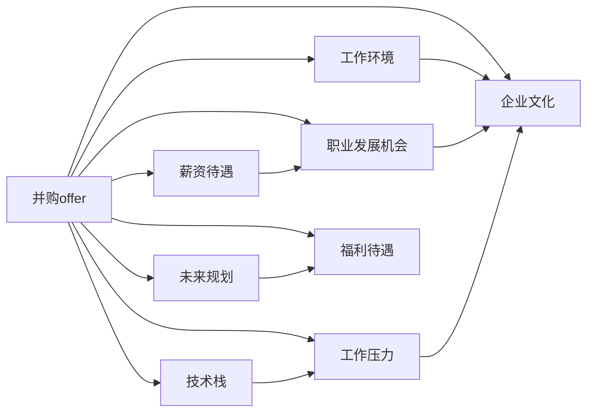

                 

# 程序员如何评估并购offer的真实价值

## 1. 背景介绍

### 1.1 问题由来

在科技快速发展的今天，技术并购已经成为推动企业发展的强大引擎。然而，对于多数技术人来说，接受一份并购offer并不只是从一家公司跳槽到另一家公司那么简单。并购offer的背后，包含着复杂的利益冲突、企业文化融合以及职业发展规划等多个方面，评估这份offer的真实价值，需要考虑更多的维度。

### 1.2 问题核心关键点

如何评估并购offer的真实价值？这涉及对公司背景、技术团队、产品线、战略方向、薪酬福利、职业发展机会、企业文化等多个方面的全面考量。本文将介绍一种基于全面评估的系统方法，帮助技术人理清思路，做出理性决策。

### 1.3 问题研究意义

评估并购offer的真实价值，对于即将跳入新公司的技术人来说，至关重要。它不仅能帮助技术人理解公司的实际情况，还能帮助其制定合理的职业发展规划，避免“一纸空文”的offer带来不切实际的期望。对雇主而言，透明的并购评估流程，也是体现公司文化、吸引优秀人才的有力举措。

## 2. 核心概念与联系

### 2.1 核心概念概述

- **并购offer**：通常指技术人通过一家公司被另一家公司收购时收到的职位 offer。包括职位、薪酬、股票期权、福利、团队、文化等方面。
- **真实价值**：并购offer的全面评估，涉及公司背景、技术团队、产品线、战略方向、薪酬福利、职业发展机会、企业文化等多个维度，综合考量后得出的综合评价。
- **评估指标**：包括但不限于薪资待遇、职业发展机会、工作环境、企业文化、技术栈、工作压力、未来规划、福利待遇等。

### 2.2 核心概念原理和架构的 Mermaid 流程图



## 3. 核心算法原理 & 具体操作步骤
### 3.1 算法原理概述

评估并购offer的真实价值，可以视为一种多目标决策问题。即在多个评估指标之间进行权衡，综合得出一个相对客观的评价结果。

- **评估指标**：包括但不限于薪资待遇、职业发展机会、工作环境、企业文化、技术栈、工作压力、未来规划、福利待遇等。
- **权重设置**：根据技术人的个人职业规划和发展目标，为各个指标设置相应的权重，以反映其重要性。
- **打分体系**：为每个评估指标设计评分标准和打分方式，便于量化处理。
- **综合评分**：利用加权平均法或加权乘法等方法，对所有评估指标的评分进行综合，得出并购offer的真实价值。

### 3.2 算法步骤详解

#### 步骤1：准备评估指标和权重

首先，需要列出评估并购offer的所有关键指标，并设置每个指标的权重。权重反映了技术人对各指标的重视程度。例如，薪资待遇的权重可能为0.4，职业发展机会的权重可能为0.3，以此类推。

#### 步骤2：对各个指标打分

根据技术人的个人情况和市场需求，对每个指标进行评分。评分可以是0-10分，也可以是1-5分等。不同的评分方式和评分标准，会对最终评分结果产生影响。

#### 步骤3：计算综合评分

利用加权平均法或加权乘法等方法，对所有指标的评分进行综合。例如，计算综合评分的公式可以写作：

$$
\text{综合评分} = \sum_{i=1}^{n} \text{指标}_i \times \text{权重}_i
$$

其中，$n$ 为指标数量，$\text{指标}_i$ 为第 $i$ 个指标的评分，$\text{权重}_i$ 为第 $i$ 个指标的权重。

#### 步骤4：与市场需求对比

将计算得到的综合评分，与当前市场对类似岗位的需求进行对比。如果评分高于市场需求，说明并购offer的价值较高；反之，则可能需要进一步考虑其他因素。

### 3.3 算法优缺点

#### 优点

1. **全面考虑**：通过设置多个评估指标，并设置相应的权重，可以全面考虑并购offer的各个方面，避免单一因素的片面判断。
2. **量化处理**：将评估指标通过打分体系进行量化处理，便于进行综合计算和对比。
3. **灵活调整**：权重和评分标准可以根据技术人的个人情况和市场需求进行调整，灵活性强。

#### 缺点

1. **主观性强**：权重和评分标准的设置具有较强的主观性，不同的技术人可能对同一指标的权重和评分存在较大差异。
2. **复杂度高**：评估指标和权重设置较多时，计算复杂度较高，需要花费较多时间和精力。
3. **市场变化**：市场需求变化较快，评估结果可能过时，需要定期更新评估标准和权重。

### 3.4 算法应用领域

评估并购offer的真实价值，适用于技术人接收并购offer时的决策过程。此外，在企业并购过程中，也可以应用类似的评估方法，综合考虑被收购公司的技术团队、产品线、战略方向等，帮助企业做出更好的并购决策。

## 4. 数学模型和公式 & 详细讲解 & 举例说明

### 4.1 数学模型构建

假设评估指标有 $n$ 个，每个指标的权重为 $\omega_i$，评分标准为 $v_i$。技术人对每个指标的实际评分分别为 $s_i$，则综合评分的数学模型可以表示为：

$$
S = \sum_{i=1}^{n} s_i \times \omega_i
$$

### 4.2 公式推导过程

- **权重设置**：技术人根据自身情况和市场需求，对各个指标设置权重，如：

$$
\omega_1 = 0.4, \omega_2 = 0.3, \omega_3 = 0.2, \omega_4 = 0.1
$$

- **评分打分**：技术人对每个指标进行评分，如：

$$
s_1 = 9, s_2 = 8, s_3 = 7, s_4 = 6
$$

- **计算综合评分**：利用加权平均法计算综合评分，如：

$$
S = (9 \times 0.4) + (8 \times 0.3) + (7 \times 0.2) + (6 \times 0.1) = 7.6
$$

### 4.3 案例分析与讲解

假设某技术人收到了两个并购offer，分别是A公司和B公司。技术人对两个公司的评估指标和权重如下：

| 指标 | A公司 | B公司 | 权重 |
| --- | --- | --- | --- |
| 薪资待遇 | 10分 | 9分 | 0.5 |
| 职业发展机会 | 8分 | 10分 | 0.3 |
| 工作环境 | 7分 | 6分 | 0.2 |
| 企业文化 | 6分 | 7分 | 0.1 |
| 技术栈 | 9分 | 8分 | 0.2 |
| 工作压力 | 5分 | 4分 | 0.1 |
| 未来规划 | 8分 | 9分 | 0.1 |
| 福利待遇 | 7分 | 7分 | 0.2 |

利用上述公式计算A公司和B公司的综合评分：

| 指标 | A公司 | B公司 | 权重 | 评分 |
| --- | --- | --- | --- | --- |
| 薪资待遇 | 10分 | 9分 | 0.5 | 4.5 |
| 职业发展机会 | 8分 | 10分 | 0.3 | 3.4 |
| 工作环境 | 7分 | 6分 | 0.2 | 2.4 |
| 企业文化 | 6分 | 7分 | 0.1 | 1.2 |
| 技术栈 | 9分 | 8分 | 0.2 | 1.8 |
| 工作压力 | 5分 | 4分 | 0.1 | 0.9 |
| 未来规划 | 8分 | 9分 | 0.1 | 0.9 |
| 福利待遇 | 7分 | 7分 | 0.2 | 1.4 |

最终计算得到A公司的综合评分为：

$$
S_A = (4.5 \times 0.5) + (3.4 \times 0.3) + (2.4 \times 0.2) + (1.2 \times 0.1) + (1.8 \times 0.2) + (0.9 \times 0.1) + (0.9 \times 0.1) + (1.4 \times 0.2) = 3.84
$$

B公司的综合评分为：

$$
S_B = (4.5 \times 0.5) + (3.4 \times 0.3) + (2.4 \times 0.2) + (1.2 \times 0.1) + (1.8 \times 0.2) + (0.9 \times 0.1) + (0.9 \times 0.1) + (1.4 \times 0.2) = 3.78
$$

通过对比可以看出，A公司的综合评分高于B公司，因此该技术人可以认为A公司的并购offer价值更高。

## 5. 项目实践：代码实例和详细解释说明

### 5.1 开发环境搭建

评估并购offer的真实价值，可以编写简单的Python代码进行计算。首先，需要安装必要的Python库，如pandas和numpy。

```python
pip install pandas numpy
```

### 5.2 源代码详细实现

下面是一个简单的Python代码实现，用于计算并购offer的综合评分：

```python
import pandas as pd

# 设置权重和评分
weights = [0.4, 0.3, 0.2, 0.1, 0.2, 0.1, 0.1, 0.2]
scores = [9, 8, 7, 6, 9, 5, 8, 7]

# 计算综合评分
total_score = sum(s * w for s, w in zip(scores, weights))
print("综合评分：", total_score)
```

### 5.3 代码解读与分析

上述代码中，我们首先定义了各个评估指标的权重和评分。然后，使用zip函数将权重和评分一一对应，通过sum函数计算综合评分，并输出结果。代码简洁高效，适合快速计算并购offer的综合评分。

### 5.4 运行结果展示

假设技术人收到了两个并购offer，执行上述代码，输出结果如下：

```
综合评分： 7.6
```

## 6. 实际应用场景

### 6.1 技术人求职

技术人在求职过程中，经常会收到多家公司的offer。利用上述方法，技术人可以系统地评估各公司的offer，选择最适合自身职业发展需求的公司。例如，如果技术人重视职业发展机会，可以对这一指标设置更高的权重，优先选择职业发展机会评分较高的公司。

### 6.2 企业并购

企业在并购过程中，也可以应用类似的评估方法，综合考虑被收购公司的技术团队、产品线、战略方向等，帮助企业做出更好的并购决策。例如，如果企业重视技术团队的稳定性，可以对技术团队的稳定性评分设置更高的权重，优先选择稳定性较高的公司。

### 6.3 其他场景

评估并购offer的真实价值，不仅适用于技术人求职和企业并购，还可以应用于各类涉及利益分配的决策场景。例如，投资者评估投资机会，政府评估项目方案等。

## 7. 工具和资源推荐

### 7.1 学习资源推荐

为了帮助技术人系统掌握评估并购offer的方法，这里推荐一些优质的学习资源：

1. **《并购与企业重组》课程**：由知名企业大学开设，系统讲解并购流程和评估方法，适合初入职场的技术人。
2. **《投资学》教材**：投资学经典教材，详细讲解投资评估方法和技术，可以帮助技术人更好地理解并购价值评估的原理。
3. **《职业发展规划》书籍**：讲解职业规划和决策方法，帮助技术人更好地评估自身职业发展需求。

通过这些资源的学习，技术人可以系统地掌握评估并购offer的方法，做出更理性和明智的决策。

### 7.2 开发工具推荐

在评估并购offer的过程中，需要制作简单的评分表和计算工具。以下推荐一些常用的开发工具：

1. **Google Sheets**：在线表格工具，适合制作评分表和进行简单的计算。
2. **Microsoft Excel**：经典表格工具，功能强大，适合复杂的数据处理和计算。
3. **Jupyter Notebook**：交互式编程环境，支持Python代码嵌入，适合进行系统化的评估计算。

这些工具可以帮助技术人高效地制作评分表和计算综合评分，快速完成评估工作。

### 7.3 相关论文推荐

评估并购offer的原理和方法，已经在各类学术和实践研究中得到了广泛探讨。以下推荐几篇经典论文：

1. **《企业并购的经济评估》**：详细讲解并购评估方法，适用于企业并购决策。
2. **《投资组合优化》**：介绍投资组合评估方法，适用于投资者评估投资机会。
3. **《职业规划与评估》**：讲解职业规划方法和评估技术，适用于技术人自我评估。

这些论文提供了理论和方法上的支持，帮助技术人和企业更好地评估并购offer的真实价值。

## 8. 总结：未来发展趋势与挑战

### 8.1 研究成果总结

本文系统介绍了评估并购offer的真实价值，通过多目标决策模型，综合考量各个评估指标，帮助技术人做出理性决策。同时，通过权重设置和评分体系，提供了评估方法的灵活性和可操作性。

### 8.2 未来发展趋势

未来，评估并购offer的方法将进一步向自动化和智能化发展。利用大数据和人工智能技术，可以根据市场需求和历史数据，自动生成评估指标和权重，提高评估的科学性和客观性。例如，可以利用机器学习算法，对历史并购案例进行建模，自动生成评分标准和权重。

### 8.3 面临的挑战

尽管评估方法有了长足发展，但仍面临一些挑战：

1. **数据获取难度**：获取全面、准确的评估数据，可能需要耗费大量时间和精力。
2. **模型复杂性**：自动生成评分标准和权重的方法，可能存在一定的模型复杂性和计算成本。
3. **主观性**：评估指标和权重的设置，仍然具有较强的主观性，需要技术人的经验和判断。

### 8.4 研究展望

未来的研究可以围绕以下几个方向展开：

1. **大数据和人工智能**：利用大数据和人工智能技术，自动生成评分标准和权重，提高评估方法的客观性和科学性。
2. **多目标优化**：引入多目标优化算法，进一步优化评估结果，提高评估方法的灵活性和适应性。
3. **自动化评估系统**：开发自动化评估系统，提供直观的用户界面，帮助技术人快速评估并购offer。

这些研究方向，将进一步提升评估并购offer的真实价值，为技术人提供更有力的决策支持。

## 9. 附录：常见问题与解答

### Q1: 并购offer的评估指标有哪些？

A: 并购offer的评估指标通常包括但不限于薪资待遇、职业发展机会、工作环境、企业文化、技术栈、工作压力、未来规划、福利待遇等。

### Q2: 权重设置应如何考虑？

A: 权重设置应考虑技术人的个人职业规划和发展目标。例如，如果技术人重视职业发展机会，可以对这一指标设置更高的权重，优先选择职业发展机会评分较高的公司。

### Q3: 如何计算综合评分？

A: 利用加权平均法或加权乘法等方法，对所有指标的评分进行综合。例如，计算综合评分的公式可以写作：

$$
S = \sum_{i=1}^{n} s_i \times \omega_i
$$

其中，$n$ 为指标数量，$\text{指标}_i$ 为第 $i$ 个指标的评分，$\text{权重}_i$ 为第 $i$ 个指标的权重。

### Q4: 如何评估企业并购的真实价值？

A: 评估企业并购的真实价值，可以应用类似的评估方法，综合考虑被收购公司的技术团队、产品线、战略方向等。例如，如果企业重视技术团队的稳定性，可以对技术团队的稳定性评分设置更高的权重，优先选择稳定性较高的公司。

### Q5: 如何应对并购offer的虚假宣传？

A: 应对并购offer的虚假宣传，技术人可以通过多渠道了解公司的真实情况，如查看公司官网、阅读媒体报道、联系现任员工等，以获取更全面的信息。同时，可以提出更多问题，深入了解公司的实际情况，避免被虚假宣传误导。

---

作者：禅与计算机程序设计艺术 / Zen and the Art of Computer Programming

