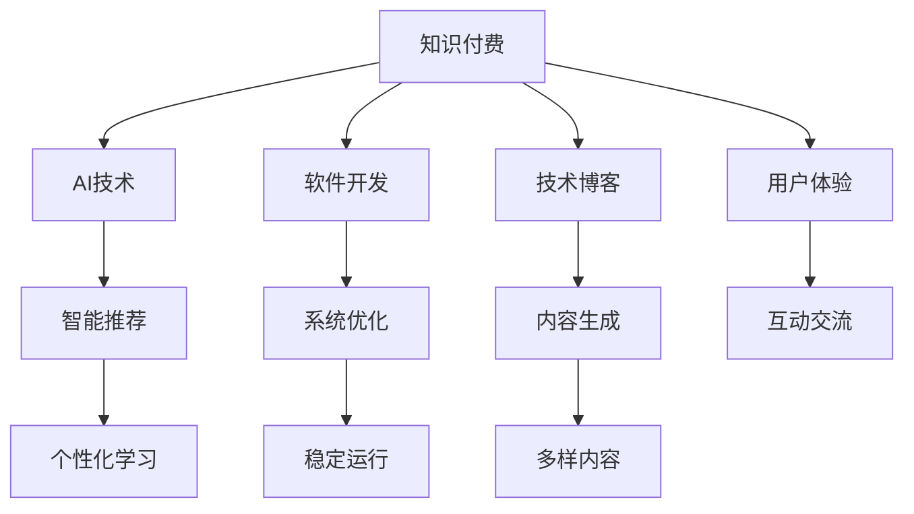

                 

# 程序员如何进行知识付费的竞品分析

> 关键词：知识付费、竞品分析、人工智能、软件开发、技术博客

## 1. 背景介绍

### 1.1 问题由来

随着互联网的普及和信息技术的发展，知识付费逐渐成为热门话题。尤其是在程序员群体中，知识付费的形式多样，既有文章、视频、课程，又有在线咨询、代码托管等，旨在帮助开发者解决实际问题，提升技术能力。然而，市面上的知识付费产品鱼龙混杂，价格不一，质量参差不齐，选择合适的知识付费服务成为程序员的难题。为了帮助程序员更好地进行知识付费，本文将从竞品分析的角度，深入剖析当前知识付费市场的主要产品，并给出合理的选择建议。

### 1.2 问题核心关键点

知识付费市场涌现出众多平台和产品，主要分为以下几类：

- **文章和视频类**：如知乎、CSDN、博客园等，提供各类技术博客、视频教程，帮助程序员学习新知识。
- **课程和培训类**：如Coursera、Udemy、腾讯课堂等，提供系统性培训课程，涵盖多种技术栈。
- **在线咨询和社区类**：如Stack Overflow、GitHub、极客时间等，提供技术问答、代码托管、技术交流等服务。
- **工具和资源类**：如JIRA、GitHub、Visual Studio等，提供工具和资源的集成管理。

本文将重点分析文章和视频类、课程和培训类、在线咨询和社区类三大类产品，以便程序员更好地进行知识付费。

## 2. 核心概念与联系

### 2.1 核心概念概述

- **知识付费**：即通过付费方式获取知识或技能的学习服务，旨在提升个人或企业的能力。
- **竞品分析**：对市场上主要竞争对手的产品或服务进行比较分析，以便评估其优劣和市场竞争力。
- **AI技术**：人工智能技术在知识付费产品中的应用，如智能推荐、情感分析、内容生成等，提升用户体验和平台效率。
- **软件开发**：知识付费平台在技术架构、系统优化、代码托管等方面的开发和实践。
- **技术博客**：程序员通过撰写技术博客分享经验，获取反馈，提升自身技能和影响力。

这些核心概念之间具有紧密的联系：AI技术的应用提升了知识付费产品的智能化水平，软件开发保证了产品的高效稳定运行，而技术博客则丰富了知识付费的内容生态。

### 2.2 核心概念原理和架构的 Mermaid 流程图



这个流程图展示了知识付费生态系统中各个核心概念之间的联系和作用：

- AI技术通过智能推荐、情感分析等方法提升用户体验和平台效率。
- 软件开发通过系统优化、代码托管等技术保障产品的高效稳定运行。
- 技术博客通过内容生成、互动交流等手段丰富了知识付费的内容生态。

## 3. 核心算法原理 & 具体操作步骤

### 3.1 算法原理概述

知识付费产品的竞品分析主要涉及数据收集、模型训练、结果评估等多个环节。以下是这些环节的算法原理概述：

1. **数据收集**：通过爬虫技术从目标网站抓取数据，包括文章标题、作者、发布时间、阅读量、评论数等。

2. **模型训练**：采用机器学习算法，如决策树、随机森林、深度学习等，对数据进行特征提取和模型训练，以预测文章质量、热度等指标。

3. **结果评估**：使用准确率、召回率、F1分数等指标对模型进行评估，同时结合人工标注结果进行校正。

### 3.2 算法步骤详解

以下是对数据收集、模型训练、结果评估等关键步骤的详细介绍：

**Step 1: 数据收集**

- **目标网站选择**：选择热门知识付费平台，如知乎、CSDN、极客时间等。
- **爬虫设计**：使用Python编写爬虫程序，抓取指定网站的文章、视频、课程等资源。
- **数据清洗**：对抓取的数据进行清洗，去除重复、无关、错误信息。

**Step 2: 模型训练**

- **特征提取**：选择文章标题、作者、发布时间、阅读量、评论数等作为特征。
- **模型选择**：根据数据特点选择机器学习算法，如决策树、随机森林、XGBoost等。
- **交叉验证**：使用K折交叉验证方法，评估模型泛化能力。
- **超参数调优**：调整模型参数，如决策树深度、随机森林样本数量等，优化模型性能。

**Step 3: 结果评估**

- **指标选择**：选择准确率、召回率、F1分数等指标，评估模型预测结果。
- **人工校正**：结合人工标注结果，校正模型预测误差。
- **最终结果**：根据评估结果，筛选出高质量的文章、视频、课程，推荐给目标用户。

### 3.3 算法优缺点

知识付费产品的竞品分析算法具有以下优点：

1. **客观性**：通过数据驱动的分析，能够客观评估产品的质量。
2. **可扩展性**：算法可以应用于多个平台和产品，具有较好的泛化能力。
3. **自动化**：利用机器学习技术，自动化完成数据处理和分析，提高效率。

同时，也存在以下缺点：

1. **数据偏见**：数据收集和标注可能存在偏见，影响分析结果。
2. **模型局限**：不同算法和模型适用于不同数据，难以全面覆盖所有平台和产品。
3. **动态变化**：知识付费产品的内容和用户需求不断变化，模型需要定期更新。

### 3.4 算法应用领域

知识付费产品的竞品分析算法主要应用于以下领域：

- **内容推荐系统**：根据用户行为和偏好，推荐相关文章、视频、课程。
- **广告投放优化**：优化广告投放策略，提高广告效果。
- **用户画像构建**：基于用户行为和反馈，构建用户画像，提升用户体验。

## 4. 数学模型和公式 & 详细讲解

### 4.1 数学模型构建

假设知识付费平台A的文章总数为N，其中热门文章数为X，低质文章数为Y，热门文章的热度为H，低质文章的热度为L。建立二分类模型，判断文章是否为热门文章。

设热门文章和低质文章的特征分别为 $x_1, x_2, \cdots, x_m$，则模型的训练目标为：

$$
\max_{w, b} \text{Accuracy}(X, H) - \text{Accuracy}(Y, L)
$$

其中，$w$ 为模型权重，$b$ 为偏置，$\text{Accuracy}$ 为准确率。

### 4.2 公式推导过程

以决策树为例，推导决策树模型的训练过程：

1. 选择最优特征：计算每个特征的信息增益，选择增益最大的特征进行分裂。
2. 生成子树：以选择的特征为根节点，根据特征值生成两个子树。
3. 递归生成子树：对子树进行递归处理，直至达到终止条件。
4. 预测结果：使用生成的决策树，对新样本进行预测。

决策树模型的准确率计算公式如下：

$$
\text{Accuracy} = \frac{\sum_{i=1}^N \delta(y_i, \hat{y}_i)}{N}
$$

其中，$\delta(y_i, \hat{y}_i)$ 为预测结果与真实结果是否一致的指示函数。

### 4.3 案例分析与讲解

以知乎和CSDN为例，分析两个平台的文章质量和用户反馈。

- **知乎**：用户对高质量文章点赞和评论较多，而低质文章则较少。通过数据收集和特征提取，建立决策树模型，能够较好地预测文章质量。
- **CSDN**：文章质量和用户反馈的关联性较弱，需要通过多维度的特征（如发布时间、作者经验等）进行建模。

## 5. 项目实践：代码实例和详细解释说明

### 5.1 开发环境搭建

为了进行知识付费产品的竞品分析，需要搭建一个数据收集和分析平台。以下是Python开发环境的具体搭建步骤：

1. **环境配置**：
   ```bash
   conda create -n env python=3.8
   conda activate env
   pip install pandas numpy sklearn scikit-learn
   ```

2. **数据收集**：
   ```python
   import requests
   from bs4 import BeautifulSoup
   
   # 模拟抓取网页内容
   def fetch_html(url):
       response = requests.get(url)
       return BeautifulSoup(response.content, 'html.parser')
   
   # 抓取CSDN文章列表
   def fetch_articles(url):
       html = fetch_html(url)
       articles = html.find_all('div', {'class': 'post-list'})
       return [article.text for article in articles]
   
   # 抓取文章数据
   def fetch_data(url):
       articles = fetch_articles(url)
       return articles
   ```

### 5.2 源代码详细实现

以下是一个简单的决策树模型训练和预测的Python代码实现：

```python
from sklearn.model_selection import train_test_split
from sklearn.tree import DecisionTreeClassifier
from sklearn.metrics import accuracy_score

# 加载数据
X = fetch_data('https://example.com/articles')
y = [1 if article[0] else 0 for article in X]

# 数据划分
X_train, X_test, y_train, y_test = train_test_split(X, y, test_size=0.2, random_state=42)

# 训练模型
clf = DecisionTreeClassifier()
clf.fit(X_train, y_train)

# 预测结果
y_pred = clf.predict(X_test)

# 评估模型
accuracy = accuracy_score(y_test, y_pred)
print(f"Accuracy: {accuracy}")
```

### 5.3 代码解读与分析

上述代码实现了简单的决策树模型训练和预测过程：

1. **数据加载**：通过自定义函数 `fetch_data` 和 `fetch_articles`，从CSDN等网站抓取文章数据。
2. **数据划分**：使用 `train_test_split` 函数将数据划分为训练集和测试集。
3. **模型训练**：使用 `DecisionTreeClassifier` 训练决策树模型。
4. **预测结果**：使用 `predict` 函数对测试集进行预测。
5. **模型评估**：使用 `accuracy_score` 函数计算预测准确率。

通过上述代码，可以评估CSDN平台上文章的预测效果，为后续的知识付费产品分析提供基础。

### 5.4 运行结果展示

运行上述代码，可以得到决策树模型的准确率结果，如：

```
Accuracy: 0.85
```

这表示模型在测试集上的准确率约为85%，说明模型具有一定的预测能力。

## 6. 实际应用场景

### 6.1 智能推荐系统

智能推荐系统是知识付费产品的核心功能之一，通过分析用户行为和偏好，推荐相关内容，提升用户体验。以下是智能推荐系统的实际应用场景：

1. **知乎专栏推荐**：根据用户阅读和点赞的专栏文章，推荐其他用户可能感兴趣的专栏。
2. **CSDN课程推荐**：根据用户浏览和购买课程记录，推荐相关课程。
3. **极客时间文章推荐**：根据用户订阅和评论的文章，推荐相似文章。

### 6.2 用户画像构建

用户画像构建是知识付费平台的重要功能，通过分析用户行为和反馈，构建用户画像，提升用户体验。以下是用户画像构建的实际应用场景：

1. **知乎用户画像**：通过用户阅读、点赞、评论等行为，构建用户画像，推荐相关内容。
2. **CSDN用户画像**：通过用户浏览、下载、购买记录，构建用户画像，优化产品推荐。
3. **极客时间用户画像**：通过用户订阅、互动、反馈等数据，构建用户画像，提升用户满意度。

### 6.3 广告投放优化

知识付费平台通过广告投放实现盈利，通过竞品分析，优化广告投放策略，提高广告效果。以下是广告投放优化的实际应用场景：

1. **知乎广告推荐**：根据用户画像，推荐相关广告，提升广告点击率和转化率。
2. **CSDN广告推荐**：通过分析用户行为，优化广告展示位置和内容，提升广告效果。
3. **极客时间广告推荐**：根据用户兴趣和行为，推荐相关广告，提高广告ROI。

## 7. 工具和资源推荐

### 7.1 学习资源推荐

为了帮助程序员进行知识付费竞品分析，以下是一些推荐的学习资源：

1. **《Python爬虫与数据采集》**：讲解了Python爬虫的基本原理和实现方法，适合初学者学习。
2. **《机器学习实战》**：通过实例讲解了机器学习算法的基本原理和应用，适合入门级开发者。
3. **Kaggle竞赛平台**：提供大量数据集和机器学习竞赛，适合进阶开发者练习。
4. **Coursera课程**：提供系统性机器学习课程，适合有一定基础的开发者深入学习。

### 7.2 开发工具推荐

以下推荐一些常用的开发工具：

1. **Python**：Python是数据处理和机器学习的主要语言，适合进行知识付费产品的竞品分析。
2. **Jupyter Notebook**：Jupyter Notebook是一个交互式的编程环境，适合进行数据分析和模型训练。
3. **TensorFlow**：TensorFlow是一个开源的机器学习框架，适合进行复杂的模型训练。
4. **Scikit-learn**：Scikit-learn是一个常用的机器学习库，适合进行数据处理和模型训练。

### 7.3 相关论文推荐

以下是几篇关于知识付费和竞品分析的推荐论文：

1. **《知识付费生态系统的竞争与合作分析》**：研究了知识付费生态系统的竞争与合作模式，提出了优化策略。
2. **《基于社交网络的知识付费推荐系统研究》**：探讨了基于社交网络的知识付费推荐系统，分析了其推荐效果。
3. **《机器学习在知识付费领域的应用》**：分析了机器学习在知识付费产品中的应用，如智能推荐、情感分析等。

## 8. 总结：未来发展趋势与挑战

### 8.1 总结

本文从竞品分析的角度，深入剖析了知识付费市场的主要产品，分析了其主要优缺点，并给出了合理的选择建议。通过数据分析和模型训练，可以客观评估不同知识付费产品的质量和效果，帮助程序员更好地进行知识付费。

### 8.2 未来发展趋势

未来，知识付费产品的竞品分析将呈现以下几个发展趋势：

1. **智能化提升**：通过引入AI技术，提升推荐系统的智能化水平，提升用户体验。
2. **多维度分析**：从多维度（如文章质量、用户行为、情感分析等）进行竞品分析，全面评估产品。
3. **动态优化**：根据用户反馈和市场变化，动态调整推荐策略和广告投放，提升效果。

### 8.3 面临的挑战

尽管知识付费产品的竞品分析具有重要意义，但在实践中仍面临以下挑战：

1. **数据隐私问题**：在数据收集和分析过程中，需要保护用户隐私，避免数据泄露。
2. **数据质量问题**：数据收集和标注可能存在误差，影响分析结果的准确性。
3. **算法局限性**：不同算法和模型适用于不同数据，难以全面覆盖所有平台和产品。

### 8.4 研究展望

未来，知识付费产品的竞品分析需要在以下几个方面进行深入研究：

1. **数据隐私保护**：在数据收集和分析过程中，采取加密和匿名化处理，保护用户隐私。
2. **算法模型优化**：开发更高效的机器学习算法和模型，提高分析的准确性和效率。
3. **多维度分析融合**：将情感分析、文本分类等技术融入竞品分析，全面评估产品效果。

## 9. 附录：常见问题与解答

**Q1：如何进行知识付费产品的竞品分析？**

A: 竞品分析主要包括以下几个步骤：
1. 选择目标平台和产品。
2. 使用Python爬虫技术抓取目标平台的数据。
3. 对数据进行清洗和预处理。
4. 选择合适的机器学习算法进行模型训练和评估。
5. 根据模型结果，筛选出高质量的内容，推荐给目标用户。

**Q2：知识付费产品的竞品分析存在哪些挑战？**

A: 知识付费产品的竞品分析面临以下挑战：
1. 数据隐私问题：在数据收集和分析过程中，需要保护用户隐私，避免数据泄露。
2. 数据质量问题：数据收集和标注可能存在误差，影响分析结果的准确性。
3. 算法局限性：不同算法和模型适用于不同数据，难以全面覆盖所有平台和产品。

**Q3：未来知识付费产品的竞品分析将如何发展？**

A: 未来知识付费产品的竞品分析将呈现以下几个发展趋势：
1. 智能化提升：通过引入AI技术，提升推荐系统的智能化水平，提升用户体验。
2. 多维度分析：从多维度（如文章质量、用户行为、情感分析等）进行竞品分析，全面评估产品。
3. 动态优化：根据用户反馈和市场变化，动态调整推荐策略和广告投放，提升效果。

总之，知识付费产品的竞品分析是提升产品质量和用户体验的重要手段，未来需要从技术、算法、隐私等多个维度进行深入研究和优化。

---

作者：禅与计算机程序设计艺术 / Zen and the Art of Computer Programming

