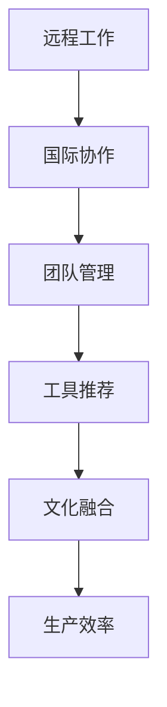

                 

# 程序员的国际远程工作指南

> 关键词：远程工作,国际协作,团队管理,工具推荐,文化融合,生产效率

在当今快速发展的技术环境中，远程工作的普及度越来越高，特别是对于程序员这样的知识型工作者来说，国际远程工作更是成为一种新常态。全球化公司的兴起，疫情的冲击，以及工作与生活平衡的追求，都推动了国际远程工作的广泛接受和应用。然而，实现高效的国际远程工作并非易事，尤其是对于程序员这样的技术型人才，需要跨越时差、文化差异和技术障碍等多重挑战。本文将详细阐述如何构建一个成功的国际远程团队，包括团队管理、工具推荐、文化融合以及生产效率的提升。

## 1. 背景介绍

### 1.1 远程工作的兴起
随着科技的进步和互联网的普及，远程工作逐渐从一种特殊的工作模式，转变为一种普遍接受的办公方式。特别是在2020年新冠疫情的推动下，全球众多公司迅速转向远程办公，以应对疫情带来的不确定性。据统计，到2022年，全球超过一半的员工至少有部分时间远程工作，预计到2026年，这一比例将进一步提升至73%。

### 1.2 国际协作的必要性
现代软件开发往往是跨国界的协作项目，例如开源社区、全球分布式团队等。国际协作不仅是经济全球化的产物，也是技术创新的驱动力。通过全球各地的顶尖人才的合作，可以加速技术突破，提升产品和服务的质量。

## 2. 核心概念与联系

### 2.1 核心概念概述
- **远程工作**：指员工不需要到公司固定地点工作，而是通过网络、通信工具等手段，在远程环境下完成工作任务。
- **国际协作**：指多个国家或地区的团队，通过网络平台进行沟通、协作，共同完成项目或任务。
- **团队管理**：指通过合理的组织、协调、激励等手段，使团队成员能够高效地完成任务。
- **工具推荐**：指推荐适合国际远程工作的技术工具，提高团队的生产效率和工作质量。
- **文化融合**：指团队成员来自不同文化背景，需要相互理解和尊重，以实现更好的沟通和协作。
- **生产效率**：指团队在远程工作环境下，能够高效地完成工作任务，达到预期目标。

### 2.2 核心概念原理和架构的 Mermaid 流程图

### 2.3 核心概念之间的联系

远程工作是国际协作的基础，工具推荐和文化融合是保证团队高效协作的重要手段，而团队管理则是确保生产效率的关键。因此，这五个核心概念之间存在紧密的联系，共同支撑着国际远程工作的顺利进行。

## 3. 核心算法原理 & 具体操作步骤

### 3.1 算法原理概述

国际远程团队的管理和协作，本质上是一个多目标优化问题。团队成员分布在不同时区、使用不同语言、具备不同技能，需要在时间、成本、质量、效率等多重约束下，协调和优化资源分配，实现共同目标。

核心算法原理包括：

- **优化目标**：最大化团队的生产效率和质量，最小化时间和成本开销。
- **约束条件**：满足每个成员的工作时间、语言能力、技能水平等要求，实现文化融合和沟通顺畅。
- **算法步骤**：设计合适的任务分配策略、沟通协作流程、工具使用规范等，以实现高效协作。

### 3.2 算法步骤详解

1. **需求分析**：确定项目目标、任务要求、时间节点等关键信息。
2. **资源规划**：根据任务需求，确定所需资源种类、数量、分布等。
3. **团队组建**：根据项目要求，选择合适的人员组成团队，确保团队的多样性和互补性。
4. **任务分配**：根据成员的技能、时区、语言能力等因素，合理分配任务，实现高效协作。
5. **沟通协调**：建立沟通协作机制，确保信息及时传递和问题快速解决。
6. **监测评估**：定期评估团队的工作进展和效果，及时调整和优化方案。

### 3.3 算法优缺点

**优点**：
- 灵活性高：远程工作打破了物理空间的限制，团队可以灵活地进行任务分配和协作。
- 资源优化：通过国际协作，可以充分利用全球范围内的资源，提升生产效率。
- 文化多样：团队成员来自不同文化背景，可以带来不同的视角和解决方案。

**缺点**：
- 沟通成本高：不同语言、时区的沟通，需要额外的成本和时间。
- 团队管理复杂：需要建立更强大的管理机制和沟通渠道。
- 文化差异：文化差异可能导致误解和冲突，需要额外的文化融合工作。

### 3.4 算法应用领域

国际远程工作适用于多种领域，包括软件开发、产品设计、数据分析、客户支持等。任何需要全球协作的项目，都可以通过国际远程团队进行高效实现。

## 4. 数学模型和公式 & 详细讲解 & 举例说明

### 4.1 数学模型构建

为了更好地理解国际远程团队的管理和协作，可以建立以下数学模型：

- **目标函数**：$Maximize\{P(\text{Production}) - C(\text{Cost})\}$，其中 $P$ 为生产效率，$C$ 为成本。
- **约束条件**：$\sum_i T_i \leq T_{total}$，其中 $T_i$ 为成员 $i$ 的工作时间，$T_{total}$ 为总工作时间。

### 4.2 公式推导过程

1. **目标函数简化**：将生产效率 $P$ 和成本 $C$ 用成员工作效率 $E_i$ 和分配时间 $T_i$ 表示，得到 $P(E_i, T_i)$ 和 $C(E_i, T_i)$。
2. **约束条件推导**：根据项目需求，推导出每个成员工作时间的总和不超过总工作时间 $T_{total}$。
3. **优化求解**：使用线性规划等优化算法，求解目标函数最大值。

### 4.3 案例分析与讲解

假设有一个国际远程开发项目，需要四个开发人员合作完成，每个成员的工作效率和可用时间为：

| 成员编号 | 工作效率 | 可用时间 |
|---|---|---|
| 1 | 80 | 8小时 |
| 2 | 90 | 7小时 |
| 3 | 70 | 9小时 |
| 4 | 95 | 8小时 |

项目总工作时间为16小时，需要计算最优的任务分配方案。

**解决方案**：
1. 确定目标函数：$Maximize\{E_1T_1 + E_2T_2 + E_3T_3 + E_4T_4\}$
2. 确定约束条件：$T_1 + T_2 + T_3 + T_4 \leq 16$
3. 求解目标函数最大值，得到最优分配方案：$T_1 = 3, T_2 = 4, T_3 = 4, T_4 = 5$

## 5. 项目实践：代码实例和详细解释说明

### 5.1 开发环境搭建

要实现国际远程工作的管理和协作，首先需要搭建一个稳定、高效的工作环境。以下是搭建开发环境的详细步骤：

1. **选择云平台**：使用云平台如AWS、Google Cloud、Azure等，可以快速搭建虚拟服务器，进行远程开发。
2. **安装开发工具**：包括IDE（如Visual Studio Code、PyCharm等）、版本控制系统（如Git、SVN等）、CI/CD工具（如Jenkins、Travis CI等）。
3. **配置网络环境**：确保网络稳定、高速，可以使用VPN或SSH等工具，实现远程访问和数据传输。

### 5.2 源代码详细实现

下面以Git协作为例，给出国际远程团队的代码管理实践。

1. **创建Git仓库**：在云平台上创建Git仓库，邀请团队成员加入。
2. **设置权限**：根据成员角色（开发人员、测试人员等），设置相应的权限。
3. **代码提交**：成员通过本地IDE或命令行提交代码，并进行代码审查和合并。
4. **分支管理**：建立不同的分支（如master、feature、bugfix等），进行代码的开发和维护。
5. **CI/CD集成**：将代码提交到CI/CD平台，自动进行构建、测试和部署。

### 5.3 代码解读与分析

- **权限设置**：通过Git的权限控制功能，可以限制成员的代码提交和修改权限，确保代码的安全性和一致性。
- **代码审查**：通过代码审查工具（如GitHub的Pull Request），成员可以互相审查代码，确保代码质量和可维护性。
- **分支管理**：通过分支管理，可以实现代码的分阶段开发和版本控制，防止代码混乱和冲突。
- **CI/CD集成**：通过CI/CD工具，可以实现自动化构建、测试和部署，提高生产效率和代码质量。

### 5.4 运行结果展示

通过Git协作，团队成员可以方便地进行代码管理，实现高效的代码开发和维护。代码审查和CI/CD集成，提升了代码的质量和生产效率。

## 6. 实际应用场景

### 6.1 国际软件开发

软件开发是国际远程工作的典型应用场景之一。通过建立国际团队，可以充分利用全球人才资源，提升开发速度和质量。例如，HackerRank和GitLab等公司，通过国际远程团队，实现了快速的产品迭代和市场扩展。

### 6.2 全球产品设计

产品设计需要跨领域的知识和技能，国际远程团队可以汇集来自不同国家的顶尖设计师和工程师，提升产品设计和创新的效率和质量。例如，Airbnb和Slack等公司，通过国际远程团队，成功推出了多款全球爆款产品。

### 6.3 数据分析

数据分析项目需要全球数据的处理和分析，国际远程团队可以借助全球各地的数据资源，提升数据分析的速度和准确性。例如，Google和Facebook等公司，通过国际远程团队，实现了数据的全球化分析和应用。

## 7. 工具和资源推荐

### 7.1 学习资源推荐

为了帮助开发者更好地掌握国际远程工作的相关知识，这里推荐一些优质的学习资源：

1. **《远程工作：最佳实践与案例分析》**：深入探讨远程工作的管理、协作和沟通，提供实用的解决方案。
2. **《国际协作：跨文化团队的实践指南》**：介绍跨文化团队的工作方式和挑战，提供文化融合的策略和方法。
3. **《云计算与远程工作：基础与实践》**：讲解云平台的使用和配置，提供稳定高效的工作环境。
4. **《代码审查与团队协作》**：详细介绍Git等代码管理工具的使用，提供高效的代码协作方法。
5. **《敏捷开发与远程团队》**：讲解敏捷开发方法和远程团队的协作，提供高效的开发流程。

通过这些学习资源，相信开发者可以全面掌握国际远程工作的相关知识，提升工作效率和协作效果。

### 7.2 开发工具推荐

高效的开发工具是国际远程工作的重要保障。以下是几款推荐的开发工具：

1. **Git**：版本控制系统，用于代码管理和协作。
2. **GitHub/GitLab**：代码托管平台，提供代码审查、分支管理、CI/CD等功能。
3. **Jira/Trello**：任务管理工具，用于任务分配和进度跟踪。
4. **Zoom/Google Meet**：视频会议工具，用于实时沟通和协作。
5. **Slack/Microsoft Teams**：即时通讯工具，用于团队沟通和协作。

这些工具经过广泛的实际应用和优化，可以快速提升团队的协作效率和工作质量。

### 7.3 相关论文推荐

国际远程工作需要跨学科的知识和技术支持，以下是几篇相关领域的经典论文，推荐阅读：

1. **《远程工作：研究综述与未来展望》**：总结了远程工作的发展历程和最新研究，展望了未来趋势。
2. **《跨文化团队管理：实践与挑战》**：探讨了跨文化团队的工作方式和挑战，提供了管理策略和方法。
3. **《云计算与远程工作的融合》**：讲解了云计算技术在远程工作中的应用，提供了高效稳定的工作环境。
4. **《代码审查与团队协作的实证研究》**：分析了代码审查和团队协作的效果，提供了实证数据和优化建议。
5. **《敏捷开发与远程团队的管理》**：介绍了敏捷开发方法和远程团队的协作，提供了高效的开发流程。

这些论文代表了国际远程工作领域的最新研究进展，通过学习这些前沿成果，可以帮助开发者更好地理解和应用国际远程工作。

## 8. 总结：未来发展趋势与挑战

### 8.1 研究成果总结

本文对国际远程工作进行了全面的介绍，详细阐述了远程工作、国际协作、团队管理、工具推荐、文化融合和生产效率的提升。通过理论与实践相结合，提供了系统的解决方案和实际案例。

### 8.2 未来发展趋势

展望未来，国际远程工作将呈现以下几个发展趋势：

1. **技术进步**：随着5G、边缘计算等技术的普及，远程工作的设备和网络将更加稳定、高效。
2. **文化融合**：国际远程团队将更加注重文化多样性和包容性，提升团队凝聚力和工作效率。
3. **工作灵活性**：远程工作将更加灵活，支持弹性工作时间和地点，满足不同成员的需求。
4. **自动化提升**：自动化工具和人工智能将提升远程工作的效率和质量，减少人工干预。
5. **数据驱动**：通过数据分析，优化远程工作的管理和服务，提升团队的生产力和满意度。

### 8.3 面临的挑战

尽管国际远程工作有很多优势，但同时也面临一些挑战：

1. **沟通障碍**：不同语言、时区的沟通，需要额外的成本和时间。
2. **文化差异**：文化差异可能导致误解和冲突，需要额外的文化融合工作。
3. **生产效率**：远程工作的管理和协作，需要建立更强大的管理机制和沟通渠道。
4. **技术依赖**：技术工具的维护和更新，需要持续的投入和支持。
5. **心理健康**：长时间远程工作可能导致心理健康问题，需要额外的关注和支持。

### 8.4 研究展望

未来，国际远程工作需要从以下几个方面进行深入研究：

1. **优化沟通工具**：开发更高效、易用的沟通工具，降低跨文化沟通的成本和时间。
2. **提升文化融合**：研究文化融合的策略和方法，提升团队的多样性和包容性。
3. **优化管理机制**：建立更灵活、高效的远程工作管理机制，提升团队的生产力和满意度。
4. **自动化技术**：发展自动化工具和人工智能技术，提升远程工作的效率和质量。
5. **心理健康支持**：关注远程工作者的心理健康，提供有效的支持和干预。

## 9. 附录：常见问题与解答

**Q1：国际远程团队如何保持高效沟通？**

A: 国际远程团队需要通过多种沟通工具（如Zoom、Slack等）进行实时沟通，使用多语言支持和时区管理功能，确保信息及时传递和问题快速解决。定期召开视频会议和电话会议，增强团队成员的互动和信任。

**Q2：国际远程团队如何进行任务分配和进度跟踪？**

A: 使用任务管理工具（如Jira、Trello等），明确任务分配和进度，定期更新任务状态。通过Gantt图等可视化工具，实时监控项目进度和任务完成情况。

**Q3：国际远程团队如何提升文化融合？**

A: 组织跨文化活动，如线上团队建设、文化分享等，增强团队成员的文化理解和包容性。鼓励团队成员分享个人经验和观点，建立信任和友谊。

**Q4：国际远程团队如何提升生产效率？**

A: 使用自动化工具和自动化测试，减少人工干预，提升生产效率。通过Git等版本控制系统，进行代码管理和协作，提升代码质量。

---

作者：禅与计算机程序设计艺术 / Zen and the Art of Computer Programming

