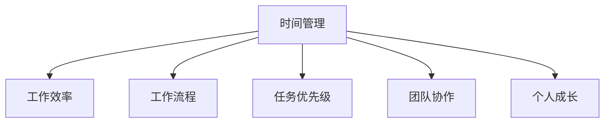

                 

# 程序员的时间管理：效率即财富

> 关键词：时间管理,效率提升,编程习惯,工作流程,项目规划,团队协作,个人成长,健康生活

## 1. 背景介绍

### 1.1 问题由来
在程序员的世界里，时间和效率是永恒的主题。程序员的工作往往与时间紧密相连，每个项目和任务都需要精确的时间管理。然而，面对复杂的代码、繁重的任务和不断的变更，许多程序员常常陷入时间管理上的困境，导致工作效率低下，项目进度滞后。

### 1.2 问题核心关键点
程序员的时间管理问题主要集中在以下几个方面：

- **任务繁多**：项目需求变化快，任务复杂多样，难以合理分配时间。
- **优先级不明**：不同任务的重要性往往难以判断，导致关键任务被忽视。
- **时间碎片化**：频繁的会议、中断和打断使时间难以集中。
- **工作疲劳**：长时间高强度工作导致疲劳，影响效率。
- **工具不足**：缺乏高效的工具和流程支持，导致时间浪费。

这些问题不仅影响个人的生产效率，还可能导致团队协作效率低下，甚至影响整个项目进度。因此，有效的时间管理对于程序员来说至关重要。

### 1.3 问题研究意义
有效的时间管理不仅能提高工作效率，还能提升工作满意度，促进个人成长和职业发展。通过对时间管理的深入研究，可以发现更科学、更合理的工作流程，提升项目完成质量，实现团队和个人双赢。

## 2. 核心概念与联系

### 2.1 核心概念概述

为了更好地理解程序员的时间管理，本节将介绍几个密切相关的核心概念：

- **时间管理**：通过规划和安排，合理利用时间，实现高效工作的过程。
- **工作效率**：在单位时间内完成的任务量和工作质量。
- **工作流程**：项目开发过程中的一系列有序活动和步骤。
- **任务优先级**：根据任务的重要性和紧急程度，对任务进行排序和分配。
- **团队协作**：团队成员之间通过有效的沟通和配合，实现目标一致、资源共享。
- **个人成长**：通过不断学习和实践，提升技能水平和职业素养。

这些概念之间的逻辑关系可以通过以下Mermaid流程图来展示：



这个流程图展示了大语言模型的核心概念及其之间的关系：

1. 时间管理是高效工作的基石，合理规划时间，才能提升工作效率。
2. 工作效率受工作流程、任务优先级、团队协作和个人成长等因素影响。
3. 通过优化各个环节，可以显著提升工作效率，实现更好的工作成果。

## 3. 核心算法原理 & 具体操作步骤
### 3.1 算法原理概述

程序员的时间管理是一种基于时间规划和任务优先级的算法过程。其核心思想是通过科学的方法，将工作任务和时间安排进行合理规划，使每项工作都能在合适的时间段内完成，从而实现高效工作。

时间管理算法主要包括以下几个步骤：

1. **任务清单**：列出所有需要完成的任务，明确任务内容和时间要求。
2. **优先级排序**：根据任务的重要性和紧急程度，对任务进行排序。
3. **时间分配**：根据任务的优先级和复杂度，分配合适的时间段。
4. **执行任务**：按照时间计划执行任务，定期检查进度。
5. **反馈调整**：根据实际执行情况，及时调整时间计划，优化工作流程。

### 3.2 算法步骤详解

以下是时间管理算法的详细步骤：

**Step 1: 任务清单**
- 列出所有需要完成的任务，包括项目需求、日常任务、个人学习等。
- 将任务分解为具体的子任务，便于管理和执行。

**Step 2: 优先级排序**
- 定义任务的优先级标准，如重要程度、截止时间、资源需求等。
- 使用工具如Eisenhower矩阵、Kanban看板等，帮助明确任务的优先级。

**Step 3: 时间分配**
- 根据任务优先级和复杂度，分配合适的时间段。
- 可以使用番茄工作法、时间块划分等方法，实现时间的高效利用。

**Step 4: 执行任务**
- 按照时间计划执行任务，定期检查进度和成果。
- 使用任务管理工具如Trello、Asana、Todoist等，记录任务进展和完成情况。

**Step 5: 反馈调整**
- 根据实际执行情况，及时调整时间计划，优化工作流程。
- 定期反思总结，记录成功经验和不足之处，不断改进。

### 3.3 算法优缺点

时间管理算法的优点包括：

- **提升效率**：通过科学规划，合理利用时间，提高工作效率。
- **降低压力**：清晰的任务规划和优先级排序，减少任务的积累和堆积。
- **提升质量**：明确的任务目标和优先级，确保关键任务优先完成。

其缺点主要包括：

- **复杂度较高**：任务繁多时，需要花费较多的时间和精力进行规划和调整。
- **灵活性不足**：一旦计划制定，改变起来较为困难，可能不适应突发情况。
- **依赖工具**：依赖于高效的工具和流程支持，工具使用不当会影响效果。

### 3.4 算法应用领域

时间管理算法不仅适用于个人开发者，也广泛应用于团队项目管理和日常工作中。以下是几个典型应用场景：

1. **个人开发者**：在独立开发项目或进行个人学习时，通过时间管理算法，可以有效规划时间和任务，提升项目完成速度和质量。
2. **团队项目**：在协作开发项目时，通过明确任务优先级和分配时间，实现高效协同，提升团队整体效率。
3. **日常工作**：在日常工作中，合理分配时间，处理各类琐碎事务，减少时间浪费，提高工作效率。

## 4. 数学模型和公式 & 详细讲解 & 举例说明

### 4.1 数学模型构建

时间管理算法可以通过数学模型来表示。设总任务数量为 $N$，任务时间为 $T$，时间管理目标为最大化任务完成度 $P$。则时间管理模型的目标函数为：

$$
\max P = \sum_{i=1}^N \frac{T_i}{T}
$$

其中 $T_i$ 为第 $i$ 个任务的实际执行时间。

约束条件包括：

1. 每个任务必须完成，即 $T_i \geq 0$。
2. 总任务时间不超过总时间，即 $\sum_{i=1}^N T_i \leq T$。

### 4.2 公式推导过程

在上述目标函数和约束条件下，我们可以使用线性规划算法求解最优解。设 $x_i$ 为第 $i$ 个任务的实际执行时间，则问题转化为：

$$
\max \sum_{i=1}^N x_i
$$

约束条件为：

$$
\begin{cases}
x_i \geq 0 & i=1,\cdots,N \\
\sum_{i=1}^N x_i \leq T \\
x_i \leq T_i & i=1,\cdots,N
\end{cases}
$$

使用单纯形法等线性规划算法，可以找到满足上述约束条件的最优解 $x_i^*$。则实际执行时间为：

$$
T_i^* = x_i^*
$$

### 4.3 案例分析与讲解

以一个简单的项目开发任务为例，假设项目包含三个任务 $A$、$B$、$C$，总时间为 $T=20$ 小时。任务 $A$ 需要 $T_A=10$ 小时，任务 $B$ 需要 $T_B=5$ 小时，任务 $C$ 需要 $T_C=5$ 小时。通过线性规划算法，可以求得最优解 $x_A=10$、$x_B=5$、$x_C=5$。则任务完成度为：

$$
P = \frac{10+5+5}{20} = 0.75
$$

这意味着在总时间 $T$ 内，任务 $A$、$B$、$C$ 的实际执行时间分别为 $10$、$5$、$5$ 小时，任务完成度为 $0.75$。

## 5. 项目实践：代码实例和详细解释说明
### 5.1 开发环境搭建

在进行时间管理算法实践前，我们需要准备好开发环境。以下是使用Python进行时间管理工具的开发环境配置流程：

1. 安装Anaconda：从官网下载并安装Anaconda，用于创建独立的Python环境。

2. 创建并激活虚拟环境：
```bash
conda create -n time-management python=3.8 
conda activate time-management
```

3. 安装必要的Python库：
```bash
pip install pandas matplotlib
```

完成上述步骤后，即可在`time-management`环境中开始时间管理工具的开发。

### 5.2 源代码详细实现

这里我们以Python编写一个简单的任务管理工具为例，实现任务清单、优先级排序、时间分配和执行任务的功能。

```python
from datetime import datetime, timedelta

class Task:
    def __init__(self, name, time, priority):
        self.name = name
        self.time = time
        self.priority = priority

class TaskManager:
    def __init__(self):
        self.tasks = []

    def add_task(self, task):
        self.tasks.append(task)

    def prioritize(self):
        self.tasks.sort(key=lambda x: x.priority, reverse=True)

    def allocate_time(self, total_time):
        time_allocated = 0
        for task in self.tasks:
            if time_allocated + task.time <= total_time:
                time_allocated += task.time
                task.time_allocation = time_allocated
            else:
                task.time_allocation = total_time - time_alloced
                break

    def execute_tasks(self, total_time):
        self.allocate_time(total_time)
        time_remaining = total_time
        for task in self.tasks:
            if time_remaining - task.time_allocation >= 0:
                time_remaining -= task.time_allocation
                task.time_spent = task.time_allocation
                print(f"Task {task.name} completed in {task.time_allocation} hours.")
            else:
                task.time_spent = time_remaining
                print(f"Task {task.name} completed in {task.time_spent} hours.")

# 示例代码使用
task_manager = TaskManager()
task_manager.add_task(Task("Task A", 10, 3))
task_manager.add_task(Task("Task B", 5, 1))
task_manager.add_task(Task("Task C", 5, 2))
task_manager.prioritize()
task_manager.allocate_time(20)
task_manager.execute_tasks(20)
```

在上述代码中，我们定义了两个类：`Task`表示任务，包含任务名称、时间和优先级；`TaskManager`表示任务管理工具，包括添加任务、优先级排序、时间分配和执行任务等方法。

### 5.3 代码解读与分析

让我们再详细解读一下关键代码的实现细节：

**Task类**：
- `__init__`方法：初始化任务名称、时间和优先级。

**TaskManager类**：
- `add_task`方法：添加任务到任务列表。
- `prioritize`方法：根据优先级排序任务列表。
- `allocate_time`方法：根据总时间分配任务执行时间。
- `execute_tasks`方法：执行任务，更新任务执行时间和剩余时间。

**示例代码**：
- 创建一个任务管理工具，添加三个任务，设置优先级。
- 调用优先级排序方法，对任务进行排序。
- 调用时间分配方法，为任务分配执行时间。
- 调用执行任务方法，更新任务执行状态。

通过这段示例代码，可以看出时间管理算法的实现过程，以及如何使用任务管理工具进行任务规划和执行。

## 6. 实际应用场景
### 6.1 软件开发项目

软件开发项目往往涉及多任务多人的协作，合理的时间管理能够显著提高项目效率。通过任务管理工具，可以将项目拆分为多个子任务，明确每个任务的优先级和执行时间，确保关键任务优先完成。

在实践中，可以将项目需求、任务分配、时间估算等详细记录在任务管理工具中，定期进行进度检查和调整。使用Gantt图表等工具可视化任务进度，有助于团队成员快速掌握项目状态，协同推进项目进展。

### 6.2 个人学习计划

个人学习计划通过时间管理算法，可以帮助开发者合理规划学习时间和任务，提升学习效率。将学习任务按优先级排序，每天分配固定时间段进行学习，逐步积累知识，提升专业技能。

在学习过程中，可以使用番茄工作法、Pomodoro技巧等，提高专注度和学习效率。通过定期复盘和总结，记录学习效果和不足之处，不断改进学习方法，提升学习成果。

### 6.3 日常工作管理

日常工作管理中，时间管理算法同样适用。将日常任务按照重要性和紧急程度进行排序，分配合适的时间段进行执行。合理利用碎片时间，提高工作效率，减少时间浪费。

在实践中，可以使用待办事项清单、To-Do List等工具，记录每日任务和优先级，定期进行回顾和总结，不断优化工作流程，提升工作效率。

## 7. 工具和资源推荐
### 7.1 学习资源推荐

为了帮助开发者系统掌握时间管理理论基础和实践技巧，这里推荐一些优质的学习资源：

1. **《深度工作：如何有效利用每一点脑力》**：Cal Newport著，探讨如何在繁忙环境中保持高效专注，实现深度工作。
2. **《番茄工作法图解》**：Francesco Cirillo著，介绍番茄工作法的时间管理技巧，提升工作效率。
3. **《精益创业》**：Eric Ries著，讨论如何通过精益方法实现创业项目的快速迭代和优化。
4. **《高效能人士的七个习惯》**：Stephen R. Covey著，提出七个高效习惯，帮助实现个人和职业成功。
5. **《项目管理的艺术》**：Ron Jeffries著，介绍敏捷项目管理的方法和技巧，提升项目管理效率。

通过对这些资源的学习实践，相信你一定能够掌握时间管理的精髓，提升工作效率和生活质量。

### 7.2 开发工具推荐

高效的时间管理离不开优秀的工具支持。以下是几款用于时间管理开发的常用工具：

1. **Trello**：支持任务管理、看板、时间轴等，帮助可视化任务进度和优先级。
2. **Asana**：支持任务分配、进度跟踪、日历视图等，适用于团队协作项目管理。
3. **Todoist**：支持任务清单、优先级、提醒等，适用于个人日常任务管理。
4. **Google Calendar**：支持时间安排、事件提醒、共享日历等，帮助管理时间。
5. **Notion**：支持任务管理、笔记、数据库等，功能强大且易于定制。

合理利用这些工具，可以显著提升时间管理的工作效率，实现任务和时间的灵活搭配。

### 7.3 相关论文推荐

时间管理技术的发展源于学界的持续研究。以下是几篇奠基性的相关论文，推荐阅读：

1. **《番茄工作法：改变我们工作方式的技术》**：Francesco Cirillo著，介绍番茄工作法的时间管理技巧，提升工作效率。
2. **《精益创业》**：Eric Ries著，探讨如何通过精益方法实现创业项目的快速迭代和优化。
3. **《高效能人士的七个习惯》**：Stephen R. Covey著，提出七个高效习惯，帮助实现个人和职业成功。
4. **《项目管理的关键》**：Ron Jeffries著，介绍敏捷项目管理的方法和技巧，提升项目管理效率。

这些论文代表了大语言模型微调技术的发展脉络。通过学习这些前沿成果，可以帮助研究者把握学科前进方向，激发更多的创新灵感。

## 8. 总结：未来发展趋势与挑战
### 8.1 总结

本文对程序员的时间管理方法进行了全面系统的介绍。首先阐述了时间管理的背景和意义，明确了时间管理在提升工作效率、减少工作压力、促进个人成长等方面的重要作用。其次，从原理到实践，详细讲解了时间管理的数学模型和关键步骤，给出了时间管理工具的代码实现。同时，本文还广泛探讨了时间管理方法在软件开发、个人学习、日常工作等场景中的应用，展示了时间管理的广阔前景。

通过本文的系统梳理，可以看到，时间管理在提升个人和团队工作效率方面具有重要价值。有效的时间管理不仅能提高工作效率，还能提升工作满意度，促进个人成长和职业发展。

### 8.2 未来发展趋势

展望未来，时间管理技术将呈现以下几个发展趋势：

1. **智能化时间管理**：结合人工智能技术，实现任务自动化安排和优先级动态调整，提升时间管理效率。
2. **个性化时间管理**：根据个人习惯和工作类型，定制化时间管理方案，提升用户体验和工作效果。
3. **跨平台时间管理**：整合多设备、多平台的时间管理工具，实现无缝同步和协作。
4. **虚拟助手支持**：通过虚拟助手进行任务提醒和进度跟踪，提升时间管理的自动化和智能化。
5. **健康管理集成**：将时间管理与健康管理结合，实现身体和心理的双重管理。

以上趋势凸显了时间管理技术的广阔前景。这些方向的探索发展，必将进一步提升时间管理的效果，实现更高的工作效率和生活质量。

### 8.3 面临的挑战

尽管时间管理技术已经取得了显著进展，但在迈向更加智能化、普适化应用的过程中，仍面临诸多挑战：

1. **数据隐私问题**：时间管理工具需要收集和分析个人数据，如何保护数据隐私是一个重要问题。
2. **用户习惯差异**：不同用户的时间管理需求和习惯各异，需要定制化方案满足多样化需求。
3. **技术依赖性**：时间管理工具依赖于软件和设备，设备故障或软件问题可能导致效率下降。
4. **人为干预不足**：自动化时间管理需要足够的人为干预和监督，否则容易出现误安排或误执行。
5. **多任务处理能力不足**：时间管理工具难以高效处理多任务，需要进一步优化算法和实现。

这些挑战需要从技术、产品和用户体验等多个维度进行优化和改进，才能确保时间管理工具的可靠性和有效性。

### 8.4 研究展望

面对时间管理面临的挑战，未来的研究需要在以下几个方面寻求新的突破：

1. **数据隐私保护**：引入区块链等技术，保护用户数据隐私，提升时间管理工具的可信度和安全性。
2. **个性化定制**：开发更加智能化的算法，根据用户习惯和工作类型，定制化时间管理方案。
3. **跨平台集成**：实现多设备、多平台的时间管理工具无缝同步和协作，提升用户体验。
4. **虚拟助手技术**：引入虚拟助手技术，提供智能提醒和进度跟踪，提升时间管理的自动化和智能化。
5. **健康管理集成**：将时间管理与健康管理结合，实现身体和心理的双重管理，提升用户整体健康水平。

这些研究方向将推动时间管理技术迈向更高的台阶，实现更高的工作效率和生活质量。面向未来，时间管理技术还需要与其他人工智能技术进行更深入的融合，如知识表示、因果推理、强化学习等，多路径协同发力，共同推动时间管理的进步。

## 9. 附录：常见问题与解答

**Q1：时间管理是否可以适用于所有类型的任务？**

A: 时间管理适用于大多数类型的任务，包括工作、学习、家务等。但需要根据任务的特点进行适当调整，如将任务分解为更小的子任务，明确任务的优先级等。

**Q2：时间管理是否需要固定的时间段？**

A: 时间管理并不一定要固定的时间段，可以根据任务的特点和自身的生物钟进行灵活调整。例如，有些人更适合在早晨高效工作，有些人则更适合在下午或晚上。

**Q3：如何应对突发事件？**

A: 突发事件往往无法提前预料，需要灵活调整时间安排。可以预留一些灵活时间，用于处理突发事件。同时，保持任务清单的动态更新，根据实际情况进行优先级调整。

**Q4：如何进行时间管理复盘？**

A: 时间管理复盘可以帮助总结经验教训，提升时间管理效果。可以通过记录日志、回顾进度、反思总结等方式进行时间管理复盘。定期回顾时间管理效果，找出不足之处并进行改进。

**Q5：如何提升时间管理技能？**

A: 提升时间管理技能需要持续学习和实践。可以通过阅读相关书籍、参加培训课程、使用时间管理工具等方式进行学习和实践。同时，不断总结经验教训，不断改进和优化时间管理方法。

总之，时间管理是程序员工作中不可或缺的一部分。通过科学合理的时间管理，可以提高工作效率，提升生活质量，实现个人和团队的共同成长。只有不断学习和优化，才能在快节奏的编程世界中游刃有余。

