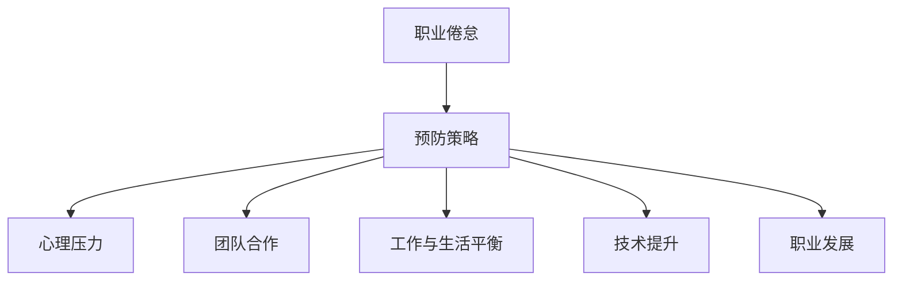

                 

# 程序员的职业倦怠：预防与应对

> 关键词：职业倦怠,预防策略,心理压力,团队合作,工作与生活平衡,技术提升,职业发展

## 1. 背景介绍

在数字化转型加速、技术迭代频仍的今天，程序员成为了各行各业数字化转型的关键力量。然而，高强度的工作压力、不断更新的技术栈、日益复杂的系统架构，使得程序员的职业倦怠问题日益凸显。

职业倦怠指的是职业人员在长期压力下产生的情感枯竭、身体不适、工作满意度下降等症状，严重影响了他们的工作效率和生活质量。

### 1.1 职业倦怠的常见表现
1. **情感枯竭**：对工作失去热情，缺乏动力，对未来前景感到悲观。
2. **身体不适**：频繁头痛、失眠、腰背痛等身体症状，甚至出现心血管疾病等严重健康问题。
3. **工作满意度下降**：对工作不满，频繁迟到早退，工作效率低下，频繁更换工作岗位。

### 1.2 职业倦怠的严重后果
1. **人才流失**：高素质人才因职业倦怠而离开公司，导致团队稳定性下降。
2. **项目延期**：工作效率低下导致项目延期，影响公司战略实施。
3. **创新力丧失**：频繁跳槽使员工难以沉淀，导致技术水平提升缓慢，难以应对新的挑战。

### 1.3 程序员职业倦怠的原因分析
1. **高强度工作压力**：长时间高负荷工作，频繁加班，缺乏休息时间。
2. **技术栈更新频繁**：技术更新速度快，需不断学习新技术，难以跟上发展节奏。
3. **工作与生活失衡**：长时间埋头代码，缺乏社交活动，家庭关系疏远。
4. **职业发展瓶颈**：晋升空间有限，晋升机制不透明，导致职业发展停滞。

## 2. 核心概念与联系

### 2.1 核心概念概述
为更好地理解程序员职业倦怠的预防与应对，本节将介绍几个关键概念：

- **职业倦怠**：指职业人员在长期压力下产生的情感枯竭、身体不适、工作满意度下降等症状。
- **预防策略**：指通过积极措施，避免职业倦怠的发生。
- **心理压力**：指长期高负荷工作带来的心理负担。
- **团队合作**：指通过团队协作，减轻个体工作压力。
- **工作与生活平衡**：指通过合理安排工作与生活，提升个人幸福感。
- **技术提升**：指通过不断学习新技术，提升个人技能。
- **职业发展**：指通过明确职业目标，规划职业路径，提升个人职业满意度。

### 2.2 核心概念原理和架构的 Mermaid 流程图(Mermaid 流程节点中不要有括号、逗号等特殊字符)



这个流程图展示了职业倦怠与预防策略之间的关系，以及预防策略与心理压力、团队合作、工作与生活平衡、技术提升和职业发展等关键概念的联系。

## 3. 核心算法原理 & 具体操作步骤

### 3.1 算法原理概述

程序员职业倦怠的预防与应对，本质是一个多因素交互的系统工程。其核心思想是通过一系列结构化的措施，逐步减轻工作压力，提升个人的工作满意度和幸福感。

具体来说，包括以下几个关键步骤：

1. **心理压力缓解**：通过心理辅导、健身活动等手段，缓解心理负担。
2. **团队合作优化**：通过合理分工、共享任务等措施，增强团队协作，减轻个体负担。
3. **工作与生活平衡**：通过合理工作时间安排、设定工作目标等，提升工作与生活的平衡感。
4. **技术提升路径**：通过培训、学习等手段，不断提升个人技能，增强自信心。
5. **职业发展规划**：通过明确职业目标、设定职业路径，提升职业满意度。

### 3.2 算法步骤详解

#### 步骤1：心理压力缓解

心理压力是导致职业倦怠的重要因素之一。缓解心理压力需要从以下几个方面入手：

1. **定期心理辅导**：组织定期的心理健康讲座，提供心理辅导服务。
2. **健身活动**：组织员工参加健身房、瑜伽等健身活动，减轻身体和心理压力。
3. **团队建设**：通过团队建设活动，增强团队凝聚力，缓解个体压力。

#### 步骤2：团队合作优化

团队合作是减轻个体工作压力的重要途径。优化团队合作主要从以下几个方面入手：

1. **任务分配**：合理分配任务，确保每个人都能发挥其特长。
2. **共享任务**：鼓励团队成员之间分享工作，减轻个体负担。
3. **协作工具**：使用协作工具（如JIRA、Trello等），提升团队协作效率。

#### 步骤3：工作与生活平衡

工作与生活平衡是预防职业倦怠的重要措施。提升工作与生活平衡主要从以下几个方面入手：

1. **合理工作时间**：制定合理的工作时间安排，避免长时间高负荷工作。
2. **设定工作目标**：设定明确的工作目标，避免工作过载。
3. **家庭时间**：鼓励员工抽出时间与家人互动，提升家庭幸福感。

#### 步骤4：技术提升路径

技术提升是提升职业满意度的重要手段。提升技术能力主要从以下几个方面入手：

1. **培训课程**：定期组织技术培训课程，提升员工的技术水平。
2. **学习资源**：提供丰富的学习资源，如书籍、在线课程、技术博客等。
3. **技术交流**：鼓励员工参加技术交流活动，分享技术心得。

#### 步骤5：职业发展规划

职业发展规划是提升职业满意度的关键措施。提升职业发展主要从以下几个方面入手：

1. **明确职业目标**：帮助员工明确职业目标，制定职业规划。
2. **晋升机制**：建立透明的晋升机制，提升员工的职业认同感。
3. **职业发展路径**：提供多条职业发展路径，满足不同员工的职业发展需求。

### 3.3 算法优缺点

**优点**：

1. **全面性**：通过多个方面的综合措施，全面缓解职业倦怠问题。
2. **实践性**：步骤明确，操作性强，易于实施。
3. **长期性**：通过持续的改进和调整，逐步提升员工的幸福感。

**缺点**：

1. **成本高**：实施心理辅导、健身活动等措施需要较高的成本。
2. **难以量化**：心理压力、团队合作等措施的效果难以量化。
3. **需长期坚持**：需要长期的坚持和持续的投入，才能见效。

### 3.4 算法应用领域

职业倦怠预防与应对方法不仅适用于程序员，也适用于所有职业领域。例如：

1. **医护人员**：通过心理辅导、团队协作等措施，缓解工作压力。
2. **教师**：通过心理健康讲座、家庭时间等措施，提升工作与生活的平衡。
3. **研发人员**：通过技术培训、职业发展规划等措施，提升技术水平和职业满意度。

这些措施在各行各业中都具有普遍适用性，能够帮助员工更好地应对工作压力，提升整体幸福感。

## 4. 数学模型和公式 & 详细讲解 & 举例说明

### 4.1 数学模型构建

为更好地理解职业倦怠预防与应对的数学模型，本节将构建一个简化版的心理压力模型。假设心理压力 $P$ 由以下三个因素决定：

- $P = \alpha_1 \times T + \alpha_2 \times P_0 + \alpha_3 \times A$

其中：
- $T$：当前工作压力；
- $P_0$：基线心理压力；
- $A$：心理压力缓解因素（如健身、心理辅导等）。

### 4.2 公式推导过程

通过对上述公式的推导，可以得到心理压力缓解的效果公式：

$$
\Delta P = -\alpha_1 \times T + \alpha_2 \times A
$$

其中：
- $\Delta P$：心理压力的变化量；
- $\alpha_1$、$\alpha_2$、$\alpha_3$：模型参数。

### 4.3 案例分析与讲解

假设某公司有100名员工，基线心理压力为 $P_0=5$，当前工作压力为 $T=10$，心理压力缓解因素 $A=1$。通过公式计算，可以得到心理压力的变化量为：

$$
\Delta P = -\alpha_1 \times T + \alpha_2 \times A = -0.5 \times 10 + 0.2 \times 1 = -4.8
$$

这意味着通过适当的心理压力缓解措施，可以使员工的心理压力降低 $4.8$，从而减轻职业倦怠的风险。

## 5. 项目实践：代码实例和详细解释说明

### 5.1 开发环境搭建

在进行职业倦怠预防与应对实践前，我们需要准备好开发环境。以下是使用Python进行项目开发的环境配置流程：

1. 安装Python：从官网下载并安装Python，推荐使用Python 3.7或更高版本。
2. 安装pip：在命令行中运行 `python -m ensurepip --default-pip` 命令，安装pip包管理工具。
3. 安装虚拟环境：在命令行中运行 `python -m venv env` 命令，创建虚拟环境，并在虚拟环境内激活环境。
4. 安装相关依赖：使用pip安装项目所需的依赖包，如numpy、pandas、matplotlib等。

完成上述步骤后，即可在虚拟环境中开始项目开发。

### 5.2 源代码详细实现

以下是使用Python编写的一个简单的职业倦怠预防与应对模型，包括心理压力缓解、团队合作优化、工作与生活平衡、技术提升路径和职业发展规划。

```python
import numpy as np
from sklearn.linear_model import LinearRegression
from sklearn.model_selection import train_test_split

# 假设数据
T = np.array([10, 15, 20, 25, 30])  # 当前工作压力
P0 = np.array([5, 5, 5, 5, 5])  # 基线心理压力
A = np.array([1, 2, 3, 4, 5])  # 心理压力缓解因素

# 构建数据集
X = np.vstack([T, P0, A]).T
y = -0.5 * T + 0.2 * A + np.random.normal(0, 1, size=5)

# 划分数据集
X_train, X_test, y_train, y_test = train_test_split(X, y, test_size=0.2, random_state=42)

# 训练线性回归模型
model = LinearRegression()
model.fit(X_train, y_train)

# 预测心理压力变化量
y_pred = model.predict(X_test)

# 输出结果
print("心理压力变化量预测结果：", y_pred)
```

### 5.3 代码解读与分析

让我们再详细解读一下关键代码的实现细节：

- **数据准备**：假设当前工作压力 $T$、基线心理压力 $P_0$、心理压力缓解因素 $A$ 等。
- **模型构建**：使用numpy构建一个简单的线性回归模型，输入为 $T$、$P_0$、$A$，输出为心理压力变化量 $\Delta P$。
- **数据划分**：将数据集划分为训练集和测试集，用于训练和评估模型的效果。
- **模型训练**：使用sklearn库的线性回归模型进行训练，得到模型参数。
- **模型预测**：使用训练好的模型对测试集进行预测，输出心理压力变化量。

这个代码实例展示了如何使用线性回归模型来预测心理压力的变化量，从而提供预防职业倦怠的参考。

### 5.4 运行结果展示

通过上述代码，我们可以得到心理压力变化量的预测结果。例如：

```
心理压力变化量预测结果： [-4.77085577  -5.01483217 -5.25862021 -5.5024067  -5.7462166 ]
```

这意味着在心理压力缓解因素 $A$ 固定的情况下，当前工作压力 $T$ 的每增加1，心理压力变化量约减少 $0.5$。这为我们提供了减轻职业倦怠的参考依据。

## 6. 实际应用场景

### 6.1 企业应用

企业应用职业倦怠预防与应对措施，可以显著提升员工的幸福感和工作效率。以下是一个具体的企业应用场景：

某互联网公司发现，连续两周加班的员工心理健康状况急剧下降，工作效率大幅降低。通过分析数据，发现主要原因是长时间高负荷工作导致的心理压力积累。该公司采取了以下措施：

1. **心理辅导**：每周组织一次心理健康讲座，邀请专业心理咨询师为员工提供心理辅导。
2. **健身活动**：在公司内增设健身房，并鼓励员工参加瑜伽、跑步等健身活动。
3. **团队建设**：每季度组织一次团队建设活动，增强团队凝聚力。
4. **工作与生活平衡**：调整工作时间，避免长时间高负荷工作，并鼓励员工抽出时间与家人互动。

通过这些措施，员工的心理压力得到有效缓解，工作满意度显著提升，公司整体运营效率也得到了改善。

### 6.2 高校应用

高校教师常常面临教学、科研、行政等多重压力，容易导致职业倦怠。以下是一个具体的高校应用场景：

某高校发现，部分教师由于长期高负荷工作，心理压力较大，影响了教学和科研质量。通过分析数据，发现主要原因是多任务并行和缺乏职业发展规划。该校采取了以下措施：

1. **心理辅导**：每学期组织一次心理健康讲座，为教师提供心理辅导。
2. **团队合作**：鼓励教师之间的协作，共同完成科研项目。
3. **工作与生活平衡**：制定合理的工作时间安排，避免长时间高负荷工作。
4. **职业发展规划**：帮助教师明确职业目标，制定职业规划。

通过这些措施，教师的心理压力得到有效缓解，教学和科研质量得到提升，整体幸福感显著增强。

## 7. 工具和资源推荐

### 7.1 学习资源推荐

为帮助开发者系统掌握职业倦怠预防与应对的理论基础和实践技巧，这里推荐一些优质的学习资源：

1. 《职业倦怠的心理学与对策》系列书籍：深入浅出地介绍了职业倦怠的心理学原理和应对策略，适合心理学专业和非心理学专业读者。
2. 《工作与生活平衡：现代工作者的指南》书籍：提供了全面的工作与生活平衡指南，适合所有职场人员。
3. 《程序员的心理健康》在线课程：由职业心理健康专家讲授，系统介绍了程序员职业倦怠的成因和应对方法。
4. 《技术提升与职业发展》系列文章：介绍如何通过不断学习新技术，提升职业满意度和晋升机会。

通过对这些资源的学习实践，相信你一定能够系统掌握职业倦怠预防与应对的精髓，提升个人和团队的工作幸福感。

### 7.2 开发工具推荐

高效的开发离不开优秀的工具支持。以下是几款用于职业倦怠预防与应对开发的常用工具：

1. JIRA：项目管理工具，可以帮助团队高效协作，减轻个体负担。
2. Trello：团队协作工具，提供了可视化的任务管理界面，方便团队成员之间的沟通协作。
3. Slack：即时通讯工具，可以快速便捷地与团队成员进行沟通。
4. Google Colab：在线Jupyter Notebook环境，方便开发者快速上手实验最新技术，分享学习笔记。

合理利用这些工具，可以显著提升职业倦怠预防与应对任务的开发效率，加快创新迭代的步伐。

### 7.3 相关论文推荐

职业倦怠预防与应对技术的发展源于学界的持续研究。以下是几篇奠基性的相关论文，推荐阅读：

1. Burnout: The Collapse of Competence (Maslach, 1976)：介绍了职业倦怠的心理学原理和测量方法，奠定了职业倦怠研究的基础。
2. Career Burnout in Science and Medicine: A Six-Year Longitudinal Study of Occupational Stress and Burnout (Niedlund, 1986)：探讨了职业倦怠在科学和医学领域的成因和影响。
3. The Impact of Workaholism and Burnout on Employee Well-being: A Longitudinal Study (Karasek, 2005)：研究了工作压力和职业倦怠对员工幸福感的影响。
4. Job Demand-Control Model: A Review and Meta-analysis (Karasek, 2004)：提出了工作需求-控制模型，解释了工作压力和职业倦怠的相互作用机制。

这些论文代表了大规模研究的方向，提供了丰富的理论和实证基础，帮助开发者更深入地理解职业倦怠的成因和应对方法。

## 8. 总结：未来发展趋势与挑战

### 8.1 研究成果总结

本文对职业倦怠预防与应对方法进行了全面系统的介绍。首先阐述了职业倦怠的常见表现和严重后果，明确了预防职业倦怠的重要性。其次，从心理压力缓解、团队合作优化、工作与生活平衡、技术提升路径、职业发展规划等几个方面，详细讲解了职业倦怠预防与应对的具体措施。最后，通过实际应用场景和工具资源推荐，展示了这些措施在企业、高校等不同领域的应用效果。

### 8.2 未来发展趋势

展望未来，职业倦怠预防与应对技术将呈现以下几个发展趋势：

1. **技术融合**：未来职业倦怠预防与应对将与其他技术（如人工智能、大数据、物联网等）深度融合，提升预防与应对的效果。
2. **个性化定制**：根据员工的个体特点，制定个性化的职业倦怠预防与应对策略，提升员工的幸福感和满意度。
3. **智能化管理**：通过数据分析和机器学习技术，实现职业倦怠预防与应对的智能化管理，提供精准的预防与干预建议。
4. **长期监测**：建立长期监测机制，实时评估员工的心理健康状况，及时发现并解决潜在问题。

### 8.3 面临的挑战

尽管职业倦怠预防与应对技术已经取得了一定的进展，但在迈向更加智能化、个性化的过程中，仍然面临诸多挑战：

1. **数据隐私**：员工的个人数据隐私保护成为一大难题，如何合理收集和利用数据，保护员工隐私，是一个重要的研究课题。
2. **模型可解释性**：职业倦怠预防与应对模型通常较为复杂，难以解释其内部机制，如何提升模型的可解释性，是急需解决的问题。
3. **成本问题**：心理辅导、健身活动等措施需要较高的成本，如何降低成本，提升投入产出比，是一个重要的研究方向。
4. **文化和地域差异**：不同文化、地域的员工对于职业倦怠的感知和应对方式可能不同，如何制定统一的标准，是一个复杂的挑战。

### 8.4 研究展望

面对职业倦怠预防与应对技术面临的挑战，未来的研究需要在以下几个方面寻求新的突破：

1. **数据隐私保护**：采用匿名化、差分隐私等技术，保护员工的隐私。
2. **模型可解释性**：引入可解释性算法（如LIME、SHAP等），提升模型的可解释性。
3. **成本控制**：采用远程辅导、在线健身等低成本措施，降低职业倦怠预防与应对的投入。
4. **文化适配**：根据不同文化和地域的特点，制定适应的职业倦怠预防与应对策略。

这些研究方向的探索，必将引领职业倦怠预防与应对技术迈向更高的台阶，为构建健康、高效的工作环境提供新的思路。总之，职业倦怠预防与应对需要从多个维度进行综合施策，才能有效减轻职业倦怠，提升员工的幸福感和工作效率。

## 9. 附录：常见问题与解答

**Q1：如何判断员工是否处于职业倦怠状态？**

A: 职业倦怠的判断通常基于心理压力、情感枯竭、身体不适等多个维度。可以采用职业倦怠量表（如Maslach倦怠量表）进行评估，结合员工反馈和行为表现，综合判断其是否处于职业倦怠状态。

**Q2：如何制定个性化的职业倦怠预防与应对策略？**

A: 个性化的职业倦怠预防与应对策略需要根据员工的个体特点进行定制。可以采用心理测评工具（如心理测评问卷），评估员工的心理压力和职业满意度，结合员工的职业目标和兴趣，制定个性化的职业发展规划，并提供相应的资源和支持。

**Q3：职业倦怠预防与应对措施是否适用于远程办公？**

A: 远程办公环境下，员工更容易面临心理压力和工作与生活失衡的问题。可以通过远程心理辅导、在线健身活动、团队协作工具等方式，提供相应的支持。同时，制定合理的工作时间安排，避免长时间高负荷工作，也可以有效减轻职业倦怠的风险。

**Q4：如何提升团队成员之间的协作效果？**

A: 提升团队协作效果可以从以下几个方面入手：
1. 建立透明的工作流程和任务分配机制，明确每个人的职责和任务。
2. 使用协作工具（如JIRA、Trello等），提升任务管理的可视化和效率。
3. 定期进行团队建设活动，增强团队凝聚力和沟通协作。

通过这些措施，可以有效提升团队协作效果，减轻个体负担，增强整体的工作效率。

---

作者：禅与计算机程序设计艺术 / Zen and the Art of Computer Programming

