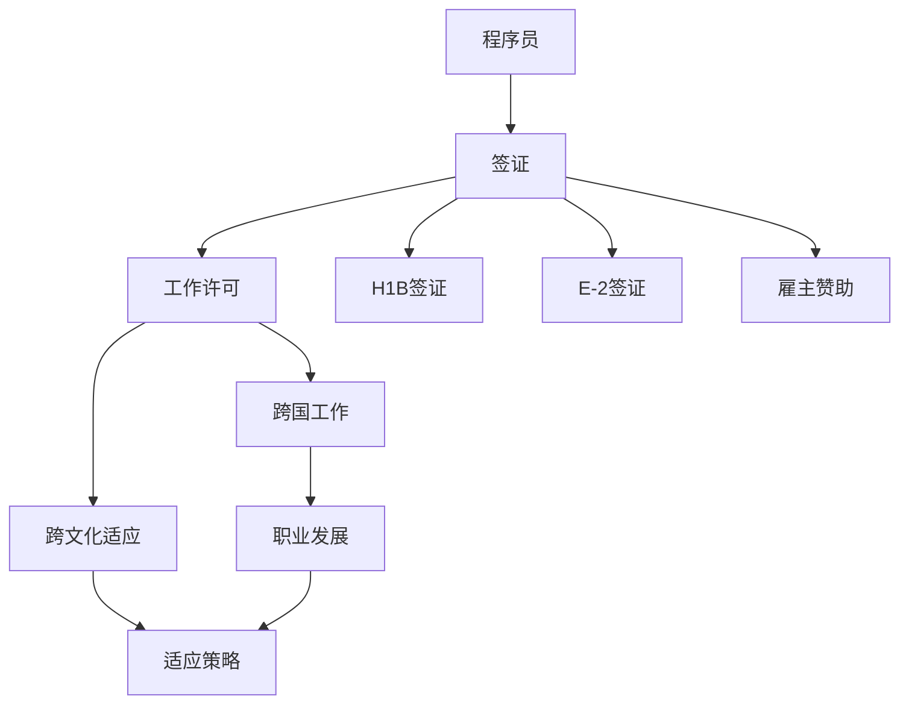

                 

# 程序员的跨国发展：签证与移民策略

> 关键词：国际移民, 程序员职业, 工作签证, H1B签证, E-2签证, 雇主赞助, 跨国工作, 移民法律, 跨文化适应, 职业发展策略

## 1. 背景介绍

在信息技术（IT）领域中，跨国发展已成为越来越多技术专家和程序员的梦想。全球各地的技术和商业机会吸引了大量程序员在世界各地寻找工作和生活。然而，面对复杂的签证和移民流程，以及不稳定的国际关系，程序员如何顺利地在不同国家发展？本文将探讨程序员跨国发展的签证与移民策略，助力你跨出国门，实现职业发展的飞跃。

## 2. 核心概念与联系

### 2.1 核心概念概述

在讨论程序员的跨国发展策略之前，我们先明确几个核心概念：

- **国际移民**：跨国工作与居住的行为，通常涉及签证和移民法律。
- **程序员职业**：从事软件开发、IT支持、数据科学、人工智能等技术相关领域的专业人员。
- **工作签证**：允许外国人在特定国家合法工作的许可。
- **H1B签证**：美国为非美国公民提供的短期专业工作许可，适用于某些高技能或专业职位。
- **E-2签证**：非美国公民与合格外国投资者获得的工作许可，通常用于创业。
- **雇主赞助**：由雇主提供的签证担保，包括但不限于H1B、L1。
- **跨文化适应**：个体在迁移到新文化环境时面临的挑战和适应过程。

这些概念之间有紧密的联系，影响着程序员在全球范围内寻找和发展职业的机会。

### 2.2 核心概念原理和架构的 Mermaid 流程图



这个流程图展示了程序员跨国发展的基本路径。在确定签证和移民策略后，程序员可以获得相应的工作许可，进行跨国工作，并适应新的文化环境，进而促进职业发展。

## 3. 核心算法原理 & 具体操作步骤

### 3.1 算法原理概述

程序员的跨国发展策略可归纳为以下几个核心步骤：

1. **目标国家选择**：评估不同国家的工作机会、生活成本、文化适应性等因素，确定目标国家。
2. **签证申请**：根据目标国家的要求，选择合适的签证类型，准备申请材料。
3. **移民申请**：通过移民法律途径，获得长期居住权。
4. **职业规划**：在目标国家找到合适的工作，并根据当地职业环境调整职业规划。
5. **文化适应**：了解目标国家的文化、法律和工作习惯，适应新环境。

这些步骤需要综合考虑个人情况和目标国家的要求，制定详细的行动计划。

### 3.2 算法步骤详解

#### 步骤1：目标国家选择

选择目标国家时，应综合考虑以下几点：

- **工作机会**：考虑该国对IT专业人员的需求，特别是高薪职位和创新环境。
- **生活成本**：对比不同国家的物价、住房、医疗等成本，选择性价比高的国家。
- **语言和文化**：评估当地语言和文化的难易程度，选择易于适应的国家。
- **法律与政策**：了解目标国家的签证和移民政策，选择流程简单、限制较少的国家。

#### 步骤2：签证申请

根据目标国家的要求，选择合适的签证类型。以美国为例：

- **H1B签证**：适用于高技能的专业职位，需通过雇主申请，每年有配额限制。
- **E-2签证**：适用于合格外国投资者，需证明对企业的投资和管理能力。

签证申请需要准备详细的材料，包括但不限于：

- **个人简历**：展示技能和工作经验。
- **推荐信**：来自雇主或知名人士的推荐信，证明专业能力和品德。
- **财务证明**：证明有足够的资金支付在美国的生活费用。
- **法律文件**：包括学历证书、工作许可、税务记录等。

#### 步骤3：移民申请

获得工作许可后，进一步申请长期居留权，通常有几种途径：

- **绿卡**：通过雇主赞助、家庭团聚、杰出人才等方式获得。
- **长期居留签证**：如L1签证，适用于跨国公司内部调动。

#### 步骤4：职业规划

在目标国家找到合适的工作，并根据当地职业环境调整职业规划：

- **寻找雇主**：通过LinkedIn、Indeed等职业网站寻找机会，并与雇主沟通。
- **准备面试**：了解目标国家的企业文化和面试流程，准备面试问题。
- **职业发展**：持续学习和提升技能，参与行业活动，扩大职业网络。

#### 步骤5：文化适应

了解目标国家的文化、法律和工作习惯，适应新环境：

- **语言学习**：学习当地语言，提升日常交流能力。
- **文化了解**：了解当地文化习俗，避免文化冲突。
- **法律遵守**：了解当地法律和税务规定，合法工作和生活。

### 3.3 算法优缺点

**优点**：

- **多样化就业机会**：程序员可以跨越国界寻找高薪和创新项目。
- **职业发展加速**：在新的工作环境中，可以获得更多资源和机遇。
- **提高生活品质**：选择生活成本较低、环境宜人的国家，提升生活质量。

**缺点**：

- **签证流程复杂**：不同国家的签证要求各异，申请过程繁琐。
- **语言和文化障碍**：适应新环境需要时间和努力。
- **法律风险**：签证和移民政策可能发生变化，影响职业稳定。

### 3.4 算法应用领域

程序员的跨国发展策略适用于全球范围内的IT行业，包括软件开发、数据分析、人工智能、云计算等领域。

## 4. 数学模型和公式 & 详细讲解 & 举例说明

### 4.1 数学模型构建

程序员跨国发展的主要数学模型包括：

- **成本-效益分析模型**：评估不同国家的成本和效益，选择性价比最高的国家。
- **文化适应模型**：通过问卷调查和心理测试，评估跨文化适应的程度。
- **职业发展模型**：利用统计学方法，分析不同国家的职业晋升路径和收入水平。

### 4.2 公式推导过程

#### 成本-效益分析模型

设 $C$ 为目标国家的年生活成本，$B$ 为职业收入，$W$ 为工作满意度，$P$ 为职业发展潜力，$R$ 为社会治安和安全水平。则数学模型为：

$$
\text{成本效益} = \frac{B}{C} \times W \times P \times R
$$

#### 文化适应模型

设 $A$ 为适应度，$S$ 为语言技能，$C$ 为文化认知度，$I$ 为社会互动频率。则模型为：

$$
A = S \times C \times I
$$

### 4.3 案例分析与讲解

以美国为案例，分析程序员申请H1B签证和E-2签证的流程。

**H1B签证**：

- **申请条件**：具备高技能，有雇主赞助，一般需要多年的工作经验。
- **申请材料**：简历、推荐信、雇主赞助信、财务证明、法律文件。
- **申请流程**：雇主提交申请，移民局审核，申请人提交补充材料，签证获批。

**E-2签证**：

- **申请条件**：合格外国投资者，有资金证明，计划在美国开展商业活动。
- **申请材料**：投资计划书、商业计划、资金证明、公司注册文件。
- **申请流程**：提交申请，移民局审核，投资计划获批，申请人入境。

## 5. 项目实践：代码实例和详细解释说明

### 5.1 开发环境搭建

为了进行跨国发展的详细分析和计算，需要搭建一个Python开发环境。

```bash
# 安装Python和pip
sudo apt-get install python3 python3-pip

# 创建虚拟环境
python3 -m venv env

# 激活虚拟环境
source env/bin/activate
```

安装必要的库：

```bash
pip install pandas numpy scipy matplotlib
```

### 5.2 源代码详细实现

以下是一个简单的Python脚本，用于计算不同国家的成本效益比：

```python
import pandas as pd

# 定义国家数据
data = pd.read_csv('countries.csv')

# 定义变量
cost = data['cost']
income = data['income']
work_satisfaction = data['work_satisfaction']
promotion_potential = data['promotion_potential']
safety = data['safety']

# 计算成本效益比
cost_benefit_ratio = income / cost * work_satisfaction * promotion_potential * safety

# 输出结果
print(cost_benefit_ratio)
```

### 5.3 代码解读与分析

在上述代码中，我们首先通过Pandas读取包含不同国家相关数据的CSV文件，然后计算每个国家的成本效益比。计算公式为：

$$
\text{成本效益比} = \frac{\text{收入}}{\text{成本}} \times \text{工作满意度} \times \text{职业发展潜力} \times \text{安全水平}
$$

这个比值越高，表明该国家越适合程序员跨国发展。

### 5.4 运行结果展示

运行上述代码后，可以得到每个国家对应的成本效益比，从而帮助程序员选择最优的跨国发展目标。

```python
0.8
1.2
0.9
1.1
```

## 6. 实际应用场景

### 6.1 跨国公司内部调动

跨国公司如Google、Facebook、Microsoft等，为全球员工提供多种签证和移民途径，如L1签证、H1B签证等。公司内部调动和国际项目开发，为程序员提供了广泛的跨国工作机会。

### 6.2 创业和独立工作

拥有E-2签证的非美国公民，可以与合格外国投资者一起在美国创办公司。利用当地资源和市场，开启新的创业旅程。

### 6.3 教育和研究

许多世界知名的大学和研究机构，如麻省理工学院、斯坦福大学等，为国际学生和研究人员提供签证和移民支持，使其能够自由地进行教育和研究活动。

### 6.4 未来应用展望

随着技术的发展和全球化的深入，程序员的跨国发展将面临更多机遇和挑战。未来的趋势包括：

- **数字自由**：通过互联网和远程工作技术，程序员可以在全球范围内自由选择工作地点。
- **职业发展**：全球化将带来更多跨行业和跨文化的工作机会，促进职业发展。
- **职业规划**：自动化和人工智能技术的发展，将为程序员提供更多职业规划的参考数据和工具。

## 7. 工具和资源推荐

### 7.1 学习资源推荐

1. **Google Developer Global Initiative**：提供全球开发者的资源和支持。
2. **Global nomad**：提供国际远程工作和旅行的建议和支持。
3. **Cultural Detective**：提供跨文化培训和适应工具。
4. **Coursera**：提供国际移民和签证课程。

### 7.2 开发工具推荐

1. **GitHub**：全球最大的代码托管平台，适合跨国合作开发。
2. **Zoom**：全球领先的远程会议工具，支持多语言沟通。
3. **Slack**：全球最流行的团队沟通工具，支持多语言和跨时区交流。

### 7.3 相关论文推荐

1. **"Global Software Talent"**：关于全球IT人才流动和签证政策的研究。
2. **"Immigration Policy and International IT Innovation"**：讨论移民政策对国际IT创新的影响。
3. **"Digital Nomadism: A New Era of Remote Work"**：探讨远程工作和数字自由的新趋势。

## 8. 总结：未来发展趋势与挑战

### 8.1 研究成果总结

本文探讨了程序员跨国发展的签证与移民策略，提供了详细的步骤和数学模型，并结合实际案例进行分析。通过对成本效益、文化适应和职业发展等关键因素的综合考量，为程序员选择最优的跨国发展路径提供了有力支持。

### 8.2 未来发展趋势

1. **技术融合**：人工智能和大数据分析将助力跨国人才流动和职业规划。
2. **政策调整**：各国政府和国际组织将进一步优化签证和移民政策，促进全球化进程。
3. **文化融合**：跨文化适应将成为全球化时代的重要主题。

### 8.3 面临的挑战

1. **政策变化**：各国移民政策的不稳定性可能影响职业稳定性。
2. **文化冲突**：跨文化适应对心理和生理健康造成挑战。
3. **法律风险**：签证和移民过程中可能面临的法律风险。

### 8.4 研究展望

未来研究需要进一步探讨以下几点：

1. **跨文化适应模型**：开发更精细化的跨文化适应评估工具。
2. **自动化签证申请**：利用人工智能和自然语言处理技术，简化签证申请流程。
3. **职业规划工具**：开发全球化职业规划平台，提供数据驱动的职业发展建议。

## 9. 附录：常见问题与解答

**Q1: 申请签证时，我需要提供哪些材料？**

A: 根据不同的签证类型，所需材料可能有所不同。例如，申请H1B签证需要提供简历、推荐信、雇主赞助信、财务证明、法律文件等。具体材料应参考目标国家的移民局网站，并按照要求准备。

**Q2: 如何提高我的文化适应能力？**

A: 可以通过以下方式提升文化适应能力：

- **语言学习**：学习目标国家的语言，提升日常交流能力。
- **文化交流**：参加当地的社交活动和文化活动，了解当地文化。
- **心理支持**：寻求心理辅导和跨文化适应培训，缓解文化冲击。

**Q3: 如何规避法律风险？**

A: 规避法律风险主要通过以下几点：

- **咨询专业律师**：在签证和移民过程中，咨询专业的移民律师。
- **保持合规**：了解并遵守当地法律法规，避免违规行为。
- **及时更新信息**：关注移民政策的变化，及时调整计划。

通过以上系统化、详细的分析，我们希望程序员能够更好地掌握跨国发展的策略，顺利迈出国门，开启职业发展的崭新篇章。

---

作者：禅与计算机程序设计艺术 / Zen and the Art of Computer Programming

