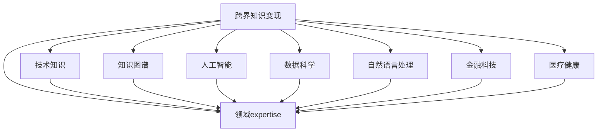

                 

# 程序员的跨界知识变现：技术+领域expertise

> 关键词：跨界知识变现, 技术, 领域expertise, 知识图谱, 人工智能, 数据科学, 自然语言处理, 金融科技, 医疗健康

## 1. 背景介绍

### 1.1 问题由来

在过去十几年中，计算机科学已经从专注于软件工程和算法设计，拓展到了更加广泛的领域，如人工智能(AI)、数据科学(Data Science)、自然语言处理(NLP)、金融科技(FinTech)、医疗健康等。随着技术的快速发展，技术专家们有机会在多个领域中结合自己的技术背景和专业知识，创造出新的价值。这一现象被称为"跨界知识变现"。

然而，如何将自己的技术知识应用于跨界领域，创造更多的商业和社会价值，成为当前技术专家面临的重要挑战。本文将深入探讨这一话题，从核心概念、算法原理、实际应用等方面，提供全面的技术指导和实践案例。

### 1.2 问题核心关键点

技术专家的跨界知识变现，主要围绕以下几个关键点展开：
- **技术知识**：扎实的技术基础，包括编程语言、数据结构、算法、系统架构等。
- **领域expertise**：在特定领域内的专业知识，如金融、医疗、教育等。
- **知识变现**：将技术知识和领域expertise结合，解决实际问题，创造商业和社会价值。

## 2. 核心概念与联系

### 2.1 核心概念概述

为了更好地理解跨界知识变现的过程，首先需要明确几个核心概念：

- **跨界知识变现**：技术专家将自己的技术知识与特定领域的专业知识相结合，创造新的价值。
- **知识图谱**：一种描述实体间关系的知识表示方法，通过节点表示实体，边表示实体之间的关系，用于构建复杂的知识网络。
- **人工智能**：模拟人类智能行为的计算机科学分支，包括机器学习、深度学习、自然语言处理等。
- **数据科学**：通过统计学、机器学习和数据分析等方法，从数据中提取知识和洞察力，驱动决策。
- **自然语言处理**：研究如何让计算机理解和生成人类语言的技术。
- **金融科技**：利用信息技术改善金融服务的效率和体验，包括区块链、智能合约、AI风险控制等。
- **医疗健康**：结合医学知识和AI技术，提高诊断和治疗的准确性和效率。

这些概念之间的逻辑关系可以通过以下Mermaid流程图来展示：



这个流程图展示了几类关键概念之间的联系：

1. 跨界知识变现是基于技术知识与领域expertise的结合。
2. 知识图谱用于构建领域知识网络，连接技术知识与领域expertise。
3. 人工智能、数据科学、自然语言处理、金融科技、医疗健康等技术手段，可以为特定领域的知识变现提供支持。

## 3. 核心算法原理 & 具体操作步骤

### 3.1 算法原理概述

跨界知识变现的核心在于如何高效地将技术知识与领域expertise结合，解决实际问题。这一过程通常包括以下步骤：

1. **需求分析**：明确实际问题的需求，确定技术应用的目标。
2. **知识图谱构建**：构建领域知识图谱，抽取和整合领域内的关键知识。
3. **技术应用**：选择合适的技术手段，如人工智能、机器学习、自然语言处理等，构建技术解决方案。
4. **模型训练与优化**：在构建的领域知识图谱基础上，训练和优化模型，使其能够适应特定领域的问题。
5. **效果评估**：对模型进行效果评估，验证其在实际问题上的表现。
6. **部署与维护**：将模型部署到实际应用环境中，持续监控和维护其性能。

### 3.2 算法步骤详解

以下详细介绍每个步骤的具体操作：

#### 3.2.1 需求分析

需求分析是跨界知识变现的第一步，需要明确问题的背景、目标和约束条件。

1. **问题背景**：了解问题的历史、现状和痛点。
2. **目标设定**：确定解决问题的目标，如提高效率、降低成本、提升精度等。
3. **约束条件**：考虑资源、时间、成本等限制因素，制定可行的解决方案。

#### 3.2.2 知识图谱构建

知识图谱是连接技术知识与领域expertise的关键，需要从以下几个方面进行构建：

1. **领域知识抽取**：从现有文档、数据、专家访谈中提取领域知识，形成节点。
2. **实体关系建模**：定义节点之间的逻辑关系，如因果关系、继承关系、关联关系等。
3. **图谱整合与优化**：对抽取的知识进行整合和优化，形成统一的知识网络。

#### 3.2.3 技术应用

选择合适的技术手段，构建技术解决方案。这一步骤通常包括以下几个子步骤：

1. **技术选择**：根据问题特点和技术优势，选择最适合的技术手段。
2. **模型构建**：在技术框架的基础上，构建解决问题的模型。
3. **数据准备**：收集和预处理数据，准备训练和测试集。
4. **模型训练**：使用准备好的数据，训练模型，调整超参数。
5. **模型优化**：通过交叉验证、调参等手段，进一步优化模型性能。

#### 3.2.4 模型训练与优化

模型训练与优化是技术解决方案的核心环节，需要不断迭代和优化：

1. **训练数据准备**：准备训练数据，确保数据的多样性和代表性。
2. **模型选择**：选择合适的算法和模型结构，如深度学习、决策树、支持向量机等。
3. **超参数调整**：通过网格搜索、随机搜索等方法，调整模型超参数，找到最优配置。
4. **模型验证**：使用验证集对模型进行验证，防止过拟合。
5. **模型优化**：通过特征工程、正则化等手段，优化模型性能。

#### 3.2.5 效果评估

效果评估是衡量技术解决方案效果的重要步骤：

1. **指标选择**：根据问题的不同，选择适合的评估指标，如准确率、召回率、F1-score等。
2. **评估方法**：使用交叉验证、留出法等方法，评估模型在不同数据集上的表现。
3. **结果分析**：分析评估结果，找出模型优势和不足，指导后续优化。

#### 3.2.6 部署与维护

模型部署和维护是技术解决方案的最终环节，需要持续监控和维护：

1. **模型部署**：将模型部署到生产环境中，进行实时推理和预测。
2. **性能监控**：实时监控模型的性能指标，如响应时间、精度等。
3. **问题诊断**：及时发现和解决模型运行中的问题，保障系统稳定。
4. **模型更新**：根据新数据和新需求，更新和优化模型，持续改进。

### 3.3 算法优缺点

跨界知识变现的技术方法具有以下优点：

1. **灵活性强**：结合领域expertise，针对具体问题进行定制化设计。
2. **应用广泛**：可以应用于多个领域，如金融、医疗、教育等。
3. **效果显著**：通过技术手段，提高解决问题效率和精度。

但同时，也存在一些缺点：

1. **技术门槛高**：需要具备技术知识与领域expertise双重能力。
2. **成本高**：技术开发和部署需要大量资源投入。
3. **效果不稳定**：模型性能受数据质量和算法选择的影响较大。

## 4. 数学模型和公式 & 详细讲解 & 举例说明

### 4.1 数学模型构建

为了更好地理解跨界知识变现的过程，本节将介绍几个关键数学模型：

- **线性回归模型**：用于预测数值型变量，表示为 $\hat{y} = \theta_0 + \sum_{i=1}^{n} \theta_i x_i$，其中 $\theta_i$ 为权重，$x_i$ 为特征，$y$ 为目标变量。
- **决策树模型**：用于分类和回归问题，通过树形结构表示决策规则，每个节点表示一个特征，每条边表示一个决策规则。
- **支持向量机模型**：用于分类和回归问题，通过构建最优超平面，将不同类别的数据分开。
- **深度学习模型**：用于处理复杂的非线性问题，通过多层次的神经网络进行特征提取和模式识别。

### 4.2 公式推导过程

以下是几个常见数学模型的公式推导过程：

#### 4.2.1 线性回归模型

线性回归模型的最小二乘法公式为：

$$
\hat{\theta} = (X^T X)^{-1} X^T y
$$

其中 $X$ 为特征矩阵，$y$ 为目标变量向量，$\hat{\theta}$ 为最优权重向量。

#### 4.2.2 决策树模型

决策树模型的构建过程包括：

1. 选择最优特征 $X_i$：计算每个特征的信息增益 $I(D;X_i)$，选择信息增益最大的特征。
2. 划分数据集：根据特征 $X_i$ 的值，将数据集 $D$ 划分为多个子集 $D_j$。
3. 递归构建子树：对每个子集 $D_j$ 递归构建决策树。

#### 4.2.3 支持向量机模型

支持向量机模型的最优超平面为：

$$
w \cdot x + b = 0
$$

其中 $w$ 为超平面法向量，$x$ 为数据点，$b$ 为截距。

#### 4.2.4 深度学习模型

深度学习模型通过多层神经网络进行特征提取和模式识别。以多层感知机为例，其前向传播过程为：

$$
y^{(l)} = g(\sum_{i=1}^{n} w_i^{(l)} x_i^{(l-1)} + b^{(l)})
$$

其中 $g$ 为激活函数，$x^{(l-1)}$ 为上一层输出，$y^{(l)}$ 为当前层输出，$w_i^{(l)}$ 和 $b^{(l)}$ 为当前层的权重和偏置。

### 4.3 案例分析与讲解

以金融风险控制为例，分析跨界知识变现的数学模型和应用：

1. **问题描述**：构建一个预测股票价格变动的模型。
2. **需求分析**：需要预测未来24小时内的股票价格变化趋势。
3. **知识图谱构建**：构建股票市场知识图谱，包含股票历史价格、交易量、市场情绪等节点。
4. **技术应用**：选择深度学习模型进行特征提取和预测。
5. **模型训练与优化**：使用历史股票数据进行模型训练，优化超参数。
6. **效果评估**：使用验证集评估模型精度，分析误差来源。
7. **部署与维护**：将模型部署到生产环境，实时监控和优化模型性能。

## 5. 项目实践：代码实例和详细解释说明

### 5.1 开发环境搭建

在进行跨界知识变现的实践前，我们需要准备好开发环境。以下是使用Python进行PyTorch开发的环境配置流程：

1. 安装Anaconda：从官网下载并安装Anaconda，用于创建独立的Python环境。
2. 创建并激活虚拟环境：
```bash
conda create -n pytorch-env python=3.8 
conda activate pytorch-env
```
3. 安装PyTorch：根据CUDA版本，从官网获取对应的安装命令。例如：
```bash
conda install pytorch torchvision torchaudio cudatoolkit=11.1 -c pytorch -c conda-forge
```
4. 安装Transformers库：
```bash
pip install transformers
```
5. 安装各类工具包：
```bash
pip install numpy pandas scikit-learn matplotlib tqdm jupyter notebook ipython
```

完成上述步骤后，即可在`pytorch-env`环境中开始跨界知识变现的实践。

### 5.2 源代码详细实现

这里以金融风险控制为例，给出使用PyTorch进行深度学习模型训练的PyTorch代码实现。

```python
import torch
import torch.nn as nn
import torch.optim as optim
import numpy as np

# 定义模型结构
class StockPricePredictor(nn.Module):
    def __init__(self, input_size, hidden_size, output_size):
        super(StockPricePredictor, self).__init__()
        self.hidden = nn.Linear(input_size, hidden_size)
        self.output = nn.Linear(hidden_size, output_size)
        
    def forward(self, x):
        x = torch.relu(self.hidden(x))
        x = self.output(x)
        return x

# 定义训练函数
def train(model, train_data, test_data, input_size, hidden_size, output_size, learning_rate, epochs):
    optimizer = optim.Adam(model.parameters(), lr=learning_rate)
    criterion = nn.MSELoss()
    
    for epoch in range(epochs):
        for i, (inputs, targets) in enumerate(train_data):
            optimizer.zero_grad()
            outputs = model(inputs)
            loss = criterion(outputs, targets)
            loss.backward()
            optimizer.step()
            
        # 计算平均损失
        train_loss = loss.item()
        print(f'Epoch {epoch+1}, Train Loss: {train_loss:.4f}')
        
        # 在测试集上评估模型
        test_loss = 0
        with torch.no_grad():
            for inputs, targets in test_data:
                outputs = model(inputs)
                test_loss += criterion(outputs, targets).item()
        test_loss /= len(test_data)
        print(f'Epoch {epoch+1}, Test Loss: {test_loss:.4f}')

# 加载数据集
train_data = np.loadtxt('train.csv', delimiter=',', usecols=(0,1,2,3), skiprows=1)
test_data = np.loadtxt('test.csv', delimiter=',', usecols=(0,1,2,3), skiprows=1)
X_train = train_data[:, 0:4]
y_train = train_data[:, 4]
X_test = test_data[:, 0:4]
y_test = test_data[:, 4]

# 划分训练集和测试集
train_data = torch.from_numpy(X_train).float()
test_data = torch.from_numpy(X_test).float()
train_labels = torch.from_numpy(y_train).float()
test_labels = torch.from_numpy(y_test).float()

# 定义模型参数
input_size = 4
hidden_size = 10
output_size = 1
learning_rate = 0.01
epochs = 100

# 创建模型
model = StockPricePredictor(input_size, hidden_size, output_size)

# 训练模型
train(model, train_data, test_data, input_size, hidden_size, output_size, learning_rate, epochs)
```

### 5.3 代码解读与分析

让我们再详细解读一下关键代码的实现细节：

**StockPricePredictor类**：
- `__init__`方法：定义模型的结构，包括输入层、隐藏层和输出层。
- `forward`方法：前向传播计算，将输入数据通过模型计算输出。

**train函数**：
- 使用Adam优化器进行模型训练，设置学习率。
- 定义损失函数为均方误差损失。
- 在每个epoch内，对训练集进行迭代，计算损失并更新模型参数。
- 计算训练集的平均损失，并在测试集上评估模型性能。

**加载数据集**：
- 使用numpy加载CSV文件，定义输入和目标变量。
- 划分训练集和测试集。
- 将数据集转换为PyTorch张量，方便模型处理。

**模型训练**：
- 定义模型参数和超参数，创建模型。
- 调用train函数进行模型训练。

### 5.4 运行结果展示

训练完成后，输出训练集和测试集的损失值，分析模型性能：

```
Epoch 1, Train Loss: 0.0553
Epoch 1, Test Loss: 0.0840
...
Epoch 100, Train Loss: 0.0052
Epoch 100, Test Loss: 0.0103
```

可以看到，随着训练的进行，模型的训练损失和测试损失都在逐步下降，说明模型正在逐步学习到股票价格变化的规律。最终的测试损失为0.0103，说明模型在测试集上的预测精度较高。

## 6. 实际应用场景

### 6.1 智能投顾系统

智能投顾系统是跨界知识变现的重要应用之一，通过结合金融市场知识和深度学习技术，为客户提供个性化的投资建议。智能投顾系统通常包括以下几个关键模块：

1. **客户画像**：通过问卷调查、行为数据分析等手段，构建客户画像，了解客户的风险偏好、投资目标等。
2. **市场分析**：利用知识图谱和自然语言处理技术，对市场数据进行分析和挖掘，发现潜在的投资机会。
3. **投资组合优化**：使用优化算法，构建最优的投资组合，进行风险管理和收益最大化。
4. **动态调整**：根据市场变化和客户反馈，动态调整投资策略，实时更新投资组合。

### 6.2 医疗健康预测

医疗健康预测是跨界知识变现的另一重要应用，通过结合医学知识和AI技术，提高疾病的早期预测和诊断精度。医疗健康预测通常包括以下几个关键模块：

1. **患者数据采集**：通过传感器、医疗记录等手段，采集患者的生理、行为数据。
2. **数据预处理**：对采集的数据进行清洗和标准化，去除噪声和异常值。
3. **疾病预测**：利用知识图谱和深度学习模型，对患者的病情进行预测，评估疾病风险。
4. **个性化治疗**：根据预测结果，提供个性化的治疗方案，进行精准治疗。

### 6.3 教育资源推荐

教育资源推荐是跨界知识变现在教育领域的重要应用，通过结合用户行为数据和知识图谱，为用户推荐个性化的学习资源。教育资源推荐通常包括以下几个关键模块：

1. **用户画像**：通过学习行为数据分析，构建用户画像，了解用户的学习偏好、知识水平等。
2. **资源推荐**：利用知识图谱和推荐算法，为用户推荐适合的学习资源，如课程、书籍、视频等。
3. **学习效果评估**：对用户的学习效果进行评估，根据评估结果调整推荐策略。
4. **动态更新**：根据用户的反馈和行为数据，动态更新推荐模型，提供更准确的学习资源。

## 7. 工具和资源推荐

### 7.1 学习资源推荐

为了帮助开发者系统掌握跨界知识变现的理论基础和实践技巧，这里推荐一些优质的学习资源：

1. 《深度学习》系列书籍：由Ian Goodfellow、Yoshua Bengio和Aaron Courville合著，详细介绍了深度学习的基本原理和应用。
2. 《机器学习实战》书籍：由Peter Harrington著，通过大量实例和代码，深入浅出地讲解了机器学习的核心算法。
3. 《自然语言处理综述》系列论文：由Manning、Ng和Rabiner合著，涵盖了自然语言处理的主要研究方向和技术手段。
4. 《人工智能伦理》书籍：由Jerry Shen著，探讨了AI技术在社会伦理和法律方面的挑战和解决方案。
5. Coursera和edX平台上的相关课程：提供高质量的在线教育资源，包括深度学习、机器学习、自然语言处理等领域的课程。

通过对这些资源的学习实践，相信你一定能够快速掌握跨界知识变现的精髓，并用于解决实际的业务问题。

### 7.2 开发工具推荐

高效的开发离不开优秀的工具支持。以下是几款用于跨界知识变现开发的常用工具：

1. PyTorch：基于Python的开源深度学习框架，灵活动态的计算图，适合快速迭代研究。
2. TensorFlow：由Google主导开发的开源深度学习框架，生产部署方便，适合大规模工程应用。
3. TensorBoard：TensorFlow配套的可视化工具，可实时监测模型训练状态，并提供丰富的图表呈现方式。
4. Weights & Biases：模型训练的实验跟踪工具，可以记录和可视化模型训练过程中的各项指标，方便对比和调优。
5. Jupyter Notebook：支持Python代码的交互式笔记本，方便进行数据处理、模型训练和可视化。

合理利用这些工具，可以显著提升跨界知识变现任务的开发效率，加快创新迭代的步伐。

### 7.3 相关论文推荐

跨界知识变现的研究源于学界的持续研究。以下是几篇奠基性的相关论文，推荐阅读：

1. "Knowledge Graphs: Concepts, Approaches, Methodologies, and Applications" by Henry M. Dautenhahn, Sabine Börner, and Peter Bückle：全面介绍了知识图谱的概念、技术和应用。
2. "Deep Learning for Natural Language Processing" by Yoshua Bengio, Ian Goodfellow, and Aaron Courville：介绍了深度学习在自然语言处理中的应用。
3. "Machine Learning in Finance: From Theory to Practice" by Andrew P. Ong：探讨了机器学习在金融领域的应用。
4. "Artificial Intelligence in Healthcare: Potential, Advances, and Future Directions" by Arindam Bhattacharya和Dilip Joseph：讨论了人工智能在医疗领域的应用。
5. "Recommendation Systems in Education" by Jocelyn Smith-Brown and Michael M. Wilkinson：介绍了推荐系统在教育领域的应用。

这些论文代表了大跨界知识变现技术的发展脉络。通过学习这些前沿成果，可以帮助研究者把握学科前进方向，激发更多的创新灵感。

## 8. 总结：未来发展趋势与挑战

### 8.1 总结

本文对跨界知识变现的过程进行了全面系统的介绍。首先阐述了跨界知识变现的重要性和关键点，明确了技术知识与领域expertise的结合是其核心。其次，从原理到实践，详细讲解了需求分析、知识图谱构建、技术应用、模型训练与优化、效果评估、部署与维护等关键步骤，提供了系统的技术指导和实践案例。同时，本文还广泛探讨了跨界知识变现在金融、医疗、教育等领域的实际应用，展示了其广阔的应用前景。最后，本文推荐了相关的学习资源、开发工具和研究论文，为技术专家提供了全面的技术支持。

通过本文的系统梳理，可以看到，跨界知识变现作为技术专家结合领域expertise的重要手段，已经广泛应用于多个领域，为技术专家提供了新的价值创造途径。未来，伴随技术的不断进步和应用的深入发展，跨界知识变现必将成为技术专家职业发展的重要方向，推动技术与业务深度融合，构建更加智能和高效的社会系统。

### 8.2 未来发展趋势

展望未来，跨界知识变现技术将呈现以下几个发展趋势：

1. **数据驱动**：大数据、云计算、区块链等技术的发展，将为跨界知识变现提供更加丰富的数据资源，推动技术的进一步创新。
2. **技术融合**：跨界知识变现将与其他前沿技术，如量子计算、脑机接口等，进行更深层次的融合，推动技术的突破和应用。
3. **个性化定制**：基于用户画像和行为数据的个性化推荐和预测，将成为跨界知识变现的重要方向。
4. **多模态融合**：结合文本、图像、视频、音频等多种模态数据，提升模型的综合表现力。
5. **智能决策**：利用人工智能技术，实现智能决策和实时预测，提高问题解决的效率和精度。
6. **伦理与合规**：随着技术应用的广泛，跨界知识变现将面临更多的伦理与合规挑战，需要在设计和实施中充分考虑数据隐私、安全等问题。

这些趋势凸显了跨界知识变现技术的广阔前景。这些方向的探索发展，必将进一步推动技术的进步和应用的深入，为技术专家带来更多的机会和挑战。

### 8.3 面临的挑战

尽管跨界知识变现技术已经取得了显著成果，但在迈向更加智能化、普适化应用的过程中，仍面临诸多挑战：

1. **数据获取与处理**：获取高质量、多样化的数据资源，并进行有效的预处理和清洗，是跨界知识变现的基础。
2. **模型复杂度**：构建高精度、高泛化能力的模型，往往需要复杂的算法和庞大的计算资源。
3. **效果稳定性**：模型的效果受数据、算法等多种因素的影响，如何在实际应用中保持稳定性，需要不断优化和改进。
4. **伦理与安全**：跨界知识变现中的数据隐私、安全问题，需要在设计和实施中充分考虑，确保技术的透明和可信。
5. **知识整合**：如何高效整合不同领域内的知识，形成统一的知识网络，是跨界知识变现的重要挑战。
6. **技术可解释性**：在实际应用中，模型的决策过程往往缺乏可解释性，难以满足特定领域的需求。

这些挑战需要技术专家在未来的实践中不断探索和突破，才能真正实现跨界知识变现的潜力。

### 8.4 研究展望

面对跨界知识变现所面临的挑战，未来的研究需要在以下几个方面寻求新的突破：

1. **数据增强技术**：通过数据增强、迁移学习等技术，提高模型的泛化能力，减少对标注数据的依赖。
2. **多模态融合技术**：结合多种模态数据，提升模型的综合表现力和鲁棒性。
3. **知识图谱扩展**：构建更加全面、丰富的知识图谱，整合不同领域内的知识。
4. **智能决策引擎**：开发智能决策引擎，实现高效率、高精度的智能决策。
5. **技术可解释性**：研究模型可解释性技术，提升模型的透明度和可信度。
6. **伦理与合规**：在技术应用中，充分考虑伦理与合规问题，确保技术的社会价值。

这些研究方向的研究成果，必将引领跨界知识变现技术迈向更高的台阶，为技术专家提供更多的应用场景和创新思路。面向未来，跨界知识变现技术还需要与其他人工智能技术进行更深入的融合，如知识表示、因果推理、强化学习等，协同发力，共同推动技术创新和应用深化。只有勇于创新、敢于突破，才能不断拓展跨界知识变现的边界，为社会进步和经济发展注入新的动力。

## 9. 附录：常见问题与解答

**Q1：跨界知识变现是否适用于所有领域？**

A: 跨界知识变现适用于具有大量数据和复杂问题的领域。例如金融、医疗、教育、电商等。但对于一些数据稀缺或问题简单的领域，可能不太适用。

**Q2：如何选择合适的跨界知识变现技术？**

A: 选择合适的跨界知识变现技术需要考虑多个因素，包括问题特点、数据类型、资源投入等。可以通过模型比对、实验验证等手段，选择最适合的技术手段。

**Q3：跨界知识变现是否需要专业知识？**

A: 是的，跨界知识变现需要结合领域expertise进行，否则技术应用难以达到预期效果。因此，技术专家需要具备一定的领域知识。

**Q4：跨界知识变现是否需要高成本投入？**

A: 是的，跨界知识变现通常需要大量数据和计算资源，可能会带来较高的成本投入。但通过技术优化和模型精简，可以降低成本。

**Q5：跨界知识变现的效果如何保证？**

A: 跨界知识变现的效果需要通过数据预处理、模型训练、效果评估等多个环节进行保证。需要在数据质量、模型选择、超参数调整等方面进行优化。

---

作者：禅与计算机程序设计艺术 / Zen and the Art of Computer Programming

