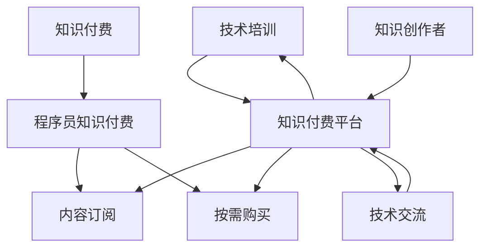

                 

# 程序员知识付费：从免费到收费

## 1. 背景介绍

随着互联网的发展和技术的进步，程序员的知识付费市场正在迅速崛起。曾经免费的在线学习资源和知识分享平台，正逐渐向收费转型。本文将从程序员知识付费的背景、现状和未来趋势，以及背后的商业逻辑和市场动因，进行深入探讨。

### 1.1 背景概述

过去，程序员的知识获取主要依赖免费资源，如开源社区、技术博客、技术论坛等。但这些免费资源虽然丰富，但由于缺乏商业驱动，常常存在内容质量参差不齐、更新速度慢、用户反馈机制不完善等问题。因此，一些具有实力的企业和机构开始推出付费服务，以确保内容的精准性和时效性。

### 1.2 发展现状

目前，程序员知识付费市场已经形成一定规模，并出现了多个知名的知识付费平台，如“CSDN”、“博客园”、“慕课网”等。这些平台主要提供课程、文档、问答等服务，包括但不限于编程语言、框架、开发工具、技术栈等方面的内容。

付费服务一般通过订阅制、单次购买、按需购买等多种形式进行收费。例如，一些平台提供每月或每年的订阅服务，用户可以享受到包括但不限于课程更新、专属导师答疑、社区讨论等在内的优质服务。此外，部分平台还提供点对点咨询、项目指导等高级服务，满足不同层次用户的需求。

## 2. 核心概念与联系

### 2.1 核心概念概述

为更好地理解程序员知识付费的市场动因和商业模式，本节将介绍几个核心概念：

- **知识付费（Knowledge Pay）**：指通过付费方式获取高价值、高质量知识或服务的模式。知识付费的核心在于通过合理的经济机制，激励知识创作者持续生产有价值的内容，同时确保用户获得优质、专业的知识和技能。

- **程序员知识付费（Programmer Knowledge Pay）**：指程序员通过付费方式获取编程技术、开发工具、软件架构等相关知识的服务。随着技术的发展和工作的复杂化，程序员的知识需求越来越专业化、高端化，付费服务成为满足这些需求的重要途径。

- **内容订阅（Subscription）**：指用户按月或按年支付费用，持续获得平台提供的高质量知识或服务。订阅模式能够稳定平台收入，同时保证用户获得持续的优质内容。

- **按需购买（On-demand Purchase）**：指用户根据需要，按次或按项目支付费用，获取特定的知识或服务。这种模式更灵活，用户可以根据实际需求和预算，选择付费内容和数量。

- **技术培训（Technical Training）**：指通过课程、培训等方式，系统性提升程序员的编程技能和专业知识。技术培训是知识付费的重要组成部分，帮助程序员在职业生涯中不断进步和成长。

- **技术交流（Technical Exchange）**：指通过社区、论坛等方式，促进程序员之间的技术交流和经验分享。技术交流不仅能增进程序员之间的了解和合作，还能加速知识的传播和创新。

- **知识付费平台（Knowledge Pay Platform）**：指通过互联网提供知识付费服务的平台。平台通常包括课程制作、内容分发、用户管理、支付处理等功能模块。

- **知识创作者（Knowledge Creator）**：指在知识付费平台上提供知识或服务的专业人士，如技术专家、软件架构师、技术博主等。创作者通过提供有价值的内容，获取用户订阅费用或咨询费用。

这些概念之间的逻辑关系可以通过以下Mermaid流程图来展示：



这个流程图展示出知识付费的各个环节和组件，以及它们之间的内在联系。

## 3. 核心算法原理 & 具体操作步骤

### 3.1 算法原理概述

程序员知识付费的核心在于通过合理定价和优质内容，满足用户的多样化需求。其算法原理主要包括以下几个方面：

1. **需求分析**：通过对目标用户的调研和数据分析，了解用户的学习目标、兴趣点、付费意愿等信息，从而设计出满足用户需求的知识付费产品。

2. **内容生产**：根据需求分析结果，设计课程大纲、编写教材、制作视频等内容，确保内容质量高、实用性强。

3. **定价策略**：根据内容价值、用户需求、市场竞争等因素，制定合理的定价策略，确保既能吸引用户，又能获得稳定的收入。

4. **内容分发**：通过平台分发机制，将内容精准推送给目标用户，提高内容曝光率和使用率。

5. **用户管理**：通过平台的用户管理模块，跟踪用户行为、反馈和评价，持续优化内容和产品，提升用户满意度。

6. **收益分配**：通过平台内置的收益分配机制，确保知识创作者获得合理的报酬，激励其持续生产高质量内容。

### 3.2 算法步骤详解

程序员知识付费的算法步骤通常包括以下几个关键步骤：

**Step 1: 需求调研和数据分析**
- 设计调研问卷，收集目标用户的学习需求和付费意愿。
- 分析用户行为数据，了解用户的学习路径和知识需求。
- 确定核心用户群体，设计精准的用户画像。

**Step 2: 内容设计和制作**
- 根据需求调研结果，设计课程大纲、编写教材、制作视频等内容。
- 邀请行业专家和知识创作者，参与内容制作和审核。
- 使用高质量的音视频编辑工具，提高内容的生产效率和质量。

**Step 3: 定价策略设计**
- 根据内容价值、市场需求和竞争环境，设计合理的课程定价。
- 引入订阅制、单次购买、按需购买等多种付费模式，满足不同用户需求。
- 设计动态定价策略，根据市场需求和内容更新情况，动态调整课程价格。

**Step 4: 内容分发与推荐**
- 使用推荐算法，将内容精准推送给目标用户，提高内容曝光率和点击率。
- 设计社区交流和讨论模块，促进用户之间的技术交流和经验分享。
- 提供搜索和筛选功能，帮助用户快速找到所需内容。

**Step 5: 用户管理和收益分配**
- 设计用户管理系统，跟踪用户行为、反馈和评价，提供个性化服务。
- 设计收益分配机制，确保知识创作者获得合理的报酬。
- 定期进行用户满意度调查，持续优化内容和产品。

### 3.3 算法优缺点

程序员知识付费的算法优点主要包括：

1. **精准满足需求**：通过精准的用户需求调研和内容设计，确保知识付费产品能够满足目标用户的学习需求和职业发展目标。

2. **高效内容生产**：通过专业团队和高性能工具，提高内容生产效率，确保内容质量和实用性强。

3. **灵活付费模式**：提供多种付费模式，满足不同用户需求和预算。

4. **合理收益分配**：通过合理的收益分配机制，确保知识创作者获得合理的报酬，激励其持续生产高质量内容。

5. **技术交流平台**：提供社区交流和讨论模块，促进用户之间的技术交流和经验分享，加速知识的传播和创新。

程序员知识付费的算法缺点主要包括：

1. **高内容生产成本**：高质量内容的生产需要专业团队和高性能工具，成本较高。

2. **用户需求多样**：用户需求多样，需要设计多种内容和付费模式，增加运营复杂度。

3. **市场竞争激烈**：知识付费市场竞争激烈，需要不断创新和优化，才能保持市场竞争力。

4. **用户付费意愿不足**：部分用户对付费存在抵触情绪，需要通过市场教育和优质内容吸引用户。

5. **内容更新和维护困难**：内容需要持续更新和维护，以保证内容的实时性和实用性。

### 3.4 算法应用领域

程序员知识付费的算法应用领域主要包括以下几个方面：

1. **在线编程课程**：通过课程和视频，系统性提升编程技能和专业知识。

2. **软件开发工具**：介绍常用的开发工具和框架，提高开发效率和质量。

3. **软件架构设计**：讲解软件架构设计和优化，提升系统性能和可维护性。

4. **数据科学和机器学习**：讲解数据科学和机器学习的基本概念和应用。

5. **技术博客和文章**：通过博客和文章，分享最新的技术动态和实战经验。

6. **技术问答和咨询**：提供技术问答和咨询服务，帮助用户解决实际问题。

## 4. 数学模型和公式 & 详细讲解 & 举例说明

### 4.1 数学模型构建

假设程序员知识付费平台上有 $N$ 个用户，每个用户需要学习的技能集合为 $\{S_1, S_2, ..., S_n\}$，其中 $S_i$ 表示第 $i$ 项技能，每个技能的学习时间 $T_i$ 不同，用户愿意支付的费用为 $P_i$。设平台提供的内容数量为 $C$，每个内容 $C_j$ 的学习时间为 $t_j$，内容生产成本为 $c_j$。

平台的目标是最大化总收入 $R$，总收入 $R$ 可以表示为：

$$
R = \sum_{i=1}^N \sum_{j=1}^C p_{ij} \times t_j
$$

其中 $p_{ij}$ 表示用户对内容 $C_j$ 的付费意愿。

### 4.2 公式推导过程

根据上述模型，推导平台最大化的总收入公式为：

$$
R = \max_{p_{ij}} \sum_{i=1}^N \sum_{j=1}^C p_{ij} \times t_j
$$

根据用户调研和数据分析，假设用户对内容 $C_j$ 的付费意愿 $p_{ij}$ 满足正态分布：

$$
p_{ij} \sim \mathcal{N}(\mu_j, \sigma_j)
$$

其中 $\mu_j$ 为内容的平均付费意愿，$\sigma_j$ 为付费意愿的标准差。

因此，总收入 $R$ 可以进一步表示为：

$$
R = \max_{\mu, \sigma} \sum_{i=1}^N \sum_{j=1}^C \mathcal{N}(\mu_j, \sigma_j) \times t_j
$$

利用极大似然估计方法，最大化 $R$ 的期望值 $E[R]$ 和方差 $\text{Var}(R)$，得到最优的 $\mu$ 和 $\sigma$。

### 4.3 案例分析与讲解

假设平台上有 1000 个用户，用户需要学习 5 项技能，每项技能的学习时间分别为 2 天、4 天、6 天、8 天、10 天。平台提供 3 项内容，每项内容的学习时间分别为 3 天、5 天、7 天，内容生产成本分别为 10000 元、20000 元、30000 元。

用户对每项内容的付费意愿如下：

- 内容 1：$P_1 = \mathcal{N}(0.5, 0.2)$
- 内容 2：$P_2 = \mathcal{N}(0.3, 0.1)$
- 内容 3：$P_3 = \mathcal{N}(0.4, 0.2)$

通过计算，可以得出平台最大化总收入 $R$ 的最佳策略。

## 5. 项目实践：代码实例和详细解释说明

### 5.1 开发环境搭建

在进行程序员知识付费平台的开发前，我们需要准备好开发环境。以下是使用Python进行Flask开发的环境配置流程：

1. 安装Anaconda：从官网下载并安装Anaconda，用于创建独立的Python环境。

2. 创建并激活虚拟环境：
```bash
conda create -n flask-env python=3.8 
conda activate flask-env
```

3. 安装Flask：
```bash
pip install flask
```

4. 安装Flask-RESTful：
```bash
pip install flask-restful
```

5. 安装Flask-SQLAlchemy：
```bash
pip install flask-sqlalchemy
```

6. 安装Flask-WTF：
```bash
pip install flask-wtf
```

7. 安装WTForms：
```bash
pip install wtforms
```

完成上述步骤后，即可在`flask-env`环境中开始开发实践。

### 5.2 源代码详细实现

下面我们以程序员知识付费平台的课程管理系统为例，给出使用Flask框架的Python代码实现。

首先，定义课程和用户模型：

```python
from flask_sqlalchemy import SQLAlchemy
from flask_wtf import FlaskForm
from wtforms import StringField, FloatField, SubmitField
from wtforms.validators import DataRequired, NumberRange

db = SQLAlchemy()
form = FlaskForm
db.init_app(app)
class User(db.Model):
    id = db.Column(db.Integer, primary_key=True)
    name = db.Column(db.String(64), unique=True)
    email = db.Column(db.String(120), unique=True)
    password_hash = db.Column(db.String(128))
class Course(db.Model):
    id = db.Column(db.Integer, primary_key=True)
    name = db.Column(db.String(64))
    duration = db.Column(db.Integer)
    price = db.Column(db.Float)
class Enrollment(db.Model):
    id = db.Column(db.Integer, primary_key=True)
    user_id = db.Column(db.Integer, db.ForeignKey('user.id'))
    course_id = db.Column(db.Integer, db.ForeignKey('course.id'))
    date_joined = db.Column(db.DateTime)
class CourseForm(form.Form):
    name = StringField('Name', validators=[DataRequired()])
    duration = FloatField('Duration', validators=[NumberRange(min=1, max=100)])
    price = FloatField('Price', validators=[NumberRange(min=0, max=100)])
    submit = SubmitField('Submit')
```

然后，定义视图函数：

```python
@app.route('/courses', methods=['GET', 'POST'])
def courses():
    form = CourseForm()
    if form.validate_on_submit():
        course = Course(name=form.name.data, duration=form.duration.data, price=form.price.data)
        db.session.add(course)
        db.session.commit()
        flash('Course created successfully.')
        return redirect(url_for('courses'))
    return render_template('courses.html', form=form)
```

最后，创建数据库和运行服务：

```python
if __name__ == '__main__':
    app.run(debug=True)
```

### 5.3 代码解读与分析

让我们再详细解读一下关键代码的实现细节：

**User类**：
- 定义了用户的基本信息，包括id、name、email、password_hash等属性。

**Course类**：
- 定义了课程的基本信息，包括id、name、duration、price等属性。

**Enrollment类**：
- 定义了用户的课程注册信息，包括id、user_id、course_id、date_joined等属性。

**CourseForm类**：
- 定义了课程信息提交表单，包括name、duration、price等字段，并设置相关验证器。

**courses视图函数**：
- 处理课程提交请求，验证表单数据，并将课程信息保存到数据库中。

通过这些代码，我们可以快速搭建一个基本的程序员知识付费平台，实现课程的创建和管理功能。当然，实际开发中还需要进一步扩展功能，如用户注册、课程购买、支付处理、课程评价等。

## 6. 实际应用场景

### 6.1 在线编程课程

在线编程课程是程序员知识付费平台的重要组成部分，能够系统性提升程序员的编程技能和专业知识。通过课程和视频，用户可以掌握各种编程语言、框架和工具，了解最新的技术动态和最佳实践。

### 6.2 软件开发工具

软件开发工具是程序员知识付费平台的重要内容，帮助用户了解常用的开发工具和框架，提高开发效率和质量。例如，Java程序员可以通过课程学习Spring Boot、MyBatis、Git等工具的使用方法，提升开发效率和代码质量。

### 6.3 软件架构设计

软件架构设计是程序员知识付费平台的另一个重要内容，帮助用户了解软件架构设计和优化的方法。例如，用户可以通过课程学习微服务、分布式系统、缓存设计等架构模式，提升系统性能和可维护性。

### 6.4 数据科学和机器学习

数据科学和机器学习是程序员知识付费平台的重要内容，帮助用户了解数据科学和机器学习的基本概念和应用。例如，用户可以通过课程学习数据清洗、特征工程、模型训练等方法，提升数据处理和机器学习的能力。

### 6.5 技术博客和文章

技术博客和文章是程序员知识付费平台的重要内容，通过博客和文章分享最新的技术动态和实战经验。例如，用户可以通过博客了解最新的技术趋势和实践经验，提升自身的技术水平和市场竞争力。

## 7. 工具和资源推荐

### 7.1 学习资源推荐

为了帮助程序员深入了解知识付费的原理和实践，这里推荐一些优质的学习资源：

1. 《知识付费模型与实践》系列博文：由知识付费领域的专家撰写，深入浅出地介绍了知识付费的原理、模型和实践方法。

2. 《程序员知识付费实战》书籍：系统讲解了知识付费平台的搭建和运营，包括需求分析、内容生产、定价策略、用户管理等关键环节。

3. 《知识付费市场分析》报告：详细分析了知识付费市场的发展趋势、用户需求和竞争格局，为平台开发提供重要参考。

4. 《知识付费平台案例》报告：分析了多个知识付费平台的成功案例，提供了丰富的实践经验和技术积累。

5. 《知识付费营销》课程：讲解了知识付费的营销策略和推广方法，帮助平台吸引用户和提升流量。

通过对这些资源的学习，相信你一定能够系统掌握知识付费的原理和实践，开发出更优秀的程序员知识付费平台。

### 7.2 开发工具推荐

高效的开发离不开优秀的工具支持。以下是几款用于程序员知识付费平台开发的常用工具：

1. Flask：轻量级Web框架，简单易用，适合快速开发原型。

2. SQLAlchemy：强大的SQL工具包，支持多种数据库，适合数据管理。

3. Flask-RESTful：扩展了Flask的功能，支持RESTful API，方便平台数据交换。

4. Flask-WTF：WTForms的Flask扩展，支持表单验证和数据提交。

5. WTForms：表单处理工具，方便收集用户输入数据。

6. Bootstrap：前端UI框架，提供丰富的UI组件和样式。

7. JavaScript：前端开发必备，支持动态交互和用户体验。

合理利用这些工具，可以显著提升程序员知识付费平台的开发效率，快速实现各种功能。

### 7.3 相关论文推荐

程序员知识付费技术的发展得益于学界的持续研究。以下是几篇奠基性的相关论文，推荐阅读：

1. 《知识付费平台的经济学分析》：分析了知识付费平台的经济模型和定价策略，为平台运营提供理论基础。

2. 《知识付费用户行为分析》：分析了知识付费用户的需求、行为和反馈，为内容设计和用户管理提供数据支撑。

3. 《知识付费平台的运营策略》：详细讲解了知识付费平台的运营策略和方法，包括用户管理、内容运营、市场推广等。

4. 《知识付费的商业化路径》：分析了知识付费的商业化路径和盈利模式，为平台发展提供战略指导。

这些论文代表了大语言模型微调技术的发展脉络。通过学习这些前沿成果，可以帮助研究者把握学科前进方向，激发更多的创新灵感。

## 8. 总结：未来发展趋势与挑战

### 8.1 总结

本文对程序员知识付费的市场动因、商业模式和技术实现进行了全面系统的介绍。首先阐述了知识付费的背景和现状，明确了程序员知识付费的重要性和市场前景。其次，从算法原理和具体步骤，详细讲解了程序员知识付费的技术实现。最后，探讨了程序员知识付费的应用场景和未来趋势，以及平台开发所需的关键技术和工具。

通过本文的系统梳理，可以看到，程序员知识付费正在成为程序员学习的重要途径，极大地提升了程序员的学习效率和质量。未来，伴随知识付费市场的发展和技术的进步，程序员知识付费必将在职业发展和创新创业中扮演越来越重要的角色。

### 8.2 未来发展趋势

展望未来，程序员知识付费技术将呈现以下几个发展趋势：

1. **内容精细化**：知识付费平台将更加注重内容质量，引入高质量的行业专家和知识创作者，提供精准、实用的知识和技能。

2. **服务多样化**：除了课程和视频，平台还将引入更多服务形式，如点对点咨询、项目指导、职业规划等，满足用户多样化的需求。

3. **技术智能化**：利用人工智能和大数据技术，实现知识推送的个性化和智能化，提高用户的学习效率和体验。

4. **市场细分化**：知识付费市场将逐渐细分化，针对不同行业、不同层次的用户，提供定制化的知识和技能。

5. **国际化**：随着知识付费平台的国际化进程加快，更多的国际用户将参与到知识付费市场中，推动全球知识共享和技能提升。

### 8.3 面临的挑战

尽管程序员知识付费技术已经取得了瞩目成就，但在迈向更加智能化、普适化应用的过程中，它仍面临着诸多挑战：

1. **内容质量问题**：高质量内容的生产成本高，难以满足大规模用户的需求。如何确保内容的质量和实用性，需要持续投入和优化。

2. **用户付费意愿不足**：部分用户对付费存在抵触情绪，需要通过市场教育和优质内容吸引用户。

3. **平台盈利压力**：知识付费平台运营需要大量资金投入，如何平衡成本和收益，实现可持续发展，需要精心规划和管理。

4. **市场竞争激烈**：知识付费市场竞争激烈，需要不断创新和优化，才能保持市场竞争力。

5. **技术创新不足**：知识付费平台的技术创新不足，难以满足用户多样化的需求和快速变化的市场环境。

6. **用户体验不足**：部分知识付费平台用户体验不佳，导致用户流失。如何提升用户体验，需要不断改进和优化。

7. **安全性和隐私保护**：知识付费平台涉及用户隐私和数据安全，需要采取有效的技术和措施，确保用户数据安全。

### 8.4 研究展望

面对程序员知识付费所面临的种种挑战，未来的研究需要在以下几个方面寻求新的突破：

1. **内容质量提升**：通过引入更多高质量的行业专家和知识创作者，提供精准、实用的知识和技能。

2. **内容多样化**：引入更多服务形式，如点对点咨询、项目指导、职业规划等，满足用户多样化的需求。

3. **技术智能化**：利用人工智能和大数据技术，实现知识推送的个性化和智能化，提高用户的学习效率和体验。

4. **市场细分化**：针对不同行业、不同层次的用户，提供定制化的知识和技能。

5. **国际化**：随着知识付费平台的国际化进程加快，更多的国际用户将参与到知识付费市场中，推动全球知识共享和技能提升。

6. **平台盈利模式创新**：探索更多的盈利模式，如订阅制、单次购买、按需购买等，提高平台的收入和用户粘性。

7. **用户教育与引导**：通过市场教育和优质内容，提升用户对知识付费的认知和接受度。

这些研究方向的探索，必将引领程序员知识付费技术迈向更高的台阶，为程序员学习和发展提供更加优质和高效的知识和技能。

## 9. 附录：常见问题与解答

**Q1：程序员知识付费平台的运营策略是什么？**

A: 程序员知识付费平台的运营策略主要包括以下几个方面：

1. **需求调研和内容生产**：通过用户调研和数据分析，了解用户的学习需求和职业发展目标，设计精准的内容和课程。

2. **定价策略和收费模式**：根据内容价值、用户需求和市场竞争，设计合理的定价策略，提供多种付费模式，满足不同用户需求和预算。

3. **内容分发和推广**：通过推荐算法，精准推送内容给目标用户，提高内容曝光率和点击率。利用社交媒体和广告等手段，推广平台和课程。

4. **用户管理和互动**：设计用户管理系统，跟踪用户行为、反馈和评价，提供个性化服务和互动。建立社区交流和讨论模块，促进用户之间的技术交流和经验分享。

5. **技术迭代和优化**：通过用户反馈和市场需求，不断优化和更新内容，提升平台的用户满意度和粘性。引入新技术和大数据工具，提升平台的智能化水平。

**Q2：程序员知识付费平台的主要盈利模式有哪些？**

A: 程序员知识付费平台的主要盈利模式包括以下几种：

1. **订阅制**：用户按月或按年支付费用，持续获得平台提供的高质量知识或服务。订阅制能够稳定平台收入，同时保证用户获得持续的优质内容。

2. **单次购买**：用户按需购买课程或服务，获取特定的知识或技能。单次购买模式更灵活，用户可以根据实际需求和预算，选择付费内容和数量。

3. **按需购买**：用户按项目支付费用，获取特定的知识或服务。按需购买模式更灵活，用户可以根据具体需求和预算，选择付费内容和数量。

4. **广告和赞助**：平台通过引入广告和赞助，提高平台知名度和用户流量。广告和赞助收入能够增加平台的收入来源。

5. **技术咨询和项目指导**：平台提供高级技术咨询和项目指导服务，收取高额费用。技术咨询和项目指导服务能够增加平台的收入来源，同时提升平台的专业性和权威性。

6. **数据分析和市场研究**：平台提供数据分析和市场研究服务，帮助企业和用户了解市场趋势和技术动态。数据分析和市场研究服务能够增加平台的收入来源，同时提升平台的技术和市场价值。

这些盈利模式能够帮助知识付费平台实现可持续发展，同时提升平台的收入和用户粘性。

**Q3：如何设计程序员知识付费平台的用户管理系统？**

A: 程序员知识付费平台的用户管理系统主要包括以下几个方面：

1. **用户注册和认证**：通过注册和认证，确保用户身份的真实性和合法性。用户注册和认证可以通过电子邮件、手机短信等方式进行。

2. **用户行为记录**：通过日志记录，跟踪用户的行为、访问和操作数据，了解用户的学习路径和知识需求。

3. **用户评价和反馈**：通过用户评价和反馈，了解用户对内容和服务的满意度，收集用户需求和建议，优化内容和平台。

4. **个性化推荐**：根据用户行为和偏好，设计个性化推荐算法，推荐用户感兴趣的内容和课程。

5. **用户社区管理**：设计社区交流和讨论模块，促进用户之间的技术交流和经验分享，提高用户的互动和粘性。

6. **用户激励和奖励**：通过积分、勋章等方式，激励用户积极参与学习、交流和互动，提高用户满意度和忠诚度。

通过设计完善的用户管理系统，能够提高用户的学习效率和体验，增加平台的收入和用户粘性，提升平台的专业性和权威性。

**Q4：程序员知识付费平台的推荐算法有哪些？**

A: 程序员知识付费平台的推荐算法主要包括以下几种：

1. **协同过滤算法**：基于用户行为数据和用户历史行为相似性，推荐用户感兴趣的内容和课程。协同过滤算法能够提高推荐的个性化和精准度。

2. **内容推荐算法**：根据内容特征和用户历史行为，推荐用户感兴趣的内容和课程。内容推荐算法能够提高推荐的覆盖率和多样性。

3. **混合推荐算法**：结合协同过滤算法和内容推荐算法，综合考虑用户行为和内容特征，推荐用户感兴趣的内容和课程。混合推荐算法能够提高推荐的全面性和精准度。

4. **深度学习算法**：利用深度学习模型，通过用户行为数据和内容特征，预测用户兴趣，推荐用户感兴趣的内容和课程。深度学习算法能够提高推荐的精度和多样性。

5. **自然语言处理算法**：通过自然语言处理技术，分析用户查询和课程内容，推荐用户感兴趣的内容和课程。自然语言处理算法能够提高推荐的准确性和相关性。

通过设计高效的推荐算法，能够提高推荐效果，提升用户的学习效率和体验，增加平台的收入和用户粘性。

**Q5：程序员知识付费平台的收益分配机制有哪些？**

A: 程序员知识付费平台的收益分配机制主要包括以下几个方面：

1. **按课时收费**：根据课程的课时数和内容质量，按课时收费，确保知识创作者获得合理的报酬。

2. **按用户付费**：根据用户的付费情况，按用户付费，确保知识创作者获得稳定的收入来源。

3. **按内容流量**：根据内容的访问和观看次数，按内容流量收费，确保知识创作者获得更多的曝光和收入。

4. **按课程订阅数**：根据课程的订阅情况，按课程订阅数收费，确保知识创作者获得更多的订阅收入。

5. **按内容评价**：根据内容的评价和反馈，按内容评价收费，确保知识创作者获得更高的评价和收入。

6. **按用户反馈**：根据用户的反馈和建议，按用户反馈收费，确保知识创作者获得更多的反馈和改进机会。

通过设计合理的收益分配机制，能够激励知识创作者持续生产高质量的内容，同时确保平台的稳定运营和发展。

---

作者：禅与计算机程序设计艺术 / Zen and the Art of Computer Programming

