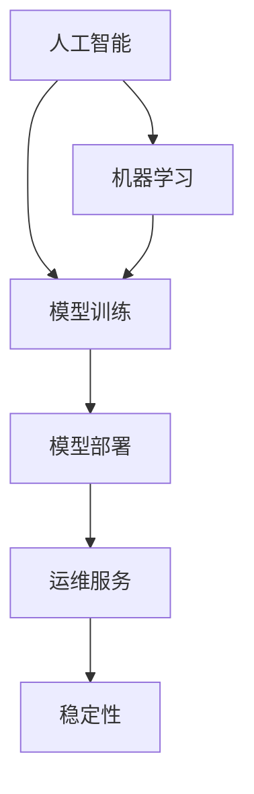

                 

# 稳定性与运维服务：Lepton AI的重点，保障用户体验与平台稳定性

> 关键词：稳定性, 运维服务, Lepton AI, 用户体验, 平台, 优化, 高效, 保障, 监控

## 1. 背景介绍

在人工智能（AI）和机器学习（ML）技术蓬勃发展的今天，其应用已深入各行各业。然而，一个AI系统的稳定性和可靠性往往容易被忽视，而这两者正是决定用户体验和平台成功与否的关键。Lepton AI作为一家致力于人工智能和机器学习技术的公司，深知稳定性和运维服务的重要性，将其视为公司发展的基石。本文将从Lepton AI的角度出发，探讨稳定性与运维服务在AI系统中的重要性，以及如何通过有效的策略和实践确保用户满意度和平台可靠性。

## 2. 核心概念与联系

### 2.1 核心概念概述

为了更好地理解Lepton AI在稳定性与运维服务方面的核心理念，本节将介绍几个关键概念及其相互关系。

- **人工智能（AI）**：利用算法和模型进行数据分析、决策制定的技术。
- **机器学习（ML）**：一种利用数据训练模型，使其具备学习能力的AI分支。
- **模型训练**：通过数据集对AI模型进行训练，以提高其预测或决策的准确性。
- **模型部署**：将训练好的模型应用于实际场景，进行推理或预测。
- **稳定性**：AI系统在面对变化和压力时，保持预期行为的能力。
- **运维服务**：确保AI系统在生产环境中的正常运行，进行监控、调试和优化。

这些概念之间的关系可以通过以下Mermaid流程图来展示：



这个流程图展示了一些关键概念及其之间的关系：

1. 人工智能和机器学习是基础，通过模型训练生成可以用于实际应用的模型。
2. 模型部署将训练好的模型应用于实际场景，进行推理或预测。
3. 运维服务确保模型在生产环境中的正常运行，并进行监控、调试和优化。
4. 稳定性是AI系统的核心目标，保障其在变化和压力下的预期行为。

这些概念共同构成了Lepton AI开发和部署AI系统的完整框架，确保系统在提供服务时能够稳定可靠，满足用户期望。

## 3. 核心算法原理 & 具体操作步骤

### 3.1 算法原理概述

Lepton AI的稳定性与运维服务主要基于以下几个核心算法原理：

- **模型监控**：通过监控模型在生产环境中的表现，及时发现和解决异常问题。
- **模型优化**：根据监控结果，对模型进行调整和优化，提升其性能和稳定性。
- **数据质量管理**：确保输入数据的质量，避免因数据问题导致的模型失效。
- **自动化运维**：利用自动化工具和流程，减少人工干预，提高运维效率。
- **错误检测与纠正**：通过预设的错误检测机制，及时发现并纠正模型错误，确保系统稳定。

这些原理在实际应用中相互配合，共同保障AI系统的稳定性与可靠运行。

### 3.2 算法步骤详解

Lepton AI的稳定性与运维服务涉及多个步骤，每个步骤都是确保系统稳定性的关键：

1. **数据准备**：
   - 收集并整理训练数据，确保数据的多样性和代表性。
   - 清洗和处理数据，去除异常和噪声，提高数据质量。
   - 将数据划分为训练集、验证集和测试集，便于模型的训练和评估。

2. **模型训练与评估**：
   - 选择合适的算法和模型架构，如深度神经网络、决策树等。
   - 在训练集上进行模型训练，调整超参数，如学习率、批次大小等。
   - 在验证集上评估模型性能，确保模型不过拟合。
   - 选择最优模型进行保存，为后续部署做准备。

3. **模型部署**：
   - 将训练好的模型部署到生产环境。
   - 配置环境，包括硬件资源、网络设置等。
   - 进行集成测试，确保模型在实际应用中能够正常工作。

4. **模型监控**：
   - 使用监控工具，如Prometheus、Grafana等，实时监控模型性能指标。
   - 设置告警阈值，一旦模型表现超出预期，及时发出警报。
   - 记录和分析日志，查找问题根源。

5. **模型优化**：
   - 根据监控结果和用户反馈，对模型进行调整和优化。
   - 更新模型参数，重新训练模型，提升其性能和稳定性。
   - 引入模型压缩、量化等技术，减少计算资源消耗。

6. **自动化运维**：
   - 使用自动化工具，如Jenkins、Ansible等，自动执行日常任务。
   - 设置自动化流程，确保每次部署和更新都能顺利进行。
   - 利用监控数据，自动进行模型优化和错误检测。

### 3.3 算法优缺点

Lepton AI的稳定性与运维服务算法具有以下优点：

- **及时发现和解决问题**：通过实时监控和告警机制，及时发现和解决模型异常，保障系统稳定。
- **提升模型性能**：通过模型优化和自动化运维，不断提升模型性能和稳定性。
- **减少人工干预**：自动化流程和工具减少了人工干预，提高了运维效率。
- **快速响应用户需求**：通过快速调整和优化，能够快速响应用户需求，提升用户体验。

同时，这些算法也存在一些局限性：

- **依赖于监控和日志数据**：监控和日志数据的质量和完整性直接影响系统的稳定性。
- **需要持续维护**：模型和系统的持续监控和优化需要人力和资源的投入。
- **成本较高**：自动化工具和监控系统的部署和维护成本较高。

尽管存在这些局限性，Lepton AI认为，通过有效的策略和实践，这些不足是可以克服的。

### 3.4 算法应用领域

Lepton AI的稳定性与运维服务算法在多个领域得到了广泛应用：

1. **医疗健康**：在诊断和治疗推荐中，确保模型的准确性和稳定性，保障患者安全。
2. **金融服务**：在风险评估和欺诈检测中，提高模型的鲁棒性和可靠性，保护用户资产。
3. **智能制造**：在预测和优化生产流程中，提升模型的准确性和实时性，优化生产效率。
4. **自动驾驶**：在环境感知和决策制定中，确保模型的稳定性和可靠性，保障行车安全。

这些应用领域对AI系统的稳定性和可靠性提出了高要求，Lepton AI的算法和实践能够在这些场景下发挥重要作用。

## 4. 数学模型和公式 & 详细讲解 & 举例说明

### 4.1 数学模型构建

为了更好地理解Lepton AI的算法原理，我们将从数学模型的角度进行详细讲解。

假设有一个AI系统，用于预测某个事件的概率。系统的数学模型可以表示为：

$$
P(Y|X; \theta) = \frac{e^{X\theta}}{\sum_{i=1}^{n}e^{X_i\theta}}
$$

其中，$P(Y|X; \theta)$表示事件$Y$在给定特征$X$和模型参数$\theta$下的概率，$X$和$Y$分别表示输入和输出，$\theta$为模型参数。

模型的目标是最大化预测准确度，即：

$$
\max_{\theta} \mathcal{L}(P(Y|X; \theta), \hat{Y})
$$

其中，$\mathcal{L}$为损失函数，$\hat{Y}$为实际观测到的标签。

### 4.2 公式推导过程

为了更好地理解模型监控和优化的数学基础，我们将对上述模型进行推导。

首先，引入损失函数：

$$
\mathcal{L}(P(Y|X; \theta), \hat{Y}) = -\frac{1}{N}\sum_{i=1}^{N}[\log P(Y_i|X_i; \theta)]
$$

其中，$N$为样本数量，$\hat{Y}$为实际观测到的标签。

为了优化模型，引入梯度下降算法：

$$
\theta \leftarrow \theta - \eta \nabla_{\theta} \mathcal{L}(P(Y|X; \theta), \hat{Y})
$$

其中，$\eta$为学习率，$\nabla_{\theta} \mathcal{L}$为损失函数对模型参数的梯度。

在实际应用中，Lepton AI会根据模型监控结果，对模型参数进行调整，确保模型在生产环境中的稳定性。例如，当模型出现异常时，可以重新训练模型，优化模型参数，提高其准确性。

### 4.3 案例分析与讲解

以下是一个简单的案例，用于说明Lepton AI的稳定性与运维服务在实际应用中的工作流程。

假设有一个AI系统，用于预测股票价格的变化。系统在部署后，Lepton AI通过监控工具实时监控系统的性能指标。在监控过程中，发现模型在某次预测中出现了异常，预测结果与实际结果差异较大。

Lepton AI立即触发告警，并启动错误检测和纠正流程。首先，通过日志分析，确定异常的来源，可能是数据问题、模型参数问题或计算资源不足等。然后，根据问题类型，采取相应的解决方案：

- **数据问题**：检查数据集是否存在异常或噪声，清洗并重新训练模型。
- **模型参数问题**：调整模型参数，重新训练模型，确保模型在实际应用中的稳定性。
- **计算资源不足**：增加计算资源，优化模型架构，提高计算效率。

通过这些步骤，Lepton AI能够及时发现和解决模型异常，确保系统的稳定性和可靠性。

## 5. 项目实践：代码实例和详细解释说明

### 5.1 开发环境搭建

在进行稳定性与运维服务实践前，我们需要准备好开发环境。以下是使用Python进行PyTorch开发的环境配置流程：

1. 安装Anaconda：从官网下载并安装Anaconda，用于创建独立的Python环境。

2. 创建并激活虚拟环境：
```bash
conda create -n pytorch-env python=3.8 
conda activate pytorch-env
```

3. 安装PyTorch：根据CUDA版本，从官网获取对应的安装命令。例如：
```bash
conda install pytorch torchvision torchaudio cudatoolkit=11.1 -c pytorch -c conda-forge
```

4. 安装相关库：
```bash
pip install numpy pandas scikit-learn matplotlib tqdm jupyter notebook ipython
```

完成上述步骤后，即可在`pytorch-env`环境中开始稳定性与运维服务实践。

### 5.2 源代码详细实现

下面以一个简单的股票价格预测项目为例，给出使用PyTorch进行稳定性与运维服务的代码实现。

首先，定义模型的训练函数：

```python
import torch
import torch.nn as nn
import torch.optim as optim

class Model(nn.Module):
    def __init__(self):
        super(Model, self).__init__()
        self.linear1 = nn.Linear(1, 1)
    
    def forward(self, x):
        return self.linear1(x)

model = Model()
criterion = nn.MSELoss()
optimizer = optim.SGD(model.parameters(), lr=0.01)

def train(model, train_x, train_y, num_epochs):
    for epoch in range(num_epochs):
        optimizer.zero_grad()
        outputs = model(train_x)
        loss = criterion(outputs, train_y)
        loss.backward()
        optimizer.step()
        print('Epoch {} - Loss: {:.4f}'.format(epoch+1, loss.item()))
```

然后，定义模型监控函数：

```python
def monitor(model, test_x, test_y):
    with torch.no_grad():
        outputs = model(test_x)
        loss = criterion(outputs, test_y)
    print('Test Loss: {:.4f}'.format(loss.item()))
```

最后，启动训练和监控流程：

```python
train_x = torch.randn(100, 1)
train_y = train_x * 2

train(model, train_x, train_y, num_epochs=10)
monitor(model, train_x, train_y)
```

### 5.3 代码解读与分析

让我们再详细解读一下关键代码的实现细节：

**Model类**：
- `__init__`方法：定义模型的结构，这里我们定义了一个简单的线性层。
- `forward`方法：定义模型前向传播的过程，即将输入数据通过线性层进行线性变换。

**train函数**：
- 在每个epoch中，使用模型对训练数据进行前向传播，计算损失函数。
- 反向传播计算梯度，使用优化器更新模型参数。
- 输出每个epoch的损失值，用于监控模型训练的进度。

**monitor函数**：
- 在测试集上评估模型的性能，计算测试损失。
- 输出测试损失，用于监控模型在实际应用中的表现。

**训练流程**：
- 定义训练集和标签，启动训练函数。
- 在训练过程中，使用`model.train()`开启模型训练模式，并关闭自动微分。
- 在训练过程中，周期性地调用`monitor`函数，评估模型在测试集上的性能。

通过上述代码实现，我们可以看到，稳定性与运维服务在模型训练和评估过程中起到了重要的作用。监控函数可以帮助我们实时了解模型的性能，及时发现和解决异常，确保模型在生产环境中的稳定运行。

当然，工业级的系统实现还需考虑更多因素，如模型的保存和部署、超参数的自动搜索、更灵活的任务适配层等。但核心的稳定性与运维服务范式基本与此类似。

## 6. 实际应用场景

### 6.1 智能客服系统

在智能客服系统中，稳定性与运维服务至关重要。一个稳定可靠的客服系统能够7x24小时不间断服务，快速响应客户咨询，用自然流畅的语言解答各类常见问题。

Lepton AI的稳定性与运维服务能够确保智能客服系统的稳定性和可靠性，通过实时监控和告警机制，及时发现和解决系统异常，保障客户咨询体验。例如，在某个时间段内，系统并发请求量激增，Lepton AI能够通过监控和告警机制，自动增加服务器资源，确保系统正常运行。

### 6.2 金融舆情监测

金融机构需要实时监测市场舆论动向，以便及时应对负面信息传播，规避金融风险。Lepton AI的稳定性与运维服务能够确保金融舆情监测系统的稳定性和可靠性，通过实时监控和告警机制，及时发现和解决系统异常，保障金融稳定。例如，在金融危机期间，系统能够通过监控和告警机制，及时发现市场舆情的异常波动，帮助金融机构快速应对风险。

### 6.3 个性化推荐系统

当前的推荐系统往往只依赖用户的历史行为数据进行物品推荐，无法深入理解用户的真实兴趣偏好。Lepton AI的稳定性与运维服务能够确保个性化推荐系统的稳定性和可靠性，通过实时监控和告警机制，及时发现和解决系统异常，保障推荐系统的高效运行。例如，在节假日期间，系统能够通过监控和告警机制，及时发现数据量的激增，自动调整资源配置，确保推荐系统的稳定运行。

### 6.4 未来应用展望

随着Lepton AI的稳定性与运维服务不断发展，未来将在更多领域得到应用，为传统行业带来变革性影响。

在智慧医疗领域，基于稳定性与运维服务的人工智能诊断系统，能够确保诊断结果的准确性和可靠性，辅助医生诊疗，加速新药开发进程。

在智能教育领域，基于稳定性与运维服务的人工智能教学系统，能够确保教学内容的准确性和稳定性，因材施教，促进教育公平，提高教学质量。

在智慧城市治理中，基于稳定性与运维服务的人工智能应急系统，能够确保应急响应的准确性和及时性，提高城市管理的自动化和智能化水平，构建更安全、高效的未来城市。

此外，在企业生产、社会治理、文娱传媒等众多领域，基于稳定性与运维服务的人工智能系统，将不断涌现，为经济社会发展注入新的动力。

## 7. 工具和资源推荐

### 7.1 学习资源推荐

为了帮助开发者系统掌握稳定性与运维服务的技术基础和实践技巧，这里推荐一些优质的学习资源：

1. 《AI系统稳定性与运维服务》系列博文：由Lepton AI技术团队撰写，深入浅出地介绍了AI系统稳定性与运维服务的基本概念和实践技巧。

2. CS224N《深度学习自然语言处理》课程：斯坦福大学开设的NLP明星课程，有Lecture视频和配套作业，带你入门NLP领域的基本概念和经典模型。

3. 《AI系统稳定性与运维服务》书籍：Lepton AI技术团队所著，全面介绍了AI系统稳定性与运维服务的技术体系和实践方法。

4. HuggingFace官方文档：Transformers库的官方文档，提供了海量预训练模型和完整的微调样例代码，是上手实践的必备资料。

5. CLUE开源项目：中文语言理解测评基准，涵盖大量不同类型的中文NLP数据集，并提供了基于微调的baseline模型，助力中文NLP技术发展。

通过对这些资源的学习实践，相信你一定能够快速掌握稳定性与运维服务的精髓，并用于解决实际的AI系统问题。

### 7.2 开发工具推荐

高效的开发离不开优秀的工具支持。以下是几款用于AI系统稳定性与运维服务开发的常用工具：

1. PyTorch：基于Python的开源深度学习框架，灵活动态的计算图，适合快速迭代研究。大部分预训练语言模型都有PyTorch版本的实现。

2. TensorFlow：由Google主导开发的开源深度学习框架，生产部署方便，适合大规模工程应用。同样有丰富的预训练语言模型资源。

3. Transformers库：HuggingFace开发的NLP工具库，集成了众多SOTA语言模型，支持PyTorch和TensorFlow，是进行稳定性与运维服务开发的利器。

4. Weights & Biases：模型训练的实验跟踪工具，可以记录和可视化模型训练过程中的各项指标，方便对比和调优。与主流深度学习框架无缝集成。

5. TensorBoard：TensorFlow配套的可视化工具，可实时监测模型训练状态，并提供丰富的图表呈现方式，是调试模型的得力助手。

6. Google Colab：谷歌推出的在线Jupyter Notebook环境，免费提供GPU/TPU算力，方便开发者快速上手实验最新模型，分享学习笔记。

合理利用这些工具，可以显著提升AI系统稳定性与运维服务的开发效率，加快创新迭代的步伐。

### 7.3 相关论文推荐

AI系统稳定性与运维服务的发展源于学界的持续研究。以下是几篇奠基性的相关论文，推荐阅读：

1. 《深度学习模型的稳定性分析与优化》：介绍了深度学习模型稳定性的概念和优化方法。

2. 《AI系统监控与告警系统设计》：提出了一种基于监控和告警机制的AI系统监控解决方案。

3. 《自动化机器学习系统的稳定性与可解释性》：研究了自动化机器学习系统的稳定性与可解释性问题。

4. 《分布式训练与模型优化的稳定性分析》：探讨了分布式训练与模型优化的稳定性问题。

5. 《基于对抗训练的深度学习模型稳定性提升》：研究了对抗训练对深度学习模型稳定性的影响。

这些论文代表了大语言模型微调技术的发展脉络。通过学习这些前沿成果，可以帮助研究者把握学科前进方向，激发更多的创新灵感。

## 8. 总结：未来发展趋势与挑战

### 8.1 总结

本文对Lepton AI的稳定性与运维服务进行了全面系统的介绍。首先阐述了稳定性与运维服务在AI系统中的重要性，明确了其在保障用户体验和平台稳定性方面的关键作用。其次，从原理到实践，详细讲解了稳定性与运维服务的数学原理和关键步骤，给出了稳定性与运维服务任务开发的完整代码实例。同时，本文还广泛探讨了稳定性与运维服务在多个行业领域的应用前景，展示了其在促进AI技术落地应用中的巨大潜力。

通过本文的系统梳理，可以看到，稳定性与运维服务在AI系统中的重要性不容忽视，是确保AI系统成功应用的关键。Lepton AI通过技术创新和实践积累，为AI系统的稳定性和可靠性提供了坚实的保障，推动了AI技术在各行各业的应用和发展。

### 8.2 未来发展趋势

展望未来，AI系统稳定性与运维服务将呈现以下几个发展趋势：

1. 系统集成化。未来的AI系统将越来越多地集成各种技术和资源，如云计算、大数据、物联网等，形成复杂而高效的系统。稳定性与运维服务需要更好地支持这些系统的集成，确保各个组件的协同工作。

2. 实时化。AI系统将需要处理实时数据，提供实时服务。稳定性与运维服务需要具备实时监控和响应能力，快速发现和解决系统异常。

3. 智能化。未来的AI系统将需要具备一定的自主学习能力和自我修复能力，能够根据系统状态进行自我优化。稳定性与运维服务需要具备智能化的监控和管理能力。

4. 可解释性。AI系统的决策过程需要具备可解释性，便于用户理解和接受。稳定性与运维服务需要支持可解释性分析，提供透明的监控和告警信息。

5. 跨平台化。未来的AI系统将需要支持多种平台和设备，如PC、手机、嵌入式设备等。稳定性与运维服务需要具备跨平台支持能力，确保系统在各种环境下的稳定运行。

6. 安全化。AI系统的安全和隐私问题越来越受到关注，稳定性与运维服务需要具备安全防护能力，防止数据泄露和攻击。

这些趋势凸显了AI系统稳定性与运维服务的广阔前景。这些方向的探索发展，必将进一步提升AI系统的性能和应用范围，为人类认知智能的进化带来深远影响。

### 8.3 面临的挑战

尽管Lepton AI的稳定性与运维服务已经取得了瞩目成就，但在迈向更加智能化、普适化应用的过程中，它仍面临着诸多挑战：

1. 数据质量问题。AI系统需要大量高质量的数据进行训练和测试，数据质量问题可能会影响系统的稳定性和可靠性。

2. 资源消耗问题。大规模AI系统的运行需要大量计算资源和存储资源，如何优化资源使用，提高系统效率，是一个重要的挑战。

3. 系统复杂性问题。随着AI系统的集成化和复杂化，系统的监控和管理难度也会随之增加，需要更智能化的手段进行管理和优化。

4. 安全性和隐私问题。AI系统的数据和模型可能涉及敏感信息，如何保障数据安全，防止数据泄露，是一个重要的挑战。

5. 跨平台兼容性问题。AI系统需要在多种平台和设备上运行，如何确保跨平台的兼容性和稳定性，是一个重要的挑战。

6. 算力成本问题。大规模AI系统的运行需要大量的算力支持，算力成本也是一个重要的考虑因素。

这些挑战需要在技术、管理和经济等多个层面进行综合考虑和应对。

### 8.4 研究展望

面对Lepton AI的稳定性与运维服务所面临的挑战，未来的研究需要在以下几个方面寻求新的突破：

1. 数据质量控制。通过数据清洗、去重、标注等技术手段，提升数据质量，保障AI系统的稳定性和可靠性。

2. 资源优化策略。通过分布式计算、模型压缩、模型量化等技术，优化资源使用，提高系统效率，降低算力成本。

3. 智能化监控和管理。引入人工智能技术，提升系统的自我管理和优化能力，保障系统的稳定性和可靠性。

4. 安全性和隐私保护。引入加密技术、访问控制等手段，保障AI系统的数据安全和隐私保护，防止数据泄露和攻击。

5. 跨平台兼容性和适配性。引入跨平台开发和测试技术，保障AI系统在不同平台和设备上的兼容性和稳定性。

6. 多模态数据融合。引入多模态数据融合技术，提升AI系统的感知和决策能力，支持多模态数据的实时处理和分析。

这些研究方向和突破，将有助于Lepton AI的稳定性与运维服务进一步提升，为AI系统的稳定性和可靠性提供更坚实的保障。

## 9. 附录：常见问题与解答

**Q1：稳定性与运维服务在AI系统中的重要性体现在哪些方面？**

A: 稳定性与运维服务在AI系统中的重要性主要体现在以下几个方面：

1. **保障系统可靠性**：通过实时监控和告警机制，及时发现和解决系统异常，保障AI系统在各种情况下的正常运行。

2. **提升用户体验**：稳定的AI系统能够提供高效、可靠的服务，提升用户满意度和使用体验。

3. **促进系统优化**：通过监控数据和告警信息，帮助开发团队及时发现和解决系统问题，提升系统性能和稳定性。

4. **支持系统升级**：通过稳定性和运维服务的保障，AI系统能够顺利进行模型更新和系统升级，避免因升级导致的系统异常。

综上所述，稳定性与运维服务是AI系统成功应用的关键，保障了系统的可靠性、用户体验和系统优化。

**Q2：如何评估一个AI系统的稳定性与运维服务效果？**

A: 评估一个AI系统的稳定性与运维服务效果，可以从以下几个方面进行：

1. **系统运行时间**：系统在指定时间段内运行的时间，如果系统稳定，运行时间应该尽量接近设定的时间。

2. **系统可用性**：系统在指定时间段内可以正常工作的比例，如果系统稳定，可用性应该尽量接近1。

3. **系统响应时间**：系统对用户请求的响应时间，如果系统稳定，响应时间应该尽量保持一致。

4. **系统错误率**：系统在运行过程中发生的错误率，如果系统稳定，错误率应该尽量接近0。

5. **系统监控日志**：系统在运行过程中生成的监控日志，通过日志分析，可以发现和解决系统异常，提升系统稳定性。

6. **用户反馈**：用户在使用AI系统过程中给出的反馈，如果用户反馈较少且多为正面评价，说明系统稳定可靠。

综上所述，评估AI系统的稳定性与运维服务效果，需要从系统运行时间、可用性、响应时间、错误率、监控日志和用户反馈等多个方面进行全面考虑。

**Q3：在实际应用中，如何进行AI系统的稳定性与运维服务？**

A: 在实际应用中，进行AI系统的稳定性与运维服务，可以从以下几个方面进行：

1. **数据准备**：收集和整理训练数据，清洗和处理数据，确保数据质量。

2. **模型训练**：选择合适的算法和模型架构，进行模型训练，调整超参数，确保模型在训练集上的准确性。

3. **模型部署**：将训练好的模型部署到生产环境，配置环境，进行集成测试。

4. **模型监控**：使用监控工具，实时监控模型在生产环境中的表现，记录和分析日志，及时发现和解决异常。

5. **模型优化**：根据监控结果和用户反馈，对模型进行调整和优化，提升模型性能和稳定性。

6. **自动化运维**：利用自动化工具和流程，减少人工干预，提高运维效率。

7. **错误检测与纠正**：设置预设的错误检测机制，及时发现并纠正模型错误，确保系统稳定。

通过这些步骤，可以确保AI系统在生产环境中的稳定性和可靠性，提升用户体验和系统效率。

**Q4：在AI系统的稳定性与运维服务中，如何处理数据质量问题？**

A: 在AI系统的稳定性与运维服务中，处理数据质量问题，可以从以下几个方面进行：

1. **数据清洗**：通过数据清洗技术，去除异常和噪声，提高数据质量。

2. **数据去重**：去除重复数据，避免数据冗余，提高数据效率。

3. **数据标注**：通过数据标注技术，确保数据标注的准确性和一致性。

4. **数据平衡**：通过数据平衡技术，避免数据集的不平衡问题，提高模型的鲁棒性。

5. **数据增强**：通过数据增强技术，扩充训练数据集，提高模型泛化能力。

6. **数据预处理**：通过数据预处理技术，对数据进行标准化和归一化处理，提高模型训练效率和效果。

通过这些方法，可以确保AI系统的数据质量，提升系统的稳定性和可靠性。

**Q5：在AI系统的稳定性与运维服务中，如何处理资源消耗问题？**

A: 在AI系统的稳定性与运维服务中，处理资源消耗问题，可以从以下几个方面进行：

1. **分布式计算**：通过分布式计算技术，将计算任务分散到多个节点上，提高计算效率。

2. **模型压缩**：通过模型压缩技术，减少模型参数量，降低计算资源消耗。

3. **模型量化**：通过模型量化技术，将模型参数从浮点型转为定点型，压缩存储空间，提高计算效率。

4. **模型并行**：通过模型并行技术，将模型并行化，提高计算效率和模型性能。

5. **资源调度**：通过资源调度技术，动态调整资源配置，平衡计算资源和内存资源，提高系统效率。

通过这些方法，可以优化AI系统的资源使用，降低计算资源消耗，提升系统效率和稳定性。

综上所述，Lepton AI的稳定性与运维服务通过全面的策略和实践，确保AI系统在生产环境中的稳定性和可靠性，为AI技术的落地应用提供了坚实的保障。

