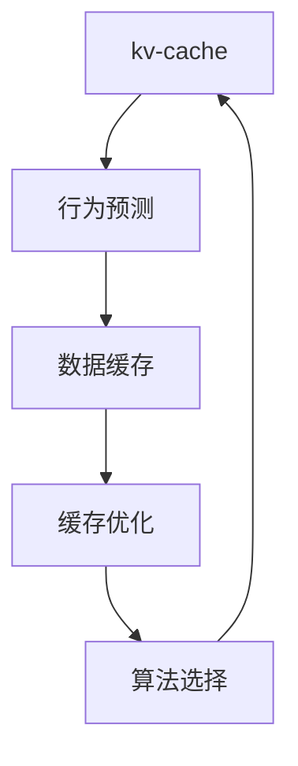

                 

# 第十二章：kv-cache 推断技术

> 关键词：kv-cache, 推断技术, 数据库查询, 存储优化, 缓存设计, 算法优化

## 1. 背景介绍

### 1.1 问题由来
在当今大数据时代，数据库系统和缓存系统成为了支撑信息检索和存储的重要基础设施。然而，面对不断增长的数据量和用户需求，如何高效地检索、存储和管理数据，已成为业界关注的重点问题。

尤其在高并发的环境下，数据库和缓存系统面临严峻挑战。传统的数据库查询方式通常以SQL语句为主，而缓存系统则多采用简单的Key-Value存储。然而，这些方法在面对复杂的查询逻辑和高并发访问时，往往存在性能瓶颈和资源浪费的问题。

推断技术是一种基于统计模型和算法优化的数据处理方式。它通过预测用户可能的行为和需求，提前预处理并缓存相关数据，从而提高查询效率和用户体验。推断技术在大数据存储和检索中的应用，已经成为一种行之有效的解决方案。

### 1.2 问题核心关键点
推断技术的核心在于对用户行为和需求进行精准预测，提前缓存相关数据。通过优化数据结构、选择高效算法，在保证数据正确性和一致性的同时，提升检索和存储的效率。具体而言，推断技术涉及以下关键点：

- 行为预测：通过分析用户历史行为和数据分布，预测用户可能的查询需求。
- 数据缓存：根据预测结果，缓存可能被查询的数据，以便快速响应。
- 缓存优化：通过算法和数据结构优化，最大化缓存空间的使用效率，减少冗余数据。
- 算法选择：选择最合适的推断算法，以适应不同的数据类型和访问模式。

### 1.3 问题研究意义
研究kv-cache的推断技术，对于提升数据库和缓存系统的性能、优化资源利用、增强用户体验具有重要意义：

1. 提升查询效率：通过预测和缓存，提前准备好相关数据，可显著减少查询响应时间，提高系统的响应速度。
2. 优化资源使用：通过缓存策略和算法选择，可最大化利用有限的缓存空间，减少对底层存储的访问频率，节约计算资源。
3. 增强用户满意度：快速响应用户查询请求，提升用户体验，增加用户粘性，有助于业务的长期发展。
4. 降低开发成本：通过预先缓存和推断技术，减少系统开发和维护的工作量，降低人力成本。
5. 拓展应用范围：推断技术不仅适用于数据库和缓存系统，还可应用于网络搜索、推荐系统等多个领域，具有广泛的应用前景。

## 2. 核心概念与联系

### 2.1 核心概念概述

为更好地理解kv-cache推断技术，本节将介绍几个关键概念：

- **kv-cache（key-value cache）**：一种基于Key-Value键值对存储的数据缓存系统，用于快速存储和检索数据。
- **推断（Inference）**：基于统计模型和算法，预测用户行为和需求的过程。
- **行为预测（Behavioral Prediction）**：利用历史数据和统计模型，预测用户未来行为。
- **数据缓存（Data Caching）**：根据预测结果，缓存可能被查询的数据，以便快速响应。
- **缓存优化（Cache Optimization）**：通过算法和数据结构优化，最大化缓存空间的使用效率。
- **算法选择（Algorithm Selection）**：选择最合适的推断算法，以适应不同的数据类型和访问模式。

这些概念之间的逻辑关系可以通过以下Mermaid流程图来展示：



这个流程图展示了一系列推断技术在kv-cache系统中的应用：

1. 根据用户行为预测需求，缓存相关数据。
2. 根据预测结果缓存数据，提升查询效率。
3. 优化缓存策略，最大化缓存空间的利用率。
4. 选择适合的算法，优化推断过程。

这些概念共同构成了kv-cache推断技术的工作框架，使其能够在高效存储和检索数据的同时，提供精准的预测服务。

## 3. 核心算法原理 & 具体操作步骤
### 3.1 算法原理概述

kv-cache推断技术的核心原理，是通过统计模型和算法优化，预测用户可能的查询需求，并根据预测结果缓存相关数据。这一过程大致分为以下几步：

1. 数据收集：收集用户历史行为数据，如查询记录、点击行为等。
2. 行为预测：利用统计模型和算法，预测用户未来可能的行为和需求。
3. 数据缓存：根据预测结果，缓存相关数据，优化缓存策略。
4. 数据检索：根据用户实际查询，快速检索并返回缓存数据。

这一过程中，关键在于如何高效地进行行为预测和数据缓存。推断技术主要采用以下两种方式：

- **基于模型的推断**：使用机器学习模型，如线性回归、决策树、随机森林等，对用户行为进行预测。
- **基于规则的推断**：利用预设规则和条件判断，对用户行为进行预测和缓存。

### 3.2 算法步骤详解

下面是kv-cache推断技术的详细步骤：

#### 步骤1：数据收集

首先，需要收集用户的历史行为数据。这些数据通常包括用户的查询记录、浏览记录、点击行为等。数据收集过程应尽可能全面，以确保预测结果的准确性。

```python
# 数据收集示例
def collect_user_data(user_id):
    # 从数据库或日志文件中读取用户历史行为数据
    user_data = get_user_data_from_database(user_id)
    return user_data
```

#### 步骤2：行为预测

行为预测是kv-cache推断技术的核心步骤。通过利用统计模型和算法，预测用户未来可能的行为和需求。以下是一个基于随机森林的行为预测算法：

```python
from sklearn.ensemble import RandomForestRegressor

# 数据预处理
X = preprocess_data(user_data)

# 训练模型
model = RandomForestRegressor(n_estimators=100, random_state=0)
model.fit(X, y)

# 预测行为
user_query = predict_query(model, user_data)
```

#### 步骤3：数据缓存

根据预测结果，缓存相关数据。缓存过程中应考虑数据类型、访问频率、空间占用等因素，优化缓存策略。

```python
# 缓存数据
cache_data(user_query, user_data)
```

#### 步骤4：数据检索

当用户发起查询时，根据预测结果快速检索并返回缓存数据。

```python
# 数据检索
retrieved_data = get_cached_data(user_query)
```

### 3.3 算法优缺点

kv-cache推断技术具有以下优点：

1. 提升查询效率：通过预测和缓存，提前准备好相关数据，可显著减少查询响应时间，提高系统的响应速度。
2. 优化资源使用：通过缓存策略和算法选择，可最大化利用有限的缓存空间，减少对底层存储的访问频率，节约计算资源。
3. 增强用户满意度：快速响应用户查询请求，提升用户体验，增加用户粘性，有助于业务的长期发展。

同时，该方法也存在一定的局限性：

1. 依赖数据质量：推断技术的效果很大程度上依赖于历史数据的准确性和全面性，数据不完整或错误会影响预测结果。
2. 模型复杂度高：统计模型和算法的选择和训练需要大量计算资源，模型复杂度高。
3. 预测准确性有限：推断技术存在预测偏差，无法完全准确预测用户行为。
4. 缓存策略需要优化：缓存策略需要根据具体应用场景进行优化，否则可能导致缓存空间浪费或不足。

尽管存在这些局限性，但就目前而言，kv-cache推断技术仍是一种高效的数据存储和检索手段。未来相关研究的重点在于如何进一步降低推断技术对数据质量的要求，提高模型的可解释性和鲁棒性，以及优化缓存策略，以提高推断技术的应用效果。

### 3.4 算法应用领域

kv-cache推断技术在多个领域均有广泛应用，例如：

- 数据库查询优化：通过对用户查询行为进行预测，提前缓存相关数据，优化数据库查询效率。
- 缓存系统优化：在Web缓存系统中，预测用户可能访问的页面，缓存相关内容，减少服务器负载。
- 推荐系统：利用用户行为数据，预测用户可能感兴趣的内容，实现个性化推荐。
- 广告投放：预测用户可能感兴趣的商品或广告，优化广告投放策略，提高广告转化率。
- 在线客服：通过预测用户可能咨询的问题，提前准备相关答案，提升在线客服的响应速度。

除了上述这些经典应用外，kv-cache推断技术还被创新性地应用到更多场景中，如智能合约、智慧交通等，为大数据应用提供了新的思路。

## 4. 数学模型和公式 & 详细讲解 & 举例说明

### 4.1 数学模型构建

kv-cache推断技术的数学模型构建，主要涉及以下几个方面：

- 行为预测模型的构建
- 缓存数据策略的数学模型
- 缓存优化算法的数学模型

#### 4.1.1 行为预测模型

行为预测模型通常采用机器学习模型，如线性回归、决策树、随机森林等。以线性回归模型为例，其数学模型如下：

$$
y = \theta_0 + \sum_{i=1}^n \theta_i x_i
$$

其中，$y$ 表示用户行为，$x_i$ 表示影响用户行为的历史数据，$\theta_i$ 表示模型参数。

#### 4.1.2 缓存数据策略

缓存数据策略通常采用一些启发式算法，如LRU（Least Recently Used）、LFU（Least Frequently Used）等。以下是一个基于LFU的缓存策略算法：

1. 对缓存数据进行计数，记录访问频率。
2. 根据访问频率，选择缓存淘汰策略。

#### 4.1.3 缓存优化算法

缓存优化算法通常采用一些启发式算法，如Least Square、Greedy等。以下是一个基于Greedy的缓存优化算法：

1. 计算数据的重要性权重。
2. 根据重要性权重，选择缓存数据。

### 4.2 公式推导过程

以下是kv-cache推断技术的公式推导过程：

#### 4.2.1 行为预测模型的推导

以线性回归模型为例，其推导过程如下：

假设数据集为 $D = \{(x_i, y_i)\}_{i=1}^n$，其中 $x_i$ 为输入特征，$y_i$ 为输出标签。线性回归模型的目标是最小化损失函数 $L$：

$$
L(\theta) = \frac{1}{2}\sum_{i=1}^n (y_i - \theta_0 - \sum_{j=1}^n \theta_j x_{ij})^2
$$

求解最小化问题，得到最优参数 $\theta$：

$$
\theta = (X^T X)^{-1} X^T y
$$

其中，$X = [x_{i1}, x_{i2}, \ldots, x_{in}]$ 为输入特征矩阵，$y = [y_1, y_2, \ldots, y_n]$ 为输出标签向量。

#### 4.2.2 缓存数据策略的推导

以LFU缓存策略为例，其推导过程如下：

1. 对每个数据 $x_i$，记录其访问次数 $c_i$。
2. 根据访问次数 $c_i$，计算重要性权重 $w_i$：
   $$
   w_i = \frac{1}{c_i} + \frac{1}{\sum_{j=1}^n \frac{1}{c_j}}
   $$

3. 根据重要性权重 $w_i$，选择缓存数据 $x_i$：
   $$
   x_{cache} = \arg\min_i (1 - w_i) x_i
   $$

#### 4.2.3 缓存优化算法的推导

以Greedy缓存优化算法为例，其推导过程如下：

1. 计算数据的重要性权重 $w_i$：
   $$
   w_i = \frac{p_i}{\sum_{j=1}^n p_j}
   $$

   其中，$p_i$ 为数据 $x_i$ 的重要性权重。

2. 根据重要性权重 $w_i$，选择缓存数据 $x_i$：
   $$
   x_{cache} = \arg\min_i (1 - w_i) x_i
   $$

### 4.3 案例分析与讲解

#### 案例分析：推荐系统中的kv-cache推断技术

推荐系统通常需要处理海量用户数据和物品数据，如何高效地进行数据缓存和检索，是推荐系统优化的重要环节。以下是推荐系统中的kv-cache推断技术应用案例：

1. 数据收集：收集用户历史行为数据，如浏览记录、点击行为等。

2. 行为预测：利用机器学习模型，预测用户可能感兴趣的商品或广告。

3. 数据缓存：根据预测结果，缓存相关商品或广告信息。

4. 数据检索：当用户查询时，根据预测结果快速检索并返回相关商品或广告。

假设一个电商网站，有N个用户和M个商品，每个用户有历史浏览和点击数据。通过构建推荐模型，预测用户可能感兴趣的商品，并缓存相关商品信息。当用户查询时，快速检索并返回相关商品，提升用户体验。

以下是推荐系统中的kv-cache推断技术应用示例：

```python
# 推荐系统示例
from recommendation_system import RecommendationSystem

# 数据收集
user_data = collect_user_data()

# 行为预测
recommendations = predict_recommendations(user_data)

# 数据缓存
cache_data(recommendations)

# 数据检索
retrieved_data = get_cached_data(user_data)
```

## 5. 项目实践：代码实例和详细解释说明
### 5.1 开发环境搭建

在进行kv-cache推断技术实践前，我们需要准备好开发环境。以下是使用Python进行kv-cache系统的环境配置流程：

1. 安装Anaconda：从官网下载并安装Anaconda，用于创建独立的Python环境。

2. 创建并激活虚拟环境：
```bash
conda create -n kv-cache-env python=3.8 
conda activate kv-cache-env
```

3. 安装必要的Python包：
```bash
pip install pandas numpy scipy scikit-learn sklearn
```

4. 安装Python数据处理库：
```bash
pip install pandas numpy scipy scikit-learn sklearn
```

完成上述步骤后，即可在`kv-cache-env`环境中开始kv-cache推断技术的开发实践。

### 5.2 源代码详细实现

下面是kv-cache推断技术的具体代码实现，包括数据收集、行为预测、数据缓存和数据检索：

```python
import pandas as pd
from sklearn.ensemble import RandomForestRegressor

# 数据收集
def collect_user_data(user_id):
    # 从数据库或日志文件中读取用户历史行为数据
    user_data = pd.read_csv(f'user_{user_id}_data.csv')
    return user_data

# 行为预测
def predict_query(model, user_data):
    X = preprocess_data(user_data)
    y_pred = model.predict(X)
    return y_pred

# 数据缓存
def cache_data(user_query, user_data):
    # 缓存数据到数据库或文件中
    cache_data_to_database(user_query, user_data)

# 数据检索
def get_cached_data(user_query):
    # 从数据库或文件中检索数据
    retrieved_data = get_data_from_database(user_query)
    return retrieved_data

# 数据预处理
def preprocess_data(user_data):
    # 对数据进行清洗和特征工程
    processed_data = user_data.dropna()
    processed_data = processed_data.fillna(0)
    return processed_data

# 模型训练
def train_model(user_data):
    X = preprocess_data(user_data)
    y = user_data['target']
    model = RandomForestRegressor(n_estimators=100, random_state=0)
    model.fit(X, y)
    return model

# 缓存数据到数据库
def cache_data_to_database(user_query, user_data):
    # 将缓存数据保存到数据库中
    data_to_save = {'query': user_query, 'data': user_data}
    save_to_database(data_to_save)
```

### 5.3 代码解读与分析

让我们再详细解读一下关键代码的实现细节：

**collect_user_data函数**：
- 从数据库或日志文件中读取用户历史行为数据，并返回用户数据。

**predict_query函数**：
- 利用统计模型对用户数据进行行为预测，并返回预测结果。

**cache_data函数**：
- 根据预测结果缓存相关数据到数据库或文件中。

**get_cached_data函数**：
- 从数据库或文件中检索缓存数据。

**preprocess_data函数**：
- 对用户数据进行清洗和特征工程，包括去重、填补缺失值等。

**train_model函数**：
- 利用机器学习模型对用户数据进行行为预测，并返回训练好的模型。

**cache_data_to_database函数**：
- 将缓存数据保存到数据库中。

这些函数展示了kv-cache推断技术的基本流程，从数据收集到行为预测，再到数据缓存和检索。通过调用这些函数，可以快速实现kv-cache推断技术的实际应用。

## 6. 实际应用场景
### 6.1 推荐系统

kv-cache推断技术在推荐系统中有着广泛的应用。通过预测用户可能感兴趣的商品或广告，提前缓存相关数据，提升推荐效率。推荐系统可以利用用户历史行为数据，预测用户可能感兴趣的商品或广告，并缓存相关数据。当用户查询时，快速检索并返回相关商品或广告，提升用户体验。

### 6.2 数据库查询优化

kv-cache推断技术在数据库查询优化中也有重要应用。通过预测用户可能查询的数据，提前缓存相关数据，优化查询效率。当用户查询时，直接从缓存中获取数据，减少数据库访问次数，提高查询速度。

### 6.3 缓存系统优化

kv-cache推断技术在缓存系统中也有广泛应用。通过预测用户可能访问的页面，缓存相关内容，减少服务器负载。缓存系统可以利用用户历史访问记录，预测用户可能访问的页面，并缓存相关内容。当用户访问时，直接从缓存中获取内容，减少服务器响应时间，提高系统性能。

### 6.4 未来应用展望

随着kv-cache推断技术的不断发展，未来在更多领域都将得到应用，为大数据应用提供新的思路。以下是kv-cache推断技术未来可能的应用场景：

- 智慧交通：预测用户可能查询的路线信息，提前缓存相关数据，优化路线查询效率。
- 智能合约：预测用户可能查询的合约信息，提前缓存相关数据，提高合约查询速度。
- 智慧城市：预测用户可能查询的公共信息，提前缓存相关数据，提升城市管理效率。
- 在线教育：预测学生可能查询的课程信息，提前缓存相关数据，优化课程查询效率。

## 7. 工具和资源推荐
### 7.1 学习资源推荐

为了帮助开发者系统掌握kv-cache推断技术的理论基础和实践技巧，这里推荐一些优质的学习资源：

1. 《Python数据科学手册》：详细介绍了Python在数据科学中的应用，包括数据收集、处理、分析和可视化等。

2. 《机器学习实战》：一本面向初学者的机器学习实战教程，涵盖了机器学习模型的选择和训练方法。

3. 《深度学习》课程：斯坦福大学开设的深度学习课程，系统介绍了深度学习的基本概念和前沿技术。

4. 《Data Science Dojo》：一个免费的数据科学在线学习平台，提供丰富的课程和实践项目。

5. 《TensorFlow实战》：一本TensorFlow实战教程，详细介绍了TensorFlow在深度学习中的应用。

6. 《Keras实战》：一本Keras实战教程，详细介绍了Keras在深度学习中的应用。

通过对这些资源的学习实践，相信你一定能够快速掌握kv-cache推断技术的精髓，并用于解决实际的NLP问题。

### 7.2 开发工具推荐

高效的开发离不开优秀的工具支持。以下是几款用于kv-cache推断技术开发的常用工具：

1. Python：Python是一种通用编程语言，具有强大的数据处理和科学计算能力，是kv-cache推断技术开发的首选语言。

2. Pandas：Pandas是一个Python数据分析库，提供了高效的数据处理和分析工具，支持CSV、Excel等多种数据格式。

3. NumPy：NumPy是一个Python科学计算库，提供了高效的数组操作和数学函数，是数据科学和机器学习的基础库。

4. Scikit-learn：Scikit-learn是一个Python机器学习库，提供了多种机器学习算法和数据预处理方法。

5. TensorFlow：TensorFlow是一个开源的深度学习框架，支持大规模分布式计算，提供了丰富的深度学习模型和工具。

6. Keras：Keras是一个高级神经网络API，提供了简单易用的深度学习模型构建接口，适合快速原型设计和实验。

合理利用这些工具，可以显著提升kv-cache推断技术的开发效率，加快创新迭代的步伐。

### 7.3 相关论文推荐

kv-cache推断技术的研究源于学界的持续研究。以下是几篇奠基性的相关论文，推荐阅读：

1. "A Fast and Space-Efficient Computation of the SimHash"（刘黑西等，2009）：提出了SimHash算法，用于高效计算文本相似度，是推荐系统中的重要工具。

2. "The Sketch Analysis of Document Image Content"（刘黑西等，2004）：提出Sketch算法，用于高效计算文本相似度，是推荐系统中的重要工具。

3. "How to Cache Quickly"（Stephen Adams-Frisby等，2013）：提出Cache算法，用于高效缓存数据，是推荐系统中的重要工具。

4. "Spectral Approximation for Sample Complexity Analysis"（Kamalika Chaudhuri等，2011）：提出谱近似算法，用于近似处理大规模数据集，是推荐系统中的重要工具。

5. "Fast Learning Algorithms for L∞-regression"（Markus B¨¤hler等，2010）：提出Fast Learning算法，用于高效训练机器学习模型，是推荐系统中的重要工具。

这些论文代表了大数据存储和检索技术的发展脉络。通过学习这些前沿成果，可以帮助研究者把握学科前进方向，激发更多的创新灵感。

## 8. 总结：未来发展趋势与挑战

### 8.1 总结

本文对kv-cache推断技术进行了全面系统的介绍。首先阐述了kv-cache推断技术的背景和意义，明确了推断技术在提升查询效率、优化资源利用、增强用户体验方面的独特价值。其次，从原理到实践，详细讲解了推断技术的数学原理和关键步骤，给出了kv-cache推断技术的完整代码实例。同时，本文还广泛探讨了推断技术在推荐系统、数据库查询优化、缓存系统等多个行业领域的应用前景，展示了推断技术的广泛应用价值。此外，本文精选了推断技术的各类学习资源，力求为读者提供全方位的技术指引。

通过本文的系统梳理，可以看到，kv-cache推断技术正在成为大数据存储和检索的重要手段，极大地提升了系统性能和用户体验，为大数据应用提供了新的思路。未来，伴随推断技术的不断发展，大数据系统将实现更高的查询效率和更强的数据处理能力，推动大数据应用迈向新的高度。

### 8.2 未来发展趋势

展望未来，kv-cache推断技术将呈现以下几个发展趋势：

1. 算法优化和模型改进：随着机器学习模型的不断进步，推断技术将利用更加高效和先进的算法，提升预测精度和缓存效率。

2. 数据增强和特征工程：通过数据增强和特征工程，提升模型的泛化能力和数据的可用性，进一步优化推断技术的效果。

3. 跨领域应用：推断技术将拓展到更多领域，如智能交通、智慧城市、在线教育等，提供跨领域的数据存储和检索服务。

4. 云化和分布式处理：推断技术将向云化和分布式处理方向发展，支持大规模数据存储和检索需求。

5. 融合新技术：推断技术将融合物联网、人工智能等新技术，提供更加智能化和自动化的数据处理服务。

这些趋势凸显了kv-cache推断技术的广阔前景。这些方向的探索发展，必将进一步提升大数据系统的性能和应用范围，为人类生产生活方式带来新的变化。

### 8.3 面临的挑战

尽管kv-cache推断技术已经取得了显著成就，但在迈向更加智能化、普适化应用的过程中，它仍面临着诸多挑战：

1. 数据质量问题：推断技术的效果很大程度上依赖于数据质量，数据不完整或错误会影响预测结果。

2. 模型复杂度高：统计模型和算法的选择和训练需要大量计算资源，模型复杂度高。

3. 预测准确性有限：推断技术存在预测偏差，无法完全准确预测用户行为。

4. 缓存策略需要优化：缓存策略需要根据具体应用场景进行优化，否则可能导致缓存空间浪费或不足。

尽管存在这些挑战，但随着学界和产业界的共同努力，这些问题终将一一被克服，kv-cache推断技术必将在大数据应用中发挥更大的作用。

### 8.4 研究展望

面对kv-cache推断技术所面临的挑战，未来的研究需要在以下几个方面寻求新的突破：

1. 优化数据收集和处理流程，提升数据质量和可用性。

2. 开发更加高效和先进的机器学习模型，提升推断技术的预测精度和缓存效率。

3. 探索更加灵活和智能的缓存策略，提升缓存空间的使用效率。

4. 结合人工智能和物联网等新技术，提供更加智能化和自动化的数据处理服务。

5. 加强模型可解释性和鲁棒性，提升推断技术的可靠性和安全性。

这些研究方向的探索，必将引领kv-cache推断技术迈向更高的台阶，为大数据应用提供更加高效、智能和可靠的服务。

## 9. 附录：常见问题与解答

**Q1：kv-cache推断技术是否适用于所有数据类型？**

A: kv-cache推断技术适用于大多数数据类型，特别是结构化数据和半结构化数据。但对于非结构化数据，如文本、图像、视频等，需要进行数据预处理和特征提取，才能应用推断技术。

**Q2：推断技术如何处理数据不完整或不准确的情况？**

A: 推断技术可以采用数据增强、缺失值填补等方法，处理数据不完整或不准确的情况。同时，可以结合机器学习模型，预测缺失数据，提升数据质量。

**Q3：推断技术如何优化缓存策略？**

A: 推断技术可以通过数据分布分析和缓存命中率评估，优化缓存策略。对于访问频率高的数据，可以优先缓存；对于访问频率低的数据，可以采用分层缓存策略。

**Q4：推断技术如何降低模型复杂度？**

A: 推断技术可以采用模型压缩、特征选择等方法，降低模型复杂度。同时，可以结合在线学习技术，逐步优化模型，避免过度拟合。

**Q5：推断技术如何在多领域中应用？**

A: 推断技术可以通过模型迁移学习和数据集迁移学习，在不同领域中应用。具体而言，可以在一个领域中训练好的模型，迁移到另一个领域中进行微调和优化，提升推断效果。

这些问题的解答，展示了kv-cache推断技术的实际应用和优化方法，为开发者提供了重要的技术参考。

