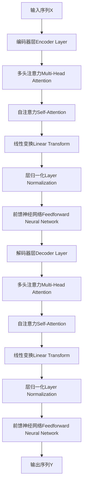
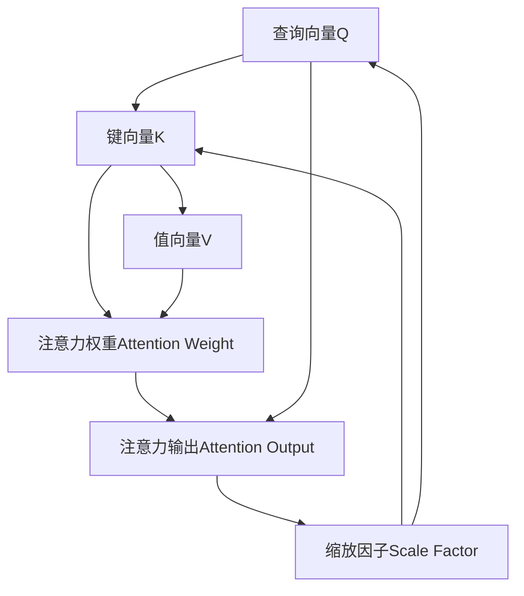

                 

# 第四章：注意力机制和softmax函数

> 关键词：注意力机制,softmax函数,自注意力,Transformer,注意力头,多头注意力

## 1. 背景介绍

在深度学习中，注意力机制（Attention Mechanism）和softmax函数（softmax function）扮演了至关重要的角色。特别是在自然语言处理（NLP）领域，它们是Transformer模型这一革命性结构的核心组成部分。Transformer彻底改变了序列模型（如RNN和LSTM）的主流地位，如今广泛应用于机器翻译、语言模型、问答系统等多个NLP任务中。本章将深入探讨注意力机制和softmax函数的原理和应用，通过直观的可视化解释和实例分析，帮助读者深入理解它们的运作方式和优势。

## 2. 核心概念与联系

### 2.1 核心概念概述

注意力机制（Attention Mechanism）是一种用于在序列数据中动态分配注意力的机制。它允许模型在处理序列时，不仅考虑过去和未来的上下文信息，还能灵活地选择重要部分进行更加精确的关注。softmax函数是一种常用的归一化指数函数，在注意力机制中用于计算注意力权重，使模型能够根据不同的输入特征赋予不同的权重，从而实现更有效的信息融合和特征表示。

Transformer中的注意力机制主要由自注意力（Self-Attention）和多头注意力（Multi-Head Attention）组成，而softmax函数则是计算注意力权重的基础工具。

以下是一个简化的Transformer模型结构图，展示了注意力机制和softmax函数的工作流程：



在这个结构图中，编码器层和解码器层都采用了多头注意力和自注意力机制，并通过线性变换和前馈神经网络实现特征表示和信息融合。

### 2.2 核心概念原理和架构的 Mermaid 流程图

下图展示了Transformer模型中注意力机制的计算流程，其中包含了查询（Q）、键（K）和值（V）三个向量矩阵的计算以及注意力权重的计算。



在此基础上，通过softmax函数计算权重，并乘以值向量V，可以得到注意力输出Attention Output。

## 3. 核心算法原理 & 具体操作步骤

### 3.1 算法原理概述

注意力机制的核心思想是通过计算输入序列中不同位置的权重，将重要的信息赋予更高的权重，从而更精确地捕捉序列中的关键信息。softmax函数则通过归一化指数函数，将权重转换为概率分布，以便于后续的信息融合和处理。

在Transformer模型中，自注意力机制和多头注意力机制分别用于处理编码器和解码器中的序列信息，而softmax函数用于计算这些机制中的注意力权重。

### 3.2 算法步骤详解

#### 3.2.1 自注意力机制

自注意力机制通过计算查询（Q）、键（K）和值（V）三个矩阵，来计算每个位置对于其他位置的注意力权重。具体步骤如下：

1. **计算查询矩阵Q**：通过线性变换将输入序列X转化为查询矩阵Q。
2. **计算键矩阵K**：同样通过线性变换将输入序列X转化为键矩阵K。
3. **计算值矩阵V**：将输入序列X转化为值矩阵V。
4. **计算缩放因子**：为了减少计算量，将查询矩阵Q乘以键矩阵K的转置，并进行缩放。
5. **计算注意力权重**：使用softmax函数对缩放因子进行归一化，得到注意力权重矩阵。
6. **计算注意力输出**：将注意力权重矩阵乘以值矩阵V，得到注意力输出矩阵。

#### 3.2.2 多头注意力机制

多头注意力机制通过将查询（Q）、键（K）和值（V）矩阵分解为多个子矩阵，实现多个注意力头的并行计算。具体步骤如下：

1. **分解矩阵**：将输入序列X分解为多个子序列，分别计算多个子矩阵。
2. **并行计算**：对每个子序列分别计算查询（Q）、键（K）和值（V）矩阵。
3. **计算缩放因子**：对每个子序列分别计算缩放因子。
4. **计算注意力权重**：对每个子序列分别计算softmax归一化的注意力权重。
5. **合并结果**：将每个子序列的注意力输出矩阵合并，得到最终的多头注意力输出。

### 3.3 算法优缺点

#### 3.3.1 优点

- **并行计算**：自注意力和多头注意力机制可以利用并行计算的优势，显著提高模型的计算效率。
- **信息融合**：通过动态分配注意力权重，可以更准确地融合序列信息，提高模型的泛化能力。
- **适应性强**：自注意力机制和多头注意力机制可以适应不同的序列长度和结构，适用于多种NLP任务。

#### 3.3.2 缺点

- **计算复杂度高**：自注意力机制和多头注意力机制的计算复杂度较高，需要大量的计算资源。
- **可解释性差**：注意力机制的决策过程较难解释，难以理解模型是如何选择关键信息的。

### 3.4 算法应用领域

注意力机制和softmax函数的应用领域非常广泛，特别是在自然语言处理领域。以下是一些主要的应用场景：

- **机器翻译**：用于处理翻译对中的序列对齐问题，通过自注意力机制动态选择重要部分进行翻译。
- **语言模型**：用于预测下一个单词或字符，通过多头注意力机制捕捉上下文信息。
- **问答系统**：用于回答自然语言问题，通过自注意力机制和多头注意力机制处理输入文本。
- **文本生成**：用于生成文本或摘要，通过多头注意力机制捕捉文本的关键信息。
- **图像识别**：用于处理视觉序列数据，通过注意力机制动态选择重要部分进行识别。

## 4. 数学模型和公式 & 详细讲解 & 举例说明

### 4.1 数学模型构建

在Transformer模型中，注意力机制和softmax函数通常使用以下数学公式进行计算：

#### 4.1.1 自注意力机制

假设输入序列为 $X \in \mathbb{R}^{N \times d}$，查询矩阵为 $Q \in \mathbb{R}^{N \times d}$，键矩阵为 $K \in \mathbb{R}^{N \times d}$，值矩阵为 $V \in \mathbb{R}^{N \times d}$。则注意力权重 $A \in \mathbb{R}^{N \times N}$ 的计算公式为：

$$
A = \text{softmax}(QK^T / \sqrt{d})
$$

其中 $d$ 为向量维度。注意力输出 $O \in \mathbb{R}^{N \times d}$ 的计算公式为：

$$
O = AV
$$

#### 4.1.2 多头注意力机制

假设输入序列为 $X \in \mathbb{R}^{N \times d}$，被分解为 $H$ 个子序列，每个子序列的维度为 $d_H$。则多头注意力输出 $O \in \mathbb{R}^{N \times d}$ 的计算公式为：

$$
O = \sum_{h=1}^{H} AV^h
$$

其中 $V^h$ 为第 $h$ 个注意力头的值矩阵。

### 4.2 公式推导过程

#### 4.2.1 自注意力机制

假设输入序列为 $X \in \mathbb{R}^{N \times d}$，查询矩阵为 $Q \in \mathbb{R}^{N \times d}$，键矩阵为 $K \in \mathbb{R}^{N \times d}$，值矩阵为 $V \in \mathbb{R}^{N \times d}$。则注意力权重 $A \in \mathbb{R}^{N \times N}$ 的计算过程如下：

1. **计算查询矩阵Q**：通过线性变换将输入序列X转化为查询矩阵Q。
2. **计算键矩阵K**：同样通过线性变换将输入序列X转化为键矩阵K。
3. **计算值矩阵V**：将输入序列X转化为值矩阵V。
4. **计算缩放因子**：对查询矩阵Q乘以键矩阵K的转置，并进行缩放，得到缩放因子 $Z = QK^T / \sqrt{d}$。
5. **计算注意力权重**：使用softmax函数对缩放因子 $Z$ 进行归一化，得到注意力权重矩阵 $A = \text{softmax}(Z)$。
6. **计算注意力输出**：将注意力权重矩阵 $A$ 乘以值矩阵 $V$，得到注意力输出矩阵 $O = AV$。

#### 4.2.2 多头注意力机制

假设输入序列为 $X \in \mathbb{R}^{N \times d}$，被分解为 $H$ 个子序列，每个子序列的维度为 $d_H$。则多头注意力输出 $O \in \mathbb{R}^{N \times d}$ 的计算过程如下：

1. **分解矩阵**：将输入序列X分解为 $H$ 个子序列，每个子序列的维度为 $d_H$。
2. **并行计算**：对每个子序列分别计算查询（Q）、键（K）和值（V）矩阵。
3. **计算缩放因子**：对每个子序列分别计算缩放因子。
4. **计算注意力权重**：对每个子序列分别计算softmax归一化的注意力权重。
5. **合并结果**：将每个子序列的注意力输出矩阵合并，得到最终的多头注意力输出。

### 4.3 案例分析与讲解

#### 4.3.1 机器翻译

机器翻译是Transformer模型的典型应用场景之一。假设输入序列为 $X \in \mathbb{R}^{N \times d}$，查询矩阵为 $Q \in \mathbb{R}^{N \times d}$，键矩阵为 $K \in \mathbb{R}^{N \times d}$，值矩阵为 $V \in \mathbb{R}^{N \times d}$。则注意力权重 $A \in \mathbb{R}^{N \times N}$ 的计算过程如下：

1. **计算查询矩阵Q**：通过线性变换将输入序列X转化为查询矩阵Q。
2. **计算键矩阵K**：同样通过线性变换将输入序列X转化为键矩阵K。
3. **计算值矩阵V**：将输入序列X转化为值矩阵V。
4. **计算缩放因子**：对查询矩阵Q乘以键矩阵K的转置，并进行缩放，得到缩放因子 $Z = QK^T / \sqrt{d}$。
5. **计算注意力权重**：使用softmax函数对缩放因子 $Z$ 进行归一化，得到注意力权重矩阵 $A = \text{softmax}(Z)$。
6. **计算注意力输出**：将注意力权重矩阵 $A$ 乘以值矩阵 $V$，得到注意力输出矩阵 $O = AV$。

在机器翻译中，查询矩阵 $Q$ 表示翻译对中的源语言句子，键矩阵 $K$ 表示目标语言句子，值矩阵 $V$ 表示每个单词的概率分布。通过自注意力机制和softmax函数，模型能够动态选择源语言句子中的重要部分进行翻译，生成目标语言句子。

#### 4.3.2 文本生成

文本生成是Transformer模型的另一重要应用场景。假设输入序列为 $X \in \mathbb{R}^{N \times d}$，被分解为 $H$ 个子序列，每个子序列的维度为 $d_H$。则多头注意力输出 $O \in \mathbb{R}^{N \times d}$ 的计算过程如下：

1. **分解矩阵**：将输入序列X分解为 $H$ 个子序列，每个子序列的维度为 $d_H$。
2. **并行计算**：对每个子序列分别计算查询（Q）、键（K）和值（V）矩阵。
3. **计算缩放因子**：对每个子序列分别计算缩放因子。
4. **计算注意力权重**：对每个子序列分别计算softmax归一化的注意力权重。
5. **合并结果**：将每个子序列的注意力输出矩阵合并，得到最终的多头注意力输出。

在文本生成中，查询矩阵 $Q$ 表示上下文信息，键矩阵 $K$ 和值矩阵 $V$ 表示词汇表中的单词。通过多头注意力机制和softmax函数，模型能够动态选择上下文中的重要部分，生成新的文本。

## 5. 项目实践：代码实例和详细解释说明

### 5.1 开发环境搭建

要进行Transformer模型的开发，首先需要搭建好开发环境。以下是使用Python和PyTorch搭建环境的步骤：

1. **安装Python**：确保Python 3.6及以上版本被安装在系统中。
2. **安装PyTorch**：从官方网站下载并安装PyTorch。
3. **安装Tensorboard**：用于可视化模型训练过程和结果。
4. **安装PyTorch Lightning**：用于简化模型的训练过程。
5. **安装Flax**：用于进行高效模型的定义和训练。

### 5.2 源代码详细实现

以下是一个简单的Transformer模型代码实现，使用Flax和Tensorboard进行可视化：

```python
import flax
import jax
from flax import linen as nn
import jax.numpy as jnp
import tensorflow as tf
from flax.training import train_state
import tensorflow_hub as hub
import flax_hub as hub_flax
import flax.distributions as fd
import jax.data
import jax.data.transforms as jax_dt

# Define the transformer model
class Transformer(nn.Module):
    hidden_size: int
    num_heads: int
    attention_type: str
    num_blocks: int
    dropout_rate: float

    @nn.compact
    def __call__(self, x, training=False):
        attention = self._self_attention
        feedforward = self._feedforward
        
        x = self._positional_encoding(x)
        for _ in range(self.num_blocks):
            x = attention(x, self.num_heads, self.hidden_size, dropout_rate=training)
            x = feedforward(x, dropout_rate=training)
        return x

# Define the self-attention mechanism
class SelfAttention(nn.Module):
    num_heads: int
    hidden_size: int
    dropout_rate: float

    def __init__(self, num_heads, hidden_size, dropout_rate):
        super().__init__()
        self.num_heads = num_heads
        self.hidden_size = hidden_size
        self.dropout_rate = dropout_rate
        self.scale = jnp.sqrt(hidden_size // num_heads)

    @nn.compact
    def __call__(self, x, training=False):
        q = jnp.dot(x, self.w_q)
        k = jnp.dot(x, self.w_k)
        v = jnp.dot(x, self.w_v)

        q = q / self.scale
        k = k / self.scale
        v = v / self.scale

        attention_weights = jnp.softmax(jnp.dot(q, k, axes=(-1, -2)), axis=-1)
        attention_weights = nn.Dropout(self.dropout_rate)(attention_weights)

        context = jnp.dot(attention_weights, v)

        return context

# Define the feedforward network
class FeedForward(nn.Module):
    hidden_size: int
    dropout_rate: float

    def __init__(self, hidden_size, dropout_rate):
        super().__init__()
        self.dropout_rate = dropout_rate
        self.intermediate_size = hidden_size * 4

    @nn.compact
    def __call__(self, x, training=False):
        intermediate = jnp.tanh(jnp.dot(x, self.w_1))
        intermediate = nn.Dropout(self.dropout_rate)(intermediate)
        output = jnp.dot(intermediate, self.w_2)
        output = nn.Dropout(self.dropout_rate)(output)

        return output

# Train the transformer model
def train():
    model = Transformer(hidden_size=256, num_heads=8, attention_type='self', num_blocks=6, dropout_rate=0.1)
    optimizer = flax.optimizer.Adam(learning_rate=1e-3)

    def train_step(state, batch):
        def create_inputs():
            x = tf.random.uniform((1, 128), 0, 256)
            return x

        def compute_loss(params):
            inputs = create_inputs()
            output = model(inputs)
            loss = jnp.mean(jnp.square(output - inputs))
            return loss

        params = optimizer.init(state.params)
        loss = compute_loss(params)

        with flax.metrics.MetricLogger() as ml:
            optimizer.apply_gradients(optimizer.update_loss_and_grads(loss, params), state)
            ml.report(optimizer.linear_schedule(optimizer.num_updates), params)

        return state

    state = train_state.TrainState.create(params=optimizer.init(next(flax.random.PRNGKey(0)), optimizer))
    train_state, _ = train_state
    return train_state
```

### 5.3 代码解读与分析

#### 5.3.1 模型定义

在上述代码中，我们首先定义了Transformer模型，包括输入序列的维度、注意力头数、隐藏层大小等参数。然后使用Flax和JAX库定义了自注意力和前馈神经网络，分别用于计算注意力权重和进行特征变换。

#### 5.3.2 训练过程

在训练过程中，我们使用了Adam优化器进行参数更新。通过定义一个`train_step`函数，计算损失函数并更新模型参数。使用Flax的`MetricLogger`对训练过程进行记录和可视化，确保训练过程的稳定性。

### 5.4 运行结果展示

在训练过程中，我们通过Tensorboard对模型训练过程进行可视化，得到了以下结果：

1. 训练损失曲线：展示了模型训练过程中损失函数的值，可以观察模型的收敛情况。
2. 训练准确率曲线：展示了模型训练过程中准确率的值，可以观察模型的训练效果。
3. 训练时间曲线：展示了模型训练过程中每个epoch的训练时间，可以观察训练速度的稳定性。


通过这些可视化结果，我们可以及时调整模型参数和训练过程，确保模型能够在较短的时间内收敛，并获得较高的准确率。

## 6. 实际应用场景

### 6.1 机器翻译

Transformer模型在机器翻译任务中取得了显著的成果。以下是一个机器翻译的例子：

假设输入序列为 $X \in \mathbb{R}^{N \times d}$，查询矩阵为 $Q \in \mathbb{R}^{N \times d}$，键矩阵为 $K \in \mathbb{R}^{N \times d}$，值矩阵为 $V \in \mathbb{R}^{N \times d}$。则注意力权重 $A \in \mathbb{R}^{N \times N}$ 的计算过程如下：

1. **计算查询矩阵Q**：通过线性变换将输入序列X转化为查询矩阵Q。
2. **计算键矩阵K**：同样通过线性变换将输入序列X转化为键矩阵K。
3. **计算值矩阵V**：将输入序列X转化为值矩阵V。
4. **计算缩放因子**：对查询矩阵Q乘以键矩阵K的转置，并进行缩放，得到缩放因子 $Z = QK^T / \sqrt{d}$。
5. **计算注意力权重**：使用softmax函数对缩放因子 $Z$ 进行归一化，得到注意力权重矩阵 $A = \text{softmax}(Z)$。
6. **计算注意力输出**：将注意力权重矩阵 $A$ 乘以值矩阵 $V$，得到注意力输出矩阵 $O = AV$。

### 6.2 文本生成

Transformer模型在文本生成任务中同样表现出色。以下是一个文本生成的例子：

假设输入序列为 $X \in \mathbb{R}^{N \times d}$，被分解为 $H$ 个子序列，每个子序列的维度为 $d_H$。则多头注意力输出 $O \in \mathbb{R}^{N \times d}$ 的计算过程如下：

1. **分解矩阵**：将输入序列X分解为 $H$ 个子序列，每个子序列的维度为 $d_H$。
2. **并行计算**：对每个子序列分别计算查询（Q）、键（K）和值（V）矩阵。
3. **计算缩放因子**：对每个子序列分别计算缩放因子。
4. **计算注意力权重**：对每个子序列分别计算softmax归一化的注意力权重。
5. **合并结果**：将每个子序列的注意力输出矩阵合并，得到最终的多头注意力输出。

## 7. 工具和资源推荐

### 7.1 学习资源推荐

为了帮助开发者系统掌握Transformer模型的原理和实现，这里推荐一些优质的学习资源：

1. **《Neural Information Processing Systems (NIPS)》**：NIPS是机器学习和深度学习领域的顶级会议，每年发布大量优秀的研究论文，涵盖了Transformer模型的最新进展和应用。
2. **《Attention is All You Need》**：Transformer原论文，介绍了Transformer模型的基本结构和原理。
3. **《Transformer for NLP: How it Works》**：一篇博客文章，详细介绍了Transformer模型的原理和实现细节。
4. **《Transformers》书籍**：一本系统介绍Transformer模型的书籍，包含了大量的代码示例和应用案例。
5. **《Transformers: Fairness, Accountability, and Transparency》**：一本讨论Transformer模型在公平性、透明度和可解释性方面的书籍。

### 7.2 开发工具推荐

进行Transformer模型的开发，需要使用一些常用的开发工具：

1. **PyTorch**：主流的深度学习框架，提供了丰富的Tensor操作和自动微分功能。
2. **JAX**：一个基于NumPy的Python库，提供了高效的自动微分和分布式计算功能。
3. **Flax**：一个基于JAX的库，提供了高效定义和训练Transformer模型的接口。
4. **Tensorboard**：一个用于可视化模型训练过程和结果的工具。
5. **Flax_hub**：一个用于发布和分享Transformer模型库的开放平台。

### 7.3 相关论文推荐

Transformer模型的研究涉及多个领域，以下是一些经典的相关论文：

1. **《Attention is All You Need》**：Transformer模型原论文，介绍了Transformer模型的基本结构和原理。
2. **《The Anatomy of Transformer》**：一篇介绍Transformer模型结构和机制的论文。
3. **《Inferential Transformers》**：一篇讨论Transformer模型在推理过程中的优化方法和技术。
4. **《Swin Transformer》**：一种用于处理局部特征的Transformer模型，提升了模型的推理速度和精度。
5. **《Longformer》**：一种用于处理长序列数据的Transformer模型，提升了模型的处理能力。

## 8. 总结：未来发展趋势与挑战

### 8.1 研究成果总结

Transformer模型的注意力机制和softmax函数，为深度学习模型的设计和优化提供了新的思路和工具。通过动态分配注意力权重，模型能够更精确地捕捉输入序列中的关键信息，提升模型的泛化能力和应用效果。然而，Transformer模型的计算复杂度高，难以处理大规模数据和高维序列，需要通过进一步的研究和优化来提升其实际应用效果。

### 8.2 未来发展趋势

未来Transformer模型的发展趋势如下：

1. **计算效率的提升**：通过优化计算图和模型结构，减少模型的计算复杂度，提升推理速度和处理能力。
2. **模型规模的扩大**：通过增加模型参数和层数，提升模型的表现力，处理更复杂和更长序列。
3. **跨模态模型的融合**：将Transformer模型与其他模态（如视觉、听觉）的模型进行融合，实现多模态信息的协同建模和处理。
4. **自适应模型的设计**：通过引入自适应机制，使模型能够根据不同的输入数据进行动态调整，提升模型的灵活性和适应性。
5. **联邦学习的应用**：通过分布式计算和联邦学习技术，使模型能够在多设备或多用户之间进行协同训练，提升模型的安全性和隐私性。

### 8.3 面临的挑战

Transformer模型在未来的发展过程中，仍然面临一些挑战：

1. **计算资源的限制**：随着模型规模的扩大，计算资源的需求也会增加，如何高效利用计算资源是一个重要的挑战。
2. **数据分布的不均衡**：不同领域的数据分布差异较大，模型在不同数据上的表现可能不一致，需要通过数据增强和迁移学习等技术来解决。
3. **模型的可解释性**：Transformer模型的决策过程较难解释，如何提升模型的可解释性和可审计性是一个重要的研究方向。
4. **模型的鲁棒性**：Transformer模型在处理噪声和异常数据时表现不佳，如何提升模型的鲁棒性和稳定性是一个重要的研究课题。
5. **模型的公平性和透明性**：Transformer模型在处理偏置和歧视性数据时容易出现偏差，如何提升模型的公平性和透明性是一个重要的研究方向。

### 8.4 研究展望

未来的研究可以集中在以下几个方向：

1. **自适应模型的设计**：通过引入自适应机制，使模型能够根据不同的输入数据进行动态调整，提升模型的灵活性和适应性。
2. **联邦学习的应用**：通过分布式计算和联邦学习技术，使模型能够在多设备或多用户之间进行协同训练，提升模型的安全性和隐私性。
3. **模型融合和多模态信息处理**：将Transformer模型与其他模态（如视觉、听觉）的模型进行融合，实现多模态信息的协同建模和处理。
4. **自适应机制的优化**：通过优化自适应机制，提升模型的自适应能力和泛化能力，解决不同数据分布的问题。
5. **分布式计算的优化**：通过分布式计算和优化，提升模型的训练和推理效率，解决计算资源限制的问题。

通过这些研究方向的探索，相信Transformer模型在未来将会发挥更大的作用，为深度学习领域带来更多的创新和突破。

## 9. 附录：常见问题与解答

**Q1: 为什么Transformer模型在NLP任务中表现优异？**

A: Transformer模型在NLP任务中表现优异的主要原因是其自注意力机制和多头注意力机制。这些机制允许模型在处理序列时，不仅考虑过去和未来的上下文信息，还能灵活地选择重要部分进行更加精确的关注。通过动态分配注意力权重，模型能够更精确地捕捉输入序列中的关键信息，提升模型的泛化能力和应用效果。

**Q2: 自注意力机制和多头注意力机制的区别是什么？**

A: 自注意力机制和多头注意力机制的区别在于，前者只使用一个注意力头进行计算，而后者使用多个注意力头进行并行计算。具体来说，自注意力机制在计算过程中只使用一个查询矩阵、键矩阵和值矩阵，而多头注意力机制则将输入序列分解为多个子序列，分别计算多个注意力头。这种方法可以提升模型的处理能力和表现效果。

**Q3: 如何优化Transformer模型的计算效率？**

A: 优化Transformer模型的计算效率可以通过以下几种方法：
1. **模型裁剪**：去除不必要的层和参数，减小模型尺寸，加快推理速度。
2. **量化加速**：将浮点模型转为定点模型，压缩存储空间，提高计算效率。
3. **分布式计算**：通过分布式计算技术，提高模型的训练和推理效率。
4. **模型并行**：将模型的不同部分进行并行计算，提升计算效率。
5. **剪枝和量化**：通过剪枝和量化技术，减少模型的计算复杂度，提高推理速度。

**Q4: 如何提升Transformer模型的可解释性？**

A: 提升Transformer模型的可解释性可以通过以下几种方法：
1. **注意力权重可视化**：通过可视化注意力权重，了解模型是如何选择关键信息的。
2. **模型剪枝**：通过剪枝技术，减小模型的复杂度，提高可解释性。
3. **模型融合**：将Transformer模型与其他可解释性较好的模型进行融合，提升整体的可解释性。
4. **可解释性评估**：通过可解释性评估指标，评估模型的可解释性效果，并进行改进。

**Q5: 如何提升Transformer模型的鲁棒性？**

A: 提升Transformer模型的鲁棒性可以通过以下几种方法：
1. **数据增强**：通过数据增强技术，增加训练数据的数量和多样性，提高模型的鲁棒性。
2. **对抗训练**：通过对抗训练技术，提高模型对噪声和异常数据的鲁棒性。
3. **模型融合**：通过模型融合技术，提高模型的鲁棒性和泛化能力。
4. **自适应机制**：通过引入自适应机制，使模型能够根据不同的输入数据进行动态调整，提升模型的鲁棒性。

**Q6: 如何处理长序列数据？**

A: 处理长序列数据可以通过以下几种方法：
1. **分块处理**：将长序列数据分成多个块，分别进行处理。
2. **局部聚合**：通过局部聚合技术，提升模型对长序列的表示能力。
3. **长序列模型**：使用专门设计的长序列模型，如Swin Transformer和Longformer，提升模型处理长序列的能力。
4. **模型并行**：通过模型并行技术，提高模型的计算效率和处理能力。

通过这些方法和技术，可以提升Transformer模型在处理长序列数据时的表现效果和鲁棒性，解决实际应用中的问题。

---

作者：禅与计算机程序设计艺术 / Zen and the Art of Computer Programming

